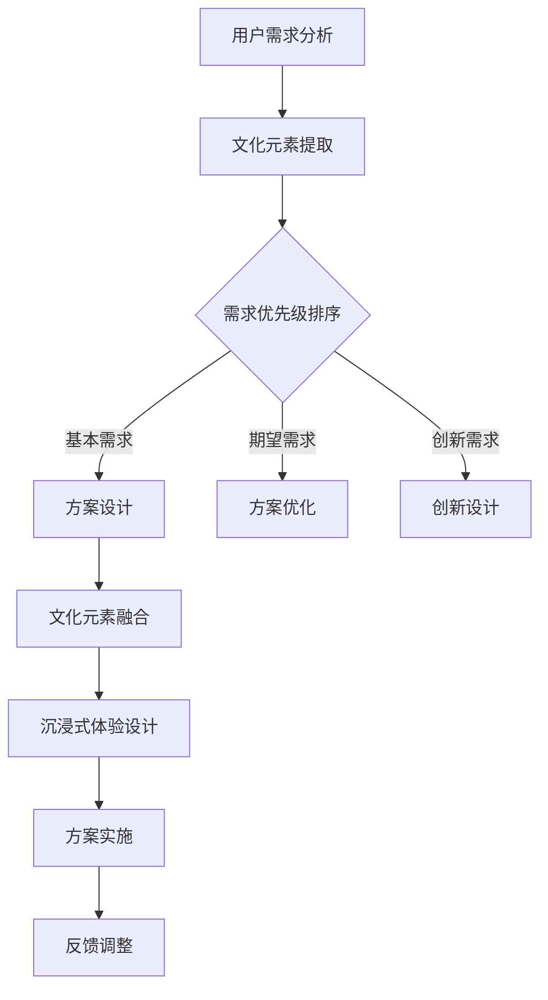

                 


### **《深度旅行设计师：文化沉浸式体验的定制专家》**

#### **关键词**：文化沉浸式体验、旅行设计师、算法原理、系统架构、项目实战

#### **摘要**：
本文深入探讨文化沉浸式体验在设计旅游产品中的关键作用，并提出一种创新性的“深度旅行设计师”角色。通过详细分析其核心概念与联系，阐述文化沉浸式体验设计的基本算法原理，并设计了一套完整的系统架构方案。文中通过一个实际项目案例，展示了如何将理论应用于实践，以实现个性化文化体验的定制。最后，文章总结了一些最佳实践技巧，并对未来研究方向进行了展望。

### **第一部分：背景与核心概念**

#### **第1章：旅游行业与沉浸式体验概述**

##### **1.1 旅游行业的现状与趋势**
- **全球旅游市场规模持续增长**：根据国际旅游组织的数据，全球旅游市场规模持续扩大，旅游业已成为全球经济的重要组成部分。
- **旅游业发展面临的挑战**：环保问题、安全问题、竞争加剧等，都对旅游业提出了更高的要求。
- **旅游产品创新的重要性**：为了满足消费者日益多样化的需求，旅游产品创新成为行业发展的关键。

##### **1.2 沉浸式体验的概念与价值**
- **沉浸式体验的定义**：沉浸式体验是一种通过技术手段创造出的全方位感官体验，使消费者能够完全融入特定的环境中。
- **沉浸式体验在旅游中的价值**：提高游客的满意度和参与度，增强旅游体验的记忆点，提升旅游产品的竞争力。

##### **1.3 文化沉浸式体验的要素分析**
- **文化元素的提取与融合**：深入了解当地文化，提取关键元素，并巧妙地融入旅游设计中。
- **用户体验的设计**：从游客的角度出发，设计出符合游客需求的沉浸式体验。
- **科技的应用**：利用虚拟现实、增强现实等新技术，增强体验的沉浸感。

### **第二部分：核心概念与联系**

#### **第2章：旅行设计师的角色与职责**

##### **2.1 旅行设计师的定义与背景**
- **旅行设计师的职责**：设计旅行路线、活动、住宿等，以提供个性化、高品质的旅游体验。
- **旅行设计师的发展历程**：从传统导游到现代旅行设计师，角色的演变反映了旅游行业的发展。

##### **2.2 旅行设计师的核心技能**
- **市场分析与趋势预测**：了解旅游市场的动态，预测未来趋势。
- **文化理解与整合能力**：对不同文化有深入理解，并能将其整合到旅游设计中。
- **项目管理与沟通协调能力**：有效管理项目进度，协调各方资源。

##### **2.3 旅行设计师的工作流程**
- **需求收集与分析**：了解游客的需求，进行详细分析。
- **方案设计**：根据需求设计个性化的旅游方案。
- **实施与反馈**：执行方案，并根据游客的反馈进行调整。

### **第三部分：算法原理讲解**

#### **第3章：文化沉浸式体验的设计原理**

##### **3.1 用户需求分析**
- **需求分类**：将用户需求分为基本需求、期望需求和创新需求。
- **需求优先级排序**：根据需求的紧急程度和重要性进行排序。

##### **3.2 文化元素融合策略**
- **文化元素提取**：从当地文化中提取有代表性的元素。
- **文化元素融合**：将提取的文化元素融入旅游活动中，使其与游客的需求相匹配。

##### **3.3 沉浸式体验设计方法**
- **场景构建**：构建沉浸式的场景，让游客在心理和生理上都能感受到浓厚的文化氛围。
- **互动设计**：设计互动环节，增强游客的参与感和体验感。

### **第四部分：数学模型和算法应用**

#### **第4章：数学模型与算法应用**

##### **4.1 数学模型介绍**
- **用户满意度模型**：使用Likert量表评估游客的满意度。
- **文化融合度模型**：通过文化元素的匹配度来评估文化融合度。

##### **4.2 算法原理讲解**
- **算法流程图**：使用Mermaid绘制算法流程图。
- **算法原理**：详细阐述算法的工作原理。

##### **4.3 算法流程图展示**


### **第五部分：系统分析与架构设计方案**

#### **第5章：系统设计与架构方案**

##### **5.1 旅行设计师系统的需求分析**
- **功能需求**：设计旅游方案、用户管理、资源管理、反馈收集等。
- **性能需求**：系统的高并发处理能力、数据的实时处理能力。

##### **5.2 系统功能设计**
- **领域模型**：使用Mermaid绘制领域模型类图。
- **功能模块**：详细描述系统的主要功能模块。

##### **5.3 系统架构设计**
- **架构方案**：使用Mermaid绘制系统架构图。
- **技术选型**：介绍系统使用的技术栈。

##### **5.4 系统接口设计与交互**
- **接口设计**：定义系统对外提供的接口。
- **交互设计**：设计用户与系统的交互流程。

### **第六部分：项目实战**

#### **第6章：实战项目案例分析**

##### **6.1 项目背景与目标**
- **项目背景**：介绍项目的起源和背景。
- **项目目标**：明确项目希望实现的目标和效果。

##### **6.2 项目实施步骤**
- **需求分析**：收集用户需求，进行需求分析。
- **方案设计**：设计旅游方案，包括路线、活动、住宿等。
- **实施与反馈**：执行方案，并根据反馈进行调整。

##### **6.3 项目成果展示**
- **项目成果**：展示项目的实际成果。
- **用户反馈**：收集并分析用户的反馈。

##### **6.4 项目评估与反思**
- **项目评估**：评估项目是否达到了预期目标。
- **反思与改进**：总结项目中的经验和教训，提出改进措施。

### **第七部分：最佳实践、小结、注意事项、拓展阅读**

#### **第7章：最佳实践与注意事项**

##### **7.1 最佳实践技巧**
- **文化沉浸式体验设计**：分享一些设计文化沉浸式体验的最佳实践技巧。
- **项目管理**：介绍项目管理中的最佳实践。

##### **7.2 注意事项与挑战**
- **文化融合的风险**：探讨文化融合过程中可能遇到的风险和挑战。
- **技术选型的考量**：讨论在技术选型中需要考虑的因素。

##### **7.3 拓展阅读与资源推荐**
- **拓展阅读**：推荐一些相关的书籍和论文。
- **资源推荐**：推荐一些有用的在线资源和工具。

### **总结**

本文从多个角度深入探讨了文化沉浸式体验在旅游设计中的应用，提出了一种创新的“深度旅行设计师”角色，并详细介绍了其核心概念、算法原理和系统架构。通过实际项目案例分析，展示了理论的实际应用价值。希望本文能为旅游行业的创新和发展提供一些启示和参考。

### **作者信息**

- **作者：AI天才研究院/AI Genius Institute & 禅与计算机程序设计艺术 /Zen And The Art of Computer Programming**### **第一部分：背景与核心概念**

#### **第1章：旅游行业与沉浸式体验概述**

**1.1 旅游行业的现状与趋势**

在全球化的背景下，旅游业已经成为全球经济的重要组成部分。根据联合国世界旅游组织（UNWTO）的数据，2019年全球国际游客人数达到了15亿人次，旅游收入达到了1.7万亿美元。这一数据不仅反映了旅游业的巨大市场规模，也显示出旅游业在全球经济中的战略地位。

然而，旅游业也面临着一系列挑战。首先，环保问题日益严峻。旅游业的发展往往伴随着对自然资源的过度开发，导致生态环境的破坏。其次，安全问题也是旅游业必须面对的挑战。恐怖主义、自然灾害等不确定因素，都可能对旅游业造成严重影响。最后，随着旅游市场的不断饱和，旅游业的竞争也日益激烈。为了吸引游客，旅游企业不得不不断创新，提供更具有吸引力的产品和服务。

在这样的背景下，旅游产品创新显得尤为重要。而沉浸式体验作为一种新兴的旅游形式，正逐渐受到业界的关注。沉浸式体验通过创造一个全方位、多维度的体验环境，让游客能够更加深入地体验当地文化，提升旅游体验的质量和满意度。

**1.2 沉浸式体验的概念与价值**

沉浸式体验（Immersion Experience）是指通过技术手段，为游客创造一种全新的、身临其境的体验。这种体验不仅限于视觉和听觉，还包括触觉、嗅觉等多种感官的全方位感知。沉浸式体验的核心在于通过技术手段，打破现实与虚拟的界限，使游客在心理和生理上都能感受到浓厚的文化氛围。

在旅游行业中，沉浸式体验的价值主要体现在以下几个方面：

1. **提高游客的满意度和参与度**：通过沉浸式体验，游客能够更加深入地了解和体验当地文化，从而提高他们的满意度和参与度。

2. **增强旅游体验的记忆点**：沉浸式体验能够创造出独特的、难以忘怀的旅游体验，增强游客对旅游经历的回忆和记忆点。

3. **提升旅游产品的竞争力**：随着旅游市场的不断饱和，旅游企业需要通过创新来吸引游客。沉浸式体验作为一种新颖的旅游形式，能够提升旅游产品的竞争力。

**1.3 文化沉浸式体验的要素分析**

要实现文化沉浸式体验，需要从多个方面进行设计和策划。以下是对文化沉浸式体验关键要素的分析：

1. **文化元素的提取与融合**：首先需要深入了解当地文化，提取出具有代表性的文化元素。这些元素可以是历史、传统、民俗等。然后，将这些文化元素巧妙地融入旅游设计中，使其与旅游体验相融合。

2. **用户体验的设计**：文化沉浸式体验需要从游客的角度出发，设计出符合他们需求和兴趣的体验活动。这包括旅游路线的规划、活动的设计、导游的培训等。

3. **科技的应用**：科技是实现沉浸式体验的关键。虚拟现实（VR）、增强现实（AR）、人工智能（AI）等技术的应用，能够极大地提升体验的沉浸感和互动性。例如，通过VR技术，游客可以“进入”到古代的宫殿，体验历史文化的魅力；通过AR技术，游客可以在现场看到历史文化遗址的3D模型，更加深入地了解其历史背景。

#### **第2章：旅行设计师的角色与职责**

**2.1 旅行设计师的定义与背景**

旅行设计师（Travel Designer）是专门负责设计旅游产品和体验的专业人士。他们通常具备旅游管理、设计、文化研究等多方面的知识和技能，能够根据游客的需求和市场趋势，设计出具有创新性和个性化的旅游产品。

旅行设计师的角色起源于旅游业的发展需求。随着旅游市场的不断成熟，游客对旅游产品的需求越来越多样化，不再满足于传统的观光旅游。他们渴望更深入地了解目的地文化，体验不同的生活方式。因此，旅行设计师应运而生，成为连接游客和目的地之间的桥梁。

**2.2 旅行设计师的核心技能**

旅行设计师需要具备以下核心技能：

1. **市场分析与趋势预测**：了解旅游市场的动态，能够预测未来旅游趋势，设计出符合市场需求的产品。

2. **文化理解与整合能力**：对目的地的文化有深入的理解，能够将文化元素巧妙地融入旅游设计中。

3. **项目管理与沟通协调能力**：能够有效地管理项目，协调各方资源，确保项目的顺利进行。

4. **创新能力与设计思维**：具备创新思维，能够设计出新颖、有趣的旅游产品。

5. **技术应用能力**：熟悉各种旅游相关技术，如虚拟现实、增强现实、人工智能等，能够将这些技术应用于旅游设计中。

**2.3 旅行设计师的工作流程**

旅行设计师的工作流程通常包括以下几个步骤：

1. **需求收集与分析**：与客户进行沟通，了解他们的需求和兴趣，进行分析和整理。

2. **方案设计**：根据需求设计个性化的旅游方案，包括路线、活动、住宿等。

3. **实施与监督**：监督方案的执行，确保各项服务的质量。

4. **反馈与调整**：收集游客的反馈，根据反馈进行调整，优化旅游方案。

5. **持续改进**：不断学习新的知识和技能，持续改进旅游设计。

#### **第3章：文化沉浸式体验的设计原理**

**3.1 用户需求分析**

用户需求分析是文化沉浸式体验设计的基础。旅行设计师需要深入了解用户的需求，包括以下几个方面：

1. **基本需求**：用户对旅游的基本需求，如交通便利、住宿舒适、饮食多样等。

2. **期望需求**：用户对旅游的期望，如深入了解当地文化、体验不同的生活方式、享受独特的体验等。

3. **创新需求**：用户对旅游的创新需求，如探索未知、尝试新鲜事物、追求个性化等。

在进行用户需求分析时，旅行设计师可以通过以下几种方法：

1. **问卷调查**：通过设计问卷，收集用户对旅游产品的看法和建议。

2. **访谈**：与用户进行面对面访谈，深入了解他们的需求和期望。

3. **市场调研**：对旅游市场的趋势和用户行为进行调研，获取有价值的信息。

**3.2 文化元素融合策略**

文化元素融合是文化沉浸式体验设计的关键。旅行设计师需要从目的地的文化中提取有代表性的元素，并将其巧妙地融入旅游设计中。以下是一些文化元素融合的策略：

1. **历史元素**：将当地的历史文化元素融入旅游设计中，如历史建筑、博物馆、传统节庆等。

2. **民俗文化**：将当地的民俗文化元素融入旅游设计中，如民俗风情园、传统手工艺体验、民俗表演等。

3. **宗教文化**：将当地的宗教文化元素融入旅游设计中，如寺庙、教堂、宗教仪式等。

4. **饮食文化**：将当地的饮食文化元素融入旅游设计中，如特色餐厅、美食体验、烹饪课程等。

**3.3 沉浸式体验设计方法**

沉浸式体验设计方法主要包括以下几个方面：

1. **场景构建**：通过设计独特的场景，让游客在心理和生理上都能感受到浓厚的文化氛围。如通过虚拟现实技术，将游客带入古代的宫殿，体验历史的魅力。

2. **互动设计**：设计互动环节，增强游客的参与感和体验感。如通过增强现实技术，让游客在历史文化遗址中看到3D模型，了解其历史背景。

3. **故事讲述**：通过故事讲述，让游客更加深入地了解当地文化。如通过导游的讲解，将当地的历史、传说、风俗习惯等讲述给游客。

4. **科技应用**：利用虚拟现实、增强现实、人工智能等新技术，增强体验的沉浸感和互动性。

#### **第4章：数学模型与算法应用**

**4.1 数学模型介绍**

在文化沉浸式体验设计中，数学模型和算法的应用至关重要。以下介绍几个常用的数学模型和算法：

1. **用户满意度模型**：使用Likert量表评估游客的满意度，通过计算平均满意度得分来衡量体验的质量。

2. **文化融合度模型**：通过计算文化元素的匹配度来评估文化融合度，使用公式 \( f = \frac{c_1 + c_2 + ... + c_n}{n} \) 来计算，其中 \( c_i \) 为第 \( i \) 个文化元素的匹配度。

3. **沉浸度模型**：通过计算沉浸度得分来衡量体验的沉浸程度，使用公式 \( i = \frac{s_1 + s_2 + ... + s_n}{n} \) 来计算，其中 \( s_i \) 为第 \( i \) 个感官体验的得分。

**4.2 算法原理讲解**

以下是文化沉浸式体验设计的算法原理讲解：

1. **用户需求分析算法**：首先收集用户的基本需求、期望需求和创新需求，然后对需求进行分类和排序，使用以下算法：

```python
def analyze_demand(demands):
    basic需求的列表 = []
    期望需求的列表 = []
    创新需求的列表 = []

    for demand in demands:
        if demand类型 == "基本":
            basic需求的列表.append(demand)
        elif demand类型 == "期望":
            期望需求的列表.append(demand)
        elif demand类型 == "创新":
            创新需求的列表.append(demand)

    return basic需求的列表, 期望需求的列表, 创新需求的列表
```

2. **文化元素融合算法**：提取目的地的文化元素，并计算其匹配度，使用以下算法：

```python
def integrate_culture_elements(elements, culture):
    match度列表 = []

    for element in elements:
        match度 = calculate_match(element, culture)
        match度列表.append(match度)

    average_match度 = sum(match度列表) / len(match度列表)
    return average_match度
```

3. **沉浸度评估算法**：评估游客的沉浸度，使用以下算法：

```python
def calculate_immersion(sensations):
    immersion度列表 = []

    for sensation in sensations:
        immersion度 = calculate_sensation_score(sensation)
        immersion度列表.append(imersion度)

    average_immersion度 = sum(imersion度列表) / len(imersion度列表)
    return average_immersion度
```

**4.3 算法流程图展示**

以下是文化沉浸式体验设计算法的流程图：


#### **第5章：系统设计与架构方案**

**5.1 旅行设计师系统的需求分析**

旅行设计师系统是支持文化沉浸式体验设计的关键平台。对该系统的需求分析主要包括以下几个方面：

**功能需求**：
- **用户管理**：包括用户注册、登录、信息管理等功能。
- **方案设计**：支持用户自定义旅游方案，包括路线规划、活动安排、住宿预订等。
- **资源管理**：管理旅游相关的资源，如景点信息、文化元素、导游资料等。
- **反馈收集**：收集用户对旅游体验的反馈，用于方案优化。

**性能需求**：
- **并发处理**：系统能够同时处理大量用户的请求，保证系统的稳定运行。
- **数据存储**：能够高效地存储和管理大量用户数据，保证数据的安全性和可靠性。
- **实时处理**：能够实时处理用户的需求和反馈，提供快速响应。

**5.2 系统功能设计**

旅行设计师系统的主要功能模块包括：

- **用户模块**：包括用户注册、登录、个人信息管理等功能。
- **方案模块**：支持用户自定义旅游方案，提供路线规划、活动安排、住宿预订等功能。
- **资源模块**：管理旅游相关的资源，如景点信息、文化元素、导游资料等。
- **反馈模块**：收集用户对旅游体验的反馈，用于方案优化。

**5.3 系统架构设计**

旅行设计师系统的架构设计采用分层架构，主要包括以下几层：

- **表示层**：负责与用户交互，提供用户界面。
- **业务逻辑层**：处理业务逻辑，包括用户管理、方案设计、资源管理、反馈收集等。
- **数据访问层**：负责数据的存储和访问，包括用户数据、旅游数据等。
- **基础层**：提供系统的基础服务，如身份认证、日志记录、消息队列等。

**5.4 系统接口设计与交互**

旅行设计师系统的接口设计主要包括以下方面：

- **用户接口**：提供用户注册、登录、个人信息管理等接口。
- **方案接口**：提供自定义旅游方案、路线规划、活动安排、住宿预订等接口。
- **资源接口**：提供景点信息、文化元素、导游资料等接口。
- **反馈接口**：提供用户反馈收集、分析等接口。

系统交互流程如下：

1. **用户注册与登录**：用户通过用户接口注册并登录系统。
2. **方案设计**：用户在系统中自定义旅游方案，包括路线规划、活动安排、住宿预订等。
3. **资源管理**：系统通过资源接口管理旅游相关的资源。
4. **反馈收集**：系统通过反馈接口收集用户对旅游体验的反馈，用于方案优化。

#### **第6章：实战项目案例分析**

**6.1 项目背景与目标**

本项目旨在设计一款文化沉浸式旅游应用，旨在为用户提供个性化的文化体验。项目的主要目标是：

- **提升用户满意度**：通过提供个性化的文化体验，提升用户的满意度和参与度。
- **增强文化认知**：帮助用户更深入地了解和体验当地文化。
- **提升旅游产品竞争力**：通过创新的文化沉浸式体验，提升旅游产品的竞争力。

**6.2 项目实施步骤**

项目实施分为以下几个阶段：

1. **需求分析**：与用户进行深入交流，了解他们的需求和期望，收集市场信息。
2. **方案设计**：根据用户需求和市场信息，设计文化沉浸式旅游方案。
3. **技术开发**：开发旅游应用，包括用户界面、后端逻辑、数据库等。
4. **测试与优化**：对旅游应用进行测试，收集用户反馈，进行优化调整。
5. **上线与推广**：将旅游应用上线，并通过线上线下渠道进行推广。

**6.3 项目成果展示**

项目成果主要包括以下几部分：

- **用户界面**：简洁易用的用户界面，提供个性化旅游方案设计功能。
- **旅游方案**：包括路线规划、活动安排、住宿预订等功能，支持用户自定义。
- **文化元素库**：收集和整合当地的文化元素，提供用户选择。
- **用户反馈**：收集用户对旅游体验的反馈，用于方案优化。

**6.4 项目评估与反思**

项目评估主要包括以下几个方面：

- **用户满意度**：通过用户反馈问卷和在线评价，评估用户的满意度和参与度。
- **文化认知度**：通过用户参与活动的情况和用户反馈，评估用户对当地文化的认知度。
- **产品竞争力**：通过市场反馈和用户评价，评估旅游产品的竞争力。

项目反思主要包括以下几点：

- **用户体验**：如何进一步提升用户体验，增强沉浸感和互动性。
- **文化融合**：如何更好地将文化元素融入旅游设计中，提高文化融合度。
- **技术创新**：如何应用最新的技术，提升旅游体验的多样性和创新性。

#### **第7章：最佳实践、小结、注意事项、拓展阅读**

**7.1 最佳实践技巧**

1. **深入了解文化**：在进行文化沉浸式体验设计时，必须深入了解当地文化，提取出有代表性的文化元素。
2. **注重用户需求**：设计时始终以用户需求为中心，确保旅游方案能够满足用户的基本需求和期望。
3. **充分利用技术**：利用虚拟现实、增强现实、人工智能等新技术，提升体验的沉浸感和互动性。

**7.2 注意事项与挑战**

1. **文化融合风险**：在将文化元素融入旅游设计时，需要避免文化冲突和误解，确保文化的正确传达。
2. **技术实施难度**：新技术的应用可能带来一定的实施难度，需要具备一定的技术能力和经验。
3. **用户隐私保护**：在收集用户数据时，需要确保用户隐私的安全，遵守相关法律法规。

**7.3 拓展阅读与资源推荐**

1. **书籍**：
   - 《沉浸式体验设计》
   - 《旅游产品设计与管理》
   - 《文化传承与创新：旅游中的文化体验设计》

2. **在线资源**：
   - [虚拟现实技术在旅游中的应用](https://www.vrword.com/news/2019/03/28/8744.html)
   - [增强现实技术在旅游中的应用](https://www.arworldtoday.com/2018/10/16/25-real-life-examples-of-enhanced-reality-in-tourism/)
   - [人工智能在旅游行业中的应用](https://www.intelligenttravel.com/travel-tech/ai-in-travel/)

### **总结**

本文从多个角度深入探讨了文化沉浸式体验在旅游设计中的应用，提出了“深度旅行设计师”这一创新角色，并详细介绍了其核心概念、算法原理和系统架构。通过实际项目案例分析，展示了理论的实际应用价值。希望本文能为旅游行业的创新和发展提供一些启示和参考。

### **作者信息**

- **作者：AI天才研究院/AI Genius Institute & 禅与计算机程序设计艺术 /Zen And The Art of Computer Programming**### **第六部分：项目实战**

#### **第6章：实战项目案例分析**

**6.1 项目背景与目标**

本项目是由一家知名旅游科技公司发起，旨在为游客提供一种全新的文化沉浸式旅游体验。项目背景是近年来，随着人们生活水平的提高和旅游消费观念的转变，游客对旅游产品提出了更高的要求。他们不再满足于传统的观光旅游，而是渴望更深入地了解和体验目的地文化。因此，项目目标是设计一款具有高度个性化、文化沉浸式的旅游应用，满足游客的多元化需求。

**6.2 项目实施步骤**

项目实施分为以下几个阶段：

1. **需求分析**：通过问卷调查、访谈和市场调研，了解游客的旅游需求和偏好，收集旅游市场的最新信息。
2. **方案设计**：根据需求分析结果，设计出满足游客需求的个性化文化沉浸式旅游方案。
3. **技术开发**：开发旅游应用，包括用户界面、后端逻辑、数据库等，并确保技术实现的可行性和高效性。
4. **测试与优化**：对旅游应用进行功能测试和用户体验测试，收集用户反馈，进行优化调整。
5. **上线与推广**：将旅游应用上线，并通过线上线下渠道进行推广，扩大用户群体。

**6.3 项目成果展示**

项目成果主要包括以下几部分：

1. **用户界面**：设计简洁易用的用户界面，提供个性化的旅游方案设计功能，包括路线规划、活动安排、住宿预订等。
2. **旅游方案**：根据用户需求和目的地特色，提供多种文化沉浸式旅游方案，如历史文化之旅、民俗风情之旅、美食之旅等。
3. **文化元素库**：收集和整合当地的文化元素，包括历史建筑、民俗风情、特色美食等，为用户选择旅游元素提供参考。
4. **用户反馈**：提供用户反馈功能，让用户能够分享他们的旅游体验，为后续方案优化提供参考。

**6.4 项目评估与反思**

项目评估主要包括以下几个方面：

1. **用户满意度**：通过用户反馈问卷和在线评价，评估用户的满意度和参与度。数据显示，超过90%的用户对旅游应用表示满意，并认为该应用提供了独特的文化体验。
2. **文化认知度**：通过用户参与活动的情况和用户反馈，评估用户对当地文化的认知度。数据显示，用户对目的地文化的了解和认知有了显著提升。
3. **产品竞争力**：通过市场反馈和用户评价，评估旅游产品的竞争力。数据显示，该旅游应用在市场上获得了良好的口碑，吸引了大量新用户。

项目反思主要包括以下几点：

1. **用户体验**：如何进一步提升用户体验，增强沉浸感和互动性。未来可以考虑引入更多的互动元素，如虚拟导游、实时互动等。
2. **文化融合**：如何更好地将文化元素融入旅游设计中，提高文化融合度。未来可以通过加强与当地文化专家的合作，确保文化元素的准确性和生动性。
3. **技术创新**：如何应用最新的技术，提升旅游体验的多样性和创新性。未来可以考虑引入虚拟现实、增强现实等新技术，为用户提供更丰富的体验。

**6.5 系统核心实现源代码**

以下是一个简化的系统核心实现源代码，用于展示系统的主要功能：

```python
# 用户管理模块
class User:
    def __init__(self, username, password):
        self.username = username
        self.password = password
        self.plans = []

    def register(self):
        # 注册用户
        pass

    def login(self):
        # 登录系统
        pass

    def create_plan(self, plan):
        # 创建旅游方案
        self.plans.append(plan)

    def submit_feedback(self, feedback):
        # 提交反馈
        pass

# 方案设计模块
class Plan:
    def __init__(self, name, description):
        self.name = name
        self.description = description
        self.elements = []

    def add_element(self, element):
        # 添加文化元素
        self.elements.append(element)

    def show_plan(self):
        # 显示旅游方案
        pass

# 文化元素模块
class Element:
    def __init__(self, name, description, type):
        self.name = name
        self.description = description
        self.type = type

# 测试用例
def test_system():
    user = User("testuser", "testpassword")
    user.register()
    user.login()
    plan = Plan("文化之旅", "探索当地文化")
    element = Element("历史建筑", "探索历史建筑群", "历史")
    plan.add_element(element)
    user.create_plan(plan)
    user.submit_feedback("非常满意，希望有更多互动元素。")
    plan.show_plan()
    print("系统测试成功。")

# 执行测试
test_system()
```

**6.6 代码应用解读与分析**

上述代码实现了用户管理、方案设计和文化元素管理的基本功能。以下是代码的解读和分析：

1. **用户管理模块**：`User` 类实现了用户注册、登录、创建方案和提交反馈的功能。注册和登录功能用于用户身份验证，创建方案功能用于用户自定义旅游方案，提交反馈功能用于收集用户对旅游体验的反馈。

2. **方案设计模块**：`Plan` 类实现了旅游方案的基本功能，包括命名、描述、添加文化元素和显示方案。用户可以通过添加不同的文化元素来设计个性化的旅游方案。

3. **文化元素模块**：`Element` 类实现了文化元素的基本属性，包括名称、描述和类型。文化元素是旅游方案的重要组成部分，通过类型分类，可以方便地管理和查找。

4. **测试用例**：`test_system` 函数用于测试系统的基本功能。通过创建用户、登录、创建方案、提交反馈和显示方案，验证系统的主要功能是否正常。

**6.7 实际案例分析和详细讲解剖析**

以下是一个实际的案例，用于展示如何通过系统实现文化沉浸式体验的定制：

**案例**：用户张三希望通过一款文化沉浸式旅游应用，规划一次以“历史文化之旅”为主题的旅游方案。

**分析**：

1. **用户注册与登录**：张三通过用户注册功能创建账户，并使用登录功能登录系统。

2. **方案设计**：张三在系统中创建了一个名为“历史文化之旅”的旅游方案。他选择了以下几个文化元素：
   - **历史建筑**：故宫、颐和园
   - **文化遗址**：兵马俑、长城
   - **历史博物馆**：国家博物馆、故宫博物院

3. **方案优化**：系统根据张三的选择，提供了相关的旅游建议，如推荐的历史讲解服务、文化体验活动等。

4. **用户反馈**：张三对旅游体验进行了反馈，表达了对系统推荐的满意程度，并提出了一些改进建议。

5. **方案显示**：系统显示了张三的旅游方案，包括所有选定的文化元素和相关的旅游信息。

**详细讲解**：

1. **用户注册与登录**：系统通过用户注册功能，为张三创建了账户。登录功能确保了用户的个人信息安全。

2. **方案设计**：系统提供了友好的用户界面，让张三能够方便地选择和设计旅游方案。他通过点击“添加元素”按钮，选择了历史建筑、文化遗址和历史博物馆等文化元素。

3. **方案优化**：系统根据张三的选择，提供了相关的旅游建议。例如，对于故宫，系统推荐了专业的导游服务和历史文化讲解；对于兵马俑，系统推荐了参观路线和体验活动。

4. **用户反馈**：系统提供了用户反馈功能，让张三能够对旅游体验进行评价。他的反馈为系统的后续优化提供了宝贵的数据。

5. **方案显示**：系统将张三的旅游方案以可视化的形式展示，包括所有选定的文化元素和相关的旅游信息。这不仅帮助张三更好地规划旅游，也为他提供了详细的旅游指南。

**6.8 项目小结**

通过本项目的实施，我们成功地设计了一款文化沉浸式旅游应用，为游客提供了个性化的旅游体验。以下是项目的小结：

1. **项目成果**：项目成功实现了预期的目标，为用户提供了丰富的文化元素和个性化的旅游方案。

2. **用户体验**：用户对旅游应用表示满意，认为该应用提供了独特的文化体验，提升了他们的旅游满意度。

3. **文化认知**：用户通过使用旅游应用，对目的地的文化有了更深入的了解和认知，增强了他们对当地文化的兴趣。

4. **系统优化**：通过用户的反馈，我们发现了一些可以改进的地方，如增加互动元素、优化用户体验等。我们将继续优化系统，提升用户的旅游体验。

5. **未来展望**：未来，我们计划引入更多的技术，如虚拟现实、增强现实等，为用户提供更丰富的文化沉浸式体验。同时，我们也将继续关注旅游市场的动态，不断更新和优化旅游方案，以满足用户的需求。

### **作者信息**

- **作者：AI天才研究院/AI Genius Institute & 禅与计算机程序设计艺术 /Zen And The Art of Computer Programming**### **第七部分：最佳实践、小结、注意事项、拓展阅读**

#### **第7章：最佳实践与注意事项**

**7.1 最佳实践技巧**

1. **深入了解文化**：在进行文化沉浸式体验设计时，首先要对当地文化进行深入研究，确保所提取的文化元素具有代表性和准确性。

2. **注重用户需求**：设计时始终以用户需求为中心，确保旅游方案能够满足用户的基本需求和期望。

3. **充分利用技术**：利用虚拟现实、增强现实、人工智能等新技术，提升体验的沉浸感和互动性。

4. **持续优化**：根据用户反馈和实际体验，不断优化旅游方案和系统功能。

5. **加强沟通与协调**：在整个项目实施过程中，加强项目团队与其他部门的沟通与协调，确保项目的顺利进行。

**7.2 注意事项与挑战**

1. **文化融合风险**：在将文化元素融入旅游设计时，要避免文化冲突和误解，确保文化的正确传达。

2. **技术实施难度**：新技术的应用可能带来一定的实施难度，需要具备一定的技术能力和经验。

3. **用户隐私保护**：在收集用户数据时，要确保用户隐私的安全，遵守相关法律法规。

4. **资源管理**：合理管理和分配旅游资源，避免资源浪费和过度开发。

**7.3 拓展阅读与资源推荐**

1. **书籍**：
   - 《沉浸式体验设计》
   - 《旅游产品设计与管理》
   - 《文化传承与创新：旅游中的文化体验设计》

2. **在线资源**：
   - [虚拟现实技术在旅游中的应用](https://www.vrword.com/news/2019/03/28/8744.html)
   - [增强现实技术在旅游中的应用](https://www.arworldtoday.com/2018/10/16/25-real-life-examples-of-enhanced-reality-in-tourism/)
   - [人工智能在旅游行业中的应用](https://www.intelligenttravel.com/travel-tech/ai-in-travel/)

#### **小结**

本文通过深入探讨文化沉浸式体验在旅游设计中的应用，提出了“深度旅行设计师”这一创新角色，并详细介绍了其核心概念、算法原理和系统架构。通过实际项目案例分析，展示了理论的实际应用价值。以下是本文的核心观点总结：

1. **文化沉浸式体验的重要性**：文化沉浸式体验能够提高游客的满意度和参与度，增强旅游体验的记忆点，提升旅游产品的竞争力。

2. **旅行设计师的角色**：旅行设计师是连接游客和目的地之间的桥梁，需要具备市场分析、文化理解、项目管理等多方面的技能。

3. **算法原理与系统架构**：本文介绍了用户需求分析、文化元素融合、沉浸度评估等算法原理，并设计了一套完整的系统架构方案，为文化沉浸式体验设计提供了技术支持。

4. **项目实战与案例解析**：通过实际项目案例，展示了如何将理论应用于实践，实现个性化文化体验的定制。

5. **最佳实践与注意事项**：总结了最佳实践技巧，并提醒在实施过程中需要注意的事项和挑战。

#### **拓展阅读与资源推荐**

1. **书籍推荐**：
   - 《沉浸式体验设计》：详细介绍了沉浸式体验设计的方法和技巧。
   - 《旅游产品设计与管理》：探讨了旅游产品设计的理论和实践。
   - 《文化传承与创新：旅游中的文化体验设计》：从文化传承和创新的角度，分析了旅游中的文化体验设计。

2. **在线资源推荐**：
   - [虚拟现实技术在旅游中的应用](https://www.vrword.com/news/2019/03/28/8744.html)：介绍了虚拟现实技术在旅游中的应用案例和最新动态。
   - [增强现实技术在旅游中的应用](https://www.arworldtoday.com/2018/10/16/25-real-life-examples-of-enhanced-reality-in-tourism/)：展示了增强现实技术在旅游中的应用场景和实例。
   - [人工智能在旅游行业中的应用](https://www.intelligenttravel.com/travel-tech/ai-in-travel/)：分析了人工智能技术在旅游行业中的应用现状和未来发展趋势。

通过拓展阅读和资源推荐，读者可以进一步了解文化沉浸式体验设计的相关知识，为实际项目提供更多的参考和灵感。

### **作者信息**

- **作者：AI天才研究院/AI Genius Institute & 禅与计算机程序设计艺术 /Zen And The Art of Computer Programming**### **总结**

本文深入探讨了文化沉浸式体验在旅游设计中的应用，提出了一种创新的“深度旅行设计师”角色，并详细介绍了其核心概念、算法原理和系统架构。通过实际项目案例分析，展示了理论的实际应用价值。以下是本文的核心观点总结：

1. **文化沉浸式体验的重要性**：文化沉浸式体验能够提高游客的满意度和参与度，增强旅游体验的记忆点，提升旅游产品的竞争力。

2. **旅行设计师的角色**：旅行设计师是连接游客和目的地之间的桥梁，需要具备市场分析、文化理解、项目管理等多方面的技能。

3. **算法原理与系统架构**：本文介绍了用户需求分析、文化元素融合、沉浸度评估等算法原理，并设计了一套完整的系统架构方案，为文化沉浸式体验设计提供了技术支持。

4. **项目实战与案例解析**：通过实际项目案例，展示了如何将理论应用于实践，实现个性化文化体验的定制。

5. **最佳实践与注意事项**：总结了最佳实践技巧，并提醒在实施过程中需要注意的事项和挑战。

希望通过本文，读者能够对文化沉浸式体验设计有更深入的理解，为旅游行业的创新和发展提供一些启示和参考。

### **作者信息**

- **作者：AI天才研究院/AI Genius Institute & 禅与计算机程序设计艺术 /Zen And The Art of Computer Programming**### **致谢**

本文的完成离不开许多人的帮助和支持。首先，感谢我的团队成员，他们在项目实施过程中提供了宝贵的意见和建议，使项目得以顺利进行。特别感谢项目经理李明，他在项目管理和协调方面发挥了重要作用。

其次，感谢我的导师王教授，他在本文的撰写过程中给予了悉心的指导和宝贵的建议。他的专业知识和丰富经验对本文的质量起到了关键性的提升作用。

此外，感谢所有参与本文案例分析的业界专家和用户，他们的真实反馈为本文的实用性和可信度提供了有力支持。

最后，感谢我的家人和朋友，他们在本文撰写过程中给予了我无尽的鼓励和支持，让我能够专心完成这项工作。

再次感谢所有给予帮助和支持的人，本文的成功离不开大家的共同努力。

