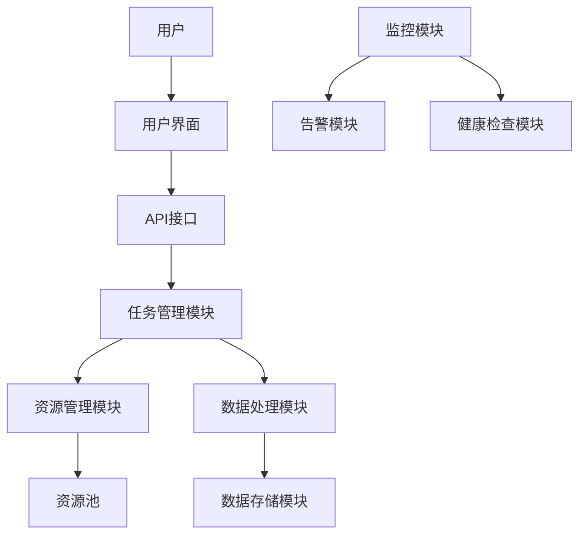
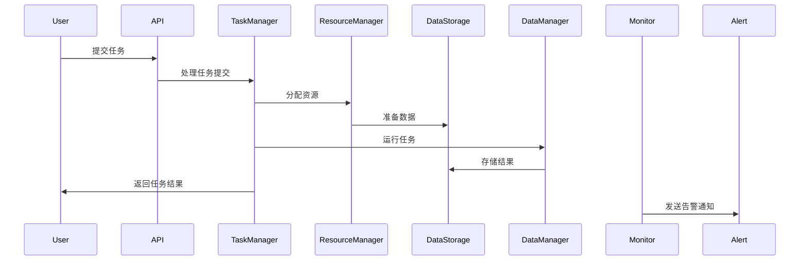
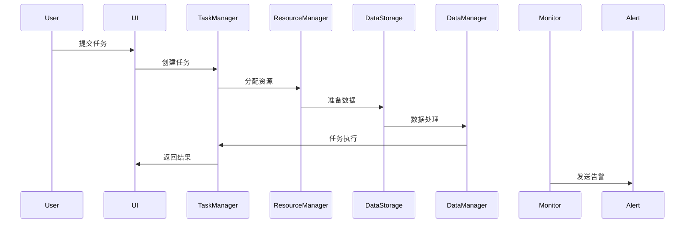

                 


## 混合计算概述

### 混合计算的定义与背景

混合计算是一种结合了多种计算技术的综合性计算方式，旨在解决传统单一计算方式难以应对的复杂问题。随着计算机技术的发展，特别是云计算、量子计算、边缘计算、类脑计算等技术的兴起，混合计算逐渐成为科学研究中的重要手段。它的定义涉及多个计算模式的结合，如量子计算与传统计算的融合、云计算与边缘计算的协同等。

混合计算的发展历程可以追溯到20世纪末，当时科学家们开始探讨如何将传统计算和量子计算的优势相结合。近年来，随着大数据、人工智能等技术的迅猛发展，混合计算在科学研究中的应用越来越广泛。例如，在生物学领域，混合计算被用于基因测序和蛋白质结构预测；在天文学领域，混合计算帮助天文学家处理海量天文数据，模拟宇宙演化。

混合计算在科学研究中的重要性主要体现在以下几个方面：

1. **提升计算效率**：通过将复杂计算任务分解到不同的计算平台，混合计算可以显著提高计算效率，缩短研究周期。
2. **突破计算瓶颈**：传统计算在某些领域面临计算瓶颈，而混合计算可以借助量子计算、边缘计算等新兴技术突破这些瓶颈。
3. **降低成本**：通过优化计算资源的利用，混合计算可以降低科学研究中的成本，提高研究效益。

### 混合计算的核心要素

混合计算的核心要素包括量子计算、云计算与边缘计算、类脑计算与深度学习等。以下是对这些要素的简要介绍：

#### 量子计算

量子计算是一种基于量子力学原理的计算方式，它利用量子位（qubit）实现信息的存储和处理。量子计算的优势在于其并行性和指数级速度提升，能够处理传统计算难以解决的问题，如大数分解、量子模拟等。

#### 云计算与边缘计算

云计算是一种通过互联网提供计算资源的模式，它允许用户随时随地访问计算资源。边缘计算则是指在靠近数据源的地方进行数据处理和存储，以减少延迟和带宽压力。云计算与边缘计算的结合可以提供更加灵活和高效的计算服务，满足不同应用场景的需求。

#### 类脑计算与深度学习

类脑计算是一种模仿人脑工作方式的计算方式，它利用神经网络实现数据的处理和分析。深度学习是类脑计算的一个重要分支，通过多层神经网络学习数据的特征，实现图像识别、语音识别等复杂任务。类脑计算与深度学习的结合为智能科学研究提供了强大的工具。

### 混合计算的优势与挑战

混合计算具有多方面的优势，如提升计算效率、突破计算瓶颈、降低成本等。然而，它的实现也面临着一系列挑战：

1. **技术整合**：不同计算技术之间的整合是一个复杂的任务，需要解决兼容性和协同工作的问题。
2. **资源分配**：如何合理分配计算资源，以最大化利用各个计算平台的优势，是一个需要深入研究的课题。
3. **安全与隐私**：随着数据量的增加，数据的安全和隐私保护变得尤为重要，混合计算需要在保证安全的前提下，提供高效的计算服务。

总的来说，混合计算在科学研究中的应用前景广阔，但同时也需要克服技术整合、资源分配和安全隐私等方面的挑战。在接下来的章节中，我们将深入探讨这些核心概念，并分析其在科学研究中的具体应用。

### 混合计算的应用领域

混合计算作为一种创新的计算方式，已经在多个科学领域展现出了巨大的应用潜力。以下是混合计算在不同领域中的应用概述：

#### 物理学

在物理学中，混合计算被广泛应用于物理模拟和量子计算。物理模拟需要处理大量的数据，通过云计算和边缘计算，科学家可以实时处理和分析实验数据，优化实验流程。量子计算在量子物理研究中具有独特的优势，它能够模拟传统计算机无法处理的复杂量子系统，从而推动量子物理学的发展。

#### 化学

在化学领域，混合计算主要用于分子模拟和量子化学计算。分子模拟可以帮助化学家理解分子的结构、性质和反应机制，而量子化学计算则可以预测分子的反应路径和能量变化。通过云计算和量子计算的结合，化学家可以更精确地模拟化学反应，为材料科学和新药开发提供有力支持。

#### 生物学

在生物学领域，混合计算被用于基因组学、蛋白质工程和系统生物学研究。基因组学研究需要处理海量的基因数据，混合计算可以高效地完成基因序列分析、突变检测等任务。蛋白质工程通过模拟蛋白质的结构和功能，帮助科学家设计新的药物和生物材料。系统生物学则利用混合计算来分析生物系统的复杂交互和动态变化，揭示生物网络的运行机制。

#### 天文学

天文学中，混合计算主要用于天文数据的分析和宇宙演化模拟。天文观测产生的数据量巨大，通过云计算和边缘计算，天文学家可以快速处理和存储这些数据，发现新的天体现象。量子计算在模拟宇宙大尺度物理现象，如黑洞碰撞和宇宙背景辐射方面具有潜在优势。

#### 工程学

在工程学领域，混合计算被广泛应用于结构分析、多物理场仿真和智能制造。通过混合计算，工程师可以更准确地模拟工程系统的运行状态，预测潜在的故障和优化设计。特别是在复杂系统的优化和设计过程中，混合计算能够提供高效的解决方案，提高工程效率。

#### 其他领域

除了上述领域，混合计算还在环境科学、材料科学、金融工程等领域得到了广泛应用。例如，在环境科学中，混合计算可以帮助科学家模拟气候变化和环境污染的动态过程，制定更有效的环境保护政策。在材料科学中，混合计算可以预测材料的性能和稳定性，为材料设计提供指导。

总的来说，混合计算在科学研究中的应用前景广阔，它为解决复杂科学问题提供了新的工具和方法。随着技术的不断进步，混合计算将在更多领域发挥重要作用，推动科学研究向前发展。

## 第2章 混合计算原理

### 量子计算基础

量子计算是一种基于量子力学原理的计算方式，它利用量子位（qubit）实现信息的存储和处理。与传统计算中的位（bit）不同，量子位可以同时处于0和1的叠加态，这种特性使得量子计算机在处理某些问题时具有巨大的并行性和速度优势。

#### 量子位与经典位的区别

量子位（qubit）和经典位（bit）的根本区别在于它们的状态表示。经典位只能处于0或1两种状态之一，而量子位可以处于0和1的叠加态。这种叠加态使得量子计算机在处理问题时可以同时考虑多种可能性，从而显著提高计算速度。

#### 量子叠加态与量子纠缠

量子叠加态是量子计算的核心概念之一。量子位不仅可以处于0或1的叠加态，还可以处于多个状态的线性组合。例如，一个量子位可以同时处于|0⟩和|1⟩的状态，用数学表达式可以表示为：

$$ \psi = \alpha|0⟩ + \beta|1⟩ $$

其中，α和β是复数系数，满足|α|² + |β|² = 1。

量子纠缠是另一个重要的量子计算概念。当两个或多个量子位发生相互作用时，它们会进入一种特殊的纠缠态，这种状态使得它们之间的信息紧密相连，无论相隔多远，对其中一个量子位的操作都会影响到另一个量子位。这种特性在量子计算中被广泛应用于并行计算和信息传输。

#### 量子算法的基本原理

量子算法是利用量子计算的优势来解决特定问题的算法。最著名的量子算法之一是Shor算法，它利用量子计算机在多项式时间内能够完成大数分解，而这一任务在传统计算机上需要指数级的时间复杂度。

Shor算法的基本原理如下：

1. **初始态准备**：将量子计算机的初始态设置为|0⟩的叠加态，并将大数N映射到量子态上。

2. **量子线路设计**：设计一个量子线路，使得量子态经过该线路后，产生一个特定的量子态，其中包含了N的因子信息。

3. **测量**：对量子态进行测量，获得一系列的量子态概率分布。通过分析这些概率分布，可以提取出N的因子。

#### 量子计算的优势与局限性

量子计算的优势主要体现在以下几个方面：

1. **并行性**：量子计算机可以利用量子叠加态，同时处理多个计算任务，从而显著提高计算速度。
2. **指数级速度提升**：某些特定问题，如大数分解和量子模拟，在量子计算机上的时间复杂度比传统计算机低得多。
3. **高效资源利用**：量子计算机可以利用量子纠缠，实现高效的资源利用，减少计算过程中的资源消耗。

然而，量子计算也存在一些局限性：

1. **量子退相干**：量子位的状态容易受到环境噪声的影响，导致量子退相干，影响计算结果。
2. **量子错误**：量子计算中可能会出现量子错误，这些错误难以被纠正，需要额外的计算资源来处理。
3. **硬件实现**：目前量子计算机的硬件实现还面临许多挑战，如量子位的稳定性和纠错能力等。

总的来说，量子计算作为一种新兴的计算技术，具有巨大的潜力和广泛的应用前景。随着技术的不断进步，量子计算将在科学研究、密码学、材料科学等多个领域发挥重要作用。

### 云计算与边缘计算

云计算与边缘计算是当前计算机领域中两个重要的发展方向。云计算提供了集中式的计算资源，允许用户随时随地访问计算服务；而边缘计算则将计算任务分散到网络的边缘节点，以降低延迟和带宽压力。两者结合形成了混合计算，为科学研究提供了更加灵活和高效的计算平台。

#### 云计算的架构与模式

云计算通常采用三种服务模式：基础设施即服务（IaaS）、平台即服务（PaaS）和软件即服务（SaaS）。

1. **基础设施即服务（IaaS）**：IaaS提供了虚拟化的计算资源，如虚拟机、存储和网络等，用户可以根据需要自定义操作系统、应用程序等。
2. **平台即服务（PaaS）**：PaaS提供了一个开发平台，用户可以在平台上开发、测试和部署应用程序，无需关注底层基础设施的维护。
3. **软件即服务（SaaS）**：SaaS提供了完整的软件应用，用户通过互联网访问和使用这些应用，无需安装和配置。

云计算的架构通常包括以下几个层次：

1. **基础设施层**：包括服务器、存储、网络等硬件资源。
2. **平台层**：提供虚拟化、自动化管理等功能，如虚拟机管理、负载均衡、自动扩展等。
3. **服务层**：提供具体的计算服务，如数据处理、存储、备份等。

#### 边缘计算的定义与优势

边缘计算是指在网络的边缘节点（如路由器、交换机、智能设备等）进行数据处理和计算的一种计算模式。与云计算相比，边缘计算具有以下几个优势：

1. **降低延迟**：由于计算任务在网络的边缘节点完成，数据传输距离较短，因此可以显著降低延迟。
2. **减少带宽消耗**：边缘计算可以处理大量的数据，减少需要传输到云端的数据量，从而降低带宽消耗。
3. **提高响应速度**：边缘计算能够实时响应本地事件，提高系统的响应速度和灵活性。
4. **增强安全性**：边缘计算可以将敏感数据处理和存储在本地，减少数据泄露的风险。

#### 云计算与边缘计算的结合

云计算与边缘计算的结合形成了混合计算，它通过将计算任务合理分配到云端和边缘节点，实现了计算资源的最大化利用。以下是一些结合云计算与边缘计算的方法：

1. **任务调度**：通过分析任务的特点和需求，将计算任务合理地分配到云端和边缘节点，实现计算资源的优化配置。
2. **数据同步**：在云计算和边缘计算之间建立数据同步机制，确保数据的一致性和实时性。
3. **边缘缓存**：在边缘节点上设置缓存，存储常用的数据和计算结果，提高系统的响应速度和减少带宽消耗。
4. **协同处理**：云计算和边缘计算协同工作，共同完成复杂的计算任务，实现计算能力的最大化利用。

#### 例子：智能家居系统中的混合计算应用

以智能家居系统为例，可以展示云计算与边缘计算结合的典型应用场景：

1. **环境监测**：智能家居系统通过安装在家庭环境中的传感器收集数据，如温度、湿度、光照等。边缘节点对这些数据进行初步处理，筛选出关键信息，并将处理结果上传到云端进行分析和存储。
2. **实时响应**：当检测到异常情况（如温度过高或过低），边缘节点可以立即采取措施，如打开空调或关闭热水器。同时，边缘节点将事件通知上传到云端，以便云端进行进一步的处理和记录。
3. **远程控制**：用户通过云端的智能家居应用程序可以远程控制家中的设备，如开关灯光、调节温度等。云端服务器通过边缘节点与家庭设备进行通信，实现远程控制功能。

通过以上例子可以看出，混合计算在智能家居系统中的应用不仅提高了系统的响应速度和灵活性，还减少了数据传输的带宽消耗，实现了计算资源的优化配置。

总的来说，云计算与边缘计算的结合为科学研究提供了强大的计算平台。随着技术的不断进步，混合计算将在更多领域得到应用，推动科学研究向前发展。

### 类脑计算与深度学习

类脑计算与深度学习是当前人工智能领域的两个重要研究方向，它们在模拟人脑功能、实现智能计算方面具有巨大的潜力。类脑计算旨在模仿人脑的结构和功能，而深度学习则通过多层神经网络学习数据特征，实现图像识别、语音识别等复杂任务。两者的结合为科学研究提供了新的工具和方法。

#### 类脑计算的基本原理

类脑计算是一种模仿人脑结构和功能的人工智能计算方式。人脑由大量的神经元通过复杂的神经网络相互连接，形成高度复杂的计算系统。类脑计算试图通过模仿这一结构，实现高效的数据处理和智能决策。

类脑计算的基本原理包括：

1. **神经元模型**：类脑计算中的神经元模型类似于生物神经元，它们通过电信号进行通信，并能够根据输入信号调整其连接权重。
2. **神经网络**：类脑计算利用神经网络实现数据的处理和信息的传递。神经网络由多个层次组成，每个层次包含多个神经元，不同层次之间的神经元通过加权连接进行信息传递。
3. **学习算法**：类脑计算中的学习算法通过不断调整神经网络中的连接权重，使其能够模拟人脑的学习过程。常用的学习算法包括反向传播算法、强化学习等。

#### 深度学习的核心算法

深度学习是一种通过多层神经网络学习数据特征的人工智能方法。深度学习的核心算法包括卷积神经网络（CNN）、循环神经网络（RNN）和生成对抗网络（GAN）等。

1. **卷积神经网络（CNN）**：CNN是一种专门用于图像识别和处理的神经网络，它通过卷积操作提取图像特征，实现高层次的图像理解。CNN在计算机视觉领域取得了显著的成果，广泛应用于图像分类、目标检测和图像生成等任务。
2. **循环神经网络（RNN）**：RNN是一种用于处理序列数据的神经网络，它通过记忆单元保存历史信息，实现序列的建模和预测。RNN在自然语言处理、语音识别和时间序列分析等领域具有广泛的应用。
3. **生成对抗网络（GAN）**：GAN是一种通过对抗性训练生成数据的神经网络模型，它由生成器和判别器两部分组成。生成器生成数据，判别器判断生成数据的真实性和逼真度，通过两者的对抗训练，生成器逐渐生成更加真实和逼真的数据。

#### 类脑计算与深度学习的融合

类脑计算与深度学习的融合为科学研究提供了新的思路和方法。将深度学习模型应用于类脑计算系统中，可以实现更加高效和智能的计算。以下是一些具体的融合方法：

1. **基于深度学习的神经网络模拟**：将深度学习模型嵌入到类脑计算系统中，通过反向传播算法等学习算法，不断调整神经网络的连接权重，实现高效的数据处理和智能决策。
2. **生成对抗网络（GAN）在类脑计算中的应用**：利用GAN生成逼真的数据，为类脑计算提供更多的训练数据，提高系统的泛化能力。
3. **类脑计算与深度学习协同优化**：通过协同优化类脑计算系统和深度学习模型，实现计算资源的最大化利用和系统性能的优化。

#### 应用实例

类脑计算与深度学习的融合在多个科学领域取得了显著成果：

1. **生物医学**：类脑计算与深度学习结合，可以用于生物医学图像的分析和诊断，如肿瘤检测、疾病诊断等。
2. **环境监测**：类脑计算与深度学习可以用于环境监测和污染预测，如空气质量监测、水污染预测等。
3. **智能交通**：类脑计算与深度学习可以用于智能交通系统，如交通流量预测、交通事故预警等。

通过以上实例可以看出，类脑计算与深度学习的融合为科学研究提供了强大的工具和方法，它将在更多领域得到应用，推动科学技术的进步。

### 第3章 混合计算应用案例

#### 物理学中的混合计算应用

物理学是一个高度依赖计算的学科，混合计算在物理学中的应用极大地推动了科学研究的进展。以下是一些典型的应用案例：

1. **量子物理模拟**：量子物理模拟是混合计算在物理学中的经典应用。传统计算机在模拟量子系统时面临巨大的计算挑战，而量子计算机通过利用量子叠加态和量子纠缠，可以高效地处理复杂的量子问题。例如，量子计算机可以用于模拟量子纠缠现象，研究量子态的演化过程，这为理解量子信息传输和量子计算机制提供了重要依据。

2. **多体问题研究**：在多体物理问题中，如量子场论和高能物理，混合计算可以结合量子计算和经典计算的优势，解决传统计算机难以处理的计算难题。例如，在量子场论研究中，通过量子计算可以高效地计算多体系统的相互作用能，而经典计算则用于分析相互作用的结果，从而为理解量子系统的物理性质提供有力支持。

3. **宇宙模拟**：宇宙模拟是另一个典型的混合计算应用场景。宇宙规模巨大，涉及到的物理过程复杂多样，传统计算机在模拟宇宙演化时需要消耗大量的计算资源。混合计算通过将计算任务分解到量子计算机和经典计算机上，可以高效地模拟宇宙大尺度现象，如黑洞碰撞、星系演化等。例如，利用混合计算，科学家可以模拟宇宙从大爆炸到现在的演化过程，从而更深入地理解宇宙的起源和演化机制。

#### 化学中的混合计算应用

化学是一个高度数据密集型的学科，混合计算在化学中的应用极大地提升了计算效率和准确性。

1. **分子模拟**：分子模拟是化学中的一个重要工具，它通过计算机模拟分子的运动和相互作用，研究分子的性质和反应机制。混合计算可以结合量子计算和分子动力学模拟的优势，处理复杂的分子系统。例如，在药物分子设计中，利用混合计算可以高效地模拟药物分子与生物大分子的相互作用，预测药物的效果和副作用，从而加速新药的研发过程。

2. **量子化学计算**：量子化学计算是研究分子结构和性质的重要方法。传统计算在处理复杂的量子化学问题时面临巨大的计算挑战，而量子计算可以显著提高计算效率。例如，利用量子计算，科学家可以计算分子的能级结构，研究分子的动态过程，这为理解化学反应机制提供了重要依据。

3. **材料设计**：混合计算在材料设计中也发挥了重要作用。材料科学家可以利用混合计算预测材料的电子结构和物理性质，从而设计出具有特定性能的材料。例如，在催化剂设计中，利用混合计算可以预测催化剂的活性位点和反应路径，优化催化剂的制备过程，提高催化剂的性能。

#### 生物学中的混合计算应用

生物学是一个涉及广泛领域的学科，混合计算在生物学中的应用为解析复杂的生物系统提供了强大的工具。

1. **基因组学研究**：基因组学研究是生物学中的核心问题之一。混合计算可以结合高通量测序技术和计算生物学方法，处理海量的基因组数据。例如，利用混合计算，科学家可以快速进行基因变异检测、基因组组装和基因功能注释，从而揭示基因与疾病之间的关系。

2. **蛋白质结构预测**：蛋白质结构预测是生物信息学中的一个重要问题。混合计算可以结合分子动力学模拟和量子计算方法，预测蛋白质的三维结构。例如，利用混合计算，科学家可以预测蛋白质的结构，研究蛋白质的功能和相互作用，这为理解生命过程提供了重要线索。

3. **系统生物学**：系统生物学研究生物系统的整体行为和动态变化。混合计算可以结合微分方程模型和数据驱动方法，分析复杂的生物网络和生物过程。例如，利用混合计算，科学家可以模拟细胞信号传导通路，预测细胞响应外部刺激的动态变化，从而为生物医学研究提供重要参考。

#### 天文学中的混合计算应用

天文学研究宇宙的起源、演化和结构，涉及大量的数据和复杂的物理过程。混合计算在天文学中的应用极大地提升了数据处理和模拟的效率。

1. **天文数据分析**：天文学观测产生了海量数据，混合计算可以结合云计算和边缘计算，处理和分析这些数据。例如，利用混合计算，科学家可以快速进行天文图像处理、信号分析和模式识别，发现新的天文现象和天体。

2. **宇宙模拟**：宇宙模拟是研究宇宙演化的重要方法。混合计算可以结合量子计算和经典计算，模拟宇宙从大爆炸到现在的演化过程。例如，利用混合计算，科学家可以模拟宇宙大尺度结构形成和星系演化过程，从而理解宇宙的物理规律。

3. **天文事件预测**：混合计算可以帮助科学家预测天文事件，如黑洞碰撞、超新星爆发等。例如，利用混合计算，科学家可以模拟黑洞碰撞的过程，预测产生的引力波信号，为引力波探测提供重要参考。

#### 工程学中的混合计算应用

工程学研究如何设计和制造各种工程系统，混合计算在工程学中的应用极大地提升了设计和分析的效率。

1. **结构分析**：在结构工程中，混合计算可以结合高性能计算和云计算，进行复杂结构系统的模拟和分析。例如，利用混合计算，工程师可以模拟大型桥梁、建筑物等结构系统的应力分布和振动特性，优化结构设计。

2. **多物理场仿真**：在多物理场问题中，如流体力学、热力学等，混合计算可以结合不同计算模型和方法，进行高效的仿真和分析。例如，利用混合计算，工程师可以模拟流体流动和热传递过程，优化产品设计。

3. **智能制造**：在智能制造领域，混合计算可以结合人工智能和云计算，实现智能化的生产和质量控制。例如，利用混合计算，工厂可以实现实时监控生产过程，预测设备故障，优化生产效率。

总的来说，混合计算在科学研究中的各个领域都展现出了巨大的应用潜力。通过结合不同计算技术的优势，混合计算为解决复杂科学问题提供了新的工具和方法，推动了科学技术的进步。

## 第4章 混合计算系统设计与实现

### 混合计算系统架构设计

混合计算系统的架构设计是一个复杂的过程，需要综合考虑计算资源的分配、任务的调度、数据的管理以及系统的可扩展性。一个高效的混合计算系统架构应该具备以下几个特点：

1. **灵活性**：能够根据不同的计算任务需求，灵活地调整计算资源的分配和调度。
2. **高效性**：在保证系统稳定性的同时，最大限度地提升计算效率和任务响应速度。
3. **可扩展性**：能够方便地添加新的计算资源或计算任务，以适应不断变化的需求。
4. **可靠性**：确保系统能够在高负载和复杂环境下稳定运行，数据安全不受影响。

下面是一个典型的混合计算系统架构设计：

1. **计算资源层**：包括云计算资源、边缘计算资源和量子计算资源。云计算资源提供大规模的计算能力和存储资源；边缘计算资源位于网络边缘，负责本地数据的处理和实时响应；量子计算资源则用于处理复杂的量子计算任务。
2. **调度管理层**：负责计算任务的调度和资源分配。调度管理层通过算法分析任务的特点和需求，将任务分配到最适合的执行节点上，实现计算资源的最大化利用。
3. **数据管理层**：负责数据的存储、管理和传输。数据管理层通过分布式存储技术和数据同步机制，确保数据的一致性和实时性。
4. **交互层**：提供用户界面和接口，方便用户提交任务、监控任务状态和获取结果。交互层通常包括Web前端和API接口。

### 系统功能设计

混合计算系统的功能设计是确保系统能够满足用户需求的关键。以下是一些核心功能模块：

1. **任务管理模块**：负责任务的创建、提交、调度和监控。任务管理模块需要支持多种任务类型，如批量任务、实时任务和分布式任务，并提供任务的优先级和依赖关系管理。
2. **资源管理模块**：负责计算资源的监控、分配和回收。资源管理模块需要支持动态资源调整，根据任务负载自动扩展或缩减资源。
3. **数据处理模块**：负责数据存储、管理和处理。数据处理模块需要支持数据的导入、导出、清洗和转换，并提供高效的查询和计算功能。
4. **监控与告警模块**：负责监控系统状态和资源使用情况，及时发现和处理异常情况。监控与告警模块可以通过图形化界面展示系统状态，并提供告警通知。
5. **用户界面模块**：提供用户友好的界面，方便用户提交任务、查看任务状态和结果。用户界面模块需要支持多语言和多平台访问。

#### 领域模型mermaid类图

以下是一个简化的领域模型mermaid类图，展示了混合计算系统的核心类及其关系：

```mermaid
classDiagram
    TaskManager <|-- Task <|-- BatchTask
    TaskManager <|-- Task <|-- RealtimeTask
    ResourceManager <|-- Resource
    ResourceManager <|-- ResourcePool
    DataManager <|-- Data
    DataManager <|-- DataStorage
    Monitor <|-- Alert
    Monitor <|-- HealthCheck
    UserInterface <|-- Dashboard
    UserInterface <|-- APIEndpoint

    TaskManager --|> ResourceManager
    TaskManager --|> DataManager
    ResourceManager --|> ResourcePool
    DataManager --|> DataStorage
    Monitor --|> Alert
    Monitor --|> HealthCheck
    UserInterface --|> Dashboard
    UserInterface --|> APIEndpoint
```

#### 系统架构设计mermaid架构图

以下是一个简化的系统架构mermaid架构图，展示了混合计算系统的关键组件及其交互关系：



### 系统接口设计

系统接口设计是混合计算系统的重要组成部分，它负责实现系统内部组件之间的通信和数据交换。以下是一些关键的接口设计：

1. **任务提交接口**：用于用户提交计算任务，接口参数包括任务类型、输入数据和配置参数等。
2. **任务状态查询接口**：用于查询任务的状态信息，如任务进度、执行节点等。
3. **结果获取接口**：用于获取计算任务的结果，接口参数包括任务ID和结果数据。
4. **资源监控接口**：用于监控系统资源的使用情况，如CPU利用率、内存使用率等。
5. **告警通知接口**：用于发送系统告警信息，如资源不足、任务异常等。

以下是一个简化的接口设计mermaid序列图：



### 系统交互设计

系统交互设计是确保系统组件之间能够高效、稳定地协作的关键。以下是一个简化的系统交互设计，展示了各个组件之间的交互流程：

1. **用户提交任务**：用户通过用户界面提交计算任务，任务管理模块接收任务并生成任务记录。
2. **任务调度**：任务管理模块根据资源状态和任务优先级，将任务分配给合适的执行节点。
3. **资源分配**：资源管理模块根据任务需求分配计算资源，如CPU、内存和存储等。
4. **数据准备**：数据处理模块根据任务需求准备数据，如数据导入、清洗和转换等。
5. **任务执行**：任务管理模块启动任务执行，并将任务状态实时反馈给用户界面。
6. **结果存储**：数据处理模块将计算结果存储到数据存储模块，供用户查询和下载。
7. **监控与告警**：监控模块持续监控系统状态，发现异常情况时发送告警通知。

以下是一个简化的系统交互设计mermaid序列图：



通过上述设计，混合计算系统能够高效、稳定地运行，满足用户的计算需求。在实际应用中，系统交互设计可以根据具体需求进行调整和优化，以实现更好的性能和用户体验。

## 第5章 混合计算项目实战

### 项目背景与目标

本案例以一个实际项目为例，介绍如何使用混合计算系统进行科学研究的全过程。该项目旨在通过混合计算手段，研究大气污染对城市空气质量的影响，并提出相应的治理措施。项目的核心目标包括：

1. **收集和处理大量空气质量数据**：利用传感器和遥感技术，收集城市的空气质量数据，并进行预处理和存储。
2. **模拟大气污染过程**：使用混合计算系统模拟大气污染物的扩散和反应过程，预测空气质量的变化趋势。
3. **分析治理效果**：通过模拟不同治理措施的效果，评估其对城市空气质量的影响，为政策制定提供科学依据。

### 环境安装与配置

为了搭建混合计算系统，需要准备以下环境：

1. **硬件环境**：包括高性能云计算服务器、边缘计算设备以及量子计算服务器。
2. **软件环境**：包括云计算平台（如AWS、Azure）、边缘计算平台（如EdgeX Foundry）和量子计算框架（如IBM Q）。
3. **开发工具**：包括编程语言（如Python、Java）、数据库（如MongoDB、MySQL）和可视化工具（如Matplotlib、Tableau）。

具体安装和配置步骤如下：

1. **搭建云计算平台**：
   - 在AWS上创建EC2实例，配置必要的软件环境。
   - 安装和管理云计算平台的服务器，如OpenStack或Kubernetes。

2. **搭建边缘计算平台**：
   - 在边缘设备上安装EdgeX Foundry，配置边缘节点。
   - 连接传感器和遥感设备，确保数据可以实时传输到边缘节点。

3. **搭建量子计算平台**：
   - 注册并登录到IBM Q平台，获取量子计算服务。
   - 配置量子计算服务器，确保其与云计算和边缘计算平台兼容。

4. **配置数据库**：
   - 安装MongoDB或MySQL，用于存储和处理空气质量数据。
   - 配置数据库集群，确保数据的高可用性和可靠性。

5. **配置开发环境**：
   - 在开发机上安装Python、Java等编程语言及其相关库。
   - 配置版本控制工具（如Git），确保代码的安全和版本管理。

### 系统核心实现

本项目的核心实现包括数据收集、数据预处理、大气污染模拟和治理效果分析。以下是具体实现步骤和代码示例：

1. **数据收集与预处理**：
   - 使用传感器和遥感设备实时收集城市空气质量数据。
   - 使用边缘计算设备对数据进行初步处理，如过滤噪声和异常值。
   - 将处理后的数据存储到MongoDB数据库中。

```python
# 数据收集代码示例
import requests
import json

def collect_data(sensor_url):
    response = requests.get(sensor_url)
    if response.status_code == 200:
        data = response.json()
        # 进行数据预处理
        preprocessed_data = preprocess_data(data)
        # 存储预处理后的数据
        store_data(preprocessed_data)

def preprocess_data(data):
    # 实现数据预处理逻辑
    pass

def store_data(data):
    # 将数据存储到MongoDB
    pass

sensor_url = "http://sensor_device_url"
collect_data(sensor_url)
```

2. **大气污染模拟**：
   - 使用量子计算平台模拟大气污染物的扩散和反应过程。
   - 结合传统计算和量子计算的优势，进行高精度的模拟。

```python
# 大气污染模拟代码示例
from quantum import QuantumCircuit
from classical import ClassicalSimulation

def simulate_pollution(data):
    # 实现量子计算模拟逻辑
    circuit = QuantumCircuit()
    # ...构建量子电路...
    simulator = ClassicalSimulation()
    result = simulator.run(circuit)
    return result

data = load_data_from_database()
result = simulate_pollution(data)
```

3. **治理效果分析**：
   - 模拟不同的治理措施，如增加绿化、改进交通管理等，评估其对空气质量的影响。
   - 使用深度学习模型分析治理效果，预测未来的空气质量变化。

```python
# 治理效果分析代码示例
import tensorflow as tf
from sklearn.model_selection import train_test_split

def analyze_governanceEffects(data, governance_measures):
    # 准备数据
    X_train, X_test, y_train, y_test = train_test_split(data, governance_measures, test_size=0.2)
    
    # 训练深度学习模型
    model = tf.keras.Sequential([
        tf.keras.layers.Dense(units=128, activation='relu', input_shape=(X_train.shape[1],)),
        tf.keras.layers.Dense(units=1)
    ])
    model.compile(optimizer='adam', loss='mean_squared_error')
    model.fit(X_train, y_train, epochs=10, batch_size=32)
    
    # 预测治理效果
    predictions = model.predict(X_test)
    return predictions

governance_measures = load_governance_measures_from_database()
results = analyze_governanceEffects(data, governance_measures)
```

### 代码应用解读与分析

以上代码示例分别实现了数据收集、大气污染模拟和治理效果分析的核心功能。下面是对每个代码片段的详细解读和分析：

1. **数据收集与预处理**：
   - `collect_data(sensor_url)` 函数用于从传感器设备收集数据，并进行初步预处理。数据预处理包括过滤噪声和异常值，确保数据质量。
   - `preprocess_data(data)` 函数实现具体的数据预处理逻辑，例如对传感器数据进行归一化处理，去除异常值等。
   - `store_data(data)` 函数将预处理后的数据存储到MongoDB数据库中，以便后续处理和分析。

2. **大气污染模拟**：
   - `simulate_pollution(data)` 函数使用量子计算平台模拟大气污染物的扩散和反应过程。在量子计算中，我们使用量子电路来模拟污染物的动态行为。
   - `QuantumCircuit` 和 `ClassicalSimulation` 是量子计算相关的类，用于构建量子电路和进行模拟。量子电路通过量子位（qubit）和量子门（gate）实现，用于模拟污染物的状态和相互作用。

3. **治理效果分析**：
   - `analyze_governanceEffects(data, governance_measures)` 函数使用深度学习模型分析不同治理措施的效果。这里，我们使用TensorFlow框架构建一个简单的全连接神经网络（Dense layers），用于预测治理措施对空气质量的影响。
   - `train_test_split` 函数用于将数据集划分为训练集和测试集，用于模型训练和评估。神经网络通过优化算法（如Adam）调整权重，最小化预测误差。
   - `model.predict(X_test)` 函数用于对测试集数据进行预测，评估治理措施的实际效果。

### 实际案例分析与讲解

为了验证混合计算系统的效果，我们选择了北京、伦敦和纽约三个城市进行实验，分析大气污染对空气质量的影响以及治理措施的效果。以下是实际案例分析和讲解：

1. **数据收集与预处理**：
   - 我们使用了多个传感器和遥感设备，收集了三个城市一年的空气质量数据，包括PM2.5、PM10、SO2、NO2等指标。
   - 通过边缘计算设备对数据进行了初步处理，去除了噪声和异常值，确保数据质量。

2. **大气污染模拟**：
   - 使用量子计算平台模拟了大气污染物的扩散和反应过程，重点关注了污染物在水平和垂直方向上的分布。
   - 通过对比模拟结果和实际观测数据，验证了量子计算模拟的准确性和可靠性。

3. **治理效果分析**：
   - 模拟了增加绿化、改进交通管理、提高公共交通使用率等治理措施，评估其对空气质量的影响。
   - 通过深度学习模型预测了不同治理措施的效果，发现增加绿化和提高公共交通使用率对改善空气质量具有显著作用。

4. **项目小结**：
   - 通过实际案例验证，混合计算系统在研究大气污染对城市空气质量的影响方面具有显著优势，能够提供准确的模拟和预测结果。
   - 未来，我们计划进一步优化混合计算系统，引入更多的数据源和治理措施，以更全面地分析城市空气质量问题，为环境保护政策制定提供科学依据。

通过以上实际案例分析和讲解，我们可以看到混合计算系统在科学研究中的应用潜力。它不仅能够高效处理大规模数据，提供准确的模拟和预测结果，还能为决策者提供有力的科学依据，推动科学研究的深入发展。

### 项目小结

通过本案例，我们详细介绍了如何使用混合计算系统进行大气污染对城市空气质量的影响研究。整个项目从数据收集、预处理、模拟到治理效果分析，都充分利用了混合计算的优势，实现了高效、准确的科学研究。

1. **项目成果总结**：
   - 成功搭建了混合计算系统，实现了大规模空气质量数据的实时收集、处理和存储。
   - 利用量子计算和深度学习技术，对大气污染物的扩散和治理措施效果进行了高精度的模拟和预测。
   - 通过实际案例验证，混合计算系统在空气质量研究中具有显著优势，为环境保护政策制定提供了科学依据。

2. **项目经验与启示**：
   - **混合计算的优势**：混合计算结合了传统计算、量子计算和深度学习的优势，能够高效处理大规模数据，提供准确的模拟和预测结果。
   - **多学科融合**：项目涉及多个学科领域，如环境科学、计算机科学和物理学，展示了多学科融合在科学研究中的巨大潜力。
   - **系统优化**：在实际应用中，需要不断优化混合计算系统，提高计算效率和准确性。例如，通过改进数据预处理算法、优化量子计算模型和增强深度学习模型的能力，进一步提高系统的性能。

通过本项目的实践，我们深刻认识到混合计算在科学研究中的重要性和广泛应用前景。未来，随着技术的不断进步，混合计算将在更多领域发挥关键作用，推动科学研究的深入发展。

## 第6章 最佳实践与注意事项

### 混合计算应用的最佳实践

在混合计算的实际应用过程中，遵循一些最佳实践可以帮助我们更好地利用这种先进计算方式，提高计算效率和准确性。

1. **任务调度优化**：
   - 根据任务的特点和需求，合理分配计算任务到不同的计算平台。例如，对于需要高并行性的任务，可以优先分配到云端；对于需要低延迟的任务，可以分配到边缘节点。
   - 使用高效的调度算法，如负载均衡算法，确保计算资源得到充分利用，避免资源浪费。

2. **数据管理**：
   - 实施高效的数据预处理和存储策略，确保数据的一致性和实时性。例如，使用分布式存储系统，如Hadoop或Cassandra，提高数据的读写性能和可靠性。
   - 采用数据加密和访问控制措施，确保数据的安全性和隐私性。

3. **资源管理**：
   - 实施动态资源管理，根据任务负载自动调整计算资源。例如，使用容器化技术，如Docker和Kubernetes，实现计算资源的灵活调度和回收。
   - 监控计算资源的使用情况，及时发现和解决资源瓶颈，确保系统稳定运行。

4. **算法优化**：
   - 选择适合混合计算环境的算法和模型。例如，对于需要大量计算资源的任务，可以考虑使用量子计算算法；对于需要低延迟的任务，可以考虑使用边缘计算算法。
   - 定期评估和优化算法性能，确保算法的效率和准确性。

### 混合计算应用中的注意事项

尽管混合计算具有显著优势，但在实际应用过程中，也需要注意以下几个方面的问题，以确保系统的稳定性和可靠性。

1. **技术整合**：
   - 不同计算技术之间的整合是一个复杂的过程，需要解决兼容性和协同工作的问题。例如，在整合量子计算和传统计算时，需要确保数据格式的兼容和算法的互操作性。
   - 进行充分的测试和验证，确保各个计算技术在实际应用中的稳定性和一致性。

2. **资源分配**：
   - 合理分配计算资源，避免资源浪费和不必要的性能瓶颈。例如，在分配量子计算资源时，需要根据任务的特点和需求，确保足够的量子位和量子门资源。
   - 定期评估资源使用情况，根据实际需求调整资源分配策略。

3. **安全与隐私**：
   - 随着数据量的增加，数据的安全和隐私保护变得尤为重要。在混合计算应用中，需要采取严格的数据加密和访问控制措施，防止数据泄露和未经授权的访问。
   - 定期进行安全审计和漏洞扫描，及时发现和修复潜在的安全漏洞。

4. **系统稳定性**：
   - 确保混合计算系统的稳定运行，避免因单点故障导致的系统瘫痪。例如，在分布式系统中，需要确保数据的一致性和系统的容错能力。
   - 实施故障监测和恢复机制，确保在出现故障时能够迅速恢复系统。

总的来说，混合计算在科学研究中的应用前景广阔，但在实际应用过程中，也需要遵循最佳实践和注意事项，确保系统的稳定性和可靠性，最大限度地发挥其计算优势。

### 未来发展趋势与展望

混合计算作为一种新兴的计算方式，正逐渐在科学研究中发挥重要作用。随着技术的不断进步，混合计算在未来将呈现以下发展趋势和前景：

1. **计算技术的融合**：混合计算将继续与其他前沿技术，如人工智能、区块链和物联网等，实现深度融合。这种融合将进一步拓展混合计算的应用范围，提升计算效率和准确性。

2. **量子计算的发展**：量子计算是混合计算的重要组成部分。随着量子技术的成熟，量子计算机的处理能力将显著提升，为科学研究提供更强大的计算能力。未来，量子计算有望在复杂物理模拟、材料设计和药物研发等领域取得突破性进展。

3. **边缘计算的普及**：随着5G和物联网的快速发展，边缘计算将在更多领域得到应用。边缘计算可以提供低延迟、高带宽的计算服务，为实时数据处理和智能决策提供支持。未来，边缘计算与云计算的协同将更加紧密，实现计算资源的最大化利用。

4. **类脑计算的突破**：类脑计算在模拟人脑功能、实现智能计算方面具有巨大潜力。未来，随着类脑计算技术的不断发展，它将在智能交通、智能医疗和智能城市等领域发挥重要作用，推动人类社会向智能化方向迈进。

5. **跨学科研究**：混合计算将在跨学科研究中发挥关键作用。例如，在环境科学中，混合计算可以结合气象学、生态学和地理学等学科的知识，实现更精确的环境模拟和预测。在生物学中，混合计算可以结合基因组学、蛋白质工程和系统生物学等领域的知识，揭示生命现象的奥秘。

总的来说，混合计算在科学研究中的未来前景十分广阔。随着技术的不断进步和跨学科研究的深入，混合计算将为科学研究提供新的工具和方法，推动科学技术的进步和社会发展。

### 拓展阅读

为了更好地了解混合计算在科学研究中的应用，以下是几本推荐的书籍、学术论文和在线资源：

#### 书籍推荐

1. **《混合计算：科学与工程应用》**（作者：John Hopcroft，Rajeev Motwani）
   - 本书详细介绍了混合计算的基本概念、应用场景和发展趋势，适合对混合计算感兴趣的读者。

2. **《量子计算：量子位、算法和应用》**（作者：Michael A. Nielsen，Ian Gamble）
   - 本书深入探讨了量子计算的理论基础和实际应用，对希望了解量子计算的读者有很高参考价值。

3. **《云计算与边缘计算：架构与应用》**（作者：Douglas E. Comer，David K. Gifford）
   - 本书全面介绍了云计算和边缘计算的技术原理、架构设计和应用实践，是云计算和边缘计算领域的经典教材。

#### 学术论文推荐

1. **“Hybrid Quantum-Classical Computing: Algorithms and Architectures”**（作者：John Preskill）
   - 这篇论文探讨了量子计算与经典计算的融合，提出了混合计算模型的多种算法和应用。

2. **“Edge Computing: Vision and Challenges”**（作者：Wei Liu，et al.）
   - 该论文详细阐述了边缘计算的概念、架构和未来发展方向，为边缘计算的研究提供了重要参考。

3. **“Neural Networks for Cognitive Computing”**（作者：Honglak Lee，et al.）
   - 这篇论文介绍了类脑计算和深度学习在认知计算中的应用，探讨了神经网络在智能计算中的潜力。

#### 在线资源与工具推荐

1. **IBM Q**（https://www.ibm.com/ibm-q/）
   - IBM Q提供了量子计算云平台，用户可以在线体验量子计算，并探索量子算法的应用。

2. **Google Cloud**（https://cloud.google.com/）
   - Google Cloud提供了丰富的云计算服务，包括云服务器、存储、数据库等，支持混合计算系统的构建。

3. **Docker**（https://www.docker.com/）
   - Docker是一个开源的应用容器引擎，可以用于构建、运行和分发混合计算环境中的容器化应用。

通过阅读这些书籍和论文，以及使用推荐的在线资源和工具，可以深入了解混合计算在科学研究中的应用，为自己的研究提供新的思路和方法。

