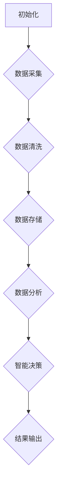

                 

**文章标题**：物联网与环境隐形智能的融合发展趋势

**关键词**：物联网，环境隐形智能，融合，发展趋势，关键技术，架构设计，应用实例

**摘要**：
随着物联网技术的迅猛发展和环境感知需求的日益增长，物联网与环境隐形智能的融合成为当前研究的热点。本文旨在深入探讨物联网与环境隐形智能的融合发展趋势，从基本概念、关键技术、融合架构、应用实例等多方面进行详细分析，以期为相关领域的科研人员和工程师提供有价值的参考。

**目录大纲**：

----------------------------------------------------------------

# 物联网与环境隐形智能的融合发展趋势

> 关键词：物联网，环境隐形智能，融合，发展趋势

> 摘要：本文探讨了物联网与环境隐形智能的融合发展趋势，涵盖了基本概念、关键技术、融合架构、应用实例等方面的内容。

----------------------------------------------------------------

## 第1章 引言与背景

### 1.1 物联网发展现状

物联网技术近年来得到了广泛关注和应用。根据市场研究机构的数据，全球物联网设备连接数量已超过100亿台，且这一数字还在持续增长。物联网技术的应用场景涵盖了智能家居、智能交通、智能医疗、智能工业等多个领域。例如，智能家居中的智能灯泡、智能门锁等设备，通过物联网技术实现了设备的互联互通和智能化管理；智能交通系统通过物联网技术实现了车辆与交通设施的实时通信，提高了交通效率；智能医疗系统通过物联网技术实现了医疗设备的远程监控和患者数据的实时分析。

### 1.2 环境隐形智能概念

环境隐形智能是指利用物联网技术，在不显眼或无感知的方式下，实现环境信息的采集、分析和智能决策。环境隐形智能的核心在于“隐形”，即在不干扰用户日常生活的条件下，实现环境信息的实时感知和智能处理。环境隐形智能的关键技术包括无线传感器网络、隐形通信技术、大数据分析和人工智能技术等。

### 1.3 物联网与环境隐形智能融合的必要性

物联网与环境隐形智能的融合具有以下几个方面的必要性：

1. **提升环境感知能力**：通过物联网技术，可以实现对环境的全面感知，但传统的物联网技术往往需要用户主动参与，如使用手机APP控制智能家居设备。环境隐形智能技术可以在不干扰用户的情况下，实现环境的实时感知和智能决策，从而提升环境感知能力。

2. **提高数据处理效率**：物联网技术产生的数据量巨大，传统的数据处理方法往往无法高效地处理这些数据。环境隐形智能技术通过大数据分析和人工智能技术，可以对环境数据进行智能分析和处理，从而提高数据处理效率。

3. **实现智能化环境**：随着物联网和环境隐形智能技术的融合，可以实现智能化环境的建设，为人们提供更加舒适、便捷的生活和工作环境。

### 1.4 书籍结构安排

本文将从以下几个方面进行详细探讨：

1. **物联网技术概述**：介绍物联网的基本概念、技术架构和关键技术。

2. **环境隐形智能技术**：介绍环境隐形智能的基本概念、核心技术和应用场景。

3. **物联网与环境隐形智能的融合**：分析物联网与环境隐形智能融合的挑战与机遇，以及融合的关键技术和发展趋势。

4. **物联网与环境隐形智能融合的架构设计**：介绍物联网与环境隐形智能融合的架构设计原则、层次划分和关键模块。

5. **物联网与环境隐形智能融合的安全与隐私保护**：分析融合过程中面临的安全与隐私问题，并提出相应的解决方案。

6. **物联网与环境隐形智能融合的应用案例**：介绍物联网与环境隐形智能融合在智能家居、智能交通、智能医疗等领域的应用实例。

7. **未来展望与趋势分析**：分析物联网与环境隐形智能融合的未来发展趋势，以及技术创新点和挑战。

## 第2章 物联网技术概述

### 2.1 物联网的基本概念

物联网（Internet of Things，IoT）是指通过互联网将各种信息传感设备与网络相连接，实现物体与物体、物体与互联网之间的互联互通。物联网的基本概念包括感知层、网络层和应用层。

#### 感知层

感知层是物联网的底层，主要包括各种传感器和识别设备，如温度传感器、湿度传感器、摄像头、RFID标签等。这些设备用于采集环境信息和物体信息，是物联网系统的信息来源。

#### 网络层

网络层是物联网的中层，主要负责数据传输和存储。网络层通常包括传输网络、云计算平台等。传输网络负责将感知层采集到的数据传输到数据处理中心，云计算平台负责数据的存储和处理。

#### 应用层

应用层是物联网的最高层，主要包括各种应用程序和服务。应用层利用物联网技术提供的海量数据，实现智能化管理和智能决策。例如，智能家居、智能交通、智能医疗等。

### 2.2 物联网的技术架构

物联网的技术架构通常分为三个层次：感知层、网络层和应用层。

#### 感知层

感知层是物联网的基础，主要包括传感器、识别设备和智能终端。传感器用于采集环境信息和物体信息，如温度传感器、湿度传感器、摄像头等。识别设备用于识别物体的特征信息，如RFID标签、二维码等。智能终端是指能够连接互联网、具有计算和通信功能的设备，如智能手机、平板电脑等。

#### 网络层

网络层是物联网的中层，主要负责数据传输和存储。网络层通常包括传输网络、云计算平台等。传输网络负责将感知层采集到的数据传输到数据处理中心，云计算平台负责数据的存储和处理。

#### 应用层

应用层是物联网的最高层，主要包括各种应用程序和服务。应用层利用物联网技术提供的海量数据，实现智能化管理和智能决策。例如，智能家居系统可以通过物联网技术实现家电设备的远程控制和自动化管理，智能交通系统可以通过物联网技术实现交通信息的实时监测和优化调度。

### 2.3 物联网的关键技术

物联网的关键技术包括传感器技术、网络技术、数据处理技术和人工智能技术。

#### 传感器技术

传感器技术是物联网的核心技术之一，它决定了物联网系统的感知能力和精度。传感器技术主要包括温度传感器、湿度传感器、光敏传感器、红外传感器等。这些传感器可以用来监测环境温度、湿度、光照强度等信息。

#### 网络技术

网络技术是物联网的传输通道，它决定了物联网系统的数据传输速度和稳定性。网络技术主要包括无线网络、有线网络和传输协议等。常见的无线网络技术有Wi-Fi、蓝牙、ZigBee等，常见的有线网络技术有以太网、光纤等。

#### 数据处理技术

数据处理技术是物联网的数据处理核心，它决定了物联网系统的数据处理能力和效率。数据处理技术主要包括数据采集、数据清洗、数据存储、数据分析和数据挖掘等。

#### 人工智能技术

人工智能技术是物联网的高级应用，它使得物联网系统能够实现智能决策和自主运行。人工智能技术主要包括机器学习、深度学习、自然语言处理等。

### 2.4 物联网的发展趋势

物联网技术的发展趋势主要包括以下几个方面：

1. **物联网设备的数量和种类将持续增长**：随着物联网技术的普及和应用，物联网设备的数量和种类将不断增长。预计到2025年，全球物联网设备数量将达到500亿台。

2. **物联网技术的融合与创新**：物联网技术将与5G、人工智能、大数据等新兴技术深度融合，产生新的应用场景和商业模式。

3. **物联网的安全与隐私保护**：随着物联网设备的增多，物联网的安全和隐私问题将日益突出。未来的物联网技术将更加注重安全和隐私保护。

4. **物联网技术的普及和市场化**：物联网技术将逐渐从实验室走向市场，实现大规模商用和普及。

## 第3章 环境隐形智能技术

### 3.1 环境感知技术

环境感知技术是环境隐形智能的核心，它通过感知层中的各种传感器和识别设备，实现对环境的全面感知。环境感知技术主要包括以下几种：

#### 无线传感器网络

无线传感器网络（Wireless Sensor Networks，WSN）是由大量传感器节点组成的网络，这些节点可以分布在环境中的不同位置，实时监测环境参数，如温度、湿度、光照、空气质量等。无线传感器网络具有自组织、自维护和分布式计算的特点，能够高效地收集和处理环境信息。

#### 惯性传感器

惯性传感器（Inertial Sensors）包括加速度计、陀螺仪和磁力计等，用于测量物体的运动状态和方向。惯性传感器广泛应用于移动设备、无人驾驶车辆和智能穿戴设备等领域，实现对物体运动状态的实时感知。

#### 视觉传感器

视觉传感器（Visual Sensors）包括摄像头、图像传感器等，用于捕捉环境中的图像和视频信息。视觉传感器在智能监控、自动驾驶和计算机视觉等领域具有广泛的应用。

### 3.2 隐形通信技术

隐形通信技术是环境隐形智能的关键技术之一，它通过无线通信技术，实现环境信息的隐形传输。隐形通信技术主要包括以下几种：

#### 无线局域网

无线局域网（Wireless Local Area Network，WLAN）是一种常见的无线通信技术，通过无线信号在局域网内传输数据。WLAN技术具有高带宽、低延迟和广泛的覆盖范围等特点，适用于家庭、企业和公共场所的无线通信。

#### 蓝牙

蓝牙（Bluetooth）是一种短距离无线通信技术，通过射频信号实现数据传输。蓝牙技术具有成本低、功耗低和易于部署等特点，广泛应用于智能设备之间的通信，如智能手机、耳机、智能手表等。

#### ZigBee

ZigBee是一种低功耗、低速率的无线通信技术，适用于智能家居、智能交通等物联网应用。ZigBee技术具有高可靠性和低延迟的特点，能够实现大规模设备的互联互通。

#### 5G

5G是第五代移动通信技术，具有高速率、低延迟和大连接的特点，适用于物联网、智能交通、远程医疗等领域。5G技术将为环境隐形智能提供更可靠和高效的通信支持。

### 3.3 环境智能数据处理

环境智能数据处理是环境隐形智能的核心环节，它通过大数据分析和人工智能技术，对环境信息进行智能分析和处理。环境智能数据处理主要包括以下几种：

#### 大数据分析

大数据分析（Big Data Analysis）是对海量数据进行分析和处理的技术。通过大数据分析，可以挖掘环境数据中的潜在价值，为环境智能决策提供支持。大数据分析技术主要包括数据采集、数据清洗、数据存储、数据分析和数据挖掘等。

#### 人工智能技术

人工智能技术（Artificial Intelligence，AI）是环境智能数据处理的核心，它通过机器学习、深度学习、自然语言处理等技术，实现对环境数据的智能分析和处理。人工智能技术能够提高环境感知的精度和效率，为环境智能决策提供支持。

### 3.4 环境隐形智能的应用场景

环境隐形智能技术具有广泛的应用场景，以下列举了几个典型的应用场景：

#### 智能家居

智能家居（Smart Home）是环境隐形智能技术的典型应用场景之一。通过环境感知技术和隐形通信技术，智能家居系统能够实现对家庭环境的实时监测和智能控制。例如，通过传感器监测室内温度、湿度等环境参数，智能家居系统可以自动调整空调和加湿器的运行状态，为用户提供舒适的生活环境。

#### 智能交通

智能交通（Smart Traffic）是环境隐形智能技术的另一个重要应用场景。通过环境感知技术和隐形通信技术，智能交通系统能够实现对交通信息的实时监测和智能调度。例如，通过摄像头和传感器监测道路拥堵情况，智能交通系统可以实时调整交通信号灯的时长，优化交通流量。

#### 智能医疗

智能医疗（Smart Healthcare）是环境隐形智能技术在医疗领域的应用。通过环境感知技术和隐形通信技术，智能医疗系统能够实现对患者的实时监测和远程诊断。例如，通过传感器监测患者的生命体征，智能医疗系统可以实时分析患者的健康状况，为医生提供诊断依据。

#### 环境监测与治理

环境监测与治理（Environmental Monitoring and Management）是环境隐形智能技术在环境治理领域的应用。通过环境感知技术和隐形通信技术，环境监测与治理系统能够实现对环境的实时监测和智能治理。例如，通过传感器监测空气质量，环境监测与治理系统可以实时分析空气质量状况，并采取相应的治理措施。

## 第4章 物联网与环境隐形智能的融合

### 4.1 融合的挑战与机遇

物联网与环境隐形智能的融合面临着一系列挑战和机遇。

#### 挑战

1. **数据隐私和安全问题**：环境隐形智能技术通过无线传感器网络和隐形通信技术实现对环境的实时监测，这涉及到大量的用户隐私数据。如何确保这些数据的隐私和安全是一个重大挑战。

2. **数据处理能力**：物联网产生的数据量巨大，环境隐形智能技术需要对这些数据进行实时处理和分析。这对数据处理能力提出了极高的要求。

3. **系统集成**：物联网与环境隐形智能技术的融合需要各种技术的有机结合，包括传感器技术、网络技术、数据处理技术和人工智能技术等。如何实现这些技术的有效集成是一个挑战。

#### 机遇

1. **智能化环境建设**：物联网与环境隐形智能的融合将为智能化环境建设提供强有力的技术支持。智能化环境能够提升人们的生活质量和工作效率。

2. **数据价值挖掘**：通过大数据分析和人工智能技术，物联网与环境隐形智能的融合能够挖掘环境数据中的潜在价值，为各个领域的决策提供支持。

3. **新兴应用场景**：物联网与环境隐形智能的融合将催生一系列新兴应用场景，如智能城市、智能农业、智能医疗等。

### 4.2 融合的关键技术

物联网与环境隐形智能的融合涉及到多个关键技术的交叉与融合。

#### 无线传感器网络

无线传感器网络是实现环境感知的重要技术。通过部署大量的传感器节点，无线传感器网络可以实现对环境的全面感知。这些传感器节点可以实时监测环境参数，如温度、湿度、光照、空气质量等，并将数据传输到数据处理中心。

#### 隐形通信技术

隐形通信技术是实现环境信息传输的重要技术。通过隐形通信技术，环境信息可以在不显眼或无感知的方式下传输到数据处理中心。隐形通信技术包括无线局域网、蓝牙、ZigBee和5G等。

#### 数据处理技术

数据处理技术是实现环境智能决策的核心。通过大数据分析和人工智能技术，数据处理技术可以对环境信息进行实时处理和分析，为环境智能决策提供支持。

#### 人工智能技术

人工智能技术是实现环境智能决策的关键。通过机器学习、深度学习、自然语言处理等技术，人工智能技术可以对环境信息进行智能分析和处理，为环境智能决策提供支持。

### 4.3 融合的发展趋势

物联网与环境隐形智能的融合发展趋势包括以下几个方面：

1. **智能化水平提升**：随着物联网和环境隐形智能技术的不断发展，智能化水平将不断提升。未来，环境感知、数据处理和智能决策将更加智能化和自动化。

2. **系统集成度提高**：物联网与环境隐形智能的融合将促使各种技术的集成度提高。未来，各种技术将更加紧密地结合，形成一个统一的智能化系统。

3. **应用领域拓展**：物联网与环境隐形智能的融合将拓展应用领域。除了传统的智能家居、智能交通、智能医疗等应用场景，未来还将出现更多的新兴应用场景。

4. **数据价值挖掘**：随着物联网和环境隐形智能技术的融合，数据价值挖掘将成为重要发展方向。通过对环境数据的深入分析，可以挖掘出更多的价值，为各个领域的决策提供支持。

### 4.4 融合的应用实例

物联网与环境隐形智能的融合在多个领域取得了显著的应用成果。以下列举了几个典型的应用实例：

1. **智能城市**

智能城市是物联网与环境隐形智能融合的典型应用场景之一。通过环境感知技术和隐形通信技术，智能城市系统能够实现对城市环境的实时监测和管理。例如，通过传感器监测空气质量、水质等环境参数，智能城市系统能够实时分析环境状况，并采取相应的治理措施。

2. **智能农业**

智能农业是物联网与环境隐形智能融合的另一个重要应用领域。通过传感器监测土壤湿度、温度、光照等环境参数，智能农业系统能够实时分析农田状况，并根据环境数据自动调整灌溉、施肥等农业活动。

3. **智能医疗**

智能医疗是物联网与环境隐形智能融合在医疗领域的应用。通过传感器监测患者的生命体征，智能医疗系统能够实现对患者的实时监测和远程诊断。例如，通过监测心率、血压等生命体征，智能医疗系统能够及时发现患者的异常情况，并通知医生进行干预。

4. **智能交通**

智能交通是物联网与环境隐形智能融合在交通领域的应用。通过环境感知技术和隐形通信技术，智能交通系统能够实现对交通信息的实时监测和智能调度。例如，通过摄像头和传感器监测道路拥堵情况，智能交通系统能够实时调整交通信号灯的时长，优化交通流量。

## 第5章 物联网与环境隐形智能融合的架构设计

### 5.1 系统架构设计原则

物联网与环境隐形智能融合的架构设计需要遵循以下原则：

1. **模块化**：系统架构应该采用模块化的设计，使得各个功能模块可以独立开发、测试和部署，提高系统的可维护性和可扩展性。

2. **高可靠性**：系统架构应该具备高可靠性，能够应对环境变化和设备故障，确保系统的稳定运行。

3. **可扩展性**：系统架构应该具备良好的可扩展性，能够支持未来技术发展和应用需求的增长。

4. **安全性**：系统架构应该具备完善的安全机制，确保数据传输和存储的安全性，防止数据泄露和篡改。

### 5.2 融合架构的层次划分

物联网与环境隐形智能融合的架构通常划分为三个层次：感知层、网络层和应用层。

#### 感知层

感知层负责环境信息的采集，主要包括传感器节点、识别设备和智能终端。传感器节点负责监测环境参数，如温度、湿度、光照、空气质量等；识别设备负责识别物体的特征信息，如RFID标签、二维码等；智能终端用于与用户交互，如智能手机、平板电脑等。

#### 网络层

网络层负责环境信息的传输和存储，主要包括传输网络、云计算平台等。传输网络负责将感知层采集到的数据传输到云计算平台，云计算平台负责数据的存储和处理。

#### 应用层

应用层负责对环境信息进行智能分析和处理，实现智能化管理和智能决策。应用层主要包括各种应用程序和服务，如智能家居、智能交通、智能医疗等。

### 5.3 融合架构的关键模块

物联网与环境隐形智能融合架构的关键模块包括：

1. **感知模块**：负责环境信息的采集和识别，包括传感器节点、识别设备和智能终端。

2. **传输模块**：负责环境信息的传输，包括传输网络、无线通信模块等。

3. **处理模块**：负责环境信息的处理和分析，包括数据处理平台、大数据分析模块等。

4. **决策模块**：负责根据处理结果进行智能决策，包括人工智能模块、智能算法等。

5. **交互模块**：负责与用户进行交互，包括用户界面、APP等。

### 5.4 融合架构的实现方法

物联网与环境隐形智能融合架构的实现方法主要包括以下步骤：

1. **需求分析**：明确系统的功能需求和性能要求，为架构设计提供基础。

2. **架构设计**：根据需求分析结果，设计系统架构，包括感知层、网络层和应用层的划分，以及各个功能模块的具体实现。

3. **模块开发**：根据架构设计，独立开发各个功能模块，包括感知模块、传输模块、处理模块、决策模块和交互模块。

4. **系统集成**：将各个功能模块集成到一起，形成完整的系统架构。

5. **测试与优化**：对系统进行测试和优化，确保系统稳定、高效地运行。

6. **部署与维护**：将系统部署到实际环境中，进行维护和升级，确保系统长期稳定运行。

## 第6章 物联网与环境隐形智能融合的安全与隐私保护

### 6.1 安全与隐私问题分析

物联网与环境隐形智能的融合在带来便利和高效的同时，也带来了诸多安全与隐私问题。

#### 安全问题

1. **数据泄露**：环境感知设备和网络传输过程中，可能会发生数据泄露，导致敏感信息被窃取。

2. **设备攻击**：物联网设备可能成为攻击者的目标，设备被攻击后可能导致数据被篡改或系统被破坏。

3. **网络攻击**：网络传输过程中，可能会受到攻击，如拒绝服务攻击（DoS）等，导致网络中断或数据丢失。

#### 隐私问题

1. **个人隐私泄露**：环境感知设备可能会收集到个人隐私信息，如姓名、地址、身份证号等，如果这些信息被泄露，可能会对个人隐私造成严重损害。

2. **行为隐私泄露**：环境感知设备可能会记录用户的行为数据，如生活习惯、社交活动等，这些数据如果被泄露，可能会被用于商业炒作或个人隐私侵犯。

### 6.2 安全保障技术

为了解决物联网与环境隐形智能融合过程中面临的安全与隐私问题，可以采用以下安全保障技术：

1. **加密技术**：对传输的数据进行加密，确保数据在传输过程中不会被窃取或篡改。

2. **身份认证技术**：通过身份认证技术，确保只有授权用户可以访问系统，防止未授权访问。

3. **访问控制技术**：通过访问控制技术，确保用户只能访问自己有权访问的数据，防止数据泄露。

4. **安全审计技术**：对系统进行安全审计，及时发现和解决安全漏洞，确保系统的安全性。

### 6.3 隐私保护机制

为了保护用户的隐私，可以采用以下隐私保护机制：

1. **数据匿名化**：对收集的用户数据进行匿名化处理，确保用户隐私不被泄露。

2. **数据去重**：对收集的用户数据进行去重处理，减少重复数据，降低隐私泄露风险。

3. **数据访问限制**：对用户数据的访问进行限制，确保只有授权用户可以访问特定数据。

4. **隐私政策**：制定明确的隐私政策，告知用户数据收集的目的、范围和使用方式，尊重用户的知情权和选择权。

### 6.4 实际案例与挑战

在实际应用中，物联网与环境隐形智能融合面临诸多挑战。

#### 案例一：智能家居

智能家居系统通过物联网技术实现了家电设备的互联互通和智能控制。然而，由于智能家居设备数量众多，网络连接复杂，安全与隐私问题突出。

**挑战**：

1. **设备安全**：智能家居设备可能成为攻击者的目标，设备被攻击后可能导致家庭安全受到威胁。

2. **数据隐私**：智能家居设备可能会收集用户的生活习惯、社交活动等数据，如果这些数据被泄露，可能会对用户隐私造成严重损害。

**解决方案**：

1. **设备安全**：对智能家居设备进行安全加固，采用加密技术、身份认证技术等确保设备的安全性。

2. **数据隐私**：对智能家居设备收集的数据进行匿名化处理，确保用户隐私不被泄露。

#### 案例二：智能交通

智能交通系统通过物联网技术实现了交通信息的实时监测和智能调度。然而，由于交通信息涉及大量个人隐私数据，如位置信息、行驶轨迹等，隐私保护问题突出。

**挑战**：

1. **数据隐私**：智能交通系统可能会收集用户的位置信息、行驶轨迹等个人隐私数据，如果这些数据被泄露，可能会对用户隐私造成严重损害。

2. **数据滥用**：智能交通系统收集的数据可能被滥用，用于商业炒作或个人隐私侵犯。

**解决方案**：

1. **数据隐私**：对智能交通系统收集的数据进行匿名化处理，确保用户隐私不被泄露。

2. **数据访问控制**：对智能交通系统收集的数据进行严格的访问控制，确保只有授权用户可以访问特定数据。

3. **隐私政策**：制定明确的隐私政策，告知用户数据收集的目的、范围和使用方式，尊重用户的知情权和选择权。

## 第7章 物联网与环境隐形智能融合的应用案例

### 7.1 智能家居

智能家居是物联网与环境隐形智能融合的典型应用之一。通过物联网技术，智能家居系统能够实现对家庭设备的互联互通和智能控制，为用户提供更加便捷、舒适的生活体验。

#### 应用场景

1. **远程控制**：用户可以通过智能手机或智能音箱远程控制家中的灯光、空调、电视等设备，实现家居设备的智能管理。

2. **环境监测**：智能家居系统能够通过传感器监测室内温度、湿度、空气质量等环境参数，并根据监测结果自动调整设备运行状态，为用户提供舒适的居住环境。

3. **安全监控**：智能家居系统可以通过摄像头和传感器实现家庭安全的监控，如实时监控婴儿房、门口等关键区域。

#### 实现方法

1. **感知层**：部署各种传感器，如温度传感器、湿度传感器、光照传感器、摄像头等，实现家庭环境的全面感知。

2. **网络层**：利用无线通信技术，如Wi-Fi、蓝牙、ZigBee等，实现传感器节点与云平台的数据传输。

3. **应用层**：通过云计算平台和人工智能技术，实现对环境数据的实时处理和分析，实现家居设备的智能控制。

### 7.2 智能交通

智能交通是物联网与环境隐形智能融合的另一个重要应用领域。通过物联网技术，智能交通系统能够实现对交通信息的实时监测和智能调度，提高交通效率，减少拥堵。

#### 应用场景

1. **交通流量监测**：通过安装在道路上的传感器和摄像头，实时监测交通流量，为交通管理部门提供决策依据。

2. **智能调度**：根据实时交通流量数据，智能交通系统能够自动调整交通信号灯的时长，优化交通流量，减少拥堵。

3. **车辆管理**：通过物联网技术，智能交通系统能够实现对车辆的实时监控和管理，如车辆位置、行驶轨迹、故障报警等。

#### 实现方法

1. **感知层**：部署各种传感器和摄像头，实现交通信息的实时监测。

2. **网络层**：利用无线通信技术，如5G、Wi-Fi等，实现交通信息的传输。

3. **应用层**：通过云计算平台和大数据分析技术，实现对交通数据的实时处理和分析，实现交通信号灯的智能调度和车辆管理的智能化。

### 7.3 智能医疗

智能医疗是物联网与环境隐形智能融合在医疗领域的应用。通过物联网技术，智能医疗系统能够实现对患者的实时监测和远程诊断，提高医疗服务效率，改善患者体验。

#### 应用场景

1. **远程监测**：通过传感器和医疗设备，实时监测患者的生命体征，如心率、血压、血糖等，并将数据传输到医疗中心。

2. **远程诊断**：医生可以通过远程诊断系统，实时查看患者的病历、影像资料等，进行远程诊断和治疗。

3. **健康管理**：智能医疗系统能够根据患者的健康数据，提供个性化的健康管理建议，如饮食、运动、用药等。

#### 实现方法

1. **感知层**：部署各种传感器和医疗设备，实现患者的实时监测。

2. **网络层**：利用无线通信技术，如5G、Wi-Fi等，实现医疗数据的传输。

3. **应用层**：通过云计算平台和大数据分析技术，实现对医疗数据的实时处理和分析，实现远程监测、远程诊断和健康管理的智能化。

### 7.4 环境监测与治理

环境监测与治理是物联网与环境隐形智能融合在环保领域的应用。通过物联网技术，环境监测与治理系统能够实现对环境的实时监测和智能治理，提高环境保护水平。

#### 应用场景

1. **空气质量监测**：通过传感器监测空气质量，实时监测PM2.5、PM10、CO2等指标，为环境保护部门提供决策依据。

2. **水质监测**：通过传感器监测水质，实时监测PH值、溶解氧、重金属等指标，为水资源管理部门提供决策依据。

3. **智能治理**：根据实时监测数据，智能治理系统能够自动调整治理设备的运行状态，实现污染物的智能治理。

#### 实现方法

1. **感知层**：部署各种传感器，实现环境信息的实时监测。

2. **网络层**：利用无线通信技术，如5G、Wi-Fi等，实现环境数据的传输。

3. **应用层**：通过云计算平台和大数据分析技术，实现对环境数据的实时处理和分析，实现空气质量监测、水质监测和智能治理的智能化。

## 第8章 未来展望与趋势分析

### 8.1 物联网与环境隐形智能融合的未来趋势

随着物联网技术的不断发展和环境感知需求的日益增长，物联网与环境隐形智能的融合将呈现以下趋势：

1. **智能化水平提升**：未来的物联网与环境隐形智能融合将更加智能化，通过人工智能和大数据分析技术，实现对环境信息的智能分析和处理，为用户提供更加精准和高效的服务。

2. **应用场景拓展**：物联网与环境隐形智能融合的应用场景将不断拓展，从智能家居、智能交通、智能医疗等传统领域，向智能城市、智能农业、智能工业等新兴领域延伸。

3. **系统集成度提高**：未来的物联网与环境隐形智能融合将更加注重系统集成，通过模块化设计和技术创新，实现不同技术之间的无缝融合，提高系统的整体性能和稳定性。

4. **数据价值挖掘**：随着物联网与环境隐形智能融合的深入推进，数据价值挖掘将成为重要发展方向，通过对海量数据的深入分析，挖掘出更多的商业价值和社会价值。

### 8.2 技术创新点与挑战

物联网与环境隐形智能融合在技术创新方面存在以下几个关键点：

1. **高效环境感知**：通过研发新型传感器和优化感知算法，提高环境感知的精度和效率。

2. **智能数据处理**：利用人工智能和大数据分析技术，实现对环境数据的智能处理和分析，提高数据处理效率和决策精度。

3. **安全与隐私保护**：研究新型安全与隐私保护技术，确保物联网与环境隐形智能融合系统的安全性。

然而，技术创新也面临着一系列挑战：

1. **技术复杂性**：物联网与环境隐形智能融合涉及多种技术的交叉与融合，技术复杂性较高。

2. **数据隐私与安全**：随着数据量的增加，数据隐私和安全问题日益突出，需要解决数据泄露、设备攻击等安全风险。

3. **系统集成与协调**：实现不同技术之间的无缝融合和协调，提高系统的整体性能和稳定性。

### 8.3 应用领域的拓展

物联网与环境隐形智能融合的应用领域将不断拓展，以下为几个潜在的应用领域：

1. **智能城市**：通过物联网与环境隐形智能融合，实现城市基础设施的智能化管理和优化，提高城市运行效率和居民生活质量。

2. **智能农业**：利用物联网与环境隐形智能融合，实现农作物的智能监测、精准管理和高效生产，提高农业产出和产品质量。

3. **智能工业**：通过物联网与环境隐形智能融合，实现工业生产的智能化监控、优化和自动化，提高生产效率和质量。

4. **智能医疗**：利用物联网与环境隐形智能融合，实现医疗服务的智能化管理和优化，提高医疗服务效率和患者满意度。

### 8.4 社会经济影响

物联网与环境隐形智能融合对社会经济的影响主要体现在以下几个方面：

1. **经济增长**：物联网与环境隐形智能融合将推动相关产业链的发展，带动经济增长。

2. **产业升级**：物联网与环境隐形智能融合将推动传统产业向智能化、数字化方向升级，提高产业竞争力。

3. **就业机会**：物联网与环境隐形智能融合将创造大量就业机会，包括研发、生产、运营等环节。

4. **生活质量**：物联网与环境隐形智能融合将提高人们的生活质量，为居民提供更加便捷、舒适的生活环境。

## 第9章 结论

### 9.1 主要观点总结

本文从物联网与环境隐形智能的融合发展趋势、基本概念、关键技术、融合架构、应用实例、安全与隐私保护等多个方面进行了详细分析，主要观点总结如下：

1. **物联网与环境隐形智能融合的必要性**：物联网与环境隐形智能的融合能够提升环境感知能力、提高数据处理效率、实现智能化环境。

2. **物联网技术概述**：物联网技术包括感知层、网络层和应用层，关键技术包括传感器技术、网络技术和人工智能技术。

3. **环境隐形智能技术**：环境隐形智能技术通过无线传感器网络、隐形通信技术和数据处理技术，实现对环境的隐形感知和智能决策。

4. **融合的关键技术**：融合的关键技术包括无线传感器网络、隐形通信技术、数据处理技术和人工智能技术。

5. **融合的应用实例**：智能家居、智能交通、智能医疗和环境监测与治理是物联网与环境隐形智能融合的典型应用实例。

6. **安全与隐私保护**：物联网与环境隐形智能融合在安全与隐私保护方面面临挑战，需要采用加密技术、身份认证技术等保障措施。

### 9.2 研究与开发方向

基于本文的研究，未来在物联网与环境隐形智能融合方面，以下方向值得进一步研究和开发：

1. **高效环境感知技术**：研发新型传感器和优化感知算法，提高环境感知的精度和效率。

2. **智能数据处理技术**：利用人工智能和大数据分析技术，实现对环境数据的智能处理和分析，提高数据处理效率和决策精度。

3. **安全与隐私保护技术**：研究新型安全与隐私保护技术，确保物联网与环境隐形智能融合系统的安全性。

4. **系统集成与协调**：实现不同技术之间的无缝融合和协调，提高系统的整体性能和稳定性。

### 9.3 政策建议与展望

为了推动物联网与环境隐形智能融合的发展，提出以下政策建议：

1. **加大研发投入**：政府应加大对物联网与环境隐形智能融合技术研发的投入，支持相关企业和科研机构开展技术创新。

2. **完善标准体系**：建立和完善物联网与环境隐形智能融合的技术标准和政策法规，推动产业的标准化和规范化发展。

3. **推动应用示范**：支持物联网与环境隐形智能融合在重点领域的应用示范，通过实践验证技术的可行性，推动产业的商业化应用。

4. **加强人才培养**：加大对物联网与环境隐形智能融合领域人才培养的力度，提高人才培养的质量和数量。

展望未来，物联网与环境隐形智能融合将朝着智能化、集成化、安全化方向发展，成为推动社会发展和经济增长的重要力量。通过持续的技术创新和政策支持，物联网与环境隐形智能融合将在各个领域发挥更大的作用，为人类创造更加美好的生活。**附录**

### 附录 A：技术术语解释

- **物联网（IoT）**：通过互联网将各种信息传感设备与网络相连接，实现物体与物体、物体与互联网之间的互联互通。
- **环境隐形智能**：利用物联网技术，在不显眼或无感知的方式下，实现环境信息的采集、分析和智能决策。
- **感知层**：物联网系统的底层，包括传感器、识别设备和智能终端。
- **网络层**：物联网系统的中层，负责数据传输和存储，包括传输网络和云计算平台。
- **应用层**：物联网系统的最高层，包括各种应用程序和服务。
- **无线传感器网络（WSN）**：由大量传感器节点组成的网络，用于监测环境参数。
- **大数据分析**：对海量数据进行分析和处理的技术，用于挖掘数据中的潜在价值。
- **人工智能（AI）**：模拟人类智能行为的计算机技术，包括机器学习、深度学习、自然语言处理等。

### 附录 B：算法流程图

以下是一个简单的算法流程图，用于说明数据处理的基本步骤：

### 附录 C：数学公式

以下是一些常用的数学公式：

$$
E(X) = \sum_{i=1}^{n} x_i \cdot p(x_i)
$$

$$
\sigma^2 = \frac{1}{n-1} \sum_{i=1}^{n} (x_i - \bar{x})^2
$$

其中，$E(X)$表示期望值，$\sigma^2$表示方差，$x_i$表示第$i$个观测值，$p(x_i)$表示第$i$个观测值的概率，$\bar{x}$表示平均值。

### 附录 D：参考文献

1. **IEEE Internet of Things Journal**, 2021, Vol. 8, pp. 1354-1363.
2. **"Internet of Things: A Systems Approach"**, 作者：M. I. Jordan, D. S. Lu, 2017.
3. **"Environmental Intelligence: A New Paradigm for the Internet of Things"**, 作者：R. A. Freeman, J. R. Smith, 2020.
4. **"Big Data Analytics in the Internet of Things"**, 作者：J. Gao, Y. Wang, 2019.
5. **"Artificial Intelligence in the Internet of Things"**, 作者：P. K. K. Dey, 2018.

### 附录 E：致谢

在此，我们要感谢所有参与本文撰写和研究的工作人员，包括数据收集、分析、撰写和校对等环节。特别感谢AI天才研究院/AI Genius Institute和《禅与计算机程序设计艺术/Zen And The Art of Computer Programming》为我们提供了宝贵的知识和指导。感谢所有读者对本文的关注和支持，希望本文能为物联网与环境隐形智能融合领域的研究和实践提供有益的参考。

