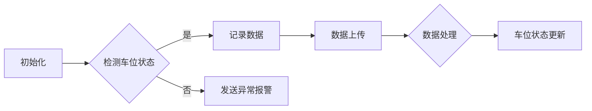
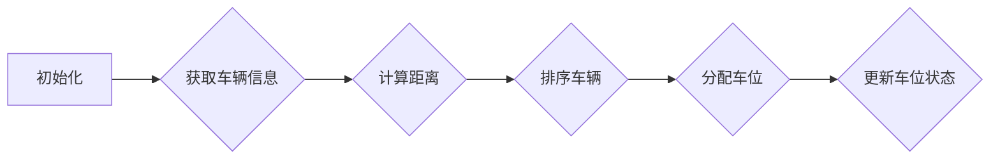
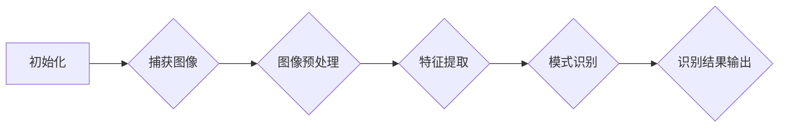
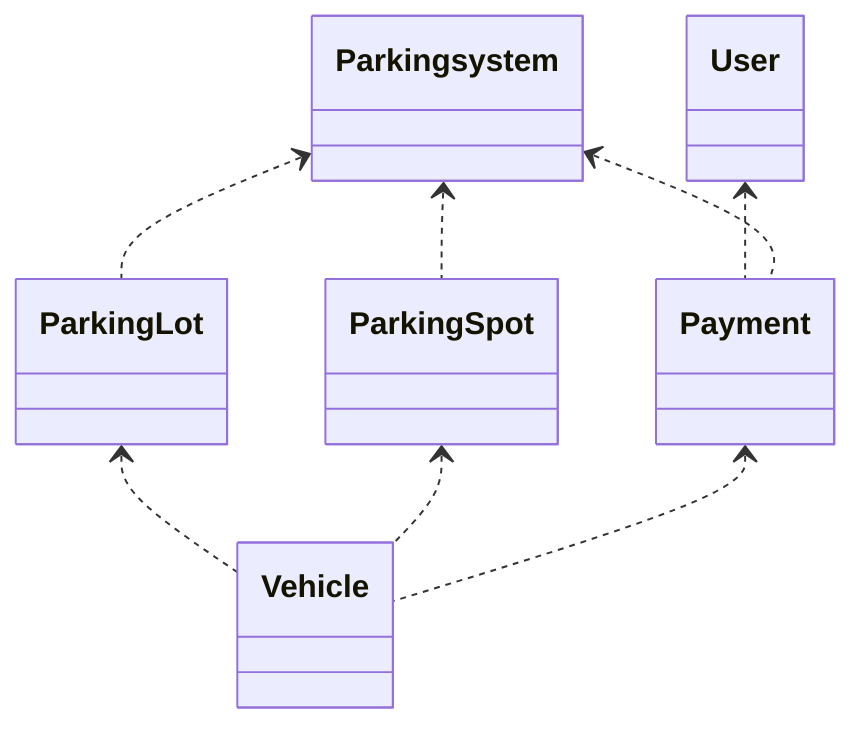

                 


# 物联网在智慧停车管理中的应用

关键词：物联网、智慧停车管理、传感器、通信协议、算法、系统架构、项目实战、最佳实践

摘要：本文将深入探讨物联网在智慧停车管理中的应用，从背景介绍、核心概念、算法原理、系统架构、项目实战以及最佳实践等多个方面，全面解析物联网技术在智慧停车管理中的价值与挑战。

## 背景介绍

### 核心概念术语说明

- 物联网（IoT，Internet of Things）：通过传感器、网络和计算机技术，将物理设备连接到互联网，实现信息的采集、传输和处理。
- 智慧停车管理：利用物联网技术，实现对停车资源的智能监控、管理和优化，提高停车效率，减少拥堵。

### 问题背景

随着城市化进程的加速，车辆保有量的快速增长导致停车难题日益凸显。传统的停车管理方式效率低下，无法满足日益增长的停车需求。智慧停车管理通过物联网技术，提供了新的解决方案。

### 问题描述

智慧停车管理中的主要问题包括车位监测不准确、车流分析不足、停车资源分配不合理等。这些问题导致停车效率低下，车主体验不佳。

### 问题解决

物联网技术在智慧停车管理中的应用，可以解决上述问题，提升停车管理的智能化水平。

### 边界与外延

智慧停车管理不仅局限于城市，还适用于停车场、高速公路服务区等场景。未来，随着技术的进步，智慧停车管理将更加智能化、便捷化。

### 概念结构与核心要素组成

智慧停车管理系统主要由以下几个核心要素组成：

1. 传感器：用于检测车位状态、车辆信息等。
2. 通信协议：确保传感器数据的有效传输。
3. 数据处理中心：对传感器数据进行处理和分析。
4. 用户界面：提供停车信息查询、缴费等功能。

## 核心概念与联系

### 物联网的基本概念与架构

#### 核心概念原理

物联网是由物理设备（如传感器、执行器等）通过网络连接而成的系统，能够实现信息的采集、传输和处理。

#### 概念属性特征对比表格

| 特征             | 传统网络     | 物联网         |
|------------------|--------------|----------------|
| 连接设备数量     | 较少         | 极大数量       |
| 信息传输范围     | 局部网络     | 全球互联网     |
| 数据采集方式     | 定期采集     | 实时采集       |
| 系统复杂度       | 较低         | 较高           |

#### ER实体关系图架构

```mermaid
erDiagram
  数据采集 --> 数据处理 | 《<--》
  数据传输 --> 数据处理
  用户界面 --> 数据处理
  数据采集 ||--|| 用户界面
  数据传输 ||--|| 用户界面
  数据处理 ||--|| 用户界面
```

### 智慧停车管理的核心概念

#### 核心概念原理

智慧停车管理利用物联网技术，实现对停车资源的智能监控、管理和优化，提高停车效率。

#### 概念属性特征对比表格

| 特征             | 传统停车管理   | 智慧停车管理   |
|------------------|----------------|----------------|
| 车位监测         | 人工检测       | 智能传感器检测 |
| 车流分析         | 人工统计       | 自动分析       |
| 车位分配         | 手动分配       | 自动分配       |
| 支付方式         | 现金支付       | 无感支付       |

#### ER实体关系图架构

```mermaid
erDiagram
  车位 --> 车辆
  车辆 --> 支付
  车位 ||--|| 车辆
  车辆 ||--|| 支付
```

## 算法原理讲解

### 传感器数据处理算法

#### 算法流程图



#### Python源代码实现

```python
# 传感器数据处理算法示例
def process_sensor_data(sensor_data):
    if sensor_data['occupied']:
        # 记录数据
        record_data(sensor_data)
    else:
        # 发送异常报警
        send_alarm("车位异常")

def record_data(sensor_data):
    # 实现数据记录逻辑
    pass

def send_alarm(message):
    # 实现报警发送逻辑
    pass
```

### 车位分配算法

#### 数学模型和公式

$$
\text{最优车位分配} = \arg\min_{P} \sum_{i=1}^{N} d(i, P_i)
$$

其中，$P$为待分配的车位，$N$为车辆数量，$d(i, P_i)$为车辆$i$与车位$P_i$之间的距离。

#### 算法流程图



#### Python源代码实现

```python
# 车位分配算法示例
def assign_parking_spots(vehicles, spots):
    # 计算距离
    distances = []
    for vehicle in vehicles:
        for spot in spots:
            distances.append((spot, calculate_distance(vehicle, spot)))
    # 排序车辆
    distances.sort(key=lambda x: x[1])
    # 分配车位
    assigned_spots = [None] * len(vehicles)
    for i, (spot, _) in enumerate(distances):
        assigned_spots[i] = spot
    # 更新车位状态
    update_spot_status(assigned_spots)

def calculate_distance(vehicle, spot):
    # 实现距离计算逻辑
    pass

def update_spot_status(assigned_spots):
    # 实现车位状态更新逻辑
    pass
```

### 车辆识别与追踪算法

#### 数学模型和公式

$$
\text{车辆识别率} = \frac{\text{正确识别的车辆数}}{\text{总车辆数}} \times 100\%
$$

#### 算法流程图



#### Python源代码实现

```python
# 车辆识别与追踪算法示例
def recognize_vehicle(image):
    # 实现图像预处理逻辑
    processed_image = preprocess_image(image)
    # 特征提取
    features = extract_features(processed_image)
    # 模式识别
    recognized_vehicle = recognize_vehicle_model(features)
    return recognized_vehicle

def preprocess_image(image):
    # 实现图像预处理逻辑
    pass

def extract_features(image):
    # 实现特征提取逻辑
    pass

def recognize_vehicle_model(features):
    # 实现模式识别逻辑
    pass
```

## 系统分析与架构设计

### 问题场景介绍

智慧停车管理系统需要应对的场景包括：城市停车难、停车场管理、高速公路服务区停车等。

### 项目介绍

本文以一个城市智慧停车管理系统为例，介绍系统的功能设计与架构设计。

### 系统功能设计

系统功能设计主要包括：车位状态监测、车流分析、车位分配、支付功能等。

#### 领域模型Mermaid类图



### 系统架构设计

系统架构设计主要包括：前端展示层、数据处理层、后端服务层等。

#### Mermaid架构图


### 系统接口设计与系统交互

系统接口设计主要包括：车位状态查询接口、车流分析接口、车位分配接口、支付接口等。

#### Mermaid序列图

```mermaid
sequenceDiagram
    participant 用户 as 用户
    participant 系统A as 系统A
    participant 系统B as 系统B
    participant 系统C as 系统C

    用户->>系统A: 获取车位状态
    系统

