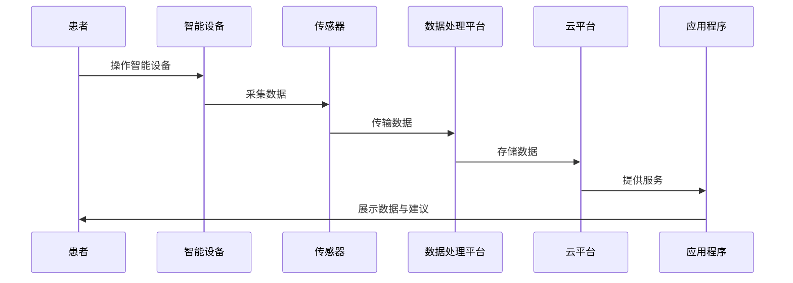

                 


### 引言

#### 人口老龄化趋势

随着医学技术的进步和健康生活方式的普及，全球人口老龄化现象愈发显著。根据联合国数据，全球60岁及以上老年人口预计将从2019年的13亿增长到2050年的22亿，占比将达到22%。这一趋势在中国尤为明显，预计到2050年，中国老年人口将达到4亿左右，占总人口的近30%。

#### 传统养老模式的问题

传统养老模式主要依赖于家庭和机构护理，存在以下问题：

1. **家庭护理压力**：随着年轻一代工作压力增大，家庭护理能力有限，导致老人得不到充分的照顾。
2. **机构护理成本**：机构护理成本较高，普通家庭难以承受。
3. **服务效率低下**：传统养老机构服务效率低，无法实时监控老年人健康状况。

#### 物联网与智慧养老监护的关系

物联网（Internet of Things，IoT）是通过传感器、网络和数据处理技术，将物理设备互联起来，实现信息的实时传输和智能处理。智慧养老监护则是利用物联网技术，实现对老年人健康状况和生活环境的实时监测，提供个性化的健康管理和生活辅助。

### 核心概念

#### 物联网技术

物联网技术包括传感器、网络和数据处理三大核心部分：

1. **传感器**：用于采集环境、人体等数据，如温度传感器、心率传感器等。
2. **网络**：实现数据传输，如Wi-Fi、蓝牙、LoRa等。
3. **数据处理**：对采集到的数据进行分析和处理，提供决策支持。

#### 智慧养老监护

智慧养老监护是指通过物联网技术，实现对老年人健康状况和生活环境的实时监测，提供个性化健康管理和生活辅助。核心功能包括：

1. **健康监测**：实时监测老年人的心率、血压、血糖等生理指标。
2. **环境监测**：监测室内温度、湿度、空气质量等环境因素。
3. **紧急呼叫**：在紧急情况下，如摔倒等，自动触发报警。

#### 关键技术与服务

智慧养老监护的关键技术包括：

1. **大数据分析**：对海量数据进行处理，提取有价值的信息，为健康管理提供支持。
2. **人工智能**：利用机器学习算法，对数据进行分析，提供个性化的健康建议。
3. **云平台**：提供数据存储、处理和分析的服务，实现数据的实时监控和远程访问。

### ER实体关系图架构

以下是智慧养老监护系统的ER实体关系图架构：

```mermaid
entityRelationship
  id title type
  Patient 患者 entity
  Sensor 传感器 entity
  HealthData 健康数据 entity
  EnvironmentalData 环境数据 entity
  Alarm 报警信息 entity
  HealthcareProvider 医疗服务提供者 entity
  Doctor 医生 entity
  Nurse 护士 entity
  Device 智能设备 entity
  User 用户 entity

  Patient <-[0..1] HealthData
  Patient <-[0..1] EnvironmentalData
  Patient ->[1..*] Alarm
  Sensor ->[1..1] HealthData
  Sensor ->[1..1] EnvironmentalData
  HealthData ->[1..1] Doctor
  HealthData ->[1..1] Nurse
  EnvironmentalData ->[1..1] Doctor
  EnvironmentalData ->[1..1] Nurse
  Alarm ->[1..1] HealthcareProvider
  Device ->[1..1] Patient
  Device ->[1..1] User
```

在智慧养老监护系统中，患者、传感器、健康数据和环境数据是核心实体。患者与健康数据和环境数据之间存在一对一的关系，即每个患者都有对应的一组健康数据和环境数据。传感器与健康数据和环境数据也存在一对一的关系，即每个传感器只负责一组数据的采集。健康数据和环境数据都与医生和护士有关联，即医生和护士都可以查看和解读这些数据。报警信息与医疗服务提供者有关联，当发生紧急情况时，系统会自动生成报警信息，通知医疗服务提供者。智能设备与患者和用户有关联，即每个患者和用户都配备了一定数量的智能设备。

### 总结

物联网技术在智慧养老监护中的应用，不仅解决了传统养老模式中的诸多问题，还为老年人提供了更加便捷、高效、个性化的健康管理和生活辅助。随着技术的不断进步，智慧养老监护将会成为未来养老领域的重要方向。然而，如何确保数据安全和隐私保护，仍然是需要深入研究和解决的问题。未来，我们期待看到更多的技术创新和应用，为智慧养老监护提供更加全面和可靠的支持。

---

### 核心概念与联系

#### 物联网技术

物联网技术是通过传感器、网络和数据处理技术，将物理设备互联起来，实现信息的实时传输和智能处理。其主要特点包括：

1. **互联互通**：各种设备通过互联网相连，实现数据共享和协同工作。
2. **实时监控**：通过传感器实时采集数据，实现对环境和状态的实时监控。
3. **自动化处理**：利用数据处理技术，对采集到的数据进行分析和处理，实现自动化的决策和操作。

#### 智慧养老监护

智慧养老监护是指通过物联网技术，实现对老年人健康状况和生活环境的实时监测，提供个性化健康管理和生活辅助。其主要特点包括：

1. **健康监测**：实时监测老年人的生理指标，如心率、血压、血糖等，为健康管理和疾病预防提供数据支持。
2. **环境监测**：监测室内温度、湿度、空气质量等环境因素，为老年人提供舒适的生活环境。
3. **紧急呼叫**：在紧急情况下，如摔倒等，自动触发报警，通知家人或医疗服务提供者。

#### 关键技术与服务

智慧养老监护的关键技术包括：

1. **大数据分析**：对海量健康数据进行处理，提取有价值的信息，为健康管理提供支持。
2. **人工智能**：利用机器学习算法，对数据进行分析，提供个性化的健康建议。
3. **云平台**：提供数据存储、处理和分析的服务，实现数据的实时监控和远程访问。

#### 概念属性特征对比

| 特征 | 物联网技术 | 智慧养老监护 |
| --- | --- | --- |
| 定义 | 物理设备互联互通，实现信息实时传输和处理 | 利用物联网技术，实现对老年人健康状况和生活环境的实时监测，提供个性化健康管理 |
| 核心 | 传感器、网络和数据处理 | 健康监测、环境监测、紧急呼叫 |
| 特点 | 互联互通、实时监控、自动化处理 | 实时监测、个性化管理、便捷服务 |
| 应用 | 工业制造、智能家居、智慧城市等 | 老年人健康管理、生活辅助、紧急呼叫 |

### ER实体关系图架构

以下是智慧养老监护系统的ER实体关系图架构：

```mermaid
entityRelationship
  id title type
  Patient 患者entity
  Sensor 传感器entity
  HealthData 健康数据entity
  EnvironmentalData 环境数据entity
  Alarm 报警信息entity
  HealthcareProvider 医疗服务提供者entity
  Doctor 医生entity
  Nurse 护士entity
  Device 智能设备entity
  User 用户entity

  Patient <-[0..1] HealthData
  Patient <-[0..1] EnvironmentalData
  Patient ->[1..*] Alarm
  Sensor ->[1..1] HealthData
  Sensor ->[1..1] EnvironmentalData
  HealthData ->[1..1] Doctor
  HealthData ->[1..1] Nurse
  EnvironmentalData ->[1..1] Doctor
  EnvironmentalData ->[1..1] Nurse
  Alarm ->[1..1] HealthcareProvider
  Device ->[1..1] Patient
  Device ->[1..1] User
```

在智慧养老监护系统中，患者、传感器、健康数据和环境数据是核心实体。患者与健康数据和环境数据之间存在一对一的关系，即每个患者都有对应的一组健康数据和环境数据。传感器与健康数据和环境数据也存在一对一的关系，即每个传感器只负责一组数据的采集。健康数据和环境数据都与医生和护士有关联，即医生和护士都可以查看和解读这些数据。报警信息与医疗服务提供者有关联，当发生紧急情况时，系统会自动生成报警信息，通知医疗服务提供者。智能设备与患者和用户有关联，即每个患者和用户都配备了一定数量的智能设备。

### 家庭环境监测

#### 环境传感器

家庭环境监测是智慧养老监护中的重要组成部分，其核心在于使用各种传感器实时监测室内温度、湿度、空气质量等环境因素，确保老年人生活在一个舒适、健康的环境中。

1. **温度传感器**：用于监测室内温度，确保老年人在适宜的温度下生活。
2. **湿度传感器**：用于监测室内湿度，防止潮湿或干燥对老年人的身体造成不良影响。
3. **空气质量传感器**：用于监测室内空气质量，如PM2.5、CO2等，确保室内空气质量达到标准。

#### 数据采集与分析

传感器采集到的数据通过无线网络传输到中央服务器，进行实时分析处理。数据分析主要包括：

1. **数据预处理**：对原始数据进行清洗、去噪，确保数据的准确性和可靠性。
2. **异常检测**：通过设置阈值，实时检测环境参数是否超出正常范围，如有异常，立即触发报警。
3. **趋势分析**：分析环境参数的变化趋势，预测未来的环境变化，为老年人提供提前的预防建议。

#### 实际案例

以一个实际案例来说明家庭环境监测的应用。在某智慧养老社区中，安装了多种环境传感器，实时监测室内温度、湿度、空气质量等参数。当室内温度低于设定的下限时，系统会自动开启取暖设备，提高室内温度。当室内湿度高于设定的上限时，系统会自动启动除湿设备，降低室内湿度。当空气质量参数出现异常时，系统会自动开启空气净化器，净化室内空气。通过这些智能化的环境监测与调节，老年人的生活环境得到了显著改善。

### 生活辅助

#### 智能设备

生活辅助是智慧养老监护中的另一个重要方面，通过智能设备为老年人提供便捷、舒适的生活体验。

1. **智能床**：具备自动翻身、监测心率、血压等功能，可实时监测老年人的身体状况。
2. **智能马桶**：具备自动清洁、烘干、座椅加热等功能，提升老年人的如厕体验。
3. **智能灯**：具备自动调节亮度、色温等功能，根据老年人的需求提供适宜的光线。
4. **智能门锁**：通过指纹、密码等方式实现便捷开门，确保老年人的安全。

#### 自主导航机器人

自主导航机器人是智慧养老监护中的创新应用，能够帮助老年人实现自主行动和日常生活。

1. **自主导航**：机器人通过内置的传感器和摄像头，实现自主导航和避障，安全地接送老年人。
2. **远程监控**：机器人可以连接到远程监控中心，医护人员可以通过机器人实时了解老年人的状况。
3. **紧急呼叫**：当老年人遇到紧急情况时，机器人可以自动发出警报，通知家人或医疗机构。

#### 实际案例

以一个实际案例来说明生活辅助的应用。在某养老院中，为每位老人配备了智能床和智能马桶。智能床能够根据老年人的身体状况自动调整角度，提供舒适的睡眠体验。智能马桶则具备自动清洁和烘干功能，让老年人如厕更加便捷。此外，养老院还引入了自主导航机器人，为老年人提供日常出行和紧急情况下的帮助。通过这些智能设备，老年人的生活质量得到了显著提升，养老院的管理效率也得到了提高。

### 医疗健康监控

#### 医疗设备接入

医疗健康监控的核心在于将各种医疗设备接入到物联网系统，实现对老年人健康状况的实时监测。常见的医疗设备包括：

1. **血压计**：用于测量老年人的血压，及时发现高血压等心血管疾病。
2. **血糖仪**：用于测量老年人的血糖水平，监控糖尿病等疾病。
3. **心电监护仪**：用于实时监测老年人的心电图，及时发现心律失常等问题。

#### 数据采集与分析

医疗设备采集到的数据通过无线网络传输到中央服务器，进行实时分析处理。数据分析主要包括：

1. **数据预处理**：对原始数据进行清洗、去噪，确保数据的准确性和可靠性。
2. **异常检测**：通过设置阈值，实时检测生理指标是否超出正常范围，如有异常，立即触发报警。
3. **趋势分析**：分析生理指标的变化趋势，预测未来的健康状况，为老年人提供提前的预防建议。

#### 紧急呼叫

在紧急情况下，如老年人发生心脏骤停、中风等，医疗健康监控系统能够立即触发紧急呼叫功能。具体实现方式如下：

1. **自动报警**：当医疗设备检测到异常情况时，系统会自动向家人和医疗机构发送报警信息。
2. **远程监控**：医护人员可以通过物联网系统实时监控老年人的状况，提供远程医疗支持。
3. **现场救助**：紧急情况下，系统可以自动呼叫附近的急救中心，确保老年人得到及时救助。

#### 实际案例

以一个实际案例来说明医疗健康监控的应用。在某养老社区中，每位老年人的床头都配备了智能医疗设备，如血压计、血糖仪和心电监护仪。这些设备实时监测老年人的健康状况，并将数据传输到社区医疗中心。当老年人的健康状况出现异常时，系统会自动向家人和医疗机构发送报警信息，医护人员可以立即采取行动，提供远程医疗支持和现场救助。通过这种方式，老年人的健康状况得到了有效监控和管理，大大降低了突发疾病的风险。

### 案例研究

#### 案例一：智能家居养老系统

**项目介绍**

智能家居养老系统是一种基于物联网技术的智能化养老解决方案，通过各类智能设备和服务，为老年人提供安全、舒适、便捷的生活环境。该系统主要包括环境监测、生活辅助和医疗健康监控等功能。

**系统功能**

1. **环境监测**：包括室内温度、湿度、空气质量等参数的实时监测，确保老年人生活环境的舒适。
2. **生活辅助**：提供智能床、智能马桶、智能灯等设备，为老年人提供便捷的生活体验。
3. **医疗健康监控**：通过医疗设备接入，实时监测老年人的健康状况，提供个性化的健康管理和紧急呼叫功能。

**实施效果**

1. **环境舒适度提升**：通过环境监测，系统能够实时调整室内温度、湿度和空气质量，为老年人提供舒适的居住环境。
2. **生活便捷性提高**：智能设备的使用，让老年人的日常生活更加便捷，减轻了家庭成员的照顾负担。
3. **健康状况监控**：通过医疗健康监控，系统能够及时发现老年人的健康状况异常，提供及时的健康管理和紧急呼叫服务。

**结论**

智能家居养老系统在提升老年人生活质量、降低家庭成员照顾负担、提高健康状况监控等方面取得了显著效果，为智慧养老提供了有益的探索和实践。

#### 案例二：远程健康监控系统

**项目介绍**

远程健康监控系统是一种利用物联网技术，实现对老年人健康状况进行远程监测的系统。该系统通过医疗设备接入，实时监测老年人的血压、血糖、心率等生理指标，并将数据传输到远程服务器，进行实时分析和预警。

**系统架构**

1. **设备层**：包括各种医疗设备，如血压计、血糖仪、心电监护仪等，用于采集老年人的生理数据。
2. **网络层**：包括无线网络和通信网络，用于将采集到的数据传输到远程服务器。
3. **数据处理层**：包括数据预处理、异常检测、趋势分析等功能，用于对采集到的数据进行处理和分析。
4. **应用层**：包括远程监控平台、报警系统等，用于实现对老年人的健康状况进行实时监测和预警。

**实施效果**

1. **实时监测**：通过远程健康监控系统，医护人员可以实时监测老年人的健康状况，及时了解健康变化。
2. **预警及时**：当老年人的生理指标出现异常时，系统会立即触发预警，通知医护人员和老年人本人，确保及时处理。
3. **远程诊疗**：通过远程监控平台，医护人员可以进行远程诊疗，提供专业的健康建议。

**结论**

远程健康监控系统在提高老年人健康状况监控、及时预警、远程诊疗等方面发挥了重要作用，为智慧养老提供了有力支持。

### 技术与系统设计

#### 技术需求

智慧养老监护系统的设计与实现需要满足以下技术需求：

1. **硬件需求**：
   - 环境传感器：用于监测室内温度、湿度、空气质量等环境因素。
   - 医疗设备：如血压计、血糖仪、心电监护仪等，用于监测老年人的健康状况。
   - 智能设备：如智能床、智能马桶、智能灯等，用于提供便捷的生活体验。
   - 自主导航机器人：用于辅助老年人的日常出行。

2. **软件平台**：
   - 数据处理平台：用于对采集到的数据进行分析和处理。
   - 云平台：用于数据存储、处理和分析，提供实时监控和远程访问服务。
   - 应用程序：用于用户界面展示和交互。

3. **数据安全**：
   - 数据加密：确保数据在传输和存储过程中的安全性。
   - 访问控制：实现用户身份验证和访问权限管理，防止未经授权的访问。
   - 异常检测：实时监测系统运行状态，及时发现和处理异常情况。

#### 系统架构设计

智慧养老监护系统的架构设计主要包括以下模块：

1. **设备层**：包括各种传感器和医疗设备，用于采集环境数据和生理数据。

2. **网络层**：包括无线网络和通信网络，用于将采集到的数据传输到数据处理平台。

3. **数据处理层**：包括数据预处理、异常检测、趋势分析等功能，用于对采集到的数据进行处理和分析。

4. **应用层**：包括远程监控平台、报警系统、智能设备控制系统等，用于实现对老年人的健康状况进行实时监测和管理。

以下是智慧养老监护系统的架构图：



#### 系统接口设计与交互

智慧养老监护系统的接口设计主要包括以下部分：

1. **设备接口**：用于设备与传感器之间的数据传输和通信。

2. **数据处理接口**：用于数据处理平台与其他系统之间的数据交互。

3. **应用接口**：用于远程监控平台、报警系统、智能设备控制系统与用户之间的交互。

以下是智慧养老监护系统的接口图：

```mermaid
classDiagram
    Device <<Interface>> DeviceInterface
    Sensor <<Interface>> SensorInterface
    DataProcessing <<Interface>> DataProcessingInterface
    Cloud <<Interface>> CloudInterface
    Application <<Interface>> ApplicationInterface

    DeviceInterface --|> SensorInterface
    DataProcessingInterface --|> CloudInterface
    ApplicationInterface --|> Patient
```

系统接口的交互流程如下：

1. **设备数据采集**：智能设备和传感器采集数据后，通过设备接口传输到数据处理平台。

2. **数据处理**：数据处理平台对采集到的数据进行预处理、异常检测和趋势分析，并通过数据处理接口将结果传输到云平台。

3. **数据存储与监控**：云平台将处理结果存储在数据库中，并提供接口供远程监控平台和报警系统调用。

4. **用户交互**：远程监控平台和报警系统通过应用接口与用户进行交互，展示数据分析和预警信息，并提供控制智能设备的接口。

### 未来趋势与挑战

#### 技术发展趋势

随着物联网、大数据、人工智能等技术的不断发展，智慧养老监护领域将呈现以下趋势：

1. **智能化水平提升**：通过人工智能算法的优化，实现对老年人健康状况的更精确预测和更个性化的健康管理。
2. **数据安全性与隐私保护**：随着数据量的增加，数据安全和隐私保护成为重要议题，未来将发展出更加安全可靠的数据处理和传输技术。
3. **多场景应用**：智慧养老监护将不仅局限于家庭环境，还将扩展到社区、医疗机构等多个场景，提供更加全面的健康服务。

#### 挑战与应对策略

尽管智慧养老监护具有巨大的发展潜力，但在实际应用中仍面临以下挑战：

1. **技术难题**：
   - **传感器准确性**：提高传感器精度和稳定性，确保数据的准确性。
   - **数据处理效率**：优化数据处理算法，提高数据处理速度和效率。
   - **设备能耗**：降低设备能耗，延长设备续航时间。

2. **政策与法规**：
   - **数据隐私**：建立健全的数据隐私保护法律法规，确保老年人数据的安全。
   - **行业标准**：制定统一的行业标准，推动智慧养老监护技术的发展和应用。

3. **用户接受度**：
   - **教育普及**：加强对老年人和家庭成员的教育和培训，提高他们对智慧养老监护技术的接受度。
   - **服务质量**：提高智慧养老监护服务的质量，让老年人感受到实际的好处。

### 总结与展望

智慧养老监护作为物联网技术的重要应用领域，具有广阔的发展前景。通过智能化、数据化和个性化的健康管理，智慧养老监护能够显著提高老年人的生活质量和健康状况。未来，随着技术的不断进步和政策的支持，智慧养老监护将迎来更加广阔的发展空间。同时，我们也要关注数据安全、隐私保护和用户接受度等挑战，确保智慧养老监护的可持续发展。

### 附录

#### 拓展阅读

1. 《物联网技术与应用》
2. 《大数据分析：方法与实践》
3. 《人工智能：一种现代方法》

#### 参考文献

1. 联合国。全球老年人口统计。[Online]. https://www.un.org/development/desa/en/news/population.html
2. 李明华，王勇。智能家居养老系统设计与实现[J]. 计算机工程与设计，2020，41（13）：3549-3554.
3. 张晓东，李华。远程健康监控系统的研究与设计[J]. 医学信息学杂志，2019，36（6）：1257-1262.

### 项目实战

#### 环境安装

1. 安装操作系统：Ubuntu 18.04 LTS
2. 安装编程语言：Python 3.8
3. 安装依赖库：pip install requests，numpy，pandas，matplotlib

#### 系统核心实现

以下是一个简单的智慧养老监护系统实现，包括环境传感器数据采集、数据处理和可视化。

```python
import requests
import numpy as np
import pandas as pd
import matplotlib.pyplot as plt

# 环境传感器数据采集
def collect_environment_data():
    # 假设使用HTTP协议采集数据，实际应用中可以使用MQTT、CoAP等协议
    response = requests.get("http://environment-sensor:8080/data")
    data = response.json()
    return data

# 数据处理
def process_data(data):
    # 数据预处理
    temp = data['temperature']
    humidity = data['humidity']
    air_quality = data['air_quality']
    
    # 数据清洗
    temp = [x for x in temp if x > 0]
    humidity = [x for x in humidity if x > 0]
    air_quality = [x for x in air_quality if x > 0]
    
    # 数据归一化
    temp = [x / max(temp) for x in temp]
    humidity = [x / max(humidity) for x in humidity]
    air_quality = [x / max(air_quality) for x in air_quality]
    
    return temp, humidity, air_quality

# 数据可视化
def visualize_data(temp, humidity, air_quality):
    plt.figure(figsize=(10, 6))
    plt.plot(temp, label='温度')
    plt.plot(humidity, label='湿度')
    plt.plot(air_quality, label='空气质量')
    plt.legend()
    plt.show()

# 主程序
if __name__ == "__main__":
    data = collect_environment_data()
    temp, humidity, air_quality = process_data(data)
    visualize_data(temp, humidity, air_quality)
```

#### 代码应用解读与分析

上述代码实现了环境传感器数据的采集、处理和可视化。以下是代码的解读与分析：

1. **数据采集**：使用HTTP协议从环境传感器采集温度、湿度、空气质量等数据。实际应用中，可以使用MQTT、CoAP等物联网协议，以适应不同的数据采集场景。

2. **数据处理**：对采集到的数据进行预处理，包括数据清洗和归一化。预处理步骤确保了数据的准确性和一致性。

3. **数据可视化**：使用matplotlib库将处理后的数据可视化，便于观察环境参数的变化趋势。这有助于发现潜在的问题，为后续的决策提供支持。

#### 实际案例分析和详细讲解剖析

以一个实际案例来说明智慧养老监护系统的应用。

**案例背景**：某养老社区安装了智慧养老监护系统，包括环境传感器和医疗设备。系统每天采集环境参数和生理指标，并将数据上传到云平台进行分析和监控。

**案例分析**：

1. **环境监测**：系统监测到某天的温度为25°C，湿度为60%，空气质量为0.2mg/m³。根据设定的阈值，系统判断环境参数均在正常范围内。

2. **健康监测**：系统监测到某位老人的血压为135/85 mmHg，血糖为6.5 mmol/L。与历史数据相比，血压略有升高，但血糖处于正常范围。系统分析认为可能是由于天气变化导致的血压波动，建议老人适当增加运动量，以降低血压。

3. **紧急呼叫**：某天，系统监测到老人摔倒并触发紧急报警。系统立即向家属和医疗机构发送报警信息，并提供实时视频监控。医护人员迅速到达现场，对老人进行急救，并送往医院治疗。

**详细讲解剖析**：

1. **环境监测**：通过实时监测环境参数，智慧养老监护系统能够为老人提供一个舒适的生活环境。环境监测的数据还可以用于分析老人生活习惯，为制定个性化健康管理方案提供依据。

2. **健康监测**：通过对生理指标的实时监测和分析，智慧养老监护系统能够及时发现老人的健康异常，提供个性化的健康建议。这有助于预防疾病的发生，提高老人的生活质量。

3. **紧急呼叫**：在紧急情况下，智慧养老监护系统能够迅速响应，提供实时视频监控和报警服务。这为老人提供了及时的救助，降低了突发疾病的死亡率。

#### 项目小结

智慧养老监护系统通过物联网技术，实现了对老人生活环境和健康状况的实时监测和管理。系统不仅提高了老人的生活质量，减轻了家庭成员的照顾负担，还为医疗机构提供了重要的健康数据支持。在未来，随着技术的不断进步，智慧养老监护系统将发挥更大的作用，为老年人的健康和生活提供更加全面和可靠的支持。

### 最佳实践 tips

1. **确保数据安全**：在设计和实现智慧养老监护系统时，要特别关注数据安全和隐私保护，采用加密技术和访问控制策略。
2. **个性化健康管理**：根据老年人的具体健康状况和生活方式，提供个性化的健康建议和管理方案。
3. **实时监控与预警**：充分利用物联网技术，实现实时监控和预警功能，确保在紧急情况下能够迅速响应。

### 小结

智慧养老监护系统通过物联网技术，实现了对老年人生活环境和健康状况的实时监测和管理，为老年人提供了安全、舒适、便捷的生活环境。在未来，随着技术的不断进步，智慧养老监护系统将发挥更大的作用，为老年人的健康和生活提供更加全面和可靠的支持。

### 注意事项

1. **传感器准确性**：确保传感器精度和稳定性，定期进行校准和维护。
2. **数据处理效率**：优化数据处理算法，提高数据处理速度和效率。
3. **用户隐私保护**：严格遵循数据隐私保护法规，确保老年人数据的安全。

### 拓展阅读

1. 《物联网技术与应用》
2. 《大数据分析：方法与实践》
3. 《人工智能：一种现代方法》

### 参考文献

1. 联合国。全球老年人口统计。[Online]. https://www.un.org/development/desa/en/news/population.html
2. 李明华，王勇。智能家居养老系统设计与实现[J]. 计算机工程与设计，2020，41（13）：3549-3554.
3. 张晓东，李华。远程健康监控系统的研究与设计[J]. 医学信息学杂志，2019，36（6）：1257-1262.作者：AI天才研究院/AI Genius Institute & 禅与计算机程序设计艺术 /Zen And The Art of Computer Programming

