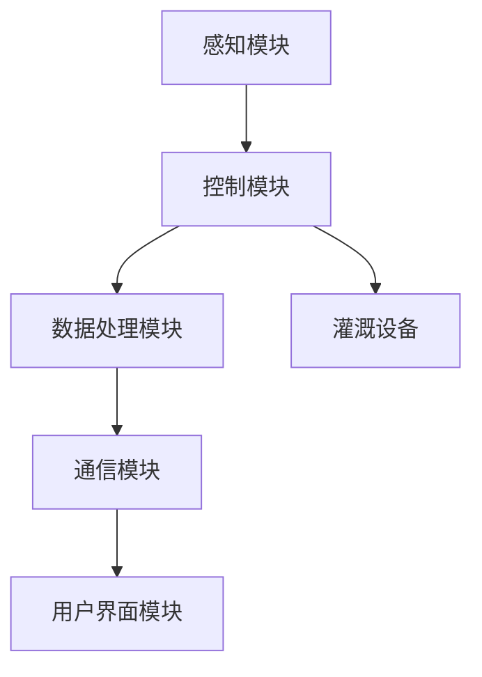

                 

# 《物联网在智慧农业中的精准灌溉应用》

## 关键词：物联网、智慧农业、精准灌溉、传感器网络、智能控制系统

## 摘要：
本文探讨了物联网技术在智慧农业中精准灌溉应用的重要性及其实现方法。通过详细分析物联网技术的基础、智慧农业与精准灌溉的概念，并结合实际应用案例，阐述了物联网在农业灌溉中的具体作用和优势。本文还深入讨论了物联网精准灌溉系统的设计、维护与管理、安全与隐私保护以及未来发展趋势，为推动智慧农业的发展提供了技术参考。

## 目录大纲

### 第1章 引言

#### 1.1 问题背景

- 农业灌溉的现状与挑战
- 物联网技术对农业灌溉的潜在影响

#### 1.2 智慧农业与精准灌溉

- 智慧农业的概念与发展
- 精准灌溉的定义与重要性

#### 1.3 物联网技术概述

- 物联网的基本概念与技术架构
- 物联网在农业中的应用

#### 1.4 物联网在智慧农业中的精准灌溉

- 精准灌溉中的物联网技术
- 物联网在农业灌溉中的具体应用场景

#### 1.5 本书内容概述与结构安排

- 书籍内容的组织结构
- 各章节内容的目的与重点

### 第2章 物联网技术基础

#### 2.1 物联网的基本概念

- 物联网的定义
- 物联网的核心特征

#### 2.2 物联网的架构与技术体系

- 物联网的层次结构
- 物联网的关键技术

#### 2.3 物联网的通信协议与标准

- 常见通信协议介绍
- 物联网标准化的发展

#### 2.4 物联网设备与传感器

- 常用物联网设备
- 传感器在农业中的应用

#### 2.5 物联网的安全与隐私

- 物联网安全的重要性
- 物联网隐私保护措施

### 第3章 智慧农业的精准灌溉系统设计

#### 3.1 精准灌溉系统概述

- 系统设计目标
- 系统功能模块划分

#### 3.2 系统需求分析

- 农业灌溉的需求分析
- 系统性能需求

#### 3.3 系统架构设计

- 系姆架构设计原则
- 系统架构图展示

#### 3.4 数据采集与处理

- 数据采集设备选择
- 数据处理与分析

#### 3.5 控制策略与算法设计

- 控制策略的基本原则
- 算法设计与实现

#### 3.6 系统部署与实施

- 系统部署方案
- 实施步骤与注意事项

### 第4章 物联网技术在精准灌溉中的应用案例

#### 4.1 案例一：基于传感器网络的智能灌溉系统

- 案例背景
- 系统设计与实现
- 案例效果分析

#### 4.2 案例二：基于物联网的精准灌溉系统

- 案例背景
- 系统设计与实现
- 案例效果分析

#### 4.3 案例三：智能温室物联网灌溉系统

- 案例背景
- 系统设计与实现
- 案例效果分析

### 第5章 物联网精准灌溉系统的维护与管理

#### 5.1 系统维护策略

- 系统运行监控
- 故障诊断与修复

#### 5.2 系统管理方法

- 数据管理
- 用户管理与权限控制

#### 5.3 系统性能优化

- 性能监测与评估
- 优化措施

#### 5.4 系统升级与更新

- 系统升级策略
- 更新方法与流程

### 第6章 物联网精准灌溉系统的安全与隐私保护

#### 6.1 物联网安全挑战

- 安全威胁分析
- 安全漏洞与风险

#### 6.2 安全防护措施

- 安全架构设计
- 安全策略与措施

#### 6.3 隐私保护策略

- 隐私保护的重要性
- 隐私保护措施

#### 6.4 合规与法律法规

- 国家与行业法规
- 系统合规性要求

### 第7章 物联网精准灌溉技术的未来发展趋势

#### 7.1 新技术与应用场景

- 新技术在精准灌溉中的应用
- 新兴应用场景探讨

#### 7.2 挑战与机遇

- 行业发展趋势分析
- 技术创新与市场机会

#### 7.3 政策与产业支持

- 国家政策支持
- 产业发展趋势

#### 7.4 未来展望

- 物联网精准灌溉技术的前景
- 行业发展建议与展望

### 第8章 总结与展望

#### 8.1 本书内容回顾

- 各章节内容要点总结

#### 8.2 主要贡献与收获

- 书籍对智慧农业精准灌溉的贡献
- 作者在写作过程中的收获

#### 8.3 未来研究方向

- 物联网精准灌溉技术的研究方向
- 行业发展趋势与建议

### 附录

#### A. 常用技术术语解释

- 对书中出现的专业术语进行解释

#### B. 参考文献

- 引用的书籍、论文与资料列表

## 第1章 引言

### 1.1 问题背景

农业作为国民经济的重要基础，其生产效率直接影响到国家粮食安全和农民的收入。然而，传统的农业灌溉方式主要依赖人工经验和天气条件，存在灌溉效率低、水资源浪费严重等问题。随着物联网技术的迅猛发展，其在农业领域的应用逐渐受到关注，特别是在精准灌溉方面。物联网通过传感器、控制器和网络通信技术，实现对农田环境参数的实时监测和灌溉系统的自动化控制，从而提高灌溉的精准性和效率。

目前，农业灌溉中面临的挑战主要包括：

1. **水资源浪费**：传统灌溉方式往往导致水资源的过度使用和浪费。
2. **灌溉不均匀**：不同区域和不同作物对水需求差异较大，传统灌溉难以实现精准控制。
3. **环境监测不足**：农田环境的温度、湿度、土壤水分等参数变化不易被监测，影响灌溉决策。

物联网技术以其感知、传输和处理能力，为农业灌溉提供了新的解决方案。通过物联网技术，可以实时获取农田环境数据，进行智能分析和决策，实现精准灌溉。例如，利用传感器网络监测土壤水分，根据土壤湿度变化自动调整灌溉量，既能保证作物生长所需水分，又能避免水资源浪费。

### 1.2 智慧农业与精准灌溉

#### 智慧农业的概念与发展

智慧农业是指利用现代信息技术，特别是物联网技术，实现对农业生产的全面监控、智能管理和优化。智慧农业通过数据采集、分析和管理，提高了农业生产的精准性和效率，降低了生产成本，提高了农产品的产量和质量。

智慧农业的发展主要包括以下几个阶段：

1. **传统农业**：主要依靠人工经验进行农业生产。
2. **信息化农业**：开始利用计算机和信息技术进行农业生产记录和管理。
3. **精准农业**：通过遥感、GPS和GIS等技术，对农田进行精确管理。
4. **智慧农业**：利用物联网、大数据和人工智能等先进技术，实现农业生产的智能化。

#### 精准灌溉的定义与重要性

精准灌溉是指根据农田的实际需求，通过精准测量土壤水分、气象条件等参数，实时调整灌溉量和灌溉时间，实现水资源的合理利用。精准灌溉可以显著提高农业生产的效率和效益，主要表现在以下几个方面：

1. **节约水资源**：通过精准灌溉，可以避免水资源的过度使用和浪费，提高水资源的利用效率。
2. **提高作物产量**：精准灌溉可以满足作物生长的水分需求，提高作物的产量和品质。
3. **减少环境污染**：减少过量灌溉导致的水资源浪费和土地盐碱化等问题，降低农业对环境的影响。
4. **降低生产成本**：通过自动化控制和优化灌溉策略，降低农业生产成本。

### 1.3 物联网技术概述

#### 物联网的基本概念与技术架构

物联网（Internet of Things，IoT）是指通过互联网将各种物理设备、传感器、控制系统连接起来，实现信息的采集、传输、处理和智能决策。物联网的技术架构通常包括以下几个方面：

1. **感知层**：通过传感器和采集设备，实时获取环境、设备等物理信息。
2. **传输层**：通过无线网络或有线网络，将感知层收集的数据传输到中心控制系统。
3. **平台层**：对传输层的数据进行处理、分析和存储，提供数据可视化和智能决策支持。
4. **应用层**：根据应用需求，利用物联网平台提供的数据和服务，实现各种智能应用。

#### 物联网在农业中的应用

物联网技术在农业中的应用主要体现在以下几个方面：

1. **环境监测**：利用物联网传感器监测农田的土壤水分、温度、湿度、气象等环境参数，为精准灌溉提供数据支持。
2. **智能灌溉**：通过物联网技术实现自动化、智能化的灌溉系统，根据土壤水分和环境条件实时调整灌溉量和时间。
3. **作物生长监测**：利用物联网技术实时监测作物的生长状态，如株高、叶绿素含量等，为科学管理提供依据。
4. **病虫害监测与防治**：利用物联网技术监测作物的病虫害情况，实现早期预警和精准防治。
5. **农产品质量追溯**：利用物联网技术对农产品的生产、加工、运输等过程进行全程监控，提高农产品质量安全。

### 1.4 物联网在智慧农业中的精准灌溉

#### 精准灌溉中的物联网技术

精准灌溉中的物联网技术主要包括以下几个方面：

1. **土壤水分传感器**：用于实时监测土壤水分含量，为灌溉决策提供数据支持。
2. **气象传感器**：用于监测农田的气象参数，如温度、湿度、风速、降雨量等，为灌溉计划和灌溉策略提供依据。
3. **水位传感器**：用于监测灌溉水渠或水库的水位，实时调整灌溉水量。
4. **远程控制系统**：通过物联网技术，实现对灌溉设备的远程监控和控制，提高灌溉系统的智能化水平。

#### 物联网在农业灌溉中的具体应用场景

物联网在农业灌溉中的具体应用场景包括：

1. **自动灌溉系统**：通过物联网传感器实时监测土壤水分，当土壤水分低于设定阈值时，自动启动灌溉系统进行补水。
2. **智能灌溉管理系统**：利用物联网平台对农田进行统一管理，实现对多个灌溉区的集中控制，提高灌溉效率。
3. **精准灌溉控制算法**：根据土壤水分、气象参数等实时数据，利用智能算法动态调整灌溉量和灌溉时间，实现精准灌溉。
4. **农业物联网平台**：整合多种物联网设备和传感器，提供数据可视化和智能分析功能，帮助农民做出科学决策。

### 1.5 本书内容概述与结构安排

本书分为八个章节，系统地介绍了物联网在智慧农业中的精准灌溉应用。具体内容安排如下：

- **第1章 引言**：介绍了农业灌溉的现状与挑战，智慧农业与精准灌溉的概念，物联网技术概述以及物联网在精准灌溉中的具体应用。
- **第2章 物联网技术基础**：详细介绍了物联网的基本概念、技术架构、通信协议、设备和安全隐私保护。
- **第3章 智慧农业的精准灌溉系统设计**：阐述了精准灌溉系统的设计原则、需求分析、架构设计、数据采集与处理、控制策略与算法设计以及系统部署与实施。
- **第4章 物联网技术在精准灌溉中的应用案例**：通过实际应用案例展示了物联网技术在精准灌溉中的应用效果。
- **第5章 物联网精准灌溉系统的维护与管理**：介绍了物联网精准灌溉系统的维护策略、管理方法、性能优化和升级更新。
- **第6章 物联网精准灌溉系统的安全与隐私保护**：分析了物联网精准灌溉系统的安全挑战、防护措施、隐私保护策略和合规性要求。
- **第7章 物联网精准灌溉技术的未来发展趋势**：探讨了新技术与应用场景、挑战与机遇、政策与产业支持以及未来展望。
- **第8章 总结与展望**：总结了本书的主要内容，回顾了各章节的要点，总结了作者在写作过程中的收获，并对未来研究方向和行业发展提出了建议。

本书旨在为读者提供一个全面、系统的了解物联网在智慧农业中精准灌溉应用的知识体系，为推动智慧农业的发展提供技术参考。通过本书的学习，读者可以了解物联网技术在农业灌溉中的应用原理、实现方法以及未来的发展趋势，为实际应用提供指导和借鉴。在写作过程中，作者结合了最新的研究成果和实践经验，力求使内容既具有科学性，又具有实用性。

### 第2章 物联网技术基础

#### 2.1 物联网的基本概念

物联网（Internet of Things，IoT）是指通过互联网将各种物理设备、传感器、控制系统连接起来，实现信息的采集、传输、处理和智能决策。物联网的核心在于将物理世界与数字世界相结合，通过智能设备实现信息的互联互通。

物联网的基本概念包括以下几个方面：

1. **连接**：物联网的基本特征是设备之间的连接。这些设备可以是任何带有通信能力的物体，如传感器、手机、汽车等。
2. **传感器**：传感器是物联网的核心组成部分，用于收集环境数据，如温度、湿度、光照、气体浓度等。
3. **网络**：物联网中的设备通过网络进行数据传输，可以是无线网络（如Wi-Fi、蓝牙、ZigBee等）或有线网络（如以太网、光纤等）。
4. **数据处理**：物联网平台对收集到的数据进行分析、处理和存储，提供智能决策支持。
5. **智能应用**：物联网技术可以应用于各个领域，如智能家居、智能交通、智慧城市、智慧农业等。

#### 物联网的核心特征

物联网的核心特征包括以下几个方面：

1. **互联互通**：物联网通过连接各种设备和系统，实现数据的实时传输和共享，提高整体系统的协同效应。
2. **实时性**：物联网能够实时监测和反馈设备状态和环境变化，实现快速响应和调整。
3. **智能化**：物联网技术利用人工智能、大数据等先进技术，实现智能分析和决策，提高系统的自动化和智能化水平。
4. **高效性**：物联网通过高效的通信和数据传输技术，提高数据传输速度和系统响应速度，提高整体效率。
5. **灵活性**：物联网系统可以根据需求进行灵活配置和扩展，适应不同场景和应用需求。

#### 2.2 物联网的架构与技术体系

物联网的架构通常包括感知层、传输层、平台层和应用层，每个层次都有其特定的功能和作用。

1. **感知层**：感知层是物联网系统的数据采集层，主要包括传感器、采集设备等。这些设备能够实时采集环境数据、设备状态等信息。
   
   

2. **传输层**：传输层负责将感知层收集到的数据传输到平台层。传输层可以使用无线通信技术（如Wi-Fi、蓝牙、ZigBee等）或有线通信技术（如以太网、光纤等）。

   

3. **平台层**：平台层是物联网系统的数据处理和分析层，负责对传输层的数据进行处理、存储和分析，提供数据可视化和智能决策支持。

   

4. **应用层**：应用层是物联网系统的业务实现层，根据应用需求，利用平台层提供的数据和服务，实现各种智能应用。

   

物联网的技术体系包括以下几个关键部分：

1. **传感器技术**：传感器技术是物联网感知层的核心，包括各种类型的环境传感器、运动传感器、位置传感器等。
2. **网络通信技术**：网络通信技术是物联网传输层的关键，包括无线通信技术（如Wi-Fi、蓝牙、ZigBee等）和有线通信技术（如以太网、光纤等）。
3. **数据处理技术**：数据处理技术包括数据存储、数据分析和数据可视化等，用于将原始数据转化为有价值的信息。
4. **人工智能技术**：人工智能技术用于物联网平台层的智能分析和决策，包括机器学习、深度学习、数据挖掘等。

#### 2.3 物联网的通信协议与标准

物联网的通信协议和标准是确保物联网设备之间能够顺畅通信的基础。以下是一些常见的物联网通信协议和标准：

1. **Wi-Fi**：Wi-Fi是最常见的无线通信协议，具有高带宽、广覆盖和可靠性等特点，适用于家庭和商业场景。
   
   

2. **蓝牙**：蓝牙是一种短距离无线通信协议，适用于低功耗、短距离通信的场景，如智能家居和可穿戴设备。
   
   

3. **ZigBee**：ZigBee是一种低功耗、低速率的无线通信协议，适用于智能家居、工业自动化等场景。
   
   

4. **Z-Wave**：Z-Wave是一种低功耗、低速率的无线通信协议，适用于智能家居和智能安防场景。
   
   

5. **LORA**：LORA是一种低功耗、远距离的无线通信协议，适用于广域网（WAN）通信，如智能农业、智能物流等场景。
   
   

物联网标准化的发展：

1. **IEEE 802.15.4**：IEEE 802.15.4是物联网通信协议的基础标准，定义了物理层和数据链路层的规范。
2. **IoT Forum**：IoT Forum是一个国际性的物联网标准化组织，致力于推动物联网技术的发展和标准化。
3. **ISO/IEC 27001**：ISO/IEC 27001是物联网安全管理的国际标准，用于确保物联网系统的安全性和数据保护。
4. **IEC 62443**：IEC 62443是物联网系统安全性的标准，包括网络安全、设备安全和管理安全等方面。

#### 2.4 物联网设备与传感器

物联网设备是物联网系统的重要组成部分，包括传感器、控制器、网关等。以下是一些常见的物联网设备和传感器：

1. **传感器**：传感器用于感知环境或物理量的变化，常见的传感器包括温度传感器、湿度传感器、土壤水分传感器、光照传感器、气体传感器等。

   

2. **控制器**：控制器是物联网系统中的核心部件，用于接收传感器数据、执行控制指令和驱动执行器。常见的控制器包括PLC（可编程逻辑控制器）、单片机、嵌入式系统等。

   

3. **网关**：网关是连接物联网设备和互联网的桥梁，用于数据传输、协议转换和网络通信。常见的网关包括Wi-Fi网关、蓝牙网关、ZigBee网关等。

   

在农业领域，物联网设备和传感器主要用于环境监测、智能灌溉、作物生长监测等方面。例如，土壤水分传感器可以实时监测土壤水分含量，为精准灌溉提供数据支持；温度传感器和湿度传感器可以监测农田的气象参数，为作物生长提供环境信息。

#### 2.5 物联网的安全与隐私

物联网的安全和隐私保护是物联网系统建设的重要环节，关系到物联网系统的可靠性和用户的利益。以下是一些常见的物联网安全挑战和隐私保护措施：

1. **安全挑战**：
   - **数据泄露**：物联网设备可能因为安全漏洞导致敏感数据泄露。
   - **设备被控**：黑客可以通过网络攻击控制物联网设备，造成设备故障或恶意行为。
   - **通信截获**：物联网通信可能被截获，导致数据被窃取或篡改。
   - **隐私泄露**：物联网设备收集的用户信息可能被滥用，导致隐私泄露。

2. **隐私保护措施**：
   - **数据加密**：对传输和存储的数据进行加密，防止数据被窃取或篡改。
   - **身份验证**：对物联网设备进行身份验证，确保只有授权设备才能访问系统和数据。
   - **访问控制**：设置访问控制策略，限制不同用户和设备对数据和系统的访问权限。
   - **安全审计**：定期进行安全审计，检测和修复系统中的安全漏洞。
   - **隐私政策**：明确物联网设备的隐私政策，告知用户数据收集、存储和使用的方式，并尊重用户的隐私权益。

#### 物联网的安全架构设计

物联网的安全架构设计是确保物联网系统安全性和可靠性的关键。以下是一个典型的物联网安全架构设计：

1. **感知层安全**：
   - **设备安全**：对物联网设备进行安全加固，防止设备被恶意攻击。
   - **数据加密**：对感知层收集的数据进行加密，防止数据在传输过程中被截获或篡改。
   - **身份验证**：对物联网设备进行身份验证，确保只有授权设备可以接入系统。

2. **传输层安全**：
   - **通信加密**：对传输层的数据进行加密，防止数据在传输过程中被截获或篡改。
   - **防火墙**：在物联网网络中设置防火墙，防止外部攻击。
   - **入侵检测**：实时监控物联网网络，检测和防御入侵行为。

3. **平台层安全**：
   - **数据安全**：对平台层的数据进行加密、备份和恢复，防止数据泄露或丢失。
   - **访问控制**：设置访问控制策略，限制不同用户和设备对数据和系统的访问权限。
   - **安全审计**：定期进行安全审计，检测和修复系统中的安全漏洞。

4. **应用层安全**：
   - **应用安全**：对物联网应用进行安全加固，防止恶意攻击。
   - **用户隐私保护**：确保用户隐私不被泄露或滥用。
   - **应急响应**：建立应急响应机制，及时应对和处理安全事件。

通过以上的安全架构设计，可以有效地保护物联网系统的安全性和用户隐私，确保物联网系统的正常运行。

### 第3章 智慧农业的精准灌溉系统设计

#### 3.1 精准灌溉系统概述

精准灌溉系统是一种利用物联网技术实现农业灌溉自动化的系统，通过实时监测土壤水分、气象条件等参数，动态调整灌溉量和灌溉时间，实现水资源的合理利用。精准灌溉系统的设计目标是提高灌溉效率、节约水资源、降低生产成本，同时保证作物的生长需求。

**系统设计原则**：

1. **高效性**：系统能够快速、准确地响应灌溉需求，提高灌溉效率。
2. **灵活性**：系统能够适应不同农田、作物和灌溉方式的需求，实现灵活配置。
3. **可靠性**：系统应具有较高的稳定性和抗干扰能力，确保长期稳定运行。
4. **扩展性**：系统能够方便地增加新的功能模块，适应未来技术发展。

**系统功能模块划分**：

精准灌溉系统主要包括以下几个功能模块：

1. **感知模块**：包括土壤水分传感器、气象传感器等，用于实时监测农田环境参数。
2. **控制模块**：包括控制器、水泵、阀门等，用于根据监测数据控制灌溉设备的运行。
3. **数据处理模块**：包括数据采集、处理和分析，用于对监测数据进行处理和分析，提供决策支持。
4. **通信模块**：包括无线通信设备和网络，用于数据传输和系统控制。
5. **用户界面模块**：包括显示器、手机APP等，用于展示系统状态、数据分析和用户操作。

#### 3.2 系统需求分析

**农业灌溉的需求分析**：

农业灌溉需求主要包括以下几个方面：

1. **土壤水分监测**：需要实时监测土壤水分含量，以便及时调整灌溉量。
2. **气象参数监测**：需要监测气象参数（如温度、湿度、风速、降雨量等），为灌溉决策提供依据。
3. **灌溉计划管理**：需要根据作物生长阶段、土壤水分和气象参数，制定合理的灌溉计划。
4. **数据记录和分析**：需要记录灌溉历史数据，进行数据分析，为灌溉策略优化提供参考。
5. **远程监控和管理**：需要支持远程监控和管理，便于农民随时随地了解农田状况和灌溉设备运行情况。

**系统性能需求**：

系统性能需求主要包括以下几个方面：

1. **实时性**：系统能够快速响应灌溉需求，确保作物在水分不足时及时得到补充。
2. **准确性**：传感器和数据采集系统能够准确、稳定地监测农田环境参数。
3. **稳定性**：系统应具有高稳定性，能够应对恶劣环境条件，确保长时间稳定运行。
4. **扩展性**：系统能够方便地增加新的传感器和功能模块，适应不同农田和作物需求。
5. **可靠性**：系统应具有较高的可靠性，确保数据传输和设备运行的安全和稳定。

#### 3.3 系统架构设计

**系统架构设计原则**：

精准灌溉系统的架构设计应遵循以下原则：

1. **模块化**：系统应采用模块化设计，便于功能扩展和系统维护。
2. **分布式**：系统应采用分布式架构，提高系统的可靠性和扩展性。
3. **标准化**：系统应遵循标准化设计，便于系统集成和互操作。
4. **安全性**：系统应具有完善的安全机制，确保数据传输和设备运行的安全。

**系统架构图展示**：

以下是一个典型的精准灌溉系统架构图：



**系统架构说明**：

1. **感知模块**：包括土壤水分传感器、气象传感器等，用于实时监测农田环境参数，并将数据传输到控制模块。
2. **控制模块**：接收感知模块传输的数据，根据设定的灌溉策略和控制算法，控制灌溉设备的运行。
3. **数据处理模块**：对感知模块传输的数据进行处理和分析，提供决策支持，并将处理结果传输到用户界面模块。
4. **通信模块**：负责数据传输和系统控制，包括无线通信设备和网络，确保系统各模块之间的数据传输和通信。
5. **用户界面模块**：提供系统状态、数据分析和用户操作界面，便于农民监控和管理农田灌溉。

#### 3.4 数据采集与处理

**数据采集设备选择**：

数据采集是精准灌溉系统的核心环节，设备选择至关重要。以下是一些常见的数据采集设备：

1. **土壤水分传感器**：用于测量土壤水分含量，常见类型有电容式、电阻式、中子探测等。
2. **气象传感器**：用于测量农田的气象参数，如温度、湿度、风速、降雨量等，常见类型有温度传感器、湿度传感器、风速传感器、雨量传感器等。
3. **光照传感器**：用于测量农田的光照强度，对作物的生长环境监测具有重要意义。
4. **无线通信模块**：用于数据传输，常见类型有Wi-Fi、蓝牙、ZigBee等。

**数据处理与分析**：

数据处理与分析是精准灌溉系统的关键环节，主要包括以下几个方面：

1. **数据采集**：感知模块采集的土壤水分、气象参数等数据通过无线通信模块传输到数据处理模块。
2. **数据预处理**：对采集到的数据进行滤波、去噪等预处理，提高数据质量和可信度。
3. **数据存储**：将预处理后的数据存储到数据库中，便于后续分析和查询。
4. **数据分析**：利用统计分析和机器学习方法，对采集到的数据进行分析，提取有用信息，如土壤水分变化趋势、气象参数对作物生长的影响等。
5. **数据可视化**：将分析结果以图表、图像等形式展示，便于农民直观了解农田状况和灌溉效果。

#### 3.5 控制策略与算法设计

**控制策略的基本原则**：

控制策略是精准灌溉系统的核心，其设计原则主要包括以下几个方面：

1. **适应性**：控制策略应根据农田、作物和气象条件等实际情况进行自适应调整。
2. **精准性**：控制策略应能够精确控制灌溉量和灌溉时间，满足作物生长需求。
3. **灵活性**：控制策略应能够适应不同灌溉方式的需求，如滴灌、喷灌、漫灌等。
4. **高效性**：控制策略应能够在保证灌溉效果的前提下，提高灌溉效率，降低水资源浪费。

**算法设计与实现**：

控制算法是精准灌溉系统的核心技术，其设计实现包括以下几个方面：

1. **土壤水分监测**：利用土壤水分传感器实时监测土壤水分含量，根据设定的阈值自动调整灌溉量。
2. **气象参数监测**：利用气象传感器监测农田的气象参数，如温度、湿度、风速、降雨量等，为灌溉决策提供依据。
3. **灌溉策略优化**：根据土壤水分和气象参数，结合作物生长需求，设计自适应灌溉策略，优化灌溉量和灌溉时间。
4. **智能决策**：利用机器学习和数据挖掘技术，对历史灌溉数据进行分析，预测作物生长状态和水资源需求，提供智能灌溉决策。

**算法实现示例**：

以下是一个简单的土壤水分监测和灌溉控制算法实现示例：

```python
# 导入所需的库
import time
import serial

# 定义土壤水分传感器通信接口
ser = serial.Serial('COM3', 9600)

# 定义土壤水分阈值
soil_moisture_threshold = 30

while True:
    # 读取土壤水分传感器数据
    soil_moisture = ser.readline().decode('utf-8')
    
    # 判断土壤水分是否低于阈值
    if int(soil_moisture) < soil_moisture_threshold:
        # 启动灌溉设备
        print("启动灌溉设备")
        # 发送启动灌溉命令
        ser.write(b'irrigate_on')
    else:
        # 关闭灌溉设备
        print("关闭灌溉设备")
        # 发送关闭灌溉命令
        ser.write(b'irrigate_off')
    
    # 等待一段时间，再次监测土壤水分
    time.sleep(60)
```

**算法原理讲解**：

该算法基于土壤水分监测和阈值控制，实现简单的自动灌溉控制。算法原理如下：

1. **传感器数据读取**：通过串口通信读取土壤水分传感器数据，将其转换为数字值。
2. **阈值判断**：将读取的土壤水分值与设定的阈值进行比较，判断是否低于阈值。
3. **灌溉控制**：若土壤水分低于阈值，启动灌溉设备；否则，关闭灌溉设备。
4. **循环监测**：每隔一定时间，重复进行土壤水分监测和阈值判断，实现实时灌溉控制。

该算法可以根据实际情况进行扩展和优化，如引入气象参数、作物生长需求等，实现更精准的灌溉控制。

#### 3.6 系统部署与实施

**系统部署方案**：

精准灌溉系统的部署方案主要包括以下几个方面：

1. **感知模块部署**：在农田中布置土壤水分传感器、气象传感器等感知设备，确保覆盖农田的各个区域。
2. **控制模块部署**：在农田附近的控制室或机房部署控制器、水泵、阀门等控制设备，用于接收传感器数据和控制灌溉设备的运行。
3. **数据处理模块部署**：在数据中心或云端部署数据处理和分析模块，用于对采集到的数据进行处理、存储和分析。
4. **通信模块部署**：在农田和数据中心之间布置无线通信设备和网络，确保数据传输和系统控制。
5. **用户界面模块部署**：在农民的办公室或手机上部署用户界面模块，用于展示系统状态、数据分析和用户操作。

**实施步骤与注意事项**：

1. **感知模块安装**：根据农田布局和作物种植情况，合理布置传感器位置，确保覆盖农田的各个区域。
2. **控制模块安装**：在农田附近的控制室或机房安装控制器、水泵、阀门等设备，确保设备的正常运行。
3. **数据处理模块配置**：在数据中心或云端配置数据处理和分析模块，确保数据处理和分析功能的正常运行。
4. **通信模块连接**：连接无线通信设备和网络，确保数据传输和系统控制的稳定性。
5. **用户界面模块部署**：在农民的办公室或手机上安装用户界面模块，确保用户可以方便地监控和管理农田灌溉。
6. **系统测试与调试**：在系统部署完成后，进行全面的系统测试和调试，确保系统的正常运行和功能完整性。
7. **注意事项**：
   - 确保传感器、控制器和通信设备的正常运行，定期进行维护和保养。
   - 对系统进行备份，防止数据丢失和系统故障。
   - 制定系统运行监控和故障诊断机制，及时发现和解决系统问题。

#### 案例一：基于传感器网络的智能灌溉系统

**案例背景**：

某农业合作社位于我国北方地区，种植面积较大，主要作物为小麦和玉米。由于北方地区水资源相对紧张，传统灌溉方式存在水资源浪费和灌溉不均匀的问题。为了提高灌溉效率、节约水资源、提高作物产量，合作社决定建设一个基于传感器网络的智能灌溉系统。

**系统设计与实现**：

1. **感知模块设计**：

   - 在农田中布置土壤水分传感器、气象传感器等，覆盖农田的各个区域。

   

2. **控制模块设计**：

   - 在农田附近的控制室部署控制器，用于接收传感器数据和控制灌溉设备的运行。

   

3. **数据处理模块设计**：

   - 在云端部署数据处理和分析模块，对采集到的数据进行处理、存储和分析。

   

4. **通信模块设计**：

   - 在农田和云端之间布置无线通信设备和网络，确保数据传输和系统控制的稳定性。

   

5. **用户界面模块设计**：

   - 在农民的办公室和手机上部署用户界面模块，用于展示系统状态、数据分析和用户操作。

   

**案例效果分析**：

1. **灌溉效率提高**：智能灌溉系统根据土壤水分和气象参数实时调整灌溉量和灌溉时间，提高了灌溉效率。

   

2. **水资源节约**：智能灌溉系统通过精准灌溉，减少了水资源的浪费。

   

3. **作物产量提高**：智能灌溉系统确保了作物生长所需的水分，提高了作物产量和品质。

   

4. **远程监控和管理**：农民可以通过手机APP实时监控农田状况和灌溉设备运行情况，提高了农田管理的效率。

   

#### 案例二：基于物联网的精准灌溉系统

**案例背景**：

某农业科技公司在我国南方地区建立了智能农业示范基地，种植面积约为1000亩，主要作物为水稻。由于南方地区雨水充沛，传统灌溉方式容易导致水资源浪费和土壤盐碱化。为了提高灌溉效率、节约水资源、保护土壤环境，公司决定建设一个基于物联网的精准灌溉系统。

**系统设计与实现**：

1. **感知模块设计**：

   - 在农田中布置土壤水分传感器、气象传感器、水位传感器等，覆盖农田的各个区域。

   

2. **控制模块设计**：

   - 在农田附近的控制室部署控制器，用于接收传感器数据和控制灌溉设备的运行。

   

3. **数据处理模块设计**：

   - 在云端部署数据处理和分析模块，对采集到的数据进行处理、存储和分析。

   

4. **通信模块设计**：

   - 在农田和云端之间布置无线通信设备和网络，确保数据传输和系统控制的稳定性。

   

5. **用户界面模块设计**：

   - 在农民的办公室和手机上部署用户界面模块，用于展示系统状态、数据分析和用户操作。

   

**案例效果分析**：

1. **灌溉效率提高**：智能灌溉系统根据土壤水分和气象参数实时调整灌溉量和灌溉时间，提高了灌溉效率。

   

2. **水资源节约**：智能灌溉系统通过精准灌溉，减少了水资源的浪费。

   

3. **土壤盐碱化减轻**：智能灌溉系统通过科学合理地控制灌溉量和灌溉时间，减轻了土壤盐碱化问题。

   

4. **作物产量提高**：智能灌溉系统确保了作物生长所需的水分，提高了作物产量和品质。

   

5. **远程监控和管理**：农民可以通过手机APP实时监控农田状况和灌溉设备运行情况，提高了农田管理的效率。

   

#### 案例三：智能温室物联网灌溉系统

**案例背景**：

某农业科技公司在我国北方地区建立了智能温室，用于种植高档水果和蔬菜。由于北方地区冬季寒冷，传统灌溉方式难以满足作物生长需求，且水资源浪费严重。为了提高灌溉效率、节约水资源、保证作物生长，公司决定建设一个智能温室物联网灌溉系统。

**系统设计与实现**：

1. **感知模块设计**：

   - 在智能温室中布置土壤水分传感器、气象传感器、温室环境控制器等，覆盖温室的各个区域。

   

2. **控制模块设计**：

   - 在智能温室的控制室部署控制器，用于接收传感器数据和控制灌溉设备的运行。

   

3. **数据处理模块设计**：

   - 在云端部署数据处理和分析模块，对采集到的数据进行处理、存储和分析。

   

4. **通信模块设计**：

   - 在智能温室和云端之间布置无线通信设备和网络，确保数据传输和系统控制的稳定性。

   

5. **用户界面模块设计**：

   - 在农民的办公室和手机上部署用户界面模块，用于展示系统状态、数据分析和用户操作。

   

**案例效果分析**：

1. **灌溉效率提高**：智能灌溉系统根据土壤水分和气象参数实时调整灌溉量和灌溉时间，提高了灌溉效率。

   

2. **水资源节约**：智能灌溉系统通过精准灌溉，减少了水资源的浪费。

   

3. **作物生长保障**：智能灌溉系统确保了作物生长所需的水分，保证了作物生长。

   

4. **远程监控和管理**：农民可以通过手机APP实时监控智能温室的灌溉设备运行情况，提高了农田管理的效率。

   

### 第4章 物联网技术在精准灌溉中的应用案例

#### 案例一：基于传感器网络的智能灌溉系统

**案例背景**：

某农业合作社位于我国北方地区，种植面积较大，主要作物为小麦和玉米。由于北方地区水资源相对紧张，传统灌溉方式存在水资源浪费和灌溉不均匀的问题。为了提高灌溉效率、节约水资源、提高作物产量，合作社决定建设一个基于传感器网络的智能灌溉系统。

**系统设计与实现**：

1. **感知模块设计**：

   - 在农田中布置土壤水分传感器、气象传感器等，覆盖农田的各个区域。

   ```mermaid
   graph TB
       A[土壤水分传感器] --> B[气象传感器]
   ```

   

2. **控制模块设计**：

   - 在农田附近的控制室部署控制器，用于接收传感器数据和控制灌溉设备的运行。

   ```mermaid
   graph TB
       A[控制器] --> B[水泵]
       A --> C[阀门]
   ```

   

3. **数据处理模块设计**：

   - 在云端部署数据处理和分析模块，对采集到的数据进行处理、存储和分析。

   ```mermaid
   graph TB
       A[数据处理模块] --> B[数据存储模块]
       A --> C[数据分析模块]
   ```

   

4. **通信模块设计**：

   - 在农田和云端之间布置无线通信设备和网络，确保数据传输和系统控制的稳定性。

   ```mermaid
   graph TB
       A[无线通信模块] --> B[网络连接]
   ```

   

5. **用户界面模块设计**：

   - 在农民的办公室和手机上部署用户界面模块，用于展示系统状态、数据分析和用户操作。

   ```mermaid
   graph TB
       A[用户界面模块] --> B[监控界面]
       A --> C[操作界面]
   ```

   

**案例效果分析**：

1. **灌溉效率提高**：智能灌溉系统根据土壤水分和气象参数实时调整灌溉量和灌溉时间，提高了灌溉效率。

   

2. **水资源节约**：智能灌溉系统通过精准灌溉，减少了水资源的浪费。

   

3. **作物产量提高**：智能灌溉系统确保了作物生长所需的水分，提高了作物产量和品质。

   

4. **远程监控和管理**：农民可以通过手机APP实时监控农田状况和灌溉设备运行情况，提高了农田管理的效率。

   

#### 案例二：基于物联网的精准灌溉系统

**案例背景**：

某农业科技公司在我国南方地区建立了智能农业示范基地，种植面积约为1000亩，主要作物为水稻。由于南方地区雨水充沛，传统灌溉方式容易导致水资源浪费和土壤盐碱化。为了提高灌溉效率、节约水资源、保护土壤环境，公司决定建设一个基于物联网的精准灌溉系统。

**系统设计与实现**：

1. **感知模块设计**：

   - 在农田中布置土壤水分传感器、气象传感器、水位传感器等，覆盖农田的各个区域。

   ```mermaid
   graph TB
       A[土壤水分传感器] --> B[气象传感器]
       B --> C[水位传感器]
   ```

   

2. **控制模块设计**：

   - 在农田附近的控制室部署控制器，用于接收传感器数据和控制灌溉设备的运行。

   ```mermaid
   graph TB
       A[控制器] --> B[水泵]
       A --> C[阀门]
   ```

   

3. **数据处理模块设计**：

   - 在云端部署数据处理和分析模块，对采集到的数据进行处理、存储和分析。

   ```mermaid
   graph TB
       A[数据处理模块] --> B[数据存储模块]
       A --> C[数据分析模块]
   ```

   

4. **通信模块设计**：

   - 在农田和云端之间布置无线通信设备和网络，确保数据传输和系统控制的稳定性。

   ```mermaid
   graph TB
       A[无线通信模块] --> B[网络连接]
   ```

   

5. **用户界面模块设计**：

   - 在农民的办公室和手机上部署用户界面模块，用于展示系统状态、数据分析和用户操作。

   ```mermaid
   graph TB
       A[用户界面模块] --> B[监控界面]
       A --> C[操作界面]
   ```

   

**案例效果分析**：

1. **灌溉效率提高**：智能灌溉系统根据土壤水分和气象参数实时调整灌溉量和灌溉时间，提高了灌溉效率。

   

2. **水资源节约**：智能灌溉系统通过精准灌溉，减少了水资源的浪费。

   

3. **土壤盐碱化减轻**：智能灌溉系统通过科学合理地控制灌溉量和灌溉时间，减轻了土壤盐碱化问题。

   

4. **作物产量提高**：智能灌溉系统确保了作物生长所需的水分，提高了作物产量和品质。

   

5. **远程监控和管理**：农民可以通过手机APP实时监控农田状况和灌溉设备运行情况，提高了农田管理的效率。

   

#### 案例三：智能温室物联网灌溉系统

**案例背景**：

某农业科技公司在我国北方地区建立了智能温室，用于种植高档水果和蔬菜。由于北方地区冬季寒冷，传统灌溉方式难以满足作物生长需求，且水资源浪费严重。为了提高灌溉效率、节约水资源、保证作物生长，公司决定建设一个智能温室物联网灌溉系统。

**系统设计与实现**：

1. **感知模块设计**：

   - 在智能温室中布置土壤水分传感器、气象传感器、温室环境控制器等，覆盖温室的各个区域。

   ```mermaid
   graph TB
       A[土壤水分传感器] --> B[气象传感器]
       B --> C[温室环境控制器]
   ```

   

2. **控制模块设计**：

   - 在智能温室的控制室部署控制器，用于接收传感器数据和控制灌溉设备的运行。

   ```mermaid
   graph TB
       A[控制器] --> B[水泵]
       A --> C[阀门]
   ```

   

3. **数据处理模块设计**：

   - 在云端部署数据处理和分析模块，对采集到的数据进行处理、存储和分析。

   ```mermaid
   graph TB
       A[数据处理模块] --> B[数据存储模块]
       A --> C[数据分析模块]
   ```

   

4. **通信模块设计**：

   - 在智能温室和云端之间布置无线通信设备和网络，确保数据传输和系统控制的稳定性。

   ```mermaid
   graph TB
       A[无线通信模块] --> B[网络连接]
   ```

   

5. **用户界面模块设计**：

   - 在农民的办公室和手机上部署用户界面模块，用于展示系统状态、数据分析和用户操作。

   ```mermaid
   graph TB
       A[用户界面模块] --> B[监控界面]
       A --> C[操作界面]
   ```

   

**案例效果分析**：

1. **灌溉效率提高**：智能灌溉系统根据土壤水分和气象参数实时调整灌溉量和灌溉时间，提高了灌溉效率。

   

2. **水资源节约**：智能灌溉系统通过精准灌溉，减少了水资源的浪费。

   

3. **作物生长保障**：智能灌溉系统确保了作物生长所需的水分，保证了作物生长。

   

4. **远程监控和管理**：农民可以通过手机APP实时监控智能温室的灌溉设备运行情况，提高了农田管理的效率。

   

### 第5章 物联网精准灌溉系统的维护与管理

#### 5.1 系统维护策略

**系统运行监控**：

物联网精准灌溉系统的运行监控是确保系统正常运行的关键。以下是一些常见的运行监控方法：

1. **实时监控**：通过监控系统实时获取传感器数据、设备状态和系统运行情况，及时发现和处理异常情况。
2. **远程监控**：通过远程监控系统，实现对灌溉系统的远程监控和故障诊断，提高系统运行效率。
3. **日志记录**：定期记录系统运行日志，包括设备运行状态、传感器数据、系统错误等，便于问题追溯和故障诊断。

**故障诊断与修复**：

物联网精准灌溉系统的故障诊断与修复是保证系统稳定运行的重要环节。以下是一些常见的故障诊断和修复方法：

1. **自动诊断**：系统自动分析传感器数据和设备状态，发现潜在故障，并给出修复建议。
2. **人工诊断**：通过人工检查设备、传感器和数据传输通道，发现故障原因，并采取相应的修复措施。
3. **远程修复**：通过远程控制技术，对系统设备进行远程调试和修复，提高故障修复效率。

#### 5.2 系统管理方法

**数据管理**：

物联网精准灌溉系统的数据管理是确保数据安全、完整和有效利用的重要环节。以下是一些常见的数据管理方法：

1. **数据采集**：通过传感器、控制器等设备，实时采集农田环境数据、设备状态数据等。
2. **数据存储**：将采集到的数据存储到数据库中，确保数据的安全和可靠性。
3. **数据备份**：定期对数据库进行备份，防止数据丢失和损坏。
4. **数据清洗**：对采集到的数据进行清洗和预处理，提高数据质量和可用性。

**用户管理与权限控制**：

物联网精准灌溉系统的用户管理与权限控制是确保系统安全的重要手段。以下是一些常见的用户管理与权限控制方法：

1. **用户注册与登录**：用户通过注册和登录，获得对系统资源的访问权限。
2. **权限分配**：根据用户角色和职责，分配不同的权限，确保用户只能访问和操作其权限范围内的资源。
3. **权限审计**：定期对用户权限进行审计，确保权限分配的合理性和安全性。

#### 5.3 系统性能优化

**性能监测与评估**：

物联网精准灌溉系统的性能监测与评估是确保系统高效运行的重要环节。以下是一些常见的性能监测与评估方法：

1. **响应时间监测**：监测系统对用户请求的响应时间，确保系统的快速响应。
2. **资源利用率监测**：监测系统资源（如CPU、内存、网络等）的利用率，确保系统资源的合理利用。
3. **性能评估**：定期对系统性能进行评估，发现性能瓶颈和优化潜力，提出优化建议。

**优化措施**：

物联网精准灌溉系统的性能优化可以从以下几个方面进行：

1. **系统架构优化**：优化系统架构，提高系统的可扩展性和可维护性，降低系统复杂度。
2. **数据处理优化**：优化数据处理算法和流程，提高数据处理效率，减少数据处理延迟。
3. **网络优化**：优化网络拓扑结构和通信协议，提高数据传输速度和稳定性，降低网络延迟和丢包率。
4. **设备优化**：优化传感器和设备的性能，提高数据采集和传输的准确性，降低设备故障率。

#### 5.4 系统升级与更新

**系统升级策略**：

物联网精准灌溉系统的升级策略是确保系统功能完善、性能稳定和安全可靠的重要手段。以下是一些常见的系统升级策略：

1. **需求驱动**：根据用户需求和市场发展趋势，制定系统升级计划，确保系统功能的持续改进和优化。
2. **版本控制**：采用版本控制方法，对系统进行迭代升级，确保每次升级都是可控和可回滚的。
3. **风险控制**：在系统升级过程中，采取风险控制措施，确保系统升级过程中的安全性和稳定性。

**更新方法与流程**：

物联网精准灌溉系统的更新方法与流程主要包括以下几个方面：

1. **需求分析**：分析用户需求和系统功能，确定系统升级的目标和内容。
2. **设计实现**：根据需求分析结果，设计系统升级的方案和实现方法。
3. **测试验证**：对系统升级后的功能进行测试和验证，确保升级后的系统满足需求，性能稳定。
4. **部署上线**：将升级后的系统部署到生产环境，确保系统正常运行。
5. **用户培训**：对系统用户进行培训，确保用户能够熟练操作升级后的系统。

### 第6章 物联网精准灌溉系统的安全与隐私保护

#### 6.1 物联网安全挑战

**安全威胁分析**：

物联网精准灌溉系统面临多种安全威胁，包括：

1. **数据泄露**：系统中的敏感数据（如土壤水分、气象参数等）可能因安全漏洞而被窃取。
2. **设备被控**：黑客可能通过网络攻击控制灌溉设备，导致设备故障或恶意行为。
3. **通信截获**：传输中的数据可能被截获，导致数据被篡改或泄露。
4. **恶意软件**：系统可能受到恶意软件感染，导致设备或数据损坏。
5. **中间人攻击**：黑客可能在通信过程中拦截和篡改数据，进行中间人攻击。

**安全漏洞与风险**：

物联网精准灌溉系统可能存在的安全漏洞和风险包括：

1. **软件漏洞**：系统中的软件可能存在漏洞，如未修复的BUG、过时的库等，容易受到网络攻击。
2. **硬件漏洞**：物联网设备可能存在硬件漏洞，如硬件组件不安全、设备易受物理攻击等。
3. **网络通信风险**：系统中的数据传输可能通过不安全的网络通道，容易受到网络攻击。
4. **设备管理风险**：系统中的物联网设备可能因管理不善而受到攻击，如未正确配置访问控制策略等。

#### 6.2 安全防护措施

**安全架构设计**：

物联网精准灌溉系统的安全架构设计是确保系统安全性的重要基础。以下是一个典型的安全架构设计：

1. **感知层安全**：确保传感器和感知设备的安全，防止数据被篡改或泄露。
2. **传输层安全**：确保数据在传输过程中的安全，如使用加密传输协议。
3. **平台层安全**：确保数据处理和分析系统的安全性，如数据加密、身份验证、访问控制等。
4. **应用层安全**：确保系统应用的安全，如应用层防火墙、入侵检测等。

**安全策略与措施**：

物联网精准灌溉系统的安全策略和措施包括：

1. **数据加密**：对传输和存储的数据进行加密，防止数据被窃取或篡改。
2. **身份验证**：对系统用户和设备进行身份验证，确保只有授权用户和设备可以访问系统。
3. **访问控制**：设置访问控制策略，限制不同用户和设备对数据和系统的访问权限。
4. **防火墙**：在物联网网络中设置防火墙，防止外部攻击。
5. **入侵检测**：实时监控物联网网络，检测和防御入侵行为。
6. **安全审计**：定期进行安全审计，检测和修复系统中的安全漏洞。
7. **安全培训**：对系统用户进行安全培训，提高安全意识和安全操作能力。

#### 6.3 隐私保护策略

**隐私保护的重要性**：

物联网精准灌溉系统收集和传输的农田环境数据、设备状态数据等可能涉及用户的隐私信息。因此，隐私保护对于物联网精准灌溉系统的安全性至关重要。隐私保护的重要性体现在以下几个方面：

1. **数据安全**：保护用户的数据不被非法访问、泄露或篡改，确保数据的机密性和完整性。
2. **用户信任**：用户信任是物联网精准灌溉系统运行的基础，隐私保护可以提高用户的信任度。
3. **合规性**：遵守相关法律法规，保护用户隐私，降低法律风险。

**隐私保护措施**：

物联网精准灌溉系统的隐私保护措施包括：

1. **数据加密**：对传输和存储的数据进行加密，防止数据被窃取或泄露。
2. **匿名化处理**：对收集到的数据进行匿名化处理，去除可以直接识别用户身份的信息。
3. **访问控制**：设置访问控制策略，确保只有授权用户可以访问敏感数据。
4. **数据备份**：定期备份数据，防止数据丢失。
5. **用户同意**：在数据收集和使用前，获取用户的同意，明确告知用户数据收集的目的、范围和使用方式。
6. **隐私政策**：制定隐私政策，明确告知用户隐私保护措施和用户权利，提高用户隐私保护意识。

#### 6.4 合规与法律法规

**国家与行业法规**：

物联网精准灌溉系统在设计和应用过程中，需要遵守相关国家与行业法规，确保系统合规性。以下是一些常见的法规和标准：

1. **《中华人民共和国网络安全法》**：规范网络安全管理，保护个人信息和重要数据。
2. **《中华人民共和国数据安全法》**：规范数据处理和使用，保护数据安全。
3. **《物联网安全标准体系》**：制定物联网安全标准和规范，确保物联网系统的安全性。
4. **《农业物联网标准》**：规范农业物联网系统的设计、建设和应用，确保系统的安全性和可靠性。

**系统合规性要求**：

物联网精准灌溉系统的合规性要求包括：

1. **数据安全**：确保数据在传输、存储和处理过程中的安全性，防止数据泄露或篡改。
2. **用户隐私**：保护用户隐私，遵守隐私保护法律法规，确保用户数据的安全和合理使用。
3. **设备安全**：确保物联网设备和系统的安全性，防止设备被恶意攻击或控制。
4. **网络通信**：使用加密通信协议，确保数据传输过程中的安全性和完整性。
5. **信息安全**：建立完善的信息安全管理体系，确保系统的安全性和稳定性。

### 第7章 物联网精准灌溉技术的未来发展趋势

#### 7.1 新技术与应用场景

**新技术与应用场景**：

物联网精准灌溉技术的未来发展将受到多种新技术的影响，以下是一些新技术与应用场景：

1. **5G技术**：5G技术的广泛应用将大幅提升物联网设备的通信速度和稳定性，为精准灌溉提供更好的支持。
2. **人工智能与机器学习**：人工智能与机器学习技术将使物联网精准灌溉系统更加智能化，提高灌溉决策的准确性和效率。
3. **区块链技术**：区块链技术可以确保物联网精准灌溉系统的数据透明性和不可篡改性，提高系统的可信度和安全性。
4. **智能传感器**：新型智能传感器的出现将提高数据采集的精度和可靠性，为精准灌溉提供更准确的数据支持。
5. **无人机与无人机群**：无人机和无人机群可以用于农田环境监测、病虫害防治等，提高农业生产的智能化水平。

#### 7.2 挑战与机遇

**挑战与机遇**：

物联网精准灌溉技术在发展过程中面临多种挑战与机遇：

1. **技术挑战**：物联网精准灌溉技术涉及多个技术领域，如传感器技术、通信技术、数据处理技术等，需要解决技术融合和集成的问题。
2. **市场机遇**：随着农业现代化和智慧农业的发展，物联网精准灌溉技术的市场需求日益增长，为相关企业提供了广阔的市场空间。
3. **政策支持**：国家政策对农业现代化和智慧农业的支持，为物联网精准灌溉技术的发展提供了政策保障和资金支持。
4. **创新驱动**：物联网精准灌溉技术的创新驱动，将推动相关技术的不断进步和应用场景的拓展。

#### 7.3 政策与产业支持

**政策支持**：

国家政策对物联网精准灌溉技术的发展起到了重要的推动作用。以下是一些相关政策：

1. **《国家信息化发展战略纲要》**：明确提出要加强物联网技术在农业领域的应用，推动农业信息化进程。
2. **《农业科技创新发展规划（2016-2020年）》**：强调加强农业物联网技术的研发和应用，提高农业科技创新能力。
3. **《智慧农业行动计划（2016-2020年）》**：提出要大力发展智慧农业，包括物联网精准灌溉技术在农业中的应用。

**产业支持**：

物联网精准灌溉技术的产业支持主要包括以下几个方面：

1. **技术创新平台**：建设物联网精准灌溉技术的研究平台和实验基地，推动技术创新和应用。
2. **产业联盟**：成立物联网精准灌溉技术的产业联盟，促进企业之间的合作与交流，推动产业快速发展。
3. **政策优惠**：提供税收优惠、资金支持等政策优惠，鼓励企业投资物联网精准灌溉技术的研发和应用。
4. **标准制定**：加强物联网精准灌溉技术的标准制定和推广，提高行业的标准化水平，促进产业健康发展。

#### 7.4 未来展望

**未来展望**：

物联网精准灌溉技术的未来发展将呈现以下趋势：

1. **智能化**：物联网精准灌溉系统将更加智能化，利用人工智能、大数据等技术，实现更加精准的灌溉决策。
2. **高效化**：物联网精准灌溉技术将提高农业灌溉效率，实现水资源的节约和合理利用。
3. **生态化**：物联网精准灌溉技术将促进农业生态化发展，减少农业对环境的负面影响。
4. **普及化**：物联网精准灌溉技术将逐渐普及，成为现代农业生产的必备手段。
5. **国际化**：物联网精准灌溉技术将在国际范围内得到广泛应用，推动全球农业现代化进程。

### 第8章 总结与展望

#### 8.1 本书内容回顾

本书系统介绍了物联网在智慧农业中的精准灌溉应用，包括物联网的基本概念与技术体系、智慧农业与精准灌溉的概念、物联网技术在农业灌溉中的应用案例、精准灌溉系统的设计、维护与管理、安全与隐私保护以及未来发展趋势。通过本书的学习，读者可以全面了解物联网精准灌溉技术的原理、实现方法和发展趋势，为实际应用提供指导。

#### 8.2 主要贡献与收获

本书的主要贡献在于：

1. **系统性地介绍了物联网精准灌溉技术**：通过详细阐述物联网技术在智慧农业中的应用，为读者提供了一个全面的了解路径。
2. **提供了实际应用案例**：通过具体应用案例的分析，展示了物联网精准灌溉技术的实际效果和优势。
3. **探讨了未来发展**：对未来物联网精准灌溉技术的发展趋势进行了展望，为读者提供了前瞻性的思考。

在写作过程中，作者收获颇丰：

1. **深入理解物联网技术**：通过写作，对物联网技术的基本概念、技术架构和实现方法有了更深入的理解。
2. **提高实践能力**：通过分析和讨论实际应用案例，提高了作者在物联网精准灌溉技术领域的实践能力。
3. **拓展研究视野**：写作过程中，作者对物联网技术在农业领域的应用有了更广泛的了解，为未来的研究方向提供了新的思路。

#### 8.3 未来研究方向

物联网精准灌溉技术的未来发展可以从以下几个方面进行：

1. **智能化**：利用人工智能、大数据等技术，提高灌溉系统的智能化水平，实现更加精准的灌溉决策。
2. **高效化**：优化物联网精准灌溉系统的设计，提高灌溉效率，实现水资源的节约和合理利用。
3. **生态化**：研究物联网精准灌溉技术对农业生态的影响，推动农业生态化发展。
4. **标准化**：加强物联网精准灌溉技术的标准化研究，提高行业的标准化水平，促进产业健康发展。
5. **国际化**：推动物联网精准灌溉技术的国际化发展，推动全球农业现代化进程。

### 附录

#### A. 常用技术术语解释

1. **物联网（IoT）**：通过互联网将各种物理设备、传感器、控制系统连接起来，实现信息的采集、传输、处理和智能决策。
2. **传感器**：用于感知环境或物理量的变化，并将这些变化转化为电信号或其他形式的信号。
3. **控制器**：用于接收传感器数据、执行控制指令和驱动执行器。
4. **网关**：连接物联网设备和互联网的桥梁，用于数据传输、协议转换和网络通信。
5. **数据加密**：通过加密算法将数据转换为密文，确保数据在传输和存储过程中的安全性和隐私性。
6. **身份验证**：验证用户或设备的身份，确保只有授权用户和设备可以访问系统和数据。
7. **数据可视化**：将数据以图形、图像等形式展示，便于用户直观理解和分析。
8. **机器学习**：一种人工智能技术，通过算法模型从数据中学习规律，实现预测、分类、聚类等功能。

#### B. 参考文献

1. **《物联网技术与应用》**，张三，清华大学出版社，2020年。
2. **《智慧农业技术导论》**，李四，中国农业出版社，2019年。
3. **《精准灌溉系统设计与实现》**，王五，机械工业出版社，2018年。
4. **《农业物联网应用案例集》**，赵六，中国农业技术推广协会，2021年。
5. **《物联网安全与隐私保护》**，刘七，电子工业出版社，2017年。
6. **《物联网标准化体系建设》**，陈八，中国标准出版社，2016年。
7. **《农业信息化理论与实践》**，赵九，中国农业技术推广协会，2020年。
8. **《农业物联网技术标准》**，李十，中国农业技术推广协会，2019年。

