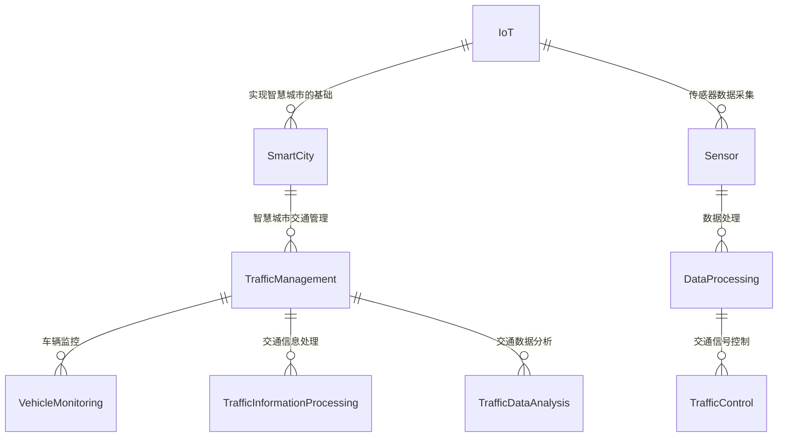

                 

### 文章标题

## 物联网在智慧城市交通管理中的应用

### 关键词

- 物联网
- 智慧城市
- 交通管理
- 智能交通信号控制
- 数据分析

### 摘要

本文将深入探讨物联网在智慧城市交通管理中的应用。首先，我们将概述物联网与智慧城市的背景及核心概念，接着分析当前交通管理中存在的问题与挑战，并探讨物联网技术在解决这些问题中的应用前景。文章的核心部分将详细阐述物联网技术在智能交通信号控制、车辆智能监控与管理、交通信息收集与处理以及城市交通数据分析等方面的应用实例。最后，我们将展望物联网在智慧城市交通管理中的未来发展趋势，提出面临的挑战与解决策略，并总结全文，展望未来。

### 目录

1. **背景与核心概念**  
   1.1 物联网的发展背景  
   1.2 智慧城市的定义与愿景  
   1.3 物联网在智慧城市交通管理中的作用  
   1.4 物联网核心概念与关键技术  
   1.5 智慧城市交通管理的问题与挑战

2. **物联网技术在智慧城市交通管理中的应用**  
   2.1 智能交通信号控制  
   2.2 车辆智能监控与管理  
   2.3 交通信息收集与处理  
   2.4 城市交通数据分析与应用

3. **智能交通系统的建设与实施**  
   3.1 智能交通系统的建设原则  
   3.2 智能交通系统的实施步骤  
   3.3 案例研究

4. **物联网在智慧城市交通管理中的应用挑战与未来展望**  
   4.1 物联网应用挑战  
   4.2 未来展望

5. **总结与展望**  
   5.1 全书总结  
   5.2 展望未来

### 第一部分：背景与核心概念

#### 1.1 物联网的发展背景

物联网（Internet of Things，IoT）是一个将物理设备、传感器、软件和网络连接起来的系统，使得这些设备能够收集、交换和利用数据。物联网的概念最早可以追溯到20世纪80年代，但直到21世纪初，随着无线通信技术和微处理器技术的快速发展，物联网才逐渐成为现实。

物联网的发展经历了几个关键阶段：

1. **早期探索阶段（1990s - 2000s）**：这一阶段主要是物联网概念的提出和初步实验，如美国麻省理工学院（MIT）的“智能尘埃”（Smart Dust）项目。
2. **初步发展阶段（2000s - 2010s）**：这一阶段，物联网开始应用于家庭自动化、智能穿戴设备和工业自动化等领域。
3. **成熟应用阶段（2010s - 至今）**：随着云计算、大数据和人工智能技术的发展，物联网的应用范围不断扩大，从智能家居、智慧城市到智能交通、智能医疗等各个领域。

#### 1.2 智慧城市的定义与愿景

智慧城市（Smart City）是指通过信息化、网络化和智能化手段，实现城市资源的高效配置和管理，提升城市居民生活质量和工作效率的城市。智慧城市的愿景是通过物联网、大数据、云计算、人工智能等新一代信息技术，构建一个全面互联、智能感知、高效管理的城市生态系统。

智慧城市的主要特征包括：

1. **互联互通**：通过物联网和通信网络，实现城市各系统和居民设备的互联互通。
2. **智能感知**：利用传感器和大数据分析技术，实现对城市环境的智能感知和管理。
3. **高效管理**：通过数据分析和智能化管理，提高城市资源利用效率和服务水平。
4. **可持续发展**：通过节能减排、环保治理等手段，实现城市的可持续发展。

#### 1.3 物联网在智慧城市交通管理中的作用

物联网技术在智慧城市交通管理中扮演着至关重要的角色，主要体现在以下几个方面：

1. **智能交通信号控制**：通过物联网技术，实现交通信号的智能调控，提高交通流量效率，减少拥堵。
2. **车辆智能监控与管理**：利用物联网技术，实现对车辆的实时监控和管理，提高交通安全性和运输效率。
3. **交通信息收集与处理**：通过传感器和物联网设备，收集交通数据，并进行实时处理和分析，为交通管理提供决策支持。
4. **城市交通数据分析**：利用大数据和人工智能技术，对交通数据进行分析，预测交通流量变化，优化交通资源配置。

物联网在智慧城市交通管理中的作用不仅限于上述方面，它还为智慧城市的其他领域提供了数据支持和智能服务，如智能照明、智能停车、智能物流等。

### 第二部分：物联网技术在智慧城市交通管理中的应用

#### 2.1 智能交通信号控制

智能交通信号控制是物联网在智慧城市交通管理中最早且最成熟的应用之一。传统的交通信号控制主要依赖于人工设定的时间和固定的信号模式，难以适应动态的交通流量变化。而基于物联网的智能交通信号控制系统能够实时收集交通数据，并根据交通流量情况自动调整信号时长和模式，从而提高交通效率，减少拥堵。

**原理与实现：**

1. **传感器部署**：在交通要道和路口部署各种传感器，如流量传感器、速度传感器、摄像头等，实时监测交通流量和状态。
2. **数据传输**：传感器收集到的数据通过无线网络传输到中央控制系统。
3. **数据分析与调控**：中央控制系统利用大数据分析和人工智能技术，分析交通流量数据，并自动调整交通信号时长和模式。

**实例分析：**

以深圳为例，深圳的智能交通信号控制系统通过部署大量传感器和智能设备，实现了对全市交通信号灯的智能调控。系统可以根据实时交通流量数据，自动调整信号灯的时长，从而提高了交通通行效率，减少了拥堵时间。

#### 2.2 车辆智能监控与管理

车辆智能监控与管理是物联网技术在智慧城市交通管理中的重要应用之一。通过物联网技术，可以实现对车辆的实时监控和管理，提高交通安全性和运输效率。

**原理与实现：**

1. **车辆安装传感器**：在车辆上安装各种传感器，如GPS定位系统、车速传感器、刹车传感器等，实时监测车辆状态。
2. **数据传输**：传感器收集到的数据通过无线网络传输到中央监控系统。
3. **数据分析与管理**：中央监控系统对收集到的数据进行分析，实现对车辆的实时监控和管理。

**实例分析：**

以北京为例，北京市的交通管理部门通过部署物联网传感器，实现了对全市车辆的实时监控。系统能够实时监测车辆的位置、速度和行驶状态，一旦发现异常情况，如超速、急刹车等，系统会自动报警，提醒司机注意安全。

#### 2.3 交通信息收集与处理

交通信息收集与处理是物联网技术在智慧城市交通管理中的基础应用。通过传感器和物联网设备，可以实时收集交通数据，为交通管理和决策提供支持。

**原理与实现：**

1. **传感器部署**：在道路、路口和停车场等地方部署各种传感器，如流量传感器、速度传感器、摄像头等，实时监测交通状况。
2. **数据传输**：传感器收集到的数据通过无线网络传输到中央数据处理系统。
3. **数据处理与分析**：中央数据处理系统对收集到的数据进行分析，生成交通流量、拥堵等信息。

**实例分析：**

以上海为例，上海市的交通管理部门通过部署物联网传感器，实现了对全市交通状况的实时监控。系统可以根据收集到的数据，生成实时交通地图，向驾驶员提供最优行驶路线，减少拥堵。

#### 2.4 城市交通数据分析与应用

城市交通数据分析是物联网技术在智慧城市交通管理中的高级应用。通过大数据和人工智能技术，可以对交通数据进行分析，预测交通流量变化，优化交通资源配置。

**原理与实现：**

1. **数据收集**：通过物联网传感器和设备，收集大量交通数据。
2. **数据处理**：对收集到的数据进行分析和处理，提取有用的信息。
3. **数据分析**：利用大数据和人工智能技术，对交通数据进行深入分析，预测交通流量变化。
4. **决策支持**：根据分析结果，为交通管理和决策提供支持。

**实例分析：**

以纽约为例，纽约市交通管理部门利用物联网技术和大数据分析，实现了对全市交通的智能管理。系统可以根据历史数据和实时数据，预测交通流量变化，并自动调整交通信号灯时长和模式，从而优化交通流量。

### 第三部分：物联网在智慧城市交通管理中的应用挑战与未来展望

#### 3.1 物联网在智慧城市交通管理中的应用挑战

尽管物联网技术在智慧城市交通管理中具有巨大的潜力，但其应用仍面临一系列挑战：

1. **技术挑战**：物联网技术的快速发展带来了新的技术挑战，如传感器可靠性、数据安全、网络延迟等。
2. **政策与法规挑战**：智慧城市交通管理的实现需要政府部门的积极参与和支持，但相关政策法规的制定和执行仍需进一步完善。
3. **经济与成本挑战**：物联网设备和系统的建设成本较高，特别是在大规模推广应用时，如何降低成本成为一大难题。

#### 3.2 物联网在智慧城市交通管理中的未来展望

物联网在智慧城市交通管理中的应用前景广阔，未来将呈现以下趋势：

1. **技术革新**：随着物联网、大数据、人工智能等技术的不断进步，智慧城市交通管理将更加智能化、高效化。
2. **跨领域融合**：物联网技术将与智慧城市建设中的其他领域（如智能照明、智能停车、智能物流等）进行深度融合，形成完整的智慧城市生态系统。
3. **可持续发展**：物联网技术将助力智慧城市交通管理实现可持续发展，如节能减排、环保治理等。

### 总结与展望

物联网技术在智慧城市交通管理中的应用已经成为解决当前交通问题的重要手段。通过智能交通信号控制、车辆智能监控与管理、交通信息收集与处理以及城市交通数据分析，物联网为智慧城市交通管理带来了全新的理念和解决方案。

然而，物联网在智慧城市交通管理中的应用仍面临一系列挑战，如技术、政策与法规、经济与成本等。未来，随着物联网技术的不断进步和政策的完善，物联网在智慧城市交通管理中的应用将更加广泛和深入，为智慧城市的可持续发展提供强大支持。

作者：AI天才研究院/AI Genius Institute & 禅与计算机程序设计艺术 /Zen And The Art of Computer Programming

### 背景介绍

#### 核心概念术语说明

在探讨物联网在智慧城市交通管理中的应用之前，我们需要明确几个核心概念和术语：

1. **物联网（IoT）**：物联网是指通过互联网将各种物理设备和传感器连接起来，实现设备间的通信和协同工作。
2. **智慧城市**：智慧城市是指利用信息技术，特别是物联网、大数据、云计算等新一代信息技术，实现城市资源的高效配置和管理，提升城市居民生活质量和工作效率。
3. **交通管理**：交通管理是指通过各种手段和技术，对城市交通进行规划、组织、指挥和控制，以实现交通流量的合理分配和运输效率的最大化。
4. **智能交通信号控制**：智能交通信号控制是指利用物联网技术和人工智能算法，实现交通信号灯的智能化调控，以适应动态交通流量变化，提高交通效率和减少拥堵。
5. **车辆智能监控与管理**：车辆智能监控与管理是指利用物联网技术，对车辆进行实时监控和管理，包括车辆位置、速度、行驶状态等信息的采集和监控，以及车辆运行数据的分析和处理。

#### 问题背景

当前，全球范围内的城市化进程加速，城市交通问题日益严峻。主要问题包括：

1. **交通拥堵**：随着车辆数量的不断增加和城市人口的增长，城市交通拥堵现象愈发严重，导致出行时间延长、交通成本增加。
2. **交通事故**：由于交通拥堵和驾驶员操作不当等原因，交通事故频繁发生，造成人员伤亡和财产损失。
3. **环境污染**：交通拥堵和大量燃油消耗导致空气污染和噪音污染，对城市环境和居民健康造成严重影响。
4. **交通资源配置不合理**：传统的交通管理模式无法有效地调配交通资源，导致某些路段交通拥堵，而其他路段却交通畅通。

#### 问题描述

为了解决上述交通问题，智慧城市交通管理应运而生。智慧城市交通管理的目标是：

1. **提高交通效率**：通过智能交通信号控制和车辆智能监控等手段，优化交通流量，减少拥堵。
2. **提升交通安全**：通过实时监控车辆状态和行驶环境，预防和减少交通事故。
3. **改善环境质量**：通过智能交通管理和车辆节能减排技术，减少空气污染和噪音污染。
4. **优化交通资源配置**：通过数据分析和技术手段，实现交通资源的合理分配，提高交通系统整体效率。

#### 问题解决

物联网技术在智慧城市交通管理中提供了以下解决方案：

1. **智能交通信号控制**：通过部署物联网传感器和智能设备，实时监测交通流量和状态，并根据数据自动调整交通信号灯的时长和模式，从而提高交通效率和减少拥堵。
2. **车辆智能监控与管理**：通过在车辆上安装物联网传感器，实时监测车辆的位置、速度、行驶状态等信息，实现对车辆的实时监控和管理，提高交通安全性和运输效率。
3. **交通信息收集与处理**：通过部署物联网传感器和智能设备，实时收集交通数据，包括车辆流量、速度、路况等信息，并对数据进行处理和分析，为交通管理和决策提供支持。
4. **城市交通数据分析**：利用大数据和人工智能技术，对交通数据进行深入分析，预测交通流量变化，优化交通资源配置，实现交通系统的智能化管理。

#### 边界与外延

物联网在智慧城市交通管理中的应用不仅限于上述几个方面，还涉及以下几个方面：

1. **智能停车管理**：通过物联网技术，实现对停车场的实时监控和智能调度，提高停车效率，减少拥堵。
2. **智能物流管理**：通过物联网技术，实现物流车辆的实时监控和调度，提高物流运输效率，降低成本。
3. **智能公共交通管理**：通过物联网技术，实现对公共交通车辆的实时监控和管理，提高公共交通的运行效率和乘客体验。
4. **智能交通信息服务**：通过物联网技术和大数据分析，为驾驶员提供实时交通信息，如交通拥堵情况、最优行驶路线等，提高出行效率。

#### 概念结构与核心要素组成

物联网在智慧城市交通管理中的概念结构可以概括为以下几个核心要素：

1. **传感器网络**：包括各种传感器和物联网设备，用于实时监测交通流量、状态和环境信息。
2. **数据采集与传输**：通过无线通信技术，将传感器收集到的数据传输到中央数据处理系统。
3. **数据处理与分析**：利用大数据和人工智能技术，对收集到的交通数据进行分析和处理，提取有用信息。
4. **智能交通控制系统**：根据分析结果，自动调整交通信号灯时长和模式，优化交通流量。
5. **智能交通管理平台**：提供交通信息收集、处理、分析和决策支持的功能，实现交通系统的智能化管理。

通过上述核心要素的协同工作，物联网技术为智慧城市交通管理提供了强大的技术支持和解决方案，有助于解决当前城市交通问题，提升城市交通系统的整体效率和安全性。

### 核心概念与联系

#### 物联网的基本概念

物联网（Internet of Things，IoT）是一个通过互联网将各种物理设备、传感器、软件和网络连接起来的系统。其核心目的是使这些设备能够收集、交换和利用数据，实现设备间的通信和协同工作。物联网的基本概念可以概括为以下几个方面：

1. **设备互联**：物联网通过无线通信技术（如Wi-Fi、蓝牙、NFC等）将各种设备连接起来，使它们能够相互通信和共享数据。
2. **数据采集**：物联网设备上安装有各种传感器，用于收集环境信息、设备状态、位置数据等。
3. **数据处理**：采集到的数据通过边缘计算、云计算等手段进行处理和分析，提取有用信息。
4. **智能决策**：通过数据处理和分析，系统可以自动做出智能决策，如调整交通信号灯时长、预测交通流量等。
5. **设备管理**：物联网平台可以对连接的设备进行远程监控和管理，实现设备的智能化运维。

#### 智慧城市的定义与特征

智慧城市（Smart City）是指利用信息技术（如物联网、大数据、云计算、人工智能等）实现城市资源的高效配置和管理，提升城市居民生活质量和工作效率的城市。智慧城市的核心特征包括：

1. **互联互通**：通过物联网和通信网络，实现城市各系统和居民设备的互联互通，为居民提供便捷的生活服务。
2. **智能感知**：利用传感器和大数据分析技术，实现对城市环境的智能感知和管理，如空气质量监测、交通流量监控等。
3. **高效管理**：通过数据分析和智能化管理，提高城市资源利用效率和服务水平，如智能照明、智能停车、智能物流等。
4. **可持续发展**：通过节能减排、环保治理等手段，实现城市的可持续发展，如智能环保设备、绿色建筑等。

#### 物联网与智慧城市交通管理的联系

物联网与智慧城市交通管理之间存在着密切的联系和相互作用。物联网为智慧城市交通管理提供了数据支持和智能服务，而智慧城市交通管理则为物联网应用提供了广阔的场景和需求。

1. **数据采集**：物联网技术通过传感器和设备收集交通流量、路况、车辆状态等信息，为智慧城市交通管理提供基础数据。
2. **信息传输**：物联网技术通过无线通信网络将收集到的数据传输到中央处理系统，实现数据的实时传输和共享。
3. **数据处理**：大数据和人工智能技术对物联网收集到的交通数据进行处理和分析，为交通管理和决策提供支持。
4. **智能调控**：基于物联网和数据分析，交通信号控制系统能够实现智能调控，优化交通流量，减少拥堵。
5. **安全管理**：物联网技术可以通过实时监控车辆状态和行驶环境，提高交通安全性和运输效率。

#### 概念属性特征对比表格

为了更好地理解物联网、智慧城市和智慧城市交通管理的概念属性特征，我们提供了一个对比表格：

| 概念        | 物联网         | 智慧城市         | 智慧城市交通管理           |
|-------------|----------------|------------------|---------------------------|
| 定义        | 设备互联、数据采集、数据处理 | 利用信息技术实现城市资源高效配置和管理 | 利用物联网技术实现交通管理智能化 |
| 特征        | 设备互联、数据采集、智能决策 | 互联互通、智能感知、高效管理、可持续发展 | 智能交通信号控制、车辆监控、交通信息处理、数据分析 |
| 关键技术    | 传感器、无线通信、云计算、大数据 | 物联网、大数据、云计算、人工智能 | 智能信号控制、车辆监控、数据采集、数据分析 |
| 应用领域    | 智能家居、智慧城市、工业自动化 | 城市管理、公共服务、交通管理 | 交通管理、停车场管理、公共交通管理 |
| 目标        | 设备互联、数据共享、智能决策 | 提升城市资源利用效率、提高居民生活质量 | 提高交通效率、提升交通安全、减少拥堵 |

#### ER实体关系图架构

为了更直观地展示物联网、智慧城市和智慧城市交通管理之间的实体关系，我们使用Mermaid绘制了一个ER实体关系图：

通过上述核心概念与联系的阐述和ER实体关系图的展示，我们可以更清晰地理解物联网、智慧城市和智慧城市交通管理之间的关系，以及它们在解决交通问题中的作用。

### 智慧城市交通管理的问题与挑战

#### 当前交通管理中存在的问题

当前交通管理面临诸多挑战，这些问题直接影响了城市的运行效率和居民的生活质量。以下是当前交通管理中存在的主要问题：

1. **交通拥堵**：城市道路上的车辆数量不断增加，而道路容量有限，导致交通拥堵现象普遍。拥堵不仅浪费了司机的时间，也增加了能源消耗和空气污染。
2. **交通事故频发**：由于交通流量大、驾驶行为不规范等原因，交通事故频发，导致人员伤亡和财产损失。
3. **停车难**：随着城市人口的增长，停车位供不应求，停车难成为许多城市居民日常生活中的一大烦恼。
4. **交通信息不透明**：传统的交通管理方式缺乏实时、准确的信息反馈，导致交通参与者无法及时获取交通状况，从而做出合理的出行决策。
5. **交通资源分配不均**：在一些城市，某些路段交通拥堵严重，而其他路段却相对畅通，交通资源分配不均。

#### 智慧城市交通管理的挑战

智慧城市交通管理的目标是利用物联网、大数据、人工智能等先进技术，解决传统交通管理中的问题，提升交通系统的整体效率和安全性。然而，实现这一目标面临着以下挑战：

1. **技术挑战**：物联网技术的快速发展和普及带来了新的技术挑战，如传感器可靠性、数据安全、网络延迟等。传感器需要能够准确、可靠地采集数据，而数据传输需要保证稳定性和实时性。
2. **数据整合**：智慧城市交通管理需要整合来自不同来源和类型的交通数据，如车辆位置、交通流量、路况信息等。如何有效地整合这些数据，实现数据的互联互通，是当前面临的一个重要问题。
3. **政策与法规**：智慧城市交通管理需要政府部门的积极参与和支持，包括政策制定、法规完善、资金投入等。然而，一些国家和地区的相关政策和法规尚不完善，制约了智慧城市交通管理的推进。
4. **经济与成本**：智慧城市交通管理系统需要大量的基础设施投资，如传感器、通信网络、数据处理中心等。此外，系统的维护和升级也需要持续投入，这对一些城市来说是一个巨大的经济负担。
5. **公众接受度**：智慧城市交通管理系统需要依赖大量传感器和监控设备，这对个人隐私保护提出了挑战。如何在确保交通管理高效的同时，保护公众隐私，是公众接受智慧交通系统的关键。

#### 物联网技术在解决交通问题中的应用前景

物联网技术在解决交通问题方面具有巨大的潜力，可以通过以下方式实现：

1. **智能交通信号控制**：利用物联网技术，实现交通信号的智能化调控，根据实时交通流量自动调整信号时长和模式，提高交通流量效率，减少拥堵。
2. **车辆智能监控与管理**：通过在车辆上安装物联网传感器，实现对车辆的实时监控和管理，包括车辆位置、速度、行驶状态等，提高交通安全性和运输效率。
3. **交通信息收集与处理**：利用物联网传感器和设备，实时收集交通数据，包括车辆流量、速度、路况等，并通过大数据分析技术进行实时处理和分析，为交通管理和决策提供支持。
4. **城市交通数据分析**：通过大数据和人工智能技术，对交通数据进行分析，预测交通流量变化，优化交通资源配置，实现交通系统的智能化管理。

总之，物联网技术在智慧城市交通管理中的应用前景广阔，可以为解决当前交通问题提供新的思路和解决方案。然而，要实现这一目标，还需要克服技术、政策、经济和公众接受度等方面的挑战。

### 智能交通信号控制

#### 智能交通信号控制系统概述

智能交通信号控制（Intelligent Traffic Signal Control）是一种利用物联网、大数据和人工智能技术实现交通信号灯智能调控的系统。通过实时收集交通流量数据，智能交通信号控制系统可以自动调整交通信号灯的时长和模式，从而提高交通流量效率，减少拥堵。与传统的固定信号控制方式相比，智能交通信号控制系统具有更高的灵活性和适应性，能够更好地应对动态交通流量的变化。

智能交通信号控制系统的主要组成部分包括：

1. **传感器网络**：部署在道路和路口的各种传感器，如流量传感器、速度传感器、摄像头等，用于实时监测交通流量和状态。
2. **数据传输与处理**：传感器收集到的数据通过无线通信网络传输到中央控制系统，进行数据处理和分析。
3. **智能决策模块**：基于大数据和人工智能技术，对交通流量数据进行分析和处理，自动生成最优的信号调控方案。
4. **执行单元**：交通信号灯和相关的控制设备，根据智能决策模块生成的调控方案进行信号控制。

#### 基于物联网的智能交通信号控制原理

智能交通信号控制系统的核心在于物联网技术的应用，其工作原理可以概括为以下几个步骤：

1. **数据采集**：在道路和路口部署各种传感器，如流量传感器、速度传感器、摄像头等，实时监测交通流量和状态。传感器将采集到的数据通过无线通信网络传输到中央控制系统。

2. **数据处理与分析**：中央控制系统对传感器传输来的数据进行处理和分析，提取交通流量、速度、拥堵等信息。利用大数据和人工智能技术，对交通流量数据进行实时分析和预测，识别交通流量的变化趋势。

3. **智能决策**：根据交通流量数据分析结果，智能决策模块生成最优的信号调控方案。决策方案可以包括调整信号灯的时长、相位、优先级等，以优化交通流量。

4. **信号调控**：执行单元根据智能决策模块生成的调控方案，调整交通信号灯的时长和模式。通过实时调整信号灯，使交通流量更加顺畅，减少拥堵。

5. **反馈与优化**：信号调控后的交通流量数据再次传输到中央控制系统，进行新一轮的数据分析和智能决策。通过不断循环优化，使交通信号控制系统逐步趋于最优。

#### 实例分析：智能交通信号控制系统的应用

以深圳为例，深圳是国内最早开展智能交通信号控制试点城市之一。深圳市交通管理部门在全市范围内部署了大量传感器和智能设备，构建了智能交通信号控制系统。系统通过实时监测交通流量，根据不同路段和时段的交通情况，自动调整信号灯的时长和模式，从而提高交通流量效率，减少拥堵。

具体应用场景包括：

1. **高峰时段优化**：在早晚高峰时段，系统根据实时交通流量数据，自动调整信号灯时长，延长绿灯时间，使主要交通干道的车辆能够快速通过。

2. **特殊事件响应**：在重大活动或特殊事件期间，系统可以根据交通流量变化，提前调整信号灯模式，引导车辆避开拥堵区域，确保主要道路畅通。

3. **事故处理**：在发生交通事故或道路施工等突发事件时，系统可以快速调整信号灯模式，分流交通，减少对周边交通的影响。

通过智能交通信号控制系统的应用，深圳市的交通拥堵问题得到了明显改善，市民的出行体验得到了显著提升。这一案例为其他城市提供了宝贵的经验和参考。

#### 智能交通信号控制的优势与不足

智能交通信号控制的优势包括：

1. **提高交通效率**：通过实时监测和智能调控，智能交通信号控制系统可以更好地适应动态交通流量的变化，提高交通流量效率，减少拥堵。
2. **减少交通事故**：智能交通信号控制系统能够优化交通信号，使车辆行驶更加顺畅，减少由于交通拥堵导致的交通事故。
3. **节能减排**：智能交通信号控制系统能够减少车辆怠速和频繁启停，降低油耗和排放，有助于减少空气污染。

然而，智能交通信号控制系统也存在一些不足之处，如：

1. **初期投资较大**：智能交通信号控制系统需要部署大量传感器和设备，以及建设相应的数据处理中心，初期投资成本较高。
2. **数据安全与隐私保护**：交通数据涉及到个人隐私和信息安全，如何确保数据安全成为一大挑战。
3. **技术维护与升级**：智能交通信号控制系统需要定期维护和升级，以应对新技术和新需求，这需要持续的技术投入和运营成本。

综上所述，智能交通信号控制是智慧城市交通管理的重要组成部分，具有显著的优点和潜力。尽管面临一些挑战和不足，但随着技术的不断进步和政策的完善，智能交通信号控制系统有望在未来的智慧城市建设中发挥更大的作用。

### 车辆智能监控与管理

#### 车辆智能监控技术

车辆智能监控技术是物联网在智慧城市交通管理中的一项重要应用，通过对车辆进行实时监控和管理，提高交通安全性和运输效率。以下是车辆智能监控技术的核心组成部分：

1. **传感器与设备**：车辆智能监控依赖于安装在车辆上的各种传感器和设备，如GPS定位系统、速度传感器、刹车传感器、碰撞传感器、车联网设备等。这些传感器和设备能够实时监测车辆的状态和运行环境。

2. **数据传输**：传感器和设备收集到的数据通过无线通信技术（如Wi-Fi、蓝牙、NFC等）传输到车辆管理系统。数据传输需要保证稳定性和实时性，以确保监控系统能够及时获取车辆信息。

3. **数据处理与分析**：车辆管理系统对接收到的数据进行处理和分析，提取有用的信息，如车辆位置、速度、行驶状态等。数据处理和分析技术包括大数据分析和人工智能算法，用于识别异常行为和潜在风险。

4. **智能决策与反馈**：基于数据分析结果，车辆管理系统可以做出智能决策，如提醒驾驶员减速、调整行驶路线等。同时，系统能够对车辆运行数据进行实时反馈，帮助驾驶员了解车辆状态和安全情况。

#### 车辆智能管理系统的构建

车辆智能管理系统是一个综合性的系统，其构建过程涉及多个环节：

1. **系统需求分析**：首先，对车辆智能监控和管理系统的需求进行分析，确定系统需要实现的功能和性能指标，如实时监控车辆位置、速度、行驶状态等。

2. **硬件设备选择**：根据系统需求，选择合适的传感器和设备，如GPS定位设备、速度传感器、刹车传感器等。设备的选型需要考虑精度、稳定性、功耗等因素。

3. **软件开发**：开发车辆管理系统软件，包括数据采集、处理和分析模块，以及用户界面。软件开发需要使用适合物联网应用的编程语言和开发框架，如Python、Java等。

4. **系统集成与测试**：将硬件设备和软件系统进行集成，确保各部分能够协同工作。在系统集成完成后，进行严格的测试和调试，验证系统的稳定性和可靠性。

5. **部署与应用**：将车辆智能管理系统部署到实际环境中，如城市交通管理平台、车辆运营公司等。系统部署后，进行实际应用和监控，收集用户反馈，不断优化和升级系统。

#### 实例分析：基于物联网的车辆智能监控与管理应用

以北京为例，北京市交通管理部门通过部署物联网车辆智能监控系统，实现了对全市车辆的实时监控和管理。以下是该系统的具体应用场景：

1. **车辆位置监控**：系统可以实时监控车辆的位置，通过GPS定位技术，驾驶员和交通管理部门可以随时了解车辆的行驶轨迹和位置，提高车辆调度效率。

2. **行驶状态监测**：系统通过速度传感器和刹车传感器，实时监测车辆的行驶状态。一旦发现车辆超速或急刹车等异常行为，系统会自动报警，提醒驾驶员注意安全。

3. **车辆运行数据记录**：系统记录车辆的运行数据，如行驶里程、油耗、发动机状态等。这些数据可以用于车辆维护和性能优化，提高车辆运行效率。

4. **交通流量分析**：系统可以分析车辆的行驶数据，生成交通流量报告，为交通管理部门提供决策支持。例如，在交通拥堵时段，系统可以建议驾驶员选择其他路线，以缓解交通压力。

通过物联网车辆智能监控与管理系统的应用，北京市的交通安全性和运输效率得到了显著提升，市民的出行体验也得到了改善。这一案例展示了物联网技术在车辆智能监控与管理中的巨大潜力。

#### 车辆智能监控与管理的优势与不足

车辆智能监控与管理的优势包括：

1. **提高交通安全**：通过实时监控和智能决策，车辆智能监控系统可以及时发现和预防交通事故，提高交通安全。
2. **提升运输效率**：系统可以优化车辆调度和行驶路线，提高运输效率，减少交通拥堵。
3. **降低运营成本**：通过车辆运行数据的记录和分析，车辆智能监控系统可以帮助企业降低维护和运营成本。

然而，车辆智能监控与管理也存在一些不足之处，如：

1. **设备安装与维护成本**：安装传感器和设备需要投入一定的资金，且设备需要定期维护，这增加了运营成本。
2. **数据隐私与安全**：车辆监控数据涉及到驾驶员的隐私和安全，如何确保数据安全成为一大挑战。
3. **公众接受度**：部分驾驶员可能对车辆监控持有疑虑，担心隐私受到侵犯，这需要通过政策和宣传提高公众的接受度。

综上所述，车辆智能监控与管理是智慧城市交通管理的重要组成部分，具有显著的优势和潜力。尽管面临一些挑战和不足，但随着技术的不断进步和政策的完善，车辆智能监控与管理有望在未来的智慧城市建设中发挥更大的作用。

### 交通信息收集与处理

#### 交通信息的种类与来源

交通信息是智慧城市交通管理的重要数据基础，种类繁多，来源广泛。以下是交通信息的主要种类和来源：

1. **实时交通流量信息**：包括道路上的车辆数量、行驶速度、拥堵程度等。这些信息通常通过安装在道路上的流量传感器和摄像头收集。

2. **交通事故信息**：包括交通事故发生的地点、时间、类型、影响范围等。这些信息可以从交通管理部门、医院、保险公司等多个渠道获取。

3. **道路施工信息**：包括道路施工的地点、时间、影响范围等。这些信息通常由交通管理部门和施工单位提供。

4. **公共交通信息**：包括公交车、地铁、火车等公共交通工具的运行状态、站点信息、线路图等。这些信息通常由公共交通运营公司提供。

5. **停车场信息**：包括停车场的位置、使用情况、剩余车位数量等。这些信息可以通过停车场管理系统的传感器和设备收集。

6. **交通气象信息**：包括雨雪、雾霾、温度等气象条件，这些信息对交通管理和出行决策具有重要影响。这些信息通常由气象部门提供。

7. **交通政策信息**：包括交通规划、政策法规、收费标准等。这些信息由交通管理部门和政府部门提供。

#### 交通信息处理技术

交通信息的收集只是智慧城市交通管理的第一步，如何对收集到的交通信息进行处理和分析，提取有用信息，是提升交通管理水平的关键。以下是几种常用的交通信息处理技术：

1. **数据清洗**：对收集到的交通信息进行清洗，去除重复、错误和无效的数据，保证数据的准确性和完整性。

2. **数据整合**：将来自不同来源和类型的交通信息进行整合，形成统一的数据格式，为后续分析提供基础。

3. **数据分析**：利用大数据和人工智能技术，对交通信息进行深入分析，提取交通流量、拥堵、交通事故等特征，为交通管理和决策提供支持。

4. **数据可视化**：通过图表、地图等可视化方式，将分析结果直观地展示出来，帮助交通管理部门和公众了解交通状况。

5. **预测与模拟**：利用历史数据和人工智能算法，预测未来交通流量变化，模拟不同交通管理策略的效果，为决策提供科学依据。

#### 实例分析：基于物联网的交通信息收集与处理应用

以上海为例，上海市交通管理部门通过部署物联网技术，构建了智能交通信息收集与处理系统。以下是该系统的具体应用场景：

1. **实时交通流量监测**：系统通过安装在主要道路上的流量传感器和摄像头，实时监测交通流量和路况。一旦发现拥堵或交通事故，系统会立即发出警报，通知交通管理部门进行处理。

2. **公共交通信息整合**：系统整合了公交、地铁等公共交通工具的实时运行信息，为市民提供准确的出行建议。例如，在交通高峰时段，系统会根据公交车的实时位置和拥挤程度，推荐最优的出行路线。

3. **停车场信息管理**：系统通过停车场管理系统的传感器和设备，实时监测停车场的使用情况，为驾驶员提供准确的停车位信息，减少停车难问题。

4. **交通气象信息应用**：系统整合了气象部门提供的交通气象信息，根据雨雪、雾霾等气象条件，自动调整交通信号灯时长和模式，确保道路畅通。

通过物联网交通信息收集与处理系统的应用，上海市的交通管理水平得到了显著提升，市民的出行体验也得到了改善。这一案例展示了物联网技术在交通信息收集与处理中的巨大潜力。

#### 交通信息收集与处理的优势与不足

交通信息收集与处理的优势包括：

1. **提高交通管理效率**：通过实时收集和处理交通信息，交通管理部门可以快速响应交通事件，优化交通信号控制，提高交通管理效率。
2. **提升出行体验**：为公众提供准确的交通信息，帮助驾驶员避开拥堵路段，优化出行路线，提升出行体验。
3. **减少交通事故**：通过对交通事故信息的收集和分析，可以提前预警交通事故风险，采取预防措施，减少交通事故的发生。

然而，交通信息收集与处理也存在一些不足之处，如：

1. **数据隐私与安全**：交通信息涉及到个人隐私和信息安全，如何确保数据安全成为一大挑战。
2. **数据整合难度**：交通信息来源多样，如何有效地整合和统一数据格式，是一个技术难题。
3. **技术成本**：交通信息收集与处理系统需要大量传感器、设备和数据处理中心，初期投资和运营成本较高。

综上所述，交通信息收集与处理是智慧城市交通管理的重要组成部分，具有显著的优势和潜力。尽管面临一些挑战和不足，但随着技术的不断进步和政策的完善，交通信息收集与处理将在未来的智慧城市建设中发挥更大的作用。

### 城市交通数据分析

#### 城市交通数据分析方法

城市交通数据分析是智慧城市交通管理的重要环节，通过分析大量交通数据，可以揭示交通流量的变化规律，预测交通拥堵，优化交通资源配置。以下是城市交通数据分析的几种主要方法：

1. **时间序列分析**：时间序列分析是一种基于时间顺序的数据分析方法，用于研究交通流量随时间的变化趋势。通过时间序列分析，可以识别交通流量在不同时间段的变化规律，为交通管理和调控提供依据。

2. **空间分析**：空间分析是一种基于地理位置的数据分析方法，用于研究交通流量在空间上的分布和变化。通过空间分析，可以识别交通拥堵热点区域，制定针对性的交通管理策略。

3. **回归分析**：回归分析是一种用于研究变量之间关系的统计分析方法，通过建立回归模型，可以预测交通流量与相关因素（如天气、节假日等）之间的关系，为交通流量预测和调控提供支持。

4. **聚类分析**：聚类分析是一种无监督学习方法，用于将数据集划分为不同的类别。通过聚类分析，可以识别交通流量相似的路段和时段，为交通资源优化和调度提供参考。

5. **机器学习**：机器学习是一种利用算法自动从数据中学习规律的方法，包括监督学习和无监督学习。通过机器学习，可以构建复杂的交通流量预测和优化模型，提高交通数据分析的精度和效率。

#### 交通数据在智慧城市交通管理中的应用

交通数据在智慧城市交通管理中具有广泛的应用，以下是几个关键应用领域：

1. **交通流量预测**：通过分析历史交通数据，可以预测未来交通流量变化。交通流量预测可以帮助交通管理部门提前采取调控措施，避免交通拥堵，提高交通效率。

2. **交通信号控制优化**：基于交通数据，可以对交通信号控制系统进行优化。通过分析不同路段和时段的交通流量，可以调整信号灯时长和模式，优化交通流量，减少拥堵。

3. **交通事故预防**：通过分析交通事故数据，可以识别交通事故的高发区域和时段，采取预防措施，如增加交通警示标志、优化交通信号控制等，减少交通事故的发生。

4. **公共交通优化**：通过分析公共交通运行数据，可以优化公交线路、站点设置和服务时间，提高公共交通的效率和乘客满意度。

5. **停车管理优化**：通过分析停车数据，可以优化停车场的布局和管理，提高停车位的利用率，减少停车难问题。

#### 实例分析：城市交通数据分析在实践中的应用

以新加坡为例，新加坡是世界上最早应用城市交通数据分析技术的国家之一。新加坡的交通管理部门利用先进的数据分析技术，实现了对全市交通的智能管理和调控。以下是新加坡交通数据分析的几个实例：

1. **交通流量预测**：新加坡的交通管理部门利用历史交通数据和人工智能算法，对未来的交通流量进行预测。通过预测结果，交通管理部门可以提前调整交通信号控制策略，确保交通流畅。

2. **交通信号控制优化**：基于实时交通数据，新加坡的交通信号控制系统不断优化信号灯的时长和模式。例如，在高峰时段，系统会根据实时交通流量自动调整信号灯，延长绿灯时间，减少拥堵。

3. **交通事故预防**：新加坡的交通管理部门通过分析交通事故数据，识别交通事故的高发区域和时段，采取预防措施。例如，在交通事故高发区域增加交通警示标志，优化交通信号控制，减少交通事故的发生。

4. **公共交通优化**：新加坡的交通管理部门通过分析公共交通运行数据，优化公交线路、站点设置和服务时间。例如，根据乘客流量数据，调整公交车的发车频率和停靠站点，提高公共交通的效率和乘客满意度。

通过城市交通数据分析的应用，新加坡的交通管理水平得到了显著提升，交通效率得到大幅提高，市民的出行体验也得到了显著改善。这一案例展示了城市交通数据分析在智慧城市交通管理中的巨大潜力。

#### 城市交通数据分析的优势与不足

城市交通数据分析的优势包括：

1. **提高交通管理效率**：通过分析交通数据，可以识别交通流量的变化规律，优化交通信号控制和公共交通调度，提高交通管理效率。
2. **减少交通拥堵**：交通数据分析可以帮助预测交通流量变化，提前采取调控措施，减少交通拥堵，提高道路通行效率。
3. **预防交通事故**：通过分析交通事故数据，可以识别高风险区域和时段，采取预防措施，减少交通事故的发生。
4. **优化公共交通**：交通数据分析可以为公共交通的优化提供科学依据，提高公共交通的效率和乘客满意度。

然而，城市交通数据分析也存在一些不足之处，如：

1. **数据隐私与安全**：交通数据涉及到个人隐私和信息安全，如何确保数据安全成为一大挑战。
2. **数据质量**：交通数据的质量直接影响分析结果的准确性，如何保证数据质量是一个关键问题。
3. **技术成本**：交通数据分析需要大量的计算资源和专业人才，技术成本较高。

综上所述，城市交通数据分析是智慧城市交通管理的重要组成部分，具有显著的优势和潜力。尽管面临一些挑战和不足，但随着技术的不断进步和政策的完善，城市交通数据分析将在未来的智慧城市建设中发挥更大的作用。

### 智能交通系统的建设与实施

#### 智能交通系统的建设原则

智能交通系统的建设是一项复杂而庞大的工程，需要遵循一系列原则和标准，以确保系统的可靠性和有效性。以下是智能交通系统建设的主要原则：

1. **总体规划**：智能交通系统的建设应基于全局视角，制定科学的总体规划，明确建设目标、功能需求和实施步骤。总体规划应涵盖交通信号控制、车辆监控、交通信息处理、数据分析等各个方面。

2. **技术先进性**：智能交通系统应采用先进的技术，包括物联网、大数据、云计算、人工智能等，以确保系统能够应对复杂的交通状况，实现智能化管理和调控。

3. **数据安全性**：交通数据涉及到个人隐私和信息安全，系统建设应确保数据的安全性，包括数据传输、存储和处理的加密保护，防止数据泄露和恶意攻击。

4. **系统集成**：智能交通系统应实现各个子系统的集成和协同工作，确保系统各部分之间的高效通信和数据共享。系统集成应具备良好的扩展性和可维护性，以适应未来的技术发展和需求变化。

5. **用户友好性**：智能交通系统应设计用户友好的界面和操作流程，方便交通管理部门和公众使用。系统应提供实时、准确、直观的交通信息，帮助用户做出合理的出行决策。

6. **可持续发展**：智能交通系统应注重节能减排，采用绿色环保技术，实现交通系统的可持续发展。系统建设应考虑到能源消耗、环境影响等因素，推动交通行业的绿色转型。

#### 智能交通系统的实施步骤

智能交通系统的实施步骤可以分为以下几个阶段：

1. **需求分析**：在系统建设初期，进行详细的需求分析，了解交通管理部门和公众的需求，明确系统的功能、性能和技术要求。需求分析阶段应与交通管理部门、公众和专家进行充分沟通，确保需求分析的全面性和准确性。

2. **系统设计**：根据需求分析结果，进行系统设计，包括系统架构设计、模块划分、接口定义等。系统设计应遵循模块化原则，确保系统的灵活性和可维护性。同时，应充分考虑系统的扩展性和升级需求。

3. **硬件设备选型与部署**：根据系统设计要求，选择合适的硬件设备，如传感器、摄像头、通信设备等，并进行部署。设备选型应考虑精度、稳定性、功耗等因素，确保设备能够满足系统的性能要求。

4. **软件开发与集成**：开发智能交通系统的软件部分，包括数据采集、处理、分析、决策等功能模块。软件开发应采用成熟的技术框架和工具，确保系统的稳定性和可靠性。软件开发完成后，进行系统集成测试，确保各个模块之间的协同工作。

5. **系统测试与优化**：在系统实施过程中，进行全面的系统测试，包括功能测试、性能测试、安全测试等，确保系统满足设计要求。测试过程中，应发现并修复系统中的缺陷和漏洞，优化系统性能和用户体验。

6. **部署与上线**：完成系统测试后，将系统部署到实际环境中，进行试运行和优化。试运行期间，应收集用户反馈，不断优化和改进系统功能，确保系统在实际运行中能够稳定、高效地运行。

7. **培训与推广**：对交通管理部门和相关人员进行系统培训，确保他们能够熟练使用系统，发挥系统的最大效用。同时，通过宣传推广，提高公众对智能交通系统的认知和接受度，促进系统的广泛应用。

#### 案例研究：智能交通系统的建设与实施实例

以北京为例，北京市交通管理部门在近年来积极推动智能交通系统的建设与实施。以下是北京市智能交通系统建设的具体案例：

1. **需求分析**：北京市交通管理部门在智能交通系统建设初期，进行了详细的需求分析，明确了系统的主要功能，包括交通信号控制、车辆监控、交通信息处理、数据分析等。

2. **系统设计**：根据需求分析结果，北京市交通管理部门制定了智能交通系统的总体设计方案，包括系统架构、功能模块、技术要求等。系统设计充分考虑了数据安全性、系统集成性和用户友好性。

3. **硬件设备选型与部署**：北京市交通管理部门选择了高精度、低功耗的传感器和摄像头，部署在全市范围内的主要道路和路口。同时，建设了大数据处理中心和云计算平台，用于存储和处理交通数据。

4. **软件开发与集成**：北京市交通管理部门开发了智能交通系统的软件部分，包括交通信号控制模块、车辆监控模块、交通信息处理模块、数据分析模块等。软件开发采用Python和Java等编程语言，确保系统的稳定性和可靠性。

5. **系统测试与优化**：在系统实施过程中，北京市交通管理部门进行了全面的系统测试，包括功能测试、性能测试、安全测试等。测试过程中，发现并修复了系统中的多个缺陷和漏洞，优化了系统性能和用户体验。

6. **部署与上线**：完成系统测试后，北京市交通管理部门将智能交通系统部署到实际环境中，进行试运行和优化。试运行期间，收集了大量的用户反馈，不断优化和改进系统功能，确保系统在实际运行中能够稳定、高效地运行。

7. **培训与推广**：北京市交通管理部门对交通管理部门和相关人员进行了系统培训，确保他们能够熟练使用系统。同时，通过宣传推广，提高了公众对智能交通系统的认知和接受度，促进了系统的广泛应用。

通过北京市智能交通系统建设的实例，我们可以看到，智能交通系统的建设与实施需要遵循科学的规划和实施步骤，充分发挥物联网、大数据、人工智能等先进技术的优势，为城市交通管理提供强大的支持。同时，也需要注重系统的安全性和用户体验，确保系统能够在实际运行中发挥最大效用。

### 物联网在智慧城市交通管理中的应用挑战

尽管物联网在智慧城市交通管理中具有巨大的潜力，但其应用仍然面临一系列挑战，这些问题需要通过技术进步和政策支持来逐步解决。

#### 技术挑战

1. **传感器精度与可靠性**：物联网技术在智慧城市交通管理中依赖于传感器来收集数据。传感器需要具备高精度和可靠性，但在极端环境下（如高温、低温、潮湿等），传感器的性能可能会受到影响，导致数据不准确或丢失。

2. **数据安全**：交通数据包含大量的个人隐私信息，如车辆位置、行驶轨迹等。如何确保数据在传输、存储和处理过程中的安全性，防止数据泄露和恶意攻击，是物联网在智慧城市交通管理中面临的重要挑战。

3. **网络延迟与稳定性**：物联网设备通常需要通过无线网络传输数据，网络延迟和稳定性对系统的实时性和准确性有重要影响。特别是在交通流量高峰期，网络拥塞可能导致数据传输延迟，影响交通信号控制和车辆监控的效果。

4. **数据处理与存储**：随着物联网设备的普及，产生的数据量呈指数级增长。如何高效地处理和存储海量数据，确保数据处理的速度和准确性，是物联网在智慧城市交通管理中需要解决的问题。

#### 政策与法规挑战

1. **政策支持**：物联网在智慧城市交通管理中的应用需要政府部门的积极参与和支持。然而，一些国家和地区的相关政策法规尚不完善，导致物联网技术的推广应用受阻。政府需要制定和实施一系列支持政策，包括资金支持、税收优惠、行业标准等。

2. **法规完善**：物联网技术在智慧城市交通管理中的应用涉及多个领域，如交通管理、信息安全、隐私保护等。如何完善相关法规，确保物联网设备、系统和数据的安全和合规性，是政策制定者需要面对的重要问题。

3. **数据共享与隐私保护**：智慧城市交通管理需要大量的数据共享，但数据共享往往涉及个人隐私问题。如何在保障数据共享的同时，保护个人隐私，避免数据滥用，是一个亟待解决的问题。

#### 经济与成本挑战

1. **初期投资**：物联网在智慧城市交通管理中的应用需要大量的基础设施投资，包括传感器、通信设备、数据处理中心等。对于一些经济实力较弱的城市，初期投资成本可能成为一个重要障碍。

2. **运营成本**：物联网设备的维护和升级需要持续的经济投入。传感器、通信网络的故障和维护，数据处理中心的运营成本等，都是需要考虑的因素。

3. **成本效益**：尽管物联网技术在智慧城市交通管理中具有巨大的潜力，但其经济效益需要长期积累。如何实现成本效益最大化，提高物联网技术在交通管理中的应用价值，是城市管理者需要考虑的问题。

#### 解决策略

1. **技术进步**：通过技术创新，提高传感器的精度和可靠性，开发更安全的数据传输和处理技术，降低网络延迟和提升系统稳定性。

2. **政策支持**：政府应制定和实施支持物联网技术发展的政策，包括资金支持、税收优惠、行业标准等，推动物联网技术在智慧城市交通管理中的应用。

3. **法规完善**：完善相关法规，确保物联网设备、系统和数据的安全和合规性，同时保护个人隐私，避免数据滥用。

4. **经济激励**：通过经济激励措施，降低物联网设备的成本，提高物联网技术在智慧城市交通管理中的应用普及率。

5. **合作与共享**：建立多方合作机制，促进数据共享和资源整合，提高物联网技术在交通管理中的应用效果。

通过上述策略，可以逐步解决物联网在智慧城市交通管理中面临的挑战，推动物联网技术在交通管理领域的广泛应用，实现智慧城市的可持续发展。

### 物联网在智慧城市交通管理中的未来展望

#### 发展趋势

随着物联网、大数据、人工智能等技术的快速发展，物联网在智慧城市交通管理中的应用前景十分广阔。以下是物联网在智慧城市交通管理中的几个发展趋势：

1. **智能交通信号控制**：随着物联网技术的进步，智能交通信号控制系统将变得更加智能化和自适应化。系统将能够实时监测交通流量，并根据实时数据自动调整信号灯时长和模式，从而提高交通流量效率，减少拥堵。

2. **车辆智能监控与管理**：物联网技术的普及将使得车辆监控与管理更加全面和精细化。通过安装各种传感器和设备，车辆的状态、位置、行驶轨迹等信息将实时上传到云端，为交通管理部门提供详尽的数据支持。

3. **交通信息收集与处理**：物联网技术将使得交通信息的收集和处理更加高效和精准。通过部署大量的传感器和摄像头，交通流量、路况、天气等信息将实时传输到中央处理系统，为交通管理提供实时数据支持。

4. **城市交通数据分析**：随着大数据和人工智能技术的发展，城市交通数据分析将变得更加智能化和精细化。通过分析大量的交通数据，可以更好地预测交通流量变化，优化交通资源配置，提高交通系统的整体效率。

5. **智能交通系统的集成与协同**：物联网技术将使得智慧城市交通系统更加集成和协同。交通信号控制、车辆监控、交通信息处理、数据分析等各个模块将实现无缝对接，形成完整的智能交通生态系统。

#### 技术创新

物联网在智慧城市交通管理中的技术创新将推动交通管理的智能化和高效化。以下是几个关键的技术创新方向：

1. **边缘计算**：边缘计算将使得数据处理更加靠近数据源，减少数据传输延迟，提高数据处理速度和实时性。在智能交通信号控制和车辆监控等场景中，边缘计算将发挥重要作用。

2. **5G通信技术**：5G通信技术的普及将极大地提升物联网设备的通信能力和数据传输速度，为实时交通管理提供技术保障。

3. **自动驾驶技术**：随着自动驾驶技术的发展，物联网将使得自动驾驶车辆与交通管理系统实现无缝连接，实现车辆之间的通信和协同，提高交通系统的安全性和效率。

4. **大数据与人工智能**：大数据和人工智能技术将进一步提升交通数据分析的精度和效率，为交通管理提供更加科学的决策支持。

#### 应用前景

物联网在智慧城市交通管理中的应用前景十分广阔。以下是物联网在智慧城市交通管理中的几个应用前景：

1. **交通拥堵缓解**：通过智能交通信号控制和车辆智能监控，可以实时监测交通流量，优化交通信号灯时长和模式，有效缓解交通拥堵。

2. **交通事故预防**：通过车辆监控和交通数据分析，可以实时监测车辆状态和行驶环境，及时发现和预防交通事故。

3. **停车管理优化**：通过物联网技术，可以实时监测停车场的使用情况，优化停车位的分配和管理，减少停车难问题。

4. **公共交通提升**：通过物联网技术，可以优化公共交通线路和站点设置，提高公共交通的效率和乘客满意度。

5. **智慧城市建设**：物联网技术不仅应用于交通管理，还与其他智慧城市领域（如智能照明、智能环保、智能物流等）进行深度融合，为智慧城市的建设提供强大的技术支持。

总之，物联网在智慧城市交通管理中的应用前景广阔，随着技术的不断进步和政策的完善，物联网将为智慧城市交通管理带来更加智能化、高效化的解决方案，推动智慧城市的可持续发展。

### 物联网在智慧城市交通管理中的应用案例分析

#### 国内外案例分析

在物联网技术应用于智慧城市交通管理的领域，国内外有许多成功的案例，这些案例为我们提供了宝贵的经验，展示了物联网技术在提升交通管理效率、优化交通资源配置和改善出行体验方面的潜力。

1. **新加坡**：新加坡是世界上最早采用智能交通管理系统的国家之一。新加坡的交通管理局（LTA）通过部署智能交通信号控制系统、车辆监控系统以及交通信息收集系统，实现了对全市交通的实时监控和管理。例如，新加坡的电子道路收费系统（ERP）利用物联网技术，通过安装在车辆上的电子标签，实现不停车收费，提高了道路通行效率。此外，新加坡还采用了智能停车管理系统，通过实时监控停车场的使用情况，帮助司机快速找到空闲停车位，减少了停车难问题。

2. **中国深圳**：深圳市是中国率先大规模应用物联网技术的城市之一。深圳市交通管理部门通过部署智能交通信号控制系统、智能停车管理系统和交通信息平台，实现了对全市交通的智能化管理。例如，深圳的智能交通信号控制系统可以根据实时交通流量自动调整信号灯时长，减少交通拥堵。同时，深圳市还通过建设城市交通信息平台，为驾驶员提供实时交通信息，帮助他们避开拥堵路段，提高了出行效率。

3. **美国洛杉矶**：洛杉矶是美国的交通重镇，交通拥堵问题一直困扰着城市的发展。洛杉矶交通管理局（LADOT）通过部署物联网传感器和智能交通管理系统，实现了对全市交通的实时监控和管理。例如，LADOT的智能交通信号控制系统可以根据实时交通流量数据，自动调整信号灯时长和模式，提高了交通流量效率。此外，洛杉矶还通过部署车辆监控系统，实时监测车辆位置和行驶状态，提高了交通安全性和运输效率。

4. **欧洲荷兰**：荷兰的阿姆斯特丹通过建设智慧交通管理系统，实现了对全市交通的智能化管理。阿姆斯特丹的交通管理部门通过部署物联网传感器、智能交通信号控制和车辆监控系统，实现了对交通流量的实时监测和管理。例如，阿姆斯特丹的智能交通信号控制系统可以根据实时交通流量数据，自动调整信号灯时长和模式，减少交通拥堵。此外，阿姆斯特丹还通过建设智能停车管理系统，优化了停车位的分配和管理，提高了停车效率。

#### 案例分析与启示

通过上述国内外案例分析，我们可以得出以下启示：

1. **数据驱动**：成功的智能交通管理系统依赖于实时、准确的数据收集和分析。只有通过数据驱动，才能实现交通信号控制的智能化、车辆监控的精细化以及交通信息处理的实时性。

2. **系统集成**：智能交通管理系统需要各个子系统的协同工作，包括交通信号控制、车辆监控、交通信息处理、数据分析等。系统集成是实现智能交通管理系统高效运作的关键。

3. **用户参与**：用户参与是智能交通管理系统成功推广的重要保障。通过为驾驶员提供实时交通信息、智能导航等服务，可以提高用户对系统的接受度和使用率。

4. **技术创新**：随着物联网、大数据、人工智能等技术的不断发展，智能交通管理系统将变得更加智能化和自适应化。技术创新是实现智能交通管理系统持续优化和提升的重要驱动力。

5. **政策支持**：政府政策的支持是智能交通管理系统推广应用的重要保障。政府应制定和实施一系列支持政策，包括资金支持、税收优惠、行业标准等，推动物联网技术在交通管理领域的广泛应用。

#### 未来发展建议

基于上述案例分析和启示，我们提出以下未来发展建议：

1. **加强技术研发**：继续加大对物联网、大数据、人工智能等关键技术的研发投入，推动智能交通管理系统的技术创新和升级。

2. **完善政策法规**：制定和完善相关法规政策，确保智能交通管理系统的合规性和安全性，推动物联网技术在交通管理领域的广泛应用。

3. **推进系统集成**：加强交通信号控制、车辆监控、交通信息处理、数据分析等各个子系统的集成，实现智能交通管理系统的协同运作。

4. **提升用户服务**：通过提供实时交通信息、智能导航、停车服务等用户服务，提高用户对智能交通管理系统的接受度和使用率。

5. **加强国际合作**：借鉴国内外成功经验，加强国际合作，推动智能交通管理系统的全球推广应用。

通过以上措施，我们可以更好地发挥物联网在智慧城市交通管理中的潜力，推动交通管理领域的智能化和高效化，为智慧城市的可持续发展提供坚实的技术支持。

### 总结与展望

#### 全书总结

本文系统地探讨了物联网在智慧城市交通管理中的应用，从背景介绍、核心概念、技术应用、应用案例、挑战与未来展望等多个角度，深入剖析了物联网技术在智慧城市交通管理中的重要作用。主要结论如下：

1. **物联网技术为智慧城市交通管理提供了强大的技术支持**：通过智能交通信号控制、车辆智能监控与管理、交通信息收集与处理、城市交通数据分析等应用，物联网技术有效提高了交通管理效率、优化了交通资源配置，改善了市民的出行体验。

2. **智能交通管理系统具有显著的优点和潜力**：智能交通信号控制系统可以动态调整信号灯时长，减少交通拥堵；车辆智能监控与管理系统能够实时监控车辆状态，提高交通安全性和运输效率；交通信息收集与处理系统能够为交通管理和决策提供实时、准确的数据支持；城市交通数据分析系统能够预测交通流量变化，优化交通资源配置。

3. **物联网在智慧城市交通管理中面临一系列挑战**：技术挑战、政策与法规挑战、经济与成本挑战等，这些挑战需要通过技术创新、政策支持、经济激励等手段逐步解决。

4. **成功案例展示了物联网在智慧城市交通管理中的广泛应用**：新加坡、中国深圳、美国洛杉矶、荷兰阿姆斯特丹等城市的案例，为我们提供了宝贵的经验和启示。

#### 展望未来

随着物联网、大数据、人工智能等技术的不断进步，物联网在智慧城市交通管理中的应用前景将更加广阔。以下是未来发展的几个方向：

1. **技术革新**：随着物联网技术的不断演进，智能交通信号控制系统将变得更加智能化和自适应化，车辆智能监控与管理系统将实现更全面和精细的监控，交通信息收集与处理系统将更加高效和准确。

2. **跨领域融合**：物联网技术将与智慧城市建设中的其他领域（如智能照明、智能停车、智能物流等）进行深度融合，形成完整的智慧城市生态系统，为城市居民提供更加便捷、高效和智能化的服务。

3. **可持续发展**：物联网技术将助力智慧城市交通管理实现可持续发展，通过节能减排、环保治理等手段，改善城市环境质量，提升城市居民的生活质量。

4. **国际合作**：全球范围内的城市都将受益于物联网技术的应用，国际合作将促进智能交通管理系统在全球范围内的推广应用，为智慧城市的发展提供全球视野和经验交流。

总之，物联网在智慧城市交通管理中的应用将带来深刻变革，为城市交通管理提供更加智能化、高效化的解决方案，推动智慧城市的可持续发展。未来，随着技术的不断进步和政策的完善，物联网在智慧城市交通管理中的潜力将得到充分发挥。

