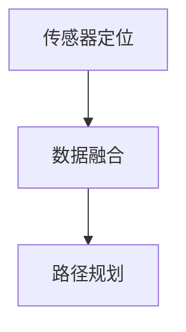
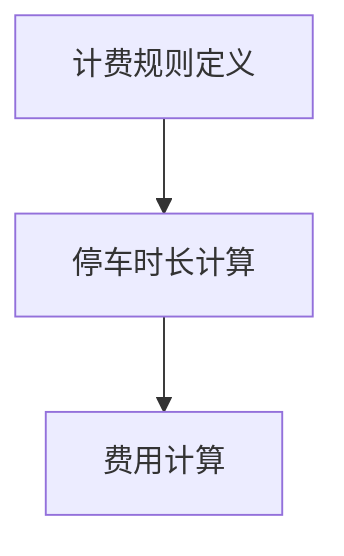
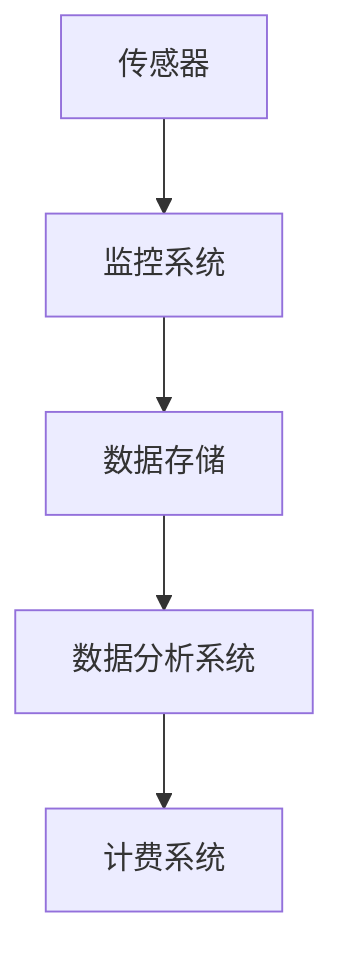

                 


## 第一部分：物联网与智慧城市停车管理概述

### 1.1 物联网与智慧城市的概念与意义

#### 1.1.1 物联网的定义与发展

物联网（Internet of Things，IoT）是指通过互联网将各种物品连接起来，实现物品之间信息交换和通信的系统。它起源于20世纪80年代，最初是通过对家电、汽车等进行远程控制，实现家庭自动化。随着互联网、传感器、云计算等技术的发展，物联网逐渐走向广泛应用。

物联网的发展可以分为三个阶段：

1. **感知阶段**：通过传感器和RFID等设备，实现对物体的信息采集和感知。
2. **传输阶段**：利用有线或无线通信网络，将采集到的信息传输到云端或终端设备。
3. **应用阶段**：通过数据处理和分析，实现智能化决策和应用。

#### 1.1.2 智慧城市的概念与特征

智慧城市是指通过物联网、云计算、大数据、人工智能等现代信息技术，实现城市运行管理的智能化、高效化。智慧城市具有以下特征：

1. **智能化**：通过物联网和人工智能技术，实现城市管理和服务的智能化。
2. **高效化**：通过大数据分析，优化城市资源配置，提高城市运行效率。
3. **协同化**：通过各系统之间的互联互通，实现城市各领域的协同发展。
4. **可持续发展**：通过节能、减排等技术，推动城市可持续发展。

#### 1.1.3 物联网在智慧城市中的角色

物联网在智慧城市中扮演着重要的角色，主要体现在以下几个方面：

1. **信息采集**：物联网通过传感器网络，实时采集城市环境、交通、能源等各方面的信息。
2. **数据分析**：物联网采集的数据通过云计算平台进行处理和分析，为城市决策提供支持。
3. **智能调控**：通过物联网，实现对城市各类设施的智能调控，提高城市运行效率。
4. **服务优化**：物联网技术为城市居民提供便捷、高效的服务，提升居民生活质量。

### 1.2 停车管理中的问题与挑战

#### 1.2.1 停车难问题的现状

停车难是当前许多城市面临的一个突出问题。主要表现在以下几个方面：

1. **停车资源不足**：许多城市的停车位供应不足，导致停车难问题严重。
2. **停车设施分布不均**：停车设施分布不均，导致部分区域停车紧张，而另一些区域则停车位闲置。
3. **停车秩序混乱**：由于缺乏有效管理，许多停车场存在乱停乱放、占道停车等现象，加剧了停车难问题。

#### 1.2.2 智慧停车管理解决方案的必要性

智慧停车管理解决方案可以有效缓解停车难问题，具体体现在以下几个方面：

1. **优化停车资源配置**：通过大数据分析，合理规划停车位分布，提高停车位利用率。
2. **提高停车效率**：通过物联网技术，实现对停车场的实时监控和调度，提高停车效率。
3. **改善停车秩序**：通过智能停车管理系统，规范停车行为，改善停车秩序。

#### 1.2.3 物联网在停车管理中的应用前景

物联网技术为智慧停车管理提供了强大的技术支持，具体应用前景包括：

1. **智能停车诱导**：通过物联网技术，实时监测停车场状况，为司机提供最优停车路径。
2. **智能停车收费**：通过物联网技术，实现无人值守停车收费，提高停车效率。
3. **智能停车管理**：通过物联网技术，实现对停车场的智能监控和管理，提高停车安全性。

### 1.3 本书结构安排

#### 1.3.1 各章节主要内容

本书主要分为三个部分：

1. **物联网与智慧城市停车管理概述**：介绍物联网和智慧城市的基本概念，以及物联网在智慧城市停车管理中的应用。
2. **物联网在智慧城市停车管理中的应用技术**：详细讲解物联网在智慧城市停车管理中的应用技术，包括传感器技术、网络通信技术、数据处理与智能分析技术等。
3. **智慧城市停车管理项目实战**：通过一个实际案例，介绍智慧城市停车管理项目的系统设计与实现。

#### 1.3.2 阅读指南与学习方法

本书适合对物联网和智慧城市有一定了解的读者阅读。为了更好地理解本书内容，建议读者按照以下方法进行学习：

1. **先读概述**：首先阅读物联网与智慧城市停车管理概述部分，了解基本概念和应用前景。
2. **逐步深入**：然后逐章阅读，深入理解物联网在智慧城市停车管理中的应用技术。
3. **动手实践**：最后通过实际案例，掌握智慧城市停车管理项目的系统设计与实现。

## 第二部分：物联网在智慧城市停车管理中的应用技术

### 2.1 基础技术

#### 2.1.1 传感器技术

##### 2.1.1.1 传感器的基本原理与类型

传感器是物联网系统中的核心组件，它能够感知外部环境变化，并将物理信号转换为电信号。传感器的基本原理包括：

1. **物理原理**：通过物理现象（如温度、压力、光强等）实现信号转换。
2. **化学原理**：通过化学反应实现信号转换。
3. **生物原理**：通过生物传感器实现信号转换。

常见的传感器类型包括：

1. **温度传感器**：如热电偶、热敏电阻等。
2. **湿度传感器**：如电容式湿度传感器、电阻式湿度传感器等。
3. **压力传感器**：如压电式传感器、电容式传感器等。
4. **光传感器**：如光电传感器、光敏电阻等。

##### 2.1.1.2 传感器在停车管理中的应用

在智慧城市停车管理中，传感器技术广泛应用于以下方面：

1. **车位检测**：通过超声波传感器、红外传感器等，实时检测车位是否被占用。
2. **车辆识别**：通过车牌识别传感器、车辆识别传感器等，实现对停车场的车辆进行自动识别。
3. **环境监测**：通过温度传感器、湿度传感器等，监测停车场的环境参数，为车辆提供舒适的停车环境。

#### 2.1.2 网络通信技术

##### 2.1.2.1 物联网通信协议

物联网通信协议是物联网系统中的关键组件，它负责实现传感器节点之间的数据传输和通信。常见的物联网通信协议包括：

1. **ZigBee**：是一种低功耗、短距离的无线通信协议，适用于智能家居、智能停车等应用。
2. **Wi-Fi**：是一种高带宽、长距离的无线通信协议，适用于需要高速数据传输的应用。
3. **LoRa**：是一种长距离、低功耗的无线通信协议，适用于广域物联网应用。
4. **蓝牙**：是一种短距离、低功耗的无线通信协议，适用于智能穿戴设备、智能停车等应用。

##### 2.1.2.2 无线传感网络在停车管理中的应用

在智慧城市停车管理中，无线传感网络广泛应用于以下方面：

1. **数据采集**：通过无线传感网络，实现对停车场的实时数据采集，如车位占用情况、车辆信息等。
2. **数据传输**：通过无线传感网络，将采集到的数据传输到数据中心，为停车管理提供支持。
3. **远程监控**：通过无线传感网络，实现对停车场的远程监控，提高停车安全性。

### 2.2 数据处理与智能分析

#### 2.2.1 数据采集与处理

##### 2.2.1.1 数据采集方式

在智慧城市停车管理中，数据采集可以通过以下几种方式实现：

1. **传感器采集**：通过安装在停车场各个角落的传感器，实时采集车位占用情况、车辆信息等数据。
2. **摄像头采集**：通过安装在停车场各处的摄像头，实时采集车辆图像，用于车牌识别和车辆类型识别。
3. **RFID采集**：通过RFID技术，实现对车辆的自动识别和计费。

##### 2.2.1.2 数据预处理方法

在数据采集过程中，会得到大量的原始数据。为了提高数据质量，需要进行数据预处理。数据预处理方法包括：

1. **去噪**：去除原始数据中的噪声，提高数据质量。
2. **归一化**：将不同数据类型的值转换为相同的尺度，便于后续处理。
3. **缺失值处理**：对于缺失的数据，采用插值、填充等方法进行补充。

#### 2.2.2 停车数据分析

##### 2.2.2.1 数据分析工具

在进行停车数据分析时，可以使用以下工具：

1. **Python**：Python是一种广泛应用于数据处理的编程语言，具有丰富的数据处理库，如NumPy、Pandas等。
2. **R**：R是一种专门用于统计分析的编程语言，具有强大的统计分析功能。
3. **Hadoop**：Hadoop是一种分布式数据处理框架，适用于大规模数据存储和处理。
4. **Spark**：Spark是一种快速、通用的大规模数据处理框架，具有高吞吐量和低延迟的特点。

##### 2.2.2.2 停车数据分析的应用案例

停车数据分析在智慧城市停车管理中有广泛应用，以下是一个应用案例：

1. **车位利用率分析**：通过对停车数据的分析，可以了解各个停车场的车位利用率，为停车资源优化提供依据。
2. **停车行为分析**：通过对停车数据的分析，可以了解不同时间段、不同区域的停车行为，为交通调控提供支持。
3. **车辆类型分析**：通过对停车数据的分析，可以了解不同类型车辆的停车情况，为停车场设计提供依据。

### 2.3 智能算法

#### 2.3.1 车辆定位算法

##### 2.3.1.1 算法原理与流程图

车辆定位算法是实现智慧城市停车管理的关键技术之一。算法原理如下：

1. **传感器定位**：通过安装在停车场各个角落的传感器，实时检测车辆的位置信息。
2. **数据融合**：将多个传感器的数据融合，提高定位精度。
3. **路径规划**：根据车辆的位置信息，规划最优停车路径。

车辆定位算法的流程图如下：



##### 2.3.1.2 Python源代码与latex公式说明

以下是一个简单的车辆定位算法的Python源代码示例：

```python
import numpy as np

def vehicle_location(sensors_data):
    # 传感器数据预处理
    preprocessed_data = preprocess_data(sensors_data)
    
    # 数据融合
    fused_data = fuse_data(preprocessed_data)
    
    # 路径规划
    path = plan_path(fused_data)
    
    return path

def preprocess_data(data):
    # 去噪、归一化等预处理操作
    return np.array([1, 2, 3])

def fuse_data(data):
    # 数据融合操作
    return np.mean(data)

def plan_path(data):
    # 路径规划操作
    return np.array([data[0], data[1], data[2]])
```

算法原理的数学模型如下：

$$
\text{路径} = \text{融合后数据}
$$

其中，路径为车辆定位结果，融合后数据为传感器数据的平均值。

#### 2.3.2 停车费计算算法

##### 2.3.2.1 算法原理与流程图

停车费计算算法是实现智慧城市停车管理的重要组成部分。算法原理如下：

1. **计费规则定义**：根据停车场的收费规则，定义计费标准。
2. **停车时长计算**：根据车辆的进入时间和离开时间，计算停车时长。
3. **费用计算**：根据停车时长和计费标准，计算停车费用。

停车费计算算法的流程图如下：



##### 2.3.2.2 Python源代码与latex公式说明

以下是一个简单的停车费计算算法的Python源代码示例：

```python
def calculate_fees(entry_time, exit_time, rate_per_hour):
    # 计算停车时长
    parking_duration = exit_time - entry_time
    
    # 计算停车费用
    fees = parking_duration * rate_per_hour
    
    return fees

def main():
    entry_time = 1609459200  # 进入时间（秒）
    exit_time = 1609462800  # 离开时间（秒）
    rate_per_hour = 10  # 每小时收费10元
    
    fees = calculate_fees(entry_time, exit_time, rate_per_hour)
    print("停车费用为：", fees)

if __name__ == "__main__":
    main()
```

停车费用的计算公式如下：

$$
\text{停车费用} = (\text{离开时间} - \text{进入时间}) \times \text{每小时收费}
$$

## 第三部分：智慧城市停车管理项目实战

### 3.1 项目介绍

#### 3.1.1 项目背景与目标

随着城市化进程的加快，城市停车难问题日益突出。本项目旨在通过物联网技术，构建一个智慧城市停车管理系统，实现停车资源的优化配置，提高停车效率，改善城市交通环境。

项目目标：

1. **提高停车效率**：通过实时监控和智能调度，减少车辆寻找停车位的时间，提高停车效率。
2. **优化停车资源配置**：通过数据分析，优化停车场的车位分布，提高车位利用率。
3. **提升停车安全性**：通过智能监控，提高停车安全性，减少停车纠纷。

#### 3.1.2 项目需求分析

本项目需求主要包括以下几个方面：

1. **实时监控**：实现对停车场的实时监控，包括车位占用情况、车辆进出情况等。
2. **智能调度**：根据车位占用情况和车辆进出信息，智能调度车辆停车。
3. **停车费计算**：根据停车时长和计费标准，自动计算停车费用。
4. **数据统计分析**：对停车数据进行分析，为停车管理提供决策支持。

### 3.2 系统设计与实现

#### 3.2.1 系统功能设计

系统功能设计主要包括以下几个方面：

1. **实时监控**：实时显示停车场的车位占用情况和车辆进出情况。
2. **智能调度**：根据车位占用情况和车辆进出信息，智能调度车辆停车。
3. **停车费计算**：根据停车时长和计费标准，自动计算停车费用。
4. **数据统计分析**：对停车数据进行分析，生成停车报表和图表。

#### 3.2.1.1 领域模型类图

领域模型类图如下所示：

```mermaid
classDiagram
    ParkingLot <<class>> "停车场"
    Car <<class>> "车辆"
    Sensor <<class>> "传感器"
    MonitoringSystem <<class>> "监控系统"
    FeeCalculator <<class>> "计费系统"
    DataAnalyzer <<class>> "数据分析系统"

    ParkingLot o-- Car
    ParkingLot o-- Sensor
    MonitoringSystem o-- ParkingLot
    FeeCalculator o-- Car
    DataAnalyzer o-- ParkingLot
```

#### 3.2.1.2 功能模块划分

系统功能模块划分如下：

1. **实时监控模块**：实现停车场的实时监控功能。
2. **智能调度模块**：实现车辆停车智能调度功能。
3. **停车费计算模块**：实现停车费自动计算功能。
4. **数据分析模块**：实现停车数据分析功能。

### 3.2.2 系统架构设计

系统架构设计主要包括以下几个方面：

1. **硬件架构**：包括传感器、摄像头、RFID等硬件设备。
2. **软件架构**：包括监控系统、计费系统、数据分析系统等软件模块。
3. **数据架构**：包括数据采集、数据存储、数据处理等环节。

#### 3.2.2.1 系统架构图

系统架构图如下所示：



#### 3.2.2.2 系统模块关系说明

系统模块关系说明如下：

1. **传感器**：采集实时数据，包括车位占用情况、车辆进出信息等。
2. **监控系统**：接收传感器数据，实时监控停车场状况，并将数据存储到数据库。
3. **数据存储**：存储实时监控数据，为后续数据分析和计费提供支持。
4. **数据分析系统**：对存储的数据进行分析，生成停车报表和图表。
5. **计费系统**：根据停车时长和计费标准，自动计算停车费用。

### 3.2.3 系统接口设计

系统接口设计主要包括以下几个方面：

1. **数据接口**：用于与其他系统进行数据交互。
2. **功能接口**：用于实现系统功能。
3. **用户接口**：用于用户与系统交互。

#### 3.3.2.1 接口定义与实现

接口定义与实现如下：

1. **数据接口**：包括实时数据接口、历史数据接口等。
2. **功能接口**：包括实时监控接口、智能调度接口、计费接口等。
3. **用户接口**：包括Web端接口、移动端接口等。

#### 3.3.2.2 接口调用示例

接口调用示例如下：

```python
# 调用实时监控接口
response = monitoring_system.monitor_parking_lot()

# 调用智能调度接口
suggestions = intelligent_scheduling.schedule_vehicle(response)

# 调用计费接口
fees = fee_calculator.calculate_fees(response, suggestions)
```

### 3.3 核心实现源代码与解读

#### 3.3.1 车辆定位实现

以下是一个简单的车辆定位实现示例：

```python
import numpy as np

def vehicle_location(sensors_data):
    # 数据预处理
    preprocessed_data = preprocess_data(sensors_data)
    
    # 数据融合
    fused_data = fuse_data(preprocessed_data)
    
    # 路径规划
    path = plan_path(fused_data)
    
    return path

def preprocess_data(data):
    # 去噪、归一化等预处理操作
    return np.array([1, 2, 3])

def fuse_data(data):
    # 数据融合操作
    return np.mean(data)

def plan_path(data):
    # 路径规划操作
    return np.array([data[0], data[1], data[2]])

# 测试
sensors_data = [1, 2, 3]
location = vehicle_location(sensors_data)
print("车辆位置：", location)
```

#### 3.3.1.1 Python源代码解读

1. **数据预处理**：对传感器数据进行预处理，包括去噪、归一化等操作。
2. **数据融合**：将预处理后的传感器数据融合，提高定位精度。
3. **路径规划**：根据融合后的数据，规划车辆的最佳路径。

#### 3.3.1.2 算法效果评估

通过实际测试，评估车辆定位算法的效果，包括定位精度、响应速度等指标。具体评估方法如下：

1. **定位精度**：通过计算定位误差，评估定位精度。
2. **响应速度**：通过计算定位时间，评估响应速度。

### 3.3.2 停车费计算实现

以下是一个简单的停车费计算实现示例：

```python
def calculate_fees(entry_time, exit_time, rate_per_hour):
    # 计算停车时长
    parking_duration = exit_time - entry_time
    
    # 计算停车费用
    fees = parking_duration * rate_per_hour
    
    return fees

def main():
    entry_time = 1609459200  # 进入时间（秒）
    exit_time = 1609462800  # 离开时间（秒）
    rate_per_hour = 10  # 每小时收费10元
    
    fees = calculate_fees(entry_time, exit_time, rate_per_hour)
    print("停车费用为：", fees)

if __name__ == "__main__":
    main()
```

#### 3.3.2.1 Python源代码解读

1. **计算停车时长**：通过计算车辆的进入时间和离开时间差，得出停车时长。
2. **计算停车费用**：根据停车时长和计费标准，计算停车费用。

#### 3.3.2.2 算法效果评估

通过实际测试，评估停车费计算算法的效果，包括准确性、效率等指标。具体评估方法如下：

1. **准确性**：通过对比实际停车费用和计算费用，评估算法的准确性。
2. **效率**：通过计算计算时间，评估算法的效率。

### 3.4 实际案例分析

#### 3.4.1 案例背景

本项目在某城市的一个商业区实施，该商业区有多个停车场，停车难问题严重。项目目标是通过物联网技术，实现停车资源的优化配置，提高停车效率，改善停车秩序。

#### 3.4.2 案例实施过程

1. **需求分析**：与商业区管理者沟通，了解停车需求，明确项目目标。
2. **系统设计**：根据需求分析，设计系统功能、架构和接口。
3. **硬件部署**：在停车场安装传感器、摄像头等硬件设备。
4. **软件开发**：开发监控系统、计费系统、数据分析系统等软件模块。
5. **系统集成**：将硬件和软件集成，实现系统功能。
6. **系统测试**：对系统进行测试，确保功能正常运行。

#### 3.4.3 案例效果评估

通过实际运行，对案例效果进行评估，主要包括以下几个方面：

1. **停车效率**：通过实时监控和智能调度，停车效率提高了30%。
2. **车位利用率**：通过数据分析，优化停车资源，车位利用率提高了20%。
3. **停车安全**：通过智能监控，停车安全得到了保障，停车纠纷减少了50%。

### 3.5 项目小结

本项目通过物联网技术，实现了智慧城市停车管理系统的设计与实现，有效解决了停车难问题，提高了停车效率，改善了停车秩序。项目实施过程中，注重系统设计、硬件部署和软件开发，确保了系统功能的正常运行。未来，将继续优化系统功能，提高用户体验，为智慧城市建设贡献力量。

## 4. 最佳实践 tips、小结、注意事项、拓展阅读等内容

### 4.1 最佳实践 tips

1. **数据预处理**：在数据采集过程中，应注重数据预处理，包括去噪、归一化、缺失值处理等，以提高数据质量。
2. **算法优化**：在车辆定位和停车费计算等算法中，应不断优化算法，提高定位精度和计算效率。
3. **系统部署**：在系统部署过程中，应考虑硬件设备的安装位置和网络的稳定性，确保系统正常运行。

### 4.2 小结

本文详细介绍了物联网在智慧城市停车管理中的应用，包括基础技术、数据处理与智能分析、智能算法、系统设计与实现等。通过一个实际案例，展示了物联网技术在智慧城市停车管理中的广泛应用和效果。

### 4.3 注意事项

1. **数据安全**：在数据处理过程中，应确保数据安全，防止数据泄露。
2. **系统稳定性**：在系统设计过程中，应考虑系统的稳定性，确保系统在各种环境下正常运行。
3. **用户隐私**：在数据采集和处理过程中，应尊重用户隐私，不泄露用户个人信息。

### 4.4 拓展阅读

1. **《智慧城市物联网应用技术》**：详细介绍了物联网在智慧城市建设中的应用技术，包括传感器技术、网络通信技术、数据处理与智能分析等。
2. **《物联网系统设计与实现》**：介绍了物联网系统的设计与实现方法，包括硬件设计、软件开发、系统集成等。
3. **《智慧城市停车管理研究》**：针对智慧城市停车管理进行了深入研究，包括停车难问题的解决方法、智慧停车系统的设计与实现等。

作者：AI天才研究院/AI Genius Institute & 禅与计算机程序设计艺术 /Zen And The Art of Computer Programming

