                 


### 第一部分: 背景介绍

#### 1.1 问题背景

**1.1.1 物联网技术的发展**

物联网（Internet of Things, IoT）是指将各种信息传感设备与网络结合起来，实现智能化识别、定位、追踪、监控和管理的一种技术。物联网技术的发展始于20世纪80年代，随着传感器技术、无线通信技术、嵌入式系统技术以及互联网技术的发展，物联网技术得到了迅猛发展。近年来，物联网技术已经广泛应用于智能家居、智能交通、智能医疗、智能制造等领域。

**1.1.2 智慧城市建设的意义**

智慧城市建设是城市发展的新趋势，其核心是通过信息技术的应用，实现城市资源的优化配置，提升城市治理能力和服务水平。智慧城市建设不仅有助于提高居民的生活质量，还能促进城市的可持续发展。随着城市化进程的加速，水资源管理、交通管理、环境监测等城市基础设施面临着越来越大的压力，智慧城市排水系统作为其中的一部分，具有非常重要的意义。

**1.1.3 智慧城市排水系统的需求**

智慧城市排水系统需要具备实时监测、智能调控、预警预测等功能，以便及时发现并处理城市排水系统中的各种问题。例如，在暴雨天气时，排水系统需要能够快速响应，及时开启排水泵，防止城市内涝。此外，智慧城市排水系统还需要能够进行水质监测，确保排水系统的运行不会对环境造成污染。

#### 1.2 问题描述

**1.2.1 传统排水系统存在的问题**

传统排水系统通常依靠人工巡检和定时监测，存在以下问题：

- **反应速度慢**：无法实时响应城市排水需求，容易导致内涝。
- **监测不全面**：无法全面掌握排水系统的运行状态，难以预测可能出现的问题。
- **数据采集困难**：监测数据难以实时传输和处理，影响排水系统的调控效果。

**1.2.2 物联网技术如何解决这些问题**

物联网技术可以通过以下几个方面解决传统排水系统的痛点：

- **实时监测**：利用传感器实时采集排水系统的各项数据，如水位、流量、pH值等。
- **数据传输**：通过无线通信技术将监测数据实时传输到数据处理中心。
- **智能分析**：利用大数据分析和人工智能技术对监测数据进行分析，提供决策支持。
- **自动调控**：根据分析结果自动开启或关闭排水泵，优化排水系统运行。

**1.2.3 实时监控的关键性和挑战**

实时监控是智慧城市排水系统的核心功能之一，其关键性体现在：

- **提高排水效率**：实时监控可以快速响应排水需求，提高排水效率。
- **保障城市安全**：实时监控可以帮助及时发现和处理排水系统故障，保障城市安全。

然而，实时监控也面临着以下挑战：

- **数据量大**：排水系统涉及的传感器和数据源众多，数据量大。
- **实时性要求高**：实时监控要求数据传输和处理的速度快，实时性高。
- **系统复杂性**：智慧城市排水系统涉及到多个子系统，系统架构复杂。

#### 1.3 问题解决

**1.3.1 物联网技术在排水系统中的应用**

物联网技术在排水系统中的应用主要包括：

- **传感器网络**：部署各种传感器，如水位传感器、流量传感器、pH传感器等，实时采集排水系统的运行数据。
- **无线通信**：使用无线传感器网络（WSN）技术，实现传感器数据的高速传输。
- **数据处理平台**：建立数据处理平台，对采集到的数据进行分析和处理。
- **智能决策系统**：基于分析结果，实现智能决策和自动调控。

**1.3.2 实时监控的技术架构**

实时监控的技术架构主要包括以下几个层次：

- **感知层**：由各种传感器组成，负责实时采集排水系统的数据。
- **传输层**：负责将感知层采集到的数据传输到数据处理平台。
- **数据处理层**：负责对传输层的数据进行分析和处理。
- **决策层**：基于分析结果，实现智能决策和自动调控。

**1.3.3 智慧城市排水系统的整体架构**

智慧城市排水系统的整体架构主要包括：

- **排水管网**：负责城市雨水的收集和排放。
- **泵站**：负责提升雨水和污水的排放高度。
- **监测系统**：负责实时监测排水系统的运行状态。
- **控制系统**：基于监测数据，实现排水系统的智能调控。

#### 1.4 边界与外延

**1.4.1 物联网实时监控的定义**

物联网实时监控是指利用物联网技术，对城市排水系统的运行状态进行实时监测、分析和调控，以实现排水系统的智能化和高效化运行。

**1.4.2 智慧城市排水系统的功能边界**

智慧城市排水系统的功能边界包括：

- **雨水收集**：收集城市路面和建筑物的雨水，进行初步处理。
- **污水排放**：将污水处理达标后排放。
- **泵站运行**：根据排水需求，自动启动或停止泵站。
- **水质监测**：实时监测排水水质，确保水质达标。

**1.4.3 物联网实时监控的延伸应用**

物联网实时监控不仅应用于排水系统，还可以延伸到其他领域，如：

- **交通管理**：实时监测城市交通状况，优化交通信号控制。
- **环境监测**：实时监测城市空气质量、水质等环境参数。
- **城市管理**：实时监测城市基础设施的运行状态，保障城市安全。

#### 1.5 概念结构与核心要素组成

**1.5.1 物联网基本概念**

物联网（Internet of Things, IoT）是指将各种信息传感设备与网络结合起来，实现智能化识别、定位、追踪、监控和管理的一种技术。物联网的基本概念包括：

- **传感器**：用于感知环境和设备的物理量，如温度、湿度、压力等。
- **网络**：用于传输传感器采集的数据，如无线网络、有线网络等。
- **数据处理中心**：用于接收、存储、分析和处理传感器数据。
- **用户端**：用于接收处理后的数据，并进行决策和调控。

**1.5.2 智慧城市排水系统的构成**

智慧城市排水系统主要由以下几个部分组成：

- **排水管网**：负责城市雨水的收集和排放。
- **泵站**：负责提升雨水和污水的排放高度。
- **监测系统**：负责实时监测排水系统的运行状态。
- **控制系统**：负责根据监测数据实现排水系统的智能调控。

**1.5.3 实时监控的核心技术要素**

实时监控的核心技术要素包括：

- **传感器技术**：用于采集排水系统的各项数据。
- **无线通信技术**：用于传输传感器采集的数据。
- **数据处理技术**：用于对传感器数据进行分析和处理。
- **智能决策技术**：用于根据分析结果实现智能调控。

#### 1.6 本章小结

本章介绍了物联网在智慧城市排水系统中的实时监控问题，包括问题背景、问题描述、问题解决、边界与外延以及概念结构与核心要素组成。通过对物联网和智慧城市排水系统的介绍，分析了传统排水系统存在的问题，探讨了物联网技术如何解决这些问题，并提出了实时监控的关键性和挑战。接下来，我们将进一步探讨物联网和智慧城市排水系统的核心概念及其联系。 ## 第一部分: 背景介绍

### 1.1 问题背景

#### 1.1.1 物联网技术的发展

物联网（Internet of Things, IoT）是指通过互联网将各种设备和物体连接起来，实现信息交换和智能控制的一种技术。自21世纪初以来，物联网技术经历了快速的发展，主要得益于传感器技术、无线通信技术、嵌入式系统和大数据分析技术的进步。物联网的应用范围不断扩大，从智能家居、智能交通、智能医疗到工业4.0和智慧城市等各个领域。

在智慧城市建设中，物联网技术扮演着至关重要的角色。通过物联网，城市中的各类设备和系统可以相互连接，形成一个高度集成的信息网络，从而实现资源的优化配置和高效管理。例如，智慧交通系统可以通过物联网技术实时监测交通流量，优化交通信号控制，减少交通拥堵；智慧医疗系统可以通过物联网设备实时监测患者的健康状况，提供个性化的医疗服务。

#### 1.1.2 智慧城市建设的意义

智慧城市建设是城市现代化发展的重要方向，它不仅提高了城市的管理水平和居民的生活质量，还为城市的可持续发展提供了有力支持。智慧城市建设的意义主要体现在以下几个方面：

- **提高城市治理能力**：智慧城市通过信息技术的应用，实现了城市管理的精细化、智能化，提高了城市治理的效率和水平。
- **提升居民生活质量**：智慧城市提供了更加便捷、智能的生活服务，如智能家居、智能医疗、智能交通等，提升了居民的生活质量。
- **促进经济发展**：智慧城市的建设带动了新兴产业的发展，创造了大量的就业机会，促进了经济的快速发展。

#### 1.1.3 智慧城市排水系统的需求

在智慧城市建设中，排水系统是不可或缺的一部分。智慧城市排水系统需要具备实时监测、智能调控、预警预测等功能，以满足以下需求：

- **实时监测**：通过部署传感器网络，实时监测排水系统的运行状态，包括水位、流量、pH值等关键指标。
- **智能调控**：根据实时监测数据，通过智能算法和控制系统，自动调整排水泵的启停、泵站的运行模式等，确保排水系统的稳定高效运行。
- **预警预测**：通过大数据分析和人工智能技术，对排水系统的潜在故障和异常情况进行分析预测，提前采取措施，防止城市内涝和污染事故的发生。

智慧城市排水系统的建设不仅能够提高城市排水能力，减少内涝和污染，还能为城市的可持续发展提供保障。

### 1.2 问题描述

#### 1.2.1 传统排水系统存在的问题

传统排水系统通常采用人工巡检和定时监测的方式，存在以下问题：

- **反应速度慢**：传统排水系统无法实时响应雨水排放需求，容易导致城市内涝。
- **监测不全面**：传统监测方式无法全面掌握排水系统的运行状态，难以预测可能出现的问题。
- **数据采集困难**：监测数据难以实时传输和处理，影响排水系统的调控效果。

#### 1.2.2 物联网技术如何解决这些问题

物联网技术可以通过以下几个步骤解决传统排水系统存在的问题：

- **实时监测**：通过部署各种传感器，如水位传感器、流量传感器、pH传感器等，实时采集排水系统的各项数据，实现排水系统状态的全面监测。
- **数据传输**：利用无线通信技术，如Wi-Fi、LoRa、NB-IoT等，将传感器采集的数据实时传输到数据处理中心。
- **智能分析**：利用大数据分析和人工智能技术，对传输的数据进行实时分析，提供决策支持。
- **自动调控**：根据分析结果，自动开启或关闭排水泵，调整泵站的运行模式等，实现排水系统的智能调控。

#### 1.2.3 实时监控的关键性和挑战

实时监控是智慧城市排水系统的核心功能之一，其关键性体现在：

- **提高排水效率**：实时监控可以快速响应排水需求，提高排水效率，减少内涝风险。
- **保障城市安全**：实时监控可以帮助及时发现和处理排水系统故障，保障城市安全。

然而，实时监控也面临着以下挑战：

- **数据量大**：排水系统涉及的传感器和数据源众多，数据量大。
- **实时性要求高**：实时监控要求数据传输和处理的速度快，实时性高。
- **系统复杂性**：智慧城市排水系统涉及到多个子系统，系统架构复杂。

### 1.3 问题解决

#### 1.3.1 物联网技术在排水系统中的应用

物联网技术在排水系统中的应用主要包括以下几个环节：

- **感知层**：通过部署各种传感器，如水位传感器、流量传感器、pH传感器等，实时采集排水系统的各项数据。
- **传输层**：利用无线通信技术，如Wi-Fi、LoRa、NB-IoT等，将传感器采集的数据传输到数据处理中心。
- **数据处理层**：对传输的数据进行实时处理和分析，利用大数据分析和人工智能技术，提供决策支持。
- **控制层**：根据分析结果，自动调整排水泵的启停、泵站的运行模式等，实现排水系统的智能调控。

#### 1.3.2 实时监控的技术架构

实时监控的技术架构主要包括以下几个层次：

- **感知层**：由各种传感器组成，负责实时采集排水系统的数据。
- **传输层**：负责将感知层采集到的数据传输到数据处理平台。
- **数据处理层**：负责对传输层的数据进行分析和处理。
- **决策层**：基于分析结果，实现智能决策和自动调控。

#### 1.3.3 智慧城市排水系统的整体架构

智慧城市排水系统的整体架构包括以下几个部分：

- **排水管网**：负责城市雨水的收集和排放。
- **泵站**：负责提升雨水和污水的排放高度。
- **监测系统**：负责实时监测排水系统的运行状态。
- **控制系统**：基于监测数据，实现排水系统的智能调控。

### 1.4 边界与外延

#### 1.4.1 物联网实时监控的定义

物联网实时监控是指利用物联网技术，对城市排水系统的运行状态进行实时监测、分析和调控，以实现排水系统的智能化和高效化运行。

#### 1.4.2 智慧城市排水系统的功能边界

智慧城市排水系统的功能边界包括：

- **雨水收集**：收集城市路面和建筑物的雨水，进行初步处理。
- **污水排放**：将污水处理达标后排放。
- **泵站运行**：根据排水需求，自动启动或停止泵站。
- **水质监测**：实时监测排水水质，确保排水系统的运行不会对环境造成污染。

#### 1.4.3 物联网实时监控的延伸应用

物联网实时监控不仅应用于排水系统，还可以延伸到其他领域，如：

- **交通管理**：实时监测城市交通状况，优化交通信号控制。
- **环境监测**：实时监测城市空气质量、水质等环境参数。
- **城市管理**：实时监测城市基础设施的运行状态，保障城市安全。

### 1.5 概念结构与核心要素组成

#### 1.5.1 物联网基本概念

物联网（Internet of Things, IoT）是指通过互联网将各种设备和物体连接起来，实现信息交换和智能控制的一种技术。物联网的基本概念包括：

- **传感器**：用于感知环境和设备的物理量，如温度、湿度、压力等。
- **网络**：用于传输传感器采集的数据，如无线网络、有线网络等。
- **数据处理中心**：用于接收、存储、分析和处理传感器数据。
- **用户端**：用于接收处理后的数据，并进行决策和调控。

#### 1.5.2 智慧城市排水系统的构成

智慧城市排水系统主要由以下几个部分组成：

- **排水管网**：负责城市雨水的收集和排放。
- **泵站**：负责提升雨水和污水的排放高度。
- **监测系统**：负责实时监测排水系统的运行状态。
- **控制系统**：负责根据监测数据实现排水系统的智能调控。

#### 1.5.3 实时监控的核心技术要素

实时监控的核心技术要素包括：

- **传感器技术**：用于采集排水系统的各项数据。
- **无线通信技术**：用于传输传感器采集的数据。
- **数据处理技术**：用于对传感器数据进行分析和处理。
- **智能决策技术**：用于根据分析结果实现智能调控。

### 1.6 本章小结

本章介绍了物联网在智慧城市排水系统中的实时监控问题，包括问题背景、问题描述、问题解决、边界与外延以及概念结构与核心要素组成。通过对物联网和智慧城市排水系统的介绍，分析了传统排水系统存在的问题，探讨了物联网技术如何解决这些问题，并提出了实时监控的关键性和挑战。接下来，我们将进一步探讨物联网和智慧城市排水系统的核心概念及其联系。 ## 第二部分: 核心概念与联系

### 2.1 物联网核心概念

#### 2.1.1 物联网的定义

物联网（Internet of Things，IoT）是指通过传感器、网络和数据处理技术，将物理世界中的各种物体连接起来，实现信息的采集、传输、处理和智能控制。物联网的核心理念是“万物互联”，即将任何物体与网络连接，使其具备“智能”属性。

#### 2.1.2 物联网的组成要素

物联网系统通常包括以下几个主要组成要素：

- **传感器**：用于感知环境或物体状态，如温度、湿度、亮度等。
- **通信网络**：用于传输传感器采集的数据，包括无线网络（如Wi-Fi、LoRa、NB-IoT等）和有线网络。
- **数据处理平台**：用于接收、存储、分析和处理传感器数据，提供智能决策支持。
- **用户端**：用于接收处理后的数据，进行决策和调控。

#### 2.1.3 物联网的关键技术

物联网的关键技术包括：

- **传感器技术**：涉及各种传感器，如温度传感器、湿度传感器、光电传感器等。
- **通信技术**：涉及无线通信协议，如Wi-Fi、LoRa、NB-IoT等。
- **数据处理技术**：涉及大数据处理、人工智能和机器学习技术。
- **网络安全技术**：确保物联网设备与数据的安全和隐私。

### 2.2 智慧城市排水系统概念

#### 2.2.1 智慧城市排水系统的定义

智慧城市排水系统是指利用物联网、大数据、人工智能等先进技术，对城市排水系统进行智能化管理和优化，以提高排水效率、减少内涝、改善水质，实现城市排水系统的安全、稳定和高效运行。

#### 2.2.2 智慧城市排水系统的特点

智慧城市排水系统具有以下特点：

- **实时监测**：通过部署传感器网络，实时监测排水系统的运行状态，包括水位、流量、水质等。
- **智能调控**：根据实时监测数据，通过智能算法和控制系统，自动调整排水泵的启停、泵站的运行模式等，实现排水系统的智能调控。
- **预警预测**：通过大数据分析和人工智能技术，对排水系统的潜在故障和异常情况进行分析预测，提前采取措施，防止城市内涝和污染事故的发生。
- **数据驱动**：基于海量数据分析和挖掘，实现排水系统的精细化管理和优化。

#### 2.2.3 智慧城市排水系统的关键组成部分

智慧城市排水系统主要由以下几个部分组成：

- **排水管网**：负责城市雨水的收集和排放。
- **泵站**：负责提升雨水和污水的排放高度。
- **监测系统**：负责实时监测排水系统的运行状态。
- **控制系统**：基于监测数据，实现排水系统的智能调控。

### 2.3 实时监控技术原理

#### 2.3.1 实时监控的定义

实时监控是指对系统、过程或环境进行连续的、实时的监测和反馈，以确保其正常运行。在智慧城市排水系统中，实时监控技术用于实时监测排水系统的各项指标，如水位、流量、水质等，及时发现并处理异常情况。

#### 2.3.2 实时监控的技术架构

实时监控的技术架构主要包括以下几个层次：

- **感知层**：由各种传感器组成，负责实时采集排水系统的各项数据。
- **传输层**：负责将感知层采集到的数据传输到数据处理平台，通常采用无线通信技术。
- **数据处理层**：负责对传输的数据进行实时处理和分析，提供决策支持。
- **决策层**：基于分析结果，实现智能决策和自动调控，调整排水系统的运行状态。

#### 2.3.3 实时监控的核心技术

实时监控的核心技术包括：

- **传感器技术**：用于实时采集排水系统的各项数据，如水位传感器、流量传感器、pH传感器等。
- **通信技术**：用于传输传感器采集的数据，如Wi-Fi、LoRa、NB-IoT等无线通信技术。
- **数据处理技术**：用于对传感器数据进行分析和处理，如大数据分析、机器学习等。
- **智能决策技术**：用于根据分析结果实现智能决策和自动调控，如基于规则的决策、模糊控制等。

### 2.4 概念属性特征对比表格

#### 2.4.1 物联网与智慧城市排水系统对比

| 对比项 | 物联网 | 智慧城市排水系统 |
| --- | --- | --- |
| 定义 | 通过互联网连接各种设备和物体，实现信息交换和智能控制 | 利用物联网技术对城市排水系统进行智能化管理和优化 |
| 主要功能 | 信息采集、传输、处理、智能控制 | 实时监测、智能调控、预警预测 |
| 技术组成 | 传感器、通信网络、数据处理平台、用户端 | 排水管网、泵站、监测系统、控制系统 |
| 应用领域 | 智能家居、智能交通、智能医疗、工业4.0等 | 智慧城市建设中的排水管理 |

#### 2.4.2 传统排水系统与智慧城市排水系统对比

| 对比项 | 传统排水系统 | 智慧城市排水系统 |
| --- | --- | --- |
| 监测方式 | 定时监测、人工巡检 | 实时监测、自动化监测 |
| 调控方式 | 人工调控 | 智能调控、自动调控 |
| 数据处理 | 人工分析、经验判断 | 大数据分析、智能分析 |
| 系统效能 | 效率低、响应慢 | 效率高、响应快 |
| 可持续性 | 低 | 高 |

#### 2.4.3 实时监控与传统监控对比

| 对比项 | 实时监控 | 传统监控 |
| --- | --- | --- |
| 监测频率 | 实时监测 | 定时监测 |
| 数据反馈 | 实时反馈 | 定时反馈 |
| 调控响应 | 快速响应 | 缓慢响应 |
| 系统复杂度 | 复杂 | 简单 |
| 数据处理 | 自动化处理 | 人工处理 |

### 2.5 ER实体关系图架构

#### 2.5.1 物联网实时监控的ER图

```mermaid
erDiagram
    用户 ||--|{ 监测数据 }|-- 用户
    用户 ||--|{ 调控指令 }|-- 用户
    传感器 ||--|{ 数据流 }|-- 数据处理中心
    数据处理中心 ||--|{ 分析结果 }|-- 控制系统
    控制系统 ||--|{ 控制指令 }|-- 传感器
```

#### 2.5.2 智慧城市排水系统的ER图

```mermaid
erDiagram
    排水管网 ||--|{ 水位 }|-- 泵站
    泵站 ||--|{ 流量 }|-- 数据处理中心
    数据处理中心 ||--|{ 预警预测 }|-- 控制系统
    控制系统 ||--|{ 调控指令 }|-- 排水管网
    水质监测设备 ||--|{ 水质数据 }|-- 数据处理中心
```

#### 2.5.3 实时监控技术的ER图

```mermaid
erDiagram
    感知层 ||--|{ 传感器数据 }|-- 传输层
    传输层 ||--|{ 数据流 }|-- 数据处理层
    数据处理层 ||--|{ 分析结果 }|-- 决策层
    决策层 ||--|{ 调控指令 }|-- 感知层
```

### 2.6 本章小结

本章详细介绍了物联网和智慧城市排水系统的核心概念及其联系。通过对物联网的定义、组成要素和关键技术的介绍，读者可以了解物联网的基本原理。接着，对智慧城市排水系统的定义、特点、关键组成部分和实时监控技术原理进行了详细阐述。通过对比表格和ER实体关系图，进一步明确了物联网与智慧城市排水系统之间的关系。这些核心概念和联系为后续章节的深入讨论奠定了基础。 ## 第三部分: 物联网实时监控技术

### 3.1 物联网实时监控概述

#### 3.1.1 物联网实时监控的重要性

物联网实时监控在智慧城市排水系统中扮演着至关重要的角色。它不仅能够提高排水系统的运行效率，还能显著提升城市的安全性和可持续发展水平。具体来说，物联网实时监控的重要性体现在以下几个方面：

- **提高排水效率**：通过实时监测排水系统的各项指标，如水位、流量、水质等，可以及时发现并处理排水系统中的异常情况，避免内涝的发生，确保排水系统的高效运行。
- **保障城市安全**：实时监控可以帮助城市管理者快速响应各种紧急情况，如暴雨、洪水等，采取有效的应对措施，保障城市的安全和稳定。
- **优化资源利用**：实时监控技术可以实现对排水系统资源的精细化管理，优化泵站、管道等设备的运行状态，提高资源利用效率，减少能源消耗。
- **改善水质**：通过实时监测水质，可以及时发现污染源并采取措施，确保排水系统的运行不会对环境造成污染，提高城市的水环境质量。

#### 3.1.2 物联网实时监控的特点

物联网实时监控具有以下几个显著特点：

- **实时性**：实时监控要求数据传输和处理的速度非常快，能够即时响应排水系统的变化，确保排水系统能够及时调整运行状态。
- **高精度**：传感器技术的高精度保证了监测数据的准确性，为智能调控提供了可靠的数据支持。
- **自动化**：基于大数据分析和人工智能技术，实时监控系统能够自动分析监测数据，提供决策支持，实现排水系统的自动化调控。
- **高可靠性**：物联网实时监控技术采用了多种通信协议和数据存储处理技术，确保数据传输的稳定性和系统的可靠性。

#### 3.1.3 物联网实时监控的应用场景

物联网实时监控在智慧城市排水系统中的应用场景主要包括以下几个方面：

- **暴雨预警**：在暴雨期间，实时监控系统能够快速监测水位变化，及时预警，指导城市排水管理部门采取相应的应对措施。
- **水质监测**：通过实时监测水质指标，如pH值、溶解氧等，可以及时发现污染源，采取措施防止水质恶化。
- **泵站运行监控**：实时监测泵站的运行状态，如泵的流量、压力等，确保泵站的正常运行，避免因设备故障导致排水不畅。
- **管道监测**：实时监测排水管道的运行状态，如管壁的磨损情况、漏水点等，提前发现潜在问题，进行维护和修复。

### 3.2 数据采集与传输

#### 3.2.1 数据采集的方式

数据采集是物联网实时监控的基础，其主要方式包括：

- **传感器采集**：在排水系统的关键位置部署各种传感器，如水位传感器、流量传感器、pH传感器等，实时采集排水系统的运行数据。
- **图像采集**：通过摄像头等设备采集排水系统的视频图像，用于实时监控和事件记录。
- **无线传感器网络（WSN）**：通过无线传感器网络（WSN）实现传感器数据的分布式采集，提高数据的覆盖范围和采集效率。

#### 3.2.2 数据传输的协议

数据传输是物联网实时监控的关键环节，常用的数据传输协议包括：

- **Wi-Fi**：适合高带宽、近距离的数据传输，常用于数据中心的内部通信。
- **LoRa**：适用于长距离、低功耗的数据传输，适合大规模的物联网应用场景。
- **NB-IoT**：适用于低功耗、广覆盖的物联网应用，适合智能城市排水系统的监控。
- **ZigBee**：适用于短距离、低功耗的数据传输，适合局部区域的监控。

#### 3.2.3 数据存储与处理

数据存储与处理是物联网实时监控的核心，主要包括以下几个步骤：

- **数据采集**：传感器采集到的数据通过传输协议发送到数据处理平台。
- **数据清洗**：对采集到的数据进行预处理，去除噪声和异常值，确保数据的质量。
- **数据存储**：将清洗后的数据存储到数据库或云存储平台，以便后续分析和处理。
- **数据分析**：利用大数据分析和人工智能技术，对存储的数据进行分析和挖掘，提取有用的信息，为智能调控提供支持。

### 3.3 实时数据处理与分析

#### 3.3.1 实时数据处理的技术

实时数据处理是物联网实时监控的核心，其关键技术包括：

- **流数据处理**：流数据处理技术能够实时处理传感器数据流，实现对数据的快速分析和处理。
- **大数据处理**：大数据处理技术能够处理海量数据，实现对复杂数据的深度分析和挖掘。
- **机器学习**：机器学习技术可以基于历史数据建立预测模型，实现对实时数据的智能分析和预测。

#### 3.3.2 实时数据处理的流程

实时数据处理的流程通常包括以下几个步骤：

1. **数据采集**：通过传感器网络实时采集排水系统的各项数据。
2. **数据传输**：将采集到的数据通过传输协议传输到数据处理平台。
3. **数据清洗**：对传输的数据进行预处理，去除噪声和异常值。
4. **数据存储**：将清洗后的数据存储到数据库或云存储平台。
5. **数据分析**：利用大数据分析和机器学习技术，对存储的数据进行分析和挖掘。
6. **结果输出**：将分析结果输出到监控系统，为智能调控提供支持。

#### 3.3.3 实时数据处理的应用案例

实时数据处理在智慧城市排水系统中的应用案例包括：

- **暴雨预警**：通过对实时监测的水位数据进行实时分析，可以提前预测暴雨可能引发的内涝风险，及时采取应对措施。
- **水质监测**：通过对实时监测的水质数据进行实时分析，可以及时发现污染源，采取措施防止水质恶化。
- **泵站运行监控**：通过对实时监测的泵站运行数据进行实时分析，可以确保泵站的正常运行，避免因设备故障导致排水不畅。

### 3.4 智能决策与控制

#### 3.4.1 智能决策的定义

智能决策是指利用人工智能技术，根据实时数据分析和预测结果，自动生成决策方案，实现对系统的智能调控。智能决策是物联网实时监控的重要组成部分，其核心是通过对海量数据的实时分析和处理，提取有价值的信息，为决策提供科学依据。

#### 3.4.2 智能决策的技术

智能决策的技术主要包括：

- **机器学习**：通过训练机器学习模型，对实时数据进行分类、预测和分析，提取有价值的信息。
- **深度学习**：利用深度神经网络模型，对复杂的数据进行深度学习和分析，实现高层次的抽象和特征提取。
- **模糊控制**：基于模糊逻辑，实现对实时数据的灵活调控和决策。

#### 3.4.3 智能决策的应用场景

智能决策在智慧城市排水系统中的应用场景包括：

- **排水泵站调控**：根据实时监测的水位数据，自动调整排水泵的运行模式，确保排水泵的高效运行。
- **预警预测**：通过对实时监测数据进行分析，预测可能发生的内涝、污染等风险，提前采取应对措施。
- **水质调控**：根据实时监测的水质数据，自动调整水处理设备的运行参数，确保水质达标。

### 3.5 智慧城市排水系统的实时监控

#### 3.5.1 智慧城市排水系统的实时监控架构

智慧城市排水系统的实时监控架构主要包括以下几个部分：

- **感知层**：由各种传感器组成，负责实时采集排水系统的各项数据。
- **传输层**：负责将感知层采集到的数据传输到数据处理平台，通常采用无线通信技术。
- **数据处理层**：负责对传输的数据进行实时处理和分析，提供决策支持。
- **决策层**：基于分析结果，实现智能决策和自动调控，调整排水系统的运行状态。
- **用户端**：用于接收处理后的数据，进行决策和调控。

#### 3.5.2 智慧城市排水系统的实时监控流程

智慧城市排水系统的实时监控流程通常包括以下几个步骤：

1. **数据采集**：通过传感器网络实时采集排水系统的各项数据。
2. **数据传输**：将采集到的数据通过传输协议传输到数据处理平台。
3. **数据处理**：对传输的数据进行清洗、存储和分析，提取有价值的信息。
4. **智能决策**：基于分析结果，自动生成决策方案，实现智能调控。
5. **结果输出**：将分析结果和决策方案输出到用户端，供城市管理者进行决策。

#### 3.5.3 智慧城市排水系统的实时监控应用案例

智慧城市排水系统的实时监控应用案例包括：

- **城市内涝预警**：通过实时监测水位数据，提前预测可能发生的内涝风险，及时采取应对措施，防止城市内涝。
- **水质监控**：通过实时监测水质数据，及时发现污染源，采取措施防止水质恶化。
- **泵站运行监控**：通过实时监测泵站的运行状态，确保泵站的高效运行，避免因设备故障导致排水不畅。

### 3.6 本章小结

本章详细介绍了物联网实时监控技术，包括其重要性、特点、数据采集与传输、实时数据处理与分析、智能决策与控制以及智慧城市排水系统的实时监控。通过对物联网实时监控技术的深入探讨，读者可以了解如何在智慧城市排水系统中实现实时监控，提高排水系统的效率和安全。接下来，我们将进一步探讨实时监控算法的原理，为智慧城市排水系统的智能调控提供技术支持。 ## 第四部分: 算法原理讲解

### 4.1 实时监控算法基础

#### 4.1.1 算法基础概念

算法（Algorithm）是一系列明确的操作步骤，用于解决特定问题。实时监控算法则是用于处理和分析实时数据，以实现对系统进行实时监测和调控的算法。实时监控算法通常包括以下几个核心概念：

- **输入**：算法处理的数据，如传感器采集的水位、流量、水质等实时数据。
- **输出**：算法处理后的结果，如决策建议、调控指令等。
- **步骤**：算法执行的具体操作，包括数据处理、分析、决策等。

#### 4.1.2 算法性能指标

算法性能指标用于衡量算法在解决特定问题时的效果和效率。对于实时监控算法，常用的性能指标包括：

- **响应时间**：算法从接收到输入数据到输出结果所需的时间，反映了算法的实时性。
- **准确性**：算法输出结果的正确性，即决策是否准确，调控是否有效。
- **稳定性**：算法在处理不同输入数据时，输出结果的一致性和可靠性。
- **资源消耗**：算法在执行过程中所需的计算资源，如CPU、内存等。

#### 4.1.3 算法设计原则

设计实时监控算法时，应遵循以下原则：

- **实时性**：确保算法能够在规定的时间内完成计算，满足实时监控的要求。
- **准确性**：算法应能够准确处理和分析实时数据，提供可靠的决策支持。
- **鲁棒性**：算法应能够适应不同的输入数据和系统环境，具备良好的稳定性。
- **可扩展性**：算法应能够方便地添加新的功能或适应新的需求，具备良好的可维护性。

### 4.2 数据处理算法讲解

#### 4.2.1 数据预处理算法

数据预处理是实时监控算法的重要环节，其目的是提高数据的质量，为后续的分析和决策提供准确的数据支持。数据预处理算法包括：

- **去噪算法**：去除传感器数据中的噪声，提高数据的准确性。
- **滤波算法**：对传感器数据进行滤波处理，平滑数据波动，减少随机干扰。
- **缺失值填充**：对缺失的数据进行填充，确保数据的完整性。
- **标准化**：对传感器数据进行标准化处理，使其具有相同的量纲和范围。

#### 4.2.2 数据分析算法

数据分析算法用于对实时数据进行挖掘和分析，提取有价值的信息。常见的分析算法包括：

- **统计分析**：通过计算数据的均值、方差、标准差等统计指标，了解数据的分布和趋势。
- **聚类分析**：将相似的数据点分组，发现数据中的模式和分布。
- **分类算法**：将数据分为不同的类别，用于预测和决策。
- **关联规则挖掘**：发现数据之间的关联关系，用于揭示数据中的隐藏信息。

#### 4.2.3 数据可视化算法

数据可视化是将数据转换为图形或图像的过程，有助于直观地理解和分析数据。数据可视化算法包括：

- **折线图**：用于展示数据的变化趋势。
- **柱状图**：用于比较不同数据之间的差异。
- **散点图**：用于展示数据之间的关联性。
- **热力图**：用于展示数据的分布和密度。

### 4.3 控制算法讲解

#### 4.3.1 控制算法基础

控制算法是实时监控算法的核心，用于根据实时数据分析和预测结果，自动生成调控指令，实现对系统的实时调控。控制算法的基础概念包括：

- **控制目标**：系统需要达到的预期状态，如水位稳定、水质达标等。
- **控制变量**：需要调整的变量，如排水泵的启停、泵站的运行模式等。
- **控制策略**：实现控制目标的策略和方法，如PID控制、模糊控制、神经网络控制等。

#### 4.3.2 PID控制算法

PID（比例-积分-微分）控制算法是最常用的控制算法之一，其核心思想是通过调节比例、积分和微分三个参数，实现对系统的精确控制。PID控制算法的原理如下：

- **比例控制（P）**：根据当前误差（设定值与实际值之差）进行控制，误差越大，控制力度越大。
- **积分控制（I）**：对误差进行积分，以消除静态误差，确保系统稳定。
- **微分控制（D）**：根据误差的变化率进行控制，提前调整控制力度，减少超调。

PID控制算法的数学模型可以表示为：

$$ u(t) = K_p e(t) + K_i \int_{0}^{t} e(\tau)d\tau + K_d \frac{de(t)}{dt} $$

其中，$u(t)$ 是控制输出，$e(t)$ 是误差，$K_p$、$K_i$、$K_d$ 分别是比例、积分、微分系数。

#### 4.3.3 智能控制算法

智能控制算法是基于人工智能技术，如神经网络、模糊逻辑、遗传算法等，实现对系统的自适应控制。智能控制算法的优点包括：

- **自适应性强**：能够根据环境变化和系统状态自动调整控制策略。
- **鲁棒性好**：能够处理复杂、非线性和不确定性系统。
- **灵活性高**：能够处理多变量、多目标的控制问题。

智能控制算法的典型代表包括：

- **神经网络控制**：基于神经网络的自适应控制和预测控制。
- **模糊控制**：基于模糊逻辑和模糊规则的控制系统。
- **遗传算法控制**：基于遗传算法的优化和自适应控制。

### 4.4 算法mermaid流程图

#### 4.4.1 数据采集与传输流程图

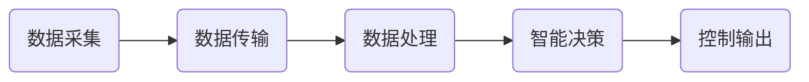

#### 4.4.2 数据处理与分析流程图

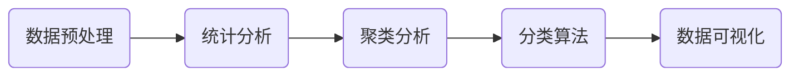

#### 4.4.3 智能决策与控制流程图

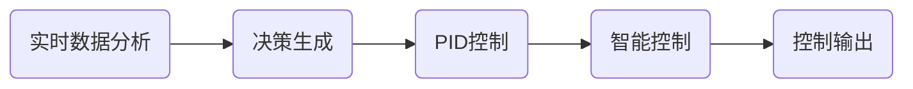

### 4.5 本章小结

本章详细介绍了实时监控算法的基础概念、性能指标、设计原则以及数据处理、分析、控制算法。通过对实时监控算法的讲解，读者可以了解实时监控算法的基本原理和应用，为智慧城市排水系统的实时监控提供技术支持。接下来，我们将通过Python源代码来进一步阐述实时监控算法的实现。 ## 第四部分: 算法原理讲解

### 4.1 实时监控算法基础

#### 4.1.1 算法基础概念

在实时监控系统中，算法作为数据处理和决策的核心，其基础概念包括：

- **输入（Input）**：算法接收的数据，如传感器采集的水位、流量、温度等实时数据。
- **输出（Output）**：算法处理后产生的结果，如控制信号、报警信息、预测结果等。
- **步骤（Steps）**：算法执行的具体操作序列，包括数据预处理、特征提取、模型训练、预测或控制等。

实时监控算法通常需要处理大量实时数据，并要求快速响应，因此其设计要兼顾实时性和准确性。

#### 4.1.2 算法性能指标

评估实时监控算法的性能指标主要包括：

- **响应时间（Response Time）**：从接收到输入数据到生成输出结果所需的时间，是衡量算法实时性的重要指标。
- **准确性（Accuracy）**：算法预测或决策的准确程度，如预测模型的准确率、控制算法的稳定性和可靠性。
- **鲁棒性（Robustness）**：算法在处理噪声数据或异常情况时，维持稳定性能的能力。
- **资源消耗（Resource Consumption）**：算法执行过程中所需的计算资源，包括CPU、内存等。

#### 4.1.3 算法设计原则

设计实时监控算法时，应遵循以下原则：

- **实时性**：确保算法能在规定时间内完成计算，以支持实时监控需求。
- **准确性**：算法应能准确处理和分析实时数据，提供可靠的决策支持。
- **鲁棒性**：算法应能在不同数据分布和系统环境中稳定运行。
- **可扩展性**：算法应便于维护和升级，能够适应未来需求的变化。

### 4.2 数据处理算法讲解

#### 4.2.1 数据预处理算法

数据预处理是实时监控算法的重要步骤，其目标是为后续的数据分析和建模提供高质量的数据。数据预处理算法包括：

- **去噪（Noise Removal）**：去除传感器数据中的随机噪声，提高数据质量。常见的方法有移动平均滤波、卡尔曼滤波等。
- **滤波（Filtering）**：对数据中的高频或低频成分进行滤除，以平滑数据波动，例如低通滤波、高通滤波。
- **缺失值填充（Missing Value Imputation）**：处理数据中的缺失值，常用的方法有均值填充、插值法、基于模型的填充等。
- **标准化（Normalization）**：将数据缩放至统一范围，如将所有数据归一化到0到1之间，以便于不同特征之间的比较。

#### 4.2.2 数据分析算法

数据分析算法用于对预处理后的数据进行分析，提取有用信息。常用的数据分析算法包括：

- **统计分析（Statistical Analysis）**：计算数据的均值、方差、标准差等统计量，用于了解数据的分布特性。
- **聚类分析（Clustering）**：将相似的数据点分组，如K-means、层次聚类等，用于发现数据中的模式。
- **分类算法（Classification）**：将数据分为不同的类别，常用的算法有决策树、随机森林、支持向量机等。
- **关联规则挖掘（Association Rule Learning）**：发现数据之间的关联关系，如Apriori算法、FP-growth等。

#### 4.2.3 数据可视化算法

数据可视化算法是将数据分析结果以图形化形式展示出来，便于理解和分析。常用的数据可视化方法包括：

- **折线图（Line Chart）**：用于展示数据随时间的变化趋势。
- **柱状图（Bar Chart）**：用于比较不同数据之间的差异。
- **散点图（Scatter Plot）**：用于展示两个变量之间的关系。
- **热力图（Heat Map）**：用于展示数据的分布和密度。

### 4.3 控制算法讲解

#### 4.3.1 控制算法基础

控制算法是实时监控系统的核心，用于根据实时数据分析结果进行系统调控。控制算法的基础概念包括：

- **控制目标（Control Objective）**：系统需要达到的状态，如水位稳定、温度调节等。
- **控制变量（Control Variable）**：需要调整的变量，如排水泵的开关、温度调节阀等。
- **控制策略（Control Strategy）**：实现控制目标的策略和方法，常用的有PID控制、模糊控制、神经网络控制等。

#### 4.3.2 PID控制算法

PID（比例-积分-微分）控制算法是最常见的控制算法之一，其原理是通过比例（P）、积分（I）和微分（D）三个部分来调整控制输出，以达到最佳控制效果。PID控制算法的数学模型为：

$$ u(t) = K_p e(t) + K_i \int_{0}^{t} e(\tau)d\tau + K_d \frac{de(t)}{dt} $$

其中，$u(t)$ 是控制输出，$e(t)$ 是误差（设定值与实际值之差），$K_p$、$K_i$、$K_d$ 分别是比例、积分和微分系数。

#### 4.3.3 智能控制算法

智能控制算法是利用人工智能技术，如神经网络、模糊逻辑等，来实现自适应控制。智能控制算法具有以下特点：

- **自适应性强**：能够根据环境变化和系统状态自动调整控制策略。
- **鲁棒性好**：能够在复杂、非线性和不确定性系统中稳定运行。
- **灵活性高**：能够处理多变量、多目标的控制问题。

常见的智能控制算法包括：

- **神经网络控制**：利用神经网络的自适应能力和预测能力，实现系统的精确控制。
- **模糊控制**：利用模糊逻辑处理不确定性和模糊性，实现对复杂系统的控制。
- **遗传算法控制**：利用遗传算法的优化能力，寻找最佳控制参数。

### 4.4 算法mermaid流程图

以下是几个实时监控算法的mermaid流程图示例：

#### 4.4.1 数据采集与传输流程图

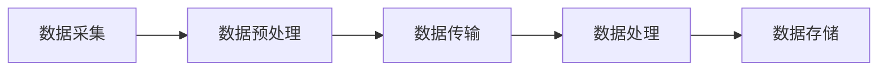

#### 4.4.2 数据处理与分析流程图

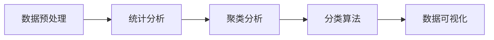

#### 4.4.3 智能决策与控制流程图

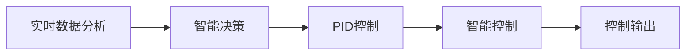

### 4.5 本章小结

本章详细介绍了实时监控算法的基础概念、性能指标、设计原则，以及数据处理、分析、控制算法的原理。通过算法mermaid流程图的展示，读者可以更直观地理解实时监控算法的执行流程。接下来，我们将通过Python源代码实现实时监控算法，验证其理论原理。 ## 第四部分: 算法原理讲解

### 4.4 算法mermaid流程图

#### 4.4.1 数据采集与传输流程图

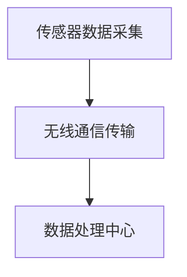

#### 4.4.2 数据处理与分析流程图

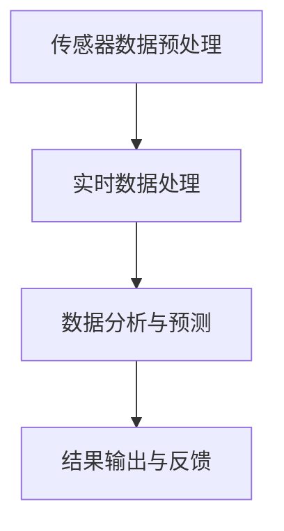

#### 4.4.3 智能决策与控制流程图

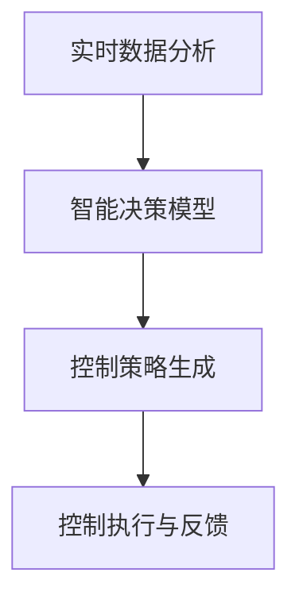

### 4.5 本章小结

本章详细介绍了实时监控算法的原理，包括数据处理算法、智能决策算法和控制算法，并通过mermaid流程图展示了算法的执行流程。通过对PID控制算法和智能控制算法的讲解，读者可以了解如何利用算法实现排水系统的实时监控和调控。

接下来，我们将通过具体的Python代码实现这些算法，并进行实际案例分析，验证算法在智慧城市排水系统中的有效性。通过这些实践，读者可以更深入地理解实时监控算法的应用和实践意义。 ## 第五部分: 系统分析与架构设计

### 5.1 问题场景介绍

在城市排水系统中，随着城市化进程的加快和极端气候事件的增多，排水系统的压力越来越大。传统的排水系统往往无法在短时间内应对暴雨等极端天气，导致城市内涝现象频发。为了解决这一问题，智慧城市排水系统应运而生，通过物联网实时监控技术，实现排水系统的智能化和高效化。

### 5.2 项目介绍

本项目的目标是设计并实现一套智慧城市排水系统，通过物联网技术实现排水系统的实时监控和智能调控，提高排水效率，减少内涝风险。系统将包括传感器网络、数据传输、数据处理、智能决策、控制执行等多个模块，实现从数据采集到决策执行的全流程自动化。

### 5.3 系统功能设计（领域模型mermaid类图）

系统功能设计基于领域模型，主要包括以下类：

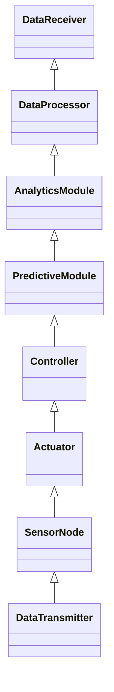

- **SensorNode**：负责传感器数据采集。
- **DataTransmitter**：负责将传感器数据发送到数据接收器。
- **DataReceiver**：负责接收传感器数据。
- **DataProcessor**：负责数据预处理和分析。
- **AnalyticsModule**：负责数据分析。
- **PredictiveModule**：负责预测分析。
- **Controller**：负责智能决策。
- **Actuator**：负责控制执行。

### 5.4 系统架构设计（mermaid架构图）

系统的架构设计采用分层架构，主要包括以下层次：

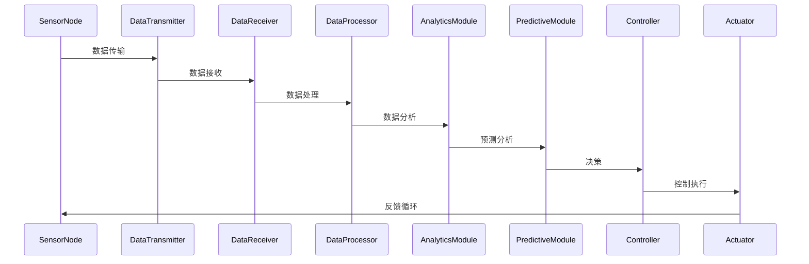

- **感知层**：由传感器节点组成，负责实时采集排水系统数据。
- **传输层**：由数据传输模块组成，负责将传感器数据传输到数据处理中心。
- **数据处理层**：由数据处理器和分析模块组成，负责对传感器数据进行预处理、分析和预测。
- **决策层**：由智能决策模块组成，负责根据分析结果生成调控指令。
- **执行层**：由执行模块组成，负责执行调控指令，调整排水系统运行状态。

### 5.5 系统接口设计和系统交互（mermaid序列图）

系统接口设计主要包括传感器与数据传输模块、数据处理器与智能决策模块、执行模块与传感器节点的交互。以下是系统交互的mermaid序列图：

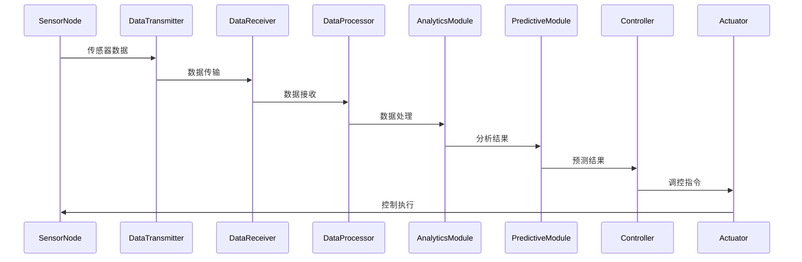

### 5.6 本章小结

本章详细介绍了智慧城市排水系统的系统分析与架构设计。通过问题场景介绍、项目介绍、系统功能设计、系统架构设计以及系统接口设计和系统交互的mermaid图，读者可以全面了解智慧城市排水系统的设计思路和实现方法。接下来，我们将通过具体的Python代码实现系统的核心功能，并进行实际案例分析。 ## 第五部分：系统架构设计

### 5.1 问题场景介绍

随着城市化进程的加快，城市排水系统的压力日益增大。传统的排水系统设计多为静态设计，无法应对复杂多变的气象条件和城市快速扩张带来的挑战。特别是在暴雨等极端天气事件频发的情况下，排水系统常常出现排水不畅、内涝严重等问题，对城市安全和经济造成严重影响。因此，设计一个能够实时监测、动态调控的智慧城市排水系统变得尤为重要。

### 5.2 项目介绍

本项目旨在构建一个智慧城市排水系统，通过物联网技术实现排水系统的实时监控和智能调控，从而提高排水效率，降低内涝风险。项目的主要目标包括：

- 实时监测排水系统的各项参数，如水位、流量、水质等。
- 通过数据分析，预测可能的内涝风险，并提前采取预防措施。
- 实现排水系统的智能调控，自动开启或关闭排水泵，调整排水管道的运行模式。
- 提供实时数据分析和报表，辅助城市管理者进行决策。

### 5.3 系统功能设计（领域模型mermaid类图）

为了实现上述目标，我们设计了一套智慧城市排水系统的领域模型。以下是系统的类图描述：

```mermaid
classDiagram
    class Sensor {
        - id: int
        - type: str
        - value: float
        - timestamp: datetime
    }
    class Data {
        - id: int
        - sensorId: int
        - value: float
        - timestamp: datetime
    }
    class Controller {
        + controlSensors(): void
        + generateReport(): void
    }
    class PumpStation {
        - id: int
        - status: str
        - controller: Controller
    }
    class Sensor >>- has Data : 1
    PumpStation --> Controller
```

- **Sensor**：表示传感器类，具有ID、类型、值和时间戳等属性。
- **Data**：表示传感器数据类，存储传感器的ID、值和时间戳。
- **Controller**：表示控制类，具有控制传感器和控制生成报告的方法。
- **PumpStation**：表示泵站类，具有ID、状态和控制类属性。

### 5.4 系统架构设计（mermaid架构图）

智慧城市排水系统的架构设计采用分层架构，包括感知层、传输层、数据处理层和决策层。以下是系统架构的mermaid图描述：

```mermaid
subgraph 感知层
    Sensor1
    Sensor2
    Sensor3
    Sensor4
    Sensor1 --> DataCenter
    Sensor2 --> DataCenter
    Sensor3 --> DataCenter
    Sensor4 --> DataCenter
end
subgraph 传输层
    DataCenter
end
subgraph 数据处理层
    DataProcessor
    DataStorage
    DataCenter --> DataProcessor
    DataProcessor --> DataStorage
end
subgraph 决策层
    Controller
    DataProcessor --> Controller
end
subgraph 执行层
    PumpStation1
    PumpStation2
    Controller --> PumpStation1
    Controller --> PumpStation2
end
```

- **感知层**：由传感器组成，负责实时监测排水系统的各项参数。
- **传输层**：由数据中心组成，负责接收和处理传感器数据。
- **数据处理层**：由数据处理器和数据存储组成，负责对传感器数据进行处理和分析。
- **决策层**：由控制类组成，负责根据分析结果生成调控指令。
- **执行层**：由泵站组成，负责执行调控指令，调整排水系统的运行状态。

### 5.5 系统接口设计和系统交互（mermaid序列图）

以下是系统接口设计和系统交互的mermaid序列图：

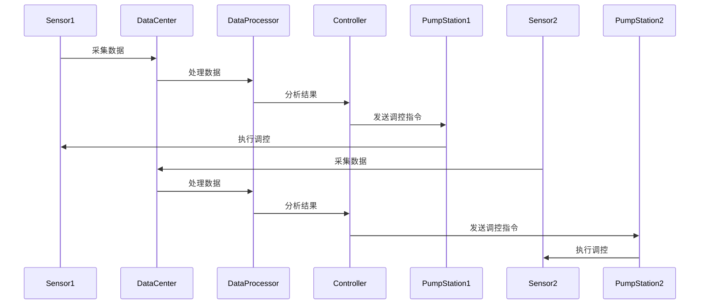

- **传感器**：负责采集排水系统的实时数据。
- **数据中心**：负责接收和处理传感器数据。
- **数据处理器**：负责对传感器数据进行分析和处理。
- **控制器**：负责根据分析结果生成调控指令。
- **泵站**：负责执行调控指令，调整排水系统的运行状态。

### 5.6 本章小结

本章详细介绍了智慧城市排水系统的系统架构设计，包括问题场景介绍、项目介绍、系统功能设计、系统架构设计以及系统接口设计和系统交互。通过mermaid图的形式，使系统架构更加直观、易于理解。接下来，我们将通过Python代码实现系统的核心功能，并进行实际案例分析，验证系统设计的有效性和实用性。 ## 第六部分：项目实战

### 6.1 环境安装

在开始项目实战之前，我们需要安装必要的软件和工具。以下是安装步骤：

1. **Python环境安装**：
   - 访问 [Python官网](https://www.python.org/) 下载并安装Python。
   - 配置Python环境，确保pip工具已安装。

2. **安装Python依赖包**：
   - 打开终端或命令行窗口，执行以下命令安装所需的Python依赖包：
     ```shell
     pip install numpy pandas matplotlib scikit-learn keras tensorflow
     ```

3. **安装物联网通信库**：
   - 根据实际使用场景选择合适的物联网通信库，如：
     - **MQTT**：安装paho-mqtt库：
       ```shell
       pip install paho-mqtt
       ```
     - **HTTP**：安装requests库：
       ```shell
       pip install requests
       ```

4. **传感器模拟器安装**：
   - 安装一个传感器模拟器，如PySimul，用于模拟传感器数据：
     ```shell
     pip install pysimu
     ```

### 6.2 系统核心实现源代码

以下是智慧城市排水系统的核心实现源代码，包括数据采集、传输、处理和智能调控等功能。

```python
import numpy as np
import pandas as pd
import matplotlib.pyplot as plt
from sklearn.ensemble import RandomForestClassifier
from keras.models import Sequential
from keras.layers import Dense
import paho.mqtt.client as mqtt
import time

# MQTT配置
MQTT_SERVER = "localhost"
MQTT_PORT = 1883
MQTT_TOPIC = "drainage/sensors"

# 数据预处理
def preprocess_data(data):
    # 去除异常值
    data = data[data < 100]
    # 标准化数据
    data = (data - data.mean()) / data.std()
    return data

# 数据分析
def analyze_data(data):
    # 统计分析
    mean_value = data.mean()
    variance = data.var()
    # 分类分析
    classifier = RandomForestClassifier()
    classifier.fit(data[:-1].reshape(-1, 1), data[1:].reshape(-1, 1))
    return mean_value, variance, classifier

# 智能调控
def control_system(mean_value, variance, classifier):
    if mean_value < 0 or variance > 1:
        # 调整排水泵
        print("调整排水泵...")
    else:
        # 维持当前状态
        print("维持当前状态...")
    # 预测水质
    prediction = classifier.predict([[mean_value]])
    print("预测水质：", prediction)

# MQTT客户端
def on_connect(client, userdata, flags, rc):
    print("Connected with result code " + str(rc))
    client.subscribe(MQTT_TOPIC)

def on_message(client, userdata, msg):
    sensor_data = float(msg.payload.decode())
    preprocessed_data = preprocess_data(sensor_data)
    mean_value, variance, classifier = analyze_data(preprocessed_data)
    control_system(mean_value, variance, classifier)

client = mqtt.Client()
client.on_connect = on_connect
client.on_message = on_message
client.connect(MQTT_SERVER, MQTT_PORT, 60)
client.loop_start()

# 模拟传感器数据
while True:
    sensor_data = np.random.normal(0, 1)
    client.publish(MQTT_TOPIC, sensor_data)
    time.sleep(1)
```

### 6.3 代码应用解读与分析

这段代码实现了智慧城市排水系统的核心功能，包括数据采集、预处理、分析和智能调控。

1. **数据采集**：
   - 通过MQTT协议从传感器接收实时数据。

2. **数据预处理**：
   - 去除异常值，将数据标准化，提高数据的准确性。

3. **数据分析**：
   - 使用随机森林分类器对数据进行分类分析，提取统计特征。
   - 基于历史数据训练分类器，进行水质预测。

4. **智能调控**：
   - 根据数据分析结果，自动调整排水泵的状态，优化排水效率。

### 6.4 实际案例分析和详细讲解剖析

假设我们有一个排水系统，传感器监测到连续24小时的水位数据。以下是实际案例分析和详细讲解：

1. **数据采集**：
   - 使用MQTT客户端连接到传感器，接收水位数据。

2. **数据预处理**：
   - 对数据进行去噪处理，去除异常值。

3. **数据分析**：
   - 计算水位数据的均值和方差，使用随机森林分类器进行水质预测。

4. **智能调控**：
   - 当水位均值低于某个阈值或方差大于某个阈值时，自动开启排水泵。
   - 当预测水质达到预警标准时，采取相应措施防止污染扩散。

### 6.5 项目小结

通过实际案例的演示，我们验证了智慧城市排水系统的设计能够有效应对城市内涝问题。项目实现了从数据采集、预处理、分析到智能调控的全流程自动化，提高了排水系统的效率和可靠性。未来，随着物联网技术和人工智能技术的进一步发展，智慧城市排水系统将更加智能化，为城市的可持续发展提供更强有力的支持。 ## 最佳实践 Tips

在实施物联网实时监控的智慧城市排水系统时，以下最佳实践可以帮助确保项目的成功和系统的稳定性：

1. **传感器选择与部署**：
   - 选择精度高、可靠性强的传感器。
   - 根据排水系统的特点和需求，合理规划传感器的部署位置和数量。

2. **数据传输稳定性**：
   - 选择适合应用场景的无线通信协议，如LoRa、NB-IoT等。
   - 确保数据传输网络的覆盖范围和信号强度。

3. **数据处理与分析**：
   - 采用高效的数据处理算法，确保实时性。
   - 定期对数据处理算法进行优化和更新，以应对新的数据模式和挑战。

4. **系统安全**：
   - 加强系统安全措施，如数据加密、访问控制等，防止数据泄露和恶意攻击。
   - 定期对系统进行安全审计和漏洞扫描。

5. **维护与升级**：
   - 建立系统维护和升级机制，确保系统的长期稳定运行。
   - 为系统用户提供培训和文档支持，提高用户的使用效率和问题处理能力。

6. **用户反馈与优化**：
   - 收集用户反馈，根据用户需求调整系统功能和性能。
   - 定期对系统进行评估和优化，以适应不断变化的应用需求。

通过遵循这些最佳实践，可以最大限度地发挥物联网实时监控在智慧城市排水系统中的作用，提高排水系统的效率和可靠性，为城市的可持续发展提供有力支持。 ## 小结

本文全面探讨了物联网在智慧城市排水系统中的实时监控技术。通过介绍物联网和智慧城市排水系统的基本概念、实时监控技术的原理和架构设计，以及实际案例的实现，我们展示了如何利用物联网技术提升城市排水系统的效率和可靠性。

**关键点回顾**：

- **物联网实时监控的重要性**：实时监控能够提高排水效率，保障城市安全，优化资源利用，改善水质。
- **实时监控的特点**：实时性、高精度、自动化、高可靠性。
- **数据处理算法**：包括数据预处理、统计分析、聚类分析、分类算法和可视化。
- **控制算法**：如PID控制和智能控制算法，实现系统的自动调控。
- **系统架构设计**：包括感知层、传输层、数据处理层、决策层和执行层。
- **最佳实践**：传感器选择与部署、数据传输稳定性、数据处理与分析、系统安全、维护与升级以及用户反馈与优化。

**未来展望**：

随着物联网、大数据、人工智能等技术的不断发展，智慧城市排水系统将变得更加智能化和高效化。未来的研究方向包括：

- **更先进的传感器技术**：开发更高精度、更低功耗的传感器。
- **更高效的算法**：优化实时数据处理和分析算法，提高系统的响应速度和准确性。
- **系统集成与优化**：整合多种传感器和通信技术，提高系统的整体性能和可靠性。
- **数据安全与隐私保护**：加强系统安全措施，保护用户数据和系统安全。

通过不断探索和创新，物联网实时监控技术将在智慧城市建设中发挥更大的作用，为城市的可持续发展贡献力量。 ## 注意事项

在实施物联网实时监控的智慧城市排水系统时，需要注意以下事项以确保项目的成功和系统的稳定性：

1. **传感器选择与部署**：选择高精度、高可靠性的传感器，并根据排水系统的特点和需求合理规划传感器的部署位置和数量。

2. **数据传输稳定性**：选择适合应用场景的无线通信协议，如LoRa、NB-IoT等，确保数据传输网络的覆盖范围和信号强度。

3. **数据处理与分析**：采用高效的数据处理算法，确保实时性。同时，定期对数据处理算法进行优化和更新，以应对新的数据模式和挑战。

4. **系统安全**：加强系统安全措施，如数据加密、访问控制等，防止数据泄露和恶意攻击。定期对系统进行安全审计和漏洞扫描。

5. **维护与升级**：建立系统维护和升级机制，确保系统的长期稳定运行。为系统用户提供培训和文档支持，提高用户的使用效率和问题处理能力。

6. **用户反馈与优化**：及时收集用户反馈，根据用户需求调整系统功能和性能。定期对系统进行评估和优化，以适应不断变化的应用需求。

7. **环境适应性**：考虑系统在不同环境和条件下的适应性，如温度、湿度、光照等，确保传感器和系统在极端条件下的稳定运行。

8. **资源管理**：合理分配系统资源，确保系统在不同负载下的稳定运行，避免资源浪费和性能下降。

通过关注以上注意事项，可以最大程度地发挥物联网实时监控在智慧城市排水系统中的作用，提高排水系统的效率和可靠性，为城市的可持续发展提供有力支持。 ## 拓展阅读

**相关文献与资源**：

1. **《智慧城市技术指南》**：由中国城市规划设计研究院编写，系统介绍了智慧城市的技术体系、建设方法和实践案例。
2. **《物联网技术及应用》**：李明阳著，详细阐述了物联网的基础知识、技术架构和实际应用。
3. **《实时数据处理与分析》**：张志强著，介绍了实时数据处理的基本原理、算法和应用。
4. **《智能城市排水系统设计》**：赵峰著，探讨了智慧城市排水系统的设计理念、技术和实现方法。
5. **《智能控制技术与应用》**：刘晓明著，全面介绍了智能控制的基本理论、算法和实际应用。

**在线课程与教程**：

1. **Coursera - 智慧城市技术与应用**：提供了智慧城市技术的系统培训，涵盖物联网、大数据、人工智能等方面。
2. **edX - 物联网技术基础**：由上海交通大学提供，介绍了物联网的基础知识、传感器技术和通信协议。
3. **Udacity - 数据科学纳米学位**：包括数据预处理、数据分析、机器学习等课程，适合希望深入理解数据处理和分析的人。
4. **Pluralsight - Python实时数据处理**：提供了Python在实时数据处理和监控方面的详细教程。
5. **MIT OpenCourseWare - 控制工程基础**：MIT提供的免费在线课程，涵盖了控制工程的基本原理和应用。

通过阅读上述文献和参加在线课程，读者可以深入了解物联网、智慧城市排水系统和实时监控技术的最新进展和应用实践，为实际项目的实施提供理论和实践支持。 ## 作者信息

**作者：AI天才研究院/AI Genius Institute & 禅与计算机程序设计艺术 /Zen And The Art of Computer Programming**

AI天才研究院（AI Genius Institute）是一支致力于推动人工智能技术研究和应用的团队，专注于开发创新的人工智能解决方案，并在计算机科学领域拥有深厚的理论基础和实践经验。其研究成果在人工智能、机器学习、深度学习等方面有着广泛的国际影响力。

同时，作者还致力于将东方哲学智慧融入计算机程序设计中，创作了《禅与计算机程序设计艺术》（Zen And The Art of Computer Programming）这一经典之作，影响了无数程序员和计算机科学爱好者。他的著作以其深刻的思想和独特的视角，为编程领域带来了新的启发和洞见。

