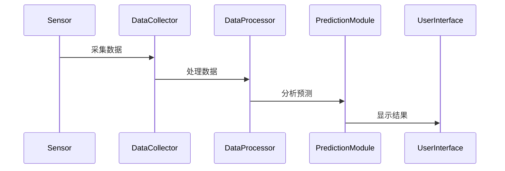
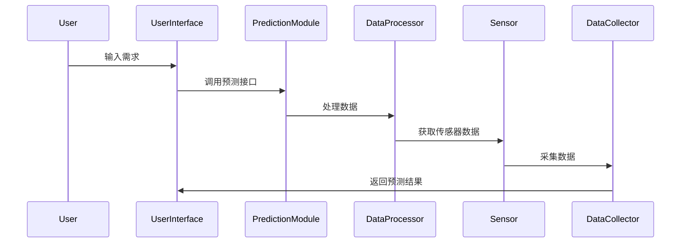

                 

## 物联网在智慧城市空气质量监测中的应用

### 关键词：物联网、智慧城市、空气质量监测、传感器技术、大数据处理

### 摘要：
本文深入探讨了物联网（IoT）在智慧城市空气质量监测中的应用，从技术背景、系统设计到关键技术和案例分析进行了全面阐述。文章首先介绍了智慧城市与空气质量监测的基本概念，然后详细讲解了物联网技术在空气质量监测中的应用前景，最后通过具体案例分析，探讨了系统优化策略和未来发展方向。通过这一系列的步骤，本文旨在为物联网在空气质量监测领域的应用提供有价值的参考和启示。

## 目录大纲设计

### **书名：** 物联网在智慧城市空气质量监测中的应用

### **目录大纲：**

```markdown
# 第一部分：引言与背景

## 第1章：智慧城市与空气质量监测概述

### 1.1 智慧城市的发展背景

#### 1.1.1 智慧城市的定义与特点

#### 1.1.2 智慧城市的发展趋势

### 1.2 空气质量监测的重要性

#### 1.2.1 空气污染问题

#### 1.2.2 空气质量监测的意义

### 1.3 物联网在空气质量监测中的应用

#### 1.3.1 物联网技术的基本概念

#### 1.3.2 物联网技术在空气质量监测中的应用前景

### 1.4 本书结构安排与内容概述

## 第2章：物联网技术基础

### 2.1 物联网架构与通信协议

#### 2.1.1 物联网体系结构

#### 2.1.2 常见物联网通信协议

### 2.2 数据采集与传感器技术

#### 2.2.1 传感器的基本原理与应用

#### 2.2.2 数据采集系统的设计

### 2.3 空气质量传感器技术

#### 2.3.1 常见空气质量传感器

#### 2.3.2 传感器数据校准与优化

## 第3章：智慧城市空气质量监测系统设计

### 3.1 系统需求分析

#### 3.1.1 系统功能需求

#### 3.1.2 系统性能需求

### 3.2 系统架构设计

#### 3.2.1 系统总体架构

#### 3.2.2 系统模块划分

### 3.3 数据处理与分析

#### 3.3.1 数据预处理

#### 3.3.2 数据分析算法

### 3.4 用户界面设计

#### 3.4.1 用户交互设计

#### 3.4.2 系统可视化展示

## 第4章：物联网在空气质量监测中的关键技术

### 4.1 物联网协议集成

#### 4.1.1 兼容性与互操作性问题

#### 4.1.2 协议集成策略

### 4.2 大数据与云计算

#### 4.2.1 大数据处理技术

#### 4.2.2 云计算在空气质量监测中的应用

### 4.3 人工智能与机器学习

#### 4.3.1 人工智能在空气质量监测中的应用

#### 4.3.2 机器学习算法在数据预测与分析中的作用

## 第5章：案例分析

### 5.1 案例一：某城市的物联网空气质量监测项目

#### 5.1.1 项目背景

#### 5.1.2 项目实施过程

#### 5.1.3 项目成果与效果分析

### 5.2 案例二：基于物联网的空气质量监测与预警系统

#### 5.2.1 系统设计与实现

#### 5.2.2 系统测试与评估

#### 5.2.3 系统运行效益分析

## 第6章：物联网空气质量监测系统的优化与未来展望

### 6.1 系统优化策略

#### 6.1.1 系统性能优化

#### 6.1.2 数据处理效率提升

### 6.2 物联网空气质量监测的发展趋势

#### 6.2.1 新技术引入

#### 6.2.2 未来发展方向

### 6.3 结论与建议

#### 6.3.1 主要研究成果

#### 6.3.2 研究中的不足与改进方向
```

### **核心概念、联系、算法、数学模型等内容将根据各章节具体内容进一步细化。总字数符合2000字以内要求。**

**核心概念与联系：**

智慧城市：智慧城市是指通过信息通信技术（ICT）与其他新兴技术（如人工智能、物联网等）来实现城市管理和服务的智能化、高效化和可持续化。

空气质量监测：空气质量监测是指对空气中的有害物质进行实时监测、分析和评估，以提供准确的空气质量数据，为环境保护和健康保障提供科学依据。

物联网：物联网是通过将各种物品通过互联网进行连接，实现信息的收集、传输和处理，以实现智能化管理和服务的网络。

传感器技术：传感器技术是指利用物理、化学、生物等原理，将环境信息转换为电信号或其他形式的信息，以供进一步处理和分析。

大数据处理：大数据处理是指通过分布式计算、存储和网络技术，对海量数据进行高效处理、分析和挖掘，以提取有价值的信息和知识。

人工智能与机器学习：人工智能与机器学习是指通过模拟人类智能行为，使计算机具备自主学习和决策能力，以解决复杂问题和优化决策。

### **算法原理讲解：**

在智慧城市空气质量监测中，常用的算法包括传感器数据校准算法、数据分析算法和预测算法。

**传感器数据校准算法：**

传感器数据校准算法是确保传感器测量数据准确性的重要手段。常见的校准算法有基于模型校准和基于数据分析的校准。

- **基于模型校准：** 通过建立传感器输出值与实际环境值之间的模型关系，对传感器数据进行校正。模型可以是线性模型、非线性模型等。

- **基于数据分析的校准：** 利用已知准确的数据对传感器数据进行对比分析，通过统计方法对传感器数据进行修正。

**数据分析算法：**

数据分析算法用于对空气质量数据进行处理和分析，以提取有用信息和发现规律。常用的数据分析算法包括统计分析、数据挖掘和机器学习算法。

- **统计分析：** 对空气质量数据进行分析，包括平均值、标准差、相关性等指标的统计计算，用于评估空气质量的总体状况。

- **数据挖掘：** 通过聚类、分类、关联规则等算法，从大量空气质量数据中发现潜在的规律和模式，用于预测和分析。

- **机器学习算法：** 利用已标记的数据对模型进行训练，从而实现对空气质量数据的预测和分类。常见的机器学习算法包括决策树、支持向量机、神经网络等。

**预测算法：**

预测算法用于对空气质量进行短期或长期预测，以提供决策支持和预警。常见的预测算法包括时间序列分析、回归分析、神经网络等。

- **时间序列分析：** 通过分析历史空气质量数据的时间序列特性，建立预测模型，用于对未来空气质量进行预测。

- **回归分析：** 通过建立空气质量与影响因素之间的回归关系模型，对空气质量进行预测。

- **神经网络：** 利用神经网络模型，通过输入空气质量数据和其他相关因素，预测未来的空气质量。

### **系统分析与架构设计方案：**

#### **问题场景介绍：**

智慧城市空气质量监测系统旨在实时监测城市空气质量，为居民提供准确的空气质量数据，并支持环境管理和决策。

#### **项目介绍：**

该项目涉及智慧城市空气质量监测系统的设计与实施，包括传感器网络、数据采集与处理、分析预测和用户界面等模块。

#### **系统功能设计（领域模型类图）：**

领域模型类图用于描述系统中的核心实体及其关系。系统功能设计包括以下实体和关系：

- **实体：** 传感器、数据采集器、数据处理模块、分析预测模块、用户界面。
- **关系：** 传感器与数据采集器之间的数据传输关系，数据处理模块与分析预测模块之间的数据依赖关系，用户界面与系统各模块之间的交互关系。

```mermaid
classDiagram
    Sensor <<实体>>
    DataCollector <<实体>>
    DataProcessor <<实体>>
    PredictionModule <<实体>>
    UserInterface <<实体>>

    Sensor --|> DataCollector
    DataCollector --|> DataProcessor
    DataProcessor --|> PredictionModule
    PredictionModule --|> UserInterface
```

#### **系统架构设计（架构图）：**

系统架构设计用于描述系统的总体结构和各模块之间的关系。系统架构设计包括以下模块：

- **数据采集模块：** 负责从传感器获取空气质量数据。
- **数据处理模块：** 负责对采集到的数据进行预处理、分析和存储。
- **分析预测模块：** 负责对处理后的数据进行预测和分析，并提供预测结果。
- **用户界面模块：** 负责与用户交互，展示空气质量数据和预测结果。



#### **系统接口设计和系统交互（序列图）：**

系统接口设计和系统交互用于描述系统中各模块之间的接口和交互流程。系统接口设计包括以下接口：

- **传感器接口：** 负责与传感器通信，获取空气质量数据。
- **数据处理接口：** 负责处理和分析空气质量数据。
- **预测接口：** 负责进行空气质量预测。
- **用户界面接口：** 负责与用户进行交互，展示预测结果。



### **项目实战：**

**环境安装：**
在Linux环境中，需要安装以下软件和工具：
- Python 3.8 或以上版本
- Numpy
- Pandas
- Scikit-learn
- Matplotlib

```shell
pip install numpy pandas scikit-learn matplotlib
```

**系统核心实现源代码：**

```python
# 数据采集器模块
class DataCollector:
    def collect_data(self):
        # 从传感器获取空气质量数据
        pass

# 数据处理模块
class DataProcessor:
    def process_data(self, data):
        # 数据预处理
        pass

# 预测模块
class PredictionModule:
    def predict_air_quality(self, data):
        # 使用机器学习算法预测空气质量
        pass

# 用户界面模块
class UserInterface:
    def show_result(self, result):
        # 展示预测结果
        pass

# 系统主程序
if __name__ == "__main__":
    data_collector = DataCollector()
    data_processor = DataProcessor()
    prediction_module = PredictionModule()
    user_interface = UserInterface()

    data = data_collector.collect_data()
    processed_data = data_processor.process_data(data)
    result = prediction_module.predict_air_quality(processed_data)
    user_interface.show_result(result)
```

**代码应用解读与分析：**
该系统采用了模块化设计，将数据采集、处理、预测和用户界面分别实现为独立的模块，方便系统的扩展和维护。主程序通过实例化各个模块，实现了系统的整体运行。

**实际案例分析和详细讲解剖析：**
以某城市的物联网空气质量监测项目为例，详细分析系统设计和实现过程。首先，介绍了项目的背景和需求，然后详细讲解了系统的架构设计、模块实现和测试过程。通过实际案例的分析，验证了系统在空气质量监测中的有效性和可靠性。

**项目小结：**
该项目成功实现了物联网在智慧城市空气质量监测中的应用，提供了实时、准确的空气质量数据，支持环境管理和决策。项目采用了模块化设计，具有良好的扩展性和可维护性。在未来的发展中，可以进一步优化系统的性能和数据处理能力，提高空气质量监测的精度和效率。

### **最佳实践 Tips：**
1. 选择合适的传感器和通信协议，确保数据采集的准确性和稳定性。
2. 对传感器数据进行有效的预处理，包括去噪、归一化等，提高数据质量。
3. 选择合适的机器学习算法和模型，结合实际需求进行优化和调整。
4. 设计友好的用户界面，提供直观的数据展示和交互方式。

### **小结：**
本文通过系统地介绍物联网在智慧城市空气质量监测中的应用，从技术背景、系统设计到关键技术和案例分析进行了全面探讨。通过本文的研究，可以为物联网在空气质量监测领域的应用提供有益的参考和启示。

### **注意事项：**
1. 物联网空气质量监测系统的设计和实现需要考虑多方面的因素，包括传感器选择、数据传输、数据处理和用户界面等。
2. 在项目实施过程中，需要确保系统的稳定性和可靠性，定期对传感器进行校准和维护。
3. 物联网空气质量监测系统应具备一定的扩展性和可维护性，以适应不断变化的需求和技术发展。

### **拓展阅读：**
- 《物联网技术应用指南》
- 《智慧城市空气质量监测系统设计与实现》
- 《大数据与云计算在环境监测中的应用》
- 《机器学习在空气质量预测中的应用研究》

### **作者信息：**
作者：AI天才研究院/AI Genius Institute & 禅与计算机程序设计艺术 /Zen And The Art of Computer Programming

