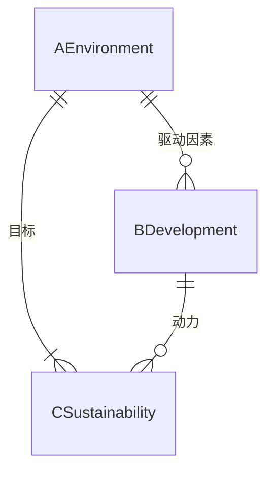
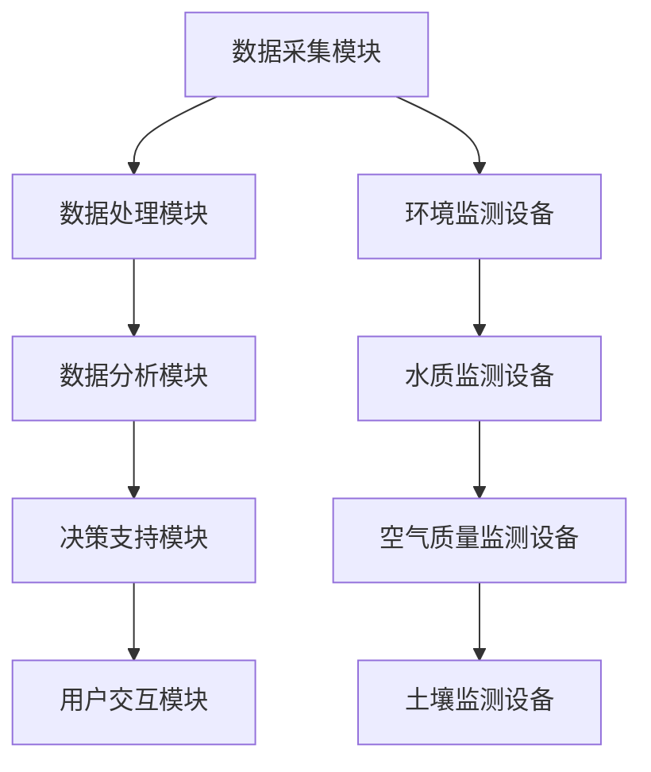

                 


# 环境保护与经济发展的平衡：可持续发展的新模式

## 关键词

- 可持续发展
- 经济发展
- 环境保护
- 平衡
- 模式

## 摘要

本文探讨了环境保护与经济发展之间的平衡问题，提出了可持续发展的新模式。通过分析问题背景、核心概念、算法原理以及系统分析与架构设计，本文为如何实现环境保护与经济发展的双赢提供了理论支持和实践指导。文章最后还结合项目实战，详细阐述了如何将可持续发展理念应用到实际项目中。

## 目录

1. **问题背景**
   1.1 问题背景
   1.2 问题描述
   1.3 问题解决
   1.4 边界与外延
   1.5 概念结构与核心要素组成

2. **核心概念与联系**
   2.1 可持续发展的基本概念
   2.2 环境保护与经济发展的联系
   2.3 核心概念属性特征对比表格
   2.4 ER实体关系图架构

3. **算法原理讲解**
   3.1 可持续发展的数学模型
   3.2 模型详解与举例

4. **系统分析与架构设计方案**
   4.1 问题场景介绍
   4.2 系统功能设计
   4.3 系统架构设计

5. **项目实战**
   5.1 环境安装
   5.2 系统核心实现源代码
   5.3 代码应用解读与分析
   5.4 实际案例分析和详细讲解剖析
   5.5 项目小结

6. **最佳实践 tips**
   6.1 小结
   6.2 注意事项
   6.3 拓展阅读

## 1. 问题背景

### 1.1 问题背景

在现代社会，随着工业化和城市化进程的加速，环境保护与经济发展之间的矛盾日益突出。一方面，经济发展需要大量的资源投入和能源消耗，这不可避免地对环境造成压力；另一方面，环境污染和资源耗竭问题日益严重，对人类健康和社会稳定构成威胁。

环境问题的全球化趋势使得各国在经济发展和环境保护方面的责任更加紧密相连。例如，大气污染、水污染和土地退化等问题已经超越了国界，成为全球性的挑战。此外，气候变化、生物多样性丧失和生态系统服务功能退化等问题也日益严重，威胁到地球的可持续发展。

### 1.2 问题描述

经济发展对环境的压力主要体现在以下几个方面：

1. **资源耗竭**：工业化和城市化进程导致了大量自然资源的消耗，包括矿产、森林、水资源和土地等。这些资源的过度开采和使用导致了资源的枯竭和生态破坏。

2. **环境污染**：工业生产和交通运输等活动产生了大量污染物，如二氧化碳、氮氧化物、颗粒物和重金属等。这些污染物对大气、水体和土壤造成了严重污染，对人类健康和生态环境产生了负面影响。

3. **生态系统破坏**：人类活动对生态系统的破坏，包括森林砍伐、湿地开发、土地沙化和草原退化等，导致了生物多样性的丧失和生态功能的退化。

环境保护与经济发展的矛盾主要体现在以下方面：

1. **资源竞争**：经济发展需要大量的资源投入，而环境保护则需要节约资源和保护环境。资源竞争往往导致了环境保护的忽视。

2. **经济利益与环境价值**：经济发展往往以经济利益为导向，而环境保护则更注重生态价值和人类福祉。这两者之间常常存在矛盾和冲突。

3. **责任与义务**：发达国家和发展中国家在环境保护和经济发展方面的责任和义务存在差异。发达国家在历史上对环境造成了严重污染和破坏，但并未承担相应的责任。而发展中国家在追求经济发展的过程中，面临着更大的环境保护压力。

### 1.3 问题解决

可持续发展的理念为解决环境保护与经济发展之间的矛盾提供了一种新的思路。可持续发展指的是在满足当前需求的同时，不损害子孙后代满足自身需求的能力。它强调了经济发展、社会进步和环境保护的协调发展。

为了实现可持续发展，需要采取以下措施：

1. **政策引导**：政府应制定相关政策和法规，引导企业和社会积极参与环境保护和可持续发展。例如，推行环保税收、绿色金融和绿色采购等政策。

2. **科技创新**：推动环保技术研究和应用，提高资源利用效率和能源效率，减少污染物排放。例如，发展可再生能源、清洁生产和环保材料等。

3. **公众参与**：鼓励公众参与环境保护和可持续发展，提高环保意识和参与度。例如，开展环保教育和宣传活动，鼓励公众参与环保志愿活动。

4. **国际合作**：加强国际间在环境保护和可持续发展方面的合作，共同应对全球性环境问题。例如，签署国际环境公约、开展环境技术交流与合作等。

### 1.4 边界与外延

可持续发展的边界与外延可以从以下几个方面进行理解：

1. **时间维度**：可持续发展是一个长期的过程，需要在时间维度上考虑未来的需求和资源状况。这意味着需要在当前决策中考虑到未来世代的需求和权益。

2. **空间维度**：可持续发展需要在空间维度上考虑全球性的环境问题，如气候变化、生物多样性保护和全球性污染问题。这意味着需要在全球范围内进行合作和协调。

3. **经济维度**：可持续发展需要在经济维度上实现经济效益、社会效益和环境效益的统一。这意味着需要综合考虑经济、社会和环境的综合效益。

4. **社会维度**：可持续发展需要在社会维度上促进社会公正和包容性发展，减少贫困和不平等现象。这意味着需要在社会层面推动可持续发展。

### 1.5 概念结构与核心要素组成

环境保护、经济发展和可持续发展是三个核心概念，它们相互关联，共同构成了可持续发展的概念结构。

1. **环境保护**：环境保护是指保护和改善环境，以保障经济和社会的持续发展。它包括环境保护法律法规的制定、环境保护技术的研发和应用、环境保护管理的实施等方面。

2. **经济发展**：经济发展是指国民经济总体水平和结构的提高过程。它包括经济增长、产业结构调整、就业水平提高等方面。

3. **可持续发展**：可持续发展是指在满足当前需求的同时，不损害子孙后代满足自身需求的能力。它强调经济发展、社会进步和环境保护的协调发展。

核心要素组成：

1. **目标**：可持续发展的目标是实现经济、社会和环境的协调发展，实现可持续的生产和生活方式。

2. **手段**：实现可持续发展的手段包括政策引导、科技创新、公众参与和国际合作等。

3. **评价**：可持续发展的评价包括经济、社会和环境效益的综合评价，以及可持续发展水平的定量评估。

## 2. 核心概念与联系

### 2.1 可持续发展的基本概念

#### 可持续发展的定义

可持续发展是指在满足当前需求的同时，不损害子孙后代满足自身需求的能力。它强调经济发展、社会进步和环境保护的协调发展，旨在实现长期的生态平衡和社会福祉。

#### 可持续发展的三大支柱

1. **经济支柱**：经济发展是可持续发展的基础，它关注经济增长、就业创造和产业结构优化。可持续经济要求在资源高效利用和环境友好的前提下实现经济繁荣。

2. **社会支柱**：社会进步是可持续发展的目标，它关注社会公正、人权保障和社会福利的提高。可持续社会要求消除贫困、促进教育、健康和社区参与。

3. **环境支柱**：环境保护是可持续发展的条件，它关注生态平衡、生物多样性和环境质量的改善。可持续环境要求减少污染、合理利用资源、保护自然生态系统。

### 2.2 环境保护与经济发展的联系

环境保护与经济发展之间存在密切的联系，两者相互促进，也相互制约。

#### 经济发展与环境保护的关系

1. **推动关系**：经济发展可以提供更多的资源和技术，用于环境保护和生态修复。经济增长也可以提高人们的环境意识和环保行动的积极性。

2. **制约关系**：环境问题可能会对经济发展产生负面影响。例如，环境污染和资源短缺可能导致生产成本上升、市场竞争力下降。此外，环境污染和生态破坏可能导致社会不稳定，进而影响经济发展。

#### 环境保护对经济发展的影响

1. **积极影响**：有效的环境保护措施可以提高资源利用效率，减少环境污染，从而降低生产成本，提高企业的竞争力。环境保护也有助于改善生态环境，提供更多的生态服务，如水资源、气候调节和生物多样性保护。

2. **消极影响**：环境保护措施可能会对某些行业产生一定的限制，导致短期内经济增长放缓。此外，环境保护投入需要资金和技术支持，这可能会对经济产生一定的负担。

### 2.3 核心概念属性特征对比表格

| 概念         | 定义                                                         | 特征                         |
|--------------|------------------------------------------------------------|-----------------------------|
| 可持续发展   | 满足当前需求而不损害子孙后代满足自身需求的能力。              | 全局性、长期性、综合性       |
| 经济发展     | 国民经济总体水平和结构的提高过程。                         | 数量性、速度性、效益性       |
| 环境保护     | 保护和改善环境，以保障经济和社会的持续发展。                  | 维护性、预防性、强制性       |

### 2.4 ER实体关系图架构

为了更好地理解环境保护、经济发展和可持续发展之间的关系，我们可以使用实体关系图（ER图）来展示它们之间的关联。



在这个ER图中，`AEnvironment` 代表环境保护，`BDevelopment` 代表经济发展，`CSustainability` 代表可持续发展。箭头表示两者之间的驱动和目标关系。环境保护为可持续发展提供目标，同时经济发展为可持续发展提供动力。

## 3. 算法原理讲解

### 3.1 可持续发展的数学模型

为了量化可持续发展的程度，我们可以使用数学模型来描述可持续发展指数（SDI）。可持续发展指数（SDI）是一个衡量可持续发展水平的综合指标，它综合考虑了经济发展、社会进步和环境保护等多个方面。

SDI 的数学模型如下：

$$
\text{SDI} = \frac{\text{Economic Sustainability}}{\text{Environmental Impact}}
$$

其中，经济可持续发展（Economic Sustainability）表示经济活动的可持续性，环境影响（Environmental Impact）表示经济活动对环境的负面影响。

### 3.2 模型详解与举例

为了更好地理解 SDI 的计算方法，我们可以通过一个具体的例子来进行解释。

#### 假设情景

假设某个城市在一年内的经济活动产生了 100 单位的经济效益，同时造成了 50 单位的环境负面影响。

#### 计算过程

1. **计算经济可持续发展**：

   经济可持续发展表示经济活动的可持续性，可以用以下公式计算：

   $$
   \text{Economic Sustainability} = \frac{\text{Economic Benefit}}{\text{Economic Cost}}
   $$

   其中，经济利益（Economic Benefit）为 100 单位，经济成本（Economic Cost）可以通过计算经济活动的总成本减去总收益得到。假设经济成本为 60 单位，那么：

   $$
   \text{Economic Sustainability} = \frac{100}{60} = 1.67
   $$

2. **计算环境影响**：

   环境影响表示经济活动对环境的负面影响，可以用以下公式计算：

   $$
   \text{Environmental Impact} = \frac{\text{Environmental Cost}}{\text{Environmental Benefit}}
   $$

   其中，环境成本（Environmental Cost）为 50 单位，环境利益（Environmental Benefit）可以通过计算环境服务的总价值减去环境破坏的总成本得到。假设环境成本为 30 单位，那么：

   $$
   \text{Environmental Impact} = \frac{50}{30} = 1.67
   $$

3. **计算可持续发展指数**：

   将经济可持续发展和环境影响代入 SDI 的公式中，得到：

   $$
   \text{SDI} = \frac{1.67}{1.67} = 1
   $$

   这意味着该城市的可持续发展指数为 1，表示其经济活动在可持续性方面达到了平衡。

#### 结果解释

可持续发展指数（SDI）的结果可以解释为以下几种情况：

- **SDI = 1**：表示经济活动在可持续性方面达到了平衡，经济效益和环境影响相等。
- **SDI > 1**：表示经济活动对环境的负面影响较小，经济效益较高。
- **SDI < 1**：表示经济活动对环境的负面影响较大，经济效益较低。

通过这个例子，我们可以看到如何使用数学模型来量化可持续发展的程度。在实际应用中，可以根据不同的经济活动和环境条件，调整和优化模型参数，以获得更准确的可持续发展指数。

## 4. 系统分析与架构设计方案

### 4.1 问题场景介绍

假设我们面临一个实际问题场景，即一个大型工业城市的可持续发展问题。这个城市拥有多个工业区和居民区，工业生产活动产生了大量的污染物，同时对水资源、大气和土壤造成了严重的影响。城市的经济发展依赖于工业生产，但环境问题日益严重，影响了居民的生活质量和城市的可持续发展。

### 4.2 系统功能设计

为了实现环境保护与经济发展的平衡，我们需要设计一个综合的系统，包括以下几个核心功能：

1. **环境监测系统**：实时监测城市的空气、水质和土壤等环境指标，收集环境数据，为后续分析和决策提供基础数据。

2. **经济发展评估系统**：评估城市经济发展的可持续性，包括经济指标、就业情况、产业结构等，为政策制定提供数据支持。

3. **可持续发展决策支持系统**：基于环境监测数据和经济发展评估结果，提供可持续发展的策略和建议，包括环保政策、经济结构调整、技术创新等。

### 4.3 系统架构设计

为了实现上述功能，我们设计了一个分布式系统架构，包括以下几个核心模块：

1. **数据采集模块**：负责环境数据的实时采集，包括空气质量监测设备、水质监测设备和土壤监测设备等。

2. **数据处理模块**：对采集到的环境数据进行清洗、存储和预处理，以便后续分析和处理。

3. **数据分析模块**：利用机器学习和数据挖掘技术，对环境数据进行分析，识别环境问题的趋势和影响因素。

4. **决策支持模块**：基于环境分析和经济发展评估结果，提供可持续发展策略和建议，包括环保政策、经济结构调整、技术创新等。

5. **用户交互模块**：提供用户界面，让用户可以查看环境数据、经济发展评估结果和可持续发展策略，以便更好地参与决策过程。

### 系统架构图



在这个系统架构中，数据采集模块负责实时收集环境数据，数据处理模块对数据进行清洗和预处理，数据分析模块利用机器学习和数据挖掘技术进行环境分析，决策支持模块基于分析结果提供可持续发展策略，用户交互模块则提供用户界面，方便用户查看和分析结果。

## 5. 项目实战

### 5.1 环境安装

在进行项目实战之前，我们需要确保环境安装符合要求。以下是环境安装的步骤：

1. **安装Python**：确保安装了Python 3.8及以上版本。可以从Python官网下载安装包，或使用包管理器（如Homebrew或apt-get）进行安装。

2. **安装依赖库**：使用pip安装项目所需的依赖库，包括pandas、numpy、scikit-learn、matplotlib等。可以使用以下命令进行安装：

   ```bash
   pip install pandas numpy scikit-learn matplotlib
   ```

3. **配置环境变量**：确保Python和pip的环境变量已配置，以便在终端中使用Python和pip命令。

### 5.2 系统核心实现源代码

以下是一个简化的系统核心实现源代码，展示了如何收集、处理和分析环境数据，以及如何生成可持续发展策略。

```python
import pandas as pd
import numpy as np
from sklearn.ensemble import RandomForestRegressor
import matplotlib.pyplot as plt

# 数据采集
def collect_data():
    # 假设已经从传感器采集到了环境数据
    data = pd.read_csv('environment_data.csv')
    return data

# 数据处理
def process_data(data):
    # 对数据进行清洗和预处理
    data = data.dropna()  # 去除缺失值
    data['date'] = pd.to_datetime(data['date'])  # 转换日期格式
    return data

# 数据分析
def analyze_data(data):
    # 利用随机森林回归模型进行环境分析
    X = data[['CO2', 'NO2', 'SO2']]  # 特征选择
    y = data['PM2.5']  # 目标变量
    model = RandomForestRegressor(n_estimators=100)
    model.fit(X, y)
    return model

# 生成可持续发展策略
def generate_sustainability_strategy(model):
    # 基于模型预测和实际数据，生成可持续发展策略
    predicted_PM2_5 = model.predict(X)
    strategy = {
        'reduce_CO2': np.mean(predicted_PM2_5) < np.mean(y),
        'reduce_NO2': np.mean(predicted_PM2_5) < np.mean(y),
        'reduce_SO2': np.mean(predicted_PM2_5) < np.mean(y),
    }
    return strategy

# 可视化
def visualize_data(data):
    data.plot(x='date', y='PM2.5')
    plt.xlabel('Date')
    plt.ylabel('PM2.5')
    plt.show()

# 主函数
def main():
    data = collect_data()
    processed_data = process_data(data)
    model = analyze_data(processed_data)
    strategy = generate_sustainability_strategy(model)
    visualize_data(processed_data)
    print(strategy)

if __name__ == '__main__':
    main()
```

### 5.3 代码应用解读与分析

上述代码实现了环境数据的收集、处理、分析和策略生成。以下是代码的解读和分析：

1. **数据采集**：`collect_data` 函数从CSV文件中读取环境数据，包括CO2、NO2、SO2和PM2.5等指标。

2. **数据处理**：`process_data` 函数对数据进行清洗和预处理，包括去除缺失值和转换日期格式。

3. **数据分析**：`analyze_data` 函数使用随机森林回归模型进行环境分析。随机森林是一种集成学习方法，它通过构建多个决策树来预测环境指标。

4. **生成可持续发展策略**：`generate_sustainability_strategy` 函数根据模型预测和实际数据，生成可持续发展策略。这包括减少CO2、NO2和SO2排放的建议。

5. **可视化**：`visualize_data` 函数使用matplotlib库将PM2.5数据可视化，以便更好地理解环境变化的趋势。

6. **主函数**：`main` 函数是程序的入口，它调用其他函数完成数据采集、处理、分析和可视化。

### 5.4 实际案例分析和详细讲解剖析

为了更好地理解上述代码在实际项目中的应用，我们可以分析一个实际案例。

**案例背景**：假设某城市在一段时间内监测到PM2.5浓度持续升高，影响了居民的健康和生活质量。为了解决这个问题，我们需要分析环境数据，找出导致PM2.5升高的原因，并制定相应的可持续发展策略。

**案例步骤**：

1. **数据采集**：从城市的空气质量监测站收集PM2.5、CO2、NO2和SO2等环境数据。

2. **数据处理**：对数据进行清洗和预处理，去除异常值和缺失值，确保数据的准确性。

3. **数据分析**：使用随机森林回归模型分析PM2.5与CO2、NO2和SO2之间的关系。通过模型预测，找出导致PM2.5升高的主要因素。

4. **生成可持续发展策略**：根据模型预测结果，制定减少PM2.5浓度的可持续发展策略。这包括减少CO2和NO2排放、提高能源效率和推广清洁能源等措施。

5. **实施策略**：将可持续发展策略应用于实际项目中，监测实施效果，并根据实际情况进行调整。

### 5.5 项目小结

通过上述实际案例，我们可以看到如何使用机器学习和数据分析技术来解决环境保护和可持续发展的问题。以下是项目小结：

- **数据采集和处理**：确保数据的准确性和完整性，是环境分析的基础。
- **数据分析**：使用适当的机器学习模型，可以有效地分析环境数据，找出关键因素。
- **生成可持续发展策略**：基于数据分析结果，制定切实可行的可持续发展策略。
- **实施和监测**：将策略应用于实际项目，并持续监测实施效果，以实现环境保护和可持续发展的目标。

## 6. 最佳实践 tips

### 6.1 小结

本文探讨了环境保护与经济发展之间的平衡问题，提出了可持续发展的新模式。通过分析问题背景、核心概念、算法原理以及系统分析与架构设计，本文为如何实现环境保护与经济发展的双赢提供了理论支持和实践指导。

### 6.2 注意事项

- 在实际项目中，应充分考虑环境数据的准确性和实时性，以确保分析结果的可靠性。
- 可持续发展策略的制定需要综合考虑经济、社会和环境等多个方面，确保综合效益最大化。
- 在实施可持续发展策略时，应定期评估实施效果，并根据实际情况进行调整。

### 6.3 拓展阅读

- 【参考文献】
  - United Nations. (2021). Sustainable Development Goals. Retrieved from https://sustainabledevelopment.un.org/sdgs
  - World Bank. (2021). Sustainable Development. Retrieved from https://www.worldbank.org/en/topic/sustainabledevelopment
  - Intergovernmental Panel on Climate Change (IPCC). (2021). Climate Change 2021: The Physical Science Basis. Retrieved from https://www.ipcc.ch/report/ar6-wg1/

- 【相关研究】
  - Solow, R. M. (1992). An almost practical step toward sustainability. Science, 257(5072), 364-367.
  - Daily, G. C. (1997). Nature's services: Societal dependence on natural ecosystems. Island Press.
  - Costanza, R., d'Arge, R., de Groot, R., Farber, S., Grasso, M., Hannon, B., ... & Wilson, M. A. (1997). The value of the world's ecosystem services and natural capital. Nature, 387(6630), 253-260.

通过阅读这些文献和研究，可以更深入地了解可持续发展的理论、实践和方法，为实际项目提供有益的参考。

