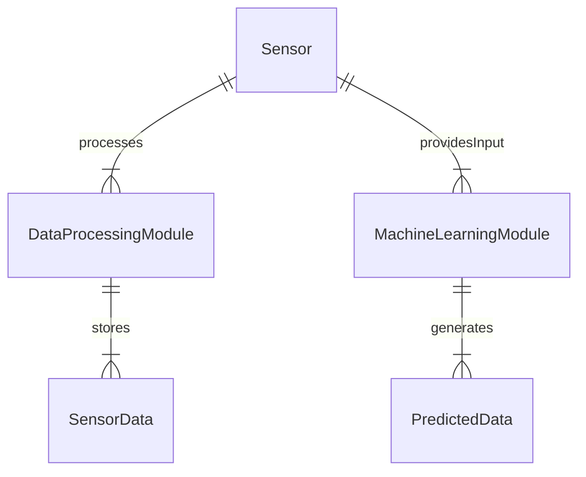

                 

# 环境隐形智能在智能家居中的集成

> 关键词：环境隐形智能、智能家居、传感器技术、数据处理、机器学习算法、系统集成

> 摘要：本文将探讨环境隐形智能在智能家居中的应用，分析其核心技术、应用场景和系统集成方法。通过对传感器技术、数据处理和机器学习算法的详细介绍，本文旨在帮助读者理解环境隐形智能在智能家居中的重要性，并展望其未来发展。

### 目录大纲设计思路

为了使文章逻辑清晰、结构紧凑且简单易懂，本文采用以下目录大纲设计思路：

1. **引言部分**：介绍环境隐形智能的概念、智能家居的发展背景和重要性。
2. **核心技术介绍**：详细阐述传感器技术、数据处理和机器学习算法在环境隐形智能中的应用。
3. **应用场景分析**：分析环境隐形智能在智能家居中的具体应用，如环境监测和智能调节。
4. **系统集成与实现**：介绍环境隐形智能在智能家居系统中的集成方式，包括硬件接口、软件算法等。
5. **未来展望**：探讨环境隐形智能在智能家居中的发展前景和潜在挑战。

### 目录大纲

## 第一部分：引言

### 1.1 环境隐形智能概述

- **问题背景**
- **问题描述**
- **问题解决**
- **边界与外延**
- **概念结构与核心要素组成**

### 1.2 智能家居的发展背景与重要性

- **智能家居的定义**
- **智能家居的发展历程**
- **智能家居的重要性**

## 第二部分：核心技术介绍

### 2.1 传感器技术

- **传感器的基本原理**
- **传感器的分类**
- **常见传感器的应用**

### 2.2 数据处理

- **数据采集方法**
- **数据预处理技术**
- **数据存储与管理**

### 2.3 机器学习算法

- **机器学习的基本原理**
- **常见机器学习算法介绍**
- **机器学习算法在家居环境中的应用**

## 第三部分：应用场景分析

### 3.1 环境监测

- **室内空气质量监测**
- **温度和湿度调节**
- **噪音监测与控制**

### 3.2 智能调节

- **照明调节**
- **家电控制**
- **安防系统**

## 第四部分：系统集成与实现

### 4.1 系统集成概述

- **系统集成的重要性**
- **系统集成的方法**

### 4.2 硬件接口设计

- **传感器接口设计**
- **控制模块接口设计**

### 4.3 软件算法实现

- **数据处理算法**
- **机器学习算法实现**

## 第五部分：未来展望

### 5.1 环境隐形智能在智能家居中的发展前景

- **技术发展趋势**
- **市场前景**
- **潜在挑战**

### 5.2 拓展阅读

- **相关领域研究**
- **未来研究方向**

### 第一部分：引言

#### 1.1 环境隐形智能概述

**问题背景**

随着科技的发展，智能家居已成为现代家庭生活的重要组成部分。然而，传统的智能家居系统往往依赖于可见的控制器和设备，如智能手机、遥控器等，这在一定程度上影响了家居的隐形美观。因此，环境隐形智能的概念应运而生，旨在通过传感器技术和数据处理算法，实现家居环境的智能监测和调节，而无需暴露任何可见设备。

**问题描述**

环境隐形智能旨在解决以下问题：

1. **家居美观性**：减少或消除传统智能家居系统中的可见控制器和设备，实现家居环境的隐形美观。
2. **环境感知**：通过传感器技术，实时监测家居环境中的各种参数，如温度、湿度、噪音、空气质量等。
3. **智能调节**：根据环境参数的监测结果，自动调节家居设备，如空调、灯光、窗帘等，以提高家居舒适度和节能效果。

**问题解决**

环境隐形智能通过以下方法解决上述问题：

1. **传感器技术**：采用各种传感器，如温度传感器、湿度传感器、空气质量传感器等，实时监测家居环境参数。
2. **数据处理算法**：通过数据处理算法，对传感器数据进行预处理、分析和存储，为后续的智能调节提供依据。
3. **机器学习算法**：利用机器学习算法，根据历史数据和实时监测数据，进行环境预测和调节。

**边界与外延**

环境隐形智能的边界主要在于其技术实现和应用场景。具体来说：

1. **技术边界**：环境隐形智能依赖于传感器技术、数据处理算法和机器学习算法，这些技术的不断发展将拓宽其应用范围。
2. **应用边界**：环境隐形智能主要应用于智能家居领域，但也可拓展至智能办公室、智能酒店等其他场景。

**概念结构与核心要素组成**

环境隐形智能的概念结构主要由以下要素组成：

1. **传感器网络**：包括各种传感器，如温度传感器、湿度传感器、空气质量传感器等，用于实时监测家居环境参数。
2. **数据处理中心**：对传感器数据进行采集、预处理、分析和存储，为智能调节提供数据支持。
3. **智能调节系统**：根据数据处理结果，自动调节家居设备，如空调、灯光、窗帘等，以提高家居舒适度和节能效果。
4. **用户交互界面**：提供用户与智能家居系统之间的交互，如智能手机应用、语音控制等。

#### 1.2 智能家居的发展背景与重要性

**智能家居的定义**

智能家居（Smart Home）是指利用物联网（IoT）技术，将家庭中的各种设备通过网络连接起来，实现自动化、智能化管理和控制。智能家居系统通常包括安防、照明、家电控制、环境监测等多个方面，为用户提供便利、舒适和节能的家居生活体验。

**智能家居的发展历程**

智能家居的发展可以追溯到20世纪80年代，当时家庭自动化（Home Automation）概念开始兴起。随着计算机技术、网络技术和传感器技术的不断发展，智能家居逐渐从概念走向实际应用。

1. **早期阶段**：20世纪80年代至90年代，智能家居主要依靠独立的控制器和设备，实现简单的家电控制功能，如远程控制灯光和家电等。
2. **网络化阶段**：21世纪初，随着互联网的普及，智能家居开始实现网络化，各种设备通过网络连接，实现远程监控和控制。
3. **智能化阶段**：近年来，人工智能技术的快速发展，使智能家居系统具备了智能分析和决策能力，能够根据用户习惯和环境变化，自动调节家居设备。

**智能家居的重要性**

智能家居的重要性体现在以下几个方面：

1. **提升生活质量**：通过智能家居系统，用户可以随时随地控制家居设备，提高生活便利性和舒适度。
2. **节能减排**：智能家居系统能够根据环境参数和用户需求，自动调节设备，实现节能降耗。
3. **安全防护**：智能家居系统具备安防功能，如入侵报警、火灾报警等，提高家庭安全水平。
4. **健康监测**：智能家居系统可以通过传感器监测室内空气质量、温度、湿度等环境参数，为用户健康提供保障。

### 第二部分：核心技术介绍

#### 2.1 传感器技术

**传感器的基本原理**

传感器是一种能够感受特定被测量并转换成可用输出信号的装置。传感器的基本原理包括以下几个方面：

1. **能量转换**：传感器将外界信号（如光、声、温度等）转换为电信号。
2. **信号放大**：通过放大电路，将传感器产生的微弱电信号进行放大，以便后续处理。
3. **信号滤波**：对传感器信号进行滤波处理，去除噪声和干扰信号。
4. **信号处理**：对传感器信号进行数字化处理，如采样、量化等，以获得准确的测量结果。

**传感器的分类**

根据传感器的工作原理和功能，可以将传感器分为以下几类：

1. **物理传感器**：利用物理效应进行测量，如温度传感器、压力传感器、湿度传感器等。
2. **化学传感器**：利用化学物质与外界信号发生反应进行测量，如气体传感器、液体传感器等。
3. **生物传感器**：利用生物活性物质与外界信号发生反应进行测量，如酶传感器、微生物传感器等。
4. **光传感器**：利用光学效应进行测量，如光敏电阻、光电二极管、激光传感器等。
5. **声传感器**：利用声波效应进行测量，如声波传感器、超声波传感器等。

**常见传感器的应用**

在智能家居中，常见传感器包括：

1. **温度传感器**：用于监测室内温度，实现空调、取暖设备的自动调节。
2. **湿度传感器**：用于监测室内湿度，实现加湿器、除湿器的自动调节。
3. **空气质量传感器**：用于监测室内空气质量，实现空气净化器的自动调节。
4. **光敏传感器**：用于监测室内光线强度，实现照明设备的自动调节。
5. **声音传感器**：用于监测室内噪音水平，实现噪音抑制设备的自动调节。

**ER实体关系图架构**

以下是环境隐形智能系统中部分传感器的ER实体关系图：

#### 2.2 数据处理

**数据采集方法**

数据采集是智能家居系统中的重要环节，其方法主要包括：

1. **有线数据采集**：通过有线连接（如以太网、USB等）将传感器数据传输到数据处理中心。
2. **无线数据采集**：通过无线连接（如Wi-Fi、蓝牙等）将传感器数据传输到数据处理中心。

**数据预处理技术**

数据预处理是数据处理的重要环节，其技术包括：

1. **数据清洗**：去除噪声、缺失值和异常值，保证数据质量。
2. **数据变换**：对数据进行标准化、归一化等处理，以适应后续分析和处理。
3. **数据融合**：将多个传感器数据进行整合，提高数据的准确性和可靠性。

**数据存储与管理**

数据存储与管理是智能家居系统的基础，其技术包括：

1. **数据库技术**：使用数据库（如MySQL、MongoDB等）存储和管理传感器数据。
2. **数据挖掘技术**：利用数据挖掘技术，从大量传感器数据中提取有用信息和知识。

#### 2.3 机器学习算法

**机器学习的基本原理**

机器学习（Machine Learning）是一种通过算法和统计模型，使计算机能够从数据中学习、改进并作出决策的技术。机器学习的基本原理包括：

1. **数据输入**：将数据输入到机器学习模型中。
2. **模型训练**：通过训练数据，调整模型参数，使模型能够对数据进行分析和预测。
3. **模型评估**：使用测试数据，评估模型性能和准确性。
4. **模型优化**：根据评估结果，对模型进行优化和调整。

**常见机器学习算法介绍**

常见的机器学习算法包括：

1. **线性回归**：用于预测连续值变量。
2. **逻辑回归**：用于预测离散值变量，如分类问题。
3. **决策树**：用于分类和回归问题。
4. **随机森林**：基于决策树构建的集成学习方法。
5. **支持向量机**：用于分类问题。
6. **神经网络**：用于复杂的分类和回归问题。

**机器学习算法在家居环境中的应用**

在智能家居中，机器学习算法可以应用于以下方面：

1. **环境预测**：根据历史数据和实时监测数据，预测未来的环境变化，如温度、湿度、空气质量等。
2. **设备调节**：根据预测结果，自动调节家居设备，如空调、灯光、窗帘等，以提高家居舒适度和节能效果。
3. **故障检测**：通过监测设备运行数据，识别设备故障，实现设备维护和预警。

### 第三部分：应用场景分析

#### 3.1 环境监测

**室内空气质量监测**

室内空气质量（Indoor Air Quality, IAQ）是影响人们健康的重要因素。通过空气质量传感器，可以实时监测室内空气中的有害物质，如甲醛、苯、TVOC等。根据监测结果，智能家居系统可以自动启动空气净化器，改善室内空气质量。

**温度和湿度调节**

温度和湿度是影响家居舒适度的重要因素。通过温度传感器和湿度传感器，智能家居系统可以实时监测室内温度和湿度。当环境参数偏离舒适范围时，系统可以自动启动空调、加湿器或除湿器，调节室内环境。

**噪音监测与控制**

噪音污染会影响人们的睡眠质量和身心健康。通过声音传感器，智能家居系统可以实时监测室内噪音水平。当噪音超过设定阈值时，系统可以自动启动噪音抑制设备，如加湿器、空气净化器等，降低噪音污染。

#### 3.2 智能调节

**照明调节**

照明是家居环境中的重要组成部分。通过光敏传感器，智能家居系统可以实时监测室内光线强度。根据光线强度，系统可以自动调节照明设备的亮度，实现节能和舒适。

**家电控制**

智能家居系统可以通过无线连接，远程控制各种家电设备，如空调、热水器、洗衣机等。用户可以通过智能手机、语音助手等设备，随时随地控制家电设备，提高生活便利性。

**安防系统**

智能家居系统可以集成安防设备，如摄像头、门磁传感器、烟雾传感器等。当系统检测到异常情况时，可以自动报警，通知用户和相关部门，提高家庭安全水平。

### 第四部分：系统集成与实现

#### 4.1 系统集成概述

系统集成是将不同硬件、软件和设备集成到一个统一的系统中，实现智能化管理和控制。在环境隐形智能系统中，系统集成主要包括以下几个方面：

1. **硬件集成**：将各种传感器、控制器、家电设备等硬件连接到系统，实现数据的实时采集和传输。
2. **软件集成**：将数据处理算法、机器学习模型、控制策略等软件模块集成到系统中，实现环境监测、预测和调节功能。
3. **通信集成**：使用Wi-Fi、蓝牙、ZigBee等通信技术，实现传感器、控制器和用户设备之间的数据传输和交互。

#### 4.2 硬件接口设计

**传感器接口设计**

传感器接口设计主要包括以下几个方面：

1. **传感器选择**：根据环境监测需求，选择合适的传感器，如温度传感器、湿度传感器、空气质量传感器等。
2. **接口类型**：确定传感器接口类型，如I2C、SPI、UART等。
3. **接口电路设计**：设计传感器接口电路，包括电源电路、信号放大电路、滤波电路等。

**控制模块接口设计**

控制模块接口设计主要包括以下几个方面：

1. **控制模块选择**：根据系统需求，选择合适的控制模块，如单片机、PLC等。
2. **接口类型**：确定控制模块接口类型，如I2C、SPI、UART等。
3. **接口电路设计**：设计控制模块接口电路，包括电源电路、信号放大电路、滤波电路等。

#### 4.3 软件算法实现

**数据处理算法实现**

数据处理算法主要包括以下几个方面：

1. **数据采集**：通过传感器接口，实时采集环境数据。
2. **数据预处理**：对采集到的数据进行分析、清洗和变换，为后续处理做准备。
3. **数据存储**：将预处理后的数据存储到数据库中，以便后续分析和查询。

**机器学习算法实现**

机器学习算法实现主要包括以下几个方面：

1. **数据预处理**：对采集到的数据进行分析、清洗和变换，为模型训练做准备。
2. **模型训练**：使用训练数据，训练机器学习模型，调整模型参数。
3. **模型评估**：使用测试数据，评估模型性能和准确性。
4. **模型部署**：将训练好的模型部署到系统中，实现环境预测和调节功能。

### 第五部分：未来展望

#### 5.1 环境隐形智能在智能家居中的发展前景

随着人工智能技术的不断发展和智能家居市场的扩大，环境隐形智能在智能家居中的应用前景十分广阔。未来，环境隐形智能将可能在以下几个方面取得突破：

1. **技术升级**：传感器技术、数据处理算法和机器学习算法将不断优化和升级，提高环境感知和调节能力。
2. **系统集成**：智能家居系统的集成度将不断提高，实现更加智能、高效和便捷的家居生活。
3. **市场拓展**：随着智能家居市场的不断扩大，环境隐形智能将在更多家庭中普及应用。

#### 5.2 拓展阅读

1. **相关领域研究**：
   - 物联网技术在家居环境中的应用
   - 人工智能在智能家居中的发展趋势
   - 智能家居系统的安全与隐私保护

2. **未来研究方向**：
   - 环境隐形智能在智能办公室、智能酒店等领域的应用
   - 多传感器融合技术在环境感知中的应用
   - 智能家居系统的个性化定制与优化

### 总结

环境隐形智能在智能家居中的应用具有广泛的前景和潜力。通过传感器技术、数据处理和机器学习算法的集成，环境隐形智能可以实现家居环境的智能监测和调节，提高家居舒适度和节能效果。未来，随着技术的不断进步和市场的发展，环境隐形智能将在智能家居领域发挥越来越重要的作用。

### 作者信息

- 作者：AI天才研究院/AI Genius Institute & 禅与计算机程序设计艺术 /Zen And The Art of Computer Programming

