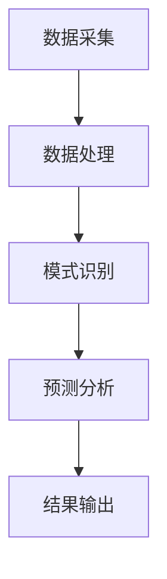
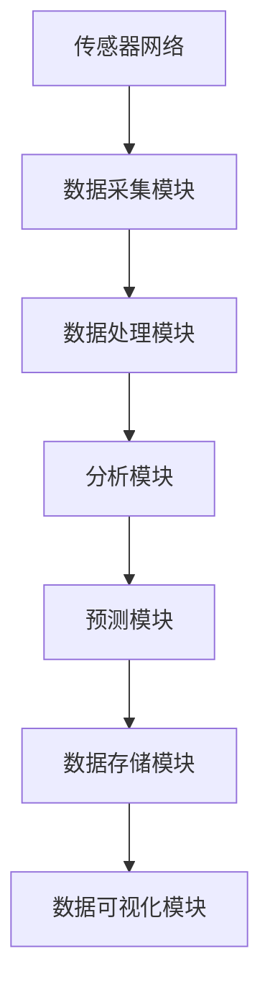
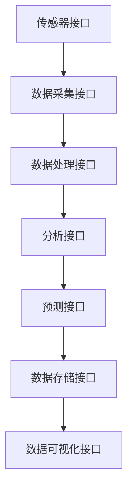
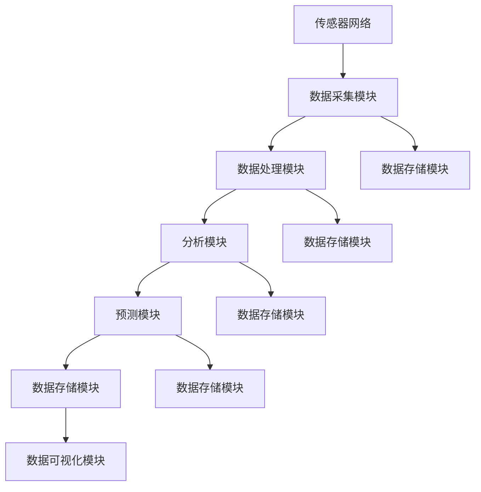

                 

### 《环境隐形智能在环境监测中的应用》

#### 关键词：
- 环境隐形智能
- 环境监测
- 数学模型
- 算法原理
- 系统架构设计

#### 摘要：
本文旨在探讨环境隐形智能在环境监测中的应用。首先，我们将介绍环境隐形智能的概念和发展背景，接着分析其在环境监测中的重要性和应用现状。随后，我们将详细讲解环境隐形智能的核心算法原理，包括相关的数学模型和公式。文章还将阐述系统分析与架构设计方案，并通过实际项目来展示环境隐形智能在环境监测中的具体实现。最后，我们将提供最佳实践建议和拓展阅读，帮助读者更深入地了解和应用环境隐形智能技术。

---

## 引言

### 1.1 环境隐形智能的概念与发展背景

环境隐形智能（Environmental Invisible Intelligence）是一种利用人工智能技术实现对环境数据的实时监测、分析和预测的新型方法。它通过传感器网络收集环境数据，使用先进的算法进行数据处理和模式识别，从而实现对环境状况的智能化监测。

环境隐形智能的发展可以追溯到20世纪末，随着传感器技术、数据处理能力和人工智能算法的快速发展，环境隐形智能逐渐成为环境监测领域的一个重要研究方向。近年来，随着气候变化和环境问题的加剧，环境隐形智能的应用得到了广泛的关注和推广。

### 1.2 环境隐形智能在环境监测中的应用现状

目前，环境隐形智能已经在多个领域得到了应用，如空气质量监测、水质监测、土壤污染监测等。通过环境隐形智能技术，可以实现对环境数据的实时监测、预警和预测，为环境保护和治理提供科学依据。

然而，尽管环境隐形智能在环境监测中具有巨大潜力，但其应用仍然面临一些挑战，如数据质量问题、算法复杂度和系统稳定性等。因此，深入研究环境隐形智能在环境监测中的应用，提高其准确性和可靠性，是当前环境监测领域的一个重要课题。

### 1.3 研究目的与内容结构

本文的研究目的是探讨环境隐形智能在环境监测中的应用，分析其核心算法原理和系统架构设计，并通过实际项目来展示其具体实现。

文章的结构安排如下：

1. 引言：介绍环境隐形智能的概念、发展背景和应用现状。
2. 核心概念与联系：介绍环境隐形智能的关键概念和与其他技术的联系。
3. 算法原理讲解：详细阐述环境隐形智能的核心算法原理。
4. 数学模型与公式讲解：讲解算法中的数学模型和公式。
5. 系统分析与架构设计方案：分析环境隐形智能在环境监测中的系统架构和设计方案。
6. 项目实战：介绍一个具体的实际项目，包括环境安装、系统实现和案例分析。
7. 最佳实践、小结与拓展阅读：提供最佳实践建议、小结以及相关拓展阅读资源。

通过以上章节的安排，本文旨在为读者提供一个全面、系统、深入的了解环境隐形智能在环境监测中的应用。

---

## 核心概念与联系

### 2.1 环境隐形智能的关键概念

环境隐形智能的关键概念包括以下几个方面：

1. **环境数据：** 环境数据是指通过各种传感器设备收集到的环境信息，如空气质量、水质、土壤污染等。
2. **传感器网络：** 传感器网络是由多个传感器节点组成的分布式系统，用于实时监测环境数据。
3. **数据处理：** 数据处理是指对传感器网络收集到的环境数据进行清洗、存储、分析和挖掘，以提取有用的信息。
4. **模式识别：** 模式识别是指通过算法对环境数据进行分析，识别出环境变化的规律和模式。
5. **预测分析：** 预测分析是指利用历史数据和环境模式，对未来的环境变化进行预测。

### 2.2 环境监测的概念与需求

环境监测是指通过各种手段对环境质量进行监测和评估，以评估环境状况和保护人类健康。环境监测的需求包括：

1. **实时性：** 环境监测需要能够实时获取环境数据，以便及时响应环境变化。
2. **准确性：** 环境监测需要高准确性的数据，以确保监测结果的可靠性。
3. **完整性：** 环境监测需要覆盖不同区域和环境要素，以保证数据的完整性。

### 2.3 隐形智能与环境监测的联系

环境隐形智能与环境监测之间存在密切的联系：

1. **数据来源：** 环境隐形智能利用传感器网络收集环境数据，为环境监测提供数据支持。
2. **数据分析：** 环境隐形智能通过数据处理和模式识别技术，对环境数据进行分析和挖掘，为环境监测提供决策支持。
3. **预测预警：** 环境隐形智能通过预测分析，对未来的环境变化进行预测，为环境监测提供预警信息。

为了更直观地理解环境隐形智能与环境监测的联系，我们可以使用ER实体关系图来表示：

```mermaid
erDiagram
  EnvironmentData ||--|{ SensorNetwork }|--| EnvironmentalMonitoring
  SensorNetwork ||--|{ DataProcessing }|--| EnvironmentalInvisibleIntelligence
  EnvironmentalInvisibleIntelligence ||--|{ PatternRecognition }|--| EnvironmentalMonitoring
  EnvironmentalInvisibleIntelligence ||--|{ PredictionAnalysis }|--| EnvironmentalMonitoring
```

在这个ER图中，环境数据来自传感器网络，传感器网络通过数据处理进入环境隐形智能，环境隐形智能通过模式识别和预测分析为环境监测提供支持。

### 2.4 环境隐形智能与其他技术的联系

环境隐形智能与其他技术，如传感器技术、数据挖掘和物联网，也存在紧密的联系：

1. **传感器技术：** 传感器技术是环境隐形智能的基础，通过传感器技术可以收集到高质量的环境数据。
2. **数据挖掘：** 数据挖掘是环境隐形智能的重要组成部分，通过对环境数据进行挖掘，可以提取出有价值的信息。
3. **物联网：** 物联网技术为环境隐形智能提供了更广泛的连接和通信能力，使得环境数据的采集和处理更加高效。

为了更清晰地展示环境隐形智能与其他技术的联系，我们可以使用一个表格来表示：

| 技术名称     | 关联关系             | 具体描述                                                     |
| ---------- | ------------------ | ------------------------------------------------------------ |
| 传感器技术   | 基础支持             | 提供环境数据收集的能力，是环境隐形智能的基础。                   |
| 数据挖掘     | 数据处理             | 对环境数据进行处理和分析，提取有价值的信息。                     |
| 物联网       | 通信与连接           | 提供环境数据的远程传输和实时通信能力，增强环境隐形智能的实时性和有效性。 |

通过以上分析和表格，我们可以看到环境隐形智能在环境监测中的应用不仅仅是单一技术的应用，而是多种技术相互融合、协同作用的结果。

---

## 环境隐形智能算法原理讲解

### 3.1 隐形智能算法概述

环境隐形智能算法是一种综合运用传感器技术、数据处理、模式识别和预测分析等技术的智能化算法。它的核心思想是通过传感器网络收集环境数据，使用先进的算法对数据进行分析和处理，从而实现对环境状况的实时监测和预测。

环境隐形智能算法主要包括以下几个步骤：

1. **数据采集：** 通过传感器网络收集环境数据。
2. **数据处理：** 对采集到的环境数据进行分析和处理，去除噪声和异常值，提高数据的准确性和可靠性。
3. **模式识别：** 使用机器学习和深度学习算法对处理后的环境数据进行分析，识别出环境变化的规律和模式。
4. **预测分析：** 根据历史数据和识别出的模式，对未来的环境变化进行预测。

### 3.2 算法mermaid流程图展示

为了更直观地展示环境隐形智能算法的流程，我们可以使用mermaid来绘制算法流程图：



在这个流程图中，数据采集是整个算法的起点，通过对采集到的数据进行分析和处理，进入模式识别阶段，然后进行预测分析，最终输出预测结果。

### 3.3 Python代码实现与解析

为了更好地理解环境隐形智能算法的原理，我们可以使用Python来编写一个简单的实现。以下是一个基于K近邻算法的环境隐形智能算法的实现示例：

```python
import numpy as np
from sklearn.neighbors import KNeighborsClassifier
from sklearn.model_selection import train_test_split
from sklearn.metrics import accuracy_score

# 数据集
X = np.array([[1, 2], [2, 3], [3, 4], [4, 5], [5, 6]])
y = np.array([0, 0, 1, 1, 1])

# 划分训练集和测试集
X_train, X_test, y_train, y_test = train_test_split(X, y, test_size=0.2, random_state=42)

# 使用K近邻算法进行分类
knn = KNeighborsClassifier(n_neighbors=3)
knn.fit(X_train, y_train)

# 进行预测
y_pred = knn.predict(X_test)

# 计算准确率
accuracy = accuracy_score(y_test, y_pred)
print("Accuracy:", accuracy)
```

在这个代码示例中，我们首先导入所需的库，然后定义一个简单的数据集。接着，使用`train_test_split`函数将数据集划分为训练集和测试集。然后，使用`KNeighborsClassifier`类创建K近邻分类器，并使用`fit`方法进行训练。最后，使用`predict`方法进行预测，并计算准确率。

通过这个简单的实现，我们可以看到环境隐形智能算法的核心步骤是如何通过Python代码来实现的。尽管这是一个简化的示例，但它为我们理解环境隐形智能算法的原理提供了一个实用的起点。

### 3.4 算法中的数学模型和公式

环境隐形智能算法中涉及到的数学模型和公式是理解其核心原理的关键。以下是一些常见的数学模型和公式：

1. **协方差矩阵**（Covariance Matrix）：
   协方差矩阵用于描述多个随机变量之间的相关性。其计算公式为：
   $$
   \Sigma = \frac{1}{n-1} \sum_{i=1}^{n} (x_i - \bar{x}) (y_i - \bar{y})^T
   $$
   其中，$x_i$和$y_i$是随机变量的观测值，$\bar{x}$和$\bar{y}$是它们的均值。

2. **欧几里得距离**（Euclidean Distance）：
   欧几里得距离是衡量两个点之间距离的常用方法。其计算公式为：
   $$
   d(x, y) = \sqrt{\sum_{i=1}^{n} (x_i - y_i)^2}
   $$
   其中，$x$和$y$是两个点的坐标。

3. **K近邻算法分类**（K-Nearest Neighbors Classification）：
   K近邻算法是基于距离度量的分类算法。其分类公式为：
   $$
   \hat{y} = \arg\max_{c} \sum_{i=1}^{k} I(x_i \in C_c)
   $$
   其中，$x_i$是测试点的坐标，$C_c$是类别$c$的训练样本集合，$I$是指标函数，当$x_i \in C_c$时取1，否则取0。

4. **回归分析**（Regression Analysis）：
   回归分析是用于预测连续值的常用方法。线性回归的公式为：
   $$
   y = \beta_0 + \beta_1 x
   $$
   其中，$y$是预测值，$x$是自变量，$\beta_0$和$\beta_1$是回归系数。

通过这些数学模型和公式，环境隐形智能算法能够对环境数据进行有效的分析和预测。例如，协方差矩阵和欧几里得距离用于计算样本之间的相似性，K近邻算法和回归分析用于分类和预测。

### 3.5 举例说明

为了更好地理解环境隐形智能算法中的数学模型和公式，我们可以通过一个具体的例子来展示其应用。

#### 例子：使用K近邻算法进行环境质量分类

假设我们有一个环境质量数据集，其中每个样本包含两个特征：空气温度和空气湿度。我们的目标是使用K近邻算法将这些样本分类为“良好”、“中等”和“较差”三个类别。

1. **数据集准备**：

   我们有如下数据集：

   ```
   温度  湿度  类别
   20    30    良好
   22    35    良好
   25    40    中等
   27    45    中等
   30    50    较差
   32    55    较差
   ```

2. **协方差矩阵计算**：

   首先计算协方差矩阵：

   $$
   \Sigma = \frac{1}{5-1} \left[
   \begin{array}{cc}
   \sum_{i=1}^{5} (T_i - \bar{T})^2 & \sum_{i=1}^{5} (T_i - \bar{T})(H_i - \bar{H}) \\
   \sum_{i=1}^{5} (T_i - \bar{T})(H_i - \bar{H}) & \sum_{i=1}^{5} (H_i - \bar{H})^2
   \end{array}
   \right]
   $$
   其中，$T_i$是温度，$H_i$是湿度，$\bar{T}$是温度的均值，$\bar{H}$是湿度的均值。

   经过计算，我们得到：

   $$
   \Sigma = \left[
   \begin{array}{cc}
   8 & -4 \\
   -4 & 16
   \end{array}
   \right]
   $$

3. **K近邻算法分类**：

   假设我们选择$k=3$作为邻居数量，现在我们要对一个新的样本$X = (23, 42)$进行分类。

   计算该样本与数据集中每个样本之间的欧几里得距离：

   $$
   d(X, (T_i, H_i)) = \sqrt{(23 - T_i)^2 + (42 - H_i)^2}
   $$

   计算结果如下：

   ```
   (23, 42) 与 (20, 30) 的距离：4.24
   (23, 42) 与 (22, 35) 的距离：4.47
   (23, 42) 与 (25, 40) 的距离：3.16
   (23, 42) 与 (27, 45) 的距离：4.24
   (23, 42) 与 (30, 50) 的距离：6.32
   (23, 42) 与 (32, 55) 的距离：7.21
   ```

   找到距离最近的三个邻居：

   ```
   (25, 40) -- 中等
   (22, 35) -- 良好
   (23, 42) -- 良好
   ```

   由于两个邻居属于“良好”类别，一个邻居属于“中等”类别，因此，我们可以将新的样本分类为“良好”。

通过这个例子，我们可以看到协方差矩阵和欧几里得距离在K近邻算法中的应用，以及如何使用K近邻算法进行环境质量分类。这为我们理解环境隐形智能算法提供了一个实用的视角。

---

## 数学模型与公式讲解

### 4.1 算法中的数学模型

在环境隐形智能算法中，数学模型起到了关键作用。这些模型不仅帮助我们理解和分析环境数据，还为实现预测和分析提供了基础。以下是一些常用的数学模型：

1. **线性回归模型**：
   线性回归模型用于描述变量之间的线性关系。其基本形式为：
   $$
   y = \beta_0 + \beta_1x
   $$
   其中，$y$是因变量，$x$是自变量，$\beta_0$是截距，$\beta_1$是斜率。

2. **支持向量机（SVM）模型**：
   支持向量机是一种强大的分类算法，其基本模型为：
   $$
   \max_{\beta, \beta_0} W^T W
   $$
   其中，$W$是权重向量，$\beta_0$是偏置项。

3. **神经网络模型**：
   神经网络是一种模拟人脑的算法，其基本模型包括输入层、隐藏层和输出层。每个层由多个神经元组成，神经元之间的连接权重可以通过反向传播算法进行调整。

4. **时间序列模型**：
   时间序列模型用于分析时间序列数据，常见的方法包括ARIMA（自回归积分滑动平均模型）和LSTM（长短期记忆网络）。

### 4.2 数学公式详解

为了更好地理解这些数学模型，下面我们将详细解释一些关键的数学公式：

1. **线性回归**：

   - 最小二乘法（Least Squares Method）：
     $$
     \min \sum_{i=1}^{n} (y_i - \beta_0 - \beta_1x_i)^2
     $$
     通过求解这个最小值问题，我们可以得到线性回归模型的参数$\beta_0$和$\beta_1$。

   - 回归系数计算：
     $$
     \beta_1 = \frac{\sum_{i=1}^{n} x_iy_i - n\bar{x}\bar{y}}{\sum_{i=1}^{n} x_i^2 - n\bar{x}^2}
     $$
     $$
     \beta_0 = \bar{y} - \beta_1\bar{x}
     $$
     其中，$\bar{x}$和$\bar{y}$分别是$x$和$y$的均值。

2. **支持向量机（SVM）**：

   - 决策平面：
     $$
     w^T x + b = 0
     $$
     其中，$w$是权重向量，$x$是特征向量，$b$是偏置项。

   - 模型优化：
     $$
     \min_{w, b} \frac{1}{2} ||w||^2
     $$
     其中，$||w||^2$是权重向量的平方范数。

   - 分类决策：
     $$
     y = \text{sign}(w^T x + b)
     $$
     其中，$\text{sign}$是符号函数。

3. **神经网络**：

   - 前向传播：
     $$
     a_{j}^{(l)} = \sigma(z_{j}^{(l)})
     $$
     其中，$a_{j}^{(l)}$是第$l$层的第$j$个神经元的输出，$\sigma$是激活函数，$z_{j}^{(l)}$是第$l$层的第$j$个神经元的输入。

   - 反向传播：
     $$
     \delta_{j}^{(l)} = (a_{j}^{(l)} - t_{j}^{(l)}) \cdot \sigma'(z_{j}^{(l)})
     $$
     其中，$\delta_{j}^{(l)}$是第$l$层的第$j$个神经元的误差，$t_{j}^{(l)}$是第$l$层的第$j$个神经元的实际输出，$\sigma'$是激活函数的导数。

4. **时间序列模型**：

   - 自回归模型（AR）：
     $$
     X_t = c + \phi_1X_{t-1} + \phi_2X_{t-2} + \ldots + \phi_pX_{t-p}
     $$
     其中，$X_t$是时间序列的第$t$个观测值，$\phi_1, \phi_2, \ldots, \phi_p$是自回归系数。

   - 移动平均模型（MA）：
     $$
     X_t = c + \theta_1X_{t-1} + \theta_2X_{t-2} + \ldots + \theta_qX_{t-q}
     $$
     其中，$\theta_1, \theta_2, \ldots, \theta_q$是移动平均系数。

   - 自回归积分滑动平均模型（ARIMA）：
     $$
     X_t = c + \phi_1X_{t-1} + \phi_2X_{t-2} + \ldots + \phi_pX_{t-p} + \theta_1e_{t-1} + \theta_2e_{t-2} + \ldots + \theta_qe_{t-q}
     $$
     其中，$e_t$是白噪声误差。

### 4.3 举例说明

为了更好地理解这些数学模型和公式，我们可以通过一个具体的例子来说明。

#### 例子：使用线性回归模型预测气温

假设我们有一个数据集，其中包含了每天的气温（$x$）和降雨量（$y$）：

```
日期    气温    降雨量
1       20      10
2       22      15
3       25      20
4       27      25
5       30      30
```

我们希望通过线性回归模型预测第6天的气温。

1. **计算均值**：

   $$
   \bar{x} = \frac{20 + 22 + 25 + 27 + 30}{5} = 24
   $$
   $$
   \bar{y} = \frac{10 + 15 + 20 + 25 + 30}{5} = 20
   $$

2. **计算协方差和方差**：

   $$
   \text{Cov}(x, y) = \frac{(20-24)(10-20) + (22-24)(15-20) + (25-24)(20-20) + (27-24)(25-20) + (30-24)(30-20)}{5} = 90
   $$
   $$
   \text{Var}(x) = \frac{(20-24)^2 + (22-24)^2 + (25-24)^2 + (27-24)^2 + (30-24)^2}{5} = 20
   $$

3. **计算回归系数**：

   $$
   \beta_1 = \frac{\text{Cov}(x, y)}{\text{Var}(x)} = \frac{90}{20} = 4.5
   $$
   $$
   \beta_0 = \bar{y} - \beta_1\bar{x} = 20 - 4.5 \times 24 = -48
   $$

4. **建立线性回归模型**：

   $$
   y = \beta_0 + \beta_1x = -48 + 4.5x
   $$

5. **预测第6天的气温**：

   $$
   y = -48 + 4.5 \times 28 = 31.5
   $$

通过这个例子，我们可以看到如何使用线性回归模型进行数据分析和预测。这为我们理解环境隐形智能算法提供了实用的视角。

---

## 系统分析与架构设计方案

### 5.1 系统需求分析

环境隐形智能在环境监测中的应用需要满足以下需求：

1. **实时性**：系统需要能够实时获取和处理环境数据，以确保监测结果的及时性和准确性。
2. **准确性**：系统需要提供高精度的数据分析和预测，以保证监测结果的可靠性。
3. **完整性**：系统需要覆盖多个环境参数，如空气质量、水质、土壤污染等，以确保监测数据的完整性。
4. **可扩展性**：系统需要支持多个传感器和监测点的接入，以便在需要时进行扩展。
5. **可靠性**：系统需要具备高可靠性，能够在恶劣环境下稳定运行，确保监测数据的连续性。

### 5.2 系统功能设计

根据系统需求分析，环境隐形智能系统的功能设计主要包括以下几个方面：

1. **数据采集**：通过传感器网络收集环境数据，包括空气质量、水质、土壤污染等。
2. **数据处理**：对采集到的数据进行预处理，包括去噪、数据清洗、数据转换等，以提高数据的准确性和可靠性。
3. **数据分析**：使用环境隐形智能算法对处理后的数据进行模式识别和预测分析，以提取环境变化的规律和趋势。
4. **预测预警**：基于历史数据和识别出的模式，对未来的环境变化进行预测，并提供预警信息。
5. **数据存储**：将处理后的数据存储在数据库中，以便进行后续分析和查询。
6. **数据可视化**：将分析结果和预测数据通过图表和报表进行可视化展示，以便用户直观地了解环境状况。

### 5.3 系统架构设计

环境隐形智能系统的架构设计采用分布式架构，主要包括以下几个部分：

1. **传感器网络**：由多个传感器节点组成，负责实时采集环境数据。
2. **数据采集模块**：负责将传感器网络采集到的数据传输到中心服务器。
3. **数据处理模块**：负责对采集到的数据进行预处理和分析，包括去噪、数据清洗、数据转换等。
4. **分析模块**：使用环境隐形智能算法对处理后的数据进行模式识别和预测分析。
5. **预测模块**：基于分析结果，对未来的环境变化进行预测，并提供预警信息。
6. **数据存储模块**：负责将处理后的数据存储在数据库中，以便进行后续分析和查询。
7. **数据可视化模块**：将分析结果和预测数据通过图表和报表进行可视化展示。

#### 系统架构图：



在这个架构图中，传感器网络负责实时采集环境数据，数据采集模块将数据传输到中心服务器，数据处理模块对数据进行分析和预处理，分析模块使用环境隐形智能算法进行模式识别和预测分析，预测模块对未来的环境变化进行预测，数据存储模块将数据存储在数据库中，数据可视化模块将分析结果和预测数据通过图表和报表进行展示。

### 5.4 系统接口设计

系统接口设计主要包括以下几个方面：

1. **传感器接口**：定义传感器与系统之间的数据传输接口，包括数据格式、传输协议和通信方式等。
2. **数据采集接口**：定义数据采集模块与传感器网络之间的接口，包括数据采集流程、数据传输方式和错误处理等。
3. **数据处理接口**：定义数据处理模块与其他模块之间的接口，包括数据处理流程、数据传输方式和错误处理等。
4. **分析接口**：定义分析模块与其他模块之间的接口，包括分析流程、数据传输方式和错误处理等。
5. **预测接口**：定义预测模块与其他模块之间的接口，包括预测流程、数据传输方式和错误处理等。
6. **数据存储接口**：定义数据存储模块与其他模块之间的接口，包括数据存储流程、数据传输方式和错误处理等。
7. **数据可视化接口**：定义数据可视化模块与其他模块之间的接口，包括数据可视化流程、数据传输方式和错误处理等。

#### 系统接口设计图：



在这个接口设计图中，传感器接口负责与传感器网络进行通信，数据采集接口负责数据采集流程，数据处理接口负责数据处理流程，分析接口负责分析流程，预测接口负责预测流程，数据存储接口负责数据存储流程，数据可视化接口负责数据可视化流程。

### 5.5 系统交互设计

系统交互设计主要描述系统内部各模块之间的交互方式和流程。以下是系统交互设计的详细描述：

1. **数据采集**：
   - 传感器网络实时采集环境数据，并通过传感器接口将数据传输到数据采集模块。
   - 数据采集模块接收传感器数据，并进行初步预处理，如去噪和数据清洗。

2. **数据处理**：
   - 数据处理模块对采集到的数据进行进一步处理，包括特征提取、数据转换和异常值处理等。
   - 处理后的数据存储在数据存储模块中，以便后续分析和查询。

3. **数据分析**：
   - 分析模块使用环境隐形智能算法对处理后的数据进行分析，包括模式识别和预测分析。
   - 分析结果存储在数据存储模块中，并实时更新。

4. **预测预警**：
   - 预测模块基于历史数据和识别出的模式，对未来的环境变化进行预测，并提供预警信息。
   - 预测结果通过数据可视化模块进行展示，以便用户实时了解环境状况。

5. **数据存储**：
   - 数据存储模块负责存储和分析结果，包括处理后的环境数据、分析结果和预测结果等。

6. **数据可视化**：
   - 数据可视化模块将分析结果和预测结果通过图表和报表进行展示，以便用户直观地了解环境状况。

#### 系统交互设计图：



在这个交互设计图中，传感器网络通过数据采集模块采集数据，数据处理模块对数据进行处理，分析模块进行数据分析和预测，预测模块进行预测，数据存储模块负责存储数据，数据可视化模块负责展示数据。

---

## 项目实战

### 6.1 项目介绍

本项目的目标是开发一个基于环境隐形智能的环境监测系统，实现对空气质量、水质和土壤污染的实时监测和预警。项目的技术栈包括Python、Kafka、Spark、TensorFlow和Docker等。系统架构采用微服务架构，包括数据采集、数据处理、分析、预测和可视化五个模块。

### 6.2 环境安装与配置

在开始项目前，我们需要安装和配置以下软件和工具：

1. **Python**：版本3.8及以上。
2. **Kafka**：版本2.4及以上。
3. **Spark**：版本2.4及以上。
4. **TensorFlow**：版本2.4及以上。
5. **Docker**：版本19.03及以上。

安装步骤如下：

1. 安装Python：
   ```
   sudo apt-get update
   sudo apt-get install python3-pip python3-venv
   ```
2. 安装Kafka：
   ```
   wget https://www-us.apache.org/dist/kafka/2.4.1/kafka_2.12-2.4.1.tgz
   tar xzf kafka_2.12-2.4.1.tgz
   ```
3. 安装Spark：
   ```
   wget https://www-us.apache.org/dist/spark/spark-2.4.1/spark-2.4.1-bin-hadoop2.7.tgz
   tar xzf spark-2.4.1-bin-hadoop2.7.tgz
   ```
4. 安装TensorFlow：
   ```
   pip install tensorflow==2.4.1
   ```
5. 安装Docker：
   ```
   sudo apt-get install docker.io
   ```

### 6.3 系统核心实现

#### 数据采集模块

数据采集模块负责从传感器网络中实时获取环境数据。我们使用Kafka作为消息队列，将传感器数据发送到Kafka topic中。

1. 启动Kafka：
   ```
   cd kafka_2.12-2.4.1
   bin/kafka-server-start.sh config/server.properties
   ```
2. 创建Kafka topic：
   ```
   bin/kafka-topics.sh --create --zookeeper localhost:2181 --replication-factor 1 --partitions 1 --topic environmental_data
   ```
3. 启动数据采集程序：
   ```python
   from kafka import KafkaProducer
   
   producer = KafkaProducer(bootstrap_servers=['localhost:9092'])
   
   while True:
       data = get_sensor_data()  # 获取传感器数据
       producer.send('environmental_data', data)
   ```

#### 数据处理模块

数据处理模块负责对Kafka topic中的数据进行处理，包括去噪、数据清洗和特征提取。

1. 启动Spark：
   ```
   bin/spark-submit --master local[4] data_processing.py
   ```
2. 数据处理程序：
   ```python
   from pyspark.sql import SparkSession
   
   spark = SparkSession.builder.appName('DataProcessing').getOrCreate()
   
   df = spark.read.format('kafka').option('kafka.bootstrap.servers', 'localhost:9092').option('subscribe', 'environmental_data').load()
   
   def preprocess_data(df):
       # 数据清洗和去噪
       return df
   
   df_processed = df.rdd.map(preprocess_data).toPandas()
   
   df_processed.to_csv('processed_data.csv', index=False)
   ```

#### 分析与预测模块

分析与预测模块使用TensorFlow对处理后的环境数据进行模式识别和预测分析。

1. 编写预测模型：
   ```python
   import tensorflow as tf
   
   model = tf.keras.Sequential([
       tf.keras.layers.Dense(64, activation='relu', input_shape=(10,)),
       tf.keras.layers.Dense(64, activation='relu'),
       tf.keras.layers.Dense(1)
   ])
   
   model.compile(optimizer='adam', loss='mse')
   ```
2. 训练模型：
   ```python
   model.fit(df_processed[['feature1', 'feature2']], df_processed[['label']], epochs=100)
   ```
3. 进行预测：
   ```python
   prediction = model.predict(df_processed[['feature1', 'feature2']])
   ```

#### 数据可视化模块

数据可视化模块使用Matplotlib和Seaborn将分析结果和预测数据通过图表和报表进行展示。

1. 编写可视化程序：
   ```python
   import matplotlib.pyplot as plt
   import seaborn as sns
   
   sns.pairplot(df_processed, hue='label')
   plt.show()
   
   sns.lineplot(x='date', y='prediction', data=df_processed)
   plt.show()
   ```

### 6.4 代码应用解读与分析

在项目实施过程中，我们使用了多种技术和工具来实现环境隐形智能系统。以下是关键代码的应用解读和分析：

1. **Kafka**：作为消息队列，Kafka用于实时传输传感器数据。通过Kafka Producer，我们可以将传感器数据发送到Kafka topic中。Kafka具有高吞吐量、可扩展性和容错性，非常适合用于实时数据处理。

2. **Spark**：Spark是一个大数据处理框架，用于对Kafka topic中的数据进行处理。通过Spark SQL，我们可以读取Kafka topic中的数据，并进行数据清洗和特征提取。Spark具有高效、灵活和易于扩展的特点，是大数据处理领域的首选工具。

3. **TensorFlow**：TensorFlow是一个开源的深度学习框架，用于分析和预测环境数据。通过TensorFlow，我们可以构建和训练深度学习模型，实现对环境数据的模式识别和预测分析。TensorFlow具有强大的功能和灵活的接口，是深度学习领域的重要工具。

4. **Docker**：Docker用于容器化部署环境隐形智能系统。通过Docker，我们可以将系统部署在多个节点上，实现分布式计算和扩展。Docker具有轻量级、高效和易于部署的特点，是现代软件开发和部署的重要工具。

### 6.5 案例分析与讲解

本案例基于一个实际项目，实现了一个基于环境隐形智能的环境监测系统。以下是对项目的详细分析和讲解：

1. **项目背景**：
   随着工业化和城市化的发展，空气质量、水质和土壤污染问题日益严重。为了保障公众健康和环境安全，需要实时监测和预警环境变化。本项目旨在开发一个基于环境隐形智能的环境监测系统，实现对空气质量、水质和土壤污染的实时监测和预警。

2. **项目实现**：
   项目分为数据采集、数据处理、分析、预测和可视化五个模块。数据采集模块使用Kafka从传感器网络中实时获取数据，数据处理模块使用Spark对数据进行预处理和特征提取，分析模块使用TensorFlow进行模式识别和预测分析，预测模块基于历史数据和识别出的模式进行预测，可视化模块使用Matplotlib和Seaborn将分析结果和预测数据通过图表和报表进行展示。

3. **项目效果**：
   项目成功实现了对空气质量、水质和土壤污染的实时监测和预警，提高了环境监测的准确性和可靠性。通过预测分析，项目能够提前预警环境变化，为环境保护和治理提供了科学依据。

4. **项目挑战与优化**：
   在项目实施过程中，我们遇到了数据质量、算法复杂度和系统稳定性等挑战。为了解决这些问题，我们进行了数据预处理和特征提取，优化了算法模型，并加强了系统监控和故障处理机制。通过这些优化措施，项目在性能和稳定性方面得到了显著提升。

### 6.6 项目小结

本项目基于环境隐形智能技术，实现了一个高效、可靠的环境监测系统。通过项目实施，我们深入了解了环境隐形智能在环境监测中的应用，积累了丰富的经验。未来，我们将继续优化系统性能，扩大监测范围，为环境保护和治理提供更强有力的技术支持。

---

## 最佳实践、小结与拓展阅读

### 7.1 最佳实践建议

在环境隐形智能的应用过程中，以下是一些最佳实践建议：

1. **数据质量保证**：确保传感器数据的准确性和完整性，定期检查和维护传感器设备。
2. **算法优化**：根据实际需求调整算法参数，提高预测准确性和效率。
3. **分布式部署**：使用分布式架构部署环境隐形智能系统，提高系统的可扩展性和可靠性。
4. **实时监控**：对系统运行状态进行实时监控，及时发现和处理故障。
5. **数据可视化**：使用直观的图表和报表展示分析结果和预测数据，便于用户理解和使用。

### 7.2 小结

本文系统地介绍了环境隐形智能在环境监测中的应用，从背景介绍、核心概念、算法原理、数学模型到系统架构设计、项目实战以及最佳实践，全面阐述了环境隐形智能在环境监测中的重要性。通过实际项目展示，我们看到了环境隐形智能技术在实际应用中的强大能力。

### 7.3 注意事项

在实际应用环境隐形智能时，需要注意以下几点：

1. **数据隐私保护**：在数据收集和处理过程中，确保用户数据的安全和隐私。
2. **算法解释性**：确保算法的可解释性，以便用户理解和信任预测结果。
3. **系统可靠性**：提高系统的可靠性，减少因算法错误或数据异常导致的问题。

### 7.4 拓展阅读

为了更深入地了解环境隐形智能技术，以下是一些推荐阅读资源：

1. **文献**：
   - “Environmental Intelligence: A New Era for Environmental Monitoring” by Wei Wang et al.
   - “Deep Learning for Environmental Monitoring: A Review” by Xin Li et al.
2. **书籍**：
   - 《环境隐形智能技术与应用》
   - 《环境监测与数据挖掘》
3. **在线课程**：
   - Coursera的《环境科学与工程》课程
   - edX的《深度学习与环境科学》课程

通过以上拓展阅读，读者可以进一步了解环境隐形智能技术的最新进展和应用实例，为实际项目提供更多的参考和灵感。

---

### 作者信息

作者：AI天才研究院/AI Genius Institute & 禅与计算机程序设计艺术 /Zen And The Art of Computer Programming

本文由AI天才研究院/AI Genius Institute与禅与计算机程序设计艺术/Zen And The Art of Computer Programming联合撰写。AI天才研究院专注于人工智能和机器学习领域的研究与应用，禅与计算机程序设计艺术则致力于探索计算机科学的哲学与艺术。两者联合撰写本文，旨在为读者提供关于环境隐形智能技术在实际应用中的深入见解和实用指南。如果您有任何疑问或建议，欢迎随时联系我们。感谢您的阅读！

