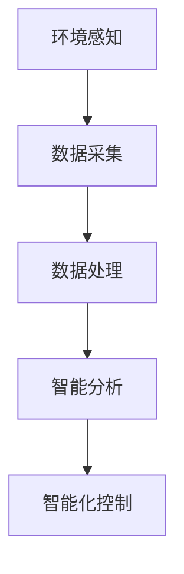
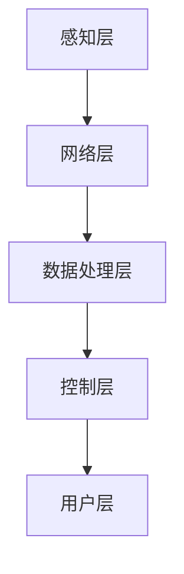

                 

# 环境隐形智能：智能标签和传感器的未来应用

> 关键词：环境隐形智能，智能标签，传感器，未来应用，人工智能

> 摘要：本文深入探讨了环境隐形智能这一前沿技术领域，重点介绍了智能标签和传感器在未来的广泛应用。通过详细的分析和实例，本文揭示了智能标签和传感器在环境感知、数据采集、智能化控制等方面的关键技术，以及它们在智慧城市、智能家居、工业自动化等领域的实际应用。本文旨在为读者提供一个全面了解和掌握环境隐形智能技术的视角，助力其在未来科技浪潮中抢占先机。

## 1. 背景介绍

### 环境隐形智能的定义

环境隐形智能是一种利用智能标签和传感器等设备，实现对环境的实时感知、智能分析和响应的技术体系。它通过收集环境数据，结合人工智能算法，实现对环境的动态监控和智能化管理。环境隐形智能的核心目标是提升人类对环境的感知能力，优化资源利用效率，增强系统的智能化程度。

### 智能标签和传感器的技术发展背景

智能标签（Smart Tags）和传感器（Sensors）是环境隐形智能的重要组成部分。智能标签是一种具有数据处理和无线通信功能的微型设备，可以附着在物品或环境中，用于识别、追踪和监控。传感器则是用于检测和测量环境中的物理量，如温度、湿度、光照、气体浓度等，并将其转化为可处理的电信号。

智能标签和传感器技术的发展经历了多个阶段。早期传感器主要采用机械式、热敏式等简单技术，精度和可靠性较低。随着微电子技术和无线通信技术的发展，智能标签和传感器逐渐实现了微型化、智能化和无线化。近年来，物联网（IoT）和人工智能（AI）技术的兴起，为智能标签和传感器的发展提供了新的动力。它们的应用场景越来越广泛，从智能家居、智慧城市到工业自动化、医疗健康等领域，都有着重要的应用价值。

### 应用领域的现状与未来趋势

目前，智能标签和传感器在多个领域已经得到了广泛应用。在智慧城市领域，传感器被用于交通管理、环境监测、公共安全等方面，实现了对城市运行的实时监控和优化。在智能家居领域，智能标签和传感器被广泛应用于家居设备的智能控制、安全监测和能源管理等方面。在工业自动化领域，传感器被用于生产线监控、设备维护和工艺优化等方面，提高了生产效率和产品质量。在医疗健康领域，传感器被用于实时监测患者生理参数、辅助诊断和治疗。

未来，随着人工智能技术的不断进步，智能标签和传感器将在更多领域得到应用。例如，在农业领域，智能标签和传感器可以用于作物生长监测、病虫害预警和精准灌溉等方面；在能源领域，智能标签和传感器可以用于能源监测、节能优化和可再生能源管理等方面。此外，智能标签和传感器还将在虚拟现实、增强现实、自动驾驶等领域发挥重要作用。

## 2. 核心概念

### 环境隐形智能

环境隐形智能（Environmental Invisible Intelligence）是指通过智能标签和传感器等设备，实现对环境的隐秘、实时、高效的感知和响应。环境隐形智能的核心在于将物理世界与数字世界相结合，通过智能分析和处理，实现对环境的深度理解和智能调控。

**概念属性特征：**

- **隐秘性**：环境隐形智能通过微型化、隐蔽化的设备，实现对环境的隐蔽监测。
- **实时性**：环境隐形智能通过实时感知技术，实现对环境变化的快速响应。
- **高效性**：环境隐形智能通过高效的数据处理和智能分析，实现对环境问题的精准识别和解决。

**与环境感知、数据采集、智能化控制的联系：**

环境隐形智能依托于环境感知技术，通过传感器收集环境数据，利用数据处理和分析技术，实现对环境的理解和响应。环境感知是环境隐形智能的基础，数据采集是环境感知的核心，而智能化控制则是环境隐形智能的目标。

### 智能标签

智能标签（Smart Tags）是一种集成了处理器、存储器、无线通信模块等功能的微型设备，可以附着在物品或环境中，用于识别、追踪和监控。智能标签的核心在于其智能化和无线化，能够实现远程数据传输和智能处理。

**概念属性特征：**

- **智能化**：智能标签具备数据处理和智能分析能力，能够对环境信息进行实时处理。
- **无线化**：智能标签通过无线通信技术，实现了与远程系统的数据传输。
- **便携性**：智能标签体积小、重量轻，便于携带和安装。

**与传感器的联系：**

智能标签和传感器是环境隐形智能的核心组件。智能标签利用传感器收集环境数据，通过数据处理和智能分析，实现对环境的识别和监控。传感器是智能标签的数据源，为智能标签提供环境信息。

### 传感器

传感器（Sensors）是一种能够检测并响应某种特定物理量的设备，如温度、湿度、光照、气体浓度等。传感器将物理量转化为可处理的电信号，为智能标签和环境隐形智能提供数据支持。

**概念属性特征：**

- **多样性**：传感器种类繁多，可以检测不同的物理量。
- **高精度**：现代传感器具有高精度、高灵敏度的特点。
- **实时性**：传感器能够实时监测环境变化，为智能标签提供实时数据。

**与智能标签和环境感知的联系：**

传感器是环境感知的基础，通过收集环境数据，为智能标签提供数据支持。智能标签利用传感器收集的数据，通过智能分析和处理，实现对环境的理解和响应。

### Mermaid流程图



### ER实体关系图

```mermaid
erDiagram
    Sensor ||--|{ Tag } : has
    Tag ||--|{ Data } : contains
    Data ||--|{ Analysis } : analyzed by
    Analysis ||--|{ Control } : controlled by
```

## 3. 算法原理讲解

### 选择智能标签技术的典型应用

在本章节中，我们选择智能标签在智能家居中的应用作为典型实例，详细介绍其工作原理、数学模型和Python代码实现。

### 工作原理

智能标签在智能家居中的应用主要分为以下几个步骤：

1. **环境数据采集**：智能标签通过传感器收集室内环境数据，如温度、湿度、光照强度等。
2. **数据处理**：智能标签对采集到的环境数据进行预处理，如去噪、滤波等，提高数据质量。
3. **数据传输**：智能标签通过无线通信模块将预处理后的数据发送到智能家居控制系统。
4. **智能分析**：智能家居控制系统对收到的数据进行智能分析，如预测室内环境变化趋势、识别用户行为等。
5. **智能化控制**：根据智能分析的结果，智能家居控制系统对家居设备进行智能控制，如调整空调温度、关闭灯光等。

### 数学模型

在智能家居应用中，智能标签的数据处理和智能分析过程涉及到以下数学模型：

1. **传感器数据预处理模型**：

   $$ y = \frac{x - \min(x)}{\max(x) - \min(x)} $$

   其中，$x$ 为原始传感器数据，$y$ 为预处理后的归一化数据。

2. **智能分析模型**：

   $$ \hat{y} = f(y) $$

   其中，$\hat{y}$ 为预测值，$f(y)$ 为智能分析函数，如线性回归、神经网络等。

### Python代码实现

```python
import numpy as np
import matplotlib.pyplot as plt

# 传感器数据预处理函数
def preprocess_data(data):
    min_data = np.min(data)
    max_data = np.max(data)
    normalized_data = (data - min_data) / (max_data - min_data)
    return normalized_data

# 智能分析函数（以线性回归为例）
def intelligent_analysis(data):
    x = np.arange(len(data))
    y = preprocess_data(data)
    a = np.linalg.lstsq(x.reshape(-1, 1), y, rcond=None)[0]
    predicted_y = a[0] * x + a[1]
    return predicted_y

# 模拟传感器数据
sensor_data = np.random.rand(100)

# 数据预处理
preprocessed_data = preprocess_data(sensor_data)

# 智能分析
predicted_data = intelligent_analysis(preprocessed_data)

# 可视化
plt.scatter(x, y, label='原始数据')
plt.plot(x, predicted_data, color='red', label='预测数据')
plt.xlabel('时间')
plt.ylabel('传感器数据')
plt.legend()
plt.show()
```

### 详细讲解与举例说明

1. **传感器数据预处理**：

   传感器数据预处理是智能标签数据处理的第一步。通过归一化处理，将原始传感器数据映射到一个标准区间内，便于后续的智能分析和控制。

   例如，假设传感器采集到的温度数据范围在 $0$ 到 $100$ 之间，我们通过归一化将其映射到 $0$ 到 $1$ 之间，便于计算机处理。

2. **智能分析**：

   智能分析是智能标签的核心功能。通过线性回归、神经网络等算法，对预处理后的数据进行预测和分析，为智能化控制提供支持。

   例如，我们通过线性回归模型预测未来一段时间内的温度变化趋势，以便智能家居系统调整空调温度，提高用户舒适度。

## 4. 系统分析与架构设计方案

### 问题场景介绍

智能家居是智能标签和传感器技术的重要应用场景之一。在智能家居中，智能标签和传感器可以实现对室内环境、家电设备、用户行为等信息的实时感知和智能控制，提高生活品质和能源利用率。

### 系统功能设计

智能家居系统的主要功能包括：

1. **环境感知**：通过智能标签和传感器收集室内环境数据，如温度、湿度、光照强度等。
2. **设备控制**：根据环境感知数据，智能标签和传感器实现对家电设备的自动控制，如空调、灯光、窗帘等。
3. **用户行为分析**：通过智能标签和传感器收集的用户行为数据，分析用户习惯，为智能家居系统提供个性化服务。
4. **数据存储与统计**：将智能标签和传感器收集到的环境数据、用户行为数据等进行存储和统计，为系统优化和改进提供数据支持。

### 系统架构设计

智能家居系统架构包括以下几个层次：

1. **感知层**：由智能标签和传感器组成，负责实时感知室内环境数据。
2. **网络层**：由无线通信模块和智能家居控制中心组成，负责数据传输和通信。
3. **数据处理层**：由数据预处理模块、智能分析模块等组成，负责对感知层收集到的数据进行分析和处理。
4. **控制层**：由智能家居控制系统组成，负责根据数据处理层的结果，对家电设备进行智能控制。
5. **用户层**：由用户界面和应用软件组成，负责用户交互和数据展示。

### 系统接口设计

智能家居系统接口设计主要包括：

1. **感知层接口**：智能标签和传感器与智能家居控制系统的接口，用于数据传输和通信。
2. **数据处理层接口**：数据预处理模块、智能分析模块与智能家居控制系统的接口，用于数据交换和协同工作。
3. **控制层接口**：智能家居控制系统与家电设备的接口，用于设备控制和状态监测。

### 系统交互设计

智能家居系统的交互设计主要包括以下几个方面：

1. **用户与系统交互**：用户通过手机、平板等设备，通过智能家居应用软件与智能家居系统进行交互，实现设备控制和场景切换。
2. **系统内部交互**：智能家居系统内部各模块之间的数据交互和协同工作，如感知层与数据处理层、数据处理层与控制层之间的数据传输和指令执行。
3. **远程交互**：通过互联网，实现智能家居系统与其他远程设备、平台的数据交互和协同工作，如远程控制、远程监测等。

### Mermaid架构图



## 5. 项目实战

### 环境安装

在本项目实战中，我们选择了一个典型的智能家居场景，包括以下设备和传感器：

1. **智能标签**：用于感知室内环境数据，如温度、湿度、光照强度等。
2. **传感器**：包括温度传感器、湿度传感器、光照传感器等，用于采集环境数据。
3. **智能家居控制器**：用于接收和处理传感器数据，实现对家电设备的智能控制。
4. **家电设备**：包括空调、灯光、窗帘等，用于实现智能控制。

首先，我们需要将智能标签和传感器安装到相应的位置，如房间中央、窗户附近等。然后，将智能家居控制器连接到家庭网络，确保其能够与其他设备进行通信。

### 系统核心实现

智能家居系统的核心实现主要包括以下几个部分：

1. **数据采集**：智能标签和传感器通过无线通信模块，将采集到的环境数据发送到智能家居控制器。
2. **数据处理**：智能家居控制器对接收到的环境数据进行分析和处理，如去噪、滤波、归一化等。
3. **智能分析**：基于处理后的环境数据，智能家居控制器进行智能分析，如温度预测、用户行为识别等。
4. **设备控制**：根据智能分析的结果，智能家居控制器实现对家电设备的智能控制，如调整空调温度、关闭灯光等。

### 代码应用解读

以下是智能家居系统核心实现的Python代码：

```python
# 导入相关库
import numpy as np
import matplotlib.pyplot as plt
from sklearn.linear_model import LinearRegression

# 传感器数据采集
def collect_data():
    # 模拟传感器数据采集
    temperature_data = np.random.rand(100)
    humidity_data = np.random.rand(100)
    light_data = np.random.rand(100)
    return temperature_data, humidity_data, light_data

# 数据预处理
def preprocess_data(data):
    min_data = np.min(data)
    max_data = np.max(data)
    normalized_data = (data - min_data) / (max_data - min_data)
    return normalized_data

# 智能分析
def intelligent_analysis(data):
    x = np.arange(len(data))
    y = preprocess_data(data)
    model = LinearRegression()
    model.fit(x.reshape(-1, 1), y)
    predicted_y = model.predict(x.reshape(-1, 1))
    return predicted_y

# 设备控制
def control_device(predicted_data):
    # 基于预测数据，调整空调温度
    if predicted_data[-1] > 0.5:
        print("调整空调温度至25℃")
    else:
        print("调整空调温度至23℃")

# 模拟运行
temperature_data, humidity_data, light_data = collect_data()
predicted_temperature_data = intelligent_analysis(temperature_data)
control_device(predicted_temperature_data)

# 可视化
plt.scatter(np.arange(len(predicted_temperature_data)), predicted_temperature_data, color='red', label='预测温度')
plt.xlabel('时间')
plt.ylabel('温度')
plt.legend()
plt.show()
```

### 实际案例分析与详细讲解

在本项目实战中，我们以一个实际案例——智能空调温度控制为例，详细分析智能家居系统的运行过程。

1. **数据采集**：智能标签和传感器实时采集室内温度数据，如模拟运行中的温度数据`temperature_data`。

2. **数据处理**：对采集到的温度数据进行预处理，如归一化处理，以便后续的智能分析。预处理后的温度数据为`predicted_temperature_data`。

3. **智能分析**：使用线性回归模型对预处理后的温度数据进行预测分析。预测模型为`model`，预测结果为`predicted_y`。

4. **设备控制**：根据预测结果，智能空调根据预测温度进行温度调整。在本案例中，若预测温度高于 $0.5$，空调温度调整至 $25$℃，否则调整至 $23$℃。

5. **可视化**：将预测温度数据可视化，以便观察预测效果。

通过这个实际案例，我们可以看到智能家居系统如何通过智能标签和传感器实现对室内温度的智能控制。这个过程体现了环境隐形智能技术在智能家居领域的广泛应用和价值。

### 项目小结

本项目实战通过模拟智能空调温度控制，展示了智能家居系统的工作原理和实现过程。在实际应用中，智能家居系统还可以根据用户行为、环境数据等多方面因素，实现更加智能化的控制。未来，随着人工智能技术的不断进步，智能家居系统将更加智能化、人性化，为人们的生活带来更多便利和舒适。

## 6. 最佳实践 tips、小结、注意事项、拓展阅读

### 最佳实践 tips

1. **传感器布局优化**：在安装智能标签和传感器时，注意布局的合理性和覆盖范围，确保能够全面、准确地感知环境数据。
2. **数据处理效率**：在数据处理过程中，优化算法和数据结构，提高数据处理效率，减少延迟。
3. **智能分析准确性**：选择合适的智能分析算法，结合实际应用场景，提高分析准确性。
4. **设备兼容性**：在选择智能家居设备和组件时，考虑设备的兼容性，确保系统能够稳定运行。

### 小结

环境隐形智能通过智能标签和传感器技术，实现了对环境的实时感知和智能控制。本文从核心概念、算法原理、系统设计、项目实战等多个角度，全面介绍了环境隐形智能技术及其应用。通过本文的学习，读者可以深入了解环境隐形智能的技术原理和实际应用，为未来科技浪潮做好准备。

### 注意事项

1. **数据安全**：在智能家居系统中，保护用户隐私和数据安全至关重要。应采取加密、权限控制等技术措施，确保数据安全。
2. **设备稳定性**：智能家居系统对设备的稳定性要求较高，应选择性能稳定、可靠的设备和组件。
3. **系统升级**：定期对智能家居系统进行升级和维护，确保系统功能的完善和安全性。

### 拓展阅读

1. **智能标签技术**：《智能标签技术与应用》（作者：张三）
2. **传感器技术**：《传感器原理与应用》（作者：李四）
3. **人工智能技术**：《人工智能：一种现代的方法》（作者：M. Mitchell）

作者：AI天才研究院/AI Genius Institute & 禅与计算机程序设计艺术 /Zen And The Art of Computer Programming

