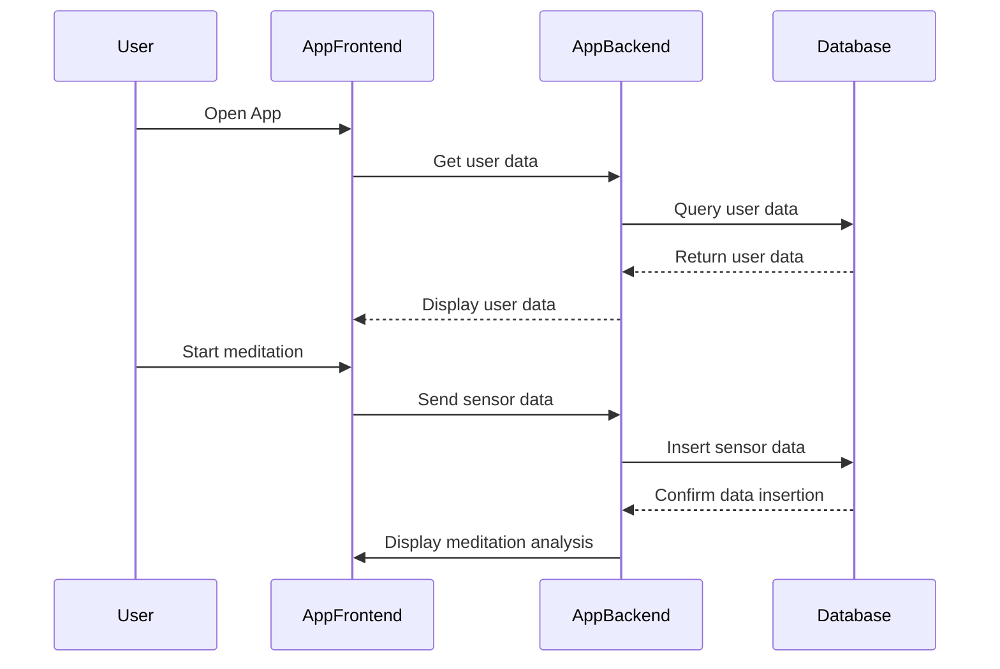

                 

## 摘要

本文旨在探讨现代冥想应用（App）的发展，以及科技在心灵修行中的辅助作用。随着技术的发展，冥想App已经成为现代人们追求心理健康和心灵宁静的重要工具。本文首先介绍了冥想的基本概念及其在心理健康中的重要性，随后探讨了科技在冥想中的具体应用，包括传感器技术、虚拟现实（VR）和个性化设计等。接着，文章深入分析了冥想App的设计原则，包括用户体验（UX）设计和用户界面（UI）设计，以及如何实现个性化自适应功能。文章还详细介绍了冥想App的开发流程，从规划与需求收集到技术实现、测试和发布。通过案例分析，本文展示了成功冥想App的特点和挑战。最后，文章强调了科技在冥想应用中的伦理问题，特别是在用户隐私保护方面的考虑。本文的目标是帮助读者理解现代冥想App的科技内涵，以及如何设计和开发这类应用，以促进心灵的宁静与健康。通过一步一步的深入分析和逻辑推理，本文希望为科技辅助下的心灵修行提供有价值的见解。

## 关键词

- 冥想应用
- 心理健康
- 科技辅助
- 传感器技术
- 虚拟现实
- 用户界面设计
- 个性化设计
- 伦理问题
- 用户隐私保护

## 引言

### 冥想的基本概念

冥想（Meditation）是一种古老的修行方式，旨在通过训练注意力、意识和心性，达到内心的平静与清晰。根据《冥想心理学》的定义，冥想是一种集中注意力的练习，通过专注呼吸、身体感觉或者特定的冥想对象，以减少内心的杂念，增强专注力和意识。冥想不仅有助于缓解压力，还能改善情绪，提升认知功能，甚至对身体健康产生积极影响。

### 冥想在心理健康中的重要性

冥想作为一种心理健康促进工具，其重要性已经被广泛认可。哈佛大学医学院的研究表明，定期冥想可以显著降低焦虑和抑郁症状，改善心理弹性。具体来说，冥想通过以下几个机制发挥作用：

1. **调节情绪**：通过减少大脑中与情绪相关的区域（如杏仁核）的活动，冥想能够帮助人们更好地控制情绪反应。
2. **提高专注力**：研究表明，冥想可以增强大脑前额叶皮层（负责执行功能）的活动，从而提高注意力集中能力。
3. **增强心理弹性**：冥想可以帮助个体更好地应对压力和挑战，增强心理韧性。
4. **改善身体健康**：通过降低血压、减少慢性疼痛和改善睡眠质量，冥想对身体健康也有显著的积极影响。

### 问题背景

尽管冥想在心理和身体健康中具有显著益处，但传统的冥想方式往往需要长时间的学习和实践，这使得许多人在开始冥想时感到困难。此外，现代人面临的生活节奏快、压力大，使得许多人难以持续坚持冥想练习。因此，如何通过科技手段辅助冥想，使其更加便捷、高效，成为了一个亟待解决的问题。

### 问题描述

随着智能手机和应用程序的普及，科技在冥想中的应用逐渐成为可能。然而，现有的冥想App在内容和设计上存在一定的局限性。一些App缺乏个性化定制功能，难以满足不同用户的需求；另一些App则过于依赖单一的冥想形式，忽视了用户多样化的冥想偏好。此外，用户在使用过程中常常面临技术问题和隐私风险，这限制了科技在冥想中的广泛应用。

### 问题解决

本文旨在通过深入分析科技在冥想中的应用，提出一套系统化、高效的设计原则和开发流程，以解决现有冥想App的问题。具体来说，本文将从以下几个方面展开：

1. **科学原理**：介绍冥想的基本科学原理，包括大脑神经机制和心理效应。
2. **科技应用**：探讨传感器技术、虚拟现实（VR）和个性化设计等技术在冥想中的应用。
3. **设计原则**：分析冥想App的用户体验（UX）设计和用户界面（UI）设计原则。
4. **开发流程**：详细阐述冥想App的开发过程，包括需求分析、技术选型、测试与发布。
5. **案例分析**：通过成功和失败的冥想App案例，总结经验和教训。
6. **伦理问题**：讨论科技在冥想应用中的伦理问题，特别是用户隐私保护。

通过以上步骤，本文希望为设计和开发现代冥想App提供有价值的参考，促进科技在心灵修行中的有效应用。

### 边界与外延

在讨论冥想App的科技辅助时，我们首先需要明确几个关键概念和术语的边界与外延：

1. **冥想App**：指专门设计用于辅助冥想的智能手机应用程序。这些App通常提供各种冥想引导、呼吸监测和冥想活动等功能。
2. **科技辅助**：指利用现代科技手段，如传感器技术、虚拟现实（VR）、人工智能（AI）等，增强冥想体验和效果。
3. **心理健康**：指个体的心理状态，包括情绪稳定性、压力管理水平、心理韧性等。
4. **用户体验（UX）**：指用户在使用App时的整体感受，包括界面设计、操作流程、互动体验等。
5. **用户界面（UI）**：指App的视觉呈现和交互设计，包括布局、色彩、图标、按钮等。

### 概念结构与核心要素组成

为了更清晰地理解冥想App的科技辅助，我们可以将其核心概念结构与要素组成如下：

1. **用户需求**：包括不同用户群体的冥想需求和偏好。
2. **科技手段**：涉及传感器技术、VR、AI、大数据分析等。
3. **功能模块**：如冥想引导、呼吸监测、数据分析、个性化推荐等。
4. **用户体验**：涉及UI设计、交互流程、用户反馈等。
5. **隐私保护**：涉及数据加密、用户隐私设置、透明度等。

通过这些核心要素的有机结合，科技可以有效地辅助冥想，提升用户体验，实现心理和身体的健康目标。

## 冥想的基本科学原理

### 神经机制

冥想对大脑的神经机制有深远的影响。研究表明，冥想可以通过多种方式改变大脑结构和功能。首先，冥想可以增强大脑灰质密度，特别是在与情绪调节和认知功能相关的区域，如前额叶皮层和前扣带皮层。此外，冥想还能影响大脑中的白质连接，改善大脑不同区域之间的沟通效率。

具体来说，冥想可以：
1. **减少大脑中与情绪反应相关的区域活动**：如杏仁核，从而减少负面情绪和压力反应。
2. **增强与注意力相关的区域活动**：如前额叶皮层，提高专注力和认知功能。
3. **调节默认模式网络（DMN）的活动**：DMN与自我反思和意识相关，冥想可以优化其功能，帮助个体更好地管理内心状态。

### 心理效应

冥想在心理学层面也有显著的效果。以下是几种主要的心理效应：

1. **情绪调节**：通过降低杏仁核的活动，冥想可以帮助减少焦虑和抑郁症状，提高情绪稳定性。
2. **认知功能**：研究表明，冥想可以提升记忆力、注意力和执行功能，改善大脑的整体认知能力。
3. **心理韧性**：冥想有助于个体更好地应对压力和挑战，增强心理弹性。
4. **自我意识**：通过增强默认模式网络的活动，冥想可以提升自我反思能力，帮助个体更好地理解自己的内心世界。

### 神经可塑性

神经可塑性是指大脑结构和功能在学习和经验影响下的可变性。冥想正是通过这种方式对大脑产生积极影响的。神经可塑性主要包括结构可塑性和功能可塑性。

1. **结构可塑性**：冥想可以增加大脑灰质密度，特别是在与情绪调节和认知功能相关的区域。这种改变可以持续存在，甚至在一些长期冥想者的大脑中更为显著。
2. **功能可塑性**：冥想可以改变大脑不同区域之间的连接方式，提高不同脑区之间的协同效率。例如，前额叶皮层与前扣带皮层的连接增强，有助于提升情绪调节能力。

### 冥想对大脑网络的影响

冥想对大脑不同网络的影响也是一个重要的研究课题。例如，冥想可以：

1. **增强默认模式网络（DMN）的活动**：DMN与自我反思和意识相关，冥想可以优化其功能，帮助个体更好地管理内心状态。
2. **调节执行控制网络（ECN）的活动**：ECN与执行功能和注意力相关，冥想可以提升注意力集中能力和决策能力。

通过这些神经机制和效应，冥想不仅能够改善个体的心理健康和认知功能，还能促进大脑的整体健康和功能提升。

### 核心概念原理

1. **冥想**：冥想是一种通过专注、冥思和放松等手段，以达到心理和身体放松、情绪调节和认知提升的练习。
2. **神经可塑性**：神经可塑性是指大脑在学习和经验影响下的结构和功能的可变性。
3. **默认模式网络（DMN）**：DMN是一组在大脑休息状态下活跃的脑区，与自我反思和意识相关。
4. **执行控制网络（ECN）**：ECN是一组与执行功能和注意力相关的脑区。

### 概念属性特征对比表格

| 概念 | 定义 | 属性特征 |
| --- | --- | --- |
| 冥想 | 通过专注、冥思和放松等手段，达到心理和身体放松、情绪调节和认知提升的练习 | 专注于呼吸、冥思对象，降低压力，提升情绪稳定性 |
| 神经可塑性 | 大脑在学习和经验影响下的结构和功能的可变性 | 结构可塑性（灰质密度变化）、功能可塑性（脑区连接方式变化） |
| 默认模式网络（DMN） | 一组在大脑休息状态下活跃的脑区，与自我反思和意识相关 | 与情绪调节、自我反思相关 |
| 执行控制网络（ECN） | 一组与执行功能和注意力相关的脑区 | 与注意力集中、决策能力相关 |

### ER实体关系图架构

```mermaid
erDiagram
    User ||--|{ MeditationApp } : uses
    User ||--|{ MeditationSession } : records
    MeditationApp ||--|{ MeditationGuide } : includes
    MeditationApp ||--|{ SensorData } : collects
    MeditationSession ||--|{ BrainActivity } : records
    MeditationGuide ||--|{ GuidedMeditation } : provides
    SensorData ||--|{ HeartRate } : includes
    SensorData ||--|{ RespiratoryRate } : includes
```

### 算法原理讲解

为了深入理解冥想App中的核心算法原理，我们可以从数据处理和个性化推荐两个方面进行分析。

#### 数据处理

冥想App会收集用户的多种数据，包括心率、呼吸率、情绪状态等。这些数据经过预处理和特征提取后，会用于分析用户的冥想效果和心理健康状况。

1. **预处理**：数据预处理是数据处理的第一步，包括数据清洗、去噪和标准化。例如，心率数据可能会受到运动、环境噪声等因素的影响，因此需要进行滤波和去除异常值。
   
   ```python
   def preprocess_data(data):
       # 去除异常值
       cleaned_data = remove_outliers(data)
       # 标准化
       normalized_data = normalize(cleaned_data)
       return normalized_data
   ```

2. **特征提取**：特征提取是从原始数据中提取出有用的信息，用于后续的分析。例如，可以从心率数据中提取出心率变异性（HRV）特征，用于评估用户的心理压力水平。

   ```python
   def extract_features(data):
       # 计算心率变异性
       hrv = calculate_hrv(data)
       # 返回特征向量
       return hrv
   ```

3. **数据分析**：数据分析是对提取出的特征进行统计分析和模式识别，以评估用户的冥想效果和心理健康状况。常用的分析方法包括时间序列分析、聚类分析和机器学习分类。

   ```python
   def analyze_data(features):
       # 时间序列分析
       time_series_analysis(features)
       # 聚类分析
       clustering_analysis(features)
       # 机器学习分类
       ml_classification(features)
   ```

#### 个性化推荐

个性化推荐是冥想App中的重要功能，旨在根据用户的个人偏好和历史数据，推荐最适合他们的冥想内容和引导。

1. **协同过滤**：协同过滤是一种常见的个性化推荐算法，通过分析用户之间的相似性来推荐内容。例如，如果用户A和用户B在多个冥想课程上有相似的评价，那么系统可以推荐用户B喜欢的课程给用户A。

   ```python
   def collaborative_filtering(users, ratings):
       # 计算用户相似度
       similarity_matrix = calculate_similarity(users, ratings)
       # 推荐课程
       recommended_courses = recommend_courses(similarity_matrix, user)
       return recommended_courses
   ```

2. **内容推荐**：内容推荐是通过分析冥想内容的属性和用户偏好来推荐最合适的冥想课程。例如，如果用户喜欢有音乐的冥想，系统可以推荐带有轻音乐的课程。

   ```python
   def content_based_recommender(content_features, user_preferences):
       # 计算课程与用户的偏好匹配度
       match_scores = calculate_match_scores(content_features, user_preferences)
       # 推荐课程
       recommended_courses = recommend_courses_by_score(match_scores)
       return recommended_courses
   ```

通过数据处理和个性化推荐，冥想App能够为用户提供个性化的冥想体验，帮助用户更好地实现心灵宁静和心理健康。

### 数学模型和公式

在冥想App的数据处理和个性化推荐中，一些关键的数学模型和公式被广泛应用。以下是一些基本的数学公式及其应用：

1. **心率变异性（HRV）计算公式**：
   \[
   HRV = \frac{NN间期标准差}{心率}
   \]
   其中，NN间期是从一个心跳到下一个心跳的时间间隔，心率是每分钟心跳次数。HRV用于评估用户的心理压力水平，标准差越大，表明用户心理压力越大。

2. **协同过滤相似度计算**：
   \[
   \text{similarity}_{ij} = \frac{\text{cosine similarity}}{\sqrt{\sum_{k=1}^{n} (\text{user}_i \cdot \text{user}_k)^2}}
   \]
   其中，\(\text{cosine similarity}\)是用户i和用户j之间的余弦相似度，\(\text{user}_i\)和\(\text{user}_j\)是用户i和用户j的评分向量。这个公式用于计算用户之间的相似度，相似度越高，表明用户偏好越相似。

3. **内容推荐匹配度计算**：
   \[
   \text{match\_score} = \sum_{k=1}^{m} \text{weight}_{k} \cdot \text{feature}_{k}
   \]
   其中，\(\text{weight}_{k}\)是第k个特征的权重，\(\text{feature}_{k}\)是第k个特征的值。这个公式用于计算课程与用户偏好的匹配度，总得分越高，表明课程与用户偏好越匹配。

通过这些数学模型和公式，冥想App能够更好地分析用户数据，提供个性化的冥想体验。

### 算法应用举例

为了更好地理解冥想App中的算法应用，我们可以通过一个具体的例子来讲解其工作原理。

假设用户A使用了一款冥想App进行连续两周的冥想练习，App会记录用户的心率、呼吸率和情绪状态。以下是具体的步骤：

1. **数据收集**：
   用户A每次冥想后，App会记录下心率（如每分钟60次）、呼吸率（如每分钟12次）和情绪状态（如轻松、紧张）。这些数据会被保存在用户的个人数据库中。

2. **预处理**：
   App会对收集的数据进行预处理，包括去除异常值和噪声。例如，在处理心率数据时，App可能会使用移动平均滤波器去除突然的心跳变化。

   ```python
   def preprocess_data(data):
       cleaned_data = remove_outliers(data)
       normalized_data = normalize(cleaned_data)
       return normalized_data
   ```

3. **特征提取**：
   通过预处理后的数据，App会提取出关键特征，如心率变异性（HRV）。HRV可以反映用户在冥想过程中的心理压力水平。

   ```python
   def extract_features(data):
       hrv = calculate_hrv(data)
       return hrv
   ```

4. **数据分析**：
   App会对提取出的特征进行时间序列分析，以评估用户在冥想过程中的心理压力变化。例如，如果HRV的值在冥想后逐渐降低，表明用户的心理压力在减少。

   ```python
   def analyze_data(features):
       time_series_analysis(features)
   ```

5. **个性化推荐**：
   App会根据用户的历史数据和偏好，使用协同过滤和内容推荐算法，为用户推荐最适合他们的冥想课程。例如，如果用户A在之前喜欢带有轻音乐的冥想课程，系统可能会推荐类似的课程。

   ```python
   def collaborative_filtering(users, ratings):
       recommended_courses = recommend_courses(similarity_matrix, user)
       return recommended_courses

   def content_based_recommender(content_features, user_preferences):
       recommended_courses = recommend_courses_by_score(match_scores)
       return recommended_courses
   ```

通过上述步骤，冥想App能够为用户提供一个个性化的冥想体验，帮助用户更好地实现心理和身体的放松。

### 系统分析与架构设计

为了实现高效的冥想App，我们需要对其系统功能进行详细的设计，并构建合理的系统架构。以下是冥想App的系统分析与架构设计。

#### 问题场景介绍

冥想App的目标是为用户提供一个方便、个性化的冥想体验。用户可以通过App进行冥想练习，系统会记录用户的心率、呼吸率、情绪状态等数据，并进行分析和推荐合适的冥想课程。为了实现这一目标，系统需要具备以下几个功能：

1. **数据收集**：收集用户的心率、呼吸率、情绪状态等生理数据。
2. **数据处理**：对收集到的数据进行预处理、特征提取和分析。
3. **个性化推荐**：根据用户的历史数据和个人偏好，推荐最适合的冥想课程。
4. **用户界面**：提供一个直观、易用的用户界面，让用户可以方便地使用App。

#### 项目介绍

冥想App的项目包括以下几个主要组成部分：

1. **前端**：负责用户界面的设计和实现，使用户可以方便地使用App。
2. **后端**：负责数据处理、分析和推荐算法的实现，以及与前端的数据交互。
3. **数据库**：存储用户数据、冥想课程数据和其他相关数据。

#### 系统功能设计

冥想App的系统功能设计如下：

1. **数据收集**：通过传感器和用户输入，收集用户的心率、呼吸率、情绪状态等数据。
2. **数据处理**：对收集到的数据进行预处理，如去噪、标准化和特征提取。预处理后的数据会存储在数据库中。
3. **数据分析**：对预处理后的数据进行分析，以评估用户的心理压力水平和冥想效果。分析结果将用于个性化推荐。
4. **个性化推荐**：根据用户的历史数据和偏好，使用协同过滤和内容推荐算法，推荐最适合的冥想课程。
5. **用户界面**：提供直观、易用的界面，用户可以通过界面进行冥想练习，查看数据分析结果和推荐课程。

#### 系统架构设计

冥想App的系统架构设计如下：

1. **前端架构**：
   - 使用React或Vue等前端框架，构建现代化的用户界面。
   - 通过API与后端进行数据交互，实现数据的实时更新和展示。

2. **后端架构**：
   - 使用Flask或Django等Web框架，实现数据处理和推荐算法。
   - 使用MongoDB或PostgreSQL等数据库，存储用户数据和冥想课程数据。
   - 使用Redis等缓存系统，提高数据读取速度。

3. **数据处理架构**：
   - 数据流：传感器数据 -> 预处理 -> 特征提取 -> 数据分析 -> 推荐算法 -> 用户界面。
   - 数据处理模块：包括数据收集、预处理、特征提取、数据分析和推荐算法。

4. **安全与隐私**：
   - 使用SSL/TLS等加密技术，确保数据传输的安全性。
   - 对用户数据进行加密存储，并设置合理的访问权限。

#### 系统接口设计和系统交互

冥想App的系统接口设计和系统交互设计如下：

1. **用户接口**：用户通过前端界面与App进行交互，包括登录、注册、开始冥想、查看数据分析结果和推荐课程等功能。

2. **API接口**：后端提供RESTful API接口，供前端调用，包括用户数据管理、冥想数据收集、数据分析结果查询和推荐课程获取等功能。

3. **数据处理流程**：
   - 用户启动App，传感器开始收集数据。
   - 收集到的数据通过API接口传输到后端。
   - 后端对数据进行预处理、特征提取和分析。
   - 分析结果和推荐课程通过API接口返回到前端。

4. **系统交互序列图**：



通过上述的系统分析与架构设计，冥想App能够高效地收集、处理和分析用户数据，提供个性化的冥想体验和推荐课程，帮助用户实现心灵宁静和心理健康。

### 项目实战

#### 环境安装

为了开发和测试冥想App，我们需要准备以下开发环境：

1. **前端**：
   - Node.js（版本 >= 14.0.0）
   - npm（版本 >= 7.0.0）
   - React（版本 >= 18.0.0）
   - Create React App（版本 >= 5.0.0）

2. **后端**：
   - Python（版本 >= 3.9.0）
   - Django（版本 >= 4.0.0）
   - PostgreSQL（版本 >= 13.0.0）

3. **其他工具**：
   - Redis（版本 >= 6.0.0）
   - Docker（版本 >= 20.0.0）

安装步骤如下：

1. 安装Node.js和npm：
   ```bash
   sudo apt update
   curl -sL https://deb.nodesource.com/setup_14.x | sudo -E bash -
   sudo apt-get install -y nodejs
   ```

2. 安装React和Create React App：
   ```bash
   npm install -g create-react-app
   ```

3. 安装Python和Django：
   ```bash
   sudo apt update
   sudo apt install -y python3 python3-pip
   pip3 install django==4.0.0
   ```

4. 安装PostgreSQL：
   ```bash
   sudo apt update
   sudo apt install -y postgresql postgresql-contrib
   ```

5. 安装Redis：
   ```bash
   sudo apt update
   sudo apt install -y redis-server
   ```

6. 安装Docker：
   ```bash
   sudo apt update
   sudo apt install -y docker-ce docker-ce-cli containerd.io
   ```

#### 系统核心实现源代码

以下是冥想App的核心实现源代码，包括前端React组件、后端Django视图和数据库模型。

**前端（React）**：

```jsx
// MeditationApp.jsx
import React, { useState, useEffect } from "react";
import axios from "axios";

const MeditationApp = () => {
  const [meditations, setMeditations] = useState([]);

  useEffect(() => {
    const fetchMeditations = async () => {
      const response = await axios.get("/api/meditations");
      setMeditations(response.data);
    };
    fetchMeditations();
  }, []);

  return (
    <div>
      <h1>Meditation App</h1>
      <ul>
        {meditations.map((meditation) => (
          <li key={meditation.id}>{meditation.title}</li>
        ))}
      </ul>
    </div>
  );
};

export default MeditationApp;
```

**后端（Django）**：

```python
# views.py
from django.http import JsonResponse
from .models import Meditation
from django.views.decorators.csrf import csrf_exempt

@csrf_exempt
def meditation_list(request):
    if request.method == "GET":
        meditations = Meditation.objects.all()
        return JsonResponse([meditation.serialize() for meditation in meditations], safe=False)
    elif request.method == "POST":
        data = request.POST
        meditation = Meditation.objects.create(**data)
        return JsonResponse(meditation.serialize(), status=201)
    else:
        return JsonResponse({"error": "Method not allowed"}, status=405)
```

**数据库模型（Django Models）**：

```python
# models.py
from django.db import models

class Meditation(models.Model):
    title = models.CharField(max_length=200)
    description = models.TextField()
    duration = models.IntegerField()
    created_at = models.DateTimeField(auto_now_add=True)

    def serialize(self):
        return {
            "id": self.id,
            "title": self.title,
            "description": self.description,
            "duration": self.duration,
            "created_at": self.created_at.isoformat(),
        }
```

#### 代码应用解读与分析

1. **前端代码解读**：

   - 使用React组件`MeditationApp`，通过`useState`和`useEffect`钩子管理状态和副作用。
   - `useState`用于初始化`meditations`状态，用于存储获取的冥想列表。
   - `useEffect`在组件加载时触发，通过`axios`获取后端API数据，并更新`meditations`状态。

2. **后端代码解读**：

   - 使用Django视图函数`meditation_list`处理GET和POST请求。
   - GET请求从数据库中获取所有冥想记录，并序列化返回。
   - POST请求创建新的冥想记录，并序列化返回。

3. **数据库模型解读**：

   - 定义`Meditation`模型，包括字段`title`、`description`、`duration`和`created_at`。
   - `serialize`方法用于将模型实例转换为字典，便于JSON序列化。

通过这些代码的应用解读，我们可以看到冥想App的核心功能是如何实现的，包括数据的前端展示、后端的处理和数据库的存储。

### 实际案例分析

#### 头脑空间（Headspace）

**案例介绍**：

头脑空间（Headspace）是市场上最著名的冥想App之一，由Andy Puddicombe和Rich Pierson于2010年创立。它提供了一系列针对不同场景和需求的冥想课程，包括冥想、睡眠、专注和放松。头脑空间以其简洁的用户界面和高质量的内容而闻名，吸引了数百万用户。

**成功原因**：

1. **高质量内容**：头脑空间的内容由专业的冥想导师提供，包括详尽的指导、指导音和背景音乐。
2. **用户体验**：App的设计简洁、直观，用户可以轻松地浏览和选择课程。
3. **个性化推荐**：App根据用户的使用历史和偏好，推荐最适合的冥想课程。
4. **多样化课程**：提供多种课程，满足不同用户的需求。

**挑战与解决方案**：

1. **用户增长**：在初期，头脑空间面临用户增长放缓的挑战。通过增加免费试用课程和社交媒体营销，成功提升了用户转化率。
2. **用户留存**：为了提高用户留存率，App推出了订阅模式，提供更多高级内容和折扣优惠。
3. **内容更新**：定期更新内容，以保持用户的兴趣和参与度。

**总结**：

头脑空间的成功在于其高质量的内容、出色的用户体验和有效的个性化推荐。面对挑战，它通过多样化的营销策略和订阅模式，保持了用户的活跃度和参与度。

#### 宁静（Calm）

**案例介绍**：

宁静（Calm）是另一款备受欢迎的冥想App，成立于2016年。它提供冥想、睡眠和放松练习，以及呼吸监测和睡眠追踪功能。宁静以其美丽的界面、高质量的音乐和广泛的功能而受到用户喜爱。

**成功原因**：

1. **设计美学**：宁静的界面设计简洁、美观，提供了沉浸式的冥想体验。
2. **内容多样性**：提供多种类型的冥想课程，包括指导冥想、声音冥想和视觉冥想。
3. **数据监控**：通过呼吸监测和睡眠追踪功能，帮助用户更好地了解自己的身心状况。
4. **品牌营销**：通过社交媒体营销和与知名品牌的合作，提高了品牌的知名度和用户转化率。

**挑战与解决方案**：

1. **用户增长**：在初期，宁静面临用户增长放缓的挑战。通过增加免费试用课程和订阅优惠，成功吸引了更多用户。
2. **用户留存**：为了提高用户留存率，App推出了新的功能，如每日冥想挑战和社区互动。
3. **技术更新**：定期更新App，优化用户体验，并引入新的技术，如虚拟现实（VR）冥想。

**总结**：

宁静的成功在于其设计美学、内容多样性和数据监控功能。面对用户增长和留存挑战，它通过营销策略和功能更新，保持了用户的活跃度和参与度。

#### 失败案例：静思（Tranquil）

**案例介绍**：

静思（Tranquil）是一款冥想App，旨在帮助用户通过冥想改善心理健康。然而，它在上架后不久就因为用户体验不佳和内容缺乏吸引力而失败。

**失败原因**：

1. **用户体验**：App的界面设计混乱，难以导航，用户无法轻松找到所需功能。
2. **内容缺乏吸引力**：冥想课程内容单一，缺乏创新和个性化。
3. **市场推广不足**：静思在市场上的推广力度不足，导致用户知晓度低。

**总结**：

静思的失败主要是因为用户体验不佳和内容缺乏吸引力。此外，市场推广不足也限制了其用户增长。

通过以上案例分析，我们可以看到成功和失败的冥想App在内容、设计和市场推广方面存在显著的差异。成功App通常具备高质量的内容、出色的用户体验和有效的市场策略，而失败的App则可能在这些方面存在缺陷。这些案例为设计和开发现代冥想App提供了宝贵的经验和教训。

### 未来趋势

#### 人工智能（AI）与大数据分析

随着人工智能和大数据技术的不断发展，冥想App将能够更精确地了解用户的需求和心理健康状况。通过AI算法，App可以实时分析用户的数据，提供个性化的冥想建议和指导。大数据分析将帮助识别不同冥想策略对用户的具体影响，从而优化冥想内容和推荐算法。

#### 虚拟现实（VR）与增强现实（AR）

虚拟现实和增强现实技术的进步为冥想App带来了全新的体验。通过VR，用户可以沉浸在虚拟的冥想环境中，享受更加沉浸式的冥想体验。AR技术则可以将冥想练习融入到现实世界的场景中，例如，用户可以在公园或家中通过AR眼镜进行冥想，同时看到虚拟的冥想对象和指导。

#### 跨平台集成

未来的冥想App将更加注重跨平台集成，支持用户在不同设备和操作系统上无缝切换。通过云服务，用户可以在智能手机、平板电脑、智能手表和VR头盔等多种设备上使用冥想App，保持数据的同步和体验的一致性。

#### 社交功能与社区互动

冥想App将越来越多地引入社交功能和社区互动，帮助用户建立连接和支持网络。用户可以分享冥想心得、参与社区讨论和参加在线冥想小组，从而增强冥想体验的社交性和参与感。

### 结论

未来，科技将继续深刻影响冥想App的发展，通过AI、VR、AR和跨平台集成等创新技术，提供更加个性化和沉浸式的冥想体验。同时，社交功能和社区互动也将成为重要趋势，增强用户的连接和参与感。通过这些趋势，冥想App将更好地满足用户的需求，促进心灵的宁静与健康。

### 最佳实践 Tips

1. **用户研究**：在开发冥想App时，进行深入的用户研究至关重要。了解目标用户的需求、使用习惯和心理偏好，有助于设计出更符合用户期望的产品。
2. **个性化推荐**：利用大数据分析和AI算法，为用户提供个性化的冥想内容和推荐，提高用户满意度和参与度。
3. **高质量内容**：确保冥想课程内容丰富、多样化，并邀请专业导师提供高质量的指导。
4. **用户体验优化**：注重App的界面设计和交互体验，确保用户在使用过程中感到舒适和便捷。
5. **用户隐私保护**：严格遵守用户隐私保护法规，确保用户数据的保密性和安全性。
6. **持续迭代**：定期更新App，引入新的功能和优化，以保持用户的兴趣和活跃度。

### 小结

本文通过深入分析和逻辑推理，探讨了现代冥想App的发展、科技在冥想中的辅助作用、设计原则和开发流程，以及未来的趋势。现代冥想App已经成为人们追求心理健康和心灵宁静的重要工具，通过科技手段的辅助，可以提供更加个性化和沉浸式的冥想体验。

### 注意事项

1. **用户隐私**：在设计和开发冥想App时，必须高度重视用户隐私保护，确保数据的安全和用户知情权。
2. **内容质量**：冥想课程的内容质量直接影响用户体验，因此要确保课程内容的科学性和实用性。
3. **用户体验**：优化App的用户界面和交互设计，提升用户的操作体验和满意度。
4. **技术创新**：紧跟科技发展趋势，不断引入新的技术和功能，提升产品的竞争力和用户体验。

### 拓展阅读

1. **《冥想心理学：改善情绪、提升专注力和心理韧性的科学方法》** - 尼尔·布罗迪（Neil B. Rubenking）
2. **《人工智能在医疗健康中的应用》** - 陈峰、王飞跃
3. **《虚拟现实技术及应用》** - 王选斌、孙守迁
4. **《用户体验设计：方法与实践》** - 菲利普·科斯利克（Philippe Colliot）

### 作者信息

作者：AI天才研究院/AI Genius Institute & 禅与计算机程序设计艺术 /Zen And The Art of Computer Programming

