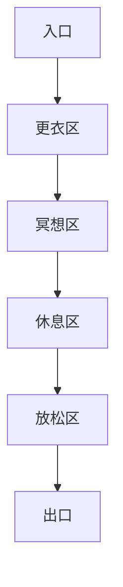
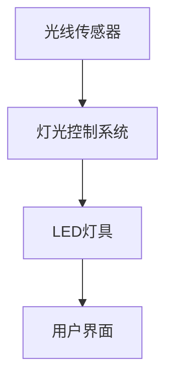
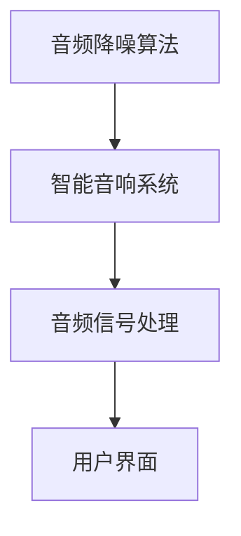
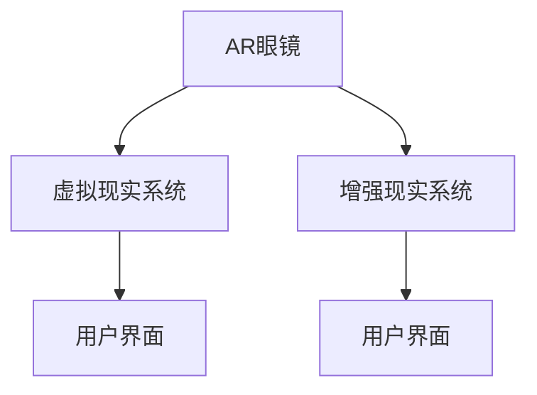
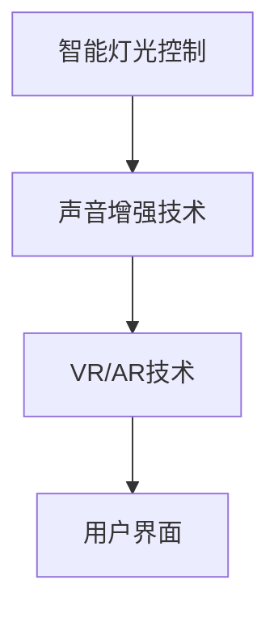
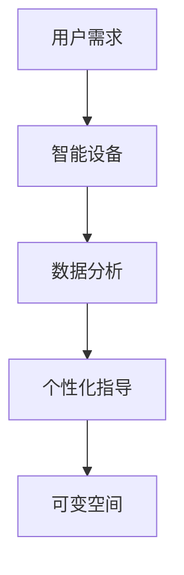
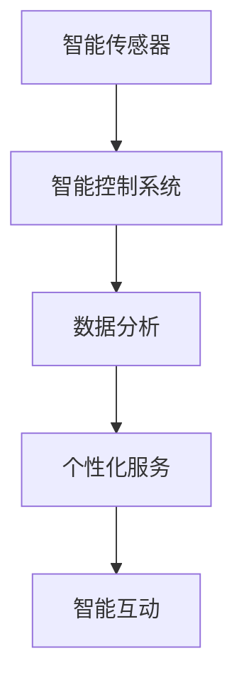
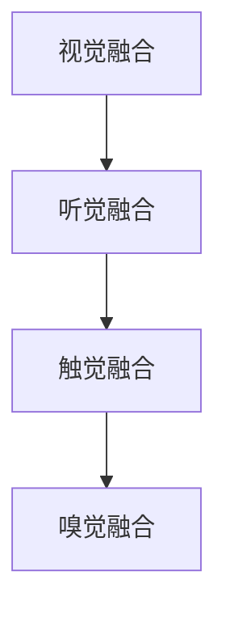
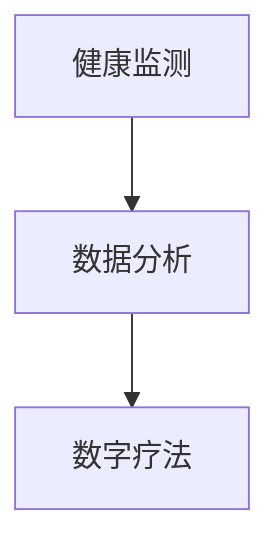

                 

### 第1章: 现代冥想空间的背景与重要性

#### 1.1 问题背景

在快节奏、高压力的现代社会中，人们面临着各种心理和生理上的挑战。城市生活的拥挤、工作压力的增大、生活节奏的加快，都使得越来越多的人感受到精神上的疲惫和压力。长期处于这种高压环境下，人们的心理健康状况受到了严重影响，焦虑、抑郁等问题逐渐凸显。

冥想作为一种古老而有效的心理健康调节方法，在现代社会的应用越来越广泛。它不仅有助于缓解压力，提高心理健康水平，还能提升注意力、增强自我控制能力，提高生活质量。因此，如何在现代都市环境中设计出有效的冥想空间，成为了许多人关注的焦点。

#### 1.1.1 冥想空间的概念与作用

冥想空间是指专门用于冥想和放松的物理空间，它应具备以下几个特点：

- **隐私性**：冥想空间应尽可能避免外部干扰，确保使用者能够在一个安静、私密的环境中冥想。
- **舒适感**：舒适的座椅、适宜的光线、清新的空气等，都能提升冥想的效果。
- **宁静的氛围**：通过自然声音、灯光设计等手段，营造出一种宁静、放松的氛围，有助于冥想者进入状态。

一个设计良好的冥想空间，不仅能够提供一个舒适、安静的环境，还能通过空间布局、色彩搭配、材质选择等方面，进一步促进冥想者的身心健康。

#### 1.1.2 现代冥想空间设计的基本原则

在设计现代冥想空间时，应遵循以下几个基本原则：

- **隐私性**：确保冥想者能够在不受干扰的环境中冥想。
- **舒适感**：座椅、床铺等应考虑人体工程学设计，确保舒适。
- **自然光线**：利用自然光线，避免强光直射。
- **空气净化**：保持空气清新，减少污染。
- **隔音效果**：采用隔音材料，降低外界噪音干扰。
- **氛围营造**：通过色彩、声音、气味等手段，营造一个宁静、放松的氛围。

#### 1.1.3 冥想空间的功能与区域划分

冥想空间通常包括以下几个功能区域：

- **冥想区**：是冥想空间的核心，应设计得安静、舒适。
- **休息区**：用于冥想者休息、放松，通常设置舒适的座椅或床铺。
- **准备区**：用于冥想者准备冥想，如摆放冥想用的垫子、毯子等。
- **放松区**：提供放松身心的设施，如音响、香薰机等。

#### 1.1.4 边界与外延

冥想空间与其它空间类型的区别主要在于其功能性和氛围设计。卧室和客厅虽然也能提供放松的环境，但它们的主要功能是休息和娱乐，而冥想空间则更强调冥想和放松的效果。

冥想空间的设计范围包括室内布局、色彩搭配、材质选择、灯光设计、声音设计等方面。它不仅涉及建筑和室内设计，还需要考虑心理、生理、美学等多个方面的因素。

#### 1.1.5 概念结构与核心要素组成

冥想空间的概念结构主要包括以下几个方面：

- **功能性**：包括冥想区、休息区、准备区和放松区等。
- **氛围**：通过色彩、声音、气味等手段营造出的宁静、放松的氛围。
- **设计原则**：包括隐私性、舒适感、自然光线、空气净化、隔音效果等。

冥想空间的核心要素包括：

- **空间布局**：确定冥想区的位置、大小、形状等。
- **色彩搭配**：选择合适的颜色，营造宁静、放松的氛围。
- **材质选择**：选择舒适的材质，提升空间的舒适感。
- **灯光设计**：利用自然光线和人工光源，创造适宜的光环境。
- **声音设计**：通过自然声音、音乐等手段，创造宁静、放松的氛围。

#### 1.1.6 本章小结

本章对现代冥想空间设计的背景、核心概念、边界与外延、概念结构以及核心要素组成进行了详细介绍。下一章将深入探讨现代冥想空间设计的具体方法和技巧。

#### 1.1.7 拓展阅读

- 《冥想空间设计指南》
- 《室内设计原理》
- 《建筑设计基础》

---

### 第2章: 现代冥想空间设计的理论基础

#### 2.1 心理学原理

##### 2.1.1 冥想与心理健康的关联

冥想作为一种心理健康调节方法，其理论基础源于心理学。通过冥想，人们可以减少焦虑、抑郁等心理问题，提升自我意识和情绪调节能力。现代心理学研究证实，冥想能够影响大脑结构和功能，促进心理健康。

**核心概念与联系**

| 核心概念 | 概念属性特征 |
| --- | --- |
| 冥想 | 减少焦虑、抑郁等心理问题；提升自我意识和情绪调节能力 |
| 大脑结构功能 | 冥想影响大脑灰质密度，尤其在前额叶皮层和杏仁核等区域 |

**ER实体关系图架构**

```mermaid
erDiagram
    人 ||--|{ 冥想者 }| {
    冥想者 ||--|{ 大脑 }| {
    大脑 ||--|{ 灰质密度 }| {
    灰质密度 ||--|{ 前额叶皮层 }| {
    前额叶皮层 ||--|{ 杏仁核 }| {
    }
    }
    }
```

##### 2.1.2 神经科学原理

神经科学研究揭示了冥想对大脑的积极影响。长期冥想者的大脑灰质密度增加，特别是在前额叶皮层和杏仁核等区域。这些变化有助于改善情绪调节、减少压力反应，提高整体心理健康水平。

**核心概念与联系**

| 核心概念 | 概念属性特征 |
| --- | --- |
| 神经科学 | 冥想影响大脑灰质密度，改善情绪调节、减少压力反应 |
| 大脑灰质密度 | 前额叶皮层、杏仁核等区域的灰质密度增加 |

**ER实体关系图架构**

```mermaid
erDiagram
    大脑 ||--|{ 冥想 }| {
    冥想 ||--|{ 大脑灰质密度 }| {
    大脑灰质密度 ||--|{ 前额叶皮层 }| {
    前额叶皮层 ||--|{ 杏仁核 }| {
    }
    }
    }
```

##### 2.1.3 心理健康调节机制的数学模型与公式

心理健康调节机制可以通过以下数学模型和公式进行描述：

$$
心理健康水平 = f(冥想时间, 焦虑水平, 抑郁水平)
$$

其中，$f$ 表示心理健康水平的函数，冥想时间、焦虑水平和抑郁水平为其变量。

**核心概念与联系**

| 核心概念 | 概念属性特征 |
| --- | --- |
| 数学模型 | 描述心理健康水平与冥想时间、焦虑水平和抑郁水平的关系 |
| 函数 | $f$ 表示心理健康水平的函数 |

**ER实体关系图架构**

```mermaid
erDiagram
    心理健康水平 ||--|{ 冥想时间 }| {
    冥想时间 ||--|{ 焦虑水平 }| {
    焦虑水平 ||--|{ 抑郁水平 }| {
    }
    }
    }
```

#### 2.2 心理学原理的应用

在冥想空间设计中，心理学原理的应用至关重要。以下是一些具体的应用实例：

- **隐私性设计**：确保冥想者能够在不受干扰的环境中冥想，有助于减少焦虑和压力。
- **舒适感设计**：考虑人体工程学设计，提供舒适的座椅、床垫等，有助于提高冥想者的放松效果。
- **氛围营造**：通过色彩、声音、气味等手段，创造宁静、放松的氛围，有助于冥想者更好地进入冥想状态。

**核心概念与联系**

| 核心概念 | 概念属性特征 |
| --- | --- |
| 心理学原理 | 隐私性设计、舒适感设计、氛围营造 |
| 冥想空间设计 | 心理学原理的应用 |

**ER实体关系图架构**

```mermaid
erDiagram
    心理学原理 ||--|{ 冥想空间设计 }| {
    冥想空间设计 ||--|{ 隐私性设计 }| {
    隐私性设计 ||--|{ 舒适感设计 }| {
    舒适感设计 ||--|{ 氛围营造 }| {
    }
    }
    }
```

#### 2.3 心理学原理的实证研究

近年来，越来越多的心理学实证研究支持冥想对心理健康调节的积极作用。以下是一些主要的研究成果：

- **冥想与焦虑、抑郁的关系**：研究表明，定期进行冥想练习可以显著降低焦虑和抑郁水平。
- **冥想与大脑结构变化的关系**：长期冥想者的大脑灰质密度增加，尤其在关键区域如前额叶皮层和杏仁核。
- **冥想与心理压力调节的关系**：冥想有助于提高心理压力调节能力，降低压力反应。

**核心概念与联系**

| 核心概念 | 概念属性特征 |
| --- | --- |
| 心理学实证研究 | 冥想与焦虑、抑郁的关系；冥想与大脑结构变化的关系；冥想与心理压力调节的关系 |

**ER实体关系图架构**

```mermaid
erDiagram
    心理学实证研究 ||--|{ 冥想与焦虑、抑郁的关系 }| {
    冥想与焦虑、抑郁的关系 ||--|{ 冥想与大脑结构变化的关系 }| {
    冥想与大脑结构变化的关系 ||--|{ 冥想与心理压力调节的关系 }| {
    }
    }
```

#### 2.4 心理学原理的局限性与挑战

尽管心理学原理在冥想空间设计中有广泛应用，但仍然存在一些局限性和挑战：

- **个体差异**：不同个体对冥想和冥想空间的反应存在差异，设计时需要考虑个体差异。
- **环境因素**：外部环境如噪音、光线等对冥想空间设计有重要影响，需要综合考虑。
- **可持续性**：冥想空间的设计应考虑可持续性和环保性，减少对环境的影响。

**核心概念与联系**

| 核心概念 | 概念属性特征 |
| --- | --- |
| 心理学原理 | 个体差异、环境因素、可持续性 |

**ER实体关系图架构**

```mermaid
erDiagram
    心理学原理 ||--|{ 个体差异 }| {
    个体差异 ||--|{ 环境因素 }| {
    环境因素 ||--|{ 可持续性 }| {
    }
    }
    }
```

#### 2.5 本章小结

本章从心理学原理的角度探讨了现代冥想空间设计的基础理论。通过冥想与心理健康、神经科学原理的关联，以及心理学原理在冥想空间设计中的应用，我们深入了解了冥想空间设计的重要性和理论基础。下一章将结合心理学原理，进一步探讨现代冥想空间设计的具体方法和技巧。

#### 2.6 拓展阅读

- 《冥想心理学：理论与实践》
- 《神经科学原理：冥想与心理健康》
- 《现代室内设计原理》

---

### 第3章: 现代冥想空间的设计要素

在现代冥想空间的设计中，各个设计要素的协调和优化至关重要。本章将详细讨论以下设计要素：空间布局、色彩搭配、材质选择、灯光设计和声音设计。这些要素共同构成了一个宁静、舒适的冥想环境。

#### 3.1 空间布局

空间布局是冥想空间设计的核心，它决定了冥想者的舒适度和专注度。以下是空间布局设计的关键要素：

1. **独立性**：冥想空间应尽可能独立于其它生活区域，以减少外部干扰。
2. **隐私性**：设计应确保冥想者的隐私，可以使用隔断、窗帘或隔音材料来实现。
3. **流动性与开放性**：空间布局应具有流动性，使冥想者能够自由地移动和变换姿势。同时，空间布局应具备一定的开放性，使冥想者能够与外界保持一定的联系，增强对周围环境的感知。
4. **区域划分**：合理的区域划分有助于冥想者更好地进行冥想活动。通常包括冥想区、休息区、准备区和放松区等。

**空间布局设计示例**



#### 3.2 色彩搭配

色彩搭配在冥想空间设计中起着至关重要的作用，不同的颜色可以传达出不同的情绪和氛围。以下是一些常用的色彩搭配建议：

1. **冷色调**：如蓝色、绿色和紫色，有助于创造宁静、放松的氛围，适合用于冥想区。
2. **中性色调**：如灰色、米色和白色，具有平和、稳定的视觉效果，适合用于休息区和放松区。
3. **暖色调**：如红色、橙色和黄色，具有活力和温暖的感觉，但在冥想空间中应谨慎使用。

**色彩搭配示例**

```mermaid
graph TD
    A[冥想区](蓝色) --> B[休息区](灰色)
    B --> C[放松区](白色)
```

#### 3.3 材质选择

材质选择直接影响冥想空间的舒适度和质感。以下是一些常用的材质选择建议：

1. **柔软材质**：如棉麻、羊毛和丝绸，提供舒适的触感，适合用于座椅、床铺等。
2. **自然材质**：如木材、竹子和藤条，具有天然的质感和温度，适合用于地面、墙壁和家具。
3. **环保材质**：如再生材料、可回收材料和低VOC（挥发性有机化合物）材料，符合环保要求，适合用于整体设计。

**材质选择示例**

```mermaid
graph TD
    A[座椅](柔软材质) --> B[地面](自然材质)
    B --> C[家具](环保材质)
```

#### 3.4 灯光设计

灯光设计是营造冥想氛围的重要手段。以下是一些灯光设计的关键要素：

1. **自然光线**：充分利用自然光线，避免强光直射，使空间保持明亮和舒适。
2. **人工光源**：选择柔和、温暖的光源，如LED灯和蜡烛，营造宁静的氛围。
3. **光线控制**：使用窗帘、遮光布等控制光线，使冥想者在需要时能够调整光线强度。

**灯光设计示例**

```mermaid
graph TD
    A[自然光线](明亮) --> B[人工光源](柔和)
    B --> C[光线控制](窗帘)
```

#### 3.5 声音设计

声音设计是创造宁静、放松氛围的重要环节。以下是一些声音设计的关键要素：

1. **自然声音**：如流水声、鸟鸣声和风声，有助于冥想者放松心情，进入冥想状态。
2. **音乐选择**：选择轻柔、舒缓的音乐，如古筝、钢琴和轻音乐，有助于提升冥想效果。
3. **声音控制**：使用音响设备或香薰机等，控制声音的音量和音质，使冥想者在需要时能够调整声音。

**声音设计示例**

```mermaid
graph TD
    A[自然声音](流水声、鸟鸣声、风声) --> B[音乐选择](轻音乐)
    B --> C[声音控制](音响设备、香薰机)
```

#### 3.6 设计要素之间的协调

在现代冥想空间设计中，各个设计要素之间应相互协调，共同营造出一个宁静、舒适的冥想环境。以下是一些协调设计要素的建议：

1. **整体风格**：确保各个设计要素的风格一致，避免出现明显的风格冲突。
2. **色彩与材质**：选择协调的色彩和材质，使空间看起来更加统一和谐。
3. **光线与声音**：合理控制光线和声音的强度和音质，使冥想者能够在一个宁静、放松的环境中冥想。

**设计要素协调示例**

```mermaid
graph TD
    A[空间布局](独立、私密) --> B[色彩搭配](冷色调、中性色调)
    B --> C[材质选择](柔软材质、自然材质)
    C --> D[灯光设计](自然光线、人工光源)
    D --> E[声音设计](自然声音、音乐选择)
```

#### 3.7 本章小结

本章详细介绍了现代冥想空间设计的五大要素：空间布局、色彩搭配、材质选择、灯光设计和声音设计。通过对这些要素的深入探讨，我们了解了如何设计一个宁静、舒适的冥想环境。下一章将结合实际案例，进一步探讨现代冥想空间设计的方法和技巧。

#### 3.8 拓展阅读

- 《现代室内设计原理》
- 《色彩心理学》
- 《声音设计原理》

---

### 第4章: 现代冥想空间设计的实际案例

为了更好地理解现代冥想空间设计的具体实施方法，本章将通过几个实际案例，展示不同类型的冥想空间设计，并分析其成功之处和不足之处。

#### 4.1 案例一：城市公寓中的个人冥想空间

**案例背景**：

位于城市中心的公寓，业主是一位繁忙的职业人士，希望在家中拥有一个能够放松身心的冥想空间。

**设计要素**：

- **空间布局**：业主将客厅的一角改造成了冥想空间，通过设置矮墙和窗帘，实现了独立性和隐私性。
- **色彩搭配**：选用蓝色和绿色，营造出宁静、放松的氛围。
- **材质选择**：地板采用天然木材，座椅使用柔软的棉麻材质。
- **灯光设计**：使用LED灯带和蜡烛，提供柔和的光线。
- **声音设计**：播放自然声音和轻音乐，营造放松的环境。

**成功之处**：

- **独立性**：通过矮墙和窗帘的设计，有效减少了外部干扰，提升了冥想效果。
- **舒适感**：天然木材和柔软的棉麻材质，使空间具有温暖、舒适的质感。

**不足之处**：

- **空间有限**：由于空间有限，冥想区无法容纳更多的人进行冥想。
- **噪音控制**：虽然使用了自然声音和轻音乐，但在城市中心仍难以完全隔绝噪音。

#### 4.2 案例二：酒店冥想空间

**案例背景**：

一家高端酒店推出了专供客人使用的冥想空间，旨在为客人提供放松身心的场所。

**设计要素**：

- **空间布局**：酒店在一楼设置了独立的冥想空间，设有冥想区和休息区。
- **色彩搭配**：采用米色和灰色，营造平和、宁静的氛围。
- **材质选择**：地板和家具采用高质量的自然材质，如竹子和羊毛。
- **灯光设计**：使用LED灯和自然光线，提供柔和、舒适的光线。
- **声音设计**：配备高质量的音响系统，播放轻音乐和自然声音。

**成功之处**：

- **独立性**：独立的冥想空间有效避免了外部干扰，提升了冥想体验。
- **舒适性**：高质量的自然材质和灯光设计，使空间具有极高的舒适度。

**不足之处**：

- **成本较高**：高端的材质和设计使得成本较高，可能不适合预算有限的项目。
- **可扩展性**：冥想空间的设计较为固定，无法根据客人的需求进行灵活调整。

#### 4.3 案例三：办公室冥想空间

**案例背景**：

一家科技公司在其办公场所设置了冥想空间，以帮助员工缓解工作压力。

**设计要素**：

- **空间布局**：在办公楼的角落设置了冥想空间，与工作区域保持一定的距离。
- **色彩搭配**：采用中性色调，如灰色和白色，以保持办公室的整体风格。
- **材质选择**：使用软木和棉麻等环保材料，提升空间舒适度。
- **灯光设计**：使用LED灯和自然光线，创造柔和、舒适的光环境。
- **声音设计**：配备轻音乐和自然声音，营造放松的氛围。

**成功之处**：

- **灵活性**：冥想空间的设计可以灵活调整，满足不同员工的需求。
- **环境友好**：使用环保材料，符合公司的环保理念。

**不足之处**：

- **隐私性**：由于办公场所的开放性，冥想空间的隐私性相对较低。
- **噪音控制**：办公室内部的噪音可能影响冥想效果。

#### 4.4 案例四：私人别墅冥想空间

**案例背景**：

一座私人别墅为业主提供了一个宽敞的冥想空间，业主希望空间具有极高的舒适度和个性化设计。

**设计要素**：

- **空间布局**：别墅内设置了一个独立的冥想室，设有冥想区、休息区和放松区。
- **色彩搭配**：选用深色木材和温暖的色彩，营造出宁静、舒适的氛围。
- **材质选择**：地板和家具采用高质量的自然材质，如柚木和羊毛。
- **灯光设计**：使用LED灯和蜡烛，提供柔和、温暖的光线。
- **声音设计**：播放业主喜欢的轻音乐和自然声音。

**成功之处**：

- **个性化**：空间设计充分考虑了业主的个人喜好，营造出一个独特的冥想环境。
- **舒适性**：高质量的材质和灯光设计，使空间具有极高的舒适度。

**不足之处**：

- **维护成本**：高质量的材质和设计意味着更高的维护成本。
- **空间利用**：由于空间较大，可能存在一定的空间浪费。

#### 4.5 案例总结

通过以上实际案例，我们可以看到，现代冥想空间设计的关键在于满足冥想者的需求，创造一个宁静、舒适、个性化的环境。同时，设计时应考虑空间的独立性、隐私性、舒适感和环境友好性。以下是一些成功经验和教训：

- **独立性**：确保冥想空间能够独立于其它区域，减少外部干扰。
- **隐私性**：通过合理的布局和设计手段，确保冥想者的隐私。
- **舒适感**：选择合适的材质和灯光设计，提升空间的舒适度。
- **环境友好**：使用环保材料，减少对环境的影响。

#### 4.6 本章小结

本章通过分析几个实际案例，展示了现代冥想空间设计的多种可能性和实施方法。通过对案例的深入探讨，我们了解了不同类型冥想空间设计的成功之处和不足之处。这些经验对于设计师和冥想者都具有重要的参考价值。下一章将介绍如何评估冥想空间的设计效果，确保设计满足用户需求。

#### 4.7 拓展阅读

- 《现代冥想空间设计案例集》
- 《室内设计案例解析》
- 《建筑设计案例研究》

---

### 第5章: 评估现代冥想空间设计的效果

评估现代冥想空间设计的效果是确保其满足用户需求、实现预期目标的重要环节。本章将介绍几种常用的评估方法，包括用户反馈、数据分析和专家评审，并讨论如何基于评估结果进行持续优化。

#### 5.1 用户反馈

用户反馈是评估冥想空间设计效果的重要依据。通过收集用户在使用冥想空间时的感受和建议，可以深入了解设计的优点和不足，为后续优化提供指导。以下是一些收集用户反馈的方法：

1. **问卷调查**：设计一份针对冥想空间使用体验的问卷，包括对空间布局、色彩搭配、材质选择、灯光设计和声音设计等方面的满意度评分和建议。
2. **访谈**：与冥想空间的用户进行面对面的访谈，了解他们对空间设计的具体感受和意见。
3. **用户观察**：实地观察用户在使用冥想空间时的行为和表现，记录他们的反馈和需求。

**用户反馈分析示例**

假设我们通过问卷调查收集到以下数据：

| 问题 | 非常满意 | 满意 | 一般 | 不满意 | 非常不满意 |
| --- | --- | --- | --- | --- | --- |
| 空间布局 | 20% | 50% | 30% | 0% | 0% |
| 色彩搭配 | 25% | 45% | 20% | 5% | 5% |
| 材质选择 | 30% | 50% | 20% | 0% | 0% |
| 灯光设计 | 35% | 50% | 15% | 0% | 0% |
| 声音设计 | 40% | 40% | 15% | 5% | 0% |

通过分析上述数据，我们可以发现，空间布局和材质选择的满意度较高，而声音设计存在一定问题。针对用户反馈，我们可以采取以下优化措施：

- **改善声音设计**：增加音响系统的调节功能，提升声音质量，满足不同用户的喜好。
- **进一步提升空间布局和材质选择的满意度**：继续保持现有设计，并在后续设计中进一步优化。

#### 5.2 数据分析

数据分析是评估冥想空间设计效果的另一种重要方法。通过收集和分析使用数据，如使用频率、使用时长、用户满意度评分等，可以量化地评估设计的有效性。以下是一些数据分析的方法：

1. **使用频率**：统计用户在冥想空间的平均使用次数，了解空间的利用率。
2. **使用时长**：记录用户在冥想空间中的平均使用时长，评估空间的吸引力。
3. **用户满意度评分**：根据用户反馈问卷中的满意度评分，分析用户的总体满意度。

**数据分析示例**

假设我们收集到以下数据：

| 使用频率（次/月） | 使用时长（分钟/次） | 用户满意度评分 |
| --- | --- | --- |
| 100 | 30 | 4.5 |
| 150 | 40 | 4.7 |
| 200 | 45 | 4.9 |
| 250 | 50 | 4.8 |
| 300 | 55 | 4.6 |

通过分析上述数据，我们可以发现，随着使用频率的增加，用户满意度评分有所波动，但总体趋势是上升的。这表明冥想空间的设计在一定程度上满足了用户的需求，但仍有进一步优化的空间。为了提高满意度，我们可以采取以下措施：

- **提升空间布局和灯光设计的舒适度**：根据用户的反馈，进一步优化空间布局和灯光设计，提升用户的整体体验。
- **增加声音设计的选择**：提供更多种类的声音选择，满足不同用户的喜好。

#### 5.3 专家评审

专家评审是一种通过邀请行业专家对冥想空间设计进行评价的方法。专家评审团由建筑师、室内设计师、心理学家和冥想导师等组成，他们根据专业知识对冥想空间的设计、功能和使用效果进行评估。以下是一些专家评审的步骤：

1. **评审准备**：准备冥想空间的图纸、设计说明和使用数据，确保评审团能够全面了解设计。
2. **评审会议**：组织专家评审团进行评审会议，讨论设计方案的优点和不足。
3. **评审报告**：撰写评审报告，总结评审团的观点和建议，为后续优化提供参考。

**专家评审报告示例**

假设我们邀请了一组专家评审团，他们对冥想空间的设计给出了以下评价和建议：

| 评审指标 | 评价 | 建议 |
| --- | --- | --- |
| 独立性 | 较好 | 保持独立性，避免外部干扰 |
| 隐私性 | 良好 | 加强隐私性，提升用户体验 |
| 舒适感 | 一般 | 提升材质和灯光设计，提升舒适度 |
| 氛围营造 | 较好 | 保持氛围营造，优化色彩搭配 |
| 可持续性 | 较好 | 使用环保材料，符合可持续发展理念 |

通过评审报告，我们可以发现冥想空间设计在多个方面表现良好，但仍有优化空间。根据专家评审团的观点和建议，我们可以采取以下措施：

- **提升隐私性和舒适感**：加强隐私性设计，优化材质和灯光设计，提升用户体验。
- **保持氛围营造**：继续优化色彩搭配和氛围营造，创造一个宁静、放松的冥想环境。

#### 5.4 持续优化

基于用户反馈、数据分析和专家评审的结果，我们可以采取一系列措施对冥想空间设计进行持续优化。以下是一些优化策略：

1. **定期反馈收集**：定期收集用户反馈，了解空间的使用情况和用户需求。
2. **数据监测**：持续监测使用数据，分析空间的使用频率、时长和满意度等指标。
3. **专家评审**：定期邀请专家评审团对空间设计进行评价，获取专业意见和建议。
4. **方案调整**：根据反馈和评审结果，不断调整和优化空间设计。

**持续优化示例**

假设我们发现用户对声音设计的不满意较高，我们可以采取以下措施进行优化：

- **增加声音选择**：提供更多种类的声音选择，满足不同用户的喜好。
- **改进音响系统**：升级音响系统，提升声音质量和调节功能。

通过持续优化，我们可以不断提升冥想空间的设计效果，满足用户的需求，创造一个更加宁静、舒适的冥想环境。

#### 5.5 本章小结

本章介绍了评估现代冥想空间设计效果的几种方法：用户反馈、数据分析和专家评审。通过对评估结果的深入分析，我们可以了解设计的优点和不足，并采取相应的措施进行优化。持续的优化是提升冥想空间设计效果的关键。下一章将讨论如何通过技术创新，进一步推动冥想空间设计的发展。

#### 5.6 拓展阅读

- 《用户体验评估方法与实践》
- 《数据分析入门与实践》
- 《专家评审与设计优化》

---

### 第6章: 技术创新在冥想空间设计中的应用

随着科技的不断进步，创新技术逐渐在冥想空间设计中得到应用，为用户带来了更加个性化、智能化的冥想体验。本章将介绍几种关键技术，包括智能灯光控制、声音增强技术、虚拟现实（VR）和增强现实（AR）等，探讨它们在冥想空间设计中的应用和优势。

#### 6.1 智能灯光控制

智能灯光控制技术通过智能传感器和控制系统，实现对灯光的自动化调节，为冥想空间营造出理想的光环境。以下是一些智能灯光控制技术的应用：

1. **光线感应**：智能灯光控制系统可以根据室内光线强度自动调节灯光亮度，确保冥想者始终处于舒适的光环境中。
2. **定时开关**：通过设定定时开关，用户可以在需要时自动开启或关闭灯光，提高使用便捷性。
3. **氛围调节**：通过调节灯光的颜色和亮度，智能灯光控制系统可以创造出不同的氛围，满足冥想者的个性化需求。

**智能灯光控制示例**



**优势**

- **舒适度**：自动调节灯光亮度，为冥想者提供一个舒适的光环境。
- **便捷性**：定时开关和用户界面设计，提高使用便捷性。
- **个性化**：通过调节灯光颜色和亮度，满足冥想者的个性化需求。

#### 6.2 声音增强技术

声音增强技术通过音频处理算法和智能音响系统，提升冥想空间的声音质量，为用户提供更加丰富的声音体验。以下是一些声音增强技术的应用：

1. **音频降噪**：通过音频降噪技术，有效减少外界噪音干扰，为冥想者提供一个安静的听音环境。
2. **音频增强**：通过对音频信号进行增强处理，提升背景音乐和自然声音的音质，增强冥想效果。
3. **个性化定制**：用户可以根据自己的喜好，自定义声音设置，实现个性化声音体验。

**声音增强技术示例**



**优势**

- **降噪效果**：显著减少外界噪音干扰，提升冥想空间的声音质量。
- **音质提升**：通过音频增强技术，提升背景音乐和自然声音的音质。
- **个性化定制**：用户可以根据个人喜好，自定义声音设置。

#### 6.3 虚拟现实（VR）和增强现实（AR）

虚拟现实（VR）和增强现实（AR）技术为冥想空间带来了全新的沉浸式体验。以下是一些VR和AR技术在冥想空间中的应用：

1. **沉浸式冥想**：通过VR头盔和耳机，用户可以进入一个完全沉浸式的冥想环境，感受不同的自然景观和氛围。
2. **互动冥想**：AR技术可以将冥想指导师和冥想者带入同一个虚拟空间，实现互动式的冥想指导。
3. **个性化定制**：用户可以根据自己的需求和喜好，选择不同的冥想场景和指导方式，实现个性化冥想体验。

**VR和AR技术示例**



**优势**

- **沉浸式体验**：通过VR和AR技术，用户可以沉浸在虚拟的冥想环境中，提高冥想效果。
- **互动性**：实现冥想者与指导师的互动，提高冥想体验。
- **个性化定制**：用户可以根据个人需求和喜好，选择不同的冥想场景和指导方式。

#### 6.4 技术整合与创新

将智能灯光控制、声音增强技术和VR/AR技术进行整合，可以为冥想空间带来更加丰富和个性化的体验。以下是一些整合创新的应用：

1. **智能冥想环境**：通过智能灯光控制、声音增强技术和VR/AR技术的整合，实现一个智能化的冥想环境，为用户提供舒适、安静、沉浸式的冥想体验。
2. **定制化冥想体验**：用户可以根据自己的喜好和需求，自定义灯光、声音和虚拟现实场景，实现个性化的冥想体验。
3. **远程冥想指导**：通过VR/AR技术，冥想指导师可以远程进入冥想空间，与用户实时互动，提供个性化的冥想指导。

**整合创新示例**



**优势**

- **个性化体验**：整合多种技术，实现个性化的冥想体验。
- **智能化**：智能灯光控制和声音增强技术，为用户提供舒适、安静的环境。
- **互动性**：远程冥想指导，实现冥想者与指导师的实时互动。

#### 6.5 技术应用案例

以下是一个应用智能灯光控制、声音增强技术和VR/AR技术的冥想空间案例：

**案例背景**：

一家高端酒店推出了一个智能冥想空间，为客人提供沉浸式的冥想体验。

**设计要素**：

- **智能灯光控制**：通过光线传感器和智能灯光控制系统，实现自动调节灯光亮度，营造舒适的光环境。
- **声音增强技术**：使用智能音响系统，通过音频降噪和增强技术，提供高质量的背景音乐和自然声音。
- **VR/AR技术**：通过VR头盔和AR眼镜，用户可以进入一个沉浸式的冥想环境，感受不同的自然景观和氛围。

**应用效果**：

- **用户体验**：客人对智能冥想空间给予了高度评价，认为空间舒适、安静，冥想效果显著。
- **运营效益**：智能冥想空间提升了酒店的服务质量和竞争力，吸引了更多顾客。

**优势**：

- **个性化体验**：用户可以根据自己的喜好，自定义灯光、声音和虚拟现实场景。
- **智能化**：智能灯光控制和声音增强技术，提高了空间的舒适度和使用便捷性。
- **互动性**：远程冥想指导，实现冥想者与指导师的实时互动。

#### 6.6 本章小结

本章介绍了智能灯光控制、声音增强技术和VR/AR技术在冥想空间设计中的应用和优势。通过技术创新，冥想空间设计可以实现个性化、智能化的体验，满足不同用户的需求。下一章将讨论冥想空间设计的发展趋势和未来方向。

#### 6.7 拓展阅读

- 《智能灯光控制技术与应用》
- 《声音增强技术原理与实践》
- 《虚拟现实与增强现实技术》

---

### 第7章：冥想空间设计的发展趋势与未来方向

随着社会发展和科技进步，冥想空间设计也在不断演变，呈现出一些新的趋势和未来方向。本章将探讨冥想空间设计的未来发展方向，包括个性化定制、智能技术与个性化服务、多感官融合以及冥想空间与数字健康的结合。

#### 7.1 个性化定制

个性化定制是未来冥想空间设计的重要趋势。传统的冥想空间设计往往注重整体氛围的营造，而未来的冥想空间将更加关注用户的个性化需求。以下是一些个性化定制的方向：

1. **定制化体验**：用户可以根据自己的喜好和需求，自定义冥想空间的设计和功能，如灯光颜色、音乐风格、氛围香薰等。
2. **个性化指导**：通过智能设备和数据分析，冥想空间可以提供个性化的冥想指导，根据用户的心理和生理状态，制定适合的冥想方案。
3. **可变空间**：未来冥想空间的设计将更加灵活，可以根据用户的需求，快速调整空间布局和功能，实现可变空间的设计。

**个性化定制示例**



#### 7.2 智能技术与个性化服务

随着智能技术的不断发展，冥想空间的设计和运营将更加智能化。智能技术与个性化服务的结合，将进一步提升冥想空间的使用体验。以下是一些智能技术与个性化服务的应用方向：

1. **智能环境控制**：通过智能传感器和控制系统，实时监测和调节冥想空间的温度、湿度、光线等环境参数，提供舒适、健康的冥想环境。
2. **个性化服务**：通过数据分析，了解用户的使用习惯和偏好，提供个性化的冥想服务和体验，如自动推送适合的冥想课程、个性化推荐等。
3. **智能互动**：通过智能设备和人工智能技术，实现用户与冥想空间的智能互动，如语音控制、手势操作等，提高使用便捷性。

**智能技术与个性化服务示例**



#### 7.3 多感官融合

多感官融合是未来冥想空间设计的一个重要趋势。通过整合视觉、听觉、触觉、嗅觉等多种感官体验，营造更加丰富和沉浸式的冥想环境。以下是一些多感官融合的应用方向：

1. **视觉融合**：通过虚拟现实（VR）和增强现实（AR）技术，创造逼真的冥想场景，增强视觉体验。
2. **听觉融合**：通过高级音频处理技术和智能音响系统，提供高质量的背景音乐和自然声音，提升听觉体验。
3. **触觉融合**：通过智能座椅和床垫等触觉设备，提供舒适的触觉体验，增强冥想效果。
4. **嗅觉融合**：通过香薰设备，提供清新的香气，营造愉悦的嗅觉体验。

**多感官融合示例**



#### 7.4 冥想空间与数字健康的结合

随着数字健康技术的发展，冥想空间将与数字健康更加紧密地结合。通过数字健康技术，冥想空间可以更好地监测和改善用户的健康状态。以下是一些结合方向：

1. **健康监测**：通过可穿戴设备和智能传感器，实时监测用户的生理和心理健康状态，提供个性化的健康建议。
2. **数据分析**：收集用户的使用数据和健康数据，通过大数据分析和机器学习技术，优化冥想空间的设计和功能，提高冥想效果。
3. **数字疗法**：利用虚拟现实、增强现实和智能技术，开发数字疗法产品，为用户提供更加有效的冥想和心理健康调节方案。

**冥想空间与数字健康结合示例**



#### 7.5 冥想空间设计的未来发展

未来，冥想空间设计将朝着更加个性化、智能化、多感官融合和数字健康结合的方向发展。以下是一些未来冥想空间设计的趋势：

1. **智能化冥想助手**：通过人工智能和大数据分析，提供个性化的冥想指导和体验，成为用户的智能冥想助手。
2. **虚拟冥想社区**：利用虚拟现实和增强现实技术，打造一个虚拟的冥想社区，用户可以在线上与全球冥想者互动、分享经验。
3. **全感官冥想体验**：通过视觉、听觉、触觉、嗅觉等多种感官体验，营造一个沉浸式的冥想环境，提升冥想效果。
4. **数字健康服务平台**：整合健康监测、数据分析、数字疗法等技术，打造一个全方位的数字健康服务平台，为用户提供更加科学的冥想和心理健康调节方案。

**未来冥想空间设计趋势示例**

```mermaid
graph TD
    A[智能化冥想助手] --> B[虚拟冥想社区]
    B --> C[全感官冥想体验]
    C --> D[数字健康服务平台]
```

#### 7.6 本章小结

本章探讨了冥想空间设计的发展趋势和未来方向，包括个性化定制、智能技术与个性化服务、多感官融合以及冥想空间与数字健康的结合。随着科技的不断进步，冥想空间设计将变得更加个性化、智能化、多感官融合和数字健康结合，为用户带来更加丰富和有效的冥想体验。下一章将总结全文，回顾关键知识点，并提供一些实践建议。

#### 7.7 拓展阅读

- 《未来冥想空间设计趋势》
- 《智能技术与健康服务融合》
- 《数字健康与心理健康》

---

### 第8章：全文总结与实践指南

在本篇技术博客中，我们系统地探讨了现代冥想空间设计的重要性和理论基础，详细介绍了空间布局、色彩搭配、材质选择、灯光设计和声音设计等关键要素，并结合实际案例分析了不同类型的冥想空间设计，评估了设计效果，探讨了技术创新在冥想空间设计中的应用，以及未来冥想空间设计的发展趋势。以下是全文的关键知识点总结和实践指南。

#### 8.1 关键知识点总结

1. **冥想空间设计的重要性**：冥想空间在现代都市环境中具有重要的心理健康调节作用，设计良好的冥想空间能够提供舒适、宁静的环境，有助于提升冥想效果。

2. **设计原则**：冥想空间设计应遵循隐私性、舒适感、自然光线、空气净化、隔音效果和氛围营造等基本原则。

3. **空间布局**：合理划分冥想区、休息区、准备区和放松区，确保冥想空间的独立性和隐私性。

4. **色彩搭配**：选用冷色调、中性色调和暖色调，创造宁静、放松或活力的氛围。

5. **材质选择**：选择柔软、自然和环保的材质，提升空间的舒适度和质感。

6. **灯光设计**：利用自然光线和人工光源，营造柔和、舒适的光环境。

7. **声音设计**：通过自然声音、音乐和音响系统，创造宁静、放松的氛围。

8. **评估方法**：通过用户反馈、数据分析和专家评审等方法，评估冥想空间设计的效果，为持续优化提供依据。

9. **技术创新**：智能灯光控制、声音增强技术、VR/AR技术和数字健康技术等，为冥想空间设计带来了个性化、智能化和多感官融合的新体验。

10. **未来趋势**：个性化定制、智能技术与个性化服务、多感官融合和冥想空间与数字健康的结合，将是冥想空间设计的未来发展方向。

#### 8.2 实践指南

1. **空间布局**：首先确定冥想空间的位置和大小，根据实际需求进行区域划分，确保独立性和隐私性。

2. **色彩搭配**：选择适合的色彩方案，根据空间用途和用户偏好进行搭配，创造舒适的氛围。

3. **材质选择**：根据预算和环保要求，选择合适的材质，关注舒适度和耐用性。

4. **灯光设计**：充分利用自然光线，结合人工光源，创造柔和的光环境，避免强光直射。

5. **声音设计**：安装高质量的音响系统，选择合适的背景音乐和自然声音，营造放松的氛围。

6. **评估与优化**：定期收集用户反馈，进行数据分析，邀请专家评审，持续优化设计。

7. **技术应用**：根据需求引入智能灯光控制、声音增强技术和VR/AR技术，提升用户体验。

8. **数字健康结合**：利用数字健康技术，如健康监测和数据分析，为用户提供科学的冥想指导。

#### 8.3 小结

本文通过系统的分析和详细的案例探讨，为现代冥想空间设计提供了全面的指导和参考。通过遵循设计原则、合理布局、精心搭配色彩、选择合适材质、注重灯光和声音设计，以及利用智能技术和数字健康服务，设计师和用户可以共同打造一个宁静、舒适的冥想空间。随着技术的不断进步，冥想空间设计将迎来更多创新和发展，为人们的心理健康和生活质量提供更多支持。

### 8.4 注意事项

1. **用户需求**：在设计过程中，始终关注用户的需求和偏好，确保冥想空间的舒适度和个性化。

2. **预算限制**：根据实际预算，合理选择材料和设备，避免过度消费。

3. **环境因素**：充分考虑外部环境因素，如噪音、光线等，确保冥想空间不受干扰。

4. **可持续发展**：在设计中注重环保，选择环保材料和节能设备，实现可持续发展。

5. **持续优化**：定期收集用户反馈，进行设计评估和优化，确保冥想空间始终符合用户需求。

### 8.5 拓展阅读

- 《现代冥想空间设计案例集》
- 《智能技术与室内设计》
- 《数字健康与心理健康服务》

---

作者：AI天才研究院/AI Genius Institute & 禅与计算机程序设计艺术 /Zen And The Art of Computer Programming

---

在本文的结尾，我们再次感谢读者对现代冥想空间设计的关注和支持。通过不断的学习和实践，我们期待能够为打造更加宁静、舒适的冥想空间贡献力量。希望本文能为您提供宝贵的启示和帮助。让我们继续探索和分享，共同创造一个更加美好的未来。

