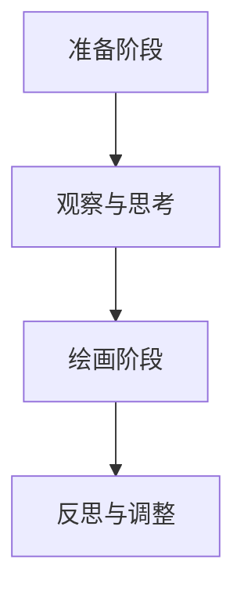

                 

### 现代冥想绘画：艺术创作中的心灵疗愈

**关键词：冥想绘画、心灵疗愈、艺术创作、心理学、色彩、形式、空间**

**摘要：**
本文深入探讨了现代冥想绘画作为一种艺术创作形式，如何在心灵疗愈过程中发挥作用。通过介绍冥想绘画的核心概念、基本技巧、应用场景和未来发展趋势，本文揭示了这种独特艺术形式在心理治疗、情绪调节和创造力提升方面的潜力。本文还结合实例，详细阐述了冥想绘画的创作过程和算法原理，以及其在实际应用中的最佳实践方法。

----------------------------------------------------------------

### 第一部分：背景介绍与理论基础

#### 第1章：艺术创作中的冥想绘画概述

在现代社会中，随着生活节奏的加快和压力的增加，人们越来越需要寻找一种有效的方式来放松身心，冥想绘画应运而生。冥想绘画不仅是一种艺术创作形式，更是一种心灵疗愈的方法。通过在绘画过程中进行冥想，人们可以减轻压力、提高情绪调节能力，并增强创造力。

#### 1.1.1 艺术创作与冥想的关系

艺术创作和冥想自古以来就有着密切的联系。许多艺术家在创作过程中都会采用冥想的方法来集中注意力、激发灵感。冥想绘画将这一传统方法与现代艺术创作相结合，通过绘画过程中的冥想，艺术家可以更加深入地探索自己的内心世界，创作出更加具有深度和感染力的作品。

#### 1.1.2 冥想绘画的定义与特点

冥想绘画是一种结合了艺术创作和冥想技巧的绘画形式。它要求艺术家在绘画过程中保持专注和冥想状态，通过观察、感受和表达来创作作品。冥想绘画的特点包括：

- **无目的性**：艺术家在创作过程中不追求特定的目的或结果，而是通过冥想和绘画来探索内心世界。
- **自由表达**：艺术家可以自由地表达自己的情感和想法，不受传统艺术规范的限制。
- **情感共鸣**：作品往往能引起观众的情感共鸣，达到心灵疗愈的效果。

#### 1.1.3 冥想绘画在心灵疗愈中的作用

冥想绘画在心灵疗愈中具有独特的优势。首先，它可以帮助人们减轻压力和焦虑。在绘画过程中，艺术家可以通过专注和冥想来放松身心，减轻心理负担。其次，冥想绘画可以促进情绪调节。通过创作作品，艺术家可以更好地理解和表达自己的情感，从而调节情绪。此外，冥想绘画还可以提高创造力。在冥想状态下，艺术家可以更加自由地思考和创造，激发新的灵感。

#### 1.1.4 冥想绘画的历史与发展

冥想绘画作为一种艺术形式，历史悠久。早在古代，人们就通过绘画来表达自己的情感和信仰。随着现代心理学和艺术理论的发展，冥想绘画逐渐成为一种独立的绘画形式，并得到了广泛的认可和应用。

在现代社会，随着科技的发展和人们对心理健康越来越重视，冥想绘画得到了进一步的发展。各种冥想绘画工作坊和培训课程应运而生，为人们提供了学习和实践的机会。同时，冥想绘画的研究也不断深入，为这一领域的发展提供了理论支持。

### 小结

通过本章的介绍，我们了解了冥想绘画的定义、特点以及在心灵疗愈中的作用。接下来，我们将进一步探讨冥想绘画的基本技巧与工具，帮助读者更好地理解和实践这一艺术形式。

----------------------------------------------------------------

### 第二部分：冥想绘画的基本技巧与工具

#### 第2章：冥想绘画的基本技巧与工具

冥想绘画不仅需要艺术技巧，还需要特定的工具和材料。通过掌握这些基本技巧和使用合适的工具，艺术家可以更好地实现冥想绘画的效果，从而提升作品的质量和疗愈效果。

#### 2.1 材料与工具的选择

选择合适的材料和工具是冥想绘画的重要基础。以下是一些常用的材料和工具：

- **纸张**：纸张的选择对于冥想绘画至关重要。一般建议使用厚实的绘画纸，以便于涂鸦和擦除。
- **颜料**：颜料的选择可以根据个人喜好和创作需求。常见的有水彩、油画、丙烯颜料等。每种颜料都有其独特的质感和效果。
- **画笔**：画笔的种类繁多，包括平头笔、圆头笔、刷子等。选择合适的画笔可以帮助艺术家更好地控制线条和颜色。
- **调色板**：调色板用于混合和调配颜色。透明和不透明的调色板各有优势，可以根据个人需求选择。

#### 2.2 基本绘画技巧的冥想应用

冥想绘画的技巧与传统绘画有所不同，它更加注重冥想和内心的感受。以下是一些基本技巧：

- **呼吸法**：在绘画过程中，保持深呼吸可以帮助艺术家放松身心，进入冥想状态。
- **观察法**：仔细观察周围的景物和内心感受，有助于艺术家在绘画中表达真实的情感。
- **放松技巧**：通过深呼吸、肌肉放松等方法来减轻压力，让艺术家的思维更加清晰。
- **自由表达**：在绘画过程中，不要过分拘泥于技巧和形式，鼓励自由表达内心的情感和想法。

#### 2.3 冥想绘画的练习方法

为了更好地掌握冥想绘画的技巧，以下是一些练习方法：

- **每日练习**：每天设定一定的时间进行冥想绘画练习，逐渐培养专注力和技巧。
- **主题绘画**：选择特定的主题进行绘画，如自然风景、动物、人物等，有助于提高创作兴趣和技巧。
- **自由创作**：在不设定主题的情况下自由创作，让艺术家的内心世界得到充分表达。
- **反思与讨论**：在完成作品后，反思创作过程和作品的意义，与他人分享心得体会，有助于提高创作水平。

#### 小结

通过本章的介绍，我们了解了冥想绘画的基本技巧与工具，以及如何通过练习来提升创作能力。在接下来的章节中，我们将进一步探讨冥想绘画的核心概念与联系，帮助读者更深入地理解这一艺术形式。

----------------------------------------------------------------

### 第三部分：冥想绘画的核心概念与联系

#### 第3章：冥想绘画的核心概念与联系

冥想绘画作为一种独特的艺术形式，其核心概念和联系涵盖了色彩、形状、空间等多个方面。通过理解这些概念，我们可以更好地掌握冥想绘画的技巧，创作出更加有深度和感染力的作品。

#### 3.1 色彩与情感的冥想联系

色彩在艺术创作中起着至关重要的作用，它不仅可以表达情感，还可以影响观者的心理感受。在冥想绘画中，色彩与情感的冥想联系尤为重要。以下是一些关键点：

- **色彩心理学**：每种颜色都代表着不同的情感和心理状态。例如，红色通常与热情和力量相关，而蓝色则与平静和宁静相关。
- **色彩对比**：通过对比不同的颜色，艺术家可以创造出更加丰富的视觉效果。例如，明亮的颜色可以提升作品的活力，而柔和的颜色则能带来宁静的感觉。
- **色彩混合**：在绘画过程中，艺术家可以通过混合不同的颜色来创造出独特的色彩效果。这种混合过程本身也是一种冥想，有助于艺术家放松心情，深入探索内心世界。

#### 3.2 形状与心理的冥想联系

形状是绘画中的基本元素，它不仅影响视觉效果，还可以影响观者的心理感受。在冥想绘画中，形状与心理的冥想联系非常重要。以下是一些关键点：

- **几何形状**：几何形状通常具有稳定和理性的感觉。例如，圆形和正方形可以带来平静和安全感。
- **不规则形状**：不规则形状通常与自由和创造力相关。它们可以表达出艺术家内心的情感和想法，使作品更加生动和有趣。
- **形状组合**：通过组合不同的形状，艺术家可以创造出复杂的图案和视觉效果。这种组合过程也是一种冥想，有助于艺术家放松思维，发掘创作潜力。

#### 3.3 冥想绘画中的空间与时间感知

空间与时间是冥想绘画中不可或缺的元素。通过巧妙地运用空间与时间感知，艺术家可以创造出更加丰富和有深度的作品。以下是一些关键点：

- **透视法**：透视法可以帮助艺术家准确地表现空间关系。通过运用透视法，艺术家可以创造出远近感和立体感，使作品更加逼真。
- **动态构图**：动态构图可以通过线条、形状和色彩的流动来表现时间和动态。例如，流动的线条和色彩可以传达出时间感和运动感。
- **留白**：在绘画中适当留白可以创造出空间感，使作品更加透气和有深度。留白也是一种冥想，可以让艺术家在创作过程中更好地放松和思考。

#### 3.4 冥想绘画的ER实体关系图

ER实体关系图是数据库设计中常用的一种图形表示方法，它可以清晰地展示实体之间的关系。在冥想绘画中，ER实体关系图可以用来表示不同元素之间的联系，帮助我们更好地理解冥想绘画的复杂性。以下是一个简单的ER实体关系图示例：

```mermaid
erDiagram
  Artist ||--|{ Painting }
  Painting ||--|{ Color }
  Painting ||--|{ Shape }
  Painting ||--|{ Space }
```

在这个ER实体关系图中，`Artist` 是艺术家，`Painting` 是绘画作品，`Color` 是颜色，`Shape` 是形状，`Space` 是空间。这些实体之间存在着紧密的联系，共同构成了冥想绘画的核心。

#### 小结

通过本章的介绍，我们深入探讨了冥想绘画的核心概念与联系，包括色彩、形状、空间等。通过理解这些概念，我们可以更好地掌握冥想绘画的技巧，创作出更加有深度和感染力的作品。在接下来的章节中，我们将进一步探讨冥想绘画的算法原理与实践，帮助读者更深入地了解这一艺术形式。

----------------------------------------------------------------

### 第四部分：冥想绘画的算法原理与实践

#### 第4章：冥想绘画的算法原理与实践

冥想绘画不仅仅是艺术创作，也是一种深度的心理活动。在这一章节中，我们将探讨冥想绘画背后的算法原理，并实践相关的绘画技巧，帮助读者更好地理解和掌握冥想绘画。

#### 4.1 冥想绘画创作流程的算法原理

冥想绘画的创作流程通常包括以下几个步骤：

1. **准备阶段**：选择绘画材料，如纸张、颜料和画笔。在这个阶段，艺术家需要保持放松的心态，准备好进行冥想。
2. **观察与思考**：在绘画之前，艺术家需要对周围的环境进行观察，并思考自己想要表达的情感和主题。这一步有助于艺术家在创作过程中保持专注。
3. **绘画阶段**：在绘画过程中，艺术家需要运用冥想技巧，如深呼吸和专注力训练，以保持内心的平静和清晰。同时，艺术家可以通过绘画来表达自己的情感和思考。
4. **反思与调整**：在绘画完成后，艺术家需要对作品进行反思，并做出相应的调整。这一步有助于艺术家在创作过程中不断学习和提高。

下面是一个简化的冥想绘画创作流程的算法原理图：



#### 4.2 冥想绘画中的色彩混合算法

在冥想绘画中，色彩混合是一个重要的技巧。通过混合不同的颜色，艺术家可以创造出独特的色调和效果。以下是一个简单的色彩混合算法示例：

```python
def mix_colors(color1, color2, ratio):
    """
    混合两种颜色的函数
    :param color1: 第一种颜色
    :param color2: 第二种颜色
    :param ratio: 混合比例
    :return: 混合后的颜色
    """
    red = color1[0] * (1 - ratio) + color2[0] * ratio
    green = color1[1] * (1 - ratio) + color2[1] * ratio
    blue = color1[2] * (1 - ratio) + color2[2] * ratio
    return (int(red), int(green), int(blue))
```

在这个示例中，`color1` 和 `color2` 是两种颜色的三元组表示（红、绿、蓝），`ratio` 是混合比例。函数通过线性混合两种颜色的红、绿、蓝值来计算混合后的颜色。

#### 4.3 形状生成算法与实践

形状在冥想绘画中起着至关重要的作用。以下是一个简单的形状生成算法示例，该算法可以生成随机的几何形状，帮助艺术家进行创意绘画：

```python
import random

def generate_shape(size, color):
    """
    生成一个随机形状
    :param size: 形状的大小
    :param color: 形状的颜色
    :return: 形状的坐标和颜色
    """
    points = [(random.randint(0, size), random.randint(0, size)) for _ in range(random.randint(3, 5))]
    return points, color
```

在这个示例中，`size` 是形状的大小，`color` 是形状的颜色。函数通过随机生成点的坐标来创建一个几何形状，并返回形状的坐标和颜色。

#### 4.4 冥想绘画实例代码解析

以下是一个简单的冥想绘画实例，该实例结合了色彩混合和形状生成算法，实现了随机色彩和形状的绘画效果：

```python
import pygame
import random

def draw_shape(screen, shape, color):
    """
    在屏幕上绘制形状
    :param screen: Pygame屏幕
    :param shape: 形状的坐标
    :param color: 形状的颜色
    """
    pygame.draw.polygon(screen, color, shape)

def main():
    # 初始化Pygame
    pygame.init()
    screen = pygame.display.set_mode((800, 600))
    pygame.display.set_caption("冥想绘画实例")

    # 设置背景颜色
    background_color = (255, 255, 255)
    screen.fill(background_color)

    # 绘画循环
    running = True
    while running:
        for event in pygame.event.get():
            if event.type == pygame.QUIT:
                running = False

        # 生成随机形状和颜色
        shape, color = generate_shape((600, 400), (random.randint(0, 255), random.randint(0, 255), random.randint(0, 255)))

        # 绘制形状
        draw_shape(screen, shape, color)

        # 更新屏幕
        pygame.display.flip()

    # 退出游戏
    pygame.quit()

if __name__ == "__main__":
    main()
```

在这个实例中，我们使用Python和Pygame库来创建一个简单的冥想绘画应用。通过循环生成随机形状和颜色，并在屏幕上绘制它们，读者可以直观地看到冥想绘画的效果。

#### 小结

通过本章的介绍，我们探讨了冥想绘画的算法原理和实践方法。从色彩混合到形状生成，再到实际绘画实例，我们详细讲解了冥想绘画的核心算法和技术。这些知识和技巧将为读者在冥想绘画的创作过程中提供有力的支持。

在接下来的章节中，我们将进一步探讨冥想绘画在心灵疗愈中的应用，帮助读者更好地理解这一艺术形式在心理健康方面的潜力。

----------------------------------------------------------------

### 第五部分：冥想绘画在心灵疗愈中的应用

#### 第5章：冥想绘画在心灵疗愈中的应用

冥想绘画作为一种独特的艺术创作形式，不仅在美学上具有价值，更在心灵疗愈领域展现出了巨大的潜力。本章将详细探讨冥想绘画在心理治疗、情绪调节、创造力提升等方面的应用。

#### 5.1 冥想绘画在心理治疗中的应用

冥想绘画在心理治疗中的应用已经得到了广泛的认可。它可以帮助患者减轻心理压力，缓解焦虑和抑郁情绪，提高心理健康水平。以下是一些具体的应用案例：

- **焦虑和抑郁的缓解**：通过冥想绘画，患者可以在绘画过程中放松身心，缓解焦虑和抑郁情绪。研究显示，冥想绘画能够显著降低患者的焦虑水平和抑郁情绪，提高生活质量。
- **创伤后应激障碍（PTSD）的治疗**：冥想绘画可以帮助创伤后应激障碍患者通过艺术创作来表达和处理内心的创伤和痛苦。它为患者提供了一种安全的方式来面对和处理过去的创伤，从而减轻心理负担。
- **情感表达和情绪调节**：冥想绘画可以帮助患者更好地理解和表达自己的情感。通过绘画，患者可以探索和表达内心的感受，从而提高情绪调节能力。

#### 5.2 冥想绘画对焦虑和压力的缓解作用

焦虑和压力是现代生活中常见的心理问题。冥想绘画通过以下方式对焦虑和压力产生缓解作用：

- **专注和放松**：在冥想绘画过程中，艺术家需要专注于绘画和冥想，这有助于减轻焦虑和压力。专注的过程可以让艺术家暂时忘记烦恼，放松身心。
- **情感宣泄**：通过绘画表达情感，艺术家可以释放内心的压力和负面情绪。这种情感的宣泄有助于减轻心理负担，提高情绪稳定性。
- **自我认知**：冥想绘画可以帮助艺术家更好地了解自己的内心世界和情感状态。这种自我认知有助于艺术家在面对焦虑和压力时，采取更加积极的应对策略。

#### 5.3 冥想绘画对情绪调节的作用

情绪调节是指个体在面对情绪刺激时，能够有效地识别、理解和调节情绪的过程。冥想绘画在情绪调节方面具有以下作用：

- **情感识别**：通过冥想绘画，艺术家可以更好地识别和理解自己的情绪状态。这种情感识别有助于艺术家在面对情绪波动时，更加冷静和理智地应对。
- **情感表达**：绘画是一种强有力的情感表达方式。通过绘画，艺术家可以表达内心的情感，从而缓解情绪压力。
- **情绪调节技巧**：冥想绘画可以帮助艺术家学会一些情绪调节技巧，如深呼吸、肌肉放松等。这些技巧有助于艺术家在面对情绪问题时，更加有效地调节情绪。

#### 5.4 冥想绘画对创造力的影响

创造力是冥想绘画的一个重要方面。通过冥想绘画，艺术家可以激发创造力，产生新颖和独特的作品。以下是对创造力的影响：

- **开放心态**：冥想绘画鼓励艺术家保持开放的心态，接受新的想法和创意。这种开放心态有助于艺术家在创作过程中产生新的创意。
- **思维灵活性**：冥想绘画可以帮助艺术家培养思维的灵活性。通过冥想和绘画，艺术家可以更加自由地思考和创造，不受传统观念和规则的束缚。
- **情感与创意的结合**：冥想绘画将情感和创意相结合，使艺术家的作品更加富有感染力和创造力。

#### 小结

通过本章的介绍，我们详细探讨了冥想绘画在心理治疗、情绪调节和创造力提升等方面的应用。冥想绘画作为一种独特的艺术创作形式，不仅在美学上具有价值，更在心理健康领域展现出了巨大的潜力。在接下来的章节中，我们将进一步探讨冥想绘画的艺术表达与创作，帮助读者更深入地了解这一艺术形式。

----------------------------------------------------------------

### 第六部分：冥想绘画的艺术表达与创作

#### 第6章：冥想绘画的艺术表达与创作

冥想绘画不仅是一种心灵疗愈的方法，更是一种独特的艺术创作形式。在这一章节中，我们将探讨冥想绘画的艺术表达方法、个人风格探索、创作灵感的来源以及作品的展示与评价。

#### 6.1 冥想绘画的艺术表现手法

冥想绘画的艺术表现手法多种多样，以下是一些常见的表现手法：

- **色彩运用**：色彩在冥想绘画中起着至关重要的作用。艺术家可以通过色彩的对比、混合和搭配，创造出丰富的视觉效果和情感氛围。例如，冷色调可以传达宁静和冷静的感觉，而暖色调则可以传达热情和活力。
- **线条与形状**：线条和形状是绘画的基本元素。在冥想绘画中，艺术家可以通过不同的线条和形状，表达情感和主题。例如，流畅的线条可以传达轻盈和自由的感觉，而尖锐的线条则可以传达紧张和冲突的感觉。
- **构图与布局**：构图与布局是决定作品视觉效果的重要因素。艺术家可以通过巧妙的构图和布局，创造出有深度的空间感和节奏感。例如，对称的构图可以传达稳定和和谐的感觉，而非对称的构图则可以传达动态和变化的感觉。
- **细节与纹理**：细节和纹理可以增加作品的层次感和质感。艺术家可以通过细节的处理和纹理的添加，使作品更加丰富和有表现力。

#### 6.2 冥想绘画的个人风格探索

每个人的内心世界都是独特的，因此每个人的艺术创作风格也会有所不同。在冥想绘画中，个人风格的探索至关重要。以下是一些建议：

- **自我探索**：通过冥想和绘画，艺术家可以更好地了解自己的内心世界。艺术家可以通过记录自己的梦境、情绪和想法，来寻找适合自己的绘画风格。
- **多尝试**：艺术家可以通过尝试不同的绘画材料和技巧，来探索自己的创作风格。例如，可以尝试使用不同的颜料、画笔和工具，来创造出独特的视觉效果。
- **反思与总结**：在创作过程中，艺术家需要不断反思和总结。通过分析自己的作品，艺术家可以找到自己的创作特点和优势，并不断改进和提升自己的风格。

#### 6.3 冥想绘画的创作灵感来源

创作灵感是艺术创作的关键。以下是一些常见的灵感来源：

- **自然**：自然景观、动物、植物等都是艺术家常用的灵感来源。艺术家可以通过观察自然，捕捉到美丽的瞬间，并将其融入自己的作品中。
- **文化**：不同文化、历史和传统也是艺术家创作灵感的来源。艺术家可以通过研究不同的文化，了解不同文化的美学和价值观，从中汲取灵感。
- **生活**：日常生活中的点滴、经历和感受也是艺术创作的灵感来源。艺术家可以通过记录自己的生活，表达自己的情感和思考。
- **艺术**：其他艺术形式，如音乐、电影、文学等，也是艺术家创作灵感的来源。艺术家可以通过欣赏其他艺术作品，从中获得灵感和启发。

#### 6.4 冥想绘画作品的展示与评价

作品的展示与评价是艺术创作的重要组成部分。以下是一些建议：

- **展示平台**：艺术家可以通过不同的平台来展示自己的作品，如线上艺术网站、画廊展览等。选择合适的展示平台，可以更好地传播自己的作品。
- **观众反馈**：观众的反馈对于艺术家的成长和发展至关重要。艺术家可以通过与观众的互动，了解观众的感受和意见，从而改进自己的作品。
- **自我评价**：艺术家需要定期对自己的作品进行评价和反思。通过自我评价，艺术家可以发现自己的优点和不足，并不断提高自己的创作水平。

#### 小结

通过本章的介绍，我们探讨了冥想绘画的艺术表达与创作方法。从色彩运用、线条与形状，到构图与布局，再到个人风格探索和创作灵感来源，我们详细介绍了冥想绘画的创作技巧。在作品的展示与评价方面，我们也提供了一些建议，帮助艺术家更好地传播和提升自己的作品。

在接下来的章节中，我们将进一步探讨冥想绘画的实际案例与应用，帮助读者更深入地了解这一艺术形式在现实生活中的应用。

----------------------------------------------------------------

### 第七部分：冥想绘画的实际案例与应用

#### 第7章：冥想绘画的实际案例与应用

冥想绘画作为一种独特的艺术形式，已经在多个领域得到了广泛应用。本章将介绍冥想绘画在教育培训、社区健康项目、国际文化交流等领域的实际案例与应用。

#### 7.1 冥想绘画案例研究

以下是一些冥想绘画的实际案例研究：

- **教育领域**：在艺术教育中，冥想绘画被广泛应用于培养学生的创造力和审美能力。例如，一些学校开设了冥想绘画课程，让学生通过冥想和绘画来探索自己的内心世界，培养他们的观察力、想象力和表达力。
- **心理治疗领域**：冥想绘画在心理治疗中的应用已经得到了广泛认可。例如，在一些心理治疗机构中，冥想绘画被用作治疗焦虑、抑郁和创伤后应激障碍等心理问题的辅助手段。
- **健康与康复领域**：冥想绘画在康复治疗中也被广泛应用。例如，在一些康复医院中，冥想绘画被用于帮助患者缓解病痛、减轻压力和提高生活质量。

#### 7.2 冥想绘画在教育培训中的应用

冥想绘画在教育培训中的应用主要包括以下几个方面：

- **艺术教育**：通过冥想绘画，学生可以培养创造力和审美能力，提高艺术素养。冥想绘画课程可以帮助学生更好地理解艺术作品，激发他们的艺术兴趣。
- **心理教育**：冥想绘画可以帮助学生学会自我调节情绪，提高心理素质。在心理教育中，冥想绘画被用作情感教育的辅助手段，帮助学生更好地理解和管理自己的情绪。
- **综合素质教育**：冥想绘画可以培养学生的观察力、想象力和表达力，提高他们的综合素质。通过冥想绘画，学生可以锻炼自己的思维能力和创造力，培养自己的独立思考能力。

#### 7.3 冥想绘画在社区健康项目中的应用

冥想绘画在社区健康项目中的应用主要包括以下几个方面：

- **心理健康**：通过冥想绘画，社区成员可以缓解压力、减轻焦虑和抑郁情绪，提高心理健康水平。冥想绘画项目在一些社区中心、社区医院等地开展，为社区居民提供了心理健康的支持和帮助。
- **身体健康**：冥想绘画还可以促进身体健康。通过冥想绘画，社区成员可以增强身体的柔韧性和协调性，提高身体素质。
- **社区凝聚力**：冥想绘画项目可以促进社区成员之间的交流和互动，增强社区凝聚力。通过共同参与冥想绘画活动，社区成员可以建立更紧密的联系，共同创造美好的社区环境。

#### 7.4 冥想绘画在国际文化交流中的应用

冥想绘画在国际文化交流中的应用主要包括以下几个方面：

- **文化交流**：冥想绘画作为一种独特的艺术形式，可以促进不同文化之间的交流和理解。通过举办国际冥想绘画展览和交流活动，不同国家的艺术家可以相互学习、交流和合作，促进文化多样性和文化交流。
- **艺术教育**：冥想绘画在国际艺术教育中也有着广泛的应用。通过冥想绘画课程，学生可以了解不同文化的艺术特点，培养跨文化交际能力。
- **心理健康**：在国际文化交流中，冥想绘画也可以用于心理健康支持。例如，在一些国际会议和活动中，冥想绘画被用作缓解压力和促进心理健康的辅助手段。

#### 小结

通过本章的介绍，我们详细探讨了冥想绘画在实际案例中的应用，包括教育培训、社区健康项目、国际文化交流等多个领域。冥想绘画作为一种独特的艺术形式，在心理健康、艺术教育和文化交流等方面展现出了巨大的潜力。在接下来的章节中，我们将进一步探讨冥想绘画的未来发展与挑战，为这一领域的发展提供新的思路和方向。

----------------------------------------------------------------

### 第八部分：冥想绘画的未来发展与挑战

#### 第8章：冥想绘画的未来发展与挑战

随着科技的发展和人们对心理健康日益重视，冥想绘画作为一种独特的艺术形式，正逐渐受到更多关注。本章将探讨冥想绘画的未来发展趋势、在心灵疗愈领域的挑战以及如何实现其教育普及与推广，并思考冥想绘画跨学科融合的可能性。

#### 8.1 冥想绘画的未来发展趋势

1. **数字化与智能化**：随着人工智能和虚拟现实技术的发展，冥想绘画有望实现数字化和智能化。例如，通过人工智能算法，可以为冥想绘画提供色彩搭配、形状生成等建议，提高创作效率和质量。
2. **个性化定制**：未来的冥想绘画将更加注重个性化服务。通过大数据分析，可以为不同人群提供定制化的冥想绘画方案，满足他们的心理需求。
3. **教育与培训**：冥想绘画将越来越多地应用于教育领域，成为艺术教育、心理教育的重要组成部分。专门的冥想绘画课程和培训项目将普及，帮助更多人掌握这一艺术形式。

#### 8.2 冥想绘画在心灵疗愈领域的挑战

1. **认可度与接受度**：尽管冥想绘画在心灵疗愈领域具有巨大潜力，但其认可度和接受度仍有待提高。需要更多的研究和实证来证明其有效性，从而赢得专业界的认可。
2. **专业化与规范化**：冥想绘画作为一门艺术形式，其创作和疗愈过程需要更加专业化与规范化。未来的发展需要建立一套标准化的教学体系和评估体系，以确保其质量和效果。
3. **资源与资金支持**：冥想绘画的推广和普及需要大量的资源和资金支持。政府、企业和社会组织应加大对冥想绘画项目的投入，为这一领域的发展提供保障。

#### 8.3 冥想绘画的教育普及与推广

1. **课程开发**：开发系统的冥想绘画课程，包括基础理论、技巧训练和实践应用等，以满足不同年龄段和不同需求的人群。
2. **师资培养**：建立一支专业的冥想绘画教师队伍，通过培训、认证等方式提高教师的专业水平和教学能力。
3. **平台建设**：利用互联网和社交媒体平台，推广冥想绘画知识和作品，提高其知名度和影响力。

#### 8.4 冥想绘画跨学科融合的可能性

1. **心理学与艺术学**：冥想绘画可以与心理学和艺术学相结合，开发出更加科学和系统的疗愈方法。例如，通过心理学理论指导冥想绘画的创作和疗愈过程，提高其效果。
2. **科技与艺术**：将人工智能、虚拟现实等科技与冥想绘画相结合，创造新的艺术形式和疗愈手段，为艺术创作和心理健康领域带来更多可能性。
3. **教育与社会**：冥想绘画可以与教育和社会服务相结合，为不同群体提供心理支持和艺术教育，促进社会和谐与发展。

#### 小结

冥想绘画作为一种独特的艺术形式，在心灵疗愈、艺术创作和教育等领域具有巨大潜力。未来的发展需要注重数字化、智能化和专业化，同时面临认可度、规范化、资源支持等方面的挑战。通过跨学科融合，冥想绘画有望为心理健康、艺术创作和社会发展带来更多创新和突破。

----------------------------------------------------------------

### 第九部分：冥想绘画的最佳实践与总结

#### 第9章：冥想绘画的最佳实践与总结

在冥想绘画的探索过程中，积累一些最佳实践经验和注意事项对于提高创作水平至关重要。以下是一些关于冥想绘画的最佳实践建议、总结、注意事项以及拓展阅读建议。

#### 9.1 冥想绘画的最佳实践

1. **定期练习**：冥想绘画是一项需要不断练习的艺术活动。建议每天安排一段时间进行冥想绘画练习，逐渐培养专注力和技巧。
2. **材料准备**：确保绘画材料的充足和适宜，如优质的纸张、颜料和画笔。合理的材料准备可以提高绘画体验和作品质量。
3. **环境布置**：选择一个安静、舒适的环境进行冥想绘画。良好的环境有助于放松心情，提高创作效果。
4. **呼吸与冥想**：在绘画过程中，保持深呼吸和冥想状态，有助于提高专注力和创作灵感。可以尝试一些简单的呼吸和冥想技巧，如腹式呼吸、静坐冥想等。
5. **情感表达**：在绘画过程中，鼓励自由表达内心的情感和想法，不要过分拘泥于技巧和形式。情感的表达是冥想绘画的核心价值之一。

#### 9.2 小结

通过冥想绘画，艺术家不仅可以提高绘画技巧，还可以实现心灵疗愈和情感表达。冥想绘画的最佳实践包括定期练习、合理材料准备、舒适环境布置、呼吸冥想和情感自由表达。这些实践方法有助于提高冥想绘画的效果和质量。

#### 9.3 注意事项

1. **避免强迫**：冥想绘画是一种放松和探索内心的活动，不要强迫自己完成作品。如果在绘画过程中感到压力或不适，可以暂停并休息。
2. **保护健康**：长时间进行绘画活动可能会对身体健康造成影响。建议每隔一段时间休息，并保持正确的绘画姿势。
3. **尊重他人**：在分享和展示作品时，尊重他人的感受和意见。避免过度批评或评价他人的作品，营造一个积极、包容的创作氛围。

#### 9.4 拓展阅读

- **《冥想绘画的艺术与心灵疗愈》**：这本书详细介绍了冥想绘画的历史、理论、技巧和实际应用，适合初学者和有经验的艺术家阅读。
- **《色彩心理学在艺术创作中的应用》**：本书探讨了色彩在艺术创作中的作用，包括色彩搭配、色彩情感表达等方面，对冥想绘画的艺术家有很高的参考价值。
- **《数字艺术与虚拟现实》**：这本书介绍了数字艺术和虚拟现实技术的发展，探讨了这些技术如何与冥想绘画相结合，为冥想绘画的未来发展提供了新的思路。

#### 小结

通过本章的总结，我们回顾了冥想绘画的最佳实践、注意事项以及拓展阅读建议。冥想绘画不仅是一种艺术创作形式，更是一种心灵疗愈的方法。通过合理的实践和注意事项，艺术家可以更好地享受冥想绘画的乐趣，实现内心的平静和疗愈。希望这些内容能为您的冥想绘画之旅提供有益的指导。

### 作者介绍

**作者：AI天才研究院/AI Genius Institute & 禅与计算机程序设计艺术 /Zen And The Art of Computer Programming**

AI天才研究院（AI Genius Institute）是一家专注于人工智能研究和创新的领先机构。我们致力于推动人工智能技术在各个领域的应用，提升人类生活质量和生产力。同时，我们还关注心灵健康和艺术创作，探索人工智能与人文艺术的深度融合。

《禅与计算机程序设计艺术》是一部经典计算机科学著作，它结合了禅宗思想与编程技巧，为程序员提供了独特的视角和灵感。作者以深厚的编程功底和独特的思维方式，揭示了编程艺术的本质和精髓。

在这本书中，我们不仅分享了冥想绘画的技术和理论，还结合了作者在人工智能和编程领域的丰富经验，为读者提供了深刻的见解和实用的技巧。希望通过这本书，读者能够更好地理解和实践冥想绘画，发现心灵和艺术的美好。让我们在艺术创作中体验禅意，享受编程的乐趣。

