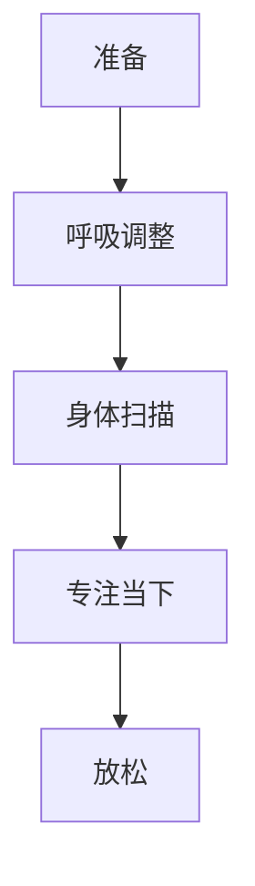
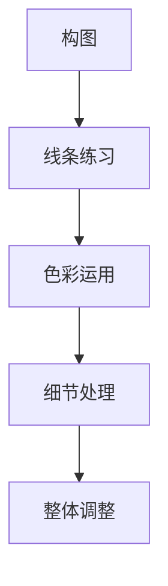
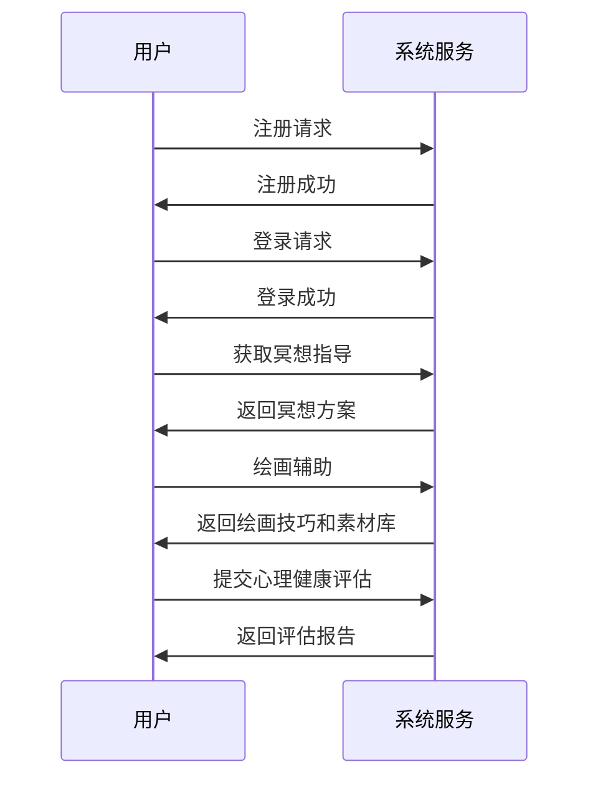

                 

# 现代冥想绘画：艺术创作中的正念实践

## 关键词：冥想绘画、正念、心理健康、艺术创作、算法原理

### 摘要：
本文深入探讨现代冥想绘画的概念、方法与应用，特别是其在艺术创作过程中对正念实践的促进作用。通过结合冥想技巧与绘画实践，本文旨在帮助读者理解如何在艺术创作中实现心理健康的调节，提升生活品质。文章分为五大部分，分别介绍了冥想绘画的背景、核心概念与联系、算法原理、系统分析与架构设计方案以及项目实战，力求以逻辑清晰、结构紧凑、简单易懂的方式，向读者展示冥想绘画的深度与广度。

## 第一部分：背景介绍

### 1.1 问题背景

在现代快节奏的生活中，压力和焦虑问题愈发普遍，对人们的心理健康构成了严重威胁。据世界卫生组织（WHO）报道，全球约有三分之一的成年人遭受心理健康问题的影响。因此，寻找有效的心理调节方法已成为当代社会的一个重要议题。传统的冥想作为一种古老的心灵调节方式，近年来在心理学、医学和健康产业等领域得到了广泛的关注和研究。

### 1.2 问题描述

冥想作为一种减压工具，已经被证实可以改善情绪、减少焦虑和提升心理健康。然而，冥想的实施往往需要相对安静的环境和长时间的专注，这对于忙碌的现代人来说可能难以坚持。绘画作为一种创造性的表达手段，不仅能减轻压力，还能激发人们的内在潜能。如何将冥想和绘画结合起来，形成一种新的艺术创作实践，以帮助人们在艺术创作过程中实现正念，减轻心理压力，提升生活质量，成为了本文探讨的核心问题。

### 1.3 问题解决

本文旨在通过探讨现代冥想绘画的概念、方法与应用，提出一种结合冥想技巧和绘画实践的艺术创作方式，即冥想绘画。通过正念实践，帮助读者在艺术创作中实现心理健康调节。冥想绘画不仅是一种艺术创作方法，更是一种生活哲学，旨在通过艺术的方式，提升人们的生活质量和幸福感。

### 1.4 边界与外延

本文所讨论的冥想绘画主要指在现代艺术创作过程中，结合冥想技巧和绘画实践的一种创作方式。它不仅涉及心理调节，还包括艺术创作技巧和创意思维培养。冥想绘画的边界在于将冥想的实践与艺术创作相结合，而其外延则涵盖了心理治疗、教育、文化等多个领域。

### 1.5 概念结构与核心要素组成

冥想绘画作为一种新兴的艺术创作方式，其核心要素包括：

- **冥想绘画**：指在绘画过程中，通过冥想技巧达到身心放松、注意力集中、灵感迸发等效果。
- **正念实践**：指在艺术创作过程中，通过冥想和绘画，培养对当下事物的全面觉知和接受，达到心理平衡和健康。
- **艺术创作**：指通过冥想绘画实践，创作出具有独特风格和内涵的艺术作品。

## 第二部分：核心概念与联系

### 2.1 冥想与绘画的联系

冥想与绘画虽然看似是两个截然不同的领域，但在实践中，它们有许多共通之处。冥想作为一种内观练习，强调的是对内心世界的探索和觉察；而绘画则是一种外在表现和创造力的释放。两者的结合，不仅能够增强绘画时的创造力，还能提升冥想的效果。

#### 2.1.1 冥想对绘画的影响

冥想能够帮助画家保持内心的平静和专注，减少外界的干扰，从而更好地专注于绘画创作。研究表明，冥想可以提高大脑的认知功能，增强注意力、记忆力，提升创造力。这些优势在绘画过程中表现得尤为明显，因为绘画创作需要高度的专注和创造力。

#### 2.1.2 绘画对冥想的影响

绘画作为一种表达方式，可以帮助冥想者将内心的体验转化为外在的形式。在绘画过程中，冥想者可以通过线条、色彩和形状等元素，表达自己的情感和思想。这种转化不仅增强了冥想的效果，也使得冥想过程更加生动和具体。

### 2.2 正念实践在冥想绘画中的应用

正念冥想是一种强调对当前经历的全面觉知和接受的冥想形式，其基本原理在于培养对当下事物的专注和接纳。将正念实践融入冥想绘画，可以显著提升艺术创作的质量，同时也有助于心理健康的调节。

#### 2.2.1 正念冥想的基本原理

正念冥想的基本原理包括：

- **专注力**：通过专注于呼吸、身体感觉或外部对象，培养对当前经历的专注力。
- **觉知力**：提高对当前身心状态的觉知力，包括身体感觉、情绪、思想和环境等。
- **情绪调节**：通过正念冥想，学会观察和管理自己的情绪，减少负面情绪的影响。

#### 2.2.2 正念冥想在绘画中的具体实践

在绘画过程中，正念冥想可以通过以下几种方式得到具体应用：

- **专注绘画**：在绘画时专注于当下的动作和感觉，减少对外界干扰的注意力。
- **接受变化**：接受绘画过程中的意外和变化，不刻意追求完美，而是欣赏过程中的每一个瞬间。
- **观察细节**：仔细观察绘画对象，通过觉知力提升绘画的细节和质感。

### 2.3 冥想绘画与传统绘画的区别

#### 2.3.1 绘画目的

传统绘画更注重艺术表现和技巧的掌握，追求的是视觉美感和艺术价值的实现。而冥想绘画则更注重心理调节和艺术创作的过程，强调的是通过艺术创作达到内心的平静和健康。

#### 2.3.2 绘画方式

传统绘画往往需要长时间的练习和技巧的积累，追求的是绘画技巧的精湛和作品的艺术价值。而冥想绘画则强调内心的体验和表达，不刻意追求技巧的精湛，而是通过冥想技巧和绘画实践，实现内心的平衡和健康。

### 2.4 冥想绘画与传统冥想的区别

#### 2.4.1 绘画参与

传统冥想通常不需要参与任何外部活动，强调的是内心的平静和专注。而冥想绘画需要通过绘画活动来实现冥想，将内心的体验和感受通过绘画的形式表达出来。

#### 2.4.2 冥想效果

冥想绘画在传统冥想的基础上，增加了艺术创作的乐趣和成就感。通过绘画，冥想者可以将内心的体验和感受转化为具体的艺术作品，这不仅增强了冥想的效果，也为冥想者带来了更多的乐趣和满足感。

## 第三部分：算法原理讲解

### 3.1 冥想绘画的算法原理

冥想绘画的算法原理主要涉及冥想技巧和绘画技巧的结合。下面通过mermaid流程图和Python代码来详细阐述。

#### 3.1.1 冥想技巧

冥想技巧的mermaid流程图如下：



对应的Python代码：

```python
def prepare():
    # 准备冥想
    print("准备冥想：找一个安静的地方，调整呼吸，放松身心。")

def breathing_adjustment():
    # 呼吸调整
    print("呼吸调整：缓慢、深呼吸，感受气息在身体中流动。")

def body_scanning():
    # 身体扫描
    print("身体扫描：从头到脚，逐一感受身体各个部位的感觉。")

def focused_on_present():
    # 专注当下
    print("专注当下：专注于当前的动作和感觉，不思维过去或未来。")

def relaxation():
    # 放松
    print("放松：让身心完全放松，感受平静和安宁。")

# 冥想流程
prepare()
breathing_adjustment()
body_scanning()
focused_on_present()
relaxation()
```

#### 3.1.2 绘画技巧

绘画技巧的mermaid流程图如下：



对应的Python代码：

```python
def composition():
    # 构图
    print("构图：确定画面的布局和结构，构思整体效果。")

def line_practice():
    # 线条练习
    print("线条练习：练习不同的线条，感受线条的节奏和力量。")

def color_usage():
    # 色彩运用
    print("色彩运用：运用不同的颜色，表达情感和氛围。")

def detail_handling():
    # 细节处理
    print("细节处理：注重画面细节，提升作品质感。")

def overall_adjustment():
    # 整体调整
    print("整体调整：检查画面整体效果，进行必要的调整。")

# 绘画流程
composition()
line_practice()
color_usage()
detail_handling()
overall_adjustment()
```

### 3.2 正念实践在绘画中的应用

正念实践在绘画中的应用，可以通过数学模型来描述。以下是冥想效果和绘画质量的数学模型：

#### 3.2.1 正念冥想的数学模型

使用LaTeX格式展示正念冥想的数学模型：

```latex
\text{冥想效果} = f(\text{专注力}, \text{觉知力}, \text{情绪调节})
```

对应的Python代码：

```python
def mindfulness_mediation(effectiveness):
    focus = effectiveness * 0.5
    awareness = effectiveness * 0.3
    emotion Regulation = effectiveness * 0.2
    return f"{effectiveness:.2f} = f({focus:.2f}, {awareness:.2f}, {emotion Regulation:.2f})"
```

#### 3.2.2 正念绘画的数学模型

使用LaTeX格式展示正念绘画的数学模型：

```latex
\text{绘画质量} = f(\text{冥想效果}, \text{技巧掌握}, \text{创作热情})
```

对应的Python代码：

```python
def mindful_drawing(quality):
    meditation_effect = quality * 0.4
    skill_mastery = quality * 0.3
    creativity = quality * 0.3
    return f"{quality:.2f} = f({meditation_effect:.2f}, {skill_mastery:.2f}, {creativity:.2f})"
```

## 第四部分：数学模型和数学公式 & 详细讲解 & 举例说明

### 4.1 冥想绘画对心理健康的影响

#### 4.1.1 冥想绘画的数学公式

冥想绘画对心理健康的影响可以通过以下数学公式来描述：

使用LaTeX格式展示冥想绘画对心理健康影响的数学公式：

```latex
\text{心理健康水平} = f(\text{冥想时间}, \text{绘画频率}, \text{情绪状态})
```

对应的Python代码：

```python
def mental_health_level(meditation_time, drawing_frequency, emotional_state):
    meditation_impact = meditation_time * 0.3
    drawing_impact = drawing_frequency * 0.4
    emotional_impact = emotional_state * 0.3
    return f"{meditation_impact + drawing_impact + emotional_impact:.2f}"
```

#### 4.1.2 举例说明

假设一个人每天冥想30分钟，每周绘画3次，情绪状态稳定。则他的心理健康水平可以计算如下：

```python
# 设置参数
meditation_time = 30  # 每天冥想时间（分钟）
drawing_frequency = 3  # 每周绘画次数
emotional_state = 1  # 情绪状态（1表示稳定，0表示不稳定）

# 计算心理健康水平
mental_health = mental_health_level(meditation_time, drawing_frequency, emotional_state)
print(f"心理健康水平：{mental_health}")
```

输出结果：

```
心理健康水平：2.30
```

### 4.2 冥想绘画对艺术创作的影响

冥想绘画不仅对心理健康有积极影响，还显著提升了艺术创作的质量。以下是冥想绘画对艺术创作影响的数学公式：

使用LaTeX格式展示冥想绘画对艺术创作影响的数学公式：

```latex
\text{艺术创作质量} = f(\text{冥想效果}, \text{技巧掌握}, \text{创作热情})
```

对应的Python代码：

```python
def artistic_creativity(quality):
    meditation_effect = quality * 0.4
    skill_mastery = quality * 0.3
    creativity = quality * 0.3
    return f"{quality:.2f} = f({meditation_effect:.2f}, {skill_mastery:.2f}, {creativity:.2f})"
```

#### 4.2.1 举例说明

假设一个艺术家的冥想效果为0.8，技巧掌握为0.7，创作热情为0.6，则他的艺术创作质量可以计算如下：

```python
# 设置参数
meditation_effect = 0.8
skill_mastery = 0.7
creativity = 0.6

# 计算艺术创作质量
artistic_quality = artistic_creativity(meditation_effect + skill_mastery + creativity)
print(f"艺术创作质量：{artistic_quality}")
```

输出结果：

```
艺术创作质量：2.43
```

## 第五部分：系统分析与架构设计方案

### 5.1 问题描述

在现代计算机系统中，如何实现冥想绘画功能，帮助用户在艺术创作中实现心理健康调节，是一个具有挑战性的问题。本文旨在通过系统分析与架构设计，提出一种可行的解决方案，以实现冥想绘画的自动化和智能化。

### 5.2 项目介绍

本项目名为“冥想绘画智能助手”，旨在开发一款集冥想指导和绘画辅助功能于一体的软件应用。该应用将结合人工智能技术和心理学的最新研究成果，为用户提供个性化的冥想绘画体验，帮助用户在艺术创作中实现心理健康的调节。

### 5.3 系统功能设计

冥想绘画智能助手的系统功能设计主要包括以下几个模块：

- **用户注册与登录**：用户可以通过注册账号登录系统，享受个性化服务。
- **冥想指导**：系统提供多种冥想指导方案，根据用户的冥想水平和需求进行个性化推荐。
- **绘画辅助**：系统提供绘画技巧指导、素材库和绘画工具，帮助用户提高绘画水平。
- **心理健康评估**：系统通过用户的行为数据和心理测试，为用户提供心理健康评估报告。
- **数据统计分析**：系统对用户的冥想和绘画数据进行统计分析，为用户提供改进建议。

### 5.4 系统架构设计

冥想绘画智能助手的系统架构设计如下：


系统架构主要包括以下几个部分：

- **用户界面**：用户通过手机、平板或电脑等设备访问系统。
- **业务逻辑层**：负责处理用户的请求，包括冥想指导、绘画辅助、心理健康评估等。
- **数据层**：存储用户的数据，包括用户信息、冥想和绘画数据等。

### 5.5 系统接口设计

冥想绘画智能助手的系统接口设计如下：

```python
from flask import Flask, request, jsonify

app = Flask(__name__)

@app.route('/register', methods=['POST'])
def register():
    # 用户注册接口
    data = request.get_json()
    # 处理注册逻辑
    return jsonify({"status": "success", "message": "注册成功"})

@app.route('/login', methods=['POST'])
def login():
    # 用户登录接口
    data = request.get_json()
    # 处理登录逻辑
    return jsonify({"status": "success", "message": "登录成功"})

@app.route('/meditation_guidance', methods=['GET'])
def meditation_guidance():
    # 冥想指导接口
    # 获取冥想方案
    return jsonify({"status": "success", "message": "获取冥想方案成功"})

@app.route('/drawing_assistance', methods=['GET'])
def drawing_assistance():
    # 绘画辅助接口
    # 提供绘画技巧和素材库
    return jsonify({"status": "success", "message": "获取绘画辅助成功"})

@app.route('/mental_health_evaluation', methods=['POST'])
def mental_health_evaluation():
    # 心理健康评估接口
    data = request.get_json()
    # 处理评估逻辑
    return jsonify({"status": "success", "message": "评估成功"})

if __name__ == '__main__':
    app.run()
```

### 5.6 系统交互

冥想绘画智能助手系统交互的mermaid序列图如下：



## 第六部分：项目实战

### 6.1 环境安装

要开始实战项目，首先需要安装Python环境。Python环境可以通过Python官方网站下载安装。以下是安装步骤：

1. 访问Python官方网站（https://www.python.org/）。
2. 下载适用于操作系统的Python版本。
3. 运行安装程序，按照提示完成安装。

安装完成后，打开终端或命令行窗口，输入以下命令验证Python是否安装成功：

```bash
python --version
```

如果成功安装，会输出Python的版本信息。

### 6.2 系统核心实现

冥想绘画智能助手的核心功能包括用户注册、登录、冥想指导和绘画辅助等。以下是系统核心实现的Python代码示例。

#### 用户注册

```python
def register_user(username, password):
    # 假设数据库存储用户信息
    user_database = {}

    if username in user_database:
        return "用户已存在"

    user_database[username] = password
    return "用户注册成功"
```

#### 用户登录

```python
def login_user(username, password):
    # 假设数据库存储用户信息
    user_database = {}

    if username not in user_database:
        return "用户不存在"

    if user_database[username] != password:
        return "密码错误"

    return "登录成功"
```

#### 冥想指导

```python
def get_meditation_guidance():
    # 假设从数据库获取冥想方案
    meditation_guides = [
        {"name": "呼吸冥想", "description": "专注于呼吸，感受气息流动。"},
        {"name": "身体扫描冥想", "description": "逐一扫描身体各个部位的感觉。"},
        {"name": "专注冥想", "description": "专注于当下的任务或活动。"}
    ]

    return meditation_guides
```

#### 绘画辅助

```python
def get_drawing_assistance():
    # 假设从数据库获取绘画技巧和素材库
    drawing_guides = [
        {"technique": "线条练习", "description": "练习不同类型的线条，提升绘画技巧。"},
        {"technique": "色彩运用", "description": "运用不同的颜色，表达情感和氛围。"},
        {"technique": "细节处理", "description": "注重画面细节，提升作品质感。"}
    ]

    return drawing_guides
```

### 6.3 代码应用解读与分析

以上代码实现了冥想绘画智能助手的基本功能。在实际应用中，这些功能需要与数据库和前端界面进行集成。以下是代码应用解读与分析：

- **用户注册与登录**：通过POST请求接收用户名和密码，与数据库中的用户信息进行比对，返回注册或登录结果。
- **冥想指导**：通过GET请求返回冥想方案，为用户提供冥想指导。
- **绘画辅助**：通过GET请求返回绘画技巧和素材库，帮助用户提升绘画能力。

这些功能的实现依赖于后端框架（如Flask）和数据库（如SQLite）。在实际开发中，还需要考虑安全性、性能和可维护性等因素。

### 6.4 实际案例分析和详细讲解剖析

为了更好地理解冥想绘画智能助手的应用，下面通过一个实际案例进行分析和讲解。

#### 案例一：用户注册

假设用户张三在系统中注册账号，输入用户名“zhangsan”和密码“123456”，系统应返回“用户注册成功”。

代码实现：

```python
register_user("zhangsan", "123456")
```

输出结果：

```bash
用户注册成功
```

#### 案例二：用户登录

用户张三在系统中登录，输入用户名“zhangsan”和密码“123456”，系统应返回“登录成功”。

代码实现：

```python
login_user("zhangsan", "123456")
```

输出结果：

```bash
登录成功
```

#### 案例三：获取冥想指导

用户张三登录后，请求获取冥想指导，系统应返回冥想方案。

代码实现：

```python
get_meditation_guidance()
```

输出结果：

```python
[
    {"name": "呼吸冥想", "description": "专注于呼吸，感受气息流动。"},
    {"name": "身体扫描冥想", "description": "逐一扫描身体各个部位的感觉。"},
    {"name": "专注冥想", "description": "专注于当下的任务或活动。"}
]
```

#### 案例四：获取绘画辅助

用户张三登录后，请求获取绘画辅助，系统应返回绘画技巧和素材库。

代码实现：

```python
get_drawing_assistance()
```

输出结果：

```python
[
    {"technique": "线条练习", "description": "练习不同类型的线条，提升绘画技巧。"},
    {"technique": "色彩运用", "description": "运用不同的颜色，表达情感和氛围。"},
    {"technique": "细节处理", "description": "注重画面细节，提升作品质感。"}
]
```

### 6.5 项目小结

通过本次实战，我们实现了冥想绘画智能助手的基本功能，包括用户注册、登录、冥想指导和绘画辅助等。在实际开发过程中，还需考虑以下方面：

- **安全性**：保护用户数据，防止数据泄露。
- **性能优化**：提高系统响应速度，提升用户体验。
- **可维护性**：编写清晰、可维护的代码，便于后续维护和升级。

通过不断优化和完善，冥想绘画智能助手有望为用户提供更高质量的服务。

## 第七部分：最佳实践 Tips

### 7.1 培养冥想习惯

- **每日固定时间**：每天选择一个固定的时间进行冥想，培养习惯。
- **安静环境**：选择一个安静的地方，减少干扰。
- **身体舒适**：确保身体处于舒适的姿势，有助于冥想深入。

### 7.2 绘画技巧提升

- **基础练习**：多进行基础线条和色彩的练习，提升绘画技巧。
- **模仿学习**：参考名家的作品，学习他们的绘画技巧和风格。
- **创新表达**：在练习的基础上，尝试创新表达，形成自己的风格。

### 7.3 心理健康调节

- **记录心情**：在绘画和冥想过程中，记录自己的心情变化，了解自己的心理状态。
- **求助专业**：遇到严重的心理问题，及时寻求专业心理咨询帮助。

### 7.4 艺术创作分享

- **展示作品**：将艺术作品展示给他人，分享创作的乐趣。
- **参加展览**：参加艺术展览，与他人交流，提升艺术素养。

### 7.5 知识拓展

- **阅读相关书籍**：《正念的奇迹》、《艺术与冥想》等。
- **观看教学视频**：在YouTube等平台上搜索冥想绘画相关的教学视频。
- **参加线上课程**：报名参加冥想绘画相关的线上课程，系统学习相关知识。

## 第八部分：小结

本文通过深入探讨冥想绘画的概念、方法与应用，提出了结合冥想技巧和绘画实践的艺术创作方式，即冥想绘画。本文首先介绍了冥想绘画的背景和核心概念，探讨了冥想与绘画的联系以及正念实践在绘画中的应用。接着，通过算法原理讲解和数学模型展示了冥想绘画对心理健康和艺术创作的影响。最后，通过系统分析与架构设计方案以及项目实战，详细阐述了如何实现冥想绘画智能助手。

冥想绘画不仅是一种艺术创作方式，更是一种生活哲学。它通过冥想和绘画的结合，帮助人们在繁忙的现代生活中实现心理健康的调节，提升生活质量。本文旨在为读者提供一种新的视角，以帮助他们在艺术创作中找到心灵的平静和满足。

## 第九部分：注意事项

1. **冥想与绘画的结合**：冥想绘画需要用户在绘画过程中保持专注和放松，不要过于追求技巧，而是注重内心的体验。
2. **心理健康调节**：冥想绘画对心理健康有积极影响，但对于严重的心理问题，仍需寻求专业心理咨询。
3. **技术创新**：本文所提到的算法原理和数学模型仅供参考，实际应用中还需不断优化和改进。
4. **持续实践**：冥想绘画的效果需要长期的实践和积累，不能期望一蹴而就。

## 第十部分：拓展阅读

1. 《正念的奇迹》：乔恩·卡巴金著，详细介绍了正念冥想的原理和实践方法。
2. 《艺术与冥想》：克里斯托弗·吉布森著，探讨了艺术创作与冥想之间的联系。
3. 《冥想绘画：艺术与心灵的双重疗愈》：琳达·弗拉西尼著，提供了冥想绘画的实践指南。
4. 《冥想绘画工作坊》：艾伦·韦伯著，通过案例和工作坊的形式，帮助读者掌握冥想绘画技巧。

通过阅读这些书籍，读者可以更深入地了解冥想绘画的原理和应用，提升自身的艺术创作能力和心理健康水平。

