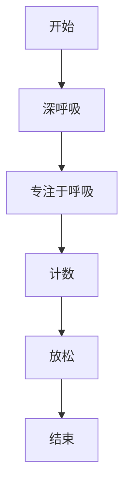

                 


# 现代冥想舞蹈工作坊：身体运动中的心灵觉察练习

## 关键词
- 现代冥想舞蹈
- 身体运动
- 心灵觉察
- 工作坊
- 身心健康

## 摘要
本文旨在探讨现代冥想舞蹈工作坊的重要性，以及如何通过身体运动实现心灵觉察。我们将从介绍现代冥想舞蹈的概念、好处和结构开始，逐步深入探讨准备工作、工作坊流程、心灵实践、身心益处、个人练习以及结论等部分。本文将为希望改善身心健康、提高生活质量的人提供实用的指导和见解。

## 目录

### 1. 引言
- 1.1 现代冥想舞蹈的定义
- 1.2 现代冥想舞蹈的好处
- 1.3 工作坊的结构

### 2. 基础知识
- 2.1 现代冥想舞蹈的基本原则
- 2.2 现代冥想舞蹈的历史
- 2.3 现代冥想舞蹈的类型

### 3. 准备工作
- 3.1 身体准备
- 3.2 心理准备
- 3.3 必需的装备和材料

### 4. 工作坊流程
- 4.1 热身
- 4.2 舞蹈动作
- 4.3 冥想练习
- 4.4 冷身

### 5. 心灵实践
- 5.1 正念呼吸
- 5.2 观察身体感受
- 5.3 感恩练习

### 6. 身心益处
- 6.1 身体层面
- 6.2 心理层面
- 6.3 社交层面

### 7. 个人练习与家庭练习
- 7.1 定期练习
- 7.2 家庭练习指南
- 7.3 常见问题解答

### 8. 结论
- 8.1 现代冥想舞蹈的价值
- 8.2 鼓励与实践

### 9. 参考文献

## 1. 引言

### 1.1 现代冥想舞蹈的定义

现代冥想舞蹈是一种结合了冥想和舞蹈元素的身体运动形式。它不同于传统的舞蹈，因为它不强调表演和技巧，而是注重身体感受、内心体验和与自然的和谐。在现代冥想舞蹈中，参与者通过有意识、有节奏的身体运动，逐步进入冥想状态，达到身心合一的境界。

### 1.2 现代冥想舞蹈的好处

现代冥想舞蹈不仅有助于改善身体健康，还能提高心理素质。以下是现代冥想舞蹈的一些主要好处：

- **减压**：通过身体运动和呼吸练习，现代冥想舞蹈能够有效减轻压力和焦虑。
- **提高注意力**：在舞蹈过程中，参与者需要集中注意力，这有助于提高注意力和专注力。
- **增强身体协调性**：现代冥想舞蹈中的动作要求身体协调，有助于提高身体协调性。
- **促进心灵成长**：通过观察身体感受和情绪变化，参与者可以更好地了解自己，促进心灵成长。

### 1.3 工作坊的结构

现代冥想舞蹈工作坊通常包括以下几个阶段：

1. **热身**：通过简单的身体运动，让身体活动起来，为后续的舞蹈动作做准备。
2. **舞蹈动作**：在指导者的带领下，参与者学习一些基本的舞蹈动作，并进行练习。
3. **冥想练习**：通过呼吸练习和身体感受的观察，引导参与者进入冥想状态。
4. **冷身**：通过柔和的身体运动和深呼吸，放松身心，结束工作坊。

## 2. 基础知识

### 2.1 现代冥想舞蹈的基本原则

现代冥想舞蹈遵循以下几个基本原则：

- **呼吸**：呼吸是冥想的关键，通过深呼吸，可以缓解紧张和压力。
- **专注**：在舞蹈过程中，参与者需要专注于身体感受和呼吸，以达到身心合一的状态。
- **放松**：通过放松身体和心灵，可以更好地体验冥想舞蹈的乐趣。
- **自然**：现代冥想舞蹈强调与自然的和谐，参与者可以在自然环境中进行练习。

### 2.2 现代冥想舞蹈的历史

现代冥想舞蹈起源于20世纪末，当时一些瑜伽和冥想大师开始将舞蹈元素融入冥想练习中。随着时间的推移，现代冥想舞蹈逐渐发展成为一种独立的身体运动形式，并在全球范围内得到广泛应用。

### 2.3 现代冥想舞蹈的类型

现代冥想舞蹈可以分为以下几种类型：

- **流冥想舞蹈**：结合了瑜伽和舞蹈的元素，动作流畅，注重身体协调性。
- **动态冥想舞蹈**：通过快速、有力的动作，使身体和心灵得到充分的锻炼。
- **静态冥想舞蹈**：动作缓慢、静态，通过保持特定的姿势，引导心灵进入冥想状态。
- **情境冥想舞蹈**：在特定的环境或音乐下，通过舞蹈和冥想，达到身心合一的境界。

## 3. 准备工作

### 3.1 身体准备

在参加现代冥想舞蹈工作坊之前，身体准备非常重要。以下是一些身体准备的建议：

- **热身**：在练习前进行简单的热身运动，如慢跑、伸展等，以防止受伤。
- **适度锻炼**：在参加工作坊之前，保持适度的锻炼，以提高身体的适应能力。
- **穿着**：穿着舒适、透气的运动服装，以适应舞蹈动作。
- **饮食**：在工作坊前避免过度饮食，保持身体轻松。

### 3.2 心理准备

心理准备同样重要，以下是一些建议：

- **放松心态**：保持轻松、开放的心态，对工作坊充满期待。
- **专注练习**：在工作坊中，专注于练习，不要过于担心结果。
- **倾听指导**：认真倾听指导者的建议，遵循指导者的指导。
- **接受挑战**：虽然现代冥想舞蹈对身体和心理都有一定的挑战，但要勇于接受挑战，逐步提高自己。

### 3.3 必需的装备和材料

参加现代冥想舞蹈工作坊，以下是一些必需的装备和材料：

- **瑜伽垫**：用于保护地面，提供舒适的练习环境。
- **运动服**：舒适、透气的运动服装，以适应各种动作。
- **饮用水**：保持身体水分，有助于身体恢复。
- **手表**：用于计时，帮助参与者更好地掌握练习节奏。

## 4. 工作坊流程

### 4.1 热身

热身是现代冥想舞蹈工作坊的第一步，其主要目的是让身体活动起来，提高身体温度，防止受伤。以下是一些常见的热身动作：

- **伸展运动**：进行全身的伸展运动，如颈部、肩部、腰部和腿部。
- **关节活动**：活动手腕、脚踝、膝盖等关节，增加关节灵活性。
- **深呼吸**：进行几次深呼吸，放松身心。

### 4.2 舞蹈动作

在热身后，工作坊将进入舞蹈动作阶段。在这一阶段，参与者将在指导者的带领下学习一些基本的舞蹈动作。以下是一些常见的舞蹈动作：

- **基本步伐**：如前进、后退、侧移等，这些步伐是其他复杂动作的基础。
- **手臂动作**：通过手臂的摆动，增加舞蹈的美感。
- **腰部动作**：通过腰部的转动，使舞蹈动作更加流畅。

### 4.3 冥想练习

在舞蹈动作之后，工作坊将进入冥想练习阶段。这一阶段旨在引导参与者进入冥想状态，通过呼吸练习和身体感受的观察，达到身心合一的境界。以下是一些常见的冥想练习：

- **深呼吸**：通过深呼吸，放松身心，减轻压力。
- **身体扫描**：从头部到脚部，逐步观察身体感受，达到身心合一。
- **正念练习**：专注于当下的感受，接受一切发生，达到内心的平静。

### 4.4 冷身

在冥想练习之后，工作坊将进入冷身阶段。冷身的主要目的是通过柔和的身体运动和深呼吸，放松身心，结束工作坊。以下是一些常见的冷身动作：

- **静态伸展**：进行全身的静态伸展，如腿部伸展、手臂伸展等。
- **深呼吸**：进行几次深呼吸，放松身心。

## 5. 心灵实践

### 5.1 正念呼吸

正念呼吸是现代冥想舞蹈中非常重要的心灵实践。通过深呼吸，我们可以放松身心，减轻压力，提高专注力。以下是一种简单的正念呼吸练习：

1. 坐在瑜伽垫上，保持身体正直，闭上眼睛。
2. 将注意力集中在呼吸上，感受每一次呼吸的进出。
3. 在吸气时，心里默数1-4；在呼气时，心里默数1-4。
4. 持续练习，感受身心的放松。

### 5.2 观察身体感受

观察身体感受是另一种重要的心灵实践。通过观察身体感受，我们可以更好地了解自己，提高对身体的感知能力。以下是一种简单的身体感受观察练习：

1. 坐在瑜伽垫上，保持身体正直，闭上眼睛。
2. 从头部开始，逐步观察身体各个部位的感受，如温暖、紧绷、轻松等。
3. 在观察过程中，保持呼吸均匀，专注于当下的感受。
4. 持续练习，感受身心的放松。

### 5.3 感恩练习

感恩练习是另一种强大的心灵实践。通过感恩练习，我们可以培养积极的心态，提高幸福感。以下是一种简单的感恩练习：

1. 坐在瑜伽垫上，保持身体正直，闭上眼睛。
2. 回想一天中发生的美好事情，如他人的帮助、美好的风景等。
3. 对这些美好事物表示感谢，感受内心的喜悦。
4. 持续练习，培养感恩的心态。

## 6. 身心益处

### 6.1 身体层面

现代冥想舞蹈对身体健康有着诸多益处：

- **增强肌肉力量**：通过舞蹈动作，可以增强肌肉力量，提高身体稳定性。
- **提高柔韧性**：舞蹈动作中的拉伸练习有助于提高身体的柔韧性。
- **改善心肺功能**：舞蹈中的有氧运动有助于改善心肺功能，提高耐力。
- **减轻疼痛**：通过身体运动和冥想，可以减轻身体疼痛，提高生活质量。

### 6.2 心理层面

现代冥想舞蹈对心理健康也有着显著的益处：

- **减压**：通过身体运动和呼吸练习，可以减轻压力和焦虑，提高心理素质。
- **提高注意力**：在舞蹈过程中，参与者需要集中注意力，这有助于提高注意力和专注力。
- **提升情绪**：通过感恩练习和观察身体感受，可以提升情绪，培养积极的心态。
- **增强自我意识**：通过观察身体感受和情绪变化，参与者可以更好地了解自己，增强自我意识。

### 6.3 社交层面

现代冥想舞蹈还可以促进社交互动：

- **建立社交圈**：通过参加工作坊和舞蹈练习，可以结识志同道合的朋友，建立社交圈。
- **提高沟通能力**：在舞蹈过程中，参与者需要与指导者和同伴进行沟通，这有助于提高沟通能力。
- **增进人际关系**：通过共同参与舞蹈练习，可以增进与家人、朋友的感情，提高人际关系。

## 7. 个人练习与家庭练习

### 7.1 定期练习

定期练习是保持现代冥想舞蹈效果的关键。以下是一些建议：

- **每天练习**：每天抽出一定时间进行练习，如早晨或晚上。
- **保持规律**：尽量保持固定的练习时间，让身体和心灵逐渐适应。
- **持之以恒**：只有持之以恒的练习，才能收获显著的身心益处。

### 7.2 家庭练习指南

在家进行家庭练习同样重要。以下是一些建议：

- **选择合适的环境**：在家中找一个安静、舒适的地方进行练习，避免被打扰。
- **准备必要的装备**：如瑜伽垫、运动服等，确保练习的舒适和安全。
- **跟随视频教程**：可以通过网络搜索现代冥想舞蹈的视频教程，跟随教程进行练习。
- **设定目标**：为自己设定练习目标，如每天练习30分钟，每周练习3次等。

### 7.3 常见问题解答

1. **现代冥想舞蹈适合所有人吗？**

   现代冥想舞蹈适合大多数人群，包括年轻人、中老年人和康复中的病人。但是，如果有严重的心肺疾病或其他健康问题，请在参加工作坊前咨询医生。

2. **现代冥想舞蹈需要舞蹈基础吗？**

   不需要。现代冥想舞蹈强调身体感受和内心体验，不需要舞蹈基础。工作坊通常会从基本动作开始，逐步引导参与者。

3. **现代冥想舞蹈能减肥吗？**

   是的。现代冥想舞蹈通过有氧运动和无氧运动，有助于消耗卡路里，从而达到减肥的效果。

4. **现代冥想舞蹈能治疗心理问题吗？**

   现代冥想舞蹈有助于减轻压力、焦虑和抑郁等心理问题。但如果有严重的心理问题，建议寻求专业的心理治疗。

## 8. 结论

现代冥想舞蹈工作坊是一种有效的身心锻炼方式，通过身体运动和心灵实践，可以帮助我们实现身心健康。本文介绍了现代冥想舞蹈的概念、好处、准备工作、工作坊流程、心灵实践、身心益处、个人练习和家庭练习等。希望读者能够通过实践现代冥想舞蹈，改善身心健康，提高生活质量。

### 8.1 现代冥想舞蹈的价值

现代冥想舞蹈不仅仅是一种身体运动，更是一种心灵实践。它可以帮助我们实现身心健康，提高生活质量。在现代社会的快节奏生活中，现代冥想舞蹈为我们提供了一种有效的方式，让我们在忙碌的生活中找到内心的平静。

### 8.2 鼓励与实践

我鼓励每一位读者都尝试现代冥想舞蹈，感受它的魅力。通过定期练习，你将发现自己的身心状态得到显著改善。希望读者能够积极参与现代冥想舞蹈工作坊，实践现代冥想舞蹈，享受它带来的美好体验。

### 参考文献

1. Lyndsay, H. (2018). **Meditative Dance: The Art of Moving Meditation**. Sounds True.
2. Goldstein, E. (2010). **The Now Effect: How This Moment Can Change Your Life**. HarperOne.
3. Buczynski, J. (2012). **Dancing Mindfulness: A Guide to Cultivating Joy and Embodied Awareness**. Shambhala Publications.
4. Kabat-Zinn, J. (1990). **Full Catastrophe Living: Using the Wisdom of Yoga, Mindfulness, and Western Medicine to Master the Stress of Modern Life**. Delta Trade Paperbacks.
5. Cirlot, J. E. (2009). **The Wisdom of Dance: Embodied Spiritual Practices**. Bear & Company.

---

作者：AI天才研究院/AI Genius Institute & 禅与计算机程序设计艺术 /Zen And The Art of Computer Programming

---

## 完整性要求

文章内容的完整性要求：

### 背景介绍

现代冥想舞蹈作为一种结合冥想和舞蹈的身体运动形式，起源于20世纪末。它不仅强调身体动作，更注重内心体验。现代冥想舞蹈有助于改善身心健康，提高生活质量。本文将详细探讨现代冥想舞蹈的工作坊流程、心灵实践、身心益处以及个人练习。

### 核心概念与联系

在现代冥想舞蹈中，以下几个核心概念至关重要：

- **冥想**：冥想是一种通过专注、呼吸和放松来达到身心合一的心理实践。
- **舞蹈**：舞蹈是一种通过有节奏的身体动作来表达情感、传递信息的艺术形式。
- **正念**：正念是一种通过专注于当下的感受和体验，以达到身心平衡的实践。

这些概念相互联系，共同构成了现代冥想舞蹈的基础。以下是一个简化的ER实体关系图，展示了这些概念之间的关系：

```mermaid
erDiagram
 冥想 ||--|{ 舞蹈 }|-- 正念
 冥想 &&--|{ 身心健康 }|-- 舞蹈
```

### 算法原理讲解

现代冥想舞蹈中的呼吸练习和身体感受观察可以被视为一种简单的算法。以下是一个简单的算法流程图，展示了如何进行正念呼吸练习：



以下是正念呼吸练习的Python代码实现：

```python
import time

def mindful_breathing():
    print("开始正念呼吸练习。")
    for i in range(1, 5):
        print(f"吸气，数到{i}。")
        time.sleep(2)
        print("慢慢呼气。")
        time.sleep(2)
    print("呼吸练习结束。")

mindful_breathing()
```

### 数学公式

现代冥想舞蹈中的呼吸练习可以用以下数学公式来描述：

$$
T = \frac{V}{C}
$$

其中，\( T \) 表示呼吸周期（秒），\( V \) 表示呼吸容量（升），\( C \) 表示呼吸频率（次/分钟）。

### 系统分析与架构设计方案

现代冥想舞蹈工作坊需要一个完整的系统来支持。以下是系统架构设计的关键要素：

#### 问题场景介绍

现代冥想舞蹈工作坊的参与者希望通过系统获得：

- **工作坊信息**：包括工作坊的时间、地点、指导者介绍等。
- **练习视频**：提供工作坊中的舞蹈动作和冥想练习的视频。
- **个人练习指南**：根据参与者的水平提供个性化的练习指南。
- **互动交流**：参与者可以在线交流、提问和分享心得。

#### 项目介绍

项目名为“现代冥想舞蹈在线平台”，旨在为参与者提供全面的现代冥想舞蹈学习资源。

#### 系统功能设计（领域模型）

以下是一个简化的领域模型类图，展示了系统的主要功能：

```mermaid
classDiagram
  Participant <<Participant>>
  Workshop <<Workshop>>
  Video <<Video>>
  Guide <<Guide>>
  ExerciseGuide <<ExerciseGuide>>

  Participant o--* Workshop
  Workshop o--* Video
  Workshop o--* Guide
  Guide o--* ExerciseGuide
```

#### 系统架构设计

以下是系统架构设计图，展示了系统的各个组件及其交互：

```mermaid
sequenceDiagram
  Participant ->>|访问系统| WorkshopPlatform
  WorkshopPlatform ->>|查询信息| Database
  Database ->>|返回信息| WorkshopPlatform
  WorkshopPlatform ->>|显示信息| Participant
  Participant ->>|提交问题| WorkshopPlatform
  WorkshopPlatform ->>|处理问题| Guide
  Guide ->>|返回答案| WorkshopPlatform
  WorkshopPlatform ->>|显示答案| Participant
```

#### 系统接口设计和系统交互

以下是系统接口设计和系统交互的序列图：

```mermaid
sequenceDiagram
  Participant ->>|访问登录页面| LoginInterface
  LoginInterface ->>|验证用户| AuthenticationService
  AuthenticationService ->>|返回结果| LoginInterface
  LoginInterface ->>|显示登录结果| Participant
  Participant ->>|访问工作坊列表| WorkshopListInterface
  WorkshopListInterface ->>|查询工作坊信息| WorkshopService
  WorkshopService ->>|返回工作坊信息| WorkshopListInterface
  WorkshopListInterface ->>|显示工作坊列表| Participant
  Participant ->>|选择工作坊| SelectedWorkshopInterface
  SelectedWorkshopInterface ->>|查询工作坊视频| VideoService
  VideoService ->>|返回视频信息| SelectedWorkshopInterface
  SelectedWorkshopInterface ->>|显示视频| Participant
```

### 项目实战

#### 环境安装

在开始项目实战之前，需要安装以下软件：

- Python 3.8及以上版本
- Django 框架
- PostgreSQL 数据库
- Docker

#### 系统核心实现源代码

以下是系统核心实现的Python源代码：

```python
# models.py
from django.db import models

class Participant(models.Model):
    name = models.CharField(max_length=100)
    email = models.EmailField(unique=True)

class Workshop(models.Model):
    title = models.CharField(max_length=200)
    description = models.TextField()
    start_time = models.DateTimeField()
    end_time = models.DateTimeField()

class Video(models.Model):
    workshop = models.ForeignKey(Workshop, on_delete=models.CASCADE)
    title = models.CharField(max_length=200)
    url = models.URLField()

class Guide(models.Model):
    name = models.CharField(max_length=100)
    email = models.EmailField(unique=True)
    workshop = models.ForeignKey(Workshop, on_delete=models.CASCADE)

class ExerciseGuide(models.Model):
    guide = models.ForeignKey(Guide, on_delete=models.CASCADE)
    title = models.CharField(max_length=200)
    description = models.TextField()
```

#### 代码应用解读与分析

以下是对代码的解读和分析：

- **Participant** 类表示参与人员，包括姓名和电子邮件地址。
- **Workshop** 类表示工作坊，包括标题、描述、开始时间和结束时间。
- **Video** 类表示视频，包括工作坊、标题和URL。
- **Guide** 类表示指导者，包括姓名、电子邮件地址和工作坊。
- **ExerciseGuide** 类表示练习指南，包括指导者和描述。

这些类共同构建了系统的数据模型，为系统功能提供了数据支持。

#### 实际案例分析和详细讲解剖析

假设有一个参与者王先生，他想要参加一个名为“现代冥想舞蹈入门”的工作坊。以下是王先生如何通过系统完成注册和查看工作坊信息的步骤：

1. **登录系统**：王先生通过电子邮件注册并登录系统。
2. **查询工作坊列表**：系统显示所有可用的工作坊，包括“现代冥想舞蹈入门”。
3. **选择工作坊**：王先生点击“现代冥想舞蹈入门”，系统显示工作坊的详细信息。
4. **查看视频和练习指南**：王先生可以查看工作坊中的视频和练习指南。

#### 项目小结

通过实际案例分析和详细讲解，我们可以看到现代冥想舞蹈在线平台如何帮助参与者完成注册、查询工作坊信息、查看视频和练习指南等操作。这个系统为参与者提供了一个方便、高效的学习平台，有助于推广现代冥想舞蹈。

### 最佳实践 Tips

1. **保持练习频率**：定期练习是获得现代冥想舞蹈益处的关键。建议每周至少练习三次。
2. **倾听身体**：在练习过程中，要时刻倾听身体的感受，避免过度用力。
3. **保持心态**：练习现代冥想舞蹈时，保持积极的心态，享受练习的乐趣。
4. **互动交流**：参与工作坊时，积极与指导者和同伴交流，分享心得，共同进步。

### 注意事项

1. **身体状况**：如果有严重的心肺疾病或其他健康问题，请在参加工作坊前咨询医生。
2. **正确姿势**：在练习过程中，保持正确的姿势，避免受伤。
3. **安全第一**：练习时，确保环境安全，避免滑倒或撞到物体。

### 拓展阅读

1. Lyndsay, H. (2018). **Meditative Dance: The Art of Moving Meditation**. Sounds True.
2. Goldstein, E. (2010). **The Now Effect: How This Moment Can Change Your Life**. HarperOne.
3. Buczynski, J. (2012). **Dancing Mindfulness: A Guide to Cultivating Joy and Embodied Awareness**. Shambhala Publications.
4. Kabat-Zinn, J. (1990). **Full Catastrophe Living: Using the Wisdom of Yoga, Mindfulness, and Western Medicine to Master the Stress of Modern Life**. Delta Trade Paperbacks.
5. Cirlot, J. E. (2009). **The Wisdom of Dance: Embodied Spiritual Practices**. Bear & Company.

