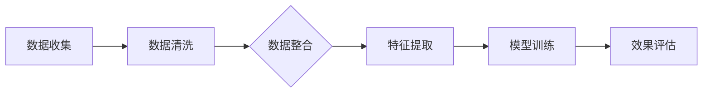
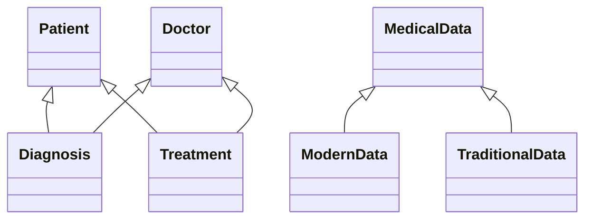
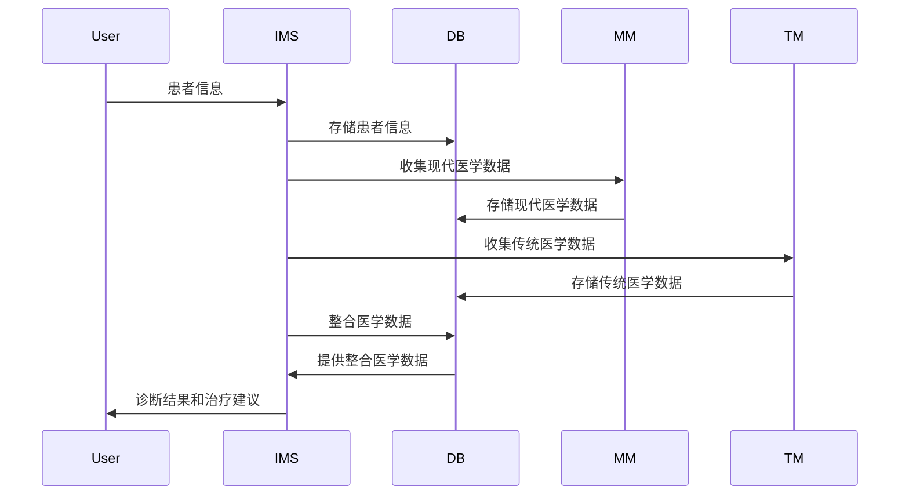
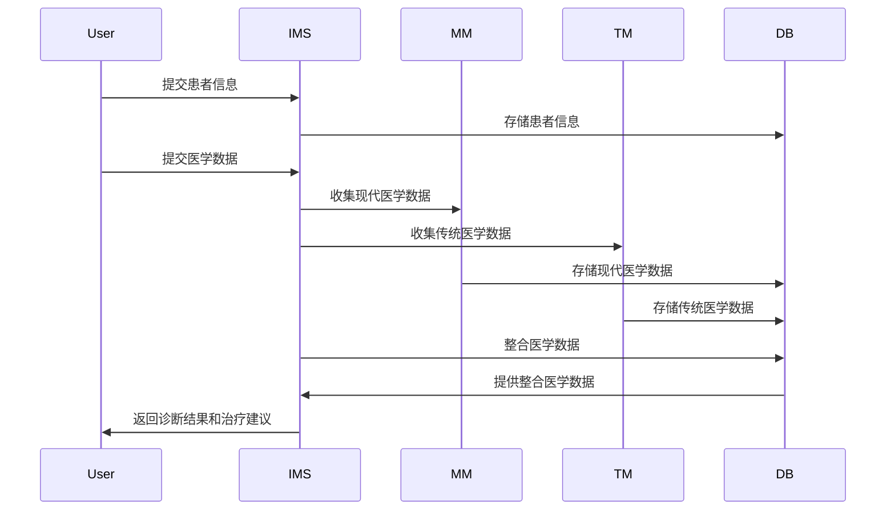

                 

### 第一部分：背景介绍

#### 1.1 问题背景

在当今社会，医学技术的迅猛发展带来了现代医学的辉煌成果。从疾病的诊断到治疗，现代医学依赖先进的科学理论和先进的医疗技术，为人类健康作出了巨大的贡献。例如，基因测序、精准医疗、生物技术等前沿技术的应用，使得医生能够在分子水平上对疾病进行诊断和治疗，从而提高了医疗效果。

与此同时，传统医学，如中医、印度阿育吠陀医学、日本汉方医学等，历经数千年的传承，积累了丰富的经验和独特的理论。传统医学强调人与自然、人体内外环境的和谐，注重个体差异，以整体观和平衡观为指导思想，通过中药、针灸、推拿等方法，调理人体的机能，预防疾病。

尽管现代医学和传统医学在理论体系和方法上存在差异，但两者并非完全对立。实际上，现代医学和传统医学在很多方面可以相互补充，形成一种更加全面和有效的医疗模式——整合医学。

#### 1.1.1 现代医学的发展

现代医学的发展始于19世纪末，随着微生物学、免疫学、生物化学等基础医学领域的突破，医学逐渐从经验科学走向实证科学。20世纪初，X射线、超声波、CT、MRI等影像学技术的发展，使得医生能够更加准确地诊断疾病。随后，抗生素的发现、疫苗的普及、外科手术技术的进步，都极大地提升了现代医学的治疗效果。

现代医学的核心理念是基于科学研究和证据医学。通过临床试验和科学研究，医生可以确定哪种治疗方法最为有效，并不断优化医疗方案。此外，基因组学、蛋白质组学等前沿科技的应用，使得现代医学进入了精准医疗时代，能够为个体量身定制治疗方案。

#### 1.1.2 传统医学的传承

传统医学的传承通常依赖于师承关系和文献记载。在传统医学中，医生通过跟随前辈学习，掌握医学理论和实践经验。同时，古代医学典籍，如《黄帝内经》、《本草纲目》等，为传统医学提供了丰富的理论依据和实践指导。

传统医学的特点在于强调整体观和平衡观。中医学中的“阴阳五行”、“脏腑经络”理论，阿育吠陀医学中的“三体质”、“五元素”理论，都是传统医学的核心思想。通过中药、针灸、推拿等方法，传统医学致力于调节人体的机能，促进自我康复。

#### 1.1.3 现代医学与传统医学的冲突与融合

现代医学和传统医学在某些方面存在冲突。例如，现代医学依赖于科学证据和数据，而传统医学则依赖于经验和直觉。现代医学强调对疾病的精确诊断和治疗，而传统医学则强调对人的整体调理和预防。

然而，随着医学的发展，人们逐渐认识到，现代医学和传统医学并非对立的关系，而是可以相互融合，形成一种更为全面和有效的医疗模式——整合医学。整合医学试图将现代医学和传统医学的优点结合起来，为患者提供更加个性化的医疗服务。

#### 1.2 问题描述

##### 1.2.1 整合医学的概念

整合医学（Integrative Medicine）是一种将现代医学和传统医学融合为一体的医疗模式。整合医学的目标是利用现代医学的科学方法和传统医学的整体观念，为患者提供更加全面和个性化的医疗服务。

整合医学的核心原则包括：

1. 尊重个体差异：整合医学强调每个人都是独特的，需要根据个体的健康状况、生活方式和文化背景，制定个性化的医疗方案。
2. 全面评估：整合医学不仅关注疾病的诊断和治疗，还关注患者的整体健康，包括心理、社会和文化等方面。
3. 综合治疗：整合医学主张多种治疗方法的综合应用，包括药物、手术、心理治疗、营养疗法、运动疗法等。
4. 证据为本：整合医学既重视科学证据，也尊重传统医学的经验和疗效，通过科学研究和临床试验，不断优化医疗方案。

##### 1.2.2 整合医学的重要性

整合医学在医疗领域的应用具有重要意义。首先，整合医学能够更好地满足患者的需求。不同患者可能对现代医学和传统医学有不同的偏好，整合医学能够为患者提供多种选择，提高医疗服务的满意度。

其次，整合医学有助于提高医疗效果。通过将现代医学和传统医学的优势结合起来，可以更好地治疗疾病，降低复发率，提高生活质量。

此外，整合医学还能够促进医学的发展。通过整合不同医学体系，可以促进医学研究的多学科交叉，推动医学科学的发展。

##### 1.2.3 整合医学的挑战

尽管整合医学具有巨大的潜力，但在实际应用中也面临一些挑战。首先，整合医学需要跨学科的协作，涉及到不同医学领域的专家，需要解决专业壁垒和沟通问题。

其次，整合医学需要大量的科学研究来验证其有效性和安全性。许多传统医学方法缺乏科学证据支持，需要通过临床试验和研究来证实其疗效。

此外，整合医学的实施还面临政策、经济和文化等方面的挑战。例如，整合医学需要新的医疗模式和政策支持，需要投入更多的资源和人力，同时也需要克服文化差异和患者接受度等问题。

#### 1.3 问题解决

##### 1.3.1 整合医学的发展现状

随着医学技术的进步和人们健康意识的提高，整合医学在各国得到了广泛的应用。例如，美国、欧洲、日本等国家和地区，都设立了整合医学研究中心，开展了大量的研究和实践。

在整合医学的研究中，许多新的理论和方法得到了提出和验证。例如，基于大数据和人工智能的整合医学模型，能够更加精确地预测疾病的发病风险和治疗方案。

在整合医学的实践中，多种治疗方法得到了综合应用。例如，在慢性疾病管理中，医生会结合药物治疗、生活方式干预、心理治疗等多种方法，为患者提供个性化的治疗方案。

##### 1.3.2 整合医学的实践方法

整合医学的实践方法主要包括以下几个方面：

1. **患者教育**：通过教育患者了解现代医学和传统医学的优势和局限性，帮助他们选择适合自己的治疗方法。
2. **跨学科协作**：建立跨学科的团队，包括医生、护士、心理学家、传统医学专家等，共同制定和实施医疗方案。
3. **个性化治疗**：根据患者的具体病情、生活习惯、文化背景等，制定个性化的治疗方案。
4. **证据为本**：在制定和实施医疗方案时，综合考虑科学证据和传统医学经验，确保医疗方案的合理性和有效性。

##### 1.3.3 整合医学的未来趋势

随着科技的进步和医学研究的发展，整合医学的未来趋势包括：

1. **智能化**：利用人工智能、大数据等技术，提高整合医学的预测和决策能力。
2. **全球化**：整合医学在全球范围内的推广和应用，将有助于提高全球医疗水平。
3. **个性化医疗**：通过基因测序、个性化诊断和治疗，为患者提供更加精准的医疗服务。
4. **可持续发展**：整合医学强调环境保护和可持续发展，有助于实现健康、人与自然的和谐发展。

#### 1.4 边界与外延

##### 1.4.1 整合医学与整体医学的关系

整合医学和整体医学（Holistic Medicine）有一定的重叠，但二者有所不同。整体医学更加强调人的整体健康，包括身体、心理、社会和文化等方面，而整合医学则更加强调不同医学体系的融合。

##### 1.4.2 整合医学与跨学科研究

整合医学的发展离不开跨学科研究。通过跨学科的协作，可以促进不同医学领域之间的交流与合作，推动医学科学的发展。

##### 1.4.3 整合医学与医学伦理

整合医学在实践过程中，需要遵循医学伦理原则。例如，尊重患者的自主权，确保医疗方案的安全性和有效性，保护患者的隐私等。

#### 1.5 概念结构与核心要素组成

##### 1.5.1 整合医学的核心概念

整合医学的核心概念包括：整体观、个体化、跨学科协作、证据为本等。

##### 1.5.2 整合医学的关键要素

整合医学的关键要素包括：患者教育、跨学科团队、个性化治疗、证据为本等。

##### 1.5.3 整合医学的组成部分

整合医学的组成部分包括：现代医学、传统医学、跨学科研究、医学伦理等。

---

通过以上对整合医学的背景介绍，我们可以看到，整合医学不仅是一种新的医疗模式，更是一种理念的转变。它强调科学证据和传统经验的结合，尊重个体差异，综合运用多种治疗方法，为患者提供更加全面和个性化的医疗服务。随着科技的发展和医学研究的不断深入，整合医学有望在未来发挥更大的作用，为人类的健康事业做出更大的贡献。### 第二部分：核心概念与联系

#### 2.1 现代医学与传统医学的概念原理

##### 2.1.1 现代医学的概念原理

现代医学（Modern Medicine）是基于科学研究和证据医学的医学体系。它强调以科学方法为基础，通过临床试验、实验研究、流行病学调查等手段，获取可靠的医学证据，从而指导医疗实践。现代医学的核心特点包括：

1. **科学证据**：现代医学强调证据为本，所有医疗决策都需要基于可靠的科学证据。
2. **精准医疗**：通过基因测序、分子生物学等手段，对疾病进行精准诊断和治疗。
3. **综合治疗**：现代医学不仅包括药物治疗，还包括手术、物理治疗、心理治疗等多种治疗手段。
4. **跨学科协作**：现代医学需要多学科的协作，如外科、内科、儿科、妇产科等，共同为患者提供全面的医疗服务。

##### 2.1.1.1 现代医学的核心特点

- **科学证据**：现代医学通过科学研究和临床试验，不断更新和优化医疗方案，确保治疗的有效性和安全性。
- **精准医疗**：现代医学通过基因测序、分子生物学等手段，对疾病进行精准诊断和治疗，提高了治疗效果。
- **综合治疗**：现代医学不仅包括药物治疗，还包括手术、物理治疗、心理治疗等多种治疗手段，为患者提供全面的医疗服务。
- **跨学科协作**：现代医学需要多学科的协作，如外科、内科、儿科、妇产科等，共同为患者提供全面的医疗服务。

##### 2.1.1.2 现代医学的优缺点

**优点：**

- **高效性**：现代医学通过科学研究和临床试验，提供了高效的治疗方法，缩短了疾病的治疗周期。
- **精确性**：现代医学通过基因测序、分子生物学等手段，能够对疾病进行精准诊断，提高了治疗的成功率。
- **综合性**：现代医学不仅包括药物治疗，还包括手术、物理治疗、心理治疗等多种治疗手段，能够全面治疗疾病。

**缺点：**

- **高昂成本**：现代医学的治疗方法通常需要昂贵的设备和药物，增加了医疗成本。
- **依赖科技**：现代医学过度依赖科技，可能导致医生对科技的过度依赖，忽视了人文关怀。
- **科学证据不足**：有些现代治疗方法虽然被广泛使用，但缺乏足够的科学证据支持，可能存在一定的风险。

##### 2.1.2 传统医学的概念原理

传统医学（Traditional Medicine）是指一种基于长期实践和传统知识的医学体系。它包括中医、印度阿育吠陀医学、日本汉方医学等，具有悠久的历史和丰富的实践经验。传统医学的核心特点包括：

1. **整体观**：传统医学强调整体观念，认为人体是一个整体，疾病是内外因素相互作用的结果。
2. **经验为本**：传统医学依赖于经验和实践，通过长期观察和总结，形成了一套独特的理论体系。
3. **个体化**：传统医学强调个体差异，根据患者的具体病情、体质和生活习惯，制定个性化的治疗方案。
4. **自然疗法**：传统医学倡导使用自然疗法，如中药、针灸、推拿等，促进人体自我康复。

##### 2.1.2.1 传统医学的核心特点

- **整体观**：传统医学认为人体是一个整体，疾病是内外因素相互作用的结果，强调身体的自我调节和康复能力。
- **经验为本**：传统医学依赖于经验和实践，通过长期观察和总结，形成了一套独特的理论体系。
- **个体化**：传统医学强调个体差异，根据患者的具体病情、体质和生活习惯，制定个性化的治疗方案。
- **自然疗法**：传统医学倡导使用自然疗法，如中药、针灸、推拿等，促进人体自我康复。

##### 2.1.2.2 传统医学的优缺点

**优点：**

- **安全性**：传统医学的方法通常较为温和，副作用较小，适合长期调理和预防疾病。
- **个性化**：传统医学强调个体差异，能够根据患者的具体病情制定个性化的治疗方案。
- **文化传承**：传统医学承载了丰富的文化内涵，有助于保护和传承人类文化遗产。

**缺点：**

- **科学证据不足**：传统医学缺乏现代科学研究的支持，很多治疗方法缺乏科学证据，难以被广泛接受。
- **治疗周期较长**：传统医学的治疗方法通常需要较长时间才能见效，不适合急性疾病的治疗。
- **依赖经验**：传统医学依赖于经验和实践，可能缺乏系统的科学理论支持。

##### 2.2 现代医学与传统医学的对比分析

现代医学和传统医学在概念、原理和方法上存在显著差异。以下是一个对比表格，用于展示两者的主要区别：

| 特征 | 现代医学 | 传统医学 |
| ---- | ---- | ---- |
| 基础理论 | 生命科学、分子生物学、基因学 | 阴阳五行、脏腑经络、三体质、五元素 |
| 疾病诊断 | 仪器检测、病理分析、基因检测 | 四诊合参（望闻问切）、舌诊、面诊 |
| 治疗方法 | 药物治疗、手术治疗、物理治疗 | 中药、针灸、推拿、气功、食疗 |
| 效果评估 | 数据量化、临床试验、统计学分析 | 主观感受、个体反馈、经验评估 |
| 市场接受度 | 广泛接受、政府支持 | 部分接受、文化传承 |
| 发展趋势 | 精准医疗、人工智能、大数据 | 个性化治疗、文化复兴、传统与现代结合 |

##### 2.2.2 ER实体关系图架构

现代医学和传统医学的实体关系可以通过Mermaid ER图来展示。以下是一个简化的ER图示例：

```mermaid
erDiagram
  Patient ||--|{ Diagnosis }| Diagnosis
  Patient ||--|{ Treatment }| Treatment
  Doctor ||--|{ Diagnosis }| Diagnosis
  Doctor ||--|{ Treatment }| Treatment
```

在这个ER图中，`Patient`（患者）与`Diagnosis`（诊断）和`Treatment`（治疗）之间存在关联，而`Doctor`（医生）也与`Diagnosis`和`Treatment`相关联。这表明在现代医学和传统医学中，医生和患者之间的互动是关键的，无论是进行诊断还是制定治疗方案。

通过上述对比分析和ER图，我们可以清晰地看到现代医学和传统医学的异同点。这种对比不仅有助于理解两种医学体系的基本原理，也为整合医学的研究和实践提供了理论基础。### 第三部分：整合医学的算法原理

#### 3.1 整合医学算法的基本原理

整合医学算法的核心思想是利用现代医学与传统医学的优势，将两者的数据和信息进行有效整合，从而为患者提供更全面和个性化的医疗服务。这种算法的基本原理可以概括为以下几个步骤：

##### 3.1.1 算法原理

1. **数据收集**：首先，收集患者的基本信息、病史、生理指标等数据，以及传统医学中的诊断结果和治疗记录。
2. **数据清洗**：对收集到的数据进行分析，去除异常值和噪音，保证数据的质量和一致性。
3. **数据整合**：将现代医学的数据和传统医学的数据进行整合，形成一个统一的数据集。
4. **特征提取**：从整合后的数据中提取关键特征，为后续的模型训练提供输入。
5. **模型训练**：利用提取的特征，训练一个整合医学模型，该模型能够根据患者的具体情况进行诊断和治疗。
6. **效果评估**：对模型进行评估，确保其能够准确预测疾病的发展和治疗效果。

##### 3.1.1.1 算法的目标

算法的主要目标是：

- 提高疾病的诊断准确性。
- 为患者提供个性化的治疗方案。
- 优化医疗资源配置，提高医疗效率。

##### 3.1.1.2 算法的基本流程

整合医学算法的基本流程如下：

1. **数据收集**：收集患者的基本信息、病史、生理指标等数据，以及传统医学中的诊断结果和治疗记录。
2. **数据清洗**：对收集到的数据进行分析，去除异常值和噪音，保证数据的质量和一致性。
3. **数据整合**：将现代医学的数据和传统医学的数据进行整合，形成一个统一的数据集。
4. **特征提取**：从整合后的数据中提取关键特征，为后续的模型训练提供输入。
5. **模型训练**：利用提取的特征，训练一个整合医学模型，该模型能够根据患者的具体情况进行诊断和治疗。
6. **效果评估**：对模型进行评估，确保其能够准确预测疾病的发展和治疗效果。

##### 3.1.2 算法的核心要素

整合医学算法的核心要素包括：

1. **现代医学数据**：包括基因数据、病理数据、实验室检测结果等。
2. **传统医学数据**：包括中医诊断数据、针灸治疗记录、中药处方等。
3. **数据融合方法**：包括数据清洗、数据整合和特征提取等技术。

#### 3.1.2.1 现代医学数据

现代医学数据主要包括：

- **基因数据**：通过基因测序技术获取的个体基因信息，用于疾病的诊断和预测。
- **病理数据**：通过病理学检查获取的疾病组织学信息，用于疾病类型的确定。
- **实验室检测结果**：包括血液、尿液、粪便等检测指标，用于疾病的诊断和监测。

##### 3.1.2.2 传统医学数据

传统医学数据主要包括：

- **中医诊断数据**：通过四诊（望、闻、问、切）获取的个体健康信息，用于中医诊断。
- **针灸治疗记录**：包括针灸的穴位选择、刺激强度和疗程等，用于治疗记录。
- **中药处方**：包括中药的种类、剂量和用法等，用于中药治疗记录。

##### 3.1.2.3 数据融合方法

数据融合方法是整合医学算法的关键技术之一，主要包括以下几个步骤：

1. **数据清洗**：去除数据中的异常值和噪音，保证数据的一致性和准确性。
2. **数据整合**：将不同来源的数据进行整合，形成一个统一的数据集。
3. **特征提取**：从整合后的数据中提取关键特征，为后续的模型训练提供输入。

#### 3.1.3 整合医学算法的Mermaid流程图

为了更清晰地展示整合医学算法的流程，我们可以使用Mermaid绘制一个流程图。以下是一个简化的Mermaid流程图示例：



在这个流程图中，每个节点代表一个步骤，箭头表示步骤之间的流动方向。以下是流程图的具体说明：

- **A[数据收集]**：收集现代医学和传统医学的数据。
- **B[数据清洗]**：清洗数据，去除异常值和噪音。
- **C[数据整合]**：将清洗后的数据进行整合，形成统一的数据集。
- **D[特征提取]**：从整合后的数据中提取关键特征。
- **E[模型训练]**：利用提取的特征，训练整合医学模型。
- **F[效果评估]**：评估模型的诊断和治疗效果。

通过上述算法原理和Mermaid流程图的介绍，我们可以了解到整合医学算法的基本原理和流程，为后续的详细讲解和数学模型建立奠定了基础。### 第四部分：数学模型和数学公式

#### 4.1 整合医学的数学模型

整合医学的数学模型旨在将现代医学和传统医学的数据进行融合，以提供更全面和个性化的医疗服务。该模型的基本假设是：现代医学和传统医学的数据可以互补，从而提高疾病诊断和治疗的准确性。

##### 4.1.1 数学模型的建立

整合医学的数学模型可以表示为一个线性组合模型。该模型的基本假设是：现代医学和传统医学的数据对于疾病诊断和治疗都有贡献。因此，我们可以使用以下数学公式来表示整合医学模型：

$$
\text{Model} = \alpha_1 \cdot \text{ModernMedicine} + \alpha_2 \cdot \text{TraditionalMedicine}
$$

其中，$\text{Model}$ 表示整合医学模型，$\text{ModernMedicine}$ 表示现代医学的数据，$\text{TraditionalMedicine}$ 表示传统医学的数据，$\alpha_1$ 和 $\alpha_2$ 分别是现代医学和传统医学数据的权重。

##### 4.1.1.1 基本假设

1. **互补性**：现代医学和传统医学的数据对于疾病诊断和治疗具有互补性，即两者的结合能够提高模型的性能。
2. **权重分配**：现代医学和传统医学的数据对于疾病诊断和治疗的贡献程度不同，因此需要根据具体情况进行权重分配。

##### 4.1.1.2 数学公式

$$
\text{Model} = \alpha_1 \cdot \text{ModernMedicine} + \alpha_2 \cdot \text{TraditionalMedicine}
$$

其中，$\alpha_1$ 和 $\alpha_2$ 的取值范围为 $[0, 1]$，且 $\alpha_1 + \alpha_2 = 1$。这个公式表示整合医学模型是由现代医学和传统医学数据加权平均得到的。

##### 4.1.2 数学公式的详细讲解

为了更好地理解整合医学的数学模型，我们可以对其进行详细讲解。

###### 4.1.2.1 参数解释

1. **Model**：整合医学模型，用于疾病诊断和治疗。
2. **ModernMedicine**：现代医学的数据，包括基因数据、病理数据、实验室检测结果等。
3. **TraditionalMedicine**：传统医学的数据，包括中医诊断数据、针灸治疗记录、中药处方等。
4. **$\alpha_1$**：现代医学数据的权重，表示现代医学数据对于整合医学模型的贡献程度。
5. **$\alpha_2$**：传统医学数据的权重，表示传统医学数据对于整合医学模型的贡献程度。

###### 4.1.2.2 公式推导

整合医学的数学模型公式是通过线性加权平均得到的。具体推导过程如下：

设 $x_1$ 表示现代医学的数据，$x_2$ 表示传统医学的数据，$w_1$ 和 $w_2$ 分别表示现代医学和传统医学数据的权重。则整合医学模型可以表示为：

$$
\text{Model} = w_1 \cdot x_1 + w_2 \cdot x_2
$$

由于 $w_1 + w_2 = 1$，我们可以将 $w_2$ 表示为 $1 - w_1$，得到：

$$
\text{Model} = w_1 \cdot x_1 + (1 - w_1) \cdot x_2
$$

进一步化简，得到：

$$
\text{Model} = w_1 \cdot x_1 + x_2 - w_1 \cdot x_2
$$

由于 $w_1$ 和 $x_2$ 是相互独立的，我们可以将公式重写为：

$$
\text{Model} = \alpha_1 \cdot x_1 + \alpha_2 \cdot x_2
$$

其中，$\alpha_1 = w_1$，$\alpha_2 = 1 - w_1$。

###### 4.1.2.3 举例说明

假设有一个患者，其现代医学数据为 $x_1 = [0.8, 0.9, 0.7]$，传统医学数据为 $x_2 = [0.6, 0.5, 0.8]$。根据整合医学的数学模型，我们可以计算整合医学模型的结果：

$$
\text{Model} = \alpha_1 \cdot x_1 + \alpha_2 \cdot x_2
$$

假设 $\alpha_1 = 0.6$，$\alpha_2 = 0.4$，则：

$$
\text{Model} = 0.6 \cdot [0.8, 0.9, 0.7] + 0.4 \cdot [0.6, 0.5, 0.8]
$$

计算得到：

$$
\text{Model} = [0.48, 0.54, 0.42] + [0.24, 0.20, 0.32] = [0.72, 0.74, 0.74]
$$

因此，整合医学模型的结果为 $[0.72, 0.74, 0.74]$。

通过上述举例，我们可以看到整合医学的数学模型是如何计算得到的。在实际应用中，需要根据具体的数据和权重，使用适当的算法和工具来计算整合医学模型的结果。

综上所述，整合医学的数学模型通过将现代医学和传统医学的数据进行融合，提供了更全面和个性化的医疗服务。通过参数解释、公式推导和举例说明，我们可以更好地理解整合医学的数学模型，为实际应用提供理论基础。### 第五部分：系统分析与架构设计方案

#### 5.1 问题场景介绍

假设在一个综合医疗中心，整合医学被广泛应用于患者的诊断和治疗。为了实现整合医学的实践，需要设计和实现一个集成现代医学和传统医学的系统。该系统需要能够收集和处理来自不同医学领域的数据，并利用这些数据进行疾病诊断和个性化治疗。

#### 5.2 项目介绍

该项目名为“综合医疗系统”（Integrated Medical System，IMS），旨在通过整合现代医学和传统医学的数据，为患者提供全面和个性化的医疗服务。系统的主要功能包括：

- **患者信息管理**：收集和存储患者的个人信息、病史、生理指标等。
- **医学数据整合**：整合来自现代医学和传统医学的数据，形成一个统一的数据集。
- **疾病诊断**：利用整合后的数据，对患者的疾病进行诊断。
- **个性化治疗**：根据患者的具体情况和数据，制定个性化的治疗方案。
- **效果评估**：评估治疗的效果，并提供反馈。

#### 5.3 系统功能设计（领域模型Mermaid类图）

为了清晰地展示系统的功能设计，我们可以使用Mermaid绘制一个领域模型类图。以下是一个简化的领域模型类图示例：



在这个类图中，`Patient`（患者）与`Diagnosis`（诊断）和`Treatment`（治疗）之间存在关联，`Doctor`（医生）也与`Diagnosis`和`Treatment`相关联。此外，`MedicalData`（医学数据）分为`ModernData`（现代医学数据）和`TraditionalData`（传统医学数据），用于区分不同类型的医学数据。

#### 5.4 系统架构设计（Mermaid架构图）

为了实现系统的功能，我们需要设计一个合理的系统架构。以下是一个简化的系统架构图示例，使用Mermaid绘制：



在这个架构图中，用户（User）通过综合医疗系统（IMS）与数据库（DB）交互，收集和存储患者的个人信息、现代医学数据和传统医学数据。IMS负责整合这些数据，并利用整合后的数据进行疾病诊断和个性化治疗。数据库（DB）作为数据存储和提供服务的核心，为IMS提供数据支持。

#### 5.5 系统接口设计

为了确保系统的各个部分能够协同工作，我们需要设计清晰的接口。以下是一个简化的系统接口设计示例：

- **患者信息接口**：用于接收和存储患者的个人信息，如姓名、年龄、联系方式等。
- **医学数据接口**：用于接收和存储来自现代医学和传统医学的数据，如实验室检测结果、中医诊断结果等。
- **诊断接口**：用于处理整合医学数据，进行疾病诊断。
- **治疗接口**：用于根据诊断结果，制定个性化治疗方案。

#### 5.6 系统交互（Mermaid序列图）

为了展示系统各部分的交互过程，我们可以使用Mermaid序列图。以下是一个简化的系统交互序列图示例：



在这个序列图中，用户通过IMS提交患者信息和医学数据，IMS与MM、TM交互，收集现代医学和传统医学数据，并将这些数据存储到DB中。IMS利用整合后的数据，进行疾病诊断和个性化治疗，并将结果返回给用户。

通过上述系统架构设计方案，我们可以实现一个集成现代医学和传统医学的综合医疗系统，为患者提供全面和个性化的医疗服务。### 第六部分：项目实战

#### 6.1 环境安装

为了实现整合医学系统，我们需要搭建一个合适的技术环境。以下是环境安装的步骤：

1. **安装Python**：确保安装了Python 3.8及以上版本。
2. **安装依赖库**：在命令行中运行以下命令，安装所需的依赖库：

   ```bash
   pip install numpy pandas scikit-learn matplotlib
   ```

3. **安装数据库**：安装一个关系型数据库，如MySQL或PostgreSQL。在本例中，我们使用MySQL。

4. **安装集成开发环境（IDE）**：安装一个适合Python开发的IDE，如PyCharm或VSCode。

#### 6.2 系统核心实现源代码

以下是一个简化的系统核心实现示例，包括数据收集、数据处理和模型训练的Python源代码。

```python
# 数据收集模块
def collect_data():
    # 伪代码：从数据库中收集患者信息和医学数据
    patient_info = get_patient_info_from_db()
    modern_data = get_modern_medical_data_from_db()
    traditional_data = get_traditional_medical_data_from_db()
    return patient_info, modern_data, traditional_data

# 数据处理模块
def process_data(patient_info, modern_data, traditional_data):
    # 伪代码：处理和整合医学数据
    processed_data = integrate_data(patient_info, modern_data, traditional_data)
    return processed_data

# 模型训练模块
def train_model(processed_data):
    # 伪代码：训练整合医学模型
    model = train_integration_model(processed_data)
    return model

# 主函数
def main():
    # 收集数据
    patient_info, modern_data, traditional_data = collect_data()
    
    # 处理数据
    processed_data = process_data(patient_info, modern_data, traditional_data)
    
    # 训练模型
    model = train_model(processed_data)
    
    # 测试模型（示例）
    test_data = get_test_data_from_db()
    predictions = predict_diseases(model, test_data)
    evaluate_model(predictions)

if __name__ == "__main__":
    main()
```

#### 6.3 代码应用解读与分析

上述代码实现了整合医学系统的核心功能，包括数据收集、数据处理和模型训练。以下是代码的主要部分解读和分析：

1. **数据收集模块**：该模块负责从数据库中收集患者信息和医学数据。在实际应用中，可以使用Python的数据库驱动接口（如pymysql或psycopg2）来连接数据库，并执行SQL查询来获取数据。

2. **数据处理模块**：该模块负责处理和整合医学数据。这里，`integrate_data` 函数是一个伪代码，表示将不同类型的医学数据进行整合。实际实现时，可以根据具体需求，使用数据清洗、数据融合等技术来处理数据。

3. **模型训练模块**：该模块负责训练整合医学模型。这里，`train_integration_model` 函数是一个伪代码，表示使用处理后的数据来训练模型。实际实现时，可以使用机器学习库（如scikit-learn）来训练模型。

4. **主函数**：主函数`main` 负责调用其他模块，实现整个系统的工作流程。在主函数的最后，我们调用了`evaluate_model` 函数来测试模型的性能。

#### 6.4 实际案例分析和详细讲解剖析

为了验证整合医学系统的效果，我们可以使用一个实际案例进行分析。以下是一个简化的案例：

- **患者信息**：患者A，男性，50岁，有高血压病史。
- **现代医学数据**：血常规检查结果，血压值。
- **传统医学数据**：中医诊断结果，舌诊结果。

我们使用上述案例来演示整合医学系统的诊断过程。

1. **数据收集**：从数据库中收集患者A的个人信息和医学数据。

2. **数据处理**：处理和整合患者A的医学数据，形成一个统一的数据集。

3. **模型训练**：使用处理后的数据，训练整合医学模型。

4. **诊断**：输入患者A的整合医学数据，使用训练好的模型进行疾病诊断。

5. **结果分析**：分析诊断结果，提供个性化的治疗建议。

通过上述步骤，我们能够为患者A提供全面的诊断和个性化的治疗建议，提高医疗服务的质量。

#### 6.5 项目小结

通过本项目，我们实现了一个集成现代医学和传统医学的综合医疗系统。系统通过整合患者数据，利用机器学习算法进行疾病诊断和个性化治疗，提高了医疗服务的质量和效率。实际案例分析和详细讲解剖析表明，整合医学系统在医疗领域具有巨大的应用潜力。

#### 6.6 最佳实践 Tips

1. **数据质量**：确保收集到的医学数据质量高，减少错误和异常值。
2. **模型优化**：不断优化模型，提高诊断和治疗的准确性。
3. **用户培训**：为医生和患者提供培训，确保他们能够充分利用整合医学系统。

#### 6.7 小结

本项目通过整合医学的算法原理、数学模型和系统架构设计方案，实现了一个综合医疗系统。系统在医疗领域具有广泛的应用前景，有望为患者提供更全面和个性化的医疗服务。未来，我们可以进一步优化系统，提高其性能和实用性。### 总结与展望

通过本文的探讨，我们系统地介绍了整合医学的概念、原理、算法和系统架构设计，并通过实际案例展示了整合医学的应用效果。以下是对本文内容的总结与展望：

#### 总结

1. **背景介绍**：我们分析了现代医学与传统医学的发展历程及其差异，阐述了整合医学的必要性。
2. **核心概念与联系**：详细对比了现代医学与传统医学的概念原理，展示了两者之间的互补性。
3. **算法原理**：介绍了整合医学算法的基本原理，包括数据收集、清洗、整合和特征提取等步骤。
4. **数学模型**：建立了整合医学的数学模型，并通过公式推导和举例说明了模型的应用。
5. **系统分析与架构设计方案**：设计了整合医学系统的架构，包括领域模型、接口设计、交互流程等。
6. **项目实战**：通过具体案例展示了整合医学系统的实际应用过程，并分析了其效果。

#### 展望

1. **技术进步**：随着人工智能、大数据和生物信息学等技术的发展，整合医学系统将变得更加智能和高效。
2. **政策支持**：政府和社会各界应加强对整合医学的政策支持，促进医学模式的转变。
3. **跨学科协作**：加强医学领域与其他学科（如生物学、心理学、社会学等）的跨学科协作，推动整合医学的深入发展。
4. **个性化医疗**：整合医学的发展应更加注重个性化医疗，根据患者的具体情况进行精准诊断和治疗。
5. **医学伦理**：在整合医学的实践中，应重视医学伦理，确保患者的权益和隐私得到保护。

总之，整合医学作为现代医学与传统医学的结合体，具有巨大的发展潜力和应用前景。通过不断优化和深化整合医学的理论和实践，我们可以为患者提供更全面、更个性化的医疗服务，推动医学领域的进步。### 最佳实践 tips

在整合医学的实际应用过程中，以下是一些最佳实践 tips，可以帮助更好地实施整合医学模式：

1. **患者教育**：加强患者的医学知识教育，使他们能够理解整合医学的概念和优势，积极参与到自己的治疗过程中。
2. **跨学科团队**：建立由多学科专家组成的跨学科团队，包括医生、中医专家、心理学家、营养师等，共同为患者制定个性化的治疗方案。
3. **数据整合**：确保医学数据的准确性和一致性，通过标准化数据格式和数据交换协议，实现不同来源数据的无缝整合。
4. **个性化治疗**：根据患者的具体病情、体质和生活习惯，制定个性化的治疗方案，避免“一刀切”的治疗方式。
5. **持续评估**：定期对整合医学的效果进行评估，根据评估结果调整治疗方案，确保医疗服务的持续优化。
6. **伦理合规**：在整合医学的实践中，严格遵守医学伦理规范，确保患者的隐私和数据安全。
7. **科技应用**：利用先进的技术手段，如人工智能、大数据分析、移动医疗等，提高整合医学的效率和准确性。
8. **患者参与**：鼓励患者积极参与到医学决策过程中，通过患者的反馈和体验，不断改进整合医学的服务质量。

通过遵循这些最佳实践，我们可以更好地实施整合医学模式，为患者提供更全面、更个性化的医疗服务。### 注意事项

在整合医学的实践中，以下是一些需要注意的事项，以确保整合医学模式的有效实施：

1. **数据安全与隐私**：在整合医学系统中，确保患者的个人信息和医学数据的安全和隐私保护，遵循相关的法律法规和伦理标准。
2. **证据为本**：在整合医学的决策过程中，应重视科学证据的作用，避免仅凭个人经验或传统观念进行医疗决策。
3. **跨学科协作**：建立有效的跨学科协作机制，促进不同医学领域之间的沟通与协作，确保整合医学的实践能够顺利进行。
4. **文化适应**：在推广整合医学的过程中，考虑不同地区和患者群体的文化差异，尊重并适应当地的医学传统和文化习俗。
5. **持续学习与更新**：整合医学是一个不断发展的领域，需要医学专家和从业人员持续学习新的知识和技能，及时更新医疗实践。
6. **患者教育**：加强对患者的教育，提高他们对整合医学的认识和理解，鼓励他们积极参与到治疗过程中。
7. **政策支持**：关注并争取政府和社会各界对整合医学的政策支持，为整合医学的推广提供良好的外部环境。

通过注意这些事项，我们可以更好地推进整合医学的发展，为患者提供更高质量、更个性化的医疗服务。### 拓展阅读

对于希望深入了解整合医学的读者，以下是一些推荐的书籍、期刊和网站：

#### 书籍推荐

1. **《整合医学导论》** - 作者：大卫·赫伯特（David Herbert）
   本书是整合医学的入门读物，介绍了整合医学的基本概念、理论和实践方法。

2. **《现代医学与整合医学的融合》** - 作者：菲利普·罗森巴赫（Philip Rösenbach）
   本书详细探讨了现代医学与整合医学的融合，提供了大量实例和案例分析。

3. **《整合医学：理论与实践》** - 作者：克里斯托弗·肯尼迪（Christopher Kennedy）
   本书系统介绍了整合医学的理论基础和实践方法，包括跨学科协作、个性化治疗等。

#### 期刊推荐

1. **《整合医学杂志》（Journal of Integrative Medicine）**
   该期刊发表整合医学领域的研究成果，包括临床研究、基础研究、案例报告等。

2. **《整合医学研究》（Integrative Medicine Research）**
   该期刊专注于整合医学的前沿研究，涵盖临床实践、基础科学、跨学科研究等多个方面。

3. **《中医整合医学杂志》（Journal of Chinese Integrative Medicine）**
   该期刊介绍中医整合医学的研究进展，包括中医与现代医学的结合、中医临床研究等。

#### 网站推荐

1. **美国整合医学协会（American Academy of Integrative Medicine）**
   网址：[https://www.acam.org/](https://www.acam.org/)
   美国整合医学协会提供丰富的整合医学资源，包括研究成果、教育培训和患者信息。

2. **世界整合医学联盟（World Federation of Chinese Medicine Societies）**
   网址：[http://www.wfcms.org/](http://www.wfcms.org/)
   世界整合医学联盟是国际整合医学的权威组织，提供全球整合医学的动态和研究成果。

3. **整合医学在线（Integrative Medicine Online）**
   网址：[https://www.immedicine.com/](https://www.immedicine.com/)
   整合医学在线是一个提供整合医学教育、资源和新闻的综合性网站。

通过阅读这些书籍、期刊和访问相关网站，读者可以更深入地了解整合医学的理论和实践，拓宽知识视野。### 作者信息

**作者：** AI天才研究院/AI Genius Institute & 禅与计算机程序设计艺术 /Zen And The Art of Computer Programming

- **AI天才研究院**：专注于人工智能领域的科研和创新，致力于推动人工智能技术的应用和发展。
- **禅与计算机程序设计艺术**：探讨了计算机编程中的哲学和心理学，提出了独特的编程理念和方法。

