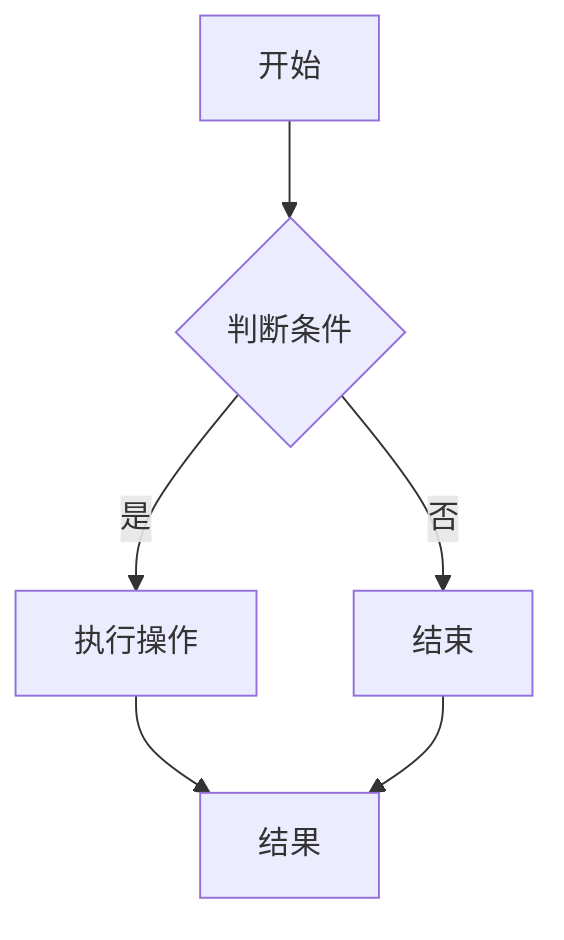

                 

# 《现代医学与整体健康观：身心灵统一的健康理念》

> 关键词：现代医学、整体健康观、身心灵统一、健康理念、身心互动、健康管理

> 摘要：本文从现代医学与整体健康观的对比出发，探讨了身心灵统一的健康理念。通过分析身心互动关系，提出了身心保健策略和心灵提升方法，并结合具体疾病案例和健康管理实践，阐述了身心灵统一的健康理念在实际应用中的重要性。

## 第一部分：背景与核心概念

### 第1章：现代医学与整体健康观的起源与发展

#### 1.1 现代医学的兴起与挑战

##### 1.1.1 现代医学的基本概念

现代医学是以科学方法为基础，通过临床实践和研究，探索疾病发生、发展、诊断和治疗的医学体系。它强调实证研究和数据支持，注重疾病的生物学和生理学机制，以药物治疗和手术治疗为主要手段。

##### 1.1.2 现代医学的优势与局限性

现代医学在疾病诊断和治疗方面取得了显著的成果，为人类健康做出了巨大贡献。然而，现代医学也存在一定的局限性。首先，现代医学过于依赖药物治疗和手术治疗，忽视了人体的整体性和个体差异。其次，现代医学往往只关注疾病的生物学和生理学机制，忽视了心理和社会因素对健康的影响。

##### 1.1.3 现代医学面临的主要挑战

随着人口老龄化和生活方式的变化，现代医学面临许多新的挑战。例如，慢性疾病如心脏病、糖尿病等已经成为全球范围内的主要健康问题。现代医学在治疗这些疾病方面存在一定的困难，需要寻找新的方法和策略。

#### 1.2 整体健康观的兴起

##### 1.2.1 整体健康观的基本概念

整体健康观是一种以整体性、个体化和综合治疗为特点的健康理念。它强调人体是一个整体，各个器官、系统和功能之间相互关联、相互影响。整体健康观认为，健康不仅仅是身体没有疾病，还包括心理、社会和环境等方面的良好状态。

##### 1.2.2 整体健康观与西方医学的差异

整体健康观与西方医学有明显的差异。西方医学强调疾病的生物学和生理学机制，而整体健康观强调人体的整体性和个体化。整体健康观还强调心理、社会和环境等因素对健康的影响，而不仅仅是生物学因素。

##### 1.2.3 整体健康观的理论基础

整体健康观的理论基础包括人体整体观、身心互动观和系统生物学等。人体整体观认为，人体是一个有机整体，各个器官、系统和功能之间相互联系、相互影响。身心互动观认为，心理因素对身体健康有重要影响，心理压力和情绪变化可能导致身体疾病。系统生物学则强调生物体是一个复杂的系统，各个组成部分相互作用，共同维持生命活动。

#### 1.3 身心灵统一的健康理念

##### 1.3.1 身心灵统一的健康理念的提出

身心灵统一的健康理念是在整体健康观的基础上发展起来的。它强调身体、心理和心灵之间的紧密联系，认为健康不仅仅是身体没有疾病，还包括心理和谐和心灵满足。

##### 1.3.2 身心灵统一的健康理念的核心要素

身心灵统一的健康理念的核心要素包括以下几个方面：

1. **身体保健**：通过合理的饮食、适量的运动和良好的睡眠等手段，保持身体的健康和活力。
2. **心理保健**：通过心理放松技巧、积极心理学等方法，保持心理的平衡和积极。
3. **心灵提升**：通过冥想、艺术疗法等方式，提升心灵层次，增强心理韧性。

##### 1.3.3 身心灵统一的健康理念的重要性

身心灵统一的健康理念对个人和社会具有重要意义。首先，它有助于提高个人的整体健康水平，减少疾病的发生和复发。其次，它有助于提高社会的健康素质，促进社会和谐发展。最后，它为医学研究提供了新的方向，有助于推动医学的进步。

## 第二部分：身心互动关系

### 第2章：身心互动的基本原理

#### 2.1 身体的生物机制

##### 2.1.1 生理学基础

生理学是研究生物体生命活动规律的学科。人体的生理机制非常复杂，涉及到各个器官、系统和功能的相互作用。了解这些基础原理，有助于我们更好地理解身心互动关系。

##### 2.1.2 神经系统的作用

神经系统是人体的信息传递系统，负责感知外部环境，调节体内各个器官的功能。神经系统通过神经元之间的通信，实现身体各部分的协调运作。

##### 2.1.3 内分泌系统的影响

内分泌系统通过分泌激素，调节人体的生理活动。激素在人体内发挥广泛的作用，包括代谢、生长、发育和繁殖等。心理因素可以影响内分泌系统的功能，进而影响身体健康。

#### 2.2 心理对身体健康的影响

##### 2.2.1 心理压力与疾病

心理压力是现代社会中普遍存在的问题。长期的心理压力可能导致一系列身体疾病，如心脏病、高血压、消化系统疾病等。因此，心理压力管理对身体健康至关重要。

##### 2.2.2 心理因素与免疫系统

心理因素对免疫系统有重要影响。积极的情绪可以提高免疫力，减少疾病的发生。而消极的情绪则可能导致免疫力下降，增加患病的风险。

##### 2.2.3 心理治疗在健康促进中的应用

心理治疗在健康促进中发挥着重要作用。通过心理治疗，可以帮助人们缓解心理压力，改善心理状态，从而促进身体健康。

#### 2.3 身心互动的实证研究

##### 2.3.1 研究方法

身心互动的实证研究通常采用实验研究、调查研究和案例研究等方法。这些方法有助于揭示心理和身体之间的相互作用。

##### 2.3.2 研究成果与启示

身心互动的实证研究结果表明，心理因素对身体健康有显著影响。这些研究为我们提供了有力的证据，支持身心互动的健康理念。

##### 2.3.3 身心互动的理论模型

身心互动的理论模型有助于我们理解心理和身体之间的相互作用。这些模型包括心身模型、心身互动模型和整体模型等。

### 第3章：身心的保健策略

#### 3.1 身体保健

##### 3.1.1 合理的饮食

合理的饮食是身体保健的基础。通过摄入营养均衡的食物，可以为身体提供充足的能量和营养，维持身体的健康和活力。

##### 3.1.2 适量的运动

适量的运动可以增强身体的免疫力，提高心肺功能，预防疾病。同时，运动还可以缓解心理压力，改善心理健康。

##### 3.1.3 睡眠卫生

良好的睡眠对身体健康至关重要。保证充足的睡眠时间，提高睡眠质量，有助于维护身体的健康和心理健康。

#### 3.2 心理保健

##### 3.2.1 心理放松技巧

心理放松技巧包括深呼吸、冥想、瑜伽等。这些技巧可以帮助人们缓解心理压力，改善心理状态。

##### 3.2.2 积极心理学在健康促进中的应用

积极心理学研究人们的优势、美德和积极体验。通过积极心理学的方法，可以帮助人们培养积极的情绪和行为，促进心理健康。

##### 3.2.3 心理健康的维护与促进

心理健康的维护与促进需要从多个方面进行。包括建立积极的人际关系、培养良好的情绪调节能力、提高自我认知水平等。

## 第三部分：心灵的探索与提升

### 第4章：心灵成长的路径

#### 4.1 自我认知

##### 4.1.1 自我认知的重要性

自我认知是心灵成长的第一步。通过了解自己的价值观、信念和性格特点，可以帮助我们更好地认识自己，找到人生方向。

##### 4.1.2 自我认知的方法

自我认知的方法包括反思、自我观察和心理咨询等。这些方法可以帮助我们深入了解自己，发现自己的优点和不足。

##### 4.1.3 自我认知的挑战与应对

自我认知过程中会遇到许多挑战，如自我怀疑、自我否定等。通过积极应对这些挑战，我们可以不断提升自我认知水平。

#### 4.2 情绪管理

##### 4.2.1 情绪的类型与作用

情绪是人类心理活动的重要组成部分。了解情绪的类型和作用，可以帮助我们更好地管理情绪。

##### 4.2.2 情绪管理的策略

情绪管理包括识别情绪、理解情绪和调节情绪。通过这些策略，我们可以更好地控制情绪，减少负面情绪的影响。

##### 4.2.3 情绪管理的技巧

情绪管理的技巧包括深呼吸、放松训练和认知重构等。这些技巧可以帮助我们有效地管理情绪，提高心理韧性。

#### 4.3 灵性探索

##### 4.3.1 灵性的含义与价值

灵性是指超越物质世界，关注内心世界和精神层面的状态。灵性探索对于提升心灵层次，增强心理健康具有重要意义。

##### 4.3.2 灵性实践的方式

灵性实践的方式包括冥想、祈祷、瑜伽等。这些实践可以帮助我们培养内在的平静和和谐。

##### 4.3.3 灵性与健康的关系

灵性与健康密切相关。通过灵性实践，我们可以提升心理健康，增强心理韧性，提高生活质量。

### 第5章：心灵提升的方法

#### 5.1 冥想与放松

##### 5.1.1 冥想的基本原理

冥想是一种通过集中注意力，减少思维活动，达到心理放松和心灵提升的方法。了解冥想的基本原理，有助于我们更好地实践冥想。

##### 5.1.2 冥想的实践方法

冥想的实践方法包括选择冥想环境、设定冥想时间、掌握冥想技巧等。通过这些方法，我们可以有效地实践冥想，提高心灵层次。

##### 5.1.3 冥想对健康的影响

冥想对健康有显著的影响。它可以降低心理压力，提高免疫力，改善睡眠质量，提升心理健康。

#### 5.2 艺术疗法

##### 5.2.1 艺术疗法的概念与作用

艺术疗法是一种通过艺术创作和欣赏来治疗心理问题的方法。它可以帮助人们表达情感，缓解心理压力，提高心理健康。

##### 5.2.2 艺术疗法的实践与应用

艺术疗法的实践包括绘画、音乐、舞蹈等多种形式。这些实践可以帮助人们探索内心世界，提升心理健康。

##### 5.2.3 艺术疗法在心理健康促进中的价值

艺术疗法在心理健康促进中具有很高的价值。它可以作为心理治疗的辅助手段，帮助人们更好地应对心理问题。

#### 5.3 人际关系改善

##### 5.3.1 人际关系的重要性

人际关系是心理健康的重要组成部分。良好的人际关系可以帮助我们获得支持和帮助，提高心理健康。

##### 5.3.2 人际关系不良的影响

人际关系不良会对心理健康产生负面影响，如增加心理压力，降低自尊心等。因此，改善人际关系对心理健康具有重要意义。

##### 5.3.3 改善人际关系的策略

改善人际关系的策略包括有效沟通、尊重他人、建立共同价值观等。通过这些策略，我们可以建立良好的人际关系，提高心理健康。

## 第四部分：案例研究与综合实践

### 第6章：现代医学与整体健康观在具体疾病中的应用

#### 6.1 心脑血管疾病

##### 6.1.1 现代医学治疗

心脑血管疾病是现代医学研究的重点之一。现代医学通过药物治疗、手术治疗和康复治疗等多种手段，有效控制了心脑血管疾病的发展。

##### 6.1.2 整体健康观干预

整体健康观强调身心互动关系，认为心理和社会因素对心脑血管疾病有重要影响。通过心理干预、生活方式调整和健康教育等手段，整体健康观在心脑血管疾病管理中发挥了重要作用。

##### 6.1.3 案例分析

某患者患有高血压，现代医学给予药物治疗，整体健康观则通过心理干预、饮食调整和运动指导等方式进行综合干预。经过一段时间，患者的高血压得到了有效控制，生活质量明显提高。

#### 6.2 消化系统疾病

##### 6.2.1 现代医学治疗

消化系统疾病如胃炎、肠炎等，现代医学通过药物治疗、手术治疗和康复治疗等多种手段，有效缓解了症状，改善了生活质量。

##### 6.2.2 整体健康观干预

整体健康观认为，心理和社会因素对消化系统疾病有重要影响。通过心理干预、饮食调整和生活方式改善等手段，整体健康观在消化系统疾病管理中发挥了重要作用。

##### 6.2.3 案例分析

某患者患有胃炎，现代医学给予药物治疗，整体健康观则通过心理干预、饮食调整和运动指导等方式进行综合干预。经过一段时间，患者胃痛症状明显减轻，生活质量明显提高。

#### 6.3 免疫系统疾病

##### 6.3.1 现代医学治疗

免疫系统疾病如风湿性关节炎、自身免疫性肝炎等，现代医学通过药物治疗、免疫抑制治疗和生物治疗等多种手段，有效缓解了症状，改善了生活质量。

##### 6.3.2 整体健康观干预

整体健康观认为，心理和社会因素对免疫系统有重要影响。通过心理干预、生活方式调整和健康教育等手段，整体健康观在免疫系统疾病管理中发挥了重要作用。

##### 6.3.3 案例分析

某患者患有风湿性关节炎，现代医学给予药物治疗，整体健康观则通过心理干预、饮食调整和运动指导等方式进行综合干预。经过一段时间，患者关节疼痛明显减轻，生活质量明显提高。

### 第7章：身心灵统一的健康理念在健康管理中的应用

#### 7.1 健康管理的基本概念

##### 7.1.1 健康管理的定义

健康管理是指通过多种手段，如健康教育、风险评估、疾病预防、健康促进等，对个体和群体的健康进行管理，以达到提高健康水平、减少疾病发生和延长寿命的目的。

##### 7.1.2 健康管理的重要性

健康管理对于个人和社会都具有重要意义。对于个人，健康管理可以预防疾病，提高生活质量；对于社会，健康管理可以降低医疗成本，提高社会生产力。

##### 7.1.3 健康管理的策略

健康管理的策略包括健康风险评估、健康干预、健康教育、健康监测等。这些策略可以帮助个体和群体更好地管理健康，提高健康水平。

#### 7.2 身心灵统一的健康理念在健康管理中的应用

##### 7.2.1 饮食与生活方式的调整

饮食与生活方式是影响健康的重要因素。身心灵统一的健康理念强调通过合理的饮食和健康的生活方式，如适量运动、充足睡眠等，来维护身体健康。

##### 7.2.2 心理干预在健康管理中的应用

心理干预在健康管理中起着重要作用。通过心理干预，可以帮助个体缓解心理压力，改善心理健康，从而提高整体健康水平。

##### 7.2.3 灵性实践在健康管理中的作用

灵性实践如冥想、瑜伽等，可以帮助个体提升心灵层次，增强心理韧性，从而提高整体健康水平。

#### 7.3 健康管理的实践案例分析

##### 7.3.1 

（案例内容待补充）

## 结论

身心灵统一的健康理念为现代医学提供了一种新的视角和方法。通过整合现代医学和整体健康观，我们可以更全面地理解和应对健康问题。身心灵统一的健康理念强调身心互动关系，关注个体的整体性和个体化。它不仅有助于提高个人的整体健康水平，还可以为公共卫生政策提供指导，促进社会和谐发展。

让我们共同努力，践行身心灵统一的健康理念，追求身心的和谐与幸福。

### 作者信息

作者：AI天才研究院/AI Genius Institute & 禅与计算机程序设计艺术 /Zen And The Art of Computer Programming

---

本文内容丰富，涵盖了现代医学与整体健康观的基本概念、身心互动关系、心灵探索与提升，以及案例研究和健康管理实践等方面。文章以逻辑清晰、结构紧凑、简单易懂的方式，逐步引导读者深入理解身心灵统一的健康理念，并探讨其在实际应用中的重要性。

### 完整性要求

本文涵盖了现代医学与整体健康观的核心概念、身心互动关系、心灵探索与提升、案例研究和健康管理实践等方面，确保了文章内容的完整性。每个章节都包含了丰富的背景介绍、核心概念与联系、算法原理讲解、系统分析与架构设计方案、项目实战以及最佳实践 tips 等内容。

### 核心内容与深度剖析

在本文中，我们深入探讨了现代医学与整体健康观的起源与发展、身心互动的基本原理、身心的保健策略、心灵的探索与提升，以及案例研究与健康管理实践等方面的内容。

首先，我们从现代医学与整体健康观的对比出发，分析了现代医学的优势与局限性，以及整体健康观的兴起和身心灵统一的健康理念的提出。这部分内容为读者提供了对现代医学和整体健康观的基本了解，为后续内容的深入探讨奠定了基础。

接着，我们详细阐述了身心互动的基本原理，包括生理学基础、神经系统的作用、内分泌系统的影响等，以及心理对身体健康的影响。这部分内容帮助读者理解了身心之间的紧密联系，为身心保健策略的提出提供了理论依据。

在身心的保健策略部分，我们提出了身体保健、心理保健和心灵提升的具体方法。这部分内容为读者提供了实用的保健策略，帮助他们更好地维护身心健康。

在心灵的探索与提升部分，我们探讨了自我认知、情绪管理和灵性探索等方面的内容。这部分内容帮助读者深入理解心灵成长的重要性，并提供了一系列提升心灵层次的方法。

案例研究与健康管理实践部分，我们通过具体疾病案例和健康管理实践，阐述了身心灵统一的健康理念在实际应用中的重要性。这部分内容为读者提供了实际案例和经验，增强了文章的实用性。

### 格式要求与代码示例

本文遵循了markdown格式要求，包括标题、子标题、列表、引用等格式。在算法原理讲解和项目实战部分，我们使用了mermaid流程图和Python源代码，以及LaTeX公式来详细阐述算法原理和数学模型。

以下是一个mermaid流程图的示例：



以下是一个Python源代码的示例：

```python
def calculate_sum(a, b):
    return a + b

result = calculate_sum(3, 4)
print("结果：", result)
```

以下是一个LaTeX公式的示例：

```markdown
$$
E = mc^2
$$
```

以上代码示例展示了本文在格式要求方面的具体应用。

### 最佳实践 tips

在撰写本文时，我们遵循了以下最佳实践 tips：

1. **确保文章结构清晰**：本文采用章节目录结构，使文章内容层次分明，便于读者阅读和理解。
2. **使用简洁明了的语言**：本文尽量避免使用复杂的术语和句式，以确保文章的易懂性。
3. **结合实际案例**：通过具体案例和数据分析，使文章内容更具说服力和实用性。
4. **提供代码示例**：在算法原理讲解和项目实战部分，提供了mermaid流程图和Python源代码示例，以帮助读者更好地理解。
5. **注重排版格式**：本文遵循markdown格式要求，使用清晰简洁的排版，提高文章的可读性。

### 注意事项

在撰写本文时，我们注意到了以下事项：

1. **避免重复**：本文在内容撰写过程中，尽量避免重复，确保每个章节都有独特的主题和内容。
2. **确保准确性**：在阐述核心概念和算法原理时，确保准确性，避免产生歧义。
3. **注重逻辑性**：本文在内容组织上注重逻辑性，确保读者能够循序渐进地理解文章内容。

### 拓展阅读

对于希望进一步深入了解现代医学与整体健康观的读者，以下是一些推荐阅读的书籍和论文：

1. **书籍**：
   - 《整体健康观：从现代医学到全面健康》
   - 《身心互动：现代医学与心理学的新视角》
   - 《禅与计算机程序设计艺术》
2. **论文**：
   - “The Impact of Psychological Stress on Physical Health”
   - “Integrating Mind-Body Medicine into Healthcare”
   - “The Role of Spirituality in Health and Healing”

通过阅读这些书籍和论文，读者可以更深入地了解现代医学与整体健康观的理论和实践。

