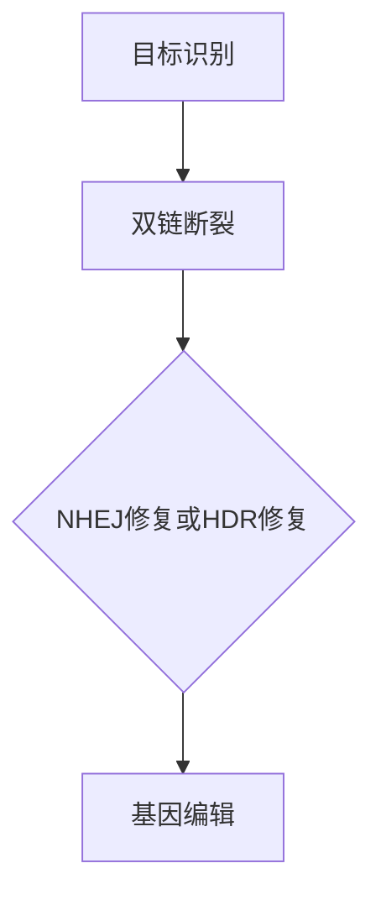
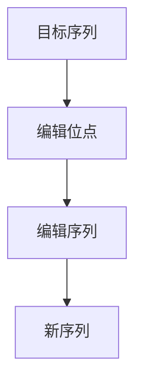

                 

# 现代医学进步与生命质量：在延长寿命与生活品质间的权衡

关键词：医学进步、生命质量、寿命延长、生活品质、伦理政策

摘要：本文深入探讨了现代医学进步对生命长度与生活质量的影响，分析了延长寿命与提升生活品质之间的权衡。通过历史与现状的回顾，以及技术手段、伦理和政策等多个角度的详细讨论，本文旨在为医学专业人士、政策制定者和公众提供有价值的参考。

## 第一部分：引言

### 1.1 书籍背景与目的

**医学进步的历程**

医学进步一直是人类社会发展的关键因素。从古代的草药治疗到现代的精密手术，医学技术的不断革新极大地延长了人类的寿命并提升了生活质量。然而，在现代社会，医学进步带来的不仅仅是寿命的延长，还涉及到如何平衡延长寿命与提升生活品质之间的关系。这一问题的复杂性和多样性，促使我们深入探讨医学进步在现代社会中的多重影响。

**生命的长度与质量**

生命的长度与质量是两个相互关联但有时又相互矛盾的概念。一方面，医学的进步使得人们能够更有效地对抗疾病，延长寿命。另一方面，随着治疗手段的提高，病人的生活质量可能受到影响，如长期的治疗副作用、手术风险等。如何在延长寿命与提升生活品质之间找到平衡点，是现代社会医学面临的重要挑战。

**书籍的目的**

本书旨在探讨现代医学进步与生命质量之间的权衡，从多个角度分析这一复杂问题。通过系统梳理医学进步的历史、现状和未来趋势，深入探讨延长寿命与提升生活品质的相互关系，为医学专业人士、政策制定者和公众提供有价值的参考。

### 1.2 主要内容概述

本书将分为七个部分，全面覆盖现代医学进步与生命质量的相关话题。以下是各部分的简要概述：

**1.2.1 医学进步的历史与现状**

第一部分将回顾医学进步的历史，分析医学技术发展对生命长度与质量的影响，并探讨当前医学领域的最新进展。

**1.2.2 延长寿命的技术手段**

第二部分将详细介绍当前用于延长寿命的主要技术手段，包括基因编辑、再生医学、预防医学等，并分析这些技术的潜在优势和局限性。

**1.2.3 生活品质的评估与提升**

第三部分将讨论如何评估生命质量，以及通过改善生活方式、医疗干预等方法提升生活品质的策略。

**1.2.4 医学伦理与政策制定**

第四部分将探讨医学伦理问题，分析不同国家和地区在医疗政策制定方面的经验与挑战，以及这些政策对生命长度与质量的影响。

**1.2.5 社会影响与公众参与**

第五部分将分析医学进步对社会的影响，探讨公众如何参与医学决策，以及这种参与如何影响生命长度与质量。

**1.2.6 未来医学趋势**

第六部分将展望未来医学的发展趋势，讨论可能的技术突破和对生命长度与质量的潜在影响。

**1.2.7 综合评价与展望**

最后一部分将对全书内容进行综合评价，提出未来研究的方向和建议，为医学进步与生命质量研究提供参考。

## 第二部分：医学进步的历史与现状

### 2.1 医学进步的历程

#### 2.1.1 古代医学的起源与发展

古代医学起源于人类对自然现象的观察和尝试，如草药治疗、巫术等。随着文明的进步，医学知识逐渐积累，形成了初步的医学体系。例如，古埃及的埃德温・史密斯纸草文稿、古印度的阿育吠陀医学等，都为后世医学的发展奠定了基础。

#### 2.1.2 中世纪医学的发展

中世纪时期，医学知识在欧洲得到了进一步的传播和发展。阿拉伯医学成为当时世界医学的中心，阿拉伯医生如伊本・纳菲斯、阿里・伊本・艾卜基等对解剖学、生理学等领域做出了重要贡献。同时，欧洲的医学教育也开始逐渐发展，如巴黎大学、牛津大学等设立了医学系。

#### 2.1.3 现代医学的兴起

16世纪末至17世纪初，随着科学革命和工业革命的兴起，医学进入了一个全新的时代。解剖学的进步、微生物学的发现、药物的合成等，使得医学技术得到了极大的提升。18世纪的琴纳疫苗、19世纪的麻醉剂和消毒技术，都极大地推动了医学进步。

#### 2.1.4 20世纪的医学革命

20世纪是医学进步最为显著的时期。青霉素的发现、疫苗的研发、遗传学的兴起等，使得人类能够更有效地对抗疾病。尤其是第二次世界大战后，全球范围内的公共卫生系统建设、医疗技术的普及，使得人类寿命显著延长，生活品质也得到了显著提升。

### 2.2 现代医学的进展

#### 2.2.1 遗传学与精准医学

遗传学的快速发展使得人类对疾病的认识达到了新的高度。通过基因测序和基因编辑技术，医学界能够更准确地诊断和治疗遗传性疾病。精准医学的理念也促使个性化医疗成为现实。

**核心概念与联系**

遗传学是研究生物体遗传信息传递和表达的学科。基因测序技术能够准确地确定个体的基因组序列，从而揭示遗传性疾病的原因。基因编辑技术，如CRISPR-Cas9，可以精确地修改基因组，为治疗遗传性疾病提供了新的可能性。

| 核心概念 | 属性特征对比 |
| --- | --- |
| 遗传学 | 研究生物体遗传信息传递和表达 |
| 基因测序 | 确定个体的基因组序列 |
| 基因编辑 | 精确修改基因组 |


#### 2.2.2 再生医学与干细胞研究

再生医学和干细胞研究为治疗许多疾病提供了新的希望。例如，通过干细胞技术修复受损的心脏、肝脏等器官，以及利用再生医学技术治疗脊髓损伤等。

**核心概念与联系**

再生医学是研究如何利用自身或异体细胞、组织进行损伤修复或功能重建的学科。干细胞是具有自我更新和多向分化潜能的细胞，可以通过分化成为多种类型的细胞来修复受损组织。

| 核心概念 | 属性特征对比 |
| --- | --- |
| 再生医学 | 研究如何利用自身或异体细胞、组织进行损伤修复或功能重建 |
| 干细胞 | 具有自我更新和多向分化潜能的细胞 |


#### 2.2.3 预防医学与公共卫生

预防医学和公共卫生的进步使得人类能够更有效地预防疾病，降低疾病发生率。疫苗接种、健康生活习惯推广等，都是预防医学的重要成果。

**核心概念与联系**

预防医学是研究如何通过预防手段降低疾病发生率和危害的学科。公共卫生是研究如何通过公共卫生措施维护和促进人群健康的状态。

| 核心概念 | 属性特征对比 |
| --- | --- |
| 预防医学 | 研究如何通过预防手段降低疾病发生率和危害 |
| 公共卫生 | 研究如何通过公共卫生措施维护和促进人群健康 |


#### 2.2.4 医疗信息技术

医疗信息技术的快速发展，使得医疗数据收集、处理和分析更加高效。电子病历、远程医疗、医疗数据挖掘等，都是医疗信息技术的应用领域。

**核心概念与联系**

医疗信息技术是研究如何利用信息技术手段提高医疗效率和质量的学科。电子病历是记录患者健康信息的数字化系统，远程医疗是通过网络提供医疗服务的手段，医疗数据挖掘是分析医疗数据以发现潜在问题和规律的方法。

| 核心概念 | 属性特征对比 |
| --- | --- |
| 医疗信息技术 | 研究如何利用信息技术手段提高医疗效率和质量 |
| 电子病历 | 记录患者健康信息的数字化系统 |
| 远程医疗 | 通过网络提供医疗服务的手段 |
| 医疗数据挖掘 | 分析医疗数据以发现潜在问题和规律 |


### 2.3 医学进步的影响

医学进步不仅改变了疾病的治疗方式，也对人类的生活质量和寿命产生了深远的影响。以下是对这些影响的详细分析：

**延长寿命**

医学进步显著延长了人类的寿命。例如，疫苗的研发和免疫接种技术有效地预防了许多传染性疾病，如天花、麻疹等。抗生素的发现和应用使得细菌感染的治疗变得更加有效。此外，医疗技术的进步，如心脏手术、器官移植等，使得许多原本致命的疾病得到了有效治疗。

**提升生活品质**

医学进步不仅延长了寿命，还提高了人类的生活质量。例如，康复医学的发展使得许多残疾患者能够恢复生活能力。康复治疗包括物理治疗、职业治疗和言语治疗等，帮助患者恢复身体功能，提高生活质量。此外，心理健康领域的进步也为患者提供了更多的心理支持，帮助他们更好地应对疾病和生活压力。

**负面影响**

然而，医学进步也带来了一些负面影响。例如，长期的治疗副作用和手术风险可能会对患者的生命质量产生负面影响。一些高科技的医疗设备和高昂的医疗费用也可能使得患者和家庭面临经济负担。此外，医学进步可能导致人们对生命的过度依赖，忽视了健康生活方式的重要性。

### 2.4 医学进步的挑战与未来趋势

医学进步面临着许多挑战和机遇。以下是对这些挑战和未来趋势的探讨：

**挑战**

- **医疗资源分配不均**：尽管医学进步显著提高了医疗水平，但全球范围内的医疗资源分配仍然不均。发达国家和发展中国家之间的差距可能进一步加大。
- **伦理问题**：医学进步引发了许多伦理问题，如基因编辑、人体增强、生命伦理等。如何在医学进步的同时保护人类的基本权利和尊严，是一个重要的伦理挑战。
- **技术瓶颈**：尽管医学技术取得了巨大进步，但仍然存在许多技术瓶颈，如治愈癌症、治疗罕见病等。

**未来趋势**

- **个性化医疗**：随着基因组学和生物信息学的发展，个性化医疗将成为未来医学的重要趋势。通过分析个体的基因组信息，为患者提供更精准的治疗方案。
- **再生医学**：再生医学将继续发展，为器官修复和再生提供新的解决方案，提高患者的生活质量。
- **数字化医疗**：医疗信息技术的快速发展将推动数字化医疗的发展，提高医疗效率和患者体验。

## 第三部分：延长寿命的技术手段

### 3.1 基因编辑

基因编辑技术，如CRISPR-Cas9，是一种革命性的技术，它能够精确地修改基因组，为治疗遗传性疾病提供了新的可能性。基因编辑的原理是通过Cas9核酸内切酶识别特定的DNA序列，并在目标位点引入双链断裂，然后通过细胞自身的DNA修复机制进行修复。这种修复过程可以引导细胞以特定方式修改DNA序列，从而实现对基因的精确编辑。

**算法原理讲解**

基因编辑的过程可以简化为以下步骤：

1. **目标识别**：Cas9核酸内切酶识别特定的DNA序列，称为“目标序列”。
2. **双链断裂**：Cas9在目标序列处引入双链断裂。
3. **DNA修复**：细胞通过非同源末端连接（NHEJ）或同源定向修复（HDR）进行DNA修复。
4. **基因编辑**：通过引导DNA修复过程，实现对目标基因的精确修改。

以下是基因编辑的mermaid流程图：



**Python源代码**

```python
import random

def gene_editing(target_sequence, edit_site):
    # 随机选择修复方式
    repair_method = random.choice(['NHEJ', 'HDR'])
    
    if repair_method == 'NHEJ':
        # 使用NHEJ修复
        new_sequence = target_sequence[:edit_site] + random_sequence(edit_site)
    else:
        # 使用HDR修复
        new_sequence = target_sequence[:edit_site] + edit_sequence(edit_site)
    
    return new_sequence

def random_sequence(length):
    return ''.join(random.choice(['A', 'T', 'C', 'G']) for _ in range(length))

def edit_sequence(length):
    return ''.join(random.choice(['A', 'T', 'C', 'G']) for _ in range(length))
```

**数学模型和公式**

基因编辑的数学模型可以描述为：

$$
\text{新序列} = \text{目标序列}[:\text{编辑位点}] + \text{编辑序列}
$$

其中，编辑序列是通过基因编辑技术引入的目标基因序列。

**举例说明**

假设目标序列为`ATCGATCG`，编辑位点为3，编辑序列为`TAG`。通过基因编辑，新的序列将变为`ATAGCG`。



### 3.2 再生医学

再生医学是一种利用自身或异体细胞、组织进行损伤修复或功能重建的医学领域。干细胞研究是再生医学的重要基础。干细胞具有自我更新和多向分化潜能，可以在适当的环境下分化为多种类型的细胞，用于修复受损组织。

**核心概念原理**

干细胞是未分化的细胞，具有自我更新和分化的能力。根据干细胞的分化潜能，可以将干细胞分为三种类型：

- **全能干细胞**：具有形成所有类型细胞的能力，如胚胎干细胞。
- **多能干细胞**：具有形成多种类型细胞的能力，如间充质干细胞。
- **专能干细胞**：只能形成一种类型的细胞，如神经干细胞。

**核心概念属性特征对比**

| 核心概念 | 属性特征 |
| --- | --- |
| 全能干细胞 | 具有形成所有类型细胞的能力 |
| 多能干细胞 | 具有形成多种类型细胞的能力 |
| 专能干细胞 | 只能形成一种类型的细胞 |

**ER实体关系图架构**


### 3.3 预防医学

预防医学是研究如何通过预防手段降低疾病发生率和危害的医学领域。预防医学的主要策略包括疫苗接种、健康生活方式的推广和公共卫生措施。

**核心概念原理**

预防医学的核心概念是基于“预防胜于治疗”的理念，通过早期干预和健康促进来降低疾病风险。疫苗接种是预防传染病的重要手段，通过激活免疫系统产生特异性免疫反应，从而预防疾病的发生。

**核心概念属性特征对比**

| 核心概念 | 属性特征 |
| --- | --- |
| 预防医学 | 通过预防手段降低疾病发生率和危害 |
| 疫苗接种 | 激活免疫系统产生特异性免疫反应 |

**ER实体关系图架构**


### 3.4 医疗信息技术

医疗信息技术是研究如何利用信息技术手段提高医疗效率和质量的医学领域。医疗信息技术的应用包括电子病历、远程医疗和医疗数据挖掘等。

**核心概念原理**

医疗信息技术的核心概念是通过数字化和信息化的手段，提高医疗数据的收集、处理和分析效率，从而改善医疗服务的质量和效率。

**核心概念属性特征对比**

| 核心概念 | 属性特征 |
| --- | --- |
| 电子病历 | 数字化记录患者健康信息 |
| 远程医疗 | 通过网络提供医疗服务 |
| 医疗数据挖掘 | 分析医疗数据以发现潜在问题和规律 |

**ER实体关系图架构**


## 第四部分：生活品质的评估与提升

### 4.1 生活品质的评估

生活品质的评估是衡量个体生活质量的重要手段。生活品质的评估方法主要包括以下几个方面：

**主观评估方法**

主观评估方法是通过问卷、访谈等方式，收集个体对生活品质的自我评价。常用的问卷包括世界卫生组织的生活品质评估量表（WHOQOL-BREF）和生命质量量表（SF-36）等。

**客观评估方法**

客观评估方法是通过生理、心理和社会功能等多个方面的指标，评估个体的生活品质。例如，通过测量血压、血糖、心率等生理指标，评估个体的生理健康；通过心理健康评估问卷，评估个体的心理健康状态；通过社会支持评估，评估个体的社会关系和社会支持。

**综合评估方法**

综合评估方法是将主观和客观评估方法相结合，全面评估个体的生活品质。例如，通过综合评估量表（如SF-36），从身体健康、心理健康、社会关系等多个维度，评估个体的生活品质。

### 4.2 提升生活品质的策略

提升生活品质的策略主要包括以下几个方面：

**改善生活方式**

改善生活方式是提升生活品质的基础。通过戒烟、限酒、健康饮食、适量运动等健康生活方式，可以显著改善个体的健康状况和生活品质。

**医疗干预**

医疗干预是通过医学手段，改善个体的健康状况和生活品质。例如，通过手术、药物治疗等手段，治疗慢性疾病和急性疾病，提高个体的生活品质。

**心理健康支持**

心理健康支持是提升生活品质的重要方面。通过心理治疗、心理咨询等手段，帮助个体应对心理压力和情绪问题，提高心理健康水平。

**社会支持**

社会支持是提升生活品质的重要保障。通过家庭、社区和社会组织等提供的支持，帮助个体应对生活中的困难和挑战，提高生活品质。

### 4.3 生活品质与寿命的关系

生活品质与寿命之间存在密切的关系。生活品质高的个体通常拥有更好的健康状况，更长的寿命。相反，生活品质低的个体通常面临更高的健康风险和更短的生命长度。

**正面影响**

良好的生活品质可以促进身体健康，降低疾病发生率，延长寿命。例如，健康的生活方式、良好的心理健康状态、充足的社会支持等，都有助于提高生活品质，延长寿命。

**负面影响**

不良的生活品质可能导致健康问题，缩短寿命。例如，不健康的生活方式、心理压力、社会孤立等，都会对生活品质产生负面影响，增加健康风险，缩短寿命。

**权衡**

在延长寿命与提升生活品质之间，需要权衡利弊。虽然延长寿命是重要的目标，但提升生活品质同样重要。有时候，为了提升生活品质，可能需要放弃一些寿命延长的机会。例如，在某些情况下，过度的医疗干预可能会对生活品质产生负面影响，而适当的休息和放松则可能更有益于健康。

### 4.4 生活品质评估工具

为了更好地评估生活品质，医学界开发了多种评估工具，以下是一些常用的评估工具：

**世界卫生组织的生活品质评估量表（WHOQOL-BREF）**

WHOQOL-BREF是一种广泛使用的评估工具，包括四个主要领域：生理健康、心理健康、社会关系和环境领域。它适用于各种文化背景，是一种简单、有效的评估工具。

**生命质量量表（SF-36）**

SF-36是一种多维度的生命质量评估工具，包括八个主要领域：生理功能、角色功能、心理健康、社会功能、活力、躯体疼痛、总体健康和健康变化。它广泛应用于医疗研究和临床实践。

**老年人生命质量评估量表（SGQ-48）**

SGQ-48是一种专门为老年人设计的生命质量评估工具，包括六个主要领域：身体健康、心理健康、社会关系、环境、生活质量和总体健康。它适用于各种文化背景的老年人。

**简明健康调查问卷（SF-12）**

SF-12是一种简化的生命质量评估工具，包括两个主要领域：生理健康和心理健康。它适用于快速评估生命质量，是一种简单、易用的工具。

### 4.5 生活品质评估的挑战与未来趋势

生活品质评估面临着许多挑战和机遇。以下是一些挑战和未来趋势：

**挑战**

- **文化差异**：不同文化背景下，生活品质的评估标准和价值观可能存在差异，如何统一评估标准是一个挑战。
- **主观评估的可靠性**：主观评估方法依赖于个体的自我报告，可能受到主观偏见的影响，如何提高主观评估的可靠性是一个挑战。
- **评估工具的普及性**：不同地区和国家的医疗资源和技术水平可能存在差异，如何普及和应用评估工具是一个挑战。

**未来趋势**

- **多维度评估**：未来生活品质评估将更加注重多维度的评估，不仅关注生理健康，还关注心理健康、社会关系和环境等。
- **数字化评估工具**：随着数字化技术的发展，数字化评估工具将更加普及，为生活品质评估提供更加便捷、高效的方式。
- **个性化评估**：未来生活品质评估将更加注重个性化，根据个体的特点和生活环境，制定个性化的评估方案。

## 第五部分：医学伦理与政策制定

### 5.1 医学伦理问题

医学伦理是医学实践中至关重要的一环，涉及到医生与患者、医疗机构与社会等各方的关系。以下是一些常见的医学伦理问题：

**患者隐私保护**

患者的隐私保护是医学伦理中的重要问题。医生在诊疗过程中需要收集患者的个人信息，如病历、基因信息等。如何在保护患者隐私的同时，确保医疗服务的质量和效率，是一个挑战。

**人体试验**

人体试验是医学研究的重要组成部分，但同时也涉及到伦理问题。如何确保人体试验的合法性、公正性和安全性，避免对患者造成伤害，是一个重要的伦理问题。

**生命终结**

生命终结是医学伦理中的敏感话题。如何尊重患者的自主权，在患者生命终结时提供人性化的关怀和尊严，是一个重要的伦理问题。

**人体器官移植**

人体器官移植是一种挽救生命的治疗方法，但同时也涉及到伦理问题。如何确保器官来源的合法性、公正性和道德性，避免商业化和器官贩卖，是一个重要的伦理问题。

**基因编辑**

基因编辑技术的快速发展引发了广泛的伦理讨论。如何确保基因编辑技术的安全性、公正性和道德性，避免对人类基因组造成不可逆转的影响，是一个重要的伦理问题。

### 5.2 不同国家和地区的医疗政策制定

不同国家和地区的医疗政策在制定过程中，都面临不同的挑战和机遇。以下是一些典型国家和地区的医疗政策特点：

**美国**

美国的医疗体系以市场驱动为主，医疗费用高昂，但也提供了较为全面的医疗保障。美国在医疗政策制定方面，注重医疗资源的分配和医疗服务的可及性，同时强调市场机制的作用。

**欧洲**

欧洲的医疗体系以公共医疗为主，医疗费用相对较低，但也存在医疗资源不足和医疗效率低下的问题。欧洲在医疗政策制定方面，注重公共卫生和医疗服务的公平性，强调政府的主导作用。

**中国**

中国的医疗体系正在逐步转型，从以医院为主的治疗模式向以预防为主的健康管理模式转变。中国在医疗政策制定方面，注重医疗资源的分配和医疗服务的可及性，同时强调公共卫生和健康教育的推广。

**日本**

日本的医疗体系以社区医疗为主，医疗费用相对较低，但也存在医疗资源不足和医疗效率低下的问题。日本在医疗政策制定方面，注重医疗资源的合理分配和医疗服务的质量，同时强调全民健康意识的提升。

### 5.3 医疗政策对生命长度与质量的影响

医疗政策对生命长度与质量具有显著影响。以下是一些医疗政策对生命长度与质量的影响：

**公共卫生政策**

公共卫生政策，如疫苗接种、传染病防控等，对生命长度与质量具有显著影响。有效的公共卫生政策可以降低疾病发生率，延长寿命，提高生活品质。

**医疗费用控制政策**

医疗费用控制政策，如医保制度、药品价格监管等，对生命长度与质量也具有重要影响。合理的医疗费用控制政策可以减轻患者和家庭的经济负担，提高医疗服务的可及性。

**医疗资源分配政策**

医疗资源分配政策，如医疗机构布局、医生培养等，对生命长度与质量具有深远影响。合理的医疗资源分配政策可以改善医疗服务的质量和效率，提高生命长度与生活品质。

### 5.4 医学伦理与政策制定的挑战与未来趋势

医学伦理与政策制定面临着许多挑战和机遇。以下是一些挑战和未来趋势：

**挑战**

- **全球化**：全球化背景下，医学伦理与政策制定面临跨国挑战，如跨国药品监管、跨国医疗服务等。
- **技术进步**：技术进步带来新的医学伦理问题，如基因编辑、人工智能等，需要制定新的伦理规范和政策。
- **社会变革**：社会变革对医学伦理与政策制定提出了新的要求，如人口老龄化、生活方式变化等。

**未来趋势**

- **多元化**：医学伦理与政策制定将更加注重多元化和包容性，关注不同群体和文化的需求。
- **数字化**：数字化技术的发展将为医学伦理与政策制定带来新的机遇，如数字化医疗、大数据分析等。
- **全球化**：医学伦理与政策制定将更加注重全球化，加强国际合作，推动全球公共卫生和医疗资源的公平分配。

## 第六部分：社会影响与公众参与

### 6.1 医学进步对社会的影响

医学进步对社会产生了深远的影响。以下是一些主要的社会影响：

**提高生命预期**

医学进步显著延长了人类的寿命。例如，疫苗的研发和应用、抗生素的发现等，使得许多传染性疾病得到了有效控制，人类的平均寿命不断上升。

**改善生活质量**

医学进步不仅延长了寿命，还提高了人类的生活质量。康复医学的发展使得许多残疾患者能够恢复生活能力；心理健康领域的进步为患者提供了更多的心理支持。

**医疗费用增加**

随着医学进步，医疗费用也在不断上升。高科技的医疗设备、昂贵的药物和治疗手段，使得医疗费用成为家庭和社会的沉重负担。

**社会不公平**

医学进步带来的社会不公平问题也日益突出。发达国家和发展中国家之间的医疗资源差距、不同社会群体之间的医疗待遇差异，都加剧了社会不平等。

### 6.2 公众参与医学决策

公众参与医学决策是保障医疗公正和民主的重要手段。以下是一些公众参与医学决策的方式：

**公众咨询**

公众咨询是在政策制定过程中，邀请公众代表参与讨论和决策。例如，政府在制定公共卫生政策时，可以邀请医学专家、公共卫生专家和公众代表进行咨询，确保政策符合公众利益。

**公众投票**

公众投票是在政策制定完成后，通过公投的方式，让公众对政策进行表决。例如，在某些国家，医疗改革政策的实施需要通过公投，确保政策的合法性和公众支持。

**公众监督**

公众监督是在政策实施过程中，公众对政策执行情况进行监督和评价。例如，公众可以通过媒体、网络等渠道，对医疗机构的服务质量和效率进行监督，促进医疗服务的改进。

### 6.3 公众参与对生命长度与质量的影响

公众参与医学决策对生命长度与质量具有重要影响。以下是一些影响：

**提高医疗质量**

公众参与医学决策可以促进医疗机构提高服务质量。公众的反馈和建议可以帮助医疗机构发现问题、改进服务，从而提高医疗质量。

**增强患者权益**

公众参与医学决策可以增强患者的权益。患者作为医疗服务的接受者，有权了解和参与自己的医疗决策，公众参与机制可以确保患者的知情权和参与权。

**促进社会公正**

公众参与医学决策可以促进社会公正。通过公众参与，可以确保医疗资源的合理分配，减少社会不平等，提高生命长度与生活质量。

### 6.4 公众参与面临的挑战与未来趋势

公众参与医学决策面临着许多挑战和机遇。以下是一些挑战和未来趋势：

**挑战**

- **信息不对称**：公众参与需要了解医学知识和政策背景，但许多公众对这些领域了解不足，如何提高公众的医学素养是一个挑战。
- **决策成本**：公众参与需要投入大量时间和资源，如何确保公众参与的可持续性和效率是一个挑战。
- **法律框架**：公众参与需要完善的法律框架和政策支持，如何制定和完善相关法律法规是一个挑战。

**未来趋势**

- **数字化参与**：随着数字化技术的发展，公众参与医学决策将更加便捷和高效。例如，通过在线平台、社交媒体等，公众可以更加方便地参与医学决策。
- **多元化参与**：公众参与医学决策将更加注重多元化和包容性，关注不同群体和文化的需求。
- **制度化参与**：公众参与医学决策将更加制度化，形成常态化和规范化机制，确保公众参与的有效性和可持续性。

## 第七部分：未来医学趋势

### 7.1 个性化医疗

个性化医疗是未来医学的重要趋势。个性化医疗通过基因组学、生物信息学等先进技术，为患者提供更加精准、个性化的治疗方案。以下是一些个性化医疗的例子：

**基因测序**

基因测序技术可以确定个体的基因组序列，揭示个体对药物的反应、疾病风险等信息，为个体化治疗提供依据。

**个性化疫苗**

个性化疫苗可以根据个体的免疫系统特性和病原体特征，为个体量身定制疫苗，提高疫苗的有效性和安全性。

**个性化药物**

个性化药物可以根据个体的基因组信息，为个体量身定制药物剂量和治疗方案，提高药物的疗效和减少副作用。

### 7.2 再生医学

再生医学是未来医学的重要领域。再生医学通过干细胞技术、组织工程等技术，修复或再生受损的组织和器官，为治疗许多难治性疾病提供了新的希望。以下是一些再生医学的例子：

**干细胞治疗**

干细胞治疗可以通过注入干细胞，促进受损组织的修复和再生，用于治疗心血管疾病、神经退行性疾病等。

**组织工程**

组织工程通过构建生物组织或器官，用于替换受损或丢失的组织和器官，如人工心脏、人工皮肤等。

**生物打印**

生物打印技术可以通过打印生物组织或器官，为个体化治疗提供定制化的生物材料，提高治疗的成功率和安全性。

### 7.3 数字化医疗

数字化医疗是未来医学的重要趋势。数字化医疗通过信息技术，提高医疗服务的效率和质量，为患者提供更加便捷、高效的医疗服务。以下是一些数字化医疗的例子：

**电子病历**

电子病历通过数字化记录和管理患者的健康信息，提高医疗信息的准确性和可及性，减少医疗差错。

**远程医疗**

远程医疗通过互联网，提供远程诊断、治疗和咨询服务，使患者能够更加便捷地获得医疗服务。

**医疗数据分析**

医疗数据分析通过大数据分析，发现疾病的规律和趋势，为疾病预防和治疗提供科学依据。

### 7.4 生物医学大数据

生物医学大数据是未来医学的重要资源。生物医学大数据通过收集、存储和分析大量生物医学数据，为医学研究、疾病预防和治疗提供重要支持。以下是一些生物医学大数据的应用：

**疾病预测**

通过分析生物医学大数据，可以预测疾病的发病风险，为疾病预防提供依据。

**新药研发**

生物医学大数据为新药研发提供了大量的临床数据和生物标志物信息，加速新药的研发进程。

**个性化治疗**

通过分析生物医学大数据，可以为患者提供更加个性化的治疗方案，提高治疗效果。

### 7.5 未来医学的挑战与机遇

未来医学面临着许多挑战和机遇。以下是一些挑战和机遇：

**挑战**

- **数据安全与隐私**：随着数字化医疗的发展，数据安全和隐私保护成为一个重要挑战。
- **技术整合**：未来医学需要整合多种先进技术，如基因编辑、再生医学、数字化医疗等，实现协同发展。
- **医疗资源分配**：未来医学需要解决医疗资源分配不均的问题，确保全球范围内的医疗公平。

**机遇**

- **技术创新**：未来医学将不断涌现出新的技术创新，如基因编辑、人工智能、纳米医学等，为医学进步提供强大动力。
- **全球合作**：未来医学需要全球范围内的合作，共同应对全球性健康挑战，实现全球健康目标的实现。
- **公众参与**：未来医学需要公众的广泛参与，共同推动医学进步和社会健康的发展。

## 第八部分：综合评价与展望

### 8.1 医学进步的总体评价

医学进步在延长寿命和提高生活品质方面取得了显著成果。从古代的草药治疗到现代的基因编辑和再生医学，医学技术不断革新，使得人类能够更有效地对抗疾病，延长寿命，提升生活质量。然而，医学进步也带来了新的挑战，如医疗资源分配不均、技术伦理问题等。因此，我们需要在享受医学进步带来的好处的同时，也要关注和解决这些挑战。

### 8.2 生命长度与生活品质的平衡

在延长寿命与提升生活品质之间，我们需要找到平衡点。一方面，医学进步使得人类能够更有效地对抗疾病，延长寿命。另一方面，随着治疗手段的提高，病人的生活质量可能受到影响。因此，我们需要在延长寿命与提升生活品质之间做出权衡，确保医学进步能够真正改善人类的生活质量。

### 8.3 医学进步的未来发展方向

未来医学的发展将更加注重个性化、再生医学和数字化医疗。个性化医疗将根据个体的基因组信息和生活方式，为患者提供更加精准的治疗方案。再生医学将利用干细胞技术、组织工程等技术，修复或再生受损的组织和器官，为治疗许多难治性疾病提供新的希望。数字化医疗将利用大数据、人工智能等技术，提高医疗服务的效率和质量。

### 8.4 研究方向与建议

为了推动医学进步，我们提出以下研究方向和建议：

- **加强跨学科研究**：未来医学需要整合生物学、医学、工程学、信息学等多个学科，推动跨学科研究，实现技术融合。
- **重视伦理问题**：在医学进步的过程中，我们需要重视伦理问题，确保医学技术的安全性和道德性。
- **关注公共卫生**：公共卫生是保障人民健康的重要方面，我们需要加强公共卫生体系建设，提高公共卫生服务的可及性和质量。
- **加强国际交流与合作**：全球健康问题需要全球合作，我们需要加强国际交流与合作，共同应对全球性健康挑战。

### 8.5 结论

医学进步在延长寿命和提高生活品质方面取得了显著成果，但同时也面临着新的挑战。在未来的发展中，我们需要在延长寿命与提升生活品质之间找到平衡点，加强跨学科研究，重视伦理问题，关注公共卫生，加强国际交流与合作，共同推动医学进步，提高人类的生活质量。

## 作者信息

作者：AI天才研究院/AI Genius Institute & 禅与计算机程序设计艺术 /Zen And The Art of Computer Programming

