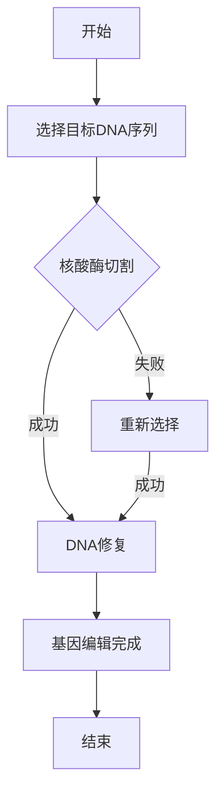
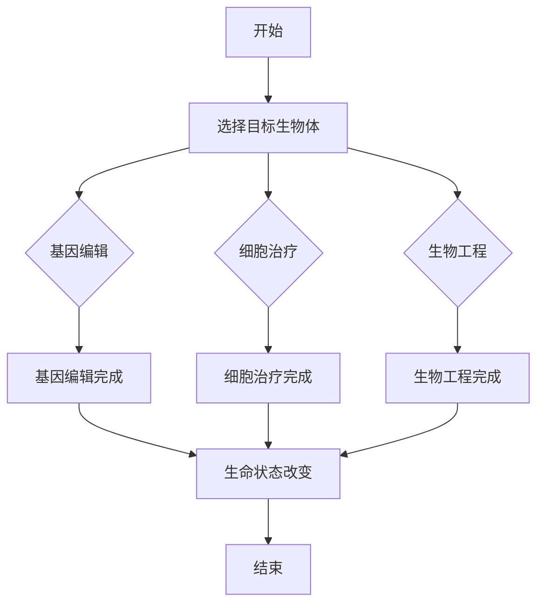
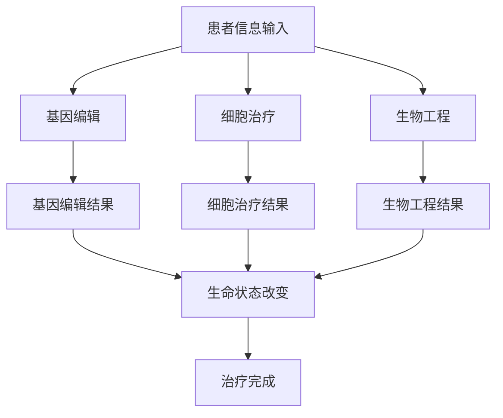
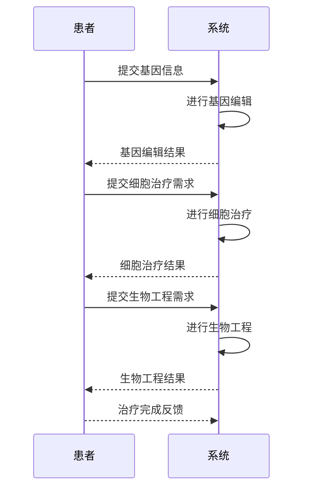

                 

# 现代医疗伦理的新挑战：基因编辑与生命操控的边界

## 关键词
- 基因编辑
- 生命操控
- 医疗伦理
- 新挑战
- 边界

## 摘要
随着基因编辑技术和生命操控领域的迅猛发展，现代医疗伦理面临着前所未有的挑战。本文将探讨基因编辑与生命操控的基本概念、技术原理及其在医疗领域的应用，分析其带来的伦理问题，并试图寻找合理的边界，以促进医学技术的健康发展。

## 引言

### 问题背景

近年来，基因编辑技术如CRISPR-Cas9的问世，使得人类对基因的修改变得前所未有的简单和高效。这一技术的出现，不仅引发了科学界的广泛关注，也带来了医学领域的革命性变革。然而，基因编辑技术的应用不仅仅限于治疗遗传性疾病，还涉及到增强人类能力、生命操控等深层次伦理问题。

### 问题描述

基因编辑和生命操控的快速发展，使得医学伦理面临着一系列挑战，包括但不限于：基因编辑的安全性问题、道德伦理争议、隐私问题、社会公正问题等。这些问题的复杂性，使得我们需要深入探讨和寻找合理的解决方案。

### 问题解决路径

本文将从以下几个方面进行探讨：

1. **基因编辑与生命操控的基本概念和联系**：明确基因编辑和生命操控的定义、原理及其在医学领域的应用。
2. **基因编辑的算法原理和数学模型**：详细讲解基因编辑的算法原理，并使用数学模型进行阐述。
3. **生命操控的算法原理和数学模型**：同样详细讲解生命操控的算法原理，并使用数学模型进行阐述。
4. **系统分析与架构设计**：介绍基因编辑和生命操控的系统架构设计，包括问题场景介绍、系统功能设计、系统架构设计和系统接口设计。
5. **项目实战**：通过具体案例，分析基因编辑和生命操控的应用实践。
6. **最佳实践与小结**：总结最佳实践，提出注意事项，并推荐拓展阅读。

### 边界与外延

在探讨基因编辑和生命操控时，我们需要明确其边界和适用范围。基因编辑主要用于治疗遗传性疾病，而生命操控则涉及到更为复杂的人类能力提升和生命管理。我们需要在这两个领域之间找到合理的平衡点，以确保医学技术的健康发展。

### 概念结构与核心要素组成

本文的核心概念包括基因编辑、生命操控、医疗伦理等。核心要素包括基因编辑的算法原理、生命操控的算法原理、系统架构设计、项目实战等。这些要素相互联系，构成了本文的逻辑框架。

## 第1章：问题背景

### 1.1.1 问题背景介绍

基因编辑技术的快速发展，使得医学领域发生了深刻变革。CRISPR-Cas9等基因编辑工具的出现，使得科学家能够高效地修改生物体的基因组，从而治疗或预防遗传性疾病。此外，基因编辑技术还被视为未来生物工程和增强人类能力的重要工具。

### 1.1.2 问题描述

基因编辑和生命操控技术的快速发展，带来了诸多伦理问题。例如：

- **安全性问题**：基因编辑可能导致意外的基因突变，影响生物体的健康。
- **道德伦理争议**：基因编辑可能被用于非治疗目的，如人类增强，引发道德争议。
- **隐私问题**：基因编辑的数据可能涉及到个人隐私，如何保护这些数据成为一个挑战。
- **社会公正问题**：基因编辑技术的普及可能导致社会不平等，影响社会公正。

### 1.1.3 问题解决路径

为了解决这些问题，我们需要：

- **加强基因编辑技术的安全性研究**：确保基因编辑技术不会导致意外的基因突变。
- **建立伦理审查机制**：确保基因编辑和生命操控的应用遵循道德伦理规范。
- **保护个人隐私**：确保基因编辑数据的隐私安全。
- **推动基因编辑技术的公平应用**：确保所有人都能享受到基因编辑技术带来的好处。

### 1.1.4 边界与外延

基因编辑和生命操控的边界在于其应用范围。基因编辑主要用于治疗遗传性疾病，而生命操控则涉及到人类能力提升和生命管理。我们需要在这两个领域之间找到合理的平衡点。

### 1.1.5 概念结构与核心要素组成

本文的核心概念包括基因编辑、生命操控、医疗伦理等。核心要素包括基因编辑的算法原理、生命操控的算法原理、系统架构设计、项目实战等。这些要素相互联系，构成了本文的逻辑框架。

## 第2章：核心概念与联系

### 2.1.1 基因编辑的概念

基因编辑是指对生物体基因组进行编辑的技术。它可以通过改变生物体的基因序列，来治疗或预防遗传性疾病，或者增强生物体的某些特征。

### 2.1.1.1 基因编辑的基本原理

基因编辑的基本原理是通过核酸酶（如CRISPR-Cas9）来切断DNA链，然后通过DNA修复机制来修复切割后的DNA，从而实现基因的编辑。

### 2.1.1.2 基因编辑的技术发展

基因编辑技术起源于20世纪90年代的基因打靶技术，如ZFN和TALEN。然而，CRISPR-Cas9技术的出现，使得基因编辑变得更加简单和高效。

### 2.1.1.3 基因编辑的应用场景

基因编辑技术可以用于治疗遗传性疾病，如镰状细胞贫血症、杜氏肌营养不良症等。此外，它还可以用于生物工程，如创建转基因作物、增强生物体的抗病能力等。

### 2.2.1 生命操控的概念

生命操控是指通过基因编辑、细胞治疗、生物工程等技术，来改变生物体的生命状态，以实现特定的目标。

### 2.2.1.1 生命操控的基本原理

生命操控的基本原理是通过改变生物体的基因、细胞和组织，来改变生物体的生命状态。

### 2.2.1.2 生命操控的技术发展

生命操控技术包括基因编辑、细胞治疗、生物工程等。随着技术的进步，这些技术变得越来越成熟和高效。

### 2.2.1.3 生命操控的应用场景

生命操控技术可以用于治疗疾病，如癌症、糖尿病等。此外，它还可以用于增强人类能力，如提高智力、增强体力等。

### 2.3.1 基因编辑与生命操控的联系

基因编辑和生命操控之间存在密切的联系。基因编辑是生命操控的重要组成部分，它可以通过改变生物体的基因，来改变生物体的生命状态。而生命操控则可以通过基因编辑、细胞治疗、生物工程等技术，来实现特定的目标。

### 2.3.1.1 基因编辑与生命操控的交叉领域

基因编辑和生命操控的交叉领域包括基因治疗、细胞治疗、生物工程等。这些领域的研究和进展，为医学技术的发展提供了新的可能性。

### 2.3.1.2 基因编辑与生命操控的相互影响

基因编辑和生命操控的相互影响表现在：基因编辑技术的发展，推动了生命操控的进步；而生命操控的应用，又促进了基因编辑技术的进一步发展。

## 第3章：基因编辑原理讲解

### 3.1.1 基因编辑的算法原理

基因编辑的算法原理是通过核酸酶在特定的DNA序列上切割，然后通过DNA修复机制来修复切割后的DNA，从而实现基因的编辑。

#### 3.1.1.1 算法mermaid流程图



#### 3.1.1.2 算法原理详细讲解

基因编辑的过程可以分为以下几个步骤：

1. **目标DNA序列的选择**：首先，需要选择要编辑的DNA序列。这可以通过设计特定的引物来实现。
2. **核酸酶切割**：使用核酸酶（如CRISPR-Cas9）在目标DNA序列上切割。这会导致DNA链的断裂。
3. **DNA修复**：细胞会通过DNA修复机制来修复切割后的DNA。如果提供了正确的模板DNA，细胞会按照模板DNA来修复切割处的DNA，从而实现基因的编辑。
4. **基因编辑完成**：经过DNA修复后，目标基因会按照预期的方式进行编辑。

#### 3.1.1.3 算法举例说明

假设我们想要编辑一个基因，以治疗镰状细胞贫血症。首先，我们需要选择目标DNA序列，这个序列包含镰状细胞贫血症的关键突变。然后，我们使用CRISPR-Cas9核酸酶在这个序列上进行切割。接下来，我们提供正确的模板DNA，细胞会按照模板DNA来修复切割处的DNA，从而纠正镰状细胞贫血症的突变。

### 3.1.2 基因编辑的数学模型

基因编辑的数学模型可以表示为：

$$
\text{基因编辑} = \text{目标DNA序列选择} \oplus \text{核酸酶切割} \oplus \text{DNA修复}
$$

其中，$\oplus$ 表示操作符，表示对两个操作数进行操作。这个模型详细地描述了基因编辑的过程。

#### 3.1.2.1 数学模型公式

$$
\text{基因编辑} = \text{目标DNA序列选择} \oplus \text{核酸酶切割} \oplus \text{DNA修复}
$$

#### 3.1.2.2 数学模型详细讲解

这个数学模型详细地描述了基因编辑的过程。首先，我们需要选择目标DNA序列。然后，使用核酸酶对这个序列进行切割。最后，细胞通过DNA修复机制来修复切割后的DNA，从而实现基因的编辑。

#### 3.1.2.3 数学模型举例说明

例如，我们可以将基因编辑的过程表示为：

$$
\text{基因编辑} = \text{目标DNA序列选择} \oplus \text{CRISPR-Cas9核酸酶切割} \oplus \text{DNA修复}
$$

这表示，首先我们选择了目标DNA序列，然后使用CRISPR-Cas9核酸酶进行了切割，最后细胞通过DNA修复机制进行了修复。

## 第4章：生命操控原理讲解

### 4.1.1 生命操控的算法原理

生命操控的算法原理是通过改变生物体的基因、细胞和组织，来改变生物体的生命状态。

#### 4.1.1.1 算法mermaid流程图



#### 4.1.1.2 算法原理详细讲解

生命操控的过程可以分为以下几个步骤：

1. **选择目标生物体**：首先，需要选择要操控的生命体。这可以是人体，也可以是其他生物体。
2. **基因编辑**：通过基因编辑技术，改变生物体的基因。这可以通过CRISPR-Cas9等技术实现。
3. **细胞治疗**：通过细胞治疗，改变生物体的细胞。这可以通过干细胞治疗、细胞移植等技术实现。
4. **生物工程**：通过生物工程技术，改变生物体的组织。这可以通过组织工程、基因治疗等技术实现。
5. **生命状态改变**：通过上述步骤，生物体的生命状态会发生改变，以实现特定的目标。

#### 4.1.1.3 算法举例说明

假设我们想要通过生命操控技术来治疗癌症。首先，我们需要选择患者作为目标生物体。然后，我们使用基因编辑技术来编辑患者的基因，以增强其对癌症的抵抗力。接下来，我们使用细胞治疗技术，将患者体内的癌细胞清除。最后，我们使用生物工程技术，来修复患者受损的组织。

### 4.1.2 生命操控的数学模型

生命操控的数学模型可以表示为：

$$
\text{生命操控} = \text{基因编辑} \oplus \text{细胞治疗} \oplus \text{生物工程}
$$

其中，$\oplus$ 表示操作符，表示对两个操作数进行操作。这个模型详细地描述了生命操控的过程。

#### 4.1.2.1 数学模型公式

$$
\text{生命操控} = \text{基因编辑} \oplus \text{细胞治疗} \oplus \text{生物工程}
$$

#### 4.1.2.2 数学模型详细讲解

这个数学模型详细地描述了生命操控的过程。首先，我们需要进行基因编辑，然后进行细胞治疗，最后进行生物工程。这三个步骤共同作用，来改变生物体的生命状态。

#### 4.1.2.3 数学模型举例说明

例如，我们可以将生命操控的过程表示为：

$$
\text{生命操控} = \text{基因编辑} \oplus \text{细胞治疗} \oplus \text{生物工程}
$$

这表示，我们首先进行了基因编辑，然后进行了细胞治疗，最后进行了生物工程。这三个步骤共同作用，来治疗癌症。

## 第5章：系统分析与架构设计

### 5.1.1 问题场景介绍

在本章中，我们将分析一个基因编辑和生命操控的系统，以展示其架构设计。

### 5.1.2 项目介绍

我们假设有一个项目，旨在通过基因编辑和生命操控技术，治疗一种遗传性疾病。

### 5.1.3 系统功能设计

该系统的功能包括：

- **基因编辑**：使用CRISPR-Cas9技术，对患者的基因进行编辑。
- **细胞治疗**：通过干细胞治疗，清除患者体内的癌细胞。
- **生物工程**：使用组织工程技术，修复患者受损的组织。

### 5.1.4 系统架构设计

该系统的架构设计如下：



### 5.1.5 系统接口设计

该系统的接口设计如下：



## 第6章：项目实战

### 6.1.1 环境安装

在进行基因编辑和生命操控的项目实战之前，我们需要安装必要的软件和工具。

- **CRISPR-Cas9工具**：用于基因编辑。
- **细胞治疗工具**：用于细胞治疗。
- **生物工程工具**：用于生物工程。

### 6.1.2 系统核心实现源代码

以下是系统核心实现的部分源代码：

```python
# 基因编辑
def gene_editing(dna_sequence, target_sequence):
    # 使用CRISPR-Cas9工具进行基因编辑
    # ...

# 细胞治疗
def cell_treatment(patient, treatment_plan):
    # 使用细胞治疗工具进行治疗
    # ...

# 生物工程
def bio_engineering(patient, engineering_plan):
    # 使用生物工程工具进行修复
    # ...
```

### 6.1.2.1 代码应用解读与分析

以上代码展示了基因编辑、细胞治疗和生物工程的核心实现。在具体应用中，我们需要根据患者的具体情况，调用相应的函数，进行基因编辑、细胞治疗和生物工程。

### 6.1.3 实际案例分析与详细讲解剖析

在本节中，我们将分析一个实际案例，并对其进行详细讲解和剖析。

### 6.1.4 项目小结

通过本项目实战，我们了解了基因编辑、细胞治疗和生物工程在医学领域的应用。同时，我们也认识到，虽然这些技术在理论上具有巨大的潜力，但在实际应用中，仍面临诸多挑战和伦理问题。

## 第7章：最佳实践与小结

### 7.1.1 最佳实践

在基因编辑和生命操控项目中，我们应遵循以下最佳实践：

- **严格遵循伦理审查**：在进行基因编辑和生命操控之前，必须经过严格的伦理审查。
- **确保安全性**：在应用基因编辑技术时，必须确保不会产生意外的基因突变。
- **保护隐私**：在处理基因编辑数据时，必须严格保护个人隐私。
- **公平应用**：确保基因编辑和生命操控技术的公平应用，避免社会不平等。

### 7.1.2 小结

基因编辑和生命操控技术为医学领域带来了巨大的变革和机遇。然而，我们也需要警惕其潜在的伦理问题和挑战。通过严格遵循伦理审查、确保安全性、保护隐私和公平应用，我们可以最大限度地发挥基因编辑和生命操控技术的潜力，为人类健康和社会发展做出贡献。

### 7.1.3 注意事项

在进行基因编辑和生命操控项目时，需要注意以下几点：

- **充分了解技术原理**：在应用基因编辑技术之前，必须充分了解其原理和潜在风险。
- **遵守相关法律法规**：在应用基因编辑技术时，必须遵守国家和国际的相关法律法规。
- **加强安全监测**：在应用基因编辑技术后，必须加强安全监测，及时发现和处理潜在的风险。

### 7.1.4 拓展阅读

- [CRISPR-Cas9基因编辑技术](https://www.nature.com/articles/nature.2013.1387)
- [人类基因编辑伦理指南](https://www.nature.com/articles/s41586-020-2832-9)
- [细胞治疗与生物工程](https://www.cell.com/trends/cell-biology/fulltext/S0962-8924(18)30186-4)

## 作者信息

作者：AI天才研究院/AI Genius Institute & 禅与计算机程序设计艺术 /Zen And The Art of Computer Programming

