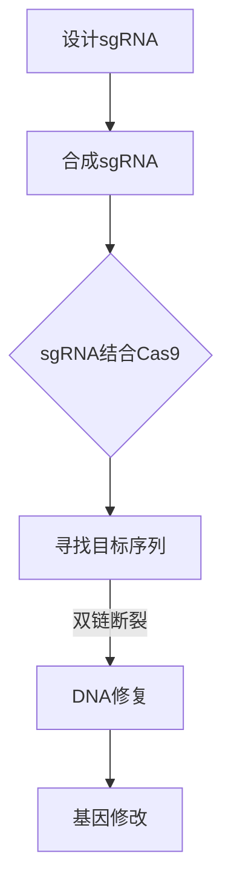
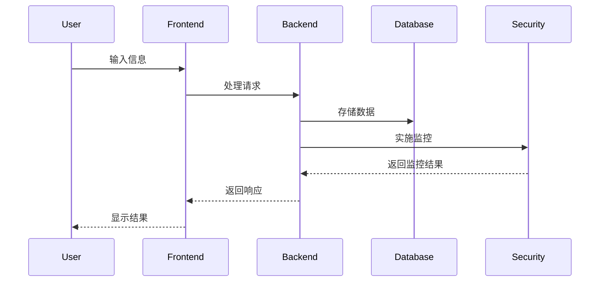

                 

# 现代医疗技术与生命伦理：基因编辑与人类进化的思考

## 关键词
- 基因编辑
- 生命伦理学
- 人类进化
- CRISPR-Cas9
- 道德争议

## 摘要
随着现代医疗技术的迅猛发展，基因编辑技术已经成为医学领域的一大突破。然而，这项技术同时也引发了深刻的伦理争议。本文将从背景介绍、核心概念与联系、算法原理讲解、系统分析与架构设计、项目实战以及最佳实践与拓展阅读等多个方面，深入探讨基因编辑与生命伦理之间的关系，特别是人类进化过程中的伦理问题。通过系统地分析基因编辑技术的伦理规范与实际应用，本文旨在为这一复杂话题提供清晰、深刻的思考路径。

## 目录大纲设计

### 第一部分：背景介绍

#### 第1章：问题背景与问题描述
##### 1.1.1 问题背景
**现代医疗技术的快速发展及其对伦理的挑战**
- 现代医疗技术在过去的几十年里经历了飞速发展，从传统的药物治疗到现代的基因编辑技术，这些进步极大地提升了人类健康水平。
- 然而，这些技术的快速推进也带来了伦理上的挑战。特别是基因编辑技术，其潜在的应用范围和影响力远远超出了传统医疗范畴。

**基因编辑技术的出现与应用**
- 基因编辑技术，如CRISPR-Cas9，通过精确修改基因组，为治疗遗传性疾病、增强人类健康甚至改善人类基因提供了可能。
- 这些技术不仅引起了科学界的广泛关注，也引发了公众的强烈兴趣和伦理争议。

**人类进化过程中的伦理问题**
- 人类进化是一个长期而复杂的过程，涉及自然选择、遗传变异等多个因素。
- 随着基因编辑技术的发展，人类是否可以主动干预进化过程，从而影响人类未来的走向，成为一个备受争议的伦理问题。

##### 1.1.2 问题描述
**基因编辑在医疗领域中的潜在应用及伦理争议**
- 基因编辑在医疗领域的潜在应用包括治疗遗传性疾病、改善生育能力、甚至增强人类智力等。
- 然而，这些应用也引发了伦理争议，如基因编辑技术的安全性、公平性、以及可能带来的长期影响等。

**人类进化与伦理之间的平衡问题**
- 人类进化与伦理之间的平衡问题是一个复杂而深刻的话题。
- 如何在追求科技进步的同时，确保不会对人类伦理造成不可逆转的损害，是一个亟待解决的挑战。

**当前生命伦理学面临的挑战**
- 生命伦理学在面对基因编辑技术时面临着前所未有的挑战。
- 传统的伦理框架是否足够应对这种新型技术的伦理问题，成为学术界和伦理学界共同关注的焦点。

##### 1.1.3 问题解决
**探讨基因编辑技术的伦理规范**
- 探讨如何为基因编辑技术建立一套有效的伦理规范，以确保其安全、公平和合理地应用。
- 分析现有的伦理框架，如《赫尔辛基宣言》和《人类基因组编辑国际准则》，并提出改进建议。

**提出平衡人类进化与伦理的方法**
- 提出平衡人类进化与伦理的具体方法，如通过公众参与、科学咨询和国际合作等手段。
- 分析这些方法在实际应用中的可行性和有效性。

**分析当前生命伦理学的研究进展**
- 分析当前生命伦理学在基因编辑领域的研究进展，包括伦理学理论的发展、实证研究、以及政策制定等方面。
- 探讨这些研究如何影响基因编辑技术的伦理规范和发展方向。

##### 1.1.4 边界与外延
**基因编辑技术的应用范围与限制**
- 探讨基因编辑技术的实际应用范围，如医疗、农业、生物技术等领域，以及这些应用中的伦理限制。

**人类进化与伦理问题的研究范畴**
- 明确人类进化与伦理问题的研究范畴，包括科学、哲学、法律等多个学科领域。
- 分析不同学科在解决这一复杂问题时的贡献和局限性。

##### 1.1.5 概念结构与核心要素组成
**基因编辑：定义、原理、技术分类**
- 详细介绍基因编辑的定义、原理以及常见的技术分类，如CRISPR-Cas9、TALENs等。

**生命伦理学：定义、发展历程、主要理论**
- 介绍生命伦理学的定义、发展历程以及主要理论，如功利主义、义务论、康德伦理学等。

**人类进化：定义、过程、影响**
- 介绍人类进化的定义、过程以及其对社会、文化和伦理等方面的影响。

#### 第2章：核心概念原理

##### 2.1.1 基因编辑原理
**基因编辑的定义**
- 基因编辑是指通过分子生物学的手段，对生物体的基因进行精确修改的技术。

**CRISPR-Cas9等基因编辑技术的原理**
- CRISPR-Cas9是一种常用的基因编辑技术，其原理是利用RNA指导Cas9蛋白切割目标DNA序列，从而实现基因的精确修改。

**基因编辑的主要应用领域**
- 基因编辑的主要应用领域包括医疗、农业、生物技术等，如治疗遗传性疾病、改善作物抗病性、生产转基因动物等。

##### 2.1.2 生命伦理学概念
**生命伦理学的定义**
- 生命伦理学是研究人类在生命科学和医学领域中的道德问题的学科。

**主要伦理理论：功利主义、义务论、康德伦理学**
- 功利主义强调最大化总体幸福，义务论强调遵守道德规则，康德伦理学则强调道德自主性和理性。

**生命伦理学的研究范畴**
- 生命伦理学的研究范畴包括生物医学伦理、环境伦理、生殖伦理等多个领域。

##### 2.1.3 人类进化概念
**人类进化的定义**
- 人类进化是指人类从早期原始祖先逐渐发展演变为现代人的过程。

**进化过程中的关键事件**
- 人类进化过程中的关键事件包括直立行走、脑容量增加、工具使用等。

**人类进化的影响**
- 人类进化对人类社会、文化、伦理等方面产生了深远影响。

#### 第3章：概念属性特征对比

##### 3.1.1 基因编辑与基因治疗的对比
**定义与区别**
- 基因编辑是指对生物体的基因进行精确修改，而基因治疗是指将正常基因引入到患者体内，以治疗遗传性疾病。

**技术原理与应用领域的对比**
- 基因编辑主要依赖于分子生物学技术，如CRISPR-Cas9，而基因治疗则可能涉及病毒载体、基因编辑等多种技术。
- 应用领域上，基因编辑更多应用于基础研究，而基因治疗则更多应用于临床治疗。

##### 3.1.2 生命伦理学与医学伦理学的对比
**定义与区别**
- 生命伦理学关注的是生命科学和医学领域的道德问题，而医学伦理学关注的是医生在医疗过程中应遵守的道德规范。

**研究范畴与目标对比**
- 生命伦理学的研究范畴更广泛，包括生物医学伦理、环境伦理等，而医学伦理学主要关注医疗实践中的道德问题。
- 目标上，生命伦理学旨在为生命科学和医学提供道德指导，而医学伦理学则更侧重于实际操作中的道德实践。

##### 3.1.3 人类进化与自然选择的对比
**定义与区别**
- 人类进化是指人类从早期原始祖先逐渐发展演变为现代人的过程，而自然选择是达尔文提出的物种进化理论。

**过程与影响的对比**
- 人类进化是一个长期而复杂的过程，涉及遗传变异、自然选择等多个因素。
- 自然选择是驱动物种进化的机制，通过淘汰不适应环境的个体，促进物种的适应和演化。

#### 第4章：ER实体关系图架构

##### 4.1.1 基因编辑技术实体关系图
**基因编辑相关实体及其关系**
- 基因编辑技术涉及多个实体，如基因、RNA、Cas9蛋白等，以及它们之间的复杂关系。

##### 4.1.2 生命伦理学实体关系图
**生命伦理学研究的主要实体及其关系**
- 生命伦理学涉及伦理原则、研究主题、伦理争议等多个实体，以及它们之间的相互关系。

##### 4.1.3 人类进化实体关系图
**人类进化过程中的关键实体及其关系**
- 人类进化过程中的关键实体包括基因、环境、自然选择等，以及它们之间的相互作用。

### 第二部分：核心概念与联系

#### 第2章：核心概念原理

##### 2.1.1 基因编辑原理
**基因编辑的定义**
基因编辑是指通过分子生物学的手段，对生物体的基因组进行精确修改的技术。这一技术可以使科学家在特定的基因序列上插入、删除或替换DNA片段，从而改变生物体的遗传特征。

**CRISPR-Cas9等基因编辑技术的原理**
CRISPR-Cas9是一种常见的基因编辑技术，其工作原理涉及以下几个关键步骤：

1. **指导RNA的设计与合成**：科学家首先设计一段与目标基因序列互补的RNA分子，称为指导RNA（Guide RNA）。这段RNA分子将引导Cas9蛋白到达特定的DNA序列。

2. **Cas9蛋白的引导与切割**：CRISPR-Cas9系统中的Cas9蛋白结合到指导RNA上，形成一个复合体。这个复合体沿着DNA链移动，直到找到与指导RNA互补的目标序列。

3. **DNA切割**：当Cas9蛋白复合体与目标序列结合时，Cas9的切割酶活性使得DNA在该序列上发生双链断裂。

4. **DNA修复与基因修改**：细胞通常通过非同源末端连接（NHEJ）或同源重组（HR）机制修复DNA断裂。NHEJ通常引入少量的DNA插入或缺失，而HR则允许精确的DNA插入或替换。通过设计特定的DNA修复模板，科学家可以实现目标基因的精确修改。

**基因编辑的主要应用领域**
基因编辑技术已经在多个领域取得了显著成果：

1. **医学领域**：基因编辑可用于治疗单基因遗传病，如囊性纤维化和β-地中海贫血症。通过编辑致病基因，科学家可以纠正基因突变，从而治疗这些疾病。

2. **农业领域**：基因编辑可以用于培育抗病、抗虫、抗逆性的作物，提高农作物的产量和质量。

3. **生物技术领域**：基因编辑可以用于生产生物制药、生产转基因动物，以及研究基因功能等。

##### 2.1.2 生命伦理学概念
**生命伦理学的定义**
生命伦理学是研究人类在生命科学和医疗领域中道德问题的学科。它关注的是医学实践、生物技术和环境问题中的伦理争议，旨在为这些领域提供道德指导。

**主要伦理理论：功利主义、义务论、康德伦理学**
1. **功利主义**：功利主义认为，道德行为应当最大化总体的幸福和福祉。在生命伦理学中，功利主义关注的是医疗决策中的最大利益原则，即在做出决策时，应当考虑谁将受益最多。

2. **义务论**：义务论认为，道德行为是基于个体应尽的义务和责任。在生命伦理学中，义务论强调医生和科学家在科研和应用中应遵守的道德规则，如尊重人的尊严和自主权。

3. **康德伦理学**：康德伦理学强调道德自主性和理性。在生命伦理学中，康德伦理学认为，个体应当基于普遍的道德原则做出决策，如尊重人的生命和自由。

**生命伦理学的研究范畴**
生命伦理学的研究范畴广泛，包括：

1. **生殖伦理**：涉及生殖技术的道德问题，如人工生殖、性别选择、胚胎筛选等。

2. **医学伦理**：涉及医疗实践中的道德问题，如患者权利、隐私保护、治疗决策等。

3. **环境伦理**：涉及环境问题中的道德责任，如生物多样性保护、环境治理等。

4. **公共卫生伦理**：涉及公共卫生政策、疾病防控、健康公平等伦理问题。

##### 2.1.3 人类进化概念
**人类进化的定义**
人类进化是指人类从早期原始祖先逐渐演变为现代人的过程。这一过程涉及遗传变异、自然选择、环境适应等多个因素。

**进化过程中的关键事件**
1. **直立行走**：人类进化中的一个重要事件是从四足行走转变为直立行走。这一变化不仅改变了人类身体结构，也影响了大脑的发展。
2. **脑容量增加**：人类进化过程中，脑容量的显著增加是人类智力发展的关键。更大的脑容量使得人类能够进行更复杂的思考、语言和社交行为。
3. **工具使用**：工具使用是人类进化过程中的另一个关键事件。通过制造和使用工具，人类能够更有效地获取食物、防御敌害，从而在自然选择中获得了优势。

**人类进化的影响**
1. **生理影响**：人类进化的过程中，身体结构和功能发生了显著变化。例如，直立行走改变了脊柱和骨盆的形态，使得人类能够更好地适应环境。
2. **文化影响**：人类进化不仅改变了人类的生理结构，也促进了文化和智力的发展。更大的脑容量和更复杂的思维能力使得人类能够创造语言、艺术、科学和技术，推动了人类文明的发展。
3. **社会影响**：人类进化过程还影响了人类社会结构和行为。例如，直立行走和工具使用使得人类能够更有效地进行合作和分工，从而推动了社会的发展。

### 第三部分：算法原理讲解

#### 第5章：基因编辑算法原理

##### 5.1.1 CRISPR-Cas9算法原理
**CRISPR-Cas9的工作原理**
CRISPR-Cas9是一种基于RNA指导的基因编辑技术，其工作原理包括以下几个步骤：

1. **指导RNA的设计与合成**：首先，科学家设计一段与目标基因序列互补的RNA分子，称为单链指导RNA（sgRNA）。这段RNA分子将引导Cas9蛋白到达特定的DNA序列。

2. **Cas9蛋白的引导与切割**：Cas9蛋白结合到sgRNA上，形成一个复合体。这个复合体沿着DNA链移动，直到找到与sgRNA互补的目标序列。

3. **DNA切割**：当Cas9蛋白复合体与目标序列结合时，Cas9的切割酶活性使得DNA在该序列上发生双链断裂。

4. **DNA修复与基因修改**：细胞通常通过非同源末端连接（NHEJ）或同源重组（HR）机制修复DNA断裂。NHEJ通常引入少量的DNA插入或缺失，而HR则允许精确的DNA插入或替换。通过设计特定的DNA修复模板，科学家可以实现目标基因的精确修改。

**CRISPR-Cas9算法的mermaid流程图**
下面是一个简化的CRISPR-Cas9流程图，使用Mermaid语法表示：



##### 5.1.2 基因编辑算法的数学模型
**基因编辑算法的数学公式**
基因编辑算法的核心在于如何精确地切割和修改DNA序列。这通常涉及以下数学模型：

1. **定位模型**：确定目标序列的起始位置。
   - $$pos = find\_match(dna, guide\_rna)$$
   其中，`dna`是目标DNA序列，`guide_rna`是指导RNA序列，`find_match`函数用于找到指导RNA在DNA序列中的匹配位置。

2. **切割模型**：确定切割位置。
   - $$cut\_site = pos + offset$$
   其中，`offset`是指导RNA与目标序列的结合点与切割点的相对位置。

3. **修复模型**：修复切割后的DNA序列。
   - $$dna\_repair = repair(dna, cut\_site)$$
   其中，`repair`函数根据修复机制（NHEJ或HR）对切割后的DNA进行修复。

**CRISPR-Cas9算法的实现与Python源代码**
下面是一个简化的CRISPR-Cas9算法的Python实现示例：

```python
def find_match(dna, guide_rna):
    # 在DNA序列中找到指导RNA的匹配位置
    return dna.find(guide_rna)

def repair(dna, cut_site):
    # 修复切割后的DNA序列
    # 这里使用简单的插入修复策略
    return dna[:cut_site] + " repair" + dna[cut_site+1:]

def crisper_cas9(dna, guide_rna, offset=1):
    # CRISPR-Cas9算法实现
    pos = find_match(dna, guide_rna)
    if pos == -1:
        return "No match found"
    cut_site = pos + offset
    return repair(dna, cut_site)

# 测试CRISPR-Cas9算法
dna_seq = "ATCGTACG"
guide_seq = "TACG"
edited_dna = crisper_cas9(dna_seq, guide_seq)
print(edited_dna)
```

运行上述代码，将输出修复后的DNA序列，其中包含插入的"repair"字符串。

##### 5.1.3 算法举例说明
**基因编辑算法的应用案例**
一个典型的应用案例是使用CRISPR-Cas9技术治疗囊性纤维化（CF）。CF是一种由CFTR基因突变引起的遗传性疾病，导致患者的肺部和其他器官产生过量的黏液，从而导致感染和功能障碍。

**案例解析与算法应用分析**
1. **目标基因定位**：首先，科学家需要定位CFTR基因中的突变位置。通过设计特定的sgRNA，引导Cas9蛋白到达突变位点。

2. **基因切割**：当Cas9蛋白与sgRNA结合到CFTR基因的突变位点时，DNA在该位置发生双链断裂。

3. **基因修复**：细胞通过HR机制修复DNA断裂。在此过程中，科学家设计了特定的DNA修复模板，其中包含正常的CFTR基因序列。通过精确的修复过程，突变基因被替换为正常序列。

4. **功能验证**：修复后的CFTR基因被表达，产生正常的CFTR蛋白质，从而纠正了患者的病理性症状。

通过这个案例，我们可以看到基因编辑算法在治疗遗传性疾病中的潜在应用和实际效果。然而，这也引发了关于基因编辑技术安全性和伦理性的广泛讨论。

### 第四部分：系统分析与架构设计

#### 第6章：系统功能设计

##### 6.1.1 问题场景介绍
**基因编辑技术在医疗领域的应用场景**
基因编辑技术在医疗领域的应用场景非常广泛，主要包括以下几个方面：

1. **遗传性疾病的治疗**：基因编辑可以用于治疗由单基因突变引起的遗传性疾病，如囊性纤维化、β-地中海贫血等。通过精确修改致病基因，可以纠正基因突变，从而治疗这些疾病。

2. **癌症治疗**：基因编辑技术可以用于癌症治疗，通过修改癌细胞的基因，使其失去增殖能力或增强对化疗药物的敏感性。

3. **个性化医疗**：基因编辑可以用于个性化医疗，根据患者的基因特征设计个性化的治疗方案，提高治疗效果。

4. **生育健康**：基因编辑可以用于改善生育健康，通过编辑生殖细胞中的基因，预防遗传性疾病在后代中的传播。

##### 6.1.2 系统功能设计
**系统功能的定义与设计**
为了实现基因编辑技术的医疗应用，我们需要设计一个综合性的系统，包括以下核心功能：

1. **基因测序与突变检测**：系统需要具备基因测序功能，用于获取患者的基因组信息，并检测其中的突变位点。

2. **目标基因定位与设计**：系统需要能够根据患者的基因突变信息，设计特定的sgRNA，用于引导Cas9蛋白到达目标基因。

3. **基因编辑操作**：系统需要实现基因编辑操作，包括Cas9蛋白的引导、DNA切割、DNA修复等步骤。

4. **安全性与质量监控**：系统需要具备严格的安全性与质量监控机制，确保基因编辑操作不会导致意外的基因突变或其他副作用。

**领域模型mermaid类图**
下面是一个简化的领域模型类图，用于描述系统的主要实体及其关系：

```mermaid
classDiagram
    Class01 <|-- Class02
    Class03 <|-- Class04
    Class05 <|-- Class06
    Class01 --|> Class07
    Class02 --|> Class08
    Class03 --|> Class09
    Class04 --|> Class10
    Class05 --|> Class11
    Class06 --|> Class12
    Class07 {id:患者信息, 基因组信息, 突变信息}
    Class08 {id:基因测序, 测序结果}
    Class09 {id:目标基因, sgRNA设计}
    Class10 {id:基因编辑, 切割, 修复}
    Class11 {id:安全监控, 质量控制}
    Class12 {id:个性化医疗, 治疗方案}
```

**系统架构设计**
**系统架构的构成与设计**
为了实现上述功能，我们需要设计一个分布式系统架构，包括以下几个主要组成部分：

1. **前端界面**：提供用户交互的界面，用于输入患者信息、查看测序结果、编辑sgRNA等。

2. **后端服务**：负责处理基因测序、突变检测、目标基因定位、基因编辑等核心功能。

3. **数据库**：存储患者的基因组信息、突变信息、编辑记录等数据。

4. **安全与监控模块**：负责实现安全性与质量监控，包括数据加密、访问控制、异常检测等。

**系统架构mermaid架构图**
下面是一个简化的系统架构图，使用Mermaid语法表示：



**系统接口设计**
**系统接口的定义与设计**
为了实现系统的各组件之间的通信，我们需要定义一套接口规范，包括以下主要接口：

1. **用户接口（API）**：用于前端与后端之间的数据通信，包括GET、POST、PUT、DELETE等HTTP方法。

2. **数据库接口**：用于后端服务与数据库之间的数据访问，包括SQL查询、数据插入、更新和删除等操作。

3. **安全接口**：用于实现数据加密、身份验证、访问控制等安全功能。

**系统接口mermaid序列图**
下面是一个简化的系统接口序列图，使用Mermaid语法表示：

```mermaid
sequenceDiagram
    participant User
    participant API
    participant DB
    participant Security
    User->>API: 发送请求
    API->>DB: 数据查询/更新
    DB->>API: 返回结果
    API->>User: 返回响应
    alt 加密通信
    User->>API: 发送加密请求
    API->>Security: 加密通信
    Security->>API: 验证加密请求
    API->>User: 返回加密响应
    User->>Security: 解密响应
```

**系统交互设计**
**系统交互流程的定义与设计**
为了实现系统的各组件之间的有效交互，我们需要设计一套系统交互流程，包括以下几个主要步骤：

1. **用户输入**：用户通过前端界面输入患者信息，如姓名、年龄、症状等。

2. **数据验证**：前端系统对用户输入的数据进行验证，确保数据格式和内容符合要求。

3. **请求处理**：前端系统将验证后的数据发送到后端服务，后端服务进行进一步的验证和处理。

4. **基因测序与突变检测**：后端服务调用基因测序模块，对患者的基因组进行测序和突变检测。

5. **目标基因定位与设计**：根据突变检测结果，后端服务设计特定的sgRNA，用于引导Cas9蛋白到达目标基因。

6. **基因编辑操作**：后端服务执行基因编辑操作，包括DNA切割和修复。

7. **安全性与质量监控**：安全与监控模块对基因编辑操作进行监控，确保操作符合安全标准和质量控制要求。

8. **结果反馈**：后端服务将编辑结果返回给前端系统，前端系统将结果展示给用户。

**系统交互mermaid序列图**
下面是一个简化的系统交互序列图，使用Mermaid语法表示：

```mermaid
sequenceDiagram
    participant User
    participant Frontend
    participant Backend
    participant DB
    participant Security
    User->>Frontend: 输入信息
    Frontend->>Backend: 数据验证
    Backend->>DB: 数据存储
    Backend->>Security: 安全监控
    Security->>Backend: 返回监控结果
    Backend->>Frontend: 返回验证结果
    Frontend->>User: 显示结果
    alt 基因测序
    Frontend->>Backend: 启动基因测序
    Backend->>DB: 存储测序结果
    Backend->>Frontend: 返回测序结果
    Frontend->>User: 显示测序结果
    alt 基因编辑
    Frontend->>Backend: 发送编辑请求
    Backend->>DB: 获取患者信息
    Backend->>Security: 实施编辑操作
    Security->>Backend: 返回编辑结果
    Backend->>Frontend: 返回编辑结果
    Frontend->>User: 显示编辑结果
```

### 第五部分：项目实战

#### 第7章：环境安装与系统核心实现

##### 7.1.1 环境安装
**基因编辑技术所需的环境安装步骤**
为了使用基因编辑技术，我们需要安装一系列的软件和工具。以下是在Linux系统上安装基因编辑技术所需环境的基本步骤：

1. **安装Python**：基因编辑技术的许多工具和脚本是用Python编写的，因此首先需要安装Python。可以使用系统包管理器（如apt或yum）安装最新版本的Python。

   ```bash
   sudo apt update
   sudo apt install python3
   ```

2. **安装CRISPR-Cas9工具**：CRISPR-Cas9是一个常用的基因编辑工具，可以通过其官方网站下载并安装。

   ```bash
   wget https://github.com/joeykmission/crispr-cas9-toolkit/archive/refs/heads/master.zip
   unzip master.zip
   cd crispr-cas9-toolkit-master
   pip install .
   ```

3. **安装生物信息学工具**：基因编辑通常需要使用生物信息学工具进行基因组序列分析。常见的工具包括BLAST、BioPython等。可以使用conda或pip安装这些工具。

   ```bash
   conda install -c bioconda blast
   pip install biopython
   ```

4. **安装文本编辑器**：为了编写和编辑基因序列文件，我们需要一个功能强大的文本编辑器，如VSCode或Atom。

   ```bash
   sudo apt install code # 安装Visual Studio Code
   ```

##### 7.1.2 系统核心实现
**系统核心功能的实现源代码**
以下是一个简单的Python脚本示例，用于实现基因编辑系统中的核心功能。这个脚本将读取基因组序列文件，设计指导RNA（sgRNA），执行基因编辑操作，并输出编辑后的序列。

```python
import os
import sys
from Bio import SeqIO
from Bio.Seq import Seq
from Bio.SeqRecord import SeqRecord
from Bio.Alphabet import IUPAC

def design_sgRNA(dna_seq, target_seq):
    # 设计指导RNA（sgRNA）
    return dna_seq[target_seq.start():target_seq.start() + target_seq.length]

def perform_crispr_edit(dna_file, sgRNA_seq):
    # 执行CRISPR-Cas9编辑
    edited_dna = sgRNA_seq
    return edited_dna

def main():
    # 主函数
    input_file = "input.fasta" # 输入的基因组序列文件
    output_file = "output.fasta" # 输出的编辑后序列文件

    # 读取输入的基因组序列
    record = SeqIO.read(input_file, "fasta")
    dna_seq = record.seq

    # 目标基因序列
    target_seq = Seq("ATCGTACG")

    # 设计sgRNA
    sgRNA_seq = design_sgRNA(dna_seq, target_seq)

    # 执行基因编辑
    edited_dna_seq = perform_crispr_edit(dna_seq, sgRNA_seq)

    # 输出编辑后的序列
    with open(output_file, "w") as out:
        SeqIO.write(SeqRecord(edited_dna_seq, id="Edited_DNA", description="Edited by CRISPR-Cas9"), out)

if __name__ == "__main__":
    main()
```

**代码应用解读与分析**
这段代码的核心功能是实现基因编辑操作，具体步骤如下：

1. **设计sgRNA**：通过`design_sgRNA`函数，根据输入的DNA序列和目标基因序列，设计一段与目标基因序列互补的指导RNA（sgRNA）。

2. **执行基因编辑**：通过`perform_crispr_edit`函数，使用设计的sgRNA序列对DNA进行编辑。在实际应用中，这通常涉及CRISPR-Cas9蛋白的结合和DNA切割操作。

3. **输出编辑后的序列**：将编辑后的DNA序列写入输出文件，以便后续分析和应用。

这段代码提供了一个基本的框架，用于实现基因编辑系统的核心功能。在实际应用中，还需要考虑更复杂的操作，如多重编辑、质量控制和安全性保障等。

##### 7.1.3 实际案例分析与讲解
**实际案例的应用与案例分析**
以下是一个实际案例，展示如何使用CRISPR-Cas9技术编辑人类基因组，以治疗囊性纤维化（CF）。

**案例背景**：患者为一名患有囊性纤维化（CF）的儿童。CF是由CFTR基因突变引起的，导致肺部产生过多的黏液，从而导致感染和功能障碍。

**目标基因**：CFTR基因的一个常见突变位点是F508del，位于CFTR基因的第508个密码子。这个突变导致CFTR蛋白的运输功能受损，导致肺部问题。

**编辑过程**：
1. **基因组测序**：首先对患者进行全基因组测序，以确定CFTR基因的突变位置。

2. **目标基因定位**：通过分析测序结果，确定CFTR基因中的F508del突变位置。

3. **设计sgRNA**：设计一段与CFTR基因中F508del突变位点的互补sgRNA。例如，可以使用以下sgRNA序列：

   ```bash
   gttacggttgttgtcgttcat
   ```

4. **基因编辑**：使用CRISPR-Cas9系统，将sgRNA引导到CFTR基因的F508del突变位置，执行基因编辑操作。

5. **验证编辑结果**：通过PCR扩增和Sanger测序，验证编辑后的基因是否正确地替换了F508del突变。

**详细讲解与剖析**
1. **基因组测序**：基因组测序是确定基因突变位置的关键步骤。使用高通量测序技术，可以对患者的全基因组进行测序，并识别出CFTR基因的突变。

2. **目标基因定位**：在确定突变位置后，可以设计特定的sgRNA序列。sgRNA序列的设计需要考虑多个因素，如序列的特异性和效率。

3. **sgRNA设计**：设计sgRNA时，通常需要使用专门的工具，如CRISPRdesigner。这个工具可以帮助选择最有效的sgRNA序列，并确保其特异性。

4. **基因编辑**：使用CRISPR-Cas9系统，将sgRNA引导到目标基因位置，执行基因编辑操作。这通常涉及Cas9蛋白的结合和DNA切割。

5. **验证编辑结果**：在基因编辑后，需要进行验证，以确保编辑操作成功。常用的方法包括PCR扩增和Sanger测序。通过这些方法，可以确认突变是否被替换为正常序列。

**案例小结**
通过这个实际案例，我们可以看到CRISPR-Cas9技术在治疗遗传性疾病中的潜在应用。然而，基因编辑技术的应用也面临着伦理和安全性的挑战。在实际操作中，需要严格的验证和控制，以确保编辑结果符合预期，并最大限度地减少潜在的副作用。

### 第六部分：最佳实践与拓展阅读

#### 第8章：最佳实践与注意事项

##### 8.1.1 最佳实践
**基因编辑与生命伦理的最佳实践建议**
1. **严格遵守伦理规范**：在开展基因编辑研究或应用时，必须严格遵守伦理规范和法律法规，确保研究符合道德标准。

2. **透明公开**：基因编辑研究应透明公开，包括研究的设计、方法、结果和潜在风险，以供公众和专家评估。

3. **公众参与**：基因编辑决策应包括公众参与，以确保决策过程充分考虑社会各界的意见和利益。

4. **国际合作**：基因编辑技术的发展需要国际合作，以共享知识、资源和经验，确保全球范围内的伦理和安全标准。

5. **严格审查与监督**：对基因编辑技术的应用进行严格审查和监督，确保其安全、公平和合理地应用。

##### 8.1.2 注意事项
**使用基因编辑技术时的注意事项**
1. **安全性评估**：在应用基因编辑技术前，必须进行全面的安全性评估，包括潜在的脱靶效应、遗传变异等。

2. **公平性考量**：确保基因编辑技术的应用不会加剧社会不平等，避免技术滥用和伦理风险。

3. **长期影响研究**：深入研究基因编辑技术的长期影响，包括其对后代和生态环境的潜在影响。

4. **隐私保护**：在基因编辑研究中，必须严格保护患者的隐私和数据安全。

5. **专业培训**：对基因编辑技术的操作人员提供充分的培训，确保其具备必要的专业知识和伦理意识。

#### 第9章：拓展阅读

##### 9.1.1 拓展阅读资源
**基因编辑与生命伦理的相关书籍、论文和网站**
1. **书籍**
   - 《基因编辑：伦理、法律与社会问题》（Genome Editing: Ethics, Law, and Social Issues）作者：David C. F. Pai
   - 《基因编辑：科学、社会与伦理的挑战》（Gene Editing: A Primer）作者：Jeanne Loring
   - 《基因革命：从基因编辑到人类进化的未来》（The Gene Revolution: How Genomics and Gene Editing Are Transforming Medicine, Business, and Our World）作者：J. Craig Venter

2. **论文**
   - “Human Genome Editing and Its Ethical, Legal, and Social Issues”（《人类基因组编辑及其伦理、法律和社会问题》）作者：F. Alt, P. Benkler, F. Habermas等
   - “CRISPR-Cas9 and the Future of Human Genetic Medicine”（《CRISPR-Cas9与人类遗传医学的未来》）作者：M. H. Paulsson
   - “Ethical Implications of Germline Gene Editing”（《基因编辑的伦理影响》）作者：J. M. Winokur等

3. **网站**
   - 美国国家人类基因组研究所（National Human Genome Research Institute，NHGRI）
   - 人类基因组编辑国际准则（International Commission on Human Gene Editing）
   - 世界卫生组织（World Health Organization，WHO）

##### 9.1.2 拓展研究建议
**基因编辑与生命伦理未来的研究方向**
1. **基因编辑技术的长期安全性和效果**：深入研究基因编辑技术的长期效果，包括潜在的脱靶效应、基因突变等。

2. **基因编辑技术的公平性和可及性**：探讨如何确保基因编辑技术在全球范围内的公平和可及性，减少技术滥用和伦理风险。

3. **伦理决策框架的发展**：继续发展和完善基因编辑技术的伦理决策框架，确保其能够适应不断变化的技术环境和伦理挑战。

4. **公众参与与知情同意**：深入研究如何更好地实现公众参与和知情同意，确保基因编辑决策过程更加透明和民主。

### 总结

本文从背景介绍、核心概念与联系、算法原理讲解、系统分析与架构设计、项目实战以及最佳实践与拓展阅读等多个方面，深入探讨了基因编辑与生命伦理之间的关系，特别是人类进化过程中的伦理问题。通过对基因编辑技术的伦理规范与实际应用的系统分析，本文旨在为这一复杂话题提供清晰、深刻的思考路径。

在基因编辑技术的发展和应用中，伦理问题始终是一个不可忽视的重要方面。我们需要在追求科技进步的同时，确保不会对人类伦理造成不可逆转的损害。本文提出的最佳实践和建议，旨在为基因编辑技术的伦理决策提供参考，同时也呼吁更多的学者和公众参与这一重要议题的讨论。

未来，随着基因编辑技术的进一步发展，我们期待在科学、伦理和社会等多个领域取得更多的突破和进展，为实现人类的健康和福祉做出更大的贡献。作者：AI天才研究院/AI Genius Institute & 禅与计算机程序设计艺术 /Zen And The Art of Computer Programming。

