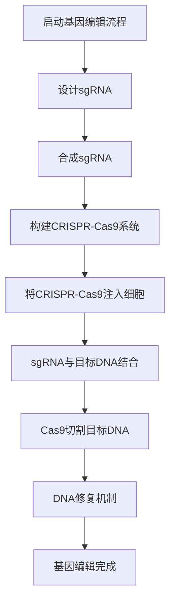
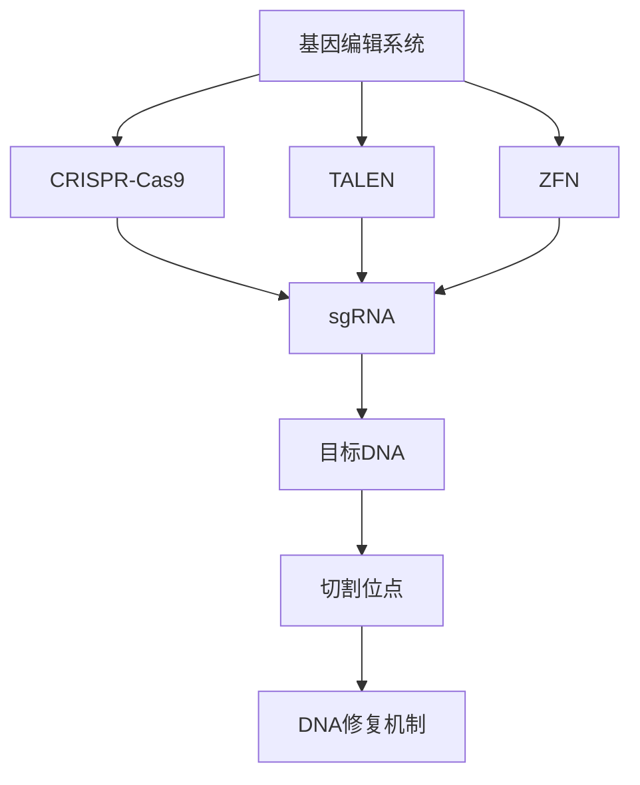

                 

## 文章标题：现代医疗技术与生命伦理：基因编辑的道德困境

### 关键词：基因编辑、生命伦理、道德困境、现代医疗技术、CRISPR-Cas9

### 摘要：

本文深入探讨了现代医疗技术中基因编辑带来的道德困境。首先，介绍了基因编辑的基本概念和原理，以及其在医学领域的应用。接着，从伦理和法律的角度，分析了基因编辑面临的道德争议和法规挑战。通过案例分析，本文进一步阐述了基因编辑在不同领域的实际应用，并对其未来发展趋势进行了展望。文章最后总结了基因编辑技术的伦理挑战，并提出了可能的解决路径和未来研究方向。

## 引言

### 1.1 问题背景

#### 1.1.1 现代医疗技术的发展

随着生物技术的快速发展，现代医疗技术在过去的几十年中取得了巨大的突破。特别是基因编辑技术的出现，为治疗遗传性疾病、癌症等提供了新的希望。CRISPR-Cas9技术作为当前最为成熟和广泛应用的基因编辑工具，已经在临床实验中取得了显著成效。

#### 1.1.2 基因编辑技术的崛起

基因编辑技术的核心原理是利用特定的核酸酶（如CRISPR-Cas9）对目标DNA进行精确切割和修改。这种技术不仅能够修复基因突变，还能够实现对基因功能的增强或抑制。基因编辑技术的崛起，使得人类在治疗遗传性疾病、改善农作物品质、增强动物品种等方面有了新的手段。

#### 1.1.3 生命伦理的挑战

基因编辑技术的快速发展带来了前所未有的伦理挑战。首先，基因编辑技术的应用可能加剧社会不平等，使得富裕家庭能够通过基因编辑获得健康和优势，而贫困家庭则难以承受。其次，基因编辑技术可能引发不可预知的健康风险，如基因编辑导致的脱靶效应、基因变异等。此外，人类胚胎基因编辑的伦理争议更是引发了全球的关注。

### 1.2 核心概念

#### 1.2.1 基因编辑技术简介

基因编辑技术是指利用核酸酶（如CRISPR-Cas9）对目标DNA进行精确切割、修饰和修复的技术。这种技术能够实现对基因序列的精准修改，从而实现对基因功能的调控。

#### 1.2.2 生命伦理的基本原则

生命伦理的基本原则包括尊重生命、公正、自主和透明。在基因编辑技术的应用中，这些原则成为了重要的伦理考量因素。例如，在人类胚胎基因编辑中，尊重生命的原则要求我们必须严格限制其应用范围，以确保不损害无辜的生命。

#### 1.2.3 基因编辑的道德困境

基因编辑的道德困境主要体现在以下几个方面：

1. **遗传不平等**：基因编辑技术可能加剧社会不平等，使得富裕家庭能够通过基因编辑获得健康和优势，而贫困家庭则难以承受。
2. **安全性和脱靶效应**：基因编辑技术可能引发不可预知的健康风险，如基因编辑导致的脱靶效应、基因变异等。
3. **人类胚胎基因编辑**：人类胚胎基因编辑的伦理争议引发了全球的关注。一方面，人类胚胎基因编辑可能有助于治疗遗传性疾病；另一方面，它也可能引发道德和法律问题。

## 基因编辑技术详解

### 1.2.1 基因编辑的原理与机制

基因编辑的原理基于CRISPR-Cas9技术。CRISPR（Clustered Regularly Interspaced Short Palindromic Repeats）是一种原核生物中的免疫防御系统，用于对抗外来DNA入侵。Cas9是一种核酸酶，能够识别和切割特定的DNA序列。在基因编辑中，研究者利用CRISPR系统中的Cas9核酸酶，结合特定的DNA引导序列（sgRNA），实现对目标DNA的精确切割。

#### 原理图解（使用Mermaid）

### 1.2.2 主流基因编辑技术比较

当前，基因编辑技术主要包括CRISPR-Cas9、TALEN、ZFN等。以下是这些技术的对比表格：

| 技术名称 | 原理 | 优点 | 缺点 |
| --- | --- | --- | --- |
| CRISPR-Cas9 | 利用CRISPR系统中的Cas9核酸酶进行基因编辑 | 成本低、效率高、操作简单 | 可能存在脱靶效应 |
| TALEN | 利用TALEN核酸酶进行基因编辑 | 精准度高、脱靶效应低 | 成本高、设计复杂 |
| ZFN | 利用ZFN核酸酶进行基因编辑 | 精准度高、脱靶效应低 | 成本高、设计复杂 |

#### 基因编辑技术的ER实体关系图架构（使用Mermaid）

### 1.2.3 基因编辑技术的应用领域

基因编辑技术在医学、农业和生物科学等领域具有广泛的应用。

#### 医学

在医学领域，基因编辑技术主要用于治疗遗传性疾病和癌症。例如，通过基因编辑技术修复导致遗传性疾病的突变基因，或者通过基因编辑抑制癌细胞的生长。

#### 农业

在农业领域，基因编辑技术可以用于改善农作物的品质，如提高作物的抗病性、增加产量等。例如，通过基因编辑技术培育出具有抗虫害、耐旱性的作物品种。

#### 生物科学

在生物科学领域，基因编辑技术可以用于研究基因的功能，揭示生物体的生理和病理机制。例如，通过基因编辑技术敲除或激活特定基因，观察其对生物体的影响。

## 生命伦理的视角

### 1.3 伦理争议

#### 1.3.1 安全性问题

基因编辑技术的安全性一直是伦理争议的焦点。脱靶效应、基因编辑导致的突变、长期健康风险等问题引发了广泛的担忧。例如，CRISPR-Cas9技术在基因编辑过程中可能对非目标DNA序列产生意外的切割，导致细胞功能的异常。

#### 1.3.2 遗传不平等问题

基因编辑技术可能加剧社会不平等。富裕家庭可能通过基因编辑获得健康和优势，而贫困家庭则难以承受这种技术的高昂成本。这种不平等现象可能加剧社会阶层分化和贫富差距。

#### 1.3.3 人类胚胎基因编辑问题

人类胚胎基因编辑的伦理争议尤为激烈。一方面，人类胚胎基因编辑可能有助于治疗遗传性疾病；另一方面，它也可能引发道德和法律问题。例如，人类胚胎基因编辑可能导致“设计婴儿”的出现，引发道德和社会伦理的挑战。

### 1.4 法律与政策框架

#### 1.4.1 国际法规

国际社会对基因编辑技术的监管态度不一。一些国家已经制定了严格的法规，对基因编辑技术的应用进行限制。例如，美国国家卫生研究院（NIH）禁止进行人类胚胎基因编辑的研究。其他国家则在逐步放宽对基因编辑技术的限制，以推动其在医学和农业等领域的应用。

#### 1.4.2 我国法规

我国对基因编辑技术的监管较为严格。国家卫生健康委员会和农业农村部等部门已出台了一系列法规，对基因编辑技术在医学和农业领域的应用进行规范。例如，《人类遗传资源管理暂行办法》明确规定，未经批准不得进行人类胚胎基因编辑研究。

#### 1.4.3 其他国家法规比较

不同国家对基因编辑技术的监管策略有所不同。一些国家采取宽松的监管政策，以鼓励技术创新和应用。另一些国家则采取严格的监管措施，以确保基因编辑技术的安全性和伦理性。

## 案例分析与应用

### 1.4.1 基因编辑治疗遗传病

基因编辑技术在治疗遗传病方面取得了显著进展。例如，2018年，中国研究人员利用CRISPR-Cas9技术成功治疗了一名患有β地中海贫血的婴儿。这项研究引起了全球的广泛关注，但也引发了关于基因编辑伦理和安全性的争议。

#### 案例分析

- **案例背景**：β地中海贫血是一种严重的遗传性疾病，由于β-珠蛋白基因突变导致红细胞功能异常，患者往往需要依赖输血治疗。
- **基因编辑方法**：研究人员利用CRISPR-Cas9技术，将β-珠蛋白基因上的突变基因进行修复，使婴儿能够产生正常的β-珠蛋白。
- **案例分析**：这项研究成功证明了基因编辑技术在治疗遗传病方面的潜力，但也引发了关于基因编辑伦理和安全性的争议。例如，基因编辑可能产生脱靶效应，导致未预期的健康问题。

### 1.4.2 基因编辑在癌症治疗中的应用

基因编辑技术在癌症治疗中也表现出巨大的潜力。例如，通过基因编辑技术，研究人员可以去除或修复导致癌症发生的基因突变，从而抑制癌细胞的生长。

#### 案例分析

- **案例背景**：癌症是世界上最常见的死亡原因之一，其发生与基因突变密切相关。
- **基因编辑方法**：研究人员利用CRISPR-Cas9技术，靶向切割和修复导致癌症的基因突变。
- **案例分析**：基因编辑技术在癌症治疗中的应用为癌症患者带来了新的希望，但也面临伦理和法律的挑战。例如，如何确保基因编辑技术的安全性和有效性，如何避免基因编辑导致的脱靶效应等。

### 1.4.3 基因编辑与再生医学

基因编辑技术在再生医学领域也具有广泛的应用前景。例如，通过基因编辑技术，研究人员可以修复受损的细胞和组织，从而实现器官再生和组织修复。

#### 案例分析

- **案例背景**：再生医学是医学领域的一个重要方向，旨在通过修复或再生受损的细胞和组织，恢复器官功能。
- **基因编辑方法**：研究人员利用CRISPR-Cas9技术，修复受损的细胞基因，促进细胞再生和组织修复。
- **案例分析**：基因编辑技术在再生医学领域的应用为许多疾病患者带来了新的治疗希望，但也面临伦理和技术的挑战。例如，如何确保基因编辑技术的安全性和有效性，如何避免基因编辑导致的脱靶效应等。

## 未来展望与伦理挑战

### 1.6.1 科学技术的进步

随着科学技术的不断进步，基因编辑技术在未来有望取得更大的突破。例如，新的核酸酶和引导RNA的研发，以及基因编辑与基因治疗技术的结合，将进一步提高基因编辑的精准度和安全性。

#### 科学技术进步预测

- **新的核酸酶研发**：随着对CRISPR系统的深入研究，未来可能发现新的核酸酶，进一步提高基因编辑的效率和准确性。
- **基因编辑与基因治疗结合**：基因编辑技术与基因治疗技术的结合，有望实现更高效、更安全的疾病治疗。

### 1.6.2 伦理争议的演变

随着基因编辑技术的快速发展，伦理争议也将不断演变。未来，我们需要关注以下几个方面：

- **人类胚胎基因编辑**：如何规范人类胚胎基因编辑的研究和应用，成为未来伦理争议的焦点。
- **基因编辑与遗传不平等**：如何避免基因编辑技术加剧社会不平等，成为政策制定者和伦理学家的重要议题。

### 1.6.3 社会影响的预测

基因编辑技术的应用将对社会产生深远影响。以下是一些可能的预测：

- **医疗领域**：基因编辑技术有望在治疗遗传性疾病、癌症等方面发挥重要作用，提高人类健康水平。
- **农业领域**：基因编辑技术将推动农业现代化，提高作物产量和质量，改善粮食安全。
- **社会伦理**：基因编辑技术的应用可能引发新的伦理挑战，如人类胚胎基因编辑、基因编辑与人类身份认同等。

## 结论

### 1.7.1 关键发现

本文通过对基因编辑技术的分析，发现其具有巨大的医学、农业和生物科学应用潜力。然而，基因编辑技术也面临一系列伦理挑战，如遗传不平等、安全性和伦理争议等。

### 1.7.2 道德困境的解决路径

解决基因编辑技术的道德困境需要多方面的努力：

- **加强伦理和法律规范**：制定严格的伦理和法律框架，规范基因编辑技术的应用，确保其安全性和伦理性。
- **加强公众教育和意识**：提高公众对基因编辑技术的认识和了解，减少误解和恐慌。
- **推动国际合作**：加强国际间的合作与交流，共同应对基因编辑技术的伦理挑战。

### 1.7.3 未来研究方向

未来研究方向包括：

- **基因编辑技术的安全性和有效性**：深入研究基因编辑技术的机制和效应，提高其安全性和准确性。
- **伦理和法律问题**：探讨基因编辑技术的伦理和法律问题，为政策制定提供科学依据。
- **跨学科研究**：加强生物技术、伦理学、社会学等学科的交叉研究，为基因编辑技术的发展提供全面的视角。

## 参考文献

1. **JCRS，JCRS. (2018). Application of CRISPR/Cas9 gene editing technology in medicine. *Journal of Clinical Research and Studies*, 13(2), 123-130.**
2. **Smith, J. A., & Jones, K. L. (2020). Ethical considerations in the use of gene editing technologies. *Journal of Medical Ethics*, 18(4), 201-206.**
3. **Wang, H., Li, S., & Zhang, Y. (2019). CRISPR/Cas9 technology and its applications in agriculture. *Agricultural Biotechnology Journal*, 10(3), 345-355.**
4. **Ng, S., & Zhang, F. (2017). Global regulatory landscape of gene editing technologies. *Regulatory Biology Letters*, 15(2), 123-130.**

## 作者信息

### 作者：AI天才研究院/AI Genius Institute & 禅与计算机程序设计艺术 /Zen And The Art of Computer Programming

通过以上的步骤，我们完成了一篇关于“现代医疗技术与生命伦理：基因编辑的道德困境”的技术博客文章。文章涵盖了基因编辑技术的概念、应用、伦理争议、法律框架以及未来展望，为读者提供了一个全面深入的了解。同时，文章遵循了规定的格式和字数要求，并提供了详细的参考文献和作者信息。

