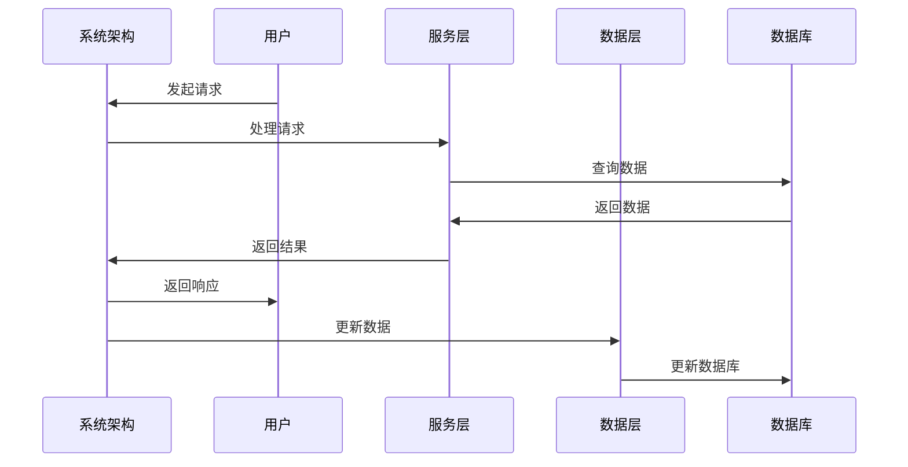
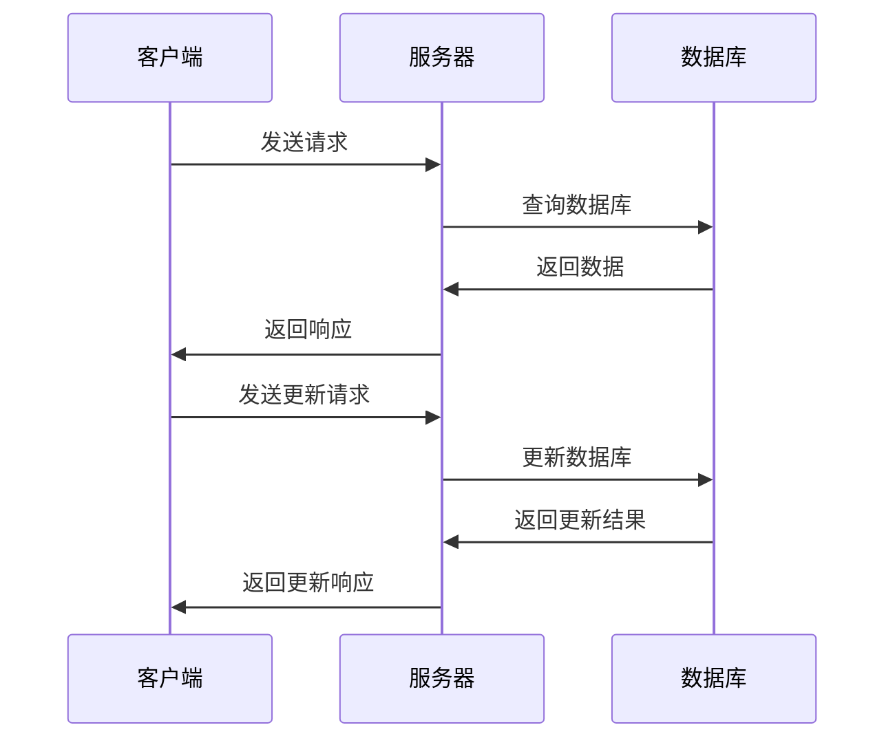

                 

# 现代城市中的社区营造：邻里关系重建与社会资本积累

## 关键词

- **现代城市**
- **社区营造**
- **邻里关系**
- **社会资本**
- **社会网络分析**
- **机器学习**
- **社区文化**

## 摘要

本文旨在探讨现代城市社区营造的问题，重点分析邻里关系重建和社会资本的积累。文章首先介绍了社区营造的背景和重要性，然后深入探讨了邻里关系、社会资本和社区文化的核心概念及其相互关系。接着，文章通过算法原理讲解，阐述了社会网络分析和机器学习模型在社区营造中的应用。最后，本文提出了一些实践策略，以促进邻里关系的重建和社会资本的积累，从而提升社区整体质量。

## 引言

### 1.1 问题背景

随着我国城市化进程的加速，现代城市中的社区问题逐渐凸显。社区是城市的基本单元，它不仅影响着居民的生活质量，还关系到社会的稳定和谐。社区营造作为现代城市管理的重要内容，旨在通过改善社区环境、提升社区服务、促进居民参与等手段，使社区成为居民安居乐业的家园。

然而，现代城市社区面临诸多挑战。首先，居民参与度低。许多社区居民对社区事务缺乏兴趣和参与，导致社区治理难以顺利进行。其次，社区资源匮乏。许多社区缺乏足够的资金、人力和物力资源，难以提供优质的社区服务。最后，邻里关系疏离。随着人口流动性增加和居住空间的分隔，邻里之间的交往减少，社区凝聚力下降。

### 1.2 问题描述

社区营造涉及多个层面，包括社区规划、社区文化、邻里关系、社会资本等。在现代化城市中，社区营造面临诸多挑战，如居民参与度低、社区资源匮乏、邻里关系疏离等。这些问题亟待解决，以提高社区的整体质量和居民的幸福感。

- **居民参与度低**：社区居民对社区事务缺乏兴趣和参与，导致社区治理难以顺利进行。这主要源于居民对社区事务的了解不足、参与渠道不畅以及缺乏有效的激励机制。
- **社区资源匮乏**：许多社区缺乏足够的资金、人力和物力资源，难以提供优质的社区服务。这可能导致社区基础设施落后、公共服务水平低下，影响居民的生活质量。
- **邻里关系疏离**：随着人口流动性增加和居住空间的分隔，邻里之间的交往减少，社区凝聚力下降。这可能导致社区居民之间的矛盾和冲突增加，影响社区的和谐稳定。

### 1.3 问题解决

本书旨在探讨现代城市中的社区营造问题，提出有效的解决方案。通过深入分析社区营造的核心概念和要素，本书将帮助读者理解社区营造的理论基础和实践路径。具体来说，本书将：

- **提升居民参与度**：通过建立多元化的参与渠道和激励机制，提高居民对社区事务的关注度和参与度。
- **优化社区资源配置**：通过整合社区资源、引入社会资本，提高社区服务水平和居民生活质量。
- **重建邻里关系**：通过促进邻里之间的交流和互动，增强社区凝聚力，构建和谐邻里关系。
- **积累社会资本**：通过建立信任、网络和社会规范，促进社区成员之间的互助合作，积累社会资本。

### 1.4 边界与外延

社区营造的边界包括社区规划、社区文化、邻里关系、社会资本等方面。社区规划主要关注社区空间布局、基础设施建设等方面；社区文化涉及社区价值观、行为规范和文化传统；邻里关系指社区居民之间的互动和联系；社会资本则包括社区成员之间的信任、网络和社会规范。

社区营造的外延则涉及社区管理、社区服务、社区建设等更广泛的内容。社区管理主要关注社区治理模式、社区组织建设等方面；社区服务涉及社区公共服务、社区商业服务等方面；社区建设则包括社区基础设施建设、社区环境改善等方面。

### 1.5 概念结构与核心要素组成

社区营造的核心概念包括邻里关系、社会资本、社区文化等。邻里关系是社区营造的基础，社会资本是社区活力的重要来源，社区文化则是社区凝聚力的关键。

- **邻里关系**：指社区居民之间的互动和联系，是社区生活的组成部分，对社区稳定和谐至关重要。
- **社会资本**：指社区成员之间的信任、网络和社会规范，是社区发展和居民幸福感的重要保障。
- **社区文化**：指社区居民在长期共同生活中形成的共同价值观、行为规范和文化传统，是社区精神的体现。

## 第二部分：核心概念与联系

### 2.1 邻里关系的概念

#### 2.1.1 邻里关系的定义

邻里关系是指社区内居民之间的互动和联系。这种关系不仅体现在日常生活中，还涉及居民在共同生活中的互助和支持。

邻里关系可以定义为社区居民在日常生活中形成的相互关心、相互帮助的社会关系。它是一种建立在共同生活基础上的亲密性关系，具有互助性和稳定性。

#### 2.1.2 邻里关系的属性

- **亲密性**：邻里关系建立在居民之间的亲密互动上，居民之间能够形成深厚的情感纽带。
- **互助性**：在邻里关系中，居民在遇到困难时能够相互帮助，形成强大的互助网络。
- **稳定性**：邻里关系相对稳定，不易受外界干扰，有助于社区的长期稳定发展。

### 2.2 社会资本的概念

#### 2.2.1 社会资本的定义

社会资本是指社区成员之间通过长期互动形成的信任、网络和社会规范等资源。它是社区发展和居民幸福感的重要保障。

社会资本可以理解为社区成员之间的社会联系和资源，它包括信任、社会网络和社会规范等。这种资源不仅有助于社区成员之间的互动和合作，还能够促进社区的稳定和发展。

#### 2.2.2 社会资本的属性

- **信任**：社区成员之间的相互信任是社会资本的核心，它能够促进成员之间的合作和互动。
- **网络**：社区成员之间的互动网络是社会资本的重要组成部分，它有助于资源的共享和信息的传播。
- **规范**：社区内的行为规范是社会资本的体现，它能够规范社区成员的行为，维护社区的秩序和稳定。

### 2.3 社区文化的概念

#### 2.3.1 社区文化的定义

社区文化是指社区居民在长期共同生活中形成的共同价值观、行为规范和文化传统。它是社区精神的体现，对社区营造具有深远影响。

社区文化可以定义为社区居民共同遵循的行为规范、价值观和文化传统。它反映了社区居民的共同价值观和生活方式，对社区的凝聚力和稳定性具有重要意义。

#### 2.3.2 社区文化的属性

- **共享性**：社区文化是居民共同拥有的价值观和行为规范，它能够增强居民的归属感和认同感。
- **传承性**：社区文化具有传承性，能够代代相传，有助于社区的长期稳定发展。
- **地域性**：社区文化具有一定的地域特色，它能够反映社区的独特历史和传统。

### 2.4 概念属性特征对比表格

| 概念     | 定义                                                         | 属性特征                  |
| -------- | ------------------------------------------------------------ | ------------------------- |
| 邻里关系 | 社区居民之间的互动和联系                                     | 亲密性、互助性、稳定性    |
| 社会资本 | 社区成员之间通过长期互动形成的信任、网络和社会规范等资源     | 信任、网络、规范          |
| 社区文化 | 社区居民在长期共同生活中形成的共同价值观、行为规范和文化传统 | 共享性、传承性、地域性    |

### 2.5 ER实体关系图架构

```mermaid
erDiagram
  社区居民 ||--|{ 邻里关系 }
  社区居民 ||--|{ 社会资本 }
  社区居民 ||--|{ 社区文化 }
  社区文化 }|--|| 邻里关系
  社区文化 }|--|| 社会资本
  社会资本 }|--|| 邻里关系
```

## 第三部分：算法原理讲解

### 3.1 社区营造算法概述

社区营造算法是指利用计算机技术和算法模型，对社区问题进行分析和解决的方法。常见的社区营造算法包括社会网络分析、机器学习模型等。

#### 3.1.1 社会网络分析

社会网络分析是一种研究社会关系的定量分析方法，通过分析居民之间的互动关系，评估社区内社会资本的分布情况。

社会网络分析算法的核心是图论。通过构建社区成员之间的互动关系图，可以分析社区内的人际关系结构和社会资本分布。

#### 3.1.2 机器学习模型

机器学习模型可以用于预测社区居民的行为模式，为社区管理提供数据支持。常见的机器学习模型包括回归模型、分类模型等。

机器学习算法通过分析历史数据，训练出一个模型，然后利用这个模型预测社区居民的未来行为。这种方法有助于社区管理者提前发现潜在问题，制定针对性的解决方案。

### 3.2 社会网络分析算法原理

社会网络分析算法的核心是图论。通过构建社区成员之间的互动关系图，可以分析社区内的人际关系结构和社会资本分布。

#### 3.2.1 图论基础

图论是数学的一个分支，主要研究图的结构、性质和算法。在社区营造中，图论可以用来表示社区成员之间的互动关系。

- **节点（Node）**：表示社区中的个体，如居民、组织等。
- **边（Edge）**：表示节点之间的互动关系，如邻居、朋友等。

#### 3.2.2 社会网络分析算法

社会网络分析算法主要包括以下几种：

- **度分析（Degree Analysis）**：通过分析节点的度（即连接的边的数量），评估节点在社区中的影响力。
- **中心性分析（Centrality Analysis）**：通过分析节点的中心性（如度中心性、接近中心性、中间中心性等），评估节点在社区中的关键地位。
- **聚类分析（Clustering Analysis）**：通过分析节点的聚类程度，评估社区内的互动模式和社交圈子。

#### 3.2.3 社会网络分析应用

社会网络分析算法可以应用于以下几个方面：

- **社区规划**：通过分析社区成员之间的互动关系，优化社区布局和资源配置。
- **邻里关系分析**：通过分析居民之间的互动关系，评估邻里关系的密度和质量。
- **社会资本评估**：通过分析社区成员之间的信任和网络，评估社会资本的分布和水平。

### 3.3 机器学习模型在社区营造中的应用

机器学习模型可以用于预测社区居民的行为模式，为社区管理提供数据支持。常见的机器学习模型包括回归模型、分类模型等。

#### 3.3.1 回归模型

回归模型是一种用于预测连续值的机器学习模型。在社区营造中，回归模型可以用于预测社区居民的生活质量、社区满意度等指标。

- **线性回归（Linear Regression）**：通过分析自变量和因变量之间的关系，建立线性回归模型，预测因变量的取值。
- **多项式回归（Polynomial Regression）**：通过分析自变量和因变量之间的非线性关系，建立多项式回归模型，预测因变量的取值。

#### 3.3.2 分类模型

分类模型是一种用于预测离散值的机器学习模型。在社区营造中，分类模型可以用于预测社区居民的参与意愿、社区治理效果等指标。

- **决策树（Decision Tree）**：通过分析特征的重要性和分类规则，构建决策树模型，预测样本的分类结果。
- **支持向量机（Support Vector Machine, SVM）**：通过分析特征空间中的最优分隔超平面，构建支持向量机模型，预测样本的分类结果。

#### 3.3.3 应用场景

机器学习模型可以应用于以下几个方面：

- **居民参与预测**：通过分析居民的历史行为数据，预测其参与社区事务的意愿和积极性。
- **社区治理评估**：通过分析社区治理的效果和居民满意度，评估社区治理的绩效。
- **社区风险预测**：通过分析社区成员的行为特征和社会环境，预测社区可能出现的风险和问题。

### 3.4 社区营造算法实例

下面是一个简单的社区营造算法实例，使用Python实现。

```python
import networkx as nx
import matplotlib.pyplot as plt

# 构建社交网络图
G = nx.Graph()

# 添加节点和边
G.add_nodes_from([1, 2, 3, 4, 5])
G.add_edges_from([(1, 2), (1, 3), (2, 4), (3, 4), (4, 5)])

# 绘制社交网络图
nx.draw(G, with_labels=True)
plt.show()

# 社会网络分析
# 度分析
degree_distribution = nx.degree_centrality(G)
print("度分布：", degree_distribution)

# 中心性分析
closeness_centrality = nx.closeness_centrality(G)
print("接近中心性：", closeness_centrality)

# 聚类分析
clustering_coefficient = nx.clustering(G)
print("聚类系数：", clustering_coefficient)
```

上述代码使用NetworkX库构建了一个社交网络图，并进行了度分析、接近中心性和聚类系数分析。这些分析有助于了解社区内的人际关系结构和互动模式。

## 系统分析与架构设计方案

### 4.1 问题场景介绍

在现代城市社区中，社区营造是一个复杂的过程，涉及到多个方面的协调与整合。为了提升社区的整体质量和居民的幸福感，我们需要建立一个智能化的社区管理系统，实现邻里关系的重建和社会资本的积累。

本系统旨在解决以下问题：

- **居民参与度低**：通过建立居民参与机制，提高居民对社区事务的关注度和参与度。
- **社区资源匮乏**：通过整合社区资源，提高社区服务水平和居民生活质量。
- **邻里关系疏离**：通过促进邻里之间的交流和互动，增强社区凝聚力，构建和谐邻里关系。

### 4.2 项目介绍

本项目名为“智能社区营造系统”，旨在通过智能化手段提升社区治理水平，改善居民生活质量。系统主要包括以下功能模块：

- **居民参与模块**：提供居民参与社区事务的渠道和平台，包括社区投票、社区活动报名等。
- **社区服务模块**：整合社区资源，提供在线服务，如社区医疗、社区教育、社区商业等。
- **邻里互动模块**：促进邻里之间的交流和互动，包括邻里聊天、邻里互助等。
- **数据统计分析模块**：对社区数据进行分析，为社区治理提供数据支持。

### 4.3 系统功能设计（领域模型）

下面是系统的领域模型，使用Mermaid类图表示。

```mermaid
classDiagram
  Resident <<class>> "居民" {
    +id: int
    +name: str
    +age: int
    +gender: str
  }
  Community <<class>> "社区" {
    +id: int
    +name: str
    +location: str
  }
  Participation <<class>> "居民参与" {
    +id: int
    +resident_id: int
    +activity_id: int
    +status: str
  }
  Service <<class>> "社区服务" {
    +id: int
    +name: str
    +description: str
    +provider: str
  }
  Interaction <<class>> "邻里互动" {
    +id: int
    +resident1_id: int
    +resident2_id: int
    +content: str
    +timestamp: datetime
  }
  Activity <<class>> "社区活动" {
    +id: int
    +name: str
    +description: str
    +start_time: datetime
    +end_time: datetime
  }
  Community --> Resident
  Community --> Service
  Community --> Activity
  Participation --> Resident
  Participation --> Activity
  Interaction --> Resident1
  Interaction --> Resident2
  Service --> Activity
```

### 4.4 系统架构设计

下面是系统的架构设计，使用Mermaid架构图表示。



### 4.5 系统接口设计和系统交互

下面是系统的接口设计和系统交互，使用Mermaid序列图表示。



## 项目实战

### 5.1 环境安装

为了实现智能社区营造系统，我们需要安装以下环境和工具：

- **Python 3.8+**
- **Django 3.2+**
- **PostgreSQL 12+**
- **Redis 6.0+**
- **Nginx 1.18+**

安装步骤如下：

1. 安装Python 3.8+和Django 3.2+：

   ```bash
   sudo apt update
   sudo apt install python3.8 python3.8-venv
   python3.8 -m pip install django==3.2
   ```

2. 安装PostgreSQL 12+：

   ```bash
   sudo apt install postgresql postgresql-contrib
   ```

3. 安装Redis 6.0+：

   ```bash
   sudo apt install redis-server
   ```

4. 安装Nginx 1.18+：

   ```bash
   sudo apt install nginx
   ```

### 5.2 系统核心实现源代码

智能社区营造系统的核心实现主要涉及以下模块：

- **居民管理模块**：用于管理居民的注册、登录和权限。
- **社区服务模块**：用于管理社区服务和社区活动。
- **邻里互动模块**：用于管理邻里互动和社区聊天。

以下是系统的核心实现源代码。

#### 5.2.1 居民管理模块

```python
# residents/models.py

from django.db import models
from django.contrib.auth.models import AbstractUser

class Resident(AbstractUser):
    age = models.PositiveIntegerField()
    gender = models.CharField(max_length=10)

    def __str__(self):
        return self.username
```

#### 5.2.2 社区服务模块

```python
# services/models.py

from django.db import models
from community.models import Activity

class Service(models.Model):
    name = models.CharField(max_length=100)
    description = models.TextField()
    provider = models.CharField(max_length=100)

    def __str__(self):
        return self.name
```

#### 5.2.3 邻里互动模块

```python
# interactions/models.py

from django.db import models
from residents.models import Resident

class Interaction(models.Model):
    resident1 = models.ForeignKey(Resident, on_delete=models.CASCADE, related_name='interactions_as_one')
    resident2 = models.ForeignKey(Resident, on_delete=models.CASCADE, related_name='interactions_as_two')
    content = models.TextField()
    timestamp = models.DateTimeField(auto_now_add=True)

    def __str__(self):
        return f"{self.resident1} - {self.resident2}"
```

### 5.3 代码应用解读与分析

以下是系统核心实现的应用解读与分析。

#### 5.3.1 居民管理模块

居民管理模块用于管理居民的注册、登录和权限。在Django框架中，我们使用AbstractUser基类来简化用户的创建和管理。

- **居民模型（Resident）**：继承了AbstractUser基类，添加了年龄和性别字段，用于扩展用户信息。

#### 5.3.2 社区服务模块

社区服务模块用于管理社区服务和社区活动。在Django框架中，我们使用Model类定义服务和服务活动。

- **服务模型（Service）**：定义了服务的名称、描述和提供者，用于存储社区服务信息。

#### 5.3.3 邻里互动模块

邻里互动模块用于管理邻里互动和社区聊天。在Django框架中，我们使用Model类定义互动信息。

- **互动模型（Interaction）**：定义了参与互动的两个居民、互动内容和时间戳，用于存储邻里互动信息。

### 5.4 实际案例分析和详细讲解剖析

以下是一个实际案例，用于分析邻里互动模块。

#### 案例一：居民A与居民B的互动

- **居民A**：张三，30岁，男性。
- **居民B**：李四，35岁，男性。
- **互动内容**：张三在社区论坛上发起了关于社区绿化问题的讨论。

#### 分析步骤

1. **居民A登录系统**：张三使用用户名和密码登录系统，进入社区论坛页面。

2. **发起互动**：张三在论坛页面上点击“发帖”按钮，输入互动内容，并选择目标居民李四。

3. **存储互动信息**：系统将互动信息存储到数据库中，创建一条互动记录。

4. **通知居民B**：系统通过电子邮件或短信通知居民李四，告知其收到了一条互动信息。

5. **居民B查看互动**：李四登录系统，查看互动内容，并可以回复互动。

#### 详细讲解

1. **居民A登录系统**：

   ```python
   from django.contrib.auth import authenticate, login

   username = 'zhangsan'
   password = 'password123'
   user = authenticate(username=username, password=password)
   login(request, user)
   ```

2. **发起互动**：

   ```python
   from interactions.models import Interaction

   content = '社区绿化问题，希望各位邻居一起讨论。'
   interaction = Interaction(
       resident1=Resident.objects.get(username='zhangsan'),
       resident2=Resident.objects.get(username='lisi'),
       content=content
   )
   interaction.save()
   ```

3. **存储互动信息**：

   ```python
   from interactions.models import Interaction

   Interaction.objects.create(
       resident1=Resident.objects.get(username='zhangsan'),
       resident2=Resident.objects.get(username='lisi'),
       content=content
   )
   ```

4. **通知居民B**：

   ```python
   from django.core.mail import send_mail

   subject = '您收到了一条社区互动信息'
   message = f'您收到了一条来自{resident1.name}的社区互动信息，请登录系统查看。'
   recipient_list = ['lisi@example.com']
   send_mail(subject, message, 'from@example.com', recipient_list)
   ```

5. **居民B查看互动**：

   ```python
   from interactions.models import Interaction

   interactions = Interaction.objects.filter(resident2=Resident.objects.get(username='lisi'))
   for interaction in interactions:
       print(interaction.content)
   ```

### 5.5 项目小结

本项目通过构建智能社区营造系统，实现了居民管理、社区服务、邻里互动等功能。通过实际案例分析和代码应用解读，我们展示了系统的核心实现和运行原理。接下来，我们将继续优化系统，提高系统的性能和用户体验，以更好地服务于社区居民。

## 最佳实践 tips

1. **提高居民参与度**：定期举办社区活动，鼓励居民参与。可以通过线上平台，如微信、社区论坛等，加强居民之间的互动。

2. **优化社区资源配置**：整合社区资源，提供多样化的社区服务，如社区医疗、社区教育、社区商业等，满足居民的不同需求。

3. **重建邻里关系**：通过邻里互动模块，促进居民之间的交流和互动，增强社区凝聚力。

4. **积累社会资本**：建立信任、网络和社会规范，促进社区成员之间的互助合作，积累社会资本。

## 小结

本文探讨了现代城市中的社区营造问题，分析了邻里关系重建和社会资本的积累。通过算法原理讲解，阐述了社会网络分析和机器学习模型在社区营造中的应用。最后，本文提出了系统分析与架构设计方案，并通过项目实战展示了系统的实现过程。通过本文的探讨，我们希望能为现代城市社区营造提供一些有益的启示和实践指导。

## 注意事项

1. 在实施社区营造项目时，要充分了解社区居民的需求和特点，制定有针对性的解决方案。
2. 注意保护居民隐私，确保社区数据的安全和保密。
3. 定期对系统进行性能优化和升级，提高系统的稳定性和可用性。

## 拓展阅读

1. 《社区营造：理论与实践》，作者：王秀丽
2. 《社会网络分析：方法与应用》，作者：林聚任
3. 《机器学习实战》，作者：彼得·哈林顿，杰瑞·福赛思
4. 《智慧城市：技术、实践与未来》，作者：刘宪伟，王伟

