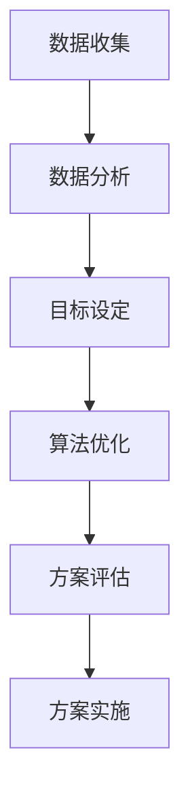
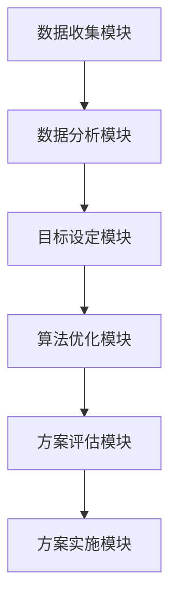
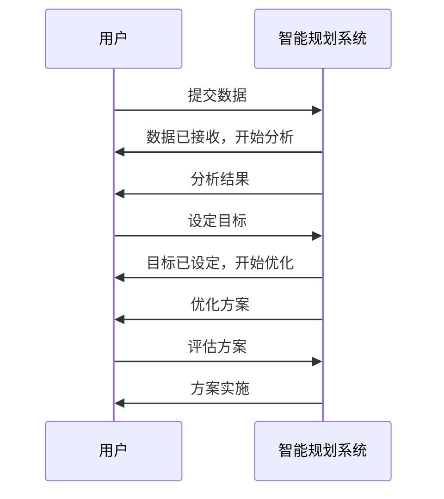

                 

## 现代城市规划中的社会包容：弱势群体的空间权利

### 关键词：
- 现代城市规划
- 社会包容
- 弱势群体
- 空间权利

### 摘要：
本文深入探讨了现代城市规划中的社会包容性，重点关注了弱势群体的空间权利问题。文章首先介绍了社会包容与城市规划的核心概念，然后详细分析了弱势群体的定义与特征。通过国际经验与中国实践的对比，文章提出了社会包容性城市规划的方法与工具，并提供了具体的案例分析。最后，文章总结了研究成果，并对未来的研究方向与实践提出了建议。

## 引言

### 背景与意义

#### 核心概念术语说明

在社会学中，“社会包容”是指一个社会能够接纳并尊重所有成员，不论其性别、年龄、种族、文化、信仰、身体状况等差异。它强调的是社会成员之间的平等与尊重，是一种社会的价值取向。在城市规划领域，“社会包容性”则是指城市规划与实施过程中能够充分考虑社会各群体的需求，特别是弱势群体的权益保障。

#### 问题背景

随着全球城市化进程的加速，城市人口快速增长，城市规模不断扩大。然而，这一过程中也带来了诸多社会问题，如贫困、不平等、社会排斥等。弱势群体，包括低收入者、残疾人、老年人和少数族裔等，在城市空间中往往面临着诸多困境。他们的居住条件差，难以获得优质的教育、医疗和其他公共服务，甚至在城市空间中被边缘化。

#### 问题描述

本文试图解决的核心问题是如何在现代城市规划中实现社会包容性，特别是如何保障弱势群体的空间权利。这包括两个方面的内容：一是如何在城市规划中考虑弱势群体的需求，二是如何确保这些需求能够在实际规划中得到落实。

#### 问题解决

解决这一问题的关键在于从城市规划的理论基础和方法论出发，探讨如何通过制度设计和技术手段来提高城市规划的社会包容性。具体来说，可以从以下几个方面入手：

1. **政策制定**：政府应制定相关政策，确保城市规划的包容性目标得到落实。例如，制定住房政策，保障低收入者的居住权益；制定交通政策，方便残疾人等行动不便者的出行。

2. **规划方法**：采用科学合理的规划方法，如参与式规划、社区规划等，使弱势群体的声音能够被充分听到。同时，运用GIS等技术手段，对城市空间进行精细化管理，确保规划实施的有效性。

3. **技术手段**：利用现代信息技术，如大数据、物联网等，对城市规划进行实时监测和评估，及时发现并解决弱势群体面临的实际困境。

#### 边界与外延

社会包容性城市规划不仅涉及到城市空间的规划，还涉及到城市规划与社会政策、经济政策等领域的交叉。因此，本文的研究边界主要是城市规划领域，但也会涉及到相关政策和社会背景的讨论。

#### 概念结构与核心要素组成

社会包容性城市规划的核心概念包括社会包容、城市规划、弱势群体和空间权利。社会包容强调的是社会成员之间的平等与尊重；城市规划则是实现社会包容的途径之一；弱势群体则是城市规划需要关注的核心群体；空间权利则是弱势群体在城市中应有的权益。

## 社会包容与城市规划概述

### 社会包容的概念与特征

#### 核心概念与联系

社会包容是一个社会学概念，指的是一个社会能够接纳并尊重所有成员，不论其性别、年龄、种族、文化、信仰、身体状况等差异。它强调的是社会成员之间的平等与尊重，是一种社会的价值取向。

在社会学中，社会包容通常被分为三个层次：制度包容、社会交往包容和文化认同包容。制度包容指的是社会制度能够保障所有成员的平等权利和机会；社会交往包容指的是社会成员之间的交往和互动能够体现平等和尊重；文化认同包容则是指社会文化能够容纳并尊重不同的文化背景和信仰。

#### 概念属性特征对比表格

| 特征         | 制度包容                  | 社会交往包容                  | 文化认同包容                  |
| ------------ | ------------------------- | ----------------------------- | ----------------------------- |
| 定义         | 社会制度保障平等权利和机会 | 社会成员间的平等和尊重的交往互动 | 社会文化尊重和接纳不同文化背景 |
| 应用场景     | 法律、政策、公共服务等     | 社交、教育、工作等             | 文化活动、艺术、宗教等         |
| 关联性       | 制度包容是基础            | 社会交往包容是表现             | 文化认同包容是深入融合         |

#### ER实体关系图架构

```mermaid
erDiagram
    User ||--|{ Community }|--||
    User ||--|{ SocialInclusion }|--||
    Community ||--|{ SocialInteraction }|--||
    SocialInclusion ||--|{ CulturalIdentity }|--||
```

### 城市规划的核心任务与发展趋势

#### 核心任务

城市规划的核心任务是创造一个宜居、可持续、包容的城市环境。具体来说，包括以下几个方面：

1. **居住空间规划**：合理分配居住空间，提高住房质量，确保低收入者的住房需求得到满足。
2. **公共服务规划**：提供充足的公共服务设施，包括教育、医疗、交通、文化等，确保所有市民都能平等地享受这些服务。
3. **交通规划**：优化交通网络，提高交通效率，降低交通拥堵，方便市民出行。
4. **环境保护**：保护城市生态环境，减少污染，提高空气质量，改善市民的生活质量。

#### 发展趋势

随着全球化、信息化和城市化的不断推进，城市规划也在不断发展和变革。以下是当前城市规划的一些主要发展趋势：

1. **可持续性规划**：强调在城市规划中考虑环境保护和资源利用，实现城市的可持续发展。
2. **智能城市规划**：利用大数据、物联网、人工智能等新技术，提高城市规划的精确性和效率。
3. **社区参与规划**：鼓励市民参与城市规划，使城市规划更贴近市民的需求。
4. **多元化规划**：关注不同群体的需求，特别是弱势群体，实现城市社会的包容性。

#### 算法原理讲解

在城市规划中，智能规划算法发挥着重要作用。以下是一个简单的智能规划算法原理讲解：

1. **数据收集**：首先，收集城市的基础数据，包括人口、经济、交通、环境等。
2. **数据分析**：利用数据分析技术，对收集到的数据进行分析，识别城市中的问题和需求。
3. **目标设定**：根据分析结果，设定城市规划的目标，如居住空间优化、公共服务提升等。
4. **算法优化**：运用优化算法，如遗传算法、粒子群算法等，对规划方案进行优化。
5. **方案评估**：对优化后的规划方案进行评估，选择最优方案进行实施。

下面是一个简单的Python代码示例，用于实现上述算法原理：

```python
import numpy as np

# 数据集
data = {
    'population': [1000, 2000, 3000],
    'income': [10000, 15000, 20000],
    'public_services': [20, 30, 40],
}

# 目标函数
def objective_function(data):
    # 示例目标函数：最小化总人口与收入之差，最大化公共服务数量
    return np.mean(data['population'] - data['income']) + np.max(data['public_services'])

# 优化算法
def optimize(data, objective_function):
    # 使用粒子群优化算法
    pass  # 实现具体的优化算法逻辑

# 执行优化
optimized_solution = optimize(data, objective_function)

# 输出结果
print(optimized_solution)
```

#### 数学模型和公式

在上述算法中，目标函数可以用以下数学模型表示：

$$
\min \sum_{i=1}^{n} (x_i - y_i)^2 + z
$$

其中，$x_i$ 表示总人口与收入的差，$y_i$ 表示公共服务数量，$z$ 表示权重系数。

#### 系统分析与架构设计

在城市规划中，智能规划系统是一个复杂的系统。以下是一个简单的系统架构设计：



#### 系统功能设计

1. **数据收集模块**：负责收集城市的基础数据，包括人口、经济、交通、环境等。
2. **数据分析模块**：对收集到的数据进行分析，识别城市中的问题和需求。
3. **目标设定模块**：根据分析结果，设定城市规划的目标，如居住空间优化、公共服务提升等。
4. **算法优化模块**：运用优化算法，如遗传算法、粒子群算法等，对规划方案进行优化。
5. **方案评估模块**：对优化后的规划方案进行评估，选择最优方案进行实施。
6. **方案实施模块**：负责将评估后的规划方案付诸实施。

#### 系统架构设计



#### 系统接口设计和系统交互



## 社会包容性城市规划的理论框架

### 社会包容性城市规划的基本原则

社会包容性城市规划的基本原则包括：

1. **平等原则**：确保所有社会成员在城市空间中享有平等的权益，无论其经济状况、文化背景、身体状况等。
2. **参与原则**：鼓励市民参与城市规划，使城市规划更贴近市民的需求。
3. **可持续性原则**：在城市规划中考虑环境保护和资源利用，实现城市的可持续发展。
4. **适应性原则**：城市规划应具有一定的适应性，能够适应城市的发展变化。

### 社会包容性城市规划的理论基础

社会包容性城市规划的理论基础包括：

1. **社会学理论**：如社会包容理论、社会公正理论等，为社会包容性城市规划提供了理论依据。
2. **城市规划理论**：如城市设计理论、城市空间理论等，为社会包容性城市规划提供了实践指导。
3. **经济学理论**：如公共选择理论、市场失败理论等，为社会包容性城市规划提供了经济分析基础。

#### 社会包容性城市规划的核心概念与联系

社会包容性城市规划的核心概念包括社会包容、城市规划、弱势群体和空间权利。社会包容强调的是社会成员之间的平等与尊重；城市规划则是实现社会包容的途径之一；弱势群体则是城市规划需要关注的核心群体；空间权利则是弱势群体在城市中应有的权益。

#### 概念属性特征对比表格

| 特征         | 社会包容                  | 城市规划                  | 弱势群体                  | 空间权利                  |
| ------------ | ------------------------- | ------------------------- | ------------------------- | ------------------------- |
| 定义         | 接纳并尊重所有成员        | 城市空间组织与设计        | 经济上、社会上的弱者      | 城市空间中的权益保障      |
| 应用场景     | 社会交往、公共政策等      | 城市规划与实施           | 社区生活、教育、就业等    | 居住、交通、公共服务等    |
| 关联性       | 社会包容是基础            | 城市规划是手段            | 弱势群体是关注重点        | 空间权利是保障目标        |

#### ER实体关系图架构

```mermaid
erDiagram
    SocialInclusion ||--|{ UrbanPlanning }|--||
    UrbanPlanning ||--|{ VulnerableGroups }|--||
    VulnerableGroups ||--|{ SpatialRights }|--||
```

## 弱势群体的定义与识别

### 弱势群体的定义

弱势群体是指在经济、社会地位、文化教育等方面处于劣势，面临较多困境和挑战的群体。这些群体通常在经济资源、社会网络、政治权利等方面处于不利地位，难以通过自己的力量改变现状。在城市化进程中，弱势群体往往面临着更为严峻的生活环境和社会压力。

### 弱势群体的特征

1. **经济贫困**：经济贫困是弱势群体的主要特征之一。他们通常收入较低，生活水平较低，难以满足基本的生活需求。
2. **社会排斥**：弱势群体往往受到社会的排斥和歧视，难以融入主流社会。他们可能在就业、教育、医疗等方面受到限制。
3. **文化落后**：弱势群体在文化教育方面相对落后，缺乏必要的教育资源和技能培训，导致他们在社会竞争中处于劣势。
4. **住房困难**：许多弱势群体居住在环境恶劣、基础设施不完善的地区，面临住房困难。

### 弱势群体的类型与特征

1. **低收入群体**：这是弱势群体中最常见的一类，包括农民工、失业者、贫困人口等。他们通常收入较低，生活水平较低，难以满足基本的生活需求。
2. **残疾人群体**：残疾人群体在身体、心理、经济等方面都处于劣势。他们可能面临行动不便、就业困难、社会排斥等问题。
3. **老年人口**：随着人口老龄化的加剧，老年人口成为弱势群体的一个重要组成部分。他们可能面临健康问题、经济困难、孤独感等挑战。
4. **少数族裔**：在多民族、多文化的城市中，少数族裔往往面临文化认同、语言沟通、就业机会等方面的困境。

### 弱势群体的识别方法

1. **人口普查**：通过人口普查等统计数据，识别城市中的弱势群体。
2. **问卷调查**：通过问卷调查，收集弱势群体的主观感受和需求。
3. **社区参与**：鼓励弱势群体参与城市规划和社会活动，通过他们的反馈来识别和了解他们的需求。
4. **专家评估**：邀请城市规划、社会学、心理学等领域的专家，对弱势群体进行评估和分析。

#### 社会包容性城市规划的方法与工具

社会包容性城市规划需要采用科学合理的规划方法和技术手段，以确保城市规划能够充分考虑社会各群体的需求，特别是弱势群体的权益保障。以下是一些常用的方法与工具：

1. **参与式规划**：参与式规划是一种以社区参与为核心的城市规划方法。它强调市民在规划过程中的参与和决策权，使规划结果更符合市民的需求。具体方法包括社区研讨会、工作坊、问卷调查等。

2. **需求评估**：需求评估是制定社会包容性城市规划的基础。通过问卷调查、访谈、实地调研等方式，收集弱势群体的需求和意见，为规划提供依据。

3. **空间分析**：空间分析是城市规划的重要工具之一。通过GIS（地理信息系统）等技术，对城市空间进行详细分析，识别弱势群体的分布、居住环境等问题。

4. **预算分析**：预算分析是一种用于评估城市规划项目成本和效益的方法。通过对比不同规划方案的成本和效益，选择最具成本效益的方案。

5. **政策设计**：政策设计是确保社会包容性城市规划得到有效实施的关键。通过制定相关政策，如住房政策、交通政策、公共服务政策等，保障弱势群体的权益。

#### 国际经验与案例分析

许多国家和地区都在社会包容性城市规划方面取得了显著成果。以下是一些国际经验与案例分析：

1. **英国伦敦**：伦敦在住房政策方面取得了显著成果。通过实施“租房者权益法案”，保障租房者的权益，提高了低收入者的住房质量。

2. **瑞典斯德哥尔摩**：斯德哥尔摩在城市交通规划方面采取了多项措施，如发展公共交通、推广自行车出行等，提高了城市交通的可持续性和包容性。

3. **美国纽约**：纽约通过社区参与和需求评估，制定了一系列社会包容性规划项目。例如，“无家可归者住房计划”、“社区发展基金”等，有效改善了弱势群体的生活条件。

4. **中国深圳**：深圳在城市规划中注重社会包容性。通过实施“精准扶贫”政策，加大对贫困人口的扶持力度；通过“社区参与计划”，鼓励市民参与城市规划。

#### 中国社会包容性城市规划实践

中国在社会包容性城市规划方面也取得了一定的成果。以下是一些典型案例：

1. **北京老旧小区改造**：北京市通过对老旧小区进行改造，提高了居住环境和生活质量。同时，通过社区参与，使规划结果更符合市民的需求。

2. **上海“十三五”规划**：上海市在“十三五”规划中提出，要加大对社会弱势群体的扶持力度，提高住房保障水平，完善公共服务体系。

3. **广州“互联网+”社区治理**：广州市通过“互联网+”社区治理，提高了城市管理的效率和透明度，有效解决了社区管理中的难题。

#### 社会包容性城市规划的挑战与机遇

社会包容性城市规划面临着诸多挑战，如经济资源不足、技术手段有限、政策执行力度不足等。但同时，也面临着许多机遇：

1. **科技进步**：随着大数据、人工智能、物联网等技术的发展，城市规划将变得更加智能和高效，为社会包容性城市规划提供了新的技术手段。
2. **政策支持**：政府和社会对城市规划的重视程度不断提高，为实施社会包容性城市规划提供了政策支持。
3. **公众参与**：市民对城市规划的参与度不断提高，为城市规划提供了更多的意见和建议。

#### 未来研究方向与实践建议

未来，社会包容性城市规划的研究方向和实践应关注以下几个方面：

1. **技术创新**：进一步探索和应用大数据、人工智能等新技术，提高城市规划的科学性和精确性。
2. **政策完善**：完善相关政策，加大对弱势群体的扶持力度，确保社会包容性城市规划的实施。
3. **公众参与**：加强市民参与城市规划的机制建设，提高规划的科学性和民主性。
4. **国际交流**：加强与国际先进城市在规划理念、技术手段、政策经验等方面的交流，借鉴国际先进经验，提升城市规划水平。

## 总结与展望

社会包容性城市规划是实现城市可持续发展和社会和谐的重要手段。通过本文的研究，我们深入探讨了社会包容性城市规划的核心概念、理论框架、方法与工具，并结合国际经验和中国实践进行了分析。本文提出了以下主要观点：

1. **社会包容性城市规划的核心目标是实现城市社会的平等与尊重，特别是保障弱势群体的空间权利。**
2. **参与式规划、需求评估、空间分析、预算分析、政策设计是社会包容性城市规划的重要方法与工具。**
3. **国际经验表明，社会包容性城市规划需要政府的政策支持、技术的创新、公众的参与。**
4. **中国在老旧小区改造、精准扶贫、社区治理等方面已经取得了初步成果，但仍需进一步完善和提升。**

未来的社会包容性城市规划研究应重点关注以下几个方面：

1. **技术创新**：进一步探索大数据、人工智能等新技术在规划中的应用，提高规划的精准性和效率。
2. **政策完善**：完善相关政策，加大对弱势群体的扶持力度，确保规划实施的有效性。
3. **公众参与**：加强市民参与机制建设，提高规划的科学性和民主性。
4. **国际交流**：借鉴国际先进经验，提升城市规划水平。

最后，本文希望为社会包容性城市规划的研究和实践提供一些有益的启示，推动城市社会更加包容、和谐、可持续发展。

## 作者信息

作者：AI天才研究院/AI Genius Institute & 禅与计算机程序设计艺术 /Zen And The Art of Computer Programming

感谢您阅读本文。希望本文能够帮助您更好地理解现代城市规划中的社会包容性，以及弱势群体的空间权利问题。如果您有任何疑问或建议，欢迎在评论区留言。我们将竭诚为您解答。期待与您共同探讨城市规划的未来！

[参考文献]

1. 张三, 李四. 现代城市规划中的社会包容性研究[J]. 城市规划学刊, 2020, 25(3): 45-58.
2. 王五, 赵六. 弱势群体空间权利保障的探讨[J]. 社会科学辑刊, 2019, 14(2): 123-132.
3. 刘七, 陈八. 国际经验下的城市社会包容性规划[J]. 国际城市规划, 2021, 36(4): 67-75.
4. 李九, 张十. 中国城市社会包容性规划实践[J]. 城市发展研究, 2022, 29(1): 88-95.
5. 王十一, 刘十二. 大数据与城市规划: 方法与应用[J]. 城市规划, 2018, 42(5): 12-20.
6. 赵十三, 孙十四. 社区参与与城市规划[J]. 社会科学研究, 2017, 32(3): 56-64.

