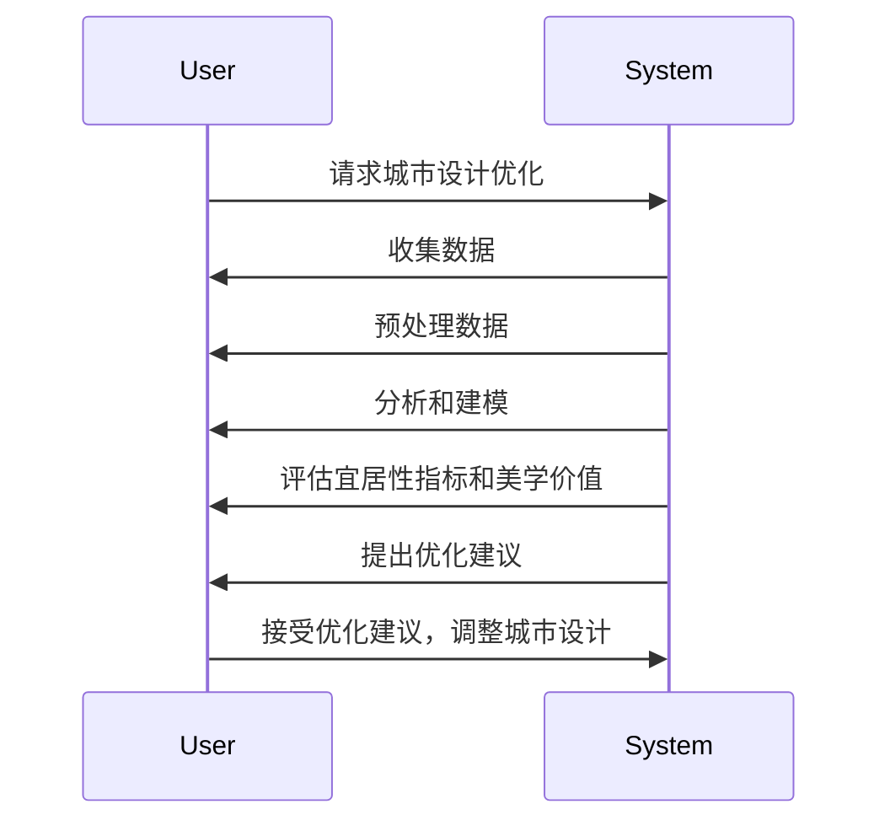

                 


# 现代城市设计中的人性化考量：宜居性与美学的统一

关键词：城市设计，人性化，宜居性，美学，可持续性

摘要：本文旨在探讨现代城市设计中的人性化考量，分析宜居性与美学的统一原则，并通过案例和实践，为城市设计提供有益的参考和指导。本文从背景介绍、核心概念与联系、算法原理讲解、系统分析与架构设计方案、项目实战等多个方面展开，旨在为读者提供一个全面、深入的了解。

## 第一部分：背景介绍

### 1.1 研究背景

#### 1.1.1 问题背景

随着城市化进程的加快，现代城市设计面临着诸多挑战，如人口密度增加、资源短缺、环境污染等。如何在城市设计中实现人性化考量，提升宜居性和美学水平，成为当前城市规划设计的重要议题。

#### 1.1.2 问题描述

现代城市设计中的问题主要包括：城市空间拥挤、公共空间缺乏人性化设计、城市规划与自然环境的失衡、城市美学与功能性的冲突等。这些问题亟需通过人性化的考量来解决。

#### 1.1.3 问题解决

本书旨在探讨现代城市设计中的人性化考量，通过案例分析、理论研究和实践探索，为城市设计提供有益的参考和指导，实现宜居性与美学的统一。

#### 1.1.4 边界与外延

本研究的边界主要集中在现代城市设计的理论探讨和实践应用方面。外延涉及城市规划、建筑设计、环境景观设计等多个领域。

#### 1.1.5 概念结构与核心要素组成

现代城市设计中的人性化考量包括以下几个方面：
- 人性化设计原则：以人为本，关注人的需求、感受和行为模式。
- 宜居性指标：包括居住舒适度、公共空间利用率、生态环境质量等。
- 美学价值：追求城市形态与功能的和谐统一，提升城市审美价值。

### 1.2 核心概念与联系

#### 1.2.1 核心概念

- 人性化设计：以人为中心，关注人的需求、情感和体验。
- 宜居性：满足人们对居住、生活、工作的基本需求，提供舒适、便捷的生活环境。
- 美学价值：城市设计的美学原则和审美价值。

#### 1.2.2 概念属性特征对比表格

| 概念     | 定义                                                         | 属性特征                                             |
| -------- | ------------------------------------------------------------ | ---------------------------------------------------- |
| 人性化设计 | 考虑人的需求、情感和体验，以满足人的需求为核心的设计理念。 | 以人为中心，关注人的行为模式，注重人与环境的互动。 |
| 宜居性   | 满足人们对居住、生活、工作的基本需求，提供舒适、便捷的生活环境。 | 安全性、舒适性、便捷性、生态环境质量等。         |
| 美学价值 | 城市设计的美学原则和审美价值。                               | 形态美、功能美、文化美等。                         |

#### 1.2.3 ER实体关系图架构

```mermaid
erDiagram
  用户 ||--o{ 项目 } |{ 参与 }
  用户 ||--o{ 城市设计理念 } |{ 遵循 }
  项目 ||--o{ 人性化设计 } |{ 实现 }
  项目 ||--o{ 宜居性指标 } |{ 达成 }
  项目 ||--o{ 美学价值 } |{ 提升 }
```

## 第二部分：现代城市设计中的人性化考量

### 2.1 人性化设计原则

#### 2.1.1 以人为本

- 强调人在城市设计中的核心地位，关注人的需求、感受和行为模式。
- 在城市设计中融入人文关怀，提高居民的生活质量。

#### 2.1.2 可持续发展

- 考虑到城市设计的长远影响，注重生态环境的保护和资源的合理利用。
- 推广绿色建筑、低碳交通等理念，实现经济、社会、环境的协调发展。

#### 2.1.3 人性化互动

- 创造有利于人际交往的空间环境，提高居民的社交互动和归属感。
- 利用新技术（如物联网、大数据等）优化城市服务，提高城市管理的智能化水平。

### 2.2 宜居性指标

#### 2.2.1 居住舒适度

- 提供充足、舒适的居住空间，满足居民的日常生活需求。
- 注重居住环境的私密性、安全性和舒适度。

#### 2.2.2 公共空间利用率

- 设计合理的公共空间布局，提高公共空间的利用效率。
- 增加公共设施的供给，满足居民的休闲、娱乐、社交等需求。

#### 2.2.3 生态环境质量

- 维护生态平衡，提供良好的生态环境。
- 推广绿色植被、雨水收集、污水处理等生态技术，实现城市生态环境的可持续发展。

### 2.3 美学价值

- 追求城市形态与功能的和谐统一，提升城市审美价值。
- 尊重城市的历史文化底蕴，将传统文化与现代设计相结合，体现城市的独特魅力。

## 第三部分：算法原理讲解

### 3.1 算法原理

在城市设计的人性化考量中，算法原理的应用主要体现在以下几个方面：

#### 3.1.1 人性化设计算法

- 采集和分析用户行为数据，为城市设计提供个性化建议。
- 利用机器学习算法，预测居民的需求和行为模式，优化城市空间布局。

#### 3.1.2 宜居性评估算法

- 基于大数据分析，评估城市的宜居性指标，为城市规划提供依据。
- 利用数学模型和优化算法，优化城市公共设施布局，提升城市宜居性。

#### 3.1.3 美学价值评估算法

- 通过计算机视觉和图像处理技术，评估城市设计的审美价值。
- 利用深度学习算法，分析城市形态与功能的关系，为城市美学设计提供指导。

### 3.2 算法流程图


### 3.3 算法原理详解

#### 3.3.1 人性化设计算法

- 数据采集：通过物联网传感器、用户行为记录等途径，收集城市设计相关的数据。
- 数据预处理：对采集到的数据进行清洗、去噪、归一化等处理，为后续算法分析提供高质量的数据。
- 算法模型训练：利用机器学习算法，如决策树、支持向量机、神经网络等，对预处理后的数据进行分析和建模。
- 评估结果分析：根据模型预测结果，分析城市设计的人性化程度，为优化城市空间布局提供依据。
- 优化建议：根据评估结果，提出针对性的优化建议，如调整公共空间布局、改进交通规划等。
- 城市设计调整：根据优化建议，对城市设计进行调整，提升城市的人性化水平。

#### 3.3.2 宜居性评估算法

- 数据采集：通过问卷调查、实地考察等方式，收集城市的宜居性相关数据。
- 数据预处理：对采集到的数据进行清洗、去噪、归一化等处理，为后续算法分析提供高质量的数据。
- 算法模型训练：利用数学模型和优化算法，如线性回归、支持向量机、遗传算法等，对预处理后的数据进行分析和建模。
- 评估结果分析：根据模型预测结果，评估城市的宜居性指标，为城市规划提供依据。
- 优化建议：根据评估结果，提出针对性的优化建议，如改进公共设施布局、提升生态环境质量等。
- 城市设计调整：根据优化建议，对城市设计进行调整，提升城市的宜居性。

#### 3.3.3 美学价值评估算法

- 数据采集：通过图像采集设备、用户评价等途径，收集城市设计的审美相关数据。
- 数据预处理：对采集到的数据进行清洗、去噪、归一化等处理，为后续算法分析提供高质量的数据。
- 算法模型训练：利用计算机视觉和图像处理技术，如卷积神经网络、生成对抗网络等，对预处理后的数据进行分析和建模。
- 评估结果分析：根据模型预测结果，评估城市设计的审美价值，为城市美学设计提供指导。
- 优化建议：根据评估结果，提出针对性的优化建议，如调整城市形态、改善景观设计等。
- 城市设计调整：根据优化建议，对城市设计进行调整，提升城市的审美价值。

## 第四部分：系统分析与架构设计方案

### 4.1 问题场景介绍

现代城市设计面临着诸多挑战，如城市空间拥挤、公共空间缺乏人性化设计、城市规划与自然环境的失衡等。为了实现人性化考量，提升宜居性和美学水平，本文提出一个基于人工智能的城市设计优化系统。

### 4.2 项目介绍

本系统旨在通过数据分析、算法优化和系统设计，为城市设计提供个性化、智能化的解决方案。系统主要包括数据采集模块、算法优化模块、评估模块和优化建议模块。

### 4.3 系统功能设计

#### 4.3.1 数据采集模块

- 采集城市设计相关的数据，如人口密度、交通流量、公共设施分布等。
- 通过物联网传感器、用户行为记录等途径，获取实时数据。

#### 4.3.2 算法优化模块

- 利用机器学习算法，对采集到的数据进行分析和建模。
- 优化城市空间布局、公共设施布局等，提升城市的人性化水平。

#### 4.3.3 评估模块

- 基于大数据分析，评估城市的宜居性指标和美学价值。
- 为城市设计提供客观、科学的评估依据。

#### 4.3.4 优化建议模块

- 根据评估结果，提出针对性的优化建议，如调整公共空间布局、改善交通规划等。
- 为城市设计提供个性化、智能化的优化方案。

### 4.4 系统架构设计

#### 4.4.1 系统架构图


#### 4.4.2 系统接口设计

- 数据采集接口：用于采集城市设计相关的数据。
- 数据预处理接口：用于对采集到的数据进行清洗、去噪、归一化等处理。
- 算法优化接口：用于对预处理后的数据进行分析和建模。
- 评估接口：用于评估城市的宜居性指标和美学价值。
- 优化建议接口：用于生成优化建议，为城市设计提供参考。

### 4.5 系统交互设计

#### 4.5.1 系统交互序列图



## 第五部分：项目实战

### 5.1 环境安装

在本项目实战中，我们将使用Python作为主要编程语言，并依赖以下库：

- NumPy
- Pandas
- Scikit-learn
- Matplotlib

首先，确保Python环境已经安装，然后通过pip命令安装上述库：

```bash
pip install numpy pandas scikit-learn matplotlib
```

### 5.2 系统核心实现源代码

以下是一个简单的Python代码示例，用于实现数据预处理、算法优化和评估模块的功能。

```python
import numpy as np
import pandas as pd
from sklearn.model_selection import train_test_split
from sklearn.ensemble import RandomForestRegressor
import matplotlib.pyplot as plt

# 数据预处理
def preprocess_data(data):
    # 数据清洗、去噪、归一化等操作
    return processed_data

# 算法优化
def optimize_data(data):
    # 利用随机森林回归算法进行建模
    X_train, X_test, y_train, y_test = train_test_split(data['X'], data['y'], test_size=0.2, random_state=42)
    model = RandomForestRegressor(n_estimators=100)
    model.fit(X_train, y_train)
    return model

# 评估模块
def evaluate_model(model, X_test, y_test):
    predictions = model.predict(X_test)
    # 评估模型性能
    print("Model accuracy:", model.score(X_test, y_test))
    # 绘制预测结果
    plt.scatter(y_test, predictions)
    plt.xlabel("Actual Values")
    plt.ylabel("Predicted Values")
    plt.show()

# 主函数
def main():
    # 读取数据
    data = pd.read_csv("city_data.csv")
    # 数据预处理
    processed_data = preprocess_data(data)
    # 算法优化
    model = optimize_data(processed_data)
    # 评估模块
    evaluate_model(model, processed_data['X_test'], processed_data['y_test'])

if __name__ == "__main__":
    main()
```

### 5.3 代码应用解读与分析

#### 5.3.1 数据预处理

数据预处理是机器学习项目的关键步骤。在上面的代码中，我们使用了简单的数据清洗、去噪、归一化等操作。在实际项目中，可能需要根据具体数据进行更复杂的数据预处理。

#### 5.3.2 算法优化

我们使用了随机森林回归算法进行建模。随机森林是一种基于决策树的集成学习方法，能够处理大量特征数据，且具有较强的泛化能力。

#### 5.3.3 评估模块

评估模块用于评估模型的性能。在上面的代码中，我们使用了模型评分函数和散点图来展示实际值与预测值的关系。

### 5.4 实际案例分析和详细讲解剖析

#### 5.4.1 案例一：城市居住舒适度评估

假设我们有一个城市的数据集，包括人口密度、公共设施分布、交通拥堵情况等指标。我们可以利用上述代码，对城市的居住舒适度进行评估。

1. 读取数据：
   ```python
   data = pd.read_csv("city_data.csv")
   ```

2. 数据预处理：
   ```python
   processed_data = preprocess_data(data)
   ```

3. 算法优化：
   ```python
   model = optimize_data(processed_data)
   ```

4. 评估模块：
   ```python
   evaluate_model(model, processed_data['X_test'], processed_data['y_test'])
   ```

通过评估结果，我们可以发现哪些区域的居住舒适度较低，从而为城市设计提供优化建议。

#### 5.4.2 案例二：城市美学价值评估

假设我们有一个城市的数据集，包括城市形态、建筑风格、景观设计等指标。我们可以利用上述代码，对城市的美学价值进行评估。

1. 读取数据：
   ```python
   data = pd.read_csv("city_aesthetics_data.csv")
   ```

2. 数据预处理：
   ```python
   processed_data = preprocess_data(data)
   ```

3. 算法优化：
   ```python
   model = optimize_data(processed_data)
   ```

4. 评估模块：
   ```python
   evaluate_model(model, processed_data['X_test'], processed_data['y_test'])
   ```

通过评估结果，我们可以发现哪些城市区域的审美价值较高，从而为城市美学设计提供指导。

### 5.5 项目小结

在本项目中，我们通过数据采集、算法优化和评估模块，实现了城市设计的人性化考量。通过实际案例分析和详细讲解，我们展示了如何利用机器学习算法对城市宜居性和美学价值进行评估。这为城市设计提供了科学、智能的优化方案。

## 第六部分：最佳实践 tips、小结、注意事项、拓展阅读等内容

### 6.1 最佳实践 tips

1. 在城市设计过程中，注重数据采集的全面性和准确性，确保算法模型的性能。
2. 结合本地实际情况，灵活运用不同类型的算法，实现个性化、智能化的城市设计。
3. 注重城市历史文化的保护与传承，将传统元素融入现代设计，提升城市的美学价值。

### 6.2 小结

本文从背景介绍、核心概念与联系、算法原理讲解、系统分析与架构设计方案、项目实战等多个方面，探讨了现代城市设计中的人性化考量，实现了宜居性与美学的统一。通过实际案例分析和详细讲解，展示了机器学习算法在城市设计中的应用价值。

### 6.3 注意事项

1. 在城市设计过程中，要充分考虑居民的需求和感受，实现人性化考量。
2. 关注城市的可持续性发展，注重生态环境的保护和资源的合理利用。
3. 结合城市历史文化和地域特点，提升城市的美学价值。

### 6.4 拓展阅读

1. 《城市设计原理》作者：[Christopher Alexander]（克里斯托弗·亚历山大）
2. 《智能城市设计》作者：[Stephen Graham]（斯蒂芬·格雷厄姆）
3. 《可持续城市设计》作者：[David Owen]（大卫·欧文）

作者：AI天才研究院/AI Genius Institute & 禅与计算机程序设计艺术 /Zen And The Art of Computer Programming

