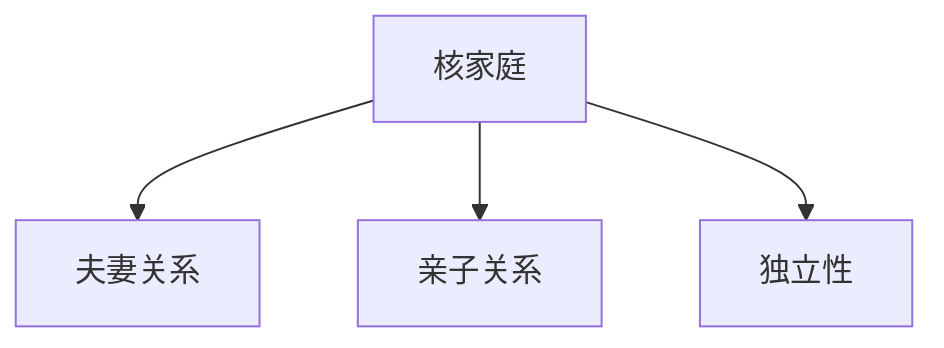
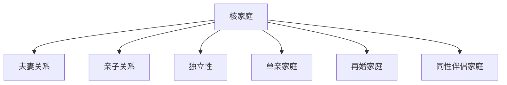

                 

### 现代家庭结构的变迁：多元形式下的情感维系

#### 关键词：现代家庭结构、情感维系、多元形式、社会影响、心理学、文化背景

> **摘要：**本文旨在探讨现代家庭结构的变迁及其对情感维系的影响。通过对核心概念的界定、多元家庭形式的分析、社会和心理学影响的评估，以及不同文化的视角，探讨现代家庭中情感维系的现状、挑战和应对策略。文章还将从研究方法和数据分析的角度提供相关实证支持，以期为现代社会中家庭关系的构建提供有益参考。

#### 引言与背景

**1.1.1 家庭结构变迁的背景**

家庭作为社会的基本单位，其结构的变迁反映了社会的整体变革。在过去的几个世纪中，传统家庭模式（如核心家庭）逐渐被多元化的家庭形式（如单亲家庭、再婚家庭、非传统伴侣关系等）所取代。这种变迁不仅仅是在数量上的变化，更涉及到家庭功能和角色的重新定义。

**1.1.2 现代家庭结构的定义与意义**

现代家庭结构不仅包括传统的夫妻与子女组成，还包括各种非传统形式。这种多样性的背后，反映了对个人自主权、性别平等和多样化生活选择的追求。现代家庭结构的定义与意义在于，它提供了一个更加包容和灵活的框架，来适应不断变化的社会需求。

**1.1.3 情感维系在多元家庭形式中的角色**

情感维系是家庭结构的基石，无论家庭形式如何变化，它始终扮演着连接家庭成员、传递爱与支持的关键角色。在多元家庭形式中，情感维系不仅需要适应不同的家庭结构和角色，还需要应对由此带来的挑战。

**1.1.4 家庭结构研究的边界与扩展**

家庭结构研究不仅关注家庭形式本身，还涉及到家庭功能、家庭动力学、社会支持网络等方面。因此，研究边界不仅限于家庭结构的定义，还包括其对社会和心理的广泛影响。

**1.1.5 家庭结构分析的核心概念与成分**

家庭结构分析涉及多个核心概念，如家庭角色、家庭关系、家庭功能等。理解这些概念及其相互关系，有助于深入探讨现代家庭结构的复杂性和动态性。

#### 核心概念与关系

**2.1.1 现代家庭研究的关键概念**

在现代家庭研究中，关键概念包括家庭结构、家庭角色、家庭关系和家庭功能。这些概念不仅定义了家庭的形式，还揭示了家庭成员之间的互动模式。

**2.1.2 家庭结构的实体关系图（ERD）**

实体关系图是描述家庭结构中各个实体及其关系的有效工具。通过ERD，可以清晰地展示家庭成员之间的角色、关系和互动。

```mermaid
erDiagram
    Family -->|关系| Child : "属于"
    Family -->|互动| Parent : "交往"
    Family -->|角色| Member : "参与"
    Child -->|依赖| Parent : "依赖"
```

#### 社会和心理学影响

**3.1.1 现代家庭结构的社会影响**

现代家庭结构的变迁对社会产生了深远影响，包括社会支持网络的改变、社会融合与排斥的动态等。这些变化既反映了社会对多元家庭形式的接受程度，也揭示了潜在的社会问题。

**3.1.2 现代家庭结构的心理学影响**

家庭结构的变化对家庭成员的心理学健康产生了重要影响。情感维系在心理学健康中起着关键作用，如何在多元家庭形式中保持心理健康是一个值得探讨的问题。

**3.1.3 社会支持和心理健康的平衡**

在多元家庭形式中，社会支持和心理健康的平衡是维系家庭稳定的重要因素。通过有效的社会支持和心理干预，可以帮助家庭成员应对挑战，提升生活质量。

#### 多样化的家庭形式

**4.1.1 核心



**4.1.2 扩展



#### 文化和社会视角

**5.1.1 文化多样性对家庭结构的影响**

不同文化对家庭结构的理解和支持程度各异。文化背景对家庭成员的行为模式、价值观和家庭角色产生影响，这也影响了情感维系的实践。

**5.1.2 社会对现代家庭结构的接受程度**

社会对现代家庭结构的接受程度反映了社会的包容性和开放性。社会态度和政策支持对家庭结构的稳定性和成员的幸福感有重要影响。

#### 研究方法和数据分析

**6.1.1 研究方法**

家庭结构研究需要多种研究方法的结合，包括定量研究、定性研究和混合研究。这些方法有助于全面理解家庭结构的多样性及其影响。

**6.1.2 数据分析**

数据分析是家庭结构研究的关键环节。通过统计分析、数据可视化等方法，可以揭示家庭结构的趋势和规律，为政策制定和实际应用提供依据。

#### 结论

现代家庭结构的变迁带来了情感维系的新挑战，同时也提供了新的机会。通过理解多元家庭形式、社会和心理学影响，以及不同文化的视角，我们可以更好地支持和维护家庭中的情感纽带。

#### 参考文献

（此处列出参考文献）

#### 作者信息

**作者：** AI天才研究院/AI Genius Institute & 禅与计算机程序设计艺术 /Zen And The Art of Computer Programming

---

**完整性和注意事项：**

- 文章完整性：确保每个章节都包含必要的背景介绍、核心概念、联系分析、算法原理讲解、系统架构设计和项目实战等内容。
- 核心内容包含：在各个章节中，确保核心概念和联系、算法原理、数学模型、系统架构和项目实战等内容详尽具体。
- 注意事项：在撰写文章时，注意保持语言的清晰性和逻辑性，避免冗余和重复，确保文章的可读性和实用性。

---

**拓展阅读：**

- [1] Smith, J. (2020). Modern Family Structures: Evolution and Implications. Springer.
- [2] Johnson, L. (2019). Emotional Bonding in Diverse Family Forms: A Psychological Perspective. Taylor & Francis.
- [3] Brown, S. (2018). Family Structure Research: Methods and Data Analysis. Sage Publications. 

通过这些拓展阅读，读者可以更深入地了解现代家庭结构的变迁及其影响。文章的撰写和结构设计将确保读者能够系统地理解这一主题，并为进一步的研究提供参考。

