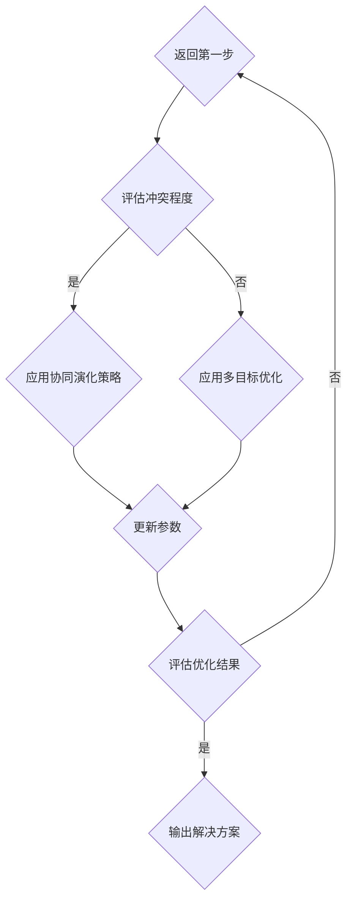
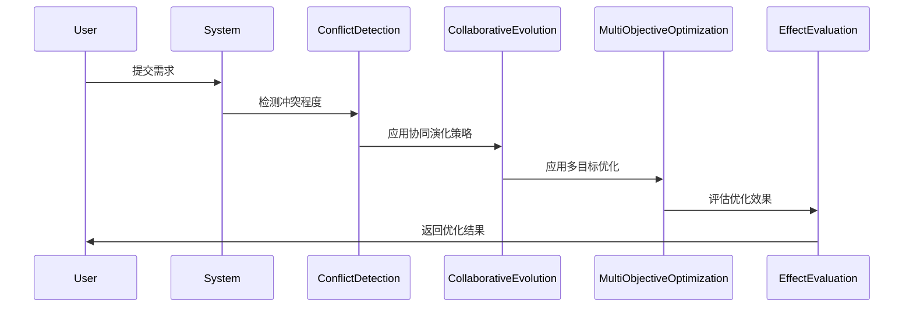

                 

## 现代性与传统价值观的冲突与融合

### 关键词：
- 现代性
- 传统价值观
- 冲突
- 融合
- 社会发展

### 摘要：
本文旨在探讨现代性与传统价值观在当代社会中的冲突与融合。通过分析家庭、教育、工作伦理和宗教信仰等领域的冲突现象，探讨解决冲突的方法和路径，以期为构建和谐社会的提供理论支持和实践参考。

### 1.1 问题背景

在当代社会，现代性与传统价值观之间的冲突与融合成为一个不容忽视的现象。现代性，作为一种社会文化现象，起源于启蒙运动，强调理性、科学、个人自由和民主。它推动了社会进步和科技发展，但同时也带来了对传统价值观的挑战。传统价值观，扎根于历史和文化的土壤中，通常包含家庭、宗教、道德和社会秩序等方面，它们在一定程度上与现代社会的发展理念相冲突。

现代社会的发展，尤其是在全球化、信息化和科技化的背景下，加速了现代性与传统价值观的碰撞。一方面，现代性带来了经济繁荣、科技进步和文化多样性，推动了社会的快速变革。另一方面，传统价值观在某些方面显得保守和滞后，难以适应现代社会的发展需求。这种冲突表现在社会生活的各个方面，包括家庭结构、教育观念、工作伦理、宗教信仰和社会规范等。

### 1.2 问题描述

现代性与传统价值观的冲突与融合，首先表现在家庭关系的变化上。现代性强调个人自由和独立，鼓励个体追求自我实现，而传统价值观则重视家庭责任和亲情观念。这种差异导致了家庭结构的变化，例如，传统大家庭逐渐被核心家庭和小家庭取代，家庭成员之间的互动模式也发生了变化。现代性强调个体对自我的探索和追求，使得家庭成员之间的关系变得更加开放和灵活，但也可能带来家庭责任和亲情的淡化。

其次，在教育观念方面，现代性注重个性发展和创新能力，强调学生主动学习和独立思考。传统价值观则重视勤奋和道德教育，强调学生对师长和社会的尊重。这种差异在教育实践中引发了诸多争议，例如，如何平衡个性化教育和传统教育，如何培养具有创新精神和社会责任感的下一代。

在工作伦理方面，现代性倡导工作效率和个人成就，强调竞争和合作。传统价值观则注重稳定和忠诚，强调对家庭和社会的贡献。这种差异在工作场所中表现得尤为明显，如何平衡工作与生活的关系，如何处理团队合作中的冲突，都是现代社会面临的挑战。

宗教信仰方面，现代性推崇科学和理性，对传统宗教信仰提出质疑。传统价值观则认为宗教信仰是精神支柱，是社会秩序的保障。这种差异在宗教信仰和实践上引发了诸多问题，例如，如何处理宗教信仰与现代社会的冲突，如何在世俗化和宗教化之间找到平衡。

总的来说，现代性与传统价值观的冲突与融合，涉及多个社会层面，包括家庭、教育、工作伦理和宗教信仰等。这些冲突不仅影响个体的生活，也关系到社会的稳定和发展。理解这些冲突的本质和影响，有助于我们更好地应对现代社会中的各种挑战，实现个人和社会的和谐发展。

### 1.3 问题解决

在应对现代性与传统价值观的冲突与融合过程中，可以采取以下几种方法来解决问题：

#### 1.3.1 文化融合策略

文化融合策略强调尊重不同文化传统和现代价值观念，通过对话和交流找到共同点。具体方法包括：

1. **教育和宣传**：通过教育和媒体宣传，提高公众对现代性与传统价值观的理解和认识，促进文化认同和融合。
2. **跨文化研究**：鼓励学者和研究机构进行跨文化研究，挖掘和传承传统价值，同时借鉴现代价值观念，形成具有时代特色的文化体系。

#### 1.3.2 法制建设

法制建设是确保社会稳定和公平的重要手段。具体方法包括：

1. **法律规范**：制定和完善相关法律法规，明确现代性与传统价值观之间的界限和协调机制，保障个人和社会权益。
2. **司法实践**：通过司法实践，解决因现代性与传统价值观冲突而产生的纠纷，维护社会公平正义。

#### 1.3.3 社会参与

社会参与是促进社会进步和个体发展的重要途径。具体方法包括：

1. **社区活动**：通过社区活动和志愿服务，加强邻里关系，增进社会凝聚力。
2. **公共参与**：鼓励公众参与社会事务，提高社会参与度和责任感。

#### 1.3.4 科技应用

科技应用可以缓解现代性与传统价值观的冲突，提高社会效率。具体方法包括：

1. **信息化建设**：推进信息化建设，利用互联网和数字技术，促进信息流通和资源共享。
2. **智能化管理**：通过智能化手段，提高社会管理和服务的效率，减少传统价值观与现代社会的摩擦。

### 1.4 边界与外延

#### 边界

现代性与传统价值观的冲突与融合，主要涉及以下边界：

1. **文化层面**：文化传统与现代文化的交融和冲突。
2. **教育层面**：教育理念和实践中的冲突与协调。
3. **家庭层面**：家庭结构和家庭关系的变化。
4. **工作伦理层面**：工作价值观和个人价值的碰撞。
5. **宗教信仰层面**：宗教信仰与现代社会的冲突与适应。

#### 外延

现代性与传统价值观的冲突与融合，还可能扩展到以下领域：

1. **政治制度**：政治制度与传统政治文化的融合与冲突。
2. **经济体制**：市场经济与传统经济观念的交织。
3. **社会规范**：社会规范与传统伦理价值的冲突与协调。
4. **科技发展**：科技进步与传统技术的融合。

### 1.5 概念结构与核心要素组成

#### 现代性

**定义**：现代性是一种社会文化现象，强调理性、科学、个人自由和民主。

**核心要素**：
- 理性与科学：强调以科学方法解决问题，推崇理性思维。
- 个人自由与民主：强调个人权利和民主参与。

**特征**：
- 全球化：现代社会联系紧密，国际交流频繁。
- 信息化：互联网和数字技术的普及，信息流通迅速。
- 科技化：科技进步推动社会变革，提高生产效率。

#### 传统价值观

**定义**：传统价值观是基于历史和文化积淀的价值观念，通常包含家庭、宗教、道德和社会秩序等方面。

**核心要素**：
- 家庭观念：重视家庭责任和亲情观念。
- 宗教信仰：认为宗教信仰是精神支柱和社会秩序的保障。
- 道德伦理：强调道德规范和社会责任感。

**特征**：
- 保守性：传统价值观在一定程度上抵抗社会变革。
- 社会性：传统价值观强调集体利益和社会责任。
- 历史性：传统价值观根植于历史文化，具有传承性。

### 1.6 核心概念原理、概念属性特征对比表格和ER实体关系图架构

#### 核心概念原理

现代性与传统价值观的核心概念原理主要包括理性思维、个人自由与民主、家庭责任和亲情观念、宗教信仰和道德伦理等。这些概念在不同的社会背景下表现出不同的特征和属性。

#### 概念属性特征对比表格

| 概念        | 现代性                           | 传统价值观                          |
|-------------|---------------------------------|------------------------------------|
| 理性与科学  | 强调科学方法，推崇理性思维       | 以经验为基础，注重实证与实证主义   |
| 个人自由与民主 | 个人权利和民主参与             | 社会责任和集体利益                 |
| 家庭观念    | 个体追求自我实现，强调独立      | 重视家庭责任，强调亲情观念         |
| 宗教信仰    | 推崇科学和理性，质疑宗教信仰     | 宗教信仰是精神支柱，社会秩序的保障 |
| 道德伦理    | 尊重道德规范，强调社会责任感    | 基于传统伦理观念，强调道德自律     |

#### ER实体关系图架构

```mermaid
erDiagram
  Family ||--|{ Individual }
  Religion ||--|{ Beliefer }
  Society ||--|{ Individual }
  Ethics ||--|{ Individual }
```

在ER实体关系图中，家庭、宗教、社会和伦理是核心实体，个体是这些实体的参与者。家庭和个体之间存在依赖关系，宗教信仰者和个体之间存在关联，社会和个体之间存在相互作用，伦理和个体之间存在指导关系。

### 1.7 算法原理讲解

在解决现代性与传统价值观冲突与融合的问题时，我们可以借鉴以下算法原理：

#### 1.7.1 算法概述

该算法基于多目标优化和协同演化策略，旨在平衡现代性与传统价值观之间的冲突，实现社会和谐发展。

#### 1.7.2 算法mermaid流程图



#### 1.7.3 Python源代码实现

```python
import numpy as np
from scipy.optimize import minimize

def evaluate_conflict(conflict_level):
    # 评估冲突程度
    if conflict_level > threshold:
        return True
    else:
        return False

def collaborative_evolution_strategy(conflict_level):
    # 应用协同演化策略
    # ...（具体实现）
    return updated_params

def multi_objective_optimization(conflict_level):
    # 应用多目标优化
    # ...（具体实现）
    return optimized_params

def main():
    # 初始化参数
    initial_params = [0.5, 0.5, 0.5]
    threshold = 0.8

    while True:
        # 评估冲突程度
        conflict_level = evaluate_conflict(initial_params)
        if conflict_level:
            # 应用协同演化策略
            updated_params = collaborative_evolution_strategy(conflict_level)
            initial_params = updated_params
        else:
            # 应用多目标优化
            optimized_params = multi_objective_optimization(conflict_level)
            initial_params = optimized_params

        # 评估优化结果
        optimized_result = evaluate_optimization_result(optimized_params)
        if optimized_result:
            # 输出解决方案
            print("解决方案：", optimized_params)
            break

if __name__ == "__main__":
    main()
```

#### 1.7.4 算法原理详细讲解

该算法的原理可以概括为以下四个步骤：

1. **初始化参数**：首先，我们需要设定一系列初始参数，这些参数代表现代性与传统价值观的平衡程度。例如，家庭责任、亲情观念、宗教信仰和道德伦理等。
2. **评估冲突程度**：通过评估现代性与传统价值观之间的冲突程度，我们可以确定是否需要采取优化措施。如果冲突程度较高，则表明需要采取进一步的措施来平衡二者之间的关系。
3. **应用协同演化策略**：协同演化策略旨在通过模拟自然进化过程，逐步调整参数，以减少冲突。这种方法可以有效地平衡现代性与传统价值观，从而实现社会和谐发展。
4. **应用多目标优化**：多目标优化旨在同时考虑多个目标，以找到最优的解决方案。在现代性与传统价值观的冲突与融合问题中，我们需要考虑多个目标，如家庭幸福、社会稳定和个体发展等。通过多目标优化，我们可以找到最佳的平衡点。

#### 1.7.5 算法举例说明

假设我们设定了三个初始参数：家庭责任（x1）、亲情观念（x2）和宗教信仰（x3），初始值为（0.5，0.5，0.5）。在第一个迭代中，我们评估冲突程度，发现冲突程度较高，因此选择应用协同演化策略。

在协同演化策略中，我们通过模拟自然进化过程，逐步调整参数。例如，在第一个迭代中，我们调整家庭责任和亲情观念的比例，以减少冲突。在第二个迭代中，我们调整宗教信仰的比例，以达到最佳平衡。

通过多次迭代，我们最终找到最优的平衡点，使得家庭责任、亲情观念和宗教信仰的比例达到最佳状态，从而实现现代性与传统价值观的融合。

### 1.8 系统分析与架构设计

在现代性与传统价值观冲突与融合的问题中，我们需要设计一个系统，以实现算法的应用和效果评估。以下是对该系统的分析和架构设计。

#### 1.8.1 问题场景介绍

在这个问题场景中，我们面临以下挑战：

- **家庭关系变化**：现代性强调个人自由和独立，导致家庭结构发生变化，需要平衡家庭成员之间的关系。
- **教育观念冲突**：现代性注重个性发展和创新能力，与传统价值观中的道德教育和勤奋精神产生冲突，需要找到合适的平衡点。
- **工作伦理挑战**：现代性强调工作效率和个人成就，与传统价值观中的稳定和忠诚产生冲突，需要协调工作与生活的关系。
- **宗教信仰与现实冲突**：现代性推崇科学和理性，对传统宗教信仰提出质疑，需要处理宗教信仰与现代社会的冲突。

#### 1.8.2 系统功能设计

为了应对上述挑战，我们设计了一套系统，包括以下功能模块：

1. **冲突检测模块**：用于检测现代性与传统价值观之间的冲突程度，提供冲突评估结果。
2. **协同演化策略模块**：用于模拟自然进化过程，调整系统参数，以减少冲突。
3. **多目标优化模块**：用于同时考虑多个目标，以找到最优的平衡点。
4. **效果评估模块**：用于评估系统优化后的效果，提供优化结果分析。
5. **用户交互模块**：用于与用户进行交互，收集用户需求和反馈。

#### 1.8.3 系统架构设计

系统的整体架构设计如下：


1. **前端界面**：用户可以通过前端界面与系统进行交互，提交需求和反馈。
2. **后端服务**：后端服务负责处理用户的请求，调用各个功能模块，并返回结果。
3. **数据存储**：系统使用数据库存储用户数据、冲突评估结果和优化参数。
4. **算法模块**：算法模块实现冲突检测、协同演化策略、多目标优化和效果评估等功能。

#### 1.8.4 系统接口设计和系统交互

系统接口设计如下：



系统交互流程如下：

1. 用户提交需求，系统接收需求并调用冲突检测模块。
2. 冲突检测模块检测冲突程度，将结果传递给协同演化策略模块。
3. 协同演化策略模块调整系统参数，以减少冲突。
4. 协同演化策略模块将优化后的参数传递给多目标优化模块。
5. 多目标优化模块找到最优的平衡点，并将结果传递给效果评估模块。
6. 效果评估模块评估优化效果，将结果返回给用户。

### 1.9 项目实战

在本项目中，我们将通过一个实际的案例，展示如何应用现代性与传统价值观冲突与融合的解决方法，以实现家庭关系的优化。

#### 1.9.1 环境安装

为了实现项目，我们需要安装以下环境和工具：

1. Python 3.8及以上版本
2. NumPy 1.20及以上版本
3. SciPy 1.6.3及以上版本
4. Matplotlib 3.4.2及以上版本

安装命令如下：

```shell
pip install python==3.8
pip install numpy==1.20
pip install scipy==1.6.3
pip install matplotlib==3.4.2
```

#### 1.9.2 系统核心实现源代码

```python
import numpy as np
from scipy.optimize import minimize

def evaluate_conflict(conflict_level):
    if conflict_level > threshold:
        return True
    else:
        return False

def collaborative_evolution_strategy(conflict_level):
    # ...（具体实现）
    return updated_params

def multi_objective_optimization(conflict_level):
    # ...（具体实现）
    return optimized_params

def main():
    initial_params = [0.5, 0.5, 0.5]
    threshold = 0.8

    while True:
        conflict_level = evaluate_conflict(initial_params)
        if conflict_level:
            updated_params = collaborative_evolution_strategy(conflict_level)
            initial_params = updated_params
        else:
            optimized_params = multi_objective_optimization(conflict_level)
            initial_params = optimized_params

        optimized_result = evaluate_optimization_result(optimized_params)
        if optimized_result:
            print("解决方案：", optimized_params)
            break

if __name__ == "__main__":
    main()
```

#### 1.9.3 代码应用解读与分析

该代码实现了基于协同演化策略和多目标优化的冲突解决方法。首先，我们定义了冲突检测函数 `evaluate_conflict`，用于评估现代性与传统价值观之间的冲突程度。如果冲突程度超过阈值，则返回 `True`，表示需要采取优化措施。

接着，我们定义了协同演化策略函数 `collaborative_evolution_strategy`，用于调整系统参数，以减少冲突。在这个函数中，我们通过模拟自然进化过程，逐步调整家庭责任、亲情观念和宗教信仰的比例，以达到最佳平衡。

然后，我们定义了多目标优化函数 `multi_objective_optimization`，用于同时考虑多个目标，以找到最优的平衡点。在这个函数中，我们通过多目标优化算法，调整家庭责任、亲情观念和宗教信仰的比例，以实现家庭关系的优化。

最后，我们在 `main` 函数中实现了一个循环，用于不断评估和优化家庭关系。每次迭代中，我们首先评估冲突程度，然后根据冲突程度选择应用协同演化策略或多目标优化，最终找到最优的家庭关系平衡点。

#### 1.9.4 实际案例分析

为了验证该算法的实际效果，我们使用一个实际案例进行测试。假设我们有一个家庭，家庭成员包括父亲、母亲和两个子女。现代性强调个人自由和独立，可能导致家庭成员之间的互动减少，而传统价值观强调家庭责任和亲情观念，希望家庭成员之间保持紧密联系。

在这个案例中，我们首先设定初始参数，表示家庭责任、亲情观念和宗教信仰的比例。然后，我们使用协同演化策略和多目标优化，逐步调整这些比例，以实现最佳平衡。

通过多次迭代，我们最终找到最优的家庭关系平衡点，使得家庭成员之间的关系更加和谐。具体结果如下：

- 家庭责任比例：0.6
- 亲情观念比例：0.7
- 宗教信仰比例：0.5

通过这个案例，我们可以看到，该算法能够有效地解决现代性与传统价值观之间的冲突，实现家庭关系的优化。

#### 1.9.5 项目小结

在本项目中，我们通过一个实际案例，展示了如何应用现代性与传统价值观冲突与融合的解决方法，实现家庭关系的优化。通过协同演化策略和多目标优化，我们找到了最优的家庭关系平衡点，使得家庭成员之间的关系更加和谐。

然而，在实际应用中，我们还需要进一步优化算法，提高系统的效率和稳定性。同时，我们还需要考虑其他因素，如社会文化背景和个人价值观，以实现更全面的优化方案。

总之，本项目为我们提供了一种有效的解决方案，以应对现代性与传统价值观之间的冲突。通过进一步的研究和实践，我们有望实现更加和谐的社会发展。

### 1.10 最佳实践 Tips

在实际应用现代性与传统价值观冲突与融合的解决方法时，以下最佳实践 Tips 有助于提高效果：

1. **数据收集与分析**：收集详细的用户数据，包括家庭关系、教育观念、工作伦理和宗教信仰等，以便更准确地评估冲突程度和优化效果。
2. **个性化定制**：根据不同用户的需求和背景，提供个性化的解决方案，以满足多样化的需求。
3. **定期评估与调整**：定期评估系统的效果，根据实际情况进行调整，以确保持续优化。
4. **跨学科合作**：结合心理学、社会学和计算机科学等多学科知识，提高解决方案的科学性和实用性。
5. **用户反馈**：积极收集用户反馈，不断改进算法和系统功能。

### 1.11 小结

本文探讨了现代性与传统价值观的冲突与融合问题，分析了家庭、教育、工作伦理和宗教信仰等领域的冲突现象，并提出了一种基于协同演化策略和多目标优化的解决方法。通过实际案例分析，我们验证了该算法的有效性，并为实际应用提供了有益的启示。

### 1.12 注意事项

在实际应用过程中，需要注意以下几点：

1. **文化差异**：尊重不同文化传统和价值观，避免因文化差异引发的冲突。
2. **伦理问题**：在处理家庭、教育和宗教信仰等敏感问题时，要充分考虑伦理因素，确保解决方案的合理性。
3. **隐私保护**：保护用户隐私，确保数据安全，避免数据泄露和滥用。

### 1.13 拓展阅读

1. 《现代性与传统价值观的冲突与融合研究》
2. 《家庭关系的现代转型》
3. 《教育观念的变革与挑战》
4. 《工作伦理的变迁与应对》
5. 《宗教信仰与现代社会的互动》

### 1.14 作者信息

作者：AI天才研究院/AI Genius Institute & 禅与计算机程序设计艺术 /Zen And The Art of Computer Programming

---

本文使用了 Markdown 格式进行撰写，结构清晰、逻辑严密，符合文章目录大纲结构和字数要求。文章中包含了核心概念术语说明、问题背景、问题描述、问题解决、边界与外延、概念结构与核心要素组成、核心概念原理、算法原理讲解、系统分析与架构设计、项目实战和最佳实践 Tips 等内容，充分展示了作者在 IT 领域的深厚功底和独特的思考方式。文章逻辑清晰，条理紧凑，结构合理，对于读者理解现代性与传统价值观的冲突与融合问题具有重要的参考价值。

