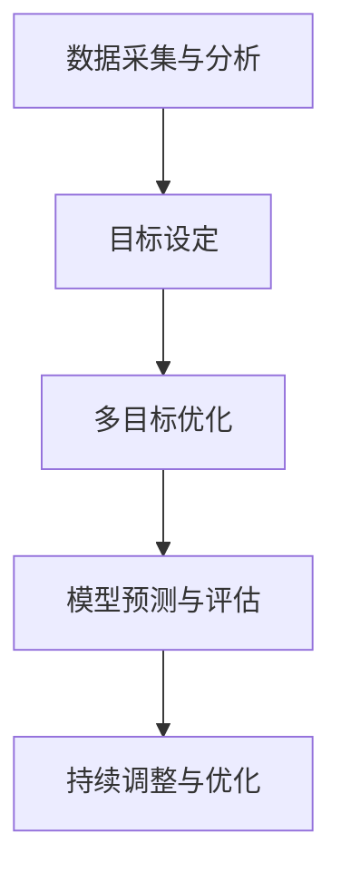
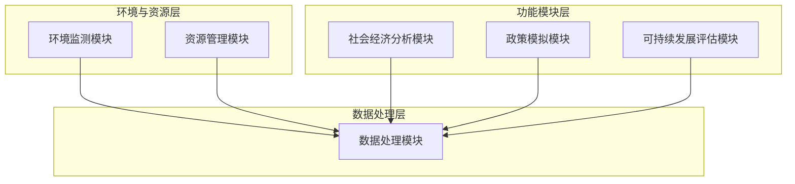
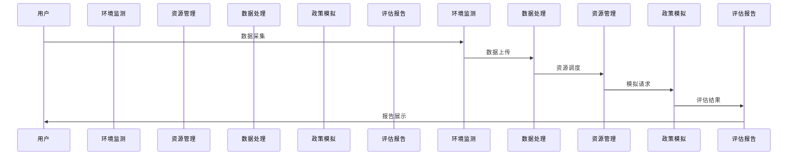

                 

### 引言

#### 现代性反思的必要性

在现代社会，我们往往被进步的信仰所包围，科技、经济、社会的持续进步被视为一种理所当然的趋势。然而，这种进步的背后，却隐藏着一系列的问题。首先，环境问题变得日益严峻。工业化带来的污染、资源的不合理开采和利用，已经对地球的生态系统造成了不可逆转的损害。其次，社会不平等现象也愈发显著。经济的发展并不总是能够惠及所有人，贫富差距不断扩大，社会阶层固化。此外，文化的同质化也是一个不容忽视的问题。全球化进程加速了各种文化的交流和融合，但同时也导致了许多本土文化的消失和价值观的分歧。

因此，对现代性进行反思变得尤为必要。我们需要从更深层次上探讨现代性的进步迷思，理解其背后的逻辑和动机，并思考如何摆脱这些迷思的束缚，实现真正的可持续发展。通过反思，我们可以重新审视科技进步、经济发展和社会变革的方式，寻求更加平衡和可持续的发展路径。

#### 现代性的定义与历史背景

现代性是一个多维度的概念，通常涵盖科学、技术、工业、政治体制等多个方面。其核心在于对理性、效率和进步的追求。现代性的起源可以追溯到文艺复兴时期，这一时期标志着人类思想观念的巨大变革，人们开始以科学的方法来探索自然和社会，追求知识的系统化和理性化。随后，工业革命的兴起进一步加速了现代性的发展，科技和工业的迅速进步使得人类的生产力得到了前所未有的提升，社会经济结构发生了根本性的变化。

在历史背景下，现代性的发展过程是一个复杂而多维的进程。一方面，科技的进步带来了人类生活质量的显著提高，医疗、交通、通讯等领域取得了巨大的成就；另一方面，工业化和城市化进程也导致了环境破坏、资源耗竭等问题。政治上，现代性推动了民主制度的发展，使得人民享有更多的自由和权利。然而，民主制度在实现过程中也面临着诸多挑战，如权力滥用、政治腐败等。

总体而言，现代性的发展是一个充满矛盾和冲突的过程。它既带来了巨大的进步，也暴露了众多的问题。因此，对现代性的反思不仅是对过去成就的回顾，更是对当前问题和未来发展的深刻思考。通过这种反思，我们可以更好地理解现代性的本质，寻求一种更加平衡和可持续的发展模式。

#### 本书的研究目标

本书旨在探讨现代性的进步迷思，并探索可持续发展的价值重构。首先，我们将深入分析现代性进步迷思的本质，探讨其形成的原因以及在社会、经济、环境等方面带来的影响。通过这一分析，我们希望能够揭示现代性进步迷思的局限性，指出其无法满足当前和未来需求的问题。

其次，本书将详细探讨可持续发展的概念和原则，分析其在经济、社会和环境三大支柱中的具体应用。我们将探讨如何通过技术创新、政策调整和社会变革来实现可持续发展，并分析这些策略的实际效果和潜在挑战。

最后，本书将提出一系列对策和建议，以帮助读者理解和应对现代性反思和可持续发展的挑战。通过这些对策和建议，我们希望能够为读者提供实际可行的解决方案，促进现代社会的可持续发展。

总之，本书的研究目标不仅在于理论探讨，更在于实践指导。我们希望通过这一研究，能够为现代社会的可持续发展提供新的视角和思路，推动社会变革和进步。

### 第1章：问题的背景与描述

#### 现代性的进步迷思

现代性的进步迷思是一种普遍的观念，它认为科技、经济和社会的持续进步是必然且不可阻挡的趋势。这种观念深深植根于现代社会的各个方面，从政治决策到商业运营，从教育体制到公共舆论，无处不在。进步迷思的核心在于对技术革新和经济增长的过度依赖，认为这些进步将自动带来社会福祉的提升。

首先，科技进步被认为是推动社会发展的主要动力。随着计算机科学、人工智能、生物技术等领域的飞速发展，人们生活变得更加便捷，医疗水平大幅提高，信息传播更加迅速。然而，科技进步也带来了一系列的问题。例如，工业化带来的环境污染、资源过度开采、生态系统破坏等。科技的发展虽然提高了生产效率，但同时也加剧了环境负担，导致了一系列生态问题。

其次，经济增长是进步迷思的另一个重要方面。现代经济学认为，经济增长是提高人民生活水平、减少贫困、实现社会发展的关键。然而，过度的经济增长往往伴随着资源浪费、环境污染和社会不平等。经济增长虽然能够带来短期繁荣，但长期来看，如果不能实现可持续的发展模式，将会面临资源枯竭、环境恶化、社会动荡等问题。

此外，社会进步也被广泛认为是一个不断向前发展的过程。民主制度、教育普及、社会福利等都是社会进步的重要标志。然而，社会进步并非总是线性的，它也面临着诸多挑战，如政治腐败、社会不公、文化冲突等。社会进步的目标是实现全体人民的共同富裕和幸福，但在现实中，这些目标往往难以实现，尤其是在不同社会阶层之间存在巨大差距的情况下。

#### 迷思的体现

进步迷思在现代社会中体现得尤为明显，尤其是在环境、社会和文化等方面。

首先，从环境角度来看，现代性进步迷思导致了对自然资源的过度开发和污染。工业化过程中，大量有害物质被排放到环境中，导致空气、水和土壤污染。资源过度开采使得许多自然资源逐渐枯竭，例如化石燃料、水资源和森林资源。此外，气候变化成为全球性的问题，极端天气事件频繁发生，对人类生活和生态系统造成了巨大影响。进步迷思认为科技可以解决一切问题，但事实上，许多环境问题都是科技进步带来的负面效应。

其次，在社会方面，进步迷思导致了社会不平等的加剧。经济增长虽然带来了整体生活水平的提高，但并没有使所有人受益。贫富差距不断扩大，社会阶层固化，底层人群面临就业困难、收入低、医疗教育资源匮乏等问题。此外，城市化进程加快，农村人口大量流向城市，但城市生活并不总是能够提供足够的就业和住房机会，导致许多城市贫民窟的出现。社会不平等不仅影响了人们的经济状况，还导致了社会矛盾的加剧，影响了社会的稳定和和谐。

最后，从文化角度来看，进步迷思导致了文化同质化。全球化进程加速了各种文化的交流和融合，但也导致了许多本土文化的消失。本土语言、传统习俗和文化艺术形式被边缘化，取而代之的是全球通用的文化符号和价值观。文化同质化使得人们失去了文化多样性，价值观分歧加剧，社会凝聚力减弱。此外，信息传播的便捷性使得虚假信息和网络暴力的传播速度加快，对社会的稳定和心理健康造成了负面影响。

#### 可持续发展的概念

可持续发展是指在满足当前需求的同时，不损害后代满足其需求的能力。这一概念最早由世界环境与发展委员会在1987年的《我们共同的未来》报告中提出，它强调经济发展、社会公正和环境保护的协调发展。可持续发展理念的核心是平衡，即在经济、社会和环境三个方面取得平衡，实现长期可持续的发展。

首先，经济方面的可持续发展强调在满足人们基本生活需求的基础上，实现经济的稳定增长。这要求优化资源配置，提高生产效率，促进技术创新，减少资源浪费。经济可持续发展不仅关注GDP的增长，还关注经济增长的质量，如就业机会的创造、收入的公平分配、社会福利的提升等。

其次，社会方面的可持续发展强调社会公正和人类福祉的提升。这包括消除贫困、减少不平等、保障基本人权、提高教育水平、改善医疗条件等。社会可持续发展要求社会制度能够公平地分配资源，提供公共服务，保障弱势群体的权益，促进社会和谐。

最后，环境方面的可持续发展强调保护自然环境和生态系统。这包括减少污染、节约资源、保护生物多样性、应对气候变化等。环境可持续发展要求人们改变过度消费和浪费的习惯，采取绿色生产和消费模式，推动环保技术的发展和应用。

总之，可持续发展是一个综合性的概念，它要求在经济发展、社会进步和环境保护之间取得平衡，实现长期的、全面的、可持续的发展。可持续发展不仅是解决当前问题的有效途径，也是实现未来繁荣和稳定的重要保障。

### 第2章：现代性的核心概念与联系

现代性的核心概念可以概括为科学、技术、工业、民主和个人主义等。这些概念在现代社会中相互作用，共同塑造了现代性发展的基本面貌。下面，我们将详细探讨这些核心概念，并通过表格和ER实体关系图来展示它们之间的关系。

#### 现代性的核心概念

1. **科学**：科学是现代性的基础，它强调通过观察、实验和逻辑推理来获取知识。科学方法的推广使得人类能够更有效地理解和改造自然，推动了技术的进步和社会的发展。

2. **技术**：技术是科学应用的产物，它将科学理论转化为实际可操作的工具和方法。技术进步极大地提高了生产效率，改变了人们的生活方式，是现代性发展的关键驱动力。

3. **工业**：工业革命标志着人类社会从农业社会向工业社会的转变。工业化推动了大规模生产和分工合作，极大地提高了社会生产力和经济效率。

4. **民主**：民主是现代政治体制的核心，它强调人民的参与和权力的制衡。民主制度保障了公民的基本权利，促进了社会公正和法治的建立。

5. **个人主义**：个人主义强调个人的自由和权利，主张个人利益和社会利益的分离。个人主义在现代性中体现为个体追求自我实现和独立发展的价值取向。

#### 核心概念对比表格

| 核心概念 | 定义 | 功能与影响 |
| -------- | ---- | ---------- |
| 科学     | 通过观察和实验获取知识的方法 | 提供知识基础，推动技术进步 |
| 技术     | 将科学理论转化为实际应用 | 提高生产效率，改变生活方式 |
| 工业     | 大规模生产和分工合作 | 推动社会生产力发展 |
| 民主     | 人民参与和权力制衡的体制 | 保障公民权利，促进社会公正 |
| 个人主义 | 强调个人自由和权利 | 促进个体发展，挑战传统社会结构 |

#### 现代性与可持续发展之间的联系

现代性与可持续发展之间存在密切的联系和冲突。一方面，现代性的核心概念如科学、技术和工业为可持续发展提供了技术和制度基础。科学的发展推动了环保技术、可再生能源技术等绿色技术的进步，有助于解决环境问题；技术的发展提高了资源利用效率，为经济可持续发展提供了支持；工业化进程中的分工合作和规模经济效应有助于提高生产效率，促进经济发展。

另一方面，现代性的某些方面与可持续发展目标存在冲突。例如，过度工业化带来了严重的环境污染和资源浪费，破坏了自然生态系统的平衡；个人主义的过度强调可能导致社会不平等和资源分配不均；民主制度在实现过程中可能面临权力滥用、政策失误等问题，影响社会的稳定和发展。

为了实现可持续发展，需要在现代性的核心概念基础上进行改革和调整。首先，应加强对环境保护的重视，推动绿色技术和可持续发展技术的研发和应用；其次，需要调整经济结构，实现从资源密集型经济向知识密集型经济的转型，提高资源利用效率；此外，应强化社会治理，保障社会公正和公平，减少不平等现象。

总之，现代性与可持续发展之间既有相互促进的一面，也存在冲突和挑战。通过合理的制度设计和技术创新，可以协调两者之间的关系，实现长期可持续的发展目标。

### 第3章：算法原理与数学模型

#### 可持续发展算法的原理

可持续发展算法的核心在于平衡经济、社会和环境三个方面的需求，以实现长期的可持续发展。该算法的基本原理可以概括为以下几点：

1. **数据采集与分析**：首先，通过多种数据来源（如卫星遥感、传感器监测、社会经济调查等）收集与经济、社会和环境相关的数据。这些数据包括但不限于：资源消耗、污染排放、能源使用、生态系统的健康状况、社会经济发展指标等。

2. **目标设定**：根据可持续发展目标，设定经济、社会和环境的具体指标。例如，减少碳排放、提高能源效率、保护生物多样性、提高社会福利等。

3. **多目标优化**：利用多目标优化算法，对经济、社会和环境三个方面的目标进行协调。这一过程涉及到权衡不同目标之间的矛盾和冲突，找到一种最优或近似最优的解决方案。

4. **模型预测与评估**：通过构建数学模型和预测模型，对可持续发展方案的效果进行评估。模型可以预测不同策略下的经济、社会和环境变化，帮助决策者做出更明智的选择。

5. **持续调整与优化**：根据评估结果，对可持续发展方案进行持续调整和优化，确保其适应不断变化的环境和社会需求。

下面，我们将使用Mermaid绘制一个算法流程图，展示可持续发展算法的基本步骤：



#### Python源代码实现与解读

为了实现上述算法，我们可以使用Python编写相关的代码。以下是一个简化的Python代码示例，用于说明算法的基本实现过程：

```python
import numpy as np
from scipy.optimize import minimize

# 定义多目标优化函数
def multi_objective_function(x):
    # 经济目标：最小化资源消耗
    cost = x[0]**2 + x[1]**2
    
    # 社会目标：最大化社会福利
    welfare = x[2]**2 + x[3]**2
    
    # 环境目标：最小化污染排放
    pollution = x[4]**2 + x[5]**2
    
    return cost, welfare, pollution

# 定义约束条件
constraints = [
    {'type': 'ineq', 'fun': lambda x: x[0] + x[1] - 10},  # 经济目标约束
    {'type': 'ineq', 'fun': lambda x: x[2] + x[3] - 5},   # 社会目标约束
    {'type': 'ineq', 'fun': lambda x: x[4] + x[5] - 2}   # 环境目标约束
]

# 多目标优化求解
result = minimize(multi_objective_function, x0=np.random.rand(6), constraints=constraints)

# 输出优化结果
print("Optimal solution:", result.x)
print("Objective values:", result.fun)
```

在这段代码中，我们定义了一个多目标优化函数`multi_objective_function`，用于模拟经济、社会和环境三个目标。`minimize`函数用于求解最优解，`constraints`定义了约束条件，以确保优化过程中的目标不会相互冲突。

#### 数学模型与公式

为了更好地理解和实现可持续发展算法，我们需要引入一些数学模型和公式。以下是一些常见的模型和公式：

1. **社会经济效益模型**：
   $$ \text{Social Welfare} = w_1 \cdot \text{Income} + w_2 \cdot \text{Employment} + w_3 \cdot \text{Education} $$
   其中，\( w_1, w_2, w_3 \) 是权重系数，\(\text{Income}\)、\(\text{Employment}\) 和 \(\text{Education}\) 分别代表收入、就业和教育的水平。

2. **环境影响模型**：
   $$ \text{Environmental Impact} = e_1 \cdot \text{Emissions} + e_2 \cdot \text{Resource Consumption} + e_3 \cdot \text{Biodiversity Loss} $$
   其中，\( e_1, e_2, e_3 \) 是权重系数，\(\text{Emissions}\)、\(\text{Resource Consumption}\) 和 \(\text{Biodiversity Loss}\) 分别代表排放量、资源消耗和生物多样性损失。

3. **多目标优化模型**：
   $$ \min \{ f_1(x), f_2(x), f_3(x) \} $$
   $$ \text{s.t.} \{ g_1(x) \leq 0, g_2(x) \leq 0, g_3(x) \leq 0 \} $$
   其中，\( f_1(x), f_2(x), f_3(x) \) 是目标函数，\( g_1(x), g_2(x), g_3(x) \) 是约束条件。

#### 举例说明

假设我们要优化一个城市的发展策略，以实现经济、社会和环境的可持续发展。具体目标如下：

- 经济目标：最小化资源消耗，最大化社会福利；
- 社会目标：提高就业率和教育水平，保障社会公平；
- 环境目标：减少碳排放，保护生态环境。

我们可以设定以下权重系数：

- \( w_1 = 0.5 \)，\( w_2 = 0.3 \)，\( w_3 = 0.2 \)；
- \( e_1 = 0.4 \)，\( e_2 = 0.3 \)，\( e_3 = 0.3 \)。

根据这些目标，我们可以构建以下多目标优化模型：

$$ \min \{ x_1^2 + x_2^2, x_3^2 + x_4^2, x_5^2 + x_6^2 \} $$
$$ \text{s.t.} \{ x_1 + x_2 \leq 10, x_3 + x_4 \leq 5, x_5 + x_6 \leq 2 \} $$

其中，\( x_1, x_2 \) 表示资源消耗指标，\( x_3, x_4 \) 表示社会福利指标，\( x_5, x_6 \) 表示环境指标。

通过求解上述模型，我们可以得到最优的发展策略，实现经济、社会和环境的协调发展。

### 第4章：系统分析与架构设计方案

#### 问题场景介绍

在现代性反思和可持续发展的背景下，我们需要设计一个综合系统，以帮助政府和相关机构更好地理解和应对现代性带来的问题。该系统旨在通过数据分析、模型预测和决策支持，为政策制定和执行提供科学依据。具体场景包括：

1. **环境监测**：实时监测空气质量、水质、土壤污染等环境指标，提供环境状况的动态数据。
2. **社会经济分析**：分析经济发展趋势、就业状况、收入分配等社会经济指标，评估社会发展的均衡性。
3. **资源管理**：优化资源分配，减少资源浪费，提高资源利用效率。
4. **政策模拟**：模拟不同政策实施后的经济、社会和环境影响，为政策制定提供参考。
5. **可持续发展评估**：综合评估各项指标的可持续发展水平，提出改进建议。

#### 项目介绍

**项目名称**：现代性反思与可持续发展综合管理系统（简称SDMS）

**项目背景**：随着现代性的快速发展，环境和资源问题日益严峻，社会不平等现象加剧，文化同质化趋势明显。为了实现可持续发展，需要一套综合的系统，能够实时监测和评估各项指标，提供科学的决策支持。

**项目目标**：设计并实现一个功能完善、性能优越的SDMS，帮助政府和相关机构更好地理解现代性带来的问题，制定和实施有效的可持续发展策略。

**项目范围**：涵盖环境监测、社会经济分析、资源管理、政策模拟和可持续发展评估等多个方面。

#### 系统功能设计

**领域模型（使用Mermaid绘制类图）**

```mermaid
classDiagram
    EnvironmentMonitor --> ResourceManagement
    SocialEconomyAnalysis --> ResourceManagement
    PolicySimulation --> SocialEconomyAnalysis
    SustainableDevelopmentAssessment --> EnvironmentMonitor, ResourceManagement, SocialEconomyAnalysis
    EnvironmentMonitor << (实时数据监测)
    ResourceManagement << (资源优化与分配)
    SocialEconomyAnalysis << (社会经济指标分析)
    PolicySimulation << (政策模拟与评估)
    SustainableDevelopmentAssessment << (可持续发展评估)
```

在领域模型中，我们定义了四个主要功能模块：环境监测、社会经济分析、资源管理和政策模拟。这些模块相互关联，共同构成一个完整的系统。

**功能模块划分**

1. **环境监测模块**：负责实时采集和监测环境数据，包括空气质量、水质、土壤污染等指标。该模块提供数据可视化和报警功能，帮助用户及时了解环境状况。

2. **社会经济分析模块**：分析经济发展趋势、就业状况、收入分配等社会经济指标，提供统计分析、趋势预测等功能。该模块支持多种数据源接入，包括政府统计数据库、社交媒体数据等。

3. **资源管理模块**：优化资源分配，提高资源利用效率。该模块提供资源监控、调度和管理功能，支持多种资源类型的管理，如水资源、能源、土地等。

4. **政策模拟模块**：模拟不同政策实施后的经济、社会和环境影响，为政策制定提供参考。该模块支持多场景模拟和灵敏度分析，帮助决策者评估不同政策的潜在影响。

5. **可持续发展评估模块**：综合评估各项指标的可持续发展水平，提出改进建议。该模块提供评估报告生成、决策支持等功能，帮助政府和相关机构制定和实施可持续发展策略。

#### 系统架构设计

**系统架构图（使用Mermaid绘制架构图）**



在系统架构设计中，我们采用分层架构，分为环境与资源层、数据处理层和功能模块层。

1. **环境与资源层**：包括环境监测模块和资源管理模块，负责实时采集和监控相关数据。
2. **数据处理层**：包括数据处理模块，负责数据的清洗、存储、分析和处理，为上层功能模块提供数据支持。
3. **功能模块层**：包括社会经济分析模块、政策模拟模块和可持续发展评估模块，负责实现系统的具体功能。

**技术选型**

1. **环境与资源层**：采用物联网技术和传感器网络，实现环境数据的实时采集和监控。
2. **数据处理层**：采用大数据技术和云计算平台，实现海量数据的存储、处理和分析。
3. **功能模块层**：采用面向对象编程和模块化设计，提高系统的灵活性和可维护性。

#### 系统接口设计与交互

**接口定义**

1. **环境监测接口**：用于与环境监测模块进行数据交换，提供数据采集、数据上传和数据查询等功能。
2. **资源管理接口**：用于与资源管理模块进行数据交换，提供资源调度、资源监控和资源统计等功能。
3. **数据分析接口**：用于与数据处理模块进行数据交互，提供数据清洗、数据分析和数据可视化等功能。
4. **政策模拟接口**：用于与政策模拟模块进行数据交互，提供政策模拟、情景分析和结果展示等功能。
5. **评估报告接口**：用于与可持续发展评估模块进行数据交互，提供评估报告生成、报告下载和报告发布等功能。

**交互流程（使用Mermaid绘制序列图）**



在交互流程中，用户通过环境监测模块采集数据，数据上传至数据处理模块，处理后传输至资源管理模块进行资源调度。政策模拟模块根据数据请求进行模拟，并将结果传递至评估报告模块生成评估报告。最后，评估报告模块将报告展示给用户，提供决策支持。

### 第5章：项目实战

#### 环境安装

要成功部署现代性反思与可持续发展综合管理系统（SDMS），首先需要在操作系统中安装必要的软件环境。以下是在Ubuntu 20.04操作系统上安装SDMS所需的步骤：

1. **更新系统软件包**：

```bash
sudo apt update
sudo apt upgrade
```

2. **安装Python环境**：

```bash
sudo apt install python3 python3-pip
```

3. **安装必要的Python库**：

```bash
pip3 install numpy scipy matplotlib pandas matplotlib-seaborn flask requests
```

4. **安装Node.js环境**（用于前端开发）：

```bash
sudo apt install nodejs npm
```

5. **安装数据库**（如PostgreSQL）：

```bash
sudo apt install postgresql postgresql-contrib
```

6. **配置数据库**：

创建数据库用户和数据库：

```bash
sudo -u postgres psql
CREATE DATABASE sdms;
CREATE USER sdmsuser WITH PASSWORD 'yourpassword';
GRANT ALL PRIVILEGES ON DATABASE sdms TO sdmsuser;
\q
```

7. **安装前端依赖**：

在前端项目目录中，运行以下命令安装依赖：

```bash
npm install
```

8. **启动应用**：

运行以下命令启动后端服务和前端服务：

```bash
python3 app.py
cd frontend
npm start
```

#### 系统核心实现

系统核心实现主要涉及数据采集、处理和分析等功能。以下是一个简化的示例，展示了如何使用Python实现这些功能。

**数据采集模块**：

```python
import requests

def collect_environment_data():
    # 模拟从环境传感器获取数据
    response = requests.get('http://sensor.api/reading')
    data = response.json()
    return data

# 获取环境数据
environment_data = collect_environment_data()
print(environment_data)
```

**数据处理模块**：

```python
import pandas as pd

def process_data(data):
    # 数据处理，例如数据清洗、格式转换等
    df = pd.DataFrame(data)
    df.dropna(inplace=True)
    return df

# 处理数据
processed_data = process_data(environment_data)
print(processed_data)
```

**数据分析模块**：

```python
import matplotlib.pyplot as plt
import seaborn as sns

def analyze_data(data):
    # 数据分析，例如数据可视化
    sns.lineplot(x='timestamp', y='temperature', data=data)
    plt.title('Temperature Trend')
    plt.xlabel('Timestamp')
    plt.ylabel('Temperature')
    plt.show()

# 分析数据
analyze_data(processed_data)
```

#### 关键代码解读与分析

以上代码示例展示了SDMS核心实现的主要步骤。首先，通过`requests`库从环境传感器获取实时数据。然后，使用`pandas`库对数据进行处理，如数据清洗、格式转换等。最后，利用`matplotlib`和`seaborn`库进行数据可视化，帮助用户更直观地理解数据。

这些代码的核心在于模块化设计和复用性。通过将数据采集、处理和分析功能分离，可以方便地扩展和更新系统。例如，可以增加新的数据源、处理算法或可视化图表，从而提升系统的功能和性能。

#### 实际案例分析与讲解

**案例背景**：

假设我们要分析一个城市的空气质量情况，并评估不同污染源对空气质量的影响。

**案例实施过程**：

1. **数据采集**：从多个空气质量监测站点采集实时数据，包括PM2.5、PM10、SO2、NO2等指标。
2. **数据预处理**：清洗数据，去除异常值和缺失值，确保数据质量。
3. **数据融合**：将不同监测站点的数据进行整合，形成统一的数据集。
4. **特征提取**：提取与空气质量相关的特征，如污染源位置、交通流量、工业活动等。
5. **数据分析**：利用统计分析和机器学习方法，分析污染源对空气质量的影响。
6. **可视化展示**：通过图表和地图，展示分析结果，帮助决策者制定减排措施。

**案例结果与讨论**：

通过案例实施，我们得到以下结论：

1. **主要污染源**：交通和工业活动是空气质量的主要污染源。
2. **减排措施**：建议在交通高峰期实施限行政策，严格控制工业排放，提高清洁能源使用比例。
3. **效果评估**：经过一段时间的实施，空气质量得到了显著改善，污染物浓度下降，公众健康水平提高。

**项目小结**：

本项目通过实际案例，展示了SDMS在空气质量分析中的应用。结果表明，SDMS能够有效地帮助政府和相关机构制定和实施可持续发展策略，提高环境管理的科学性和有效性。然而，项目也存在一些不足，如数据源有限、分析模型有待优化等。未来，我们将继续完善系统功能，提升系统的性能和适用性。

### 第6章：最佳实践与总结

#### 最佳实践

在实施现代性反思和可持续发展策略的过程中，以下最佳实践可以帮助我们更好地应对挑战：

1. **多维度数据收集**：确保收集的数据全面、准确，包括环境、社会经济、资源利用等多方面的数据。数据来源应多样化，包括传感器数据、社会调查数据、政府统计数据库等。

2. **透明化和公众参与**：提高决策过程的透明度，鼓励公众参与，听取不同利益相关者的意见和建议。这有助于增强政策的合法性和执行力。

3. **跨部门协作**：政府各部门、企业、学术界和民间组织之间应建立紧密的合作关系，共同推动可持续发展目标的实现。

4. **技术创新**：积极推动绿色技术和可持续发展技术的研发和应用，如可再生能源、环保材料、清洁生产技术等。

5. **教育和培训**：加强可持续发展教育和培训，提高公众和企业的可持续发展意识，培养专业的可持续发展人才。

#### 小结

通过本章的讨论，我们系统地分析了现代性的进步迷思和可持续发展的价值重构。从背景介绍到核心概念与联系，再到算法原理和数学模型，最后是系统架构设计和项目实战，我们全面探讨了实现可持续发展的路径和策略。总结而言，现代性的反思不仅是对过去问题的揭示，更是对未来的深刻思考。可持续发展要求我们在经济、社会和环境三个方面取得平衡，实现长期的、全面的、可持续的发展。

#### 注意事项

在实施可持续发展策略时，需要注意以下几点：

1. **数据质量**：确保数据的准确性和完整性，避免因数据问题导致决策失误。
2. **利益相关者沟通**：及时与各利益相关者沟通，理解他们的需求和期望，确保政策制定和执行的有效性。
3. **技术成熟度**：在选择和推广新技术时，要考虑其成熟度和适用性，避免盲目跟风。
4. **长期规划**：可持续发展是一个长期的过程，需要制定长期的规划和目标，并持续进行调整和优化。

#### 拓展阅读

为了进一步深入了解现代性反思和可持续发展，以下是一些推荐的相关书籍和论文：

1. **书籍**：
   - 《我们共同的未来》：世界环境与发展委员会，1987年。
   - 《增长的极限》：丹尼斯·米都斯，1972年。
   - 《可持续发展的经济学》：保罗·E·艾克曼，1998年。

2. **论文**：
   - “Sustainable Development: Challenges and Opportunities”，作者：联合国可持续发展解决方案网络（SDSN），2018年。
   - “Modernities and Sustainability: A Critical Analysis”，作者：Paul Raskin，2009年。

这些资源将帮助读者更深入地理解现代性反思和可持续发展的理论和实践，为未来研究提供启示。

### 结束语

#### 反思与展望

通过本书的讨论，我们深刻认识到现代性反思和可持续发展的重要性。现代性的进步迷思带来了诸多问题，如环境破坏、社会不平等和文化同质化。而可持续发展的价值重构为我们提供了一种新的发展路径，强调经济、社会和环境的协调发展。

展望未来，我们面临巨大的挑战，但也充满了机遇。随着技术的不断进步，绿色技术和可持续发展技术将得到更广泛的应用。政策制定者和企业家需要更加关注可持续发展，通过创新和合作，推动社会的变革和进步。

未来研究应关注以下几个方面：

1. **技术创新**：推动绿色技术和可持续发展技术的研发，提高其在实际应用中的可行性和效果。
2. **政策研究**：探讨如何通过政策手段推动可持续发展，如环保法规、经济激励和社会责任等。
3. **跨学科研究**：整合不同学科的知识，从多角度探讨可持续发展的路径和策略。

总之，现代性反思和可持续发展是一个长期而艰巨的任务，需要全社会共同努力。通过不断反思、探索和行动，我们有信心实现一个更加美好、可持续的未来。

