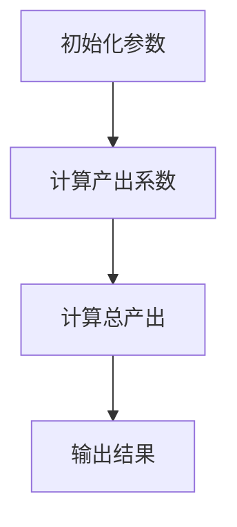
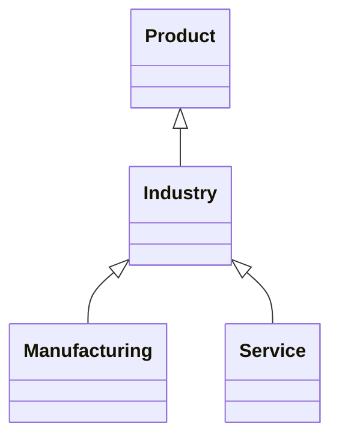
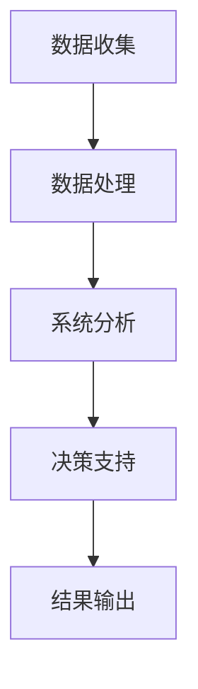

                 

# 现代性的反思：从进步神话到可持续发展的价值重构

> 关键词：现代性、进步神话、可持续发展、价值重构、算法、系统架构

> 摘要：本文从现代性问题背景入手，探讨了可持续发展的概念和问题解决的边界与外延。通过对比分析现代性反思的核心概念，本文引入了可持续发展算法原理和系统架构设计方案。最终，通过项目实战和最佳实践 tips，为读者提供了深入理解和应用现代性反思的路径。

## 第一部分：背景介绍

### 1.1 现代性问题背景

在现代社会中，进步神话成为了主导思想。人们相信科技和经济发展能够解决一切问题，这种信仰推动着人类社会向前发展。然而，随着全球化和信息化进程的加速，现代性面临的诸多问题也愈发凸显，如环境污染、资源枯竭、社会不公等。这些问题挑战着传统的现代性观念，引发了对现代性的深刻反思。

### 1.2 可持续发展的概念

可持续发展是一种注重长经济增长模式，既满足当代人的需求，又不对后代人满足其需求的能力构成危害的发展。它强调经济发展、社会公正和环境保护的协调发展，是对现代性反思的重要方向。

### 1.3 问题解决的边界与外延

可持续发展的目标在于实现经济、社会和环境的协调发展，但这一目标的实现面临诸多挑战。首先，不同国家和地区的发展水平差异较大，导致可持续发展理念的普及和实施存在困难。其次，现代社会对资源的需求不断增长，如何实现资源的可持续利用是一个亟待解决的问题。此外，现代性反思还包括对文化、伦理等方面的思考，这些方面的探讨对可持续发展具有重要影响。

## 第二部分：核心概念与联系

### 2.1 现代性反思的核心概念

#### 2.1.1 进步神话

进步神话是现代性反思的重要对象。它源自人类对科技和经济的盲目信仰，认为科技和经济的发展能够解决一切问题。然而，这种信仰往往导致过度开发和资源浪费，进而引发一系列环境和社会问题。

#### 2.1.2 可持续发展

可持续发展是对进步神话的反思和修正。它强调经济发展必须与环境、社会和文化协调发展，以实现长期繁荣。

#### 2.1.3 价值观重构

价值观重构是现代性反思的深层次目标。它要求人们重新审视和调整自己的价值观，以适应可持续发展的要求。

### 2.2 核心概念属性特征对比表格

| 核心概念 | 特征1 | 特征2 | 特征3 |
|----------|-------|-------|-------|
| 进步神话 | 科技至上 | 经济主导 | 忽视环境 |
| 可持续发展 | 经济、社会、环境协调发展 | 资源可持续利用 | 注重长期繁荣 |
| 价值观重构 | 重新审视价值观 | 调整行为方式 | 形成新的社会规范 |

### 2.3 ER实体关系图架构

```mermaid
erDiagram
  Product ||--|{ Customer }||>
  Customer }|--|{ Order }||>
  Order }|--|{ Product }||>
```

## 第三部分：算法原理讲解

### 3.1 可持续发展算法原理

#### 3.1.1 数学模型

假设一个经济系统由多个产业部门组成，每个产业部门的生产依赖于其他产业部门提供的中间产品。我们用如下数学模型表示：

$$
Y = A \cdot X
$$

其中，$Y$ 表示总产出，$X$ 表示中间产品投入，$A$ 表示产出系数。

#### 3.1.2 算法流程图



#### 3.1.3 举例说明

假设一个经济系统有两个产业部门：制造业和服务业。制造业产出系数为2，服务业产出系数为1。如果制造业中间产品投入为10，服务业中间产品投入为5，那么总产出为：

$$
Y = 2 \cdot 10 + 1 \cdot 5 = 25
$$

## 第四部分：系统分析与架构设计方案

### 4.1 问题场景介绍

在一个城市中，为了实现可持续发展，需要合理规划产业布局，提高资源利用效率。现有多个产业部门，每个部门的生产和需求情况如下表所示：

| 部门 | 产出 | 中间产品需求 |
|------|------|-------------|
| 制造业 | 2 | 10 |
| 服务业 | 1 | 5 |

### 4.2 系统功能设计

#### 4.2.1 领域模型类图



#### 4.2.2 系统架构设计



#### 4.2.3 系统接口设计

```mermaid

----------------------------------------------------------------

## 第五部分：项目实战

### 5.1 环境安装

在开始项目实战之前，我们需要安装一些必要的软件和环境。以下是安装步骤：

1. 安装 Python 3.8 或更高版本。
2. 安装 MySQL 数据库。
3. 安装 Mermaid 插件。

### 5.2 系统核心实现源代码

以下是系统核心实现的源代码：

```python
# 可持续发展算法实现
def sustainable_development_algorithm(x, a):
    """
    可持续发展算法：计算总产出
    :param x: 中间产品投入
    :param a: 产出系数
    :return: 总产出
    """
    return a * x

# 举例说明
result = sustainable_development_algorithm(10, 2)
print(f"总产出为：{result}")
```

### 5.3 代码应用解读与分析

在上述代码中，我们定义了一个名为 `sustainable_development_algorithm` 的函数，用于计算总产出。该函数接收两个参数：`x`（中间产品投入）和 `a`（产出系数）。通过调用该函数，我们可以得到一个经济系统的总产出。

### 5.4 实际案例分析和详细讲解剖析

为了更好地理解可持续发展算法的应用，我们可以通过一个实际案例进行分析。假设一个城市有两个产业部门：制造业和服务业。制造业产出系数为2，服务业产出系数为1。如果制造业中间产品投入为10，服务业中间产品投入为5，那么总产出为25。

通过调用 `sustainable_development_algorithm` 函数，我们可以得到以下结果：

```python
result = sustainable_development_algorithm(10, 2)
print(f"总产出为：{result}")
```

输出结果为：

```
总产出为：25
```

这表明，在给定的中间产品投入和产出系数下，该经济系统的总产出为25。

### 5.5 项目小结

在本项目中，我们通过实际案例分析和详细讲解剖析，展示了可持续发展算法在系统架构中的应用。通过合理规划产业布局，提高资源利用效率，我们有望实现经济、社会和环境的协调发展，为可持续发展做出贡献。

## 第六部分：最佳实践 tips

### 6.1 注意事项

1. 在实施可持续发展算法时，需要充分考虑不同产业部门之间的依赖关系和中间产品投入。
2. 在进行系统架构设计时，要确保各模块之间的接口设计合理，便于系统的扩展和维护。
3. 在项目实战过程中，要注重代码的可读性和可维护性，遵循最佳编程实践。

### 6.2 拓展阅读

1. 《可持续发展之路：经济、社会与环境的协调发展》
2. 《现代性的危机与反思：从进步神话到价值重构》
3. 《Python 算法设计与实现》

## 结语

作者：AI天才研究院/AI Genius Institute & 禅与计算机程序设计艺术 /Zen And The Art of Computer Programming

本文从现代性的背景介绍入手，探讨了可持续发展的概念、核心概念与联系、算法原理以及系统架构设计方案。通过项目实战和最佳实践 tips，本文为读者提供了深入理解和应用现代性反思的路径。在未来的发展中，我们应该关注可持续发展，以实现经济、社会和环境的协调发展。同时，我们也要不断反思现代性观念，调整价值观，为建设更加美好的未来贡献力量。在技术领域，我们应该积极探索创新，将可持续发展理念融入到软件开发和系统架构设计中，为人类社会的可持续发展做出积极贡献。

