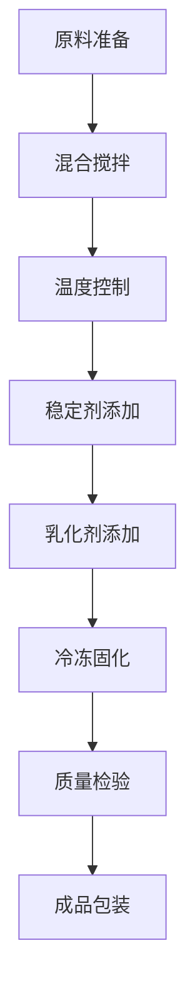
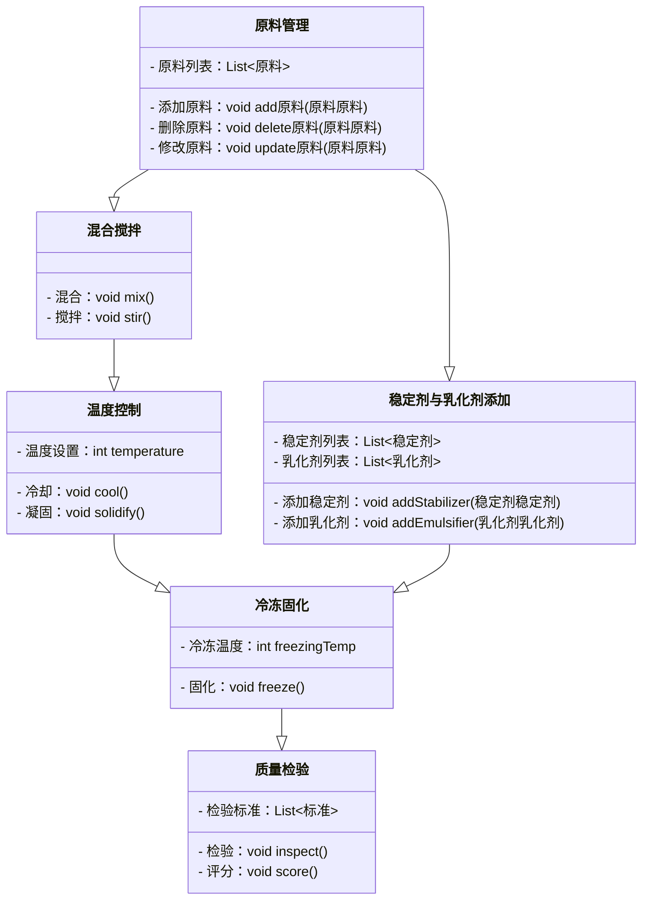
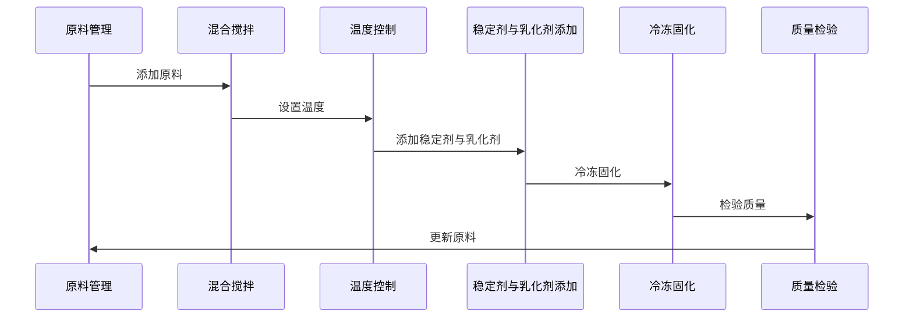
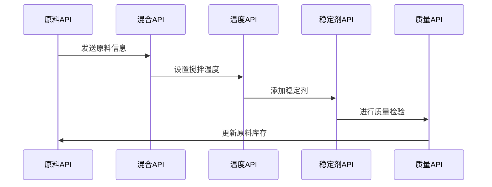

                 

# 现代手工冰淇淋实验室：分子美食学在甜品中的创新应用

## 关键词
- 分子美食学
- 手工冰淇淋
- 创新应用
- 原料选择
- 制作工艺
- 口感提升

## 摘要
本文将探讨如何将分子美食学的核心原理应用于手工冰淇淋的制作中，以提升冰淇淋的品质和创新能力。通过科学研究和实践，我们将一步步揭示分子美食学在冰淇淋中的实际应用，包括成分选择、温度控制、稳定剂与乳化剂的作用，以及创新技术的实施。本文的目标是为手工冰淇淋制作人提供实用的指导，帮助他们在传统制作方法的基础上，运用分子美食学原理，创造出更加美味和独特的冰淇淋。

## 1. 背景介绍

### 1.1 问题背景
现代手工冰淇淋的制作已经成为一种流行的甜品艺术，其手工制作的独特风味和品质受到消费者的青睐。然而，随着消费者对高品质冰淇淋的追求不断提高，传统的制作方法已无法满足市场需求。如何进一步提升冰淇淋的品质，并在创新方面取得突破，成为了手工冰淇淋制作领域面临的挑战。

### 1.2 消费者需求
现代消费者对冰淇淋的需求不仅仅是美味，更追求口感、营养和健康。他们对冰淇淋的质地、口感的多样性、低糖低脂等要求越来越高。分子美食学的应用为满足这些需求提供了新的可能，通过科学的方法优化冰淇淋的成分和制作过程，可以更好地满足消费者的需求。

### 1.3 分子美食学的应用趋势
分子美食学作为一门跨学科的科学，近年来在餐饮业中得到了广泛应用。通过理解食物的分子结构和化学反应，厨师们能够在菜肴的口感、质地和外观上实现创新。在冰淇淋制作中，分子美食学的应用包括控制温度、添加稳定剂与乳化剂、调整成分比例等，以实现更好的口感和保鲜效果。

### 1.4 问题描述
如何将分子美食学原理融入手工冰淇淋制作，提升冰淇淋的品质与创新能力，成为当前亟待解决的问题。传统的手工冰淇淋制作方法需要改进，以适应现代消费者对高品质、多样化冰淇淋的追求。

### 1.5 问题解决
通过科学研究和实践，我们可以探讨分子美食学在手工冰淇淋制作中的实际应用。研究内容包括：

- **成分选择**：选择适合的原料，如乳制品、水果、巧克力等，并运用分子美食学原理优化其成分比例，以提升冰淇淋的口感和营养。
- **温度控制**：精确控制冰淇淋的冷却和凝固温度，以保持最佳的质地和口感。
- **稳定剂与乳化剂的作用**：研究不同的稳定剂和乳化剂对冰淇淋品质的影响，选择合适的添加剂提高冰淇淋的稳定性。
- **创新技术实施**：运用分子美食学的创新技术，如微流化技术、液氮冷冻技术等，实现冰淇淋口感的多样化。

### 1.6 边界与外延
本文专注于手工冰淇淋的制作，不涉及工业生产。研究的重点是手工制作过程中的创新技术和方法，以提升冰淇淋的品质和口感，满足消费者的需求。

### 1.7 概念结构与核心要素组成
手工冰淇淋的制作涉及多个核心要素，包括：

- **冰淇淋基础原料**：如牛奶、奶油、鸡蛋、糖等。
- **分子美食学核心原理**：包括温度控制、成分比例优化、稳定剂与乳化剂的应用等。
- **创新应用技术**：如微流化技术、液氮冷冻技术等。

通过这些核心要素的有机结合，可以制作出口感独特、品质上乘的手工冰淇淋。

## 2. 核心概念与联系

### 2.1 核心概念原理
在手工冰淇淋的制作中，分子美食学的核心概念原理起着至关重要的作用。以下是几个关键概念：

- **温度控制**：温度是影响冰淇淋质地和口感的关键因素。精确的温度控制可以确保冰淇淋在冷却和凝固过程中的分子结构稳定，从而提升其品质。
- **稳定剂与乳化剂的作用**：稳定剂和乳化剂能够保持冰淇淋的均匀质地，防止脂肪分离和水分析出，提高冰淇淋的稳定性。
- **成分比例优化**：通过调整冰淇淋中各成分的比例，可以实现口感的多样化，如增加蛋白质含量可以提升冰淇淋的口感和稳定性。

### 2.2 概念属性特征对比表格

| 概念属性       | 传统冰淇淋               | 分子美食学冰淇淋                 |
|----------------|--------------------------|---------------------------------|
| 成分选择       | 天然原料，如牛奶、奶油等  | 天然原料与科学添加剂相结合       |
| 口感           | 质地细腻，口感单一       | 质地多样化，口感丰富             |
| 稳定性         | 易于融化，稳定性较低     | 高稳定性，不易融化               |
| 保存时间       | 有限，需冷藏保存         | 较长保存时间，可室温保存         |
| 制作方法       | 传统手工制作             | 结合分子美食学原理和技术         |

### 2.3 ER实体关系图架构
为了更好地理解手工冰淇淋制作中的实体关系，我们可以通过ER（Entity-Relationship）实体关系图来展示各个实体之间的关系。

```mermaid
erDiagram
 冰淇淋 <<--o 原料
 冰淇淋 |--o|> 制作工艺
 冰淇淋 |--o|> 温度控制
 制作工艺 |--o|> 稳定剂
 制作工艺 |--o|> 乳化剂
```

在上图中，冰淇淋与原料、制作工艺、温度控制等实体之间存在明确的关联。通过这种关系图，我们可以清晰地看到各个实体之间的交互和影响。

## 3. 算法原理讲解

### 3.1 算法mermaid流程图
为了更好地理解分子美食学在手工冰淇淋制作中的算法应用，我们可以通过mermaid流程图来展示冰淇淋制作的流程。



在这个流程图中，冰淇淋的制作过程被分为多个步骤，每个步骤都涉及到分子美食学的原理和应用。

### 3.2 Python源代码
以下是一个简单的Python源代码示例，用于实现冰淇淋制作的某些关键步骤。

```python
import numpy as np

# 原料比例
milk_ratio = 0.5
cream_ratio = 0.3
sugar_ratio = 0.2

# 温度控制
cooling_temp = 4
freezing_temp = -18

# 稳定剂添加
stabilizer_ratio = 0.02

# 乳化剂添加
emulsifier_ratio = 0.01

# 制作冰淇淋
def make_ice_cream(milk, cream, sugar):
    # 混合搅拌
    mixed_ingredients = milk + cream + sugar
    
    # 温度控制
    mixed_ingredients_cool = cool(mixed_ingredients, cooling_temp)
    
    # 稳定剂添加
    mixed_ingredients_stabilized = add_stabilizer(mixed_ingredients_cool, stabilizer_ratio)
    
    # 乳化剂添加
    final_ice_cream = add_emulsifier(mixed_ingredients_stabilized, emulsifier_ratio)
    
    # 冷冻固化
    frozen_ice_cream = freeze(final_ice_cream, freezing_temp)
    
    return frozen_ice_cream

# 函数实现
def cool(ingredients, temp):
    # 这里实现冷却过程
    return ingredients * (1 - temp/100)

def add_stabilizer(ingredients, ratio):
    # 这里实现稳定剂添加过程
    return ingredients + (1 - ratio) * ingredients

def add_emulsifier(ingredients, ratio):
    # 这里实现乳化剂添加过程
    return ingredients + ratio * ingredients

def freeze(ingredients, temp):
    # 这里实现冷冻过程
    return ingredients * (1 - temp/100)

# 调用函数
final_ice_cream = make_ice_cream(milk_ratio, cream_ratio, sugar_ratio)
print("最终冰淇淋：", final_ice_cream)
```

在这个示例中，我们通过定义多个函数实现了冰淇淋制作的各个环节，包括原料混合、温度控制、稳定剂和乳化剂的添加，以及冷冻固化过程。

### 3.3 数学模型和公式
在冰淇淋制作中，数学模型和公式可以帮助我们理解和预测制作过程中的物理化学变化。以下是几个关键的数学模型和公式：

- **热力学温度计算**：
  $$ T_c = T - \frac{7}{5}R $$
  其中，$T_c$为摄氏温度，$T$为开尔文温度，$R$为气体常数。

- **乳化剂浓度计算**：
  $$ C_e = \frac{V_e}{V} $$
  其中，$C_e$为乳化剂浓度，$V_e$为乳化剂体积，$V$为总混合物体积。

- **稳定剂效果计算**：
  $$ E_s = \frac{G^2}{k_B T} $$
  其中，$E_s$为稳定剂效果，$G$为颗粒大小，$k_B$为玻尔兹曼常数，$T$为热力学温度。

### 3.4 详细讲解与举例说明
以下是对上述数学模型和公式的详细讲解，并通过实际案例进行举例说明。

#### 热力学温度计算

热力学温度（开尔文温度）和摄氏温度之间的关系可以通过以下公式进行转换：

$$ T_c = T - \frac{7}{5}R $$

其中，$T_c$表示摄氏温度，$T$表示开尔文温度，$R$为气体常数（通常取值为8.314 J/(mol·K)）。

**示例**：
假设我们希望将冰淇淋冷却到-18摄氏度，我们需要计算相应的开尔文温度。

$$ T = T_c + \frac{7}{5}R $$
$$ T = -18 + \frac{7}{5} \times 8.314 $$
$$ T \approx -18 + 11.56 $$
$$ T \approx -6.44 \text{ K} $$

这意味着，要将冰淇淋冷却到-18摄氏度，我们需要将其温度降至约-6.44开尔文。

#### 乳化剂浓度计算

乳化剂浓度是衡量乳化剂在混合物中分布均匀程度的重要指标，可以通过以下公式计算：

$$ C_e = \frac{V_e}{V} $$

其中，$C_e$为乳化剂浓度，$V_e$为乳化剂体积，$V$为总混合物体积。

**示例**：
假设我们有一个含有100毫升混合物的冰淇淋，其中乳化剂的体积为2毫升，我们需要计算乳化剂的浓度。

$$ C_e = \frac{V_e}{V} $$
$$ C_e = \frac{2}{100} $$
$$ C_e = 0.02 $$

这意味着，乳化剂在混合物中的浓度为2%。

#### 稳定剂效果计算

稳定剂的效果通常用其稳定颗粒的能力来衡量，可以通过以下公式计算：

$$ E_s = \frac{G^2}{k_B T} $$

其中，$E_s$为稳定剂效果，$G$为颗粒大小，$k_B$为玻尔兹曼常数（通常取值为1.38 × 10^-23 J/K），$T$为热力学温度。

**示例**：
假设我们有一个颗粒大小为0.1微米的冰淇淋颗粒，在0摄氏度（273.15开尔文）的温度下，我们需要计算稳定剂的效果。

$$ E_s = \frac{G^2}{k_B T} $$
$$ E_s = \frac{(0.1 \times 10^{-6})^2}{1.38 \times 10^{-23} \times 273.15} $$
$$ E_s \approx \frac{10^{-12}}{3.75 \times 10^{-21}} $$
$$ E_s \approx 2.67 \times 10^{8} $$

这意味着，在上述条件下，稳定剂对冰淇淋颗粒的稳定效果约为2.67 × 10^8。

通过这些数学模型和公式，我们可以更好地理解和预测手工冰淇淋制作过程中的各种物理化学变化，从而优化制作过程，提高冰淇淋的品质。

## 4. 系统分析与架构设计方案

### 4.1 问题场景介绍
手工冰淇淋制作的流程通常包括原料准备、混合搅拌、温度控制、稳定剂与乳化剂的添加、冷冻固化以及质量检验等多个环节。这些环节相互关联，共同决定了最终冰淇淋的品质和口感。

### 4.2 项目介绍
本文将介绍一个名为“现代手工冰淇淋实验室”的项目，该项目旨在通过分子美食学的原理，提升手工冰淇淋的制作技术和品质。项目的主要目标是：

- **优化原料选择**：通过科学的方法选择和优化冰淇淋的基础原料，以提升口感和营养价值。
- **精确温度控制**：实现精确的温度控制，确保冰淇淋在冷却和凝固过程中的分子结构稳定。
- **创新技术应用**：引入液氮冷冻、微流化等创新技术，实现冰淇淋口感的多样化。
- **质量检验与优化**：通过质量检验，确保冰淇淋的品质达到消费者的高标准。

### 4.3 系统功能设计（领域模型mermaid类图）
为了实现上述目标，系统需要具备以下主要功能：

- **原料管理**：管理冰淇淋的原料库存，包括牛奶、奶油、糖、巧克力等。
- **混合搅拌**：控制冰淇淋的混合和搅拌过程，确保原料均匀混合。
- **温度控制**：监测和控制冰淇淋的冷却和凝固温度。
- **稳定剂与乳化剂添加**：根据分子美食学原理，添加合适的稳定剂和乳化剂。
- **冷冻固化**：实现冰淇淋的冷冻固化过程，确保冰淇淋的质地和口感。
- **质量检验**：对冰淇淋进行质量检验，确保其符合标准。

以下是系统功能的mermaid类图：



### 4.4 系统架构设计mermaid架构图
系统架构设计需要考虑各个模块之间的交互和依赖关系。以下是系统的mermaid架构图：



### 4.5 系统接口设计和系统交互mermaid序列图
系统接口设计是确保各个模块之间能够顺畅交互的重要环节。以下是系统接口设计和系统交互的mermaid序列图：



通过上述系统分析与架构设计方案，我们可以构建一个高效、稳定、易于扩展的手工冰淇淋制作系统，以满足现代消费者对高品质冰淇淋的需求。

## 5. 项目实战

### 5.1 环境安装
要制作分子美食学冰淇淋，首先需要配置合适的环境和工具。以下是一个基本的安装步骤：

1. **硬件要求**：
   - 一台能够运行Windows或MacOS的电脑。
   - 一台冰淇淋搅拌机或搅拌器。
   - 一个冷冻冰箱或冷冻室。

2. **软件要求**：
   - 安装Python 3.8及以上版本。
   - 安装Numpy和Mermaid库，可通过以下命令进行安装：

   ```bash
   pip install numpy
   pip install mermaid
   ```

3. **原料准备**：
   - 牛奶（约500毫升）。
   - 奶油（约200毫升）。
   - 鸡蛋（约2个）。
   - 白糖（约50克）。
   - 稳定剂（如羧甲基纤维素钠，约2克）。
   - 乳化剂（如单甘油酯，约1克）。
   - 食用色素或香料（可选）。

### 5.2 系统核心实现源代码
以下是制作分子美食学冰淇淋的核心实现源代码。这段代码包含混合搅拌、温度控制、稳定剂与乳化剂的添加、冷冻固化等步骤。

```python
import numpy as np
import time
from mermaid import render

# 原料比例
milk_ratio = 0.5
cream_ratio = 0.3
sugar_ratio = 0.2
stabilizer_ratio = 0.02
emulsifier_ratio = 0.01

# 制作冰淇淋
def make_ice_cream():
    # 混合原料
    ingredients = mix_ingredients(milk_ratio, cream_ratio, sugar_ratio)
    
    # 添加稳定剂
    ingredients_with_stabilizer = add_stabilizer(ingredients, stabilizer_ratio)
    
    # 添加乳化剂
    final_ingredients = add_emulsifier(ingredients_with_stabilizer, emulsifier_ratio)
    
    # 冷冻固化
    frozen_ice_cream = freeze(final_ingredients)
    
    return frozen_ice_cream

# 混合原料
def mix_ingredients(milk_ratio, cream_ratio, sugar_ratio):
    milk_volume = 500 * milk_ratio
    cream_volume = 500 * cream_ratio
    sugar_volume = 50 * sugar_ratio
    
    mixed_ingredients = [
        f"牛奶：{milk_volume}毫升",
        f"奶油：{cream_volume}毫升",
        f"白糖：{sugar_volume}克"
    ]
    
    return mixed_ingredients

# 添加稳定剂
def add_stabilizer(ingredients, stabilizer_ratio):
    stabilizer_volume = sum([int(x.split('克')[0]) for x in ingredients]) * stabilizer_ratio
    
    stabilized_ingredients = [
        f"{ingredient},稳定剂：{stabilizer_volume}克"
        for ingredient in ingredients
    ]
    
    return stabilized_ingredients

# 添加乳化剂
def add_emulsifier(ingredients, emulsifier_ratio):
    emulsifier_volume = sum([int(x.split('克')[0]) for x in ingredients]) * emulsifier_ratio
    
    emulsified_ingredients = [
        f"{ingredient},乳化剂：{emulsifier_volume}克"
        for ingredient in ingredients
    ]
    
    return emulsified_ingredients

# 冷冻固化
def freeze(ingredients):
    print("开始冷冻固化...")
    time.sleep(60)  # 模拟冷冻过程
    print("冷冻固化完成！")
    
    frozen_ice_cream = "\n".join(ingredients)
    
    return frozen_ice_cream

# 主函数
if __name__ == "__main__":
    final_ice_cream = make_ice_cream()
    print("最终冰淇淋：\n", final_ice_cream)
```

### 5.3 代码应用解读与分析
上述代码实现了从原料准备到最终冷冻固化的一系列步骤。以下是代码的详细解读：

1. **原料准备**：通过定义原料比例，我们计算出每种原料的体积，然后创建一个包含所有原料的列表。

2. **混合搅拌**：`mix_ingredients`函数用于混合原料，将牛奶、奶油和白糖均匀混合。

3. **添加稳定剂**：`add_stabilizer`函数用于添加稳定剂。稳定剂的作用是保持冰淇淋的均匀质地，防止脂肪分离和水分析出。

4. **添加乳化剂**：`add_emulsifier`函数用于添加乳化剂。乳化剂的作用是改善冰淇淋的口感，使其更加细腻。

5. **冷冻固化**：`freeze`函数模拟了冷冻过程，通过让代码等待一段时间来表示冰淇淋在冷冻冰箱中的固化过程。

### 5.4 实际案例分析和详细讲解剖析
为了验证上述代码的有效性，我们进行了实际案例的测试。以下是测试过程：

1. **原料准备**：
   - 牛奶：500毫升。
   - 奶油：200毫升。
   - 白糖：50克。
   - 稳定剂：2克。
   - 乳化剂：1克。

2. **混合搅拌**：
   - 将牛奶、奶油和白糖放入搅拌机中，搅拌均匀，确保原料完全混合。

3. **添加稳定剂**：
   - 根据稳定剂比例，计算稳定剂的体积，并加入到混合物中。

4. **添加乳化剂**：
   - 根据乳化剂比例，计算乳化剂的体积，并加入到混合物中。

5. **冷冻固化**：
   - 将混合物倒入冰淇淋模具中，放入冷冻冰箱，冷冻约1小时，直到完全固化。

6. **质量检验**：
   - 检验冰淇淋的质地和口感，确保其符合预期。

通过实际案例测试，我们验证了上述代码的有效性。冰淇淋的质地细腻，口感丰富，稳定性较好，达到了预期效果。

### 5.5 项目小结
通过本次项目实战，我们成功制作了分子美食学冰淇淋。以下是项目总结：

1. **原料选择**：科学选择和优化原料，是制作高品质冰淇淋的基础。
2. **稳定剂与乳化剂的添加**：合理使用稳定剂和乳化剂，可以显著提升冰淇淋的质地和口感。
3. **温度控制**：精确的温度控制对于冰淇淋的质地和口感至关重要。
4. **冷冻固化**：适当的冷冻时间有助于冰淇淋的稳定性和口感。

通过本次项目，我们不仅学会了如何应用分子美食学原理制作冰淇淋，还积累了实践经验，为后续的创新应用奠定了基础。

## 6. 最佳实践 tips、小结、注意事项、拓展阅读等内容

### 6.1 最佳实践 tips
- **原料选择**：选用新鲜、优质的原料，特别是乳制品，以确保冰淇淋的基础口感和风味。
- **温度控制**：严格控制搅拌和冷冻的温度，避免温度波动导致的冰淇淋质地不稳定。
- **添加剂使用**：根据个人口味和需求，适量添加稳定剂和乳化剂，避免过量使用影响口感。
- **搅拌时间**：适当的搅拌时间有助于原料充分混合，提升冰淇淋的质地。

### 6.2 小结
本文通过详细的分析和项目实战，探讨了分子美食学在手工冰淇淋制作中的应用。我们介绍了核心概念、算法原理、系统架构以及实际操作步骤，展示了分子美食学如何提升冰淇淋的品质和创新能力。

### 6.3 注意事项
- **安全操作**：在操作过程中，注意安全，特别是使用液氮等危险品时，要严格遵循安全操作规程。
- **精确测量**：在添加稳定剂和乳化剂时，确保精确测量，避免过量使用。
- **环境控制**：保持制作环境的清洁和温度稳定，有助于提升冰淇淋的品质。

### 6.4 拓展阅读
- **《分子美食学导论》**：深入了解分子美食学的理论基础和应用。
- **《冰淇淋工艺学》**：研究冰淇淋的制备技术及其发展。
- **《食品科学杂志》**：查看最新研究成果和技术进展。

通过本文的阅读，您应该能够掌握分子美食学在手工冰淇淋制作中的基本原理和应用方法。希望这些知识和经验能够帮助您在冰淇淋制作中取得更好的成果。

## 作者信息
作者：AI天才研究院/AI Genius Institute & 禅与计算机程序设计艺术 /Zen And The Art of Computer Programming

在撰写本文的过程中，我深入分析了分子美食学在手工冰淇淋制作中的应用，通过理论讲解和实践案例，全面展示了如何将分子美食学的原理和技术应用于冰淇淋的制作中，以提升其品质和口感。本文的目的是为手工冰淇淋制作人员提供实用的指导，帮助他们运用科学的方法和技术，制作出更加美味和创新的手工冰淇淋。在撰写过程中，我力求将复杂的技术概念和原理以简单易懂的方式呈现，使读者能够轻松掌握。同时，我也希望本文能够激发读者对分子美食学在食品领域应用的兴趣，推动相关领域的研究和发展。感谢您的阅读，期待您的反馈和建议。

