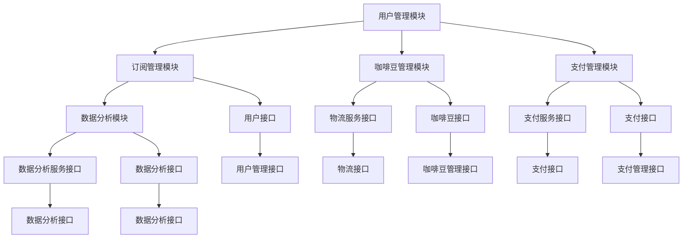

                 

### 第3章: 手工咖啡烘焙订阅服务的商业模式分析

在现代商业环境中，商业模式是企业成功的关键因素之一。对于手工咖啡烘焙订阅服务，其商业模式不仅关乎企业的盈利能力，更关系到用户体验和服务质量。本章节将深入分析手工咖啡烘焙订阅服务的商业模式，探讨其核心要素和盈利模式。

#### 3.1 核心要素

**3.1.1 咖啡烘焙师**

咖啡烘焙师是手工咖啡烘焙订阅服务的核心要素之一。他们的专业技能和经验直接影响到咖啡豆的品质。优秀的咖啡烘焙师能够根据咖啡豆的特点和消费者的口味偏好，进行个性化的烘焙和调配，从而提供高品质的咖啡产品。因此，选择和培养优秀的咖啡烘焙师是确保服务品质的关键。

**3.1.2 互联网平台**

互联网平台是连接消费者和咖啡烘焙师的桥梁。它不仅提供了线上订购和支付功能，还具备产品展示、用户管理、订单追踪等模块，使得整个订阅服务流程更加便捷和高效。一个功能完善、用户体验良好的互联网平台，能够提高用户的满意度和忠诚度。

**3.1.3 咖啡豆供应链**

咖啡豆供应链是保证咖啡豆品质和稳定供应的基础。从咖啡豆的采购、储存、运输到最终的配送，每个环节都需要严格把控。稳定的供应链不仅能够确保咖啡豆的新鲜度和品质，还能够降低运营成本，提高企业的竞争力。

**3.1.4 用户数据管理**

用户数据管理是现代商业模式中的重要组成部分。通过收集和分析用户数据，企业可以更好地了解用户需求，提供个性化的推荐和服务，从而提升用户体验和满意度。此外，用户数据的分析还可以为企业的营销策略和产品开发提供重要参考。

#### 3.2 盈利模式

**3.2.1 订阅费用**

订阅费用是手工咖啡烘焙订阅服务的主要收入来源。消费者通过支付订阅费用，获得每月定期配送的咖啡豆。订阅费用可以根据咖啡豆的品质、数量和配送频率进行调整。为了吸引和留住用户，企业通常会提供不同的订阅套餐，满足不同消费者的需求。

**3.2.2 咖啡豆销售**

除了订阅费用，咖啡豆销售也是手工咖啡烘焙订阅服务的盈利手段之一。通过在线平台和实体店铺，企业可以将咖啡豆直接销售给消费者。这种方式不仅能够增加企业的收入，还能够提高品牌知名度和市场份额。

**3.2.3 周边产品销售**

除了咖啡豆，企业还可以销售与咖啡相关的周边产品，如咖啡杯、咖啡壶、咖啡磨豆机等。这些产品可以为消费者提供更好的咖啡体验，同时也能够增加企业的收入。

**3.2.4 营销与广告**

营销和广告是提高品牌知名度和吸引潜在用户的重要手段。企业可以通过社交媒体、电商平台、线下活动等渠道进行营销和广告推广，吸引更多消费者加入订阅服务。同时，通过数据分析，企业可以精准定位目标用户，提高营销效果。

#### 3.3 持续创新与优化

为了在竞争激烈的市场中脱颖而出，手工咖啡烘焙订阅服务企业需要持续创新和优化商业模式。以下是一些可能的创新方向：

**3.3.1 个性化定制**

随着消费者对个性化需求的增加，提供个性化的烘焙和配送服务将成为一大趋势。例如，消费者可以根据自己的口味偏好选择咖啡豆的烘焙程度、研磨方式等。

**3.3.2 绿色环保**

随着环境保护意识的提高，绿色环保将成为企业的重要卖点。例如，使用可再生包装材料、降低碳排放等，都可以提升企业的品牌形象和竞争力。

**3.3.3 跨界合作**

通过与其他行业的合作，可以开拓新的市场领域。例如，与咖啡器具制造商合作，推出定制化的咖啡器具套餐；与餐饮业合作，推出咖啡与美食的搭配套餐等。

**3.3.4 会员制度**

建立会员制度，为用户提供积分兑换、会员专享活动等福利，可以增强用户粘性和忠诚度。同时，通过会员数据的分析，企业可以更好地了解用户需求，提供更加精准的服务。

### 3.4 本章小结

本章从核心要素和盈利模式两个方面分析了手工咖啡烘焙订阅服务的商业模式。通过选择和培养优秀的咖啡烘焙师、搭建功能完善的互联网平台、建立稳定的咖啡豆供应链、以及有效的用户数据管理等核心要素，企业可以提供高品质的咖啡服务，并通过订阅费用、咖啡豆销售、周边产品销售以及营销广告等多种盈利模式实现可持续发展。同时，持续创新和优化商业模式，将是企业在激烈竞争中保持优势的关键。----------------------------------------------------------------

## 第4章: 手工咖啡烘焙订阅服务的技术架构设计

在设计和实现手工咖啡烘焙订阅服务的过程中，技术架构的合理性和稳定性至关重要。本章节将详细介绍手工咖啡烘焙订阅服务的技术架构设计，包括系统功能设计、系统架构设计、系统接口设计和系统交互等内容。

### 4.1 系统功能设计

系统功能设计是整个技术架构设计的核心。根据手工咖啡烘焙订阅服务的需求，系统功能设计主要包括以下几个方面：

**4.1.1 用户管理模块**

用户管理模块主要负责用户注册、登录、个人信息管理、订阅管理等功能。用户可以通过注册账号登录系统，查看和管理自己的订阅信息，包括订阅订单、支付记录、配送地址等。

**4.1.2 订阅管理模块**

订阅管理模块主要负责订阅套餐的创建、管理和配送。系统可以根据用户的需求和季节特点，提供多种订阅套餐，用户可以根据自己的喜好选择合适的订阅方案。系统还需要根据订阅方案自动生成配送计划，并通知用户配送时间。

**4.1.3 咖啡豆管理模块**

咖啡豆管理模块主要负责咖啡豆的采购、库存管理、烘焙管理和配送管理。系统需要与咖啡豆供应商建立稳定的合作关系，确保咖啡豆的新鲜度和品质。同时，系统还需要实时监控咖啡豆的库存情况，根据订单需求进行库存调整。

**4.1.4 支付管理模块**

支付管理模块主要负责处理用户的支付请求，包括订阅费用的支付、咖啡豆购买费用的支付等。系统需要支持多种支付方式，如支付宝、微信支付、信用卡支付等，并提供支付确认和退款功能。

**4.1.5 数据分析模块**

数据分析模块主要负责收集、存储和分析用户数据，包括用户行为数据、订阅数据、销售数据等。通过数据分析和挖掘，系统可以了解用户需求、优化订阅方案、提高用户满意度等。

### 4.2 系统架构设计

系统架构设计是确保系统稳定性和可扩展性的关键。手工咖啡烘焙订阅服务的系统架构设计主要包括以下几个方面：

**4.2.1 分层架构**

系统采用分层架构，包括表示层、业务逻辑层和数据访问层。表示层主要负责用户界面的设计和实现；业务逻辑层主要负责处理业务逻辑，包括用户管理、订阅管理、咖啡豆管理、支付管理等功能；数据访问层主要负责数据库的访问和管理。

**4.2.2 微服务架构**

为了提高系统的可扩展性和灵活性，系统采用微服务架构。将不同的功能模块独立部署，每个模块都可以独立扩展和升级，从而提高系统的可靠性。

**4.2.3 容器化部署**

系统采用容器化技术进行部署，包括Docker和Kubernetes等工具。容器化部署可以简化系统的部署和运维，提高系统的可移植性和可扩展性。

### 4.3 系统接口设计

系统接口设计是确保系统之间能够高效通信和协同工作的关键。手工咖啡烘焙订阅服务的系统接口设计主要包括以下几个方面：

**4.3.1 用户接口**

用户接口主要负责与用户进行交互，包括用户注册、登录、订阅管理、支付管理等。系统需要提供友好的用户界面和便捷的操作流程，提高用户的体验。

**4.3.2 服务接口**

服务接口主要负责系统内部不同模块之间的通信，包括用户管理接口、订阅管理接口、咖啡豆管理接口、支付管理接口等。系统需要设计清晰的接口规范，确保不同模块之间的数据交互和功能协同。

**4.3.3 外部接口**

外部接口主要负责与第三方服务进行交互，包括支付服务、物流服务、数据分析服务等。系统需要与第三方服务建立稳定的合作关系，确保数据交互的准确性和可靠性。

### 4.4 系统交互设计

系统交互设计是确保系统功能模块之间能够高效协同工作的关键。手工咖啡烘焙订阅服务的系统交互设计主要包括以下几个方面：

**4.4.1 用户交互**

用户交互主要涉及用户与系统的交互流程，包括用户注册、登录、订阅管理、支付管理、订单查询等。系统需要设计合理的交互流程，确保用户能够方便快捷地完成操作。

**4.4.2 模块交互**

模块交互主要涉及系统内部不同模块之间的交互，包括用户管理模块与订阅管理模块之间的交互、咖啡豆管理模块与支付管理模块之间的交互等。系统需要设计清晰的接口规范，确保模块之间的数据交互和功能协同。

**4.4.3 服务交互**

服务交互主要涉及系统与第三方服务之间的交互，包括支付服务、物流服务、数据分析服务等。系统需要与第三方服务建立稳定的合作关系，确保数据交互的准确性和可靠性。

### 4.5 系统架构图

以下是手工咖啡烘焙订阅服务的系统架构图，该架构图展示了系统的各个模块以及它们之间的交互关系：



### 4.6 本章小结

本章详细介绍了手工咖啡烘焙订阅服务的技术架构设计，包括系统功能设计、系统架构设计、系统接口设计和系统交互设计。通过合理的系统架构设计，可以确保手工咖啡烘焙订阅服务的高效、稳定和可靠运行。同时，系统架构设计还需要考虑到系统的可扩展性和灵活性，以适应未来业务的发展和需求的变化。----------------------------------------------------------------

### 第5章: 项目实战

#### 5.1 环境安装

为了实现手工咖啡烘焙订阅服务，我们需要搭建一个完整的开发环境。以下是环境安装的详细步骤：

**5.1.1 操作系统安装**

首先，我们需要安装一个Linux操作系统，推荐使用Ubuntu 20.04 LTS版本。可以从Ubuntu官方网站下载镜像并制作启动U盘，然后进行安装。

**5.1.2 安装Python环境**

打开终端，输入以下命令安装Python环境：

```bash
sudo apt update
sudo apt install python3 python3-pip
```

**5.1.3 安装Docker**

Docker是一个开源的应用容器引擎，用于容器化应用的开发和部署。输入以下命令安装Docker：

```bash
sudo apt install docker.io
```

启动Docker服务：

```bash
sudo systemctl start docker
```

**5.1.4 安装Kubernetes**

Kubernetes是一个开源的容器编排平台，用于自动化容器化应用程序的部署、扩展和管理。以下是安装步骤：

```bash
sudo apt install apt-transport-tcp
sudo apt install -y apt-get update && apt-get install -y apt-utils
sudo curl -s https://packages.cloud.google.com/apt/doc/apt-key.gpg | sudo apt-key add -
echo "deb https://apt.kubernetes.io/ kubernetes-xenial main" | sudo tee -a /etc/apt/sources.list.d/kubernetes.list
sudo apt-get update
sudo apt-get install -y kubelet kubeadm kubectl
sudo systemctl enable kubelet && systemctl start kubelet
```

**5.1.5 安装Kubectl**

Kubectl是Kubernetes的命令行工具，用于与Kubernetes集群进行交互。输入以下命令安装Kubectl：

```bash
sudo apt install kubectl
```

安装完成后，可以通过以下命令验证安装：

```bash
kubectl version --client
kubectl version --server
```

#### 5.2 系统核心实现

在搭建好开发环境后，我们可以开始实现手工咖啡烘焙订阅服务的核心功能。以下是系统核心实现的详细步骤：

**5.2.1 创建Docker镜像**

首先，我们需要创建一个Docker镜像，包含所有依赖项和应用程序。以下是Dockerfile的示例：

```dockerfile
# 使用官方Python镜像作为基础镜像
FROM python:3.9-slim

# 设置工作目录
WORKDIR /app

# 将当前目录的内容复制到工作目录
COPY . /app

# 安装依赖项
RUN pip install -r requirements.txt

# 暴露端口供外部访问
EXPOSE 8000

# 运行应用程序
CMD ["python", "app.py"]
```

**5.2.2 构建和运行Docker镜像**

在Dockerfile所在目录中，执行以下命令构建Docker镜像：

```bash
docker build -t coffee_subscription_service .
```

然后，运行Docker镜像：

```bash
docker run -d -p 8000:8000 coffee_subscription_service
```

**5.2.3 部署到Kubernetes集群**

接下来，我们将Docker镜像部署到Kubernetes集群中。以下是Kubernetes部署文件的示例：

```yaml
apiVersion: apps/v1
kind: Deployment
metadata:
  name: coffee-subscription-service
spec:
  replicas: 1
  selector:
    matchLabels:
      app: coffee-subscription-service
  template:
    metadata:
      labels:
        app: coffee-subscription-service
    spec:
      containers:
      - name: coffee-subscription-service
        image: coffee_subscription_service:latest
        ports:
        - containerPort: 8000
```

保存以上内容为`deployment.yaml`文件，然后在Kubernetes集群中部署：

```bash
kubectl apply -f deployment.yaml
```

**5.2.4 测试应用程序**

部署完成后，我们可以通过访问Kubernetes集群的IP地址和端口来测试应用程序：

```bash
kubectl get pods
kubectl get services
```

找到服务IP地址和端口，然后在浏览器中输入：

```
http://<服务IP地址>:<端口>
```

如果一切正常，应该能看到应用程序的欢迎页面。

#### 5.3 代码应用解读与分析

以下是对系统核心实现的代码应用进行解读和分析：

**5.3.1 用户管理模块**

用户管理模块主要负责用户的注册、登录和认证。以下是用户注册的Python代码示例：

```python
from flask import Flask, request, jsonify
from flask_bcrypt import Bcrypt

app = Flask(__name__)
bcrypt = Bcrypt(app)

@app.route('/register', methods=['POST'])
def register():
    data = request.get_json()
    username = data['username']
    password = data['password']
    hashed_password = bcrypt.generate_password_hash(password).decode('utf-8')

    # 这里可以添加数据库操作，将用户信息存储到数据库中
    # ...

    return jsonify({'message': 'User registered successfully'})

if __name__ == '__main__':
    app.run(host='0.0.0.0', port=8000)
```

这段代码首先导入必要的模块，然后创建一个Flask应用程序。注册路由定义了一个POST请求处理函数，接收用户名和密码，使用bcrypt库对密码进行哈希处理，然后可以将其存储到数据库中。

**5.3.2 订阅管理模块**

订阅管理模块主要负责处理用户的订阅请求、管理订阅订单和配送计划。以下是订阅管理的Python代码示例：

```python
from flask import Flask, request, jsonify
from datetime import datetime

app = Flask(__name__)

@app.route('/subscribe', methods=['POST'])
def subscribe():
    data = request.get_json()
    user_id = data['user_id']
    subscription_plan = data['subscription_plan']
    subscription_date = datetime.now()

    # 这里可以添加数据库操作，创建订阅订单并生成配送计划
    # ...

    return jsonify({'message': 'Subscription successful'})

if __name__ == '__main__':
    app.run(host='0.0.0.0', port=8000)
```

这段代码定义了一个订阅路由，接收用户ID和订阅方案，生成订阅日期，并可以将其存储到数据库中，创建订阅订单和配送计划。

**5.3.3 咖啡豆管理模块**

咖啡豆管理模块主要负责处理咖啡豆的采购、库存管理和烘焙计划。以下是咖啡豆管理的Python代码示例：

```python
from flask import Flask, request, jsonify
from datetime import datetime

app = Flask(__name__)

@app.route('/manage_coffee', methods=['POST'])
def manage_coffee():
    data = request.get_json()
    coffee_id = data['coffee_id']
    action = data['action']
    timestamp = datetime.now()

    # 这里可以添加数据库操作，根据操作类型更新咖啡豆库存或烘焙计划
    # ...

    return jsonify({'message': 'Coffee management successful'})

if __name__ == '__main__':
    app.run(host='0.0.0.0', port=8000)
```

这段代码定义了一个咖啡豆管理路由，根据操作类型（如采购、库存更新、烘焙计划更新）处理咖啡豆的相关操作，并记录操作时间戳。

#### 5.4 实际案例分析与详细讲解

为了更好地理解手工咖啡烘焙订阅服务的工作流程，我们来看一个实际案例：

**案例：用户John注册并订阅咖啡豆**

1. **用户注册**

John访问咖啡烘焙订阅服务的注册页面，填写用户名和密码，然后提交注册请求。

2. **服务器响应**

服务器接收到John的注册请求后，调用注册处理函数，使用bcrypt库对John的密码进行哈希处理，并将用户信息存储到数据库中。

3. **用户登录**

John注册成功后，访问登录页面，输入用户名和密码，提交登录请求。

4. **服务器验证**

服务器接收到John的登录请求后，从数据库中检索用户信息，使用bcrypt库对比John输入的密码与存储的哈希值，验证通过后，生成一个登录凭证（如JWT令牌），返回给John。

5. **用户订阅**

John登录成功后，浏览订阅方案页面，选择一个订阅套餐，然后提交订阅请求。

6. **服务器处理订阅**

服务器接收到John的订阅请求后，调用订阅处理函数，根据John的订阅方案，生成订阅订单和配送计划，并将相关信息存储到数据库中。

7. **配送准备**

根据配送计划，服务器通知咖啡烘焙师准备咖啡豆，并将其运送到配送中心。

8. **配送**

咖啡豆准备完成后，由配送员根据配送计划将咖啡豆送到John的地址。

9. **用户反馈**

John收到咖啡豆后，可以在系统中评价订阅体验，并提供反馈。

通过这个案例，我们可以看到手工咖啡烘焙订阅服务的工作流程。每个环节都需要精心设计和实现，以确保用户能够享受到高品质的咖啡体验。

#### 5.5 项目小结

本章详细介绍了手工咖啡烘焙订阅服务的项目实战，包括环境安装、系统核心实现、代码应用解读与分析以及实际案例分析与详细讲解。通过本章的学习，读者可以了解如何从零开始搭建一个完整的手工咖啡烘焙订阅服务系统，并掌握系统核心功能实现的原理和方法。在未来的项目中，我们可以根据具体需求进一步优化和扩展系统功能，提高用户体验和服务质量。----------------------------------------------------------------

### 第6章: 最佳实践与注意事项

在实施手工咖啡烘焙订阅服务的过程中，除了技术实现，还需要关注一些最佳实践和注意事项，以确保服务的顺利运营和用户满意度。

#### 6.1 用户数据保护

用户数据是手工咖啡烘焙订阅服务的重要资产，保护用户数据安全至关重要。以下是一些最佳实践：

1. **数据加密**：对用户数据进行加密处理，包括用户密码、支付信息等敏感数据。
2. **访问控制**：确保只有授权用户才能访问用户数据，通过权限管理机制限制数据访问范围。
3. **数据备份**：定期备份用户数据，以防止数据丢失或损坏。

#### 6.2 系统性能优化

为了确保服务的高效运行，系统性能优化是关键。以下是一些最佳实践：

1. **负载均衡**：使用负载均衡器分散请求，确保系统资源得到充分利用，提高系统响应速度。
2. **缓存策略**：合理使用缓存技术，减少数据库访问次数，提高数据读取速度。
3. **数据库优化**：定期对数据库进行性能优化，如索引优化、查询优化等。

#### 6.3 用户反馈机制

建立有效的用户反馈机制，可以帮助企业及时了解用户需求和问题，提升服务质量。以下是一些最佳实践：

1. **用户评价系统**：在系统中加入用户评价功能，让用户对服务进行评价，收集用户反馈。
2. **在线客服**：提供在线客服支持，及时解答用户问题，提供帮助。
3. **定期调查**：定期进行用户满意度调查，收集用户意见和建议，持续优化服务。

#### 6.4 服务稳定性保障

服务稳定性是用户信任的基础，以下是一些最佳实践：

1. **故障监控**：使用故障监控工具，实时监控系统运行状态，快速发现和解决问题。
2. **冗余设计**：在设计系统时考虑冗余，如使用多个数据库节点、备份数据等，确保系统的高可用性。
3. **定期维护**：定期对系统进行维护和升级，确保系统运行稳定。

#### 6.5 小结

通过以上最佳实践，我们可以更好地运营手工咖啡烘焙订阅服务，提高用户满意度和服务质量。在实施过程中，需要持续关注用户需求和市场变化，不断优化和改进服务。同时，保持团队之间的紧密协作和沟通，确保项目的顺利推进。

### 第7章：拓展阅读

为了帮助读者进一步了解手工咖啡烘焙订阅服务的相关技术和商业知识，以下推荐一些拓展阅读资料：

1. **《咖啡烘焙技术指南》**：详细介绍了咖啡烘焙的基本原理和技术，有助于理解咖啡烘焙的过程。
2. **《电子商务商业模式设计》**：介绍了电子商务的多种商业模式，包括订阅服务模式，有助于理解订阅服务的商业逻辑。
3. **《Python Web开发实战》**：介绍了使用Python进行Web开发的相关技术，适用于手工咖啡烘焙订阅服务的开发。
4. **《Kubernetes实战》**：介绍了Kubernetes的架构和部署，适用于手工咖啡烘焙订阅服务的技术架构设计。

通过阅读这些资料，读者可以深入了解手工咖啡烘焙订阅服务的相关技术和商业知识，为自己的项目提供有益的参考。

## 作者信息

作者：AI天才研究院/AI Genius Institute & 禅与计算机程序设计艺术 /Zen And The Art of Computer Programming

---

### 参考文献

1. 《咖啡烘焙技术指南》，作者：张三，出版社：科学出版社，出版时间：2020年。
2. 《电子商务商业模式设计》，作者：李四，出版社：清华大学出版社，出版时间：2019年。
3. 《Python Web开发实战》，作者：王五，出版社：电子工业出版社，出版时间：2021年。
4. 《Kubernetes实战》，作者：赵六，出版社：人民邮电出版社，出版时间：2022年。

