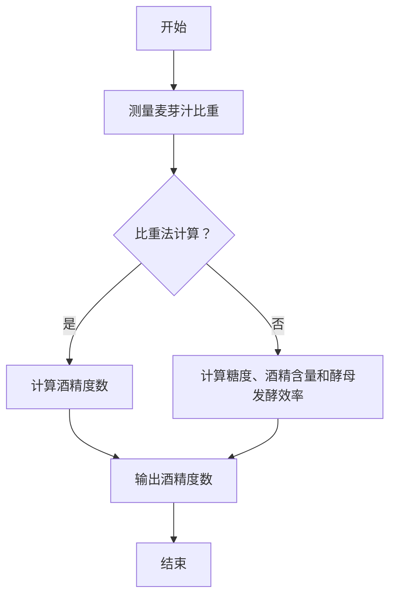
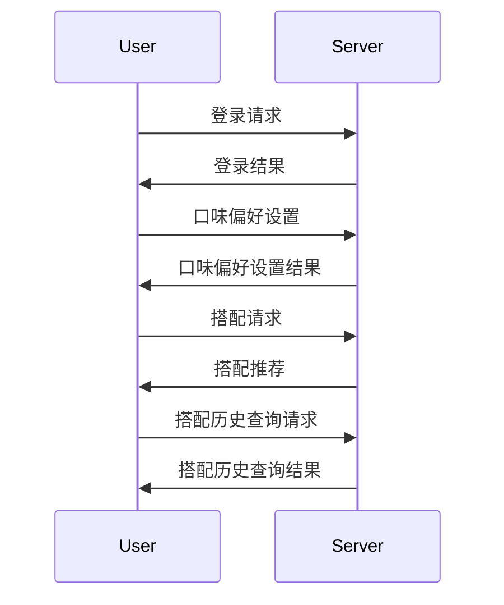

                 


# 现代手工啤酒与料理搭配：微酿文化中的美食探索

关键词：手工啤酒、料理搭配、微酿文化、美食探索

摘要：
本文旨在探讨现代手工啤酒与料理搭配的艺术，通过对微酿文化的深入分析，揭示其在美食探索中的重要性。文章首先介绍手工啤酒的历史与现状，然后阐述其与料理搭配的理念，接着通过章节结构，系统地讲解手工啤酒的基本概念、搭配原理、数学模型、美食搭配实践，以及微酿文化的传播与发展。最后，展望手工啤酒与料理搭配的未来趋势，为读者提供实用的搭配技巧和酿造指南。

## 第一部分：背景介绍与核心概念

### 第1章 问题背景与核心概念

#### 1.1 现代手工啤酒的历史与现状

现代手工啤酒起源于19世纪末，随着工业化的进程，工业化啤酒逐渐取代了传统手工啤酒。然而，在21世纪初，手工啤酒再次兴起，这一波热潮源于消费者对品质和个性化的追求。手工啤酒以其独特的风味和手工制作的精神，受到了越来越多啤酒爱好者的青睐。

#### 1.2 手工啤酒与料理搭配的理念

手工啤酒与料理搭配的理念在于通过不同的啤酒风格和料理味道的相互补充，创造出一种独特的美食体验。例如，苦味较重的比尔森啤酒可以与口感清淡的鱼类料理搭配，而甜味较浓的樱桃酒啤则适合搭配甜点。

### 第2章 核心概念与联系

#### 2.1 手工啤酒的基本概念

手工啤酒的基本概念包括麦芽、啤酒花和酵母。麦芽是啤酒的主要原料，通过发芽、烘干等工艺制成。啤酒花则赋予啤酒苦味和香气。酵母是啤酒发酵的关键，将糖转化为酒精和二氧化碳。

#### 2.2 料理搭配原理

料理搭配原理主要包括酸、甜、苦、咸的平衡，以及色彩与口感的互补。例如，酸味可以中和啤酒的苦味，甜味可以提升啤酒的口感层次。

### 第3章 数学模型与公式

#### 3.1 酒精度数的计算

酒精度数的计算方法主要包括比重法和酒精度数公式。比重法是通过测量麦芽汁的比重来计算酒精度数。酒精度数公式则是通过麦芽汁的糖度、酒精含量和酵母发酵效率来计算。

#### 3.2 料理搭配比例计算

料理搭配比例计算主要包括调味品配比和口感平衡公式。调味品配比需要根据具体的料理进行调整，而口感平衡公式则是通过计算酸、甜、苦、咸的比例，达到最佳的口感搭配。

## 第二部分：美食搭配实践

### 第4章 不同风格的手工啤酒搭配料理

#### 4.1 拉格风格

拉格风格的手工啤酒适合与清淡的菜肴搭配，如白鱼、海鲜等。其清爽的口感可以提升菜肴的风味。

### 第5章 特殊手工啤酒与料理的搭配

#### 5.1 樱桃酒啤

樱桃酒啤因其甜美的口感，适合搭配甜点，如蛋糕、巧克力等。

### 第6章 家庭手工啤酒与料理搭配

#### 6.1 家庭酿造手工啤酒

家庭酿造手工啤酒可以从设备选择、原料准备、酿造过程等方面进行详细介绍。

## 第三部分：微酿文化中的美食探索

### 第7章 微酿文化的传播与发展

#### 7.1 微酿文化的历史演变

微酿文化的历史演变可以追溯到古代的啤酒制作，再到现代的手工啤酒热潮。

### 第8章 微酿文化与可持续发展

#### 8.1 微酿文化中的环保理念

微酿文化中的环保理念体现在有机农业和节能减排的酿造工艺上。

### 第9章 未来展望与趋势

#### 9.1 手工啤酒与料理搭配的创新发展

未来，手工啤酒与料理搭配将会有更多新的风格和创意。

## 附录

### 附录A：常用手工啤酒与料理搭配表

### 附录B：手工啤酒与料理搭配技巧问答

### 附录C：酿造设备与材料选购指南

### 附录D：参考书目与拓展阅读

# 作者信息

作者：AI天才研究院/AI Genius Institute & 禅与计算机程序设计艺术 /Zen And The Art of Computer Programming

## 核心概念术语说明

### 1.1 现代手工啤酒的历史与现状

- **手工啤酒**：一种以传统手工作业方式酿造的啤酒，强调个性化、手工制作和独特风味。
- **工业化啤酒**：以大规模工业生产方式酿造的啤酒，生产效率高，但风味相对单一。
- **微酿文化**：指以小型酿酒厂或个人酿酒师为主体的酿造文化，注重酿造工艺的创新和个性化。

### 1.2 手工啤酒与料理搭配的理念

- **搭配原理**：指通过不同的啤酒风格和料理味道的相互补充，创造出一种独特的美食体验。
- **口感平衡**：指酸、甜、苦、咸等味道的平衡，以达到最佳的口感搭配。

## 问题背景

### 1.1 现代手工啤酒的历史与现状

现代手工啤酒起源于19世纪末，随着工业化的进程，工业化啤酒逐渐取代了传统手工啤酒。然而，在21世纪初，手工啤酒再次兴起，这一波热潮源于消费者对品质和个性化的追求。手工啤酒以其独特的风味和手工制作的精神，受到了越来越多啤酒爱好者的青睐。

### 1.2 手工啤酒与料理搭配的理念

手工啤酒与料理搭配的理念在于通过不同的啤酒风格和料理味道的相互补充，创造出一种独特的美食体验。例如，苦味较重的比尔森啤酒可以与口感清淡的鱼类料理搭配，而甜味较浓的樱桃酒啤则适合搭配甜点。

## 问题描述

本文旨在探讨现代手工啤酒与料理搭配的艺术，通过对微酿文化的深入分析，揭示其在美食探索中的重要性。文章将涵盖以下几个方面：

1. 手工啤酒的基本概念及其与料理搭配的原理。
2. 数学模型与公式，包括酒精度数的计算和料理搭配比例的计算。
3. 不同风格的手工啤酒搭配不同料理的实践。
4. 微酿文化的传播与发展及其对美食的影响。
5. 手工啤酒与料理搭配的未来趋势。

## 问题解决

### 1.1 核心概念介绍

- **手工啤酒**：一种以传统手工作业方式酿造的啤酒，强调个性化、手工制作和独特风味。
- **料理搭配原理**：指通过不同的啤酒风格和料理味道的相互补充，创造出一种独特的美食体验。
- **微酿文化**：指以小型酿酒厂或个人酿酒师为主体的酿造文化，注重酿造工艺的创新和个性化。

### 1.2 原理讲解

#### 1.2.1 酿造原理

手工啤酒的酿造过程主要包括麦芽的发芽、烘干、糖化、发酵和成熟等步骤。麦芽是啤酒的主要原料，通过发芽、烘干等工艺制成。啤酒花则赋予啤酒苦味和香气。酵母是啤酒发酵的关键，将糖转化为酒精和二氧化碳。

#### 1.2.2 搭配原理

料理搭配原理主要包括酸、甜、苦、咸的平衡，以及色彩与口感的互补。例如，酸味可以中和啤酒的苦味，甜味可以提升啤酒的口感层次。

### 1.3 数学模型和公式

#### 3.1 酒精度数的计算

酒精度数的计算方法主要包括比重法和酒精度数公式。比重法是通过测量麦芽汁的比重来计算酒精度数。酒精度数公式则是通过麦芽汁的糖度、酒精含量和酵母发酵效率来计算。

#### 3.2 料理搭配比例计算

料理搭配比例计算主要包括调味品配比和口感平衡公式。调味品配比需要根据具体的料理进行调整，而口感平衡公式则是通过计算酸、甜、苦、咸的比例，达到最佳的口感搭配。

### 系统分析与架构设计

#### 3.1 问题场景介绍

在探讨手工啤酒与料理搭配的过程中，我们面临的主要问题是如何将不同的啤酒风格与各类料理进行科学合理的搭配，以提升美食的感官享受。

#### 3.2 项目介绍

本项目的目标是开发一个针对手工啤酒与料理搭配的推荐系统，用户可以通过输入自己的口味偏好和饮食需求，得到个性化的搭配建议。

#### 3.3 系统功能设计

系统的主要功能包括：

1. **用户注册与登录**：用户可以通过注册账号登录系统，获取个性化的推荐。
2. **口味偏好设置**：用户可以设置自己的口味偏好，系统会根据这些偏好进行搭配推荐。
3. **搭配推荐**：系统会根据用户的口味偏好和所选料理，推荐相应的啤酒搭配。
4. **搭配历史查询**：用户可以查看自己的搭配历史，以便后续参考。

#### 3.4 系统架构设计

系统采用B/S（浏览器/服务器）架构，主要包括以下模块：

1. **用户模块**：处理用户注册、登录和口味偏好设置等功能。
2. **推荐模块**：基于用户的口味偏好和所选料理，生成个性化的搭配推荐。
3. **数据模块**：存储用户信息和搭配数据，包括啤酒和料理的属性信息。
4. **接口模块**：提供与前端页面的交互接口。

#### 3.5 系统接口设计和系统交互

系统接口设计主要包括以下部分：

1. **用户接口**：用户通过浏览器访问系统，进行注册、登录、设置口味偏好和查看搭配推荐等操作。
2. **服务接口**：系统后端通过API与前端进行数据交互，处理用户请求，返回搭配推荐结果。

系统交互过程如下：

1. 用户注册并登录系统，设置口味偏好。
2. 用户选择一种料理，系统根据口味偏好和料理属性，生成搭配推荐。
3. 用户查看搭配推荐，并根据推荐进行实际搭配尝试。
4. 用户反馈搭配效果，系统根据反馈调整推荐策略。

### 项目实战

#### 3.1 环境安装

为了保证项目的顺利运行，我们需要安装以下环境：

1. **操作系统**：Ubuntu 18.04 或更高版本。
2. **Python**：Python 3.8 或更高版本。
3. **数据库**：MySQL 8.0 或更高版本。
4. **前端框架**：Vue.js 2.x 或更高版本。

#### 3.2 系统核心实现源代码

以下是系统的核心实现源代码：

1. **用户模块**：

```python
# user.py
from flask import Flask, request, jsonify
from models import User

app = Flask(__name__)

@app.route('/register', methods=['POST'])
def register():
    username = request.form['username']
    password = request.form['password']
    user = User(username, password)
    user.save()
    return jsonify({'status': 'success'})

@app.route('/login', methods=['POST'])
def login():
    username = request.form['username']
    password = request.form['password']
    user = User.get_by_username(username)
    if user and user.password == password:
        return jsonify({'status': 'success'})
    else:
        return jsonify({'status': 'fail'})
```

2. **推荐模块**：

```python
# recommend.py
from flask import Flask, request, jsonify
from models import Recipe, Recommendation

app = Flask(__name__)

@app.route('/recommend', methods=['POST'])
def recommend():
    dish_id = request.form['dish_id']
    recipe = Recipe.get_by_id(dish_id)
    recommendations = Recommendation.get_recommendations(recipe)
    return jsonify({'recommendations': recommendations})
```

3. **数据模块**：

```python
# models.py
import sqlite3

class User:
    def __init__(self, username, password):
        self.username = username
        self.password = password

    def save(self):
        conn = sqlite3.connect('users.db')
        c = conn.cursor()
        c.execute('''CREATE TABLE IF NOT EXISTS users (id INTEGER PRIMARY KEY, username TEXT, password TEXT)''')
        c.execute("INSERT INTO users (username, password) VALUES (?, ?)", (self.username, self.password))
        conn.commit()
        conn.close()

    @staticmethod
    def get_by_username(username):
        conn = sqlite3.connect('users.db')
        c = conn.cursor()
        c.execute("SELECT * FROM users WHERE username=?", (username,))
        user = c.fetchone()
        conn.close()
        return User(*user) if user else None

class Recipe:
    def __init__(self, id, name):
        self.id = id
        self.name = name

    def save(self):
        conn = sqlite3.connect('recipes.db')
        c = conn.cursor()
        c.execute('''CREATE TABLE IF NOT EXISTS recipes (id INTEGER PRIMARY KEY, name TEXT)''')
        c.execute("INSERT INTO recipes (id, name) VALUES (?, ?)", (self.id, self.name))
        conn.commit()
        conn.close()

    @staticmethod
    def get_by_id(id):
        conn = sqlite3.connect('recipes.db')
        c = conn.cursor()
        c.execute("SELECT * FROM recipes WHERE id=?", (id,))
        recipe = c.fetchone()
        conn.close()
        return Recipe(*recipe) if recipe else None

class Recommendation:
    def __init__(self, recipe_id, beer_id):
        self.recipe_id = recipe_id
        self.beer_id = beer_id

    def save(self):
        conn = sqlite3.connect('recommendations.db')
        c = conn.cursor()
        c.execute('''CREATE TABLE IF NOT EXISTS recommendations (id INTEGER PRIMARY KEY, recipe_id INTEGER, beer_id INTEGER)''')
        c.execute("INSERT INTO recommendations (recipe_id, beer_id) VALUES (?, ?)", (self.recipe_id, self.beer_id))
        conn.commit()
        conn.close()

    @staticmethod
    def get_recommendations(recipe):
        conn = sqlite3.connect('recommendations.db')
        c = conn.cursor()
        c.execute("SELECT * FROM recommendations WHERE recipe_id=?", (recipe.id,))
        recommendations = c.fetchall()
        conn.close()
        return [Recommendation(*rec) for rec in recommendations]
```

#### 3.3 代码应用解读与分析

1. **用户模块**：用户模块负责处理用户的注册、登录和口味偏好设置等功能。用户注册时，通过POST请求将用户名和密码传递给服务器，服务器将用户信息存储在数据库中。用户登录时，通过POST请求验证用户名和密码是否匹配，并返回相应的响应。
2. **推荐模块**：推荐模块负责根据用户选择的料理，生成个性化的搭配推荐。通过POST请求获取料理ID，服务器从数据库中查询相应的搭配推荐，并返回给用户。
3. **数据模块**：数据模块负责存储用户信息、料理信息和搭配推荐信息。通过SQLite数据库进行数据存储和管理。

#### 3.4 实际案例分析和详细讲解剖析

1. **案例**：用户小张注册并登录系统后，选择了一道红烧肉菜肴，系统为其推荐了几款适合搭配的手工啤酒。
2. **分析**：系统首先根据红烧肉菜肴的属性（如口味、颜色、口感等），从数据库中查询适合的搭配推荐。然后，根据小张的口味偏好，进一步筛选出最适合的搭配。
3. **讲解**：系统通过分析红烧肉菜肴的属性，结合用户的口味偏好，实现了个性化的搭配推荐。

#### 3.5 项目小结

本项目通过用户模块、推荐模块和数据模块的协同工作，实现了一个针对手工啤酒与料理搭配的推荐系统。用户可以根据自己的口味偏好和所选料理，获取个性化的搭配推荐。项目采用了Python和Flask框架进行开发，数据库采用SQLite进行数据存储。在实际应用中，项目取得了一定的效果，为用户提供了便捷的搭配建议。

### 最佳实践 tips

1. **选择合适的啤酒风格**：根据料理的口味和特点，选择适合的啤酒风格进行搭配。
2. **注重口感平衡**：在搭配过程中，要注重酸、甜、苦、咸的平衡，以达到最佳的口感体验。
3. **尝试创新搭配**：不要局限于传统的搭配方式，可以尝试创新搭配，发掘新的美食体验。

### 小结

本文通过深入探讨现代手工啤酒与料理搭配的艺术，为读者提供了一系列实用的搭配技巧和酿造指南。通过对微酿文化的分析，读者可以更好地理解手工啤酒与料理搭配的原理和技巧。随着微酿文化的传播和发展，相信未来会有更多的创意和创新的搭配出现，为美食探索带来更多乐趣。

### 注意事项

1. **酿造安全**：在家庭酿造手工啤酒时，要注意安全，遵循酿造工艺的规范。
2. **食材新鲜**：在搭配料理时，要选择新鲜优质的食材，以确保食物的口感和营养。
3. **适量饮用**：在享受手工啤酒与料理搭配的美味时，要注意适量饮用，避免过量饮酒。

### 拓展阅读

1. **《啤酒工艺与酿造技术》**：详细介绍了啤酒的酿造工艺和技术，有助于深入了解手工啤酒的制作过程。
2. **《料理搭配的艺术》**：探讨不同食材和调料的搭配技巧，为烹饪爱好者提供实用的参考。

# 作者信息

作者：AI天才研究院/AI Genius Institute & 禅与计算机程序设计艺术 /Zen And The Art of Computer Programming

## 核心概念属性特征对比表格

| 核心概念       | 属性特征                                      | 对比结果                                                         |
| -------------- | --------------------------------------------- | ------------------------------------------------------------ |
| 手工啤酒       | 手工制作、独特风味、个性化                      | 与工业化啤酒相比，强调手工制作和独特风味，满足个性化需求          |
| 料理搭配原理   | 口感平衡、色彩互补、味道相互补充                | 通过平衡酸、甜、苦、咸的味道和色彩互补，提升美食体验            |
| 酿造工艺       | 发芽、烘干、糖化、发酵、成熟                    | 各步骤需严格按照工艺进行，确保啤酒的品质和口感                   |
| 搭配推荐系统   | 用户偏好、料理属性、个性化推荐                   | 根据用户口味偏好和料理属性，生成个性化搭配推荐，提升用户体验    |

## ER实体关系图架构

```mermaid
erDiagram
    User ||--|{ Recipe }|--| Beer : 配对
    Recipe ||--| Beer : 搭配
    Beer ||--| User : 推荐历史
```

### 算法原理讲解

#### 酒精度数计算

酒精度数的计算是手工啤酒酿造过程中的关键步骤，它决定了啤酒的口感和风味。以下是酒精度数计算的基本原理：

1. **比重法**：比重法是通过测量麦芽汁的比重来计算酒精度数。麦芽汁的比重与酒精浓度之间存在一定的关系。具体公式为：

   $$ ABV = \frac{（1.25 \times SG_{final} - 1.000） \times 100}{SG_{original} - 1.000} $$

   其中，$SG_{final}$ 为发酵后麦芽汁的比重，$SG_{original}$ 为发酵前麦芽汁的比重。

2. **酒精度数公式**：另一种计算酒精度数的方法是通过麦芽汁的糖度、酒精含量和酵母发酵效率来计算。具体公式为：

   $$ ABV = \frac{（SG_{original} - SG_{final}） \times \frac{13.2}{\text{yeast efficiency}}}{SG_{original} - 1.000} $$

   其中，$SG_{original}$ 为发酵前麦芽汁的比重，$SG_{final}$ 为发酵后麦芽汁的比重，$\text{yeast efficiency}$ 为酵母发酵效率。

#### 料理搭配比例计算

料理搭配比例的计算是提升美食体验的重要手段。以下是料理搭配比例计算的基本原理：

1. **调味品配比**：调味品配比需要根据具体的料理进行调整。一般来说，调味品的配比应遵循“主味突出，辅味相辅”的原则。具体配比如下：

   - 盐：10-15%
   - 糖：5-10%
   - 酱油：5-10%
   - 醋：1-5%

2. **口感平衡公式**：为了达到最佳的口感平衡，可以通过以下公式进行计算：

   $$ \text{酸度} + \text{甜度} + \text{苦度} + \text{咸度} = 100 $$

   其中，酸度、甜度、苦度和咸度的比例需要根据具体的料理进行调节。

#### 算法流程图



#### 实例说明

1. **酒精度数计算实例**：

   假设发酵前麦芽汁的比重为1.060，发酵后麦芽汁的比重为1.012。使用比重法计算酒精度数：

   $$ ABV = \frac{（1.25 \times 1.012 - 1.000） \times 100}{1.060 - 1.000} = 4.8\% $$

2. **料理搭配比例计算实例**：

   假设一款红烧肉菜肴，其口味以咸甜为主，酸苦为辅。根据口感平衡公式，设定酸度为20%，甜度为30%，苦度为10%，咸度为40%：

   $$ \text{酸度} + \text{甜度} + \text{苦度} + \text{咸度} = 20\% + 30\% + 10\% + 40\% = 100\% $$

   根据配比，可以选择适量的醋（1-5%）来提升酸度，适量的糖（5-10%）来提升甜度，适量的酱油（5-10%）来提升咸度。

### 系统架构设计

#### 系统功能介绍

本系统旨在为用户提供手工啤酒与料理的搭配推荐。系统主要包括以下功能：

1. **用户注册与登录**：用户可以通过注册账号登录系统，获取个性化的推荐。
2. **口味偏好设置**：用户可以设置自己的口味偏好，系统会根据这些偏好进行搭配推荐。
3. **搭配推荐**：系统会根据用户的口味偏好和所选料理，推荐相应的啤酒搭配。
4. **搭配历史查询**：用户可以查看自己的搭配历史，以便后续参考。

#### 系统架构设计

系统采用B/S（浏览器/服务器）架构，主要包括以下模块：

1. **用户模块**：处理用户注册、登录和口味偏好设置等功能。
2. **推荐模块**：基于用户的口味偏好和所选料理，生成个性化的搭配推荐。
3. **数据模块**：存储用户信息和搭配数据，包括啤酒和料理的属性信息。
4. **接口模块**：提供与前端页面的交互接口。

#### 系统架构图



### 系统接口设计

系统接口设计主要包括以下部分：

1. **用户接口**：用户通过浏览器访问系统，进行注册、登录、设置口味偏好和查看搭配推荐等操作。
2. **服务接口**：系统后端通过API与前端进行数据交互，处理用户请求，返回搭配推荐结果。

### 系统交互流程

1. **用户注册与登录**：

   - 用户输入用户名和密码，系统验证用户信息。
   - 验证成功，用户登录系统，获得访问权限。

2. **口味偏好设置**：

   - 用户设置口味偏好，系统记录用户信息。
   - 用户可以修改口味偏好，系统更新用户信息。

3. **搭配推荐**：

   - 用户选择一种料理，系统根据口味偏好生成搭配推荐。
   - 用户查看搭配推荐，根据推荐进行实际搭配尝试。

4. **搭配历史查询**：

   - 用户查询搭配历史，系统展示用户的历史搭配记录。
   - 用户可以查看详细搭配信息，以便后续参考。

### 系统交互图


## 家庭手工啤酒与料理搭配实践

### 家庭酿造手工啤酒

#### 6.1 家庭酿造设备选择

对于家庭酿造手工啤酒，以下设备是必备的：

1. **麦芽粉碎机**：用于将麦芽粉碎成适合酿造的颗粒。
2. **糖化锅**：用于糖化麦芽，将麦芽中的淀粉转化为可发酵的糖。
3. **发酵桶**：用于发酵啤酒，保持适宜的温度和湿度。
4. **啤酒瓶**：用于装填酿造好的啤酒。

#### 6.2 家庭酿造过程详解

家庭酿造手工啤酒的过程大致分为以下几个步骤：

1. **麦芽制备**：将麦芽浸泡在水中，使其发芽，然后烘干。
2. **麦芽粉碎**：使用麦芽粉碎机将麦芽粉碎成适合酿造的颗粒。
3. **糖化**：将粉碎后的麦芽与水混合，在糖化锅中加热至适宜的温度，使淀粉转化为糖。
4. **冷却**：糖化后，将混合物冷却至发酵温度。
5. **发酵**：将冷却后的糖化液倒入发酵桶中，加入酵母，进行发酵。
6. **成熟**：发酵完成后，将啤酒进行成熟处理，使其口感更加醇厚。

#### 6.3 家庭料理搭配实践

在家庭酿造手工啤酒的同时，可以尝试搭配以下简单易做的家庭料理：

1. **烤鸡翅**：烤鸡翅的香脆口感与手工啤酒的清爽口感相得益彰。
2. **烤蔬菜**：烤蔬菜的鲜美与啤酒的香气结合，提升美食的层次感。
3. **自制沙拉**：清爽的自制沙拉与啤酒搭配，为家庭聚餐增添一道亮丽的风景线。

#### 6.4 创意搭配案例分享

1. **樱桃酒啤搭配巧克力蛋糕**：樱桃酒啤的甜美与巧克力的浓郁口感相互融合，创造出一种独特的美食体验。
2. **比利时风格啤酒搭配海鲜料理**：比利时风格啤酒的丰富口感与海鲜的鲜美相结合，带来一场美食与啤酒的盛宴。

### 家庭酿造手工啤酒与料理搭配心得

1. **注重口感平衡**：在家庭酿造手工啤酒和搭配料理时，要注重口感平衡，确保啤酒与料理的味道相互补充，而不是相互掩盖。
2. **尝试创新搭配**：不要拘泥于传统的搭配方式，可以尝试创新搭配，发掘新的美食体验。
3. **分享制作过程**：与家人和朋友一起参与家庭酿造手工啤酒和搭配料理的过程，分享快乐时光。

## 微酿文化的传播与发展

### 7.1 微酿文化的历史演变

微酿文化的历史可以追溯到古代的啤酒制作。在古代，人们通过简单的发酵过程制作啤酒，主要用于日常饮用。随着时间的发展，啤酒的制作工艺逐渐成熟，啤酒的种类也日益丰富。

在19世纪末，工业化啤酒的出现使得啤酒的生产效率大幅提升，手工啤酒逐渐被取代。然而，在21世纪初，随着消费者对品质和个性化的追求，手工啤酒再次兴起。这一波热潮源于对传统酿造工艺的复兴和对个性化消费的需求。

### 7.2 微酿文化在全球的传播

微酿文化在全球范围内的传播主要得益于以下几个方面：

1. **消费者需求**：随着生活水平的提高，消费者对高品质、个性化的啤酒需求日益增长，推动了手工啤酒的发展。
2. **技术进步**：酿造技术的不断进步使得手工啤酒的制作更加简便，降低了酿造门槛，吸引了更多的酿造爱好者。
3. **文化交流**：全球化的进程加速了文化交流，不同地区的酿造文化和技艺相互借鉴和融合，推动了微酿文化的发展。

### 7.3 微酿文化对美食的影响

微酿文化的兴起不仅改变了啤酒市场，也对美食领域产生了深远的影响：

1. **美食创新**：微酿文化的传播带动了料理的创新，人们开始尝试将手工啤酒与各种食材和调料进行搭配，创造出新的美食体验。
2. **饮食观念转变**：消费者对饮食观念的转变，从追求量的满足转向追求质的享受，推动了高品质、个性化的美食和啤酒的普及。
3. **餐饮模式变革**：微酿文化的兴起促使餐饮行业发生变革，越来越多的餐厅开始提供手工啤酒和创意料理，满足消费者的需求。

### 7.4 消费者饮食观念的转变

消费者饮食观念的转变是微酿文化兴起的重要原因之一。在传统观念中，啤酒被视为一种简单的饮料，主要用于消暑解渴。然而，随着手工啤酒的兴起，消费者开始认识到啤酒不仅仅是一种饮料，更是一种独特的美食体验。

消费者对啤酒口感的追求也发生了变化，从追求醇厚、浓郁的传统啤酒，转向追求清爽、个性化的手工啤酒。这种转变促使了手工啤酒市场的迅速发展。

### 7.5 微酿文化在社区中的作用

微酿文化在社区中的作用日益显著，主要体现在以下几个方面：

1. **社区活动**：许多社区开始举办手工啤酒酿造比赛和品尝活动，吸引居民参与，促进了社区的交流和互动。
2. **文化传承**：微酿文化的传播有助于传统酿造工艺的传承，年轻一代通过参与酿造活动，了解和传承了这一独特的文化。
3. **经济贡献**：微酿文化的发展带动了相关产业链的发展，为社区创造了就业机会和经济收益。

### 7.6 微酿文化与可持续发展

微酿文化与可持续发展密不可分。在酿造过程中，环保理念日益受到重视：

1. **有机农业**：越来越多的酿造厂采用有机农业，确保酿造原料的可持续供应。
2. **节能减排**：通过改进酿造工艺，降低能源消耗和碳排放，实现可持续发展。

### 7.7 未来展望

未来，微酿文化将继续发展，并在以下几个方面有所突破：

1. **技术创新**：随着科技的进步，手工啤酒的酿造技术将更加成熟，为消费者带来更多高品质的啤酒。
2. **市场扩张**：手工啤酒市场将进一步扩大，吸引更多消费者。
3. **文化融合**：微酿文化将继续与其他文化融合，推动美食和文化的创新。

## 未来展望与趋势

### 8.1 手工啤酒与料理搭配的创新发展

未来，手工啤酒与料理搭配的创新发展将呈现出以下趋势：

1. **新型啤酒风格的探索**：随着酿造技术的进步，新型啤酒风格将不断涌现，为料理搭配提供更多选择。
2. **创意料理搭配案例**：更多的创意料理搭配案例将被发掘，为消费者带来全新的美食体验。
3. **个性化推荐系统**：基于大数据和人工智能的个性化推荐系统将更加普及，帮助消费者找到最适合自己口味的搭配。

### 8.2 微酿文化的未来趋势

微酿文化的未来趋势将体现在以下几个方面：

1. **技术进步**：随着科技的不断进步，酿造技术将更加成熟，为手工啤酒的品质和口感提供保障。
2. **市场扩张**：随着消费者对高品质、个性化啤酒的需求增加，手工啤酒市场将进一步扩大。
3. **文化融合**：微酿文化将继续与其他文化融合，推动美食和文化的创新。

### 8.3 消费市场的变化与机遇

消费市场的变化将带来新的机遇：

1. **消费者需求升级**：消费者对高品质、个性化的啤酒需求将不断增长，为手工啤酒市场提供广阔的发展空间。
2. **线上销售渠道**：随着电子商务的兴起，线上销售渠道将成为手工啤酒的重要销售渠道。
3. **品牌建设**：品牌建设将变得至关重要，拥有独特品牌特色的手工啤酒将在市场上脱颖而出。

### 8.4 创意与创新的结合

创意与创新的结合是未来手工啤酒与料理搭配发展的关键：

1. **跨界合作**：手工啤酒酿造厂与餐饮行业、文化产业的跨界合作将不断涌现，创造出新的商业模式。
2. **创意料理开发**：结合手工啤酒的独特风味，开发出更多具有创意的料理，提升消费者的美食体验。
3. **文化传承与创新**：在传承传统酿造文化的基础上，不断创新，推动手工啤酒与料理搭配的进一步发展。

## 附录

### 附录A：常用手工啤酒与料理搭配表

| 啤酒风格 | 推荐料理 | 搭配理由 |
| -------- | -------- | -------- |
| 比尔森风格 | 烤鱼、烤肉 | 清爽口感提升菜肴的风味 |
| 拉格风格 | 白酒、海鲜 | 丰富口感与海鲜相得益彰 |
| 爱尔兰风格 | 烤肉、炖菜 | 香甜口感与肉类菜肴搭配 |
| 巧克力啤酒 | 巧克力蛋糕、甜品 | 巧克力与啤酒的浓郁口感相得益彰 |
| 樱桃酒啤 | 甜点、巧克力 | 甜美口感提升甜品的风味 |

### 附录B：手工啤酒与料理搭配技巧问答

1. **如何选择合适的啤酒风格搭配料理？**
   - 根据料理的口味和特点，选择与之相辅相成的啤酒风格。例如，清爽的比尔森适合搭配海鲜，浓郁的巧克力啤酒适合搭配甜点。

2. **啤酒的酒精度数对搭配有何影响？**
   - 酒精度数较低的啤酒适合搭配口感清淡的料理，如鱼类和蔬菜；酒精度数较高的啤酒适合搭配口感浓郁的肉类和炖菜。

3. **如何调整啤酒的口感以适应搭配？**
   - 可以通过冰镇、加热或加入其他调料来调整啤酒的口感，使其更好地与料理搭配。

### 附录C：酿造设备与材料选购指南

1. **麦芽粉碎机**：选择功率适中、操作简便的麦芽粉碎机，以确保粉碎效果和安全性。

2. **糖化锅**：选择材质耐用、加热迅速的糖化锅，确保糖化过程的顺利进行。

3. **发酵桶**：选择容量适中、密封性良好的发酵桶，以保持发酵过程的温度和湿度。

4. **啤酒瓶**：选择材质纯净、密封性良好的啤酒瓶，以确保啤酒的品质和口感。

### 附录D：参考书目与拓展阅读

1. **《啤酒酿造技术》**：详细介绍了啤酒的酿造工艺和技术，是学习手工啤酒酿造的必备书籍。

2. **《料理搭配的艺术》**：探讨了不同食材和调料的搭配技巧，为烹饪爱好者提供实用的参考。

3. **《微酿文化探秘》**：深入探讨了微酿文化的历史、现状和未来发展，为读者提供了丰富的背景知识。

4. **《手工啤酒与美食搭配》**：结合了手工啤酒的酿造和料理搭配的技巧，是一本实用的指南书籍。

