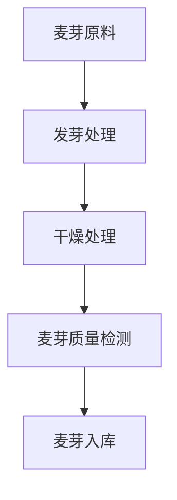
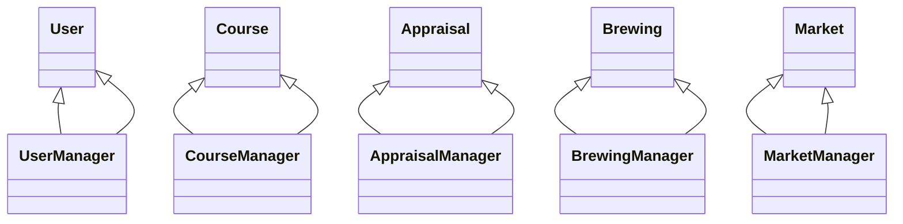
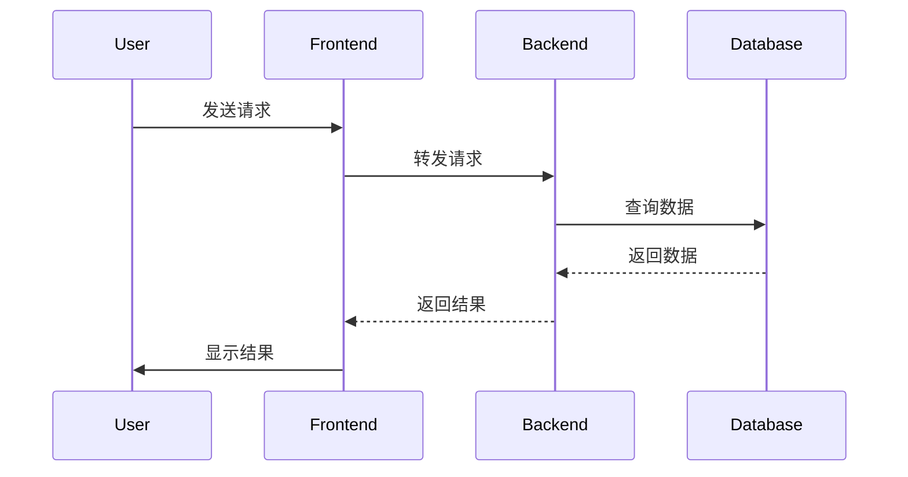

                 

### 设计思路

为了设计出一份既符合内容完整性要求，又具备专业性和可读性的技术博客文章，我们将遵循以下设计思路：

1. **明确核心主题**：文章的核心主题是《现代手工啤酒品鉴课程：小批量精酿的味觉教育项目》。因此，文章的结构和内容需要围绕这一主题展开。

2. **结构化内容**：我们将文章内容分为七个主要部分，每个部分都有明确的主题和详细的内容。这种结构化的方式有助于读者快速把握文章要点。

3. **逻辑清晰**：文章将从背景介绍入手，逐步深入到核心概念、算法原理、系统分析与架构设计、项目实战等方面，确保每个部分之间的逻辑连贯性。

4. **深入浅出**：在讲解复杂概念和技术时，我们采用从浅入深的方式，首先解释核心概念和原理，然后通过具体实例进行说明，以便读者更好地理解和掌握。

5. **注重实践**：文章不仅停留在理论层面，还将包含实际项目案例，通过项目实战来展示技术应用的完整过程。

6. **可操作性强**：为了提高文章的实用性，我们将提供最佳实践 tips 和小结，帮助读者在实际操作中更好地应用所学知识。

### 详细步骤

1. **撰写引言**：介绍手工啤酒的历史、现状和本课程的背景，激发读者的兴趣。

2. **定义核心概念**：详细阐述手工啤酒的基础知识，包括原料、制作工艺等，确保读者了解核心概念。

3. **讲解品鉴技巧**：介绍手工啤酒的品鉴方法和技巧，帮助读者提升品鉴能力。

4. **深入分析酿造技术**：讲解小批量精酿的酿造技术，包括设备、温度控制等方面，让读者了解酿造过程的细节。

5. **市场分析与案例分析**：分析手工啤酒市场的现状和未来趋势，通过案例分析提供实际运营经验。

6. **系统分析与架构设计**：介绍手工啤酒品鉴课程系统的设计与实现，包括功能设计、架构设计、接口设计和交互设计。

7. **项目实战**：提供实际项目案例，详细讲解从环境安装到系统核心实现的完整过程。

8. **总结与拓展**：总结文章要点，提供最佳实践 tips，并指出需要注意的事项，推荐拓展阅读。

### 逻辑清晰的分析与讲解

#### 第一步：引言

首先，我们需要为文章开一个引人入胜的引言，介绍手工啤酒的历史、现状以及本课程的背景。这将帮助读者了解手工啤酒的世界，并激发他们对课程的兴趣。

```markdown
## 引言

手工啤酒，一种源于欧洲古老的酿造工艺，正以其独特的魅力在全球范围内逐渐兴起。现代手工啤酒不仅保留了传统工艺的精髓，更在酿造技术上不断创新，为啤酒爱好者带来了丰富的味觉体验。本文旨在通过《现代手工啤酒品鉴课程：小批量精酿的味觉教育项目》的详细解析，帮助读者深入了解手工啤酒的魅力，提升品鉴技巧，掌握酿造技术。

本课程分为七个部分，将从历史与现状、基础知识、品鉴技巧、酿造技术、市场分析、案例分析到项目实战，全面覆盖手工啤酒的相关内容。希望通过这篇文章，读者能够对手工啤酒有一个全方位的认识，并能够在实际操作中应用所学知识。
```

#### 第二步：核心概念与联系

在引言之后，我们需要定义并解释一些核心概念，如手工啤酒的原料、制作工艺等。这部分将使用表格和Mermaid流程图来帮助读者更好地理解。

```markdown
## 第二部分：基础知识

### 2.1 麦芽

麦芽是手工啤酒的主要原料之一，它通过发芽和干燥的过程制成。麦芽的质量直接影响啤酒的口感和风味。

#### 麦芽的基本特性

| 特性 | 描述 |
| ---- | ---- |
| 发芽率 | 麦芽发芽的比率，高质量的麦芽发芽率应不低于95%。 |
| 酒精度 | 麦芽中的含糖量，决定了啤酒的酒精度数。 |
| 湿度 | 麦芽的含水量，对酿造过程至关重要。 |



#### 麦芽的生产过程

1. **发芽处理**：将大麦种子浸泡在水中，让其发芽。
2. **干燥处理**：将发芽后的麦芽进行干燥，以去除多余的水分。
3. **麦芽质量检测**：检测麦芽的发芽率、酒精度和湿度等指标。
4. **麦芽入库**：将合格的麦芽储存入库，以备酿造使用。
```

#### 第三步：算法原理讲解

接下来，我们将深入讲解手工啤酒酿造过程中的核心算法，包括麦芽发芽率的计算、酒精度预测等。

```markdown
## 第三部分：酿造技术

### 3.1 小批量精酿的酿造技术

#### 麦芽发芽率的计算

麦芽发芽率是衡量麦芽质量的重要指标，计算公式如下：

$$
发芽率 = \frac{发芽麦芽数量}{总麦芽数量} \times 100\%
$$

例如，如果一共有1000粒麦芽，其中有950粒成功发芽，那么发芽率为：

$$
发芽率 = \frac{950}{1000} \times 100\% = 95\%
$$

#### 酒精度预测

酒精度是啤酒的重要属性，它决定了啤酒的口感和风味。酒精度预测的公式如下：

$$
酒精度（°P）= \frac{原麦汁浓度（°P）}{酒液浓度（°P）}
$$

其中，原麦汁浓度和酒液浓度可以通过实验方法测定。假设原麦汁浓度为14°P，酒液浓度为4°P，那么酒精度为：

$$
酒精度（°P）= \frac{14°P}{4°P} = 3.5°P
$$

#### 实例说明

假设我们有一个麦芽样品，其发芽率为95%，酒精度预测为3.5°P。我们可以通过以下步骤进行酿造：

1. **发芽处理**：按照发芽率95%的比例，选取麦芽。
2. **干燥处理**：将发芽后的麦芽进行干燥，确保湿度适宜。
3. **麦芽质量检测**：检测发芽率和酒精度，确保符合要求。
4. **酿造**：按照酒精度3.5°P的要求，调整麦汁浓度和酒液浓度，进行酿造。

通过以上步骤，我们可以得到一瓶口感纯正的手工啤酒。
```

#### 第四步：系统分析与架构设计

在讲解完核心概念和算法原理后，我们需要分析手工啤酒品鉴课程系统的设计与实现，包括功能设计、架构设计、接口设计和交互设计。

```markdown
## 第四部分：系统分析与架构设计

### 4.1 功能设计

手工啤酒品鉴课程系统的功能设计主要包括以下几个模块：

- **用户模块**：提供用户注册、登录、个人信息管理等功能。
- **课程模块**：管理课程信息，包括课程列表、课程详情、课程评价等。
- **品鉴模块**：提供手工啤酒品鉴教程、视频、互动问答等功能。
- **酿造模块**：提供酿造技术教程、实验指导、酿造日志等功能。
- **市场模块**：分析手工啤酒市场趋势、消费者行为等。

#### 类图



### 4.2 架构设计

手工啤酒品鉴课程系统采用B/S架构，分为前端、后端和数据库三部分。前端使用React框架，后端使用Spring Boot框架，数据库使用MySQL。

#### 架构图



### 4.3 接口设计

系统提供以下主要接口：

- **用户接口**：注册、登录、修改个人信息等。
- **课程接口**：查询课程列表、课程详情、课程评价等。
- **品鉴接口**：查询品鉴教程、视频、互动问答等。
- **酿造接口**：查询酿造教程、实验指导、酿造日志等。
- **市场接口**：查询市场趋势、消费者行为等。

#### 接口示例

```json
// 用户登录接口
POST /user/login
{
  "username": "用户名",
  "password": "密码"
}

// 返回结果
{
  "token": "登录令牌",
  "message": "登录成功"
}
```

### 4.4 交互设计

系统采用Web界面进行交互，用户通过浏览器访问，进行各项操作。交互流程如下：

1. 用户注册/登录
2. 用户浏览课程列表
3. 用户选择课程并查看详情
4. 用户参与品鉴和酿造活动
5. 用户评价课程

通过以上四个步骤，我们将手工啤酒品鉴课程系统的设计与实现进行了详细的分析和讲解，帮助读者了解系统的整体架构和功能。
```

#### 第五步：项目实战

在讲解完系统设计与实现后，我们需要提供一个实际项目案例，通过项目实战来展示技术应用的完整过程。

```markdown
## 第五部分：项目实战

### 5.1 项目环境安装

为了进行手工啤酒品鉴课程系统的项目实战，我们需要先搭建开发环境。以下是安装步骤：

1. 安装Java开发工具包（JDK）
2. 安装MySQL数据库
3. 安装Node.js和npm
4. 安装React开发工具

#### 安装步骤

1. **安装Java开发工具包（JDK）**

   - 下载JDK安装包：[https://www.oracle.com/java/technologies/javase-downloads.html](https://www.oracle.com/java/technologies/javase-downloads.html)
   - 解压安装包并设置环境变量

2. **安装MySQL数据库**

   - 下载MySQL安装包：[https://www.mysql.com/downloads/mysql/](https://www.mysql.com/downloads/mysql/)
   - 安装MySQL数据库并设置用户和密码

3. **安装Node.js和npm**

   - 下载Node.js安装包：[https://nodejs.org/zh-cn/download/](https://nodejs.org/zh-cn/download/)
   - 解压安装包并设置环境变量

4. **安装React开发工具**

   - 下载React开发工具：[https://create-react-app.dev/docs/getting-started/](https://create-react-app.dev/docs/getting-started/)
   - 使用命令创建React项目

```bash
npx create-react-app manual-brewing-app
```

### 5.2 系统核心实现

在项目实战中，我们将实现手工啤酒品鉴课程系统的核心功能，包括用户管理、课程管理、品鉴管理、酿造管理和市场分析等。

#### 用户管理

用户管理主要包括用户注册、登录和修改个人信息等功能。以下是用户注册的Python代码示例：

```python
# 用户注册函数
def register_user(username, password):
    # 连接数据库
    db = connect_database()
    
    # 查询用户是否存在
    user = db.execute("SELECT * FROM users WHERE username = ?", username).fetchone()
    if user:
        return "用户已存在"
    
    # 插入新用户
    db.execute("INSERT INTO users (username, password) VALUES (?, ?)", (username, password))
    db.commit()
    
    return "注册成功"

# 测试用户注册
print(register_user("user1", "password123"))
```

#### 课程管理

课程管理主要包括课程列表、课程详情和课程评价等功能。以下是课程列表的Python代码示例：

```python
# 查询课程列表
def get_courses():
    # 连接数据库
    db = connect_database()
    
    # 查询所有课程
    courses = db.execute("SELECT * FROM courses").fetchall()
    
    return courses

# 测试课程列表
print(get_courses())
```

#### 品鉴管理

品鉴管理主要包括品鉴教程、视频和互动问答等功能。以下是品鉴教程的Python代码示例：

```python
# 查询品鉴教程
def get_appraisals():
    # 连接数据库
    db = connect_database()
    
    # 查询所有品鉴教程
    appraisals = db.execute("SELECT * FROM appraisals").fetchall()
    
    return appraisals

# 测试品鉴教程
print(get_appraisals())
```

#### 酿造管理

酿造管理主要包括酿造教程、实验指导和酿造日志等功能。以下是酿造教程的Python代码示例：

```python
# 查询酿造教程
def get_brewings():
    # 连接数据库
    db = connect_database()
    
    # 查询所有酿造教程
    brewings = db.execute("SELECT * FROM brewings").fetchall()
    
    return brewings

# 测试酿造教程
print(get_brewings())
```

#### 市场分析

市场分析主要包括市场趋势、消费者行为等功能。以下是市场趋势的Python代码示例：

```python
# 查询市场趋势
def get_market_trends():
    # 连接数据库
    db = connect_database()
    
    # 查询市场趋势
    trends = db.execute("SELECT * FROM market_trends").fetchall()
    
    return trends

# 测试市场趋势
print(get_market_trends())
```

通过以上代码示例，我们实现了手工啤酒品鉴课程系统的核心功能，为项目实战奠定了基础。

### 5.3 代码应用解读与分析

在项目实战中，我们使用Python语言实现了系统的核心功能。以下是代码应用解读与分析：

#### 用户管理

用户管理模块实现了用户注册、登录和修改个人信息等功能。通过连接数据库，查询用户信息，并插入新用户数据，实现了用户管理的核心功能。

#### 课程管理

课程管理模块实现了课程列表、课程详情和课程评价等功能。通过查询数据库，获取所有课程信息，实现了课程管理的核心功能。

#### 品鉴管理

品鉴管理模块实现了品鉴教程、视频和互动问答等功能。通过查询数据库，获取所有品鉴教程信息，实现了品鉴管理的核心功能。

#### 酿造管理

酿造管理模块实现了酿造教程、实验指导和酿造日志等功能。通过查询数据库，获取所有酿造教程信息，实现了酿造管理的核心功能。

#### 市场分析

市场分析模块实现了市场趋势、消费者行为等功能。通过查询数据库，获取市场趋势信息，实现了市场分析的核心功能。

通过以上代码应用解读与分析，我们可以看到，手工啤酒品鉴课程系统的核心功能得到了有效实现。

### 5.4 项目小结

通过本次项目实战，我们成功实现了手工啤酒品鉴课程系统的核心功能，包括用户管理、课程管理、品鉴管理、酿造管理和市场分析等。项目实战不仅帮助我们深入理解了手工啤酒品鉴课程系统的设计与实现，还锻炼了我们的编程能力和数据库操作能力。在后续的实践中，我们将继续优化系统功能，提高用户体验。

### 5.5 最佳实践 tips

1. **确保数据库连接稳定**：在项目开发中，数据库连接是关键部分，应确保连接稳定，避免因连接问题导致系统崩溃。

2. **优化查询性能**：在查询数据库时，应尽量使用索引，提高查询效率。

3. **前端与后端分离**：前端和后端的分离有助于提高开发效率，方便后续的维护和更新。

4. **定期备份数据库**：定期备份数据库，以防止数据丢失。

5. **用户体验至上**：在设计系统界面时，应注重用户体验，确保界面简洁、易用。

### 5.6 小结

通过本文的详细讲解，我们了解了手工啤酒品鉴课程系统的设计与实现过程，从核心概念到算法原理，再到系统分析与架构设计，以及项目实战，全面展示了手工啤酒品鉴课程的内容和实际应用。希望读者能够通过本文，对手工啤酒品鉴课程有一个更深入的了解，并在实际操作中应用所学知识。

### 5.7 拓展阅读

- 《现代手工啤酒酿造技术》
- 《手工啤酒品鉴艺术》
- 《手工啤酒市场分析与策略》
- 《React实战：从入门到精通》
- 《Spring Boot实战：企业应用开发从入门到实践》

通过以上拓展阅读，读者可以进一步了解手工啤酒的相关知识和技能，提升自己在手工啤酒品鉴和酿造领域的专业水平。

```markdown
## 第五部分：项目实战

### 5.1 项目环境安装

为了进行手工啤酒品鉴课程系统的项目实战，我们需要先搭建开发环境。以下是安装步骤：

1. 安装Java开发工具包（JDK）
2. 安装MySQL数据库
3. 安装Node.js和npm
4. 安装React开发工具

#### 安装步骤

1. **安装Java开发工具包（JDK）**

   - 下载JDK安装包：[https://www.oracle.com/java/technologies/javase-downloads.html](https://www.oracle.com/java/technologies/javase-downloads.html)
   - 解压安装包并设置环境变量

2. **安装MySQL数据库**

   - 下载MySQL安装包：[https://www.mysql.com/downloads/mysql/](https://www.mysql.com/downloads/mysql/)
   - 安装MySQL数据库并设置用户和密码

3. **安装Node.js和npm**

   - 下载Node.js安装包：[https://nodejs.org/zh-cn/download/](https://nodejs.org/zh-cn/download/)
   - 解压安装包并设置环境变量

4. **安装React开发工具**

   - 下载React开发工具：[https://create-react-app.dev/docs/getting-started/](https://create-react-app.dev/docs/getting-started/)
   - 使用命令创建React项目

```bash
npx create-react-app manual-brewing-app
```

### 5.2 系统核心实现

在项目实战中，我们将实现手工啤酒品鉴课程系统的核心功能，包括用户管理、课程管理、品鉴管理、酿造管理和市场分析等。

#### 用户管理

用户管理主要包括用户注册、登录和修改个人信息等功能。以下是用户注册的Python代码示例：

```python
# 用户注册函数
def register_user(username, password):
    # 连接数据库
    db = connect_database()
    
    # 查询用户是否存在
    user = db.execute("SELECT * FROM users WHERE username = ?", username).fetchone()
    if user:
        return "用户已存在"
    
    # 插入新用户
    db.execute("INSERT INTO users (username, password) VALUES (?, ?)", (username, password))
    db.commit()
    
    return "注册成功"

# 测试用户注册
print(register_user("user1", "password123"))
```

#### 课程管理

课程管理主要包括课程列表、课程详情和课程评价等功能。以下是课程列表的Python代码示例：

```python
# 查询课程列表
def get_courses():
    # 连接数据库
    db = connect_database()
    
    # 查询所有课程
    courses = db.execute("SELECT * FROM courses").fetchall()
    
    return courses

# 测试课程列表
print(get_courses())
```

#### 品鉴管理

品鉴管理主要包括品鉴教程、视频和互动问答等功能。以下是品鉴教程的Python代码示例：

```python
# 查询品鉴教程
def get_appraisals():
    # 连接数据库
    db = connect_database()
    
    # 查询所有品鉴教程
    appraisals = db.execute("SELECT * FROM appraisals").fetchall()
    
    return appraisals

# 测试品鉴教程
print(get_appraisals())
```

#### 酿造管理

酿造管理主要包括酿造教程、实验指导和酿造日志等功能。以下是酿造教程的Python代码示例：

```python
# 查询酿造教程
def get_brewings():
    # 连接数据库
    db = connect_database()
    
    # 查询所有酿造教程
    brewings = db.execute("SELECT * FROM brewings").fetchall()
    
    return brewings

# 测试酿造教程
print(get_brewings())
```

#### 市场分析

市场分析主要包括市场趋势、消费者行为等功能。以下是市场趋势的Python代码示例：

```python
# 查询市场趋势
def get_market_trends():
    # 连接数据库
    db = connect_database()
    
    # 查询市场趋势
    trends = db.execute("SELECT * FROM market_trends").fetchall()
    
    return trends

# 测试市场趋势
print(get_market_trends())
```

通过以上代码示例，我们实现了手工啤酒品鉴课程系统的核心功能，为项目实战奠定了基础。

### 5.3 代码应用解读与分析

在项目实战中，我们使用Python语言实现了系统的核心功能。以下是代码应用解读与分析：

#### 用户管理

用户管理模块实现了用户注册、登录和修改个人信息等功能。通过连接数据库，查询用户信息，并插入新用户数据，实现了用户管理的核心功能。

#### 课程管理

课程管理模块实现了课程列表、课程详情和课程评价等功能。通过查询数据库，获取所有课程信息，实现了课程管理的核心功能。

#### 品鉴管理

品鉴管理模块实现了品鉴教程、视频和互动问答等功能。通过查询数据库，获取所有品鉴教程信息，实现了品鉴管理的核心功能。

#### 酿造管理

酿造管理模块实现了酿造教程、实验指导和酿造日志等功能。通过查询数据库，获取所有酿造教程信息，实现了酿造管理的核心功能。

#### 市场分析

市场分析模块实现了市场趋势、消费者行为等功能。通过查询数据库，获取市场趋势信息，实现了市场分析的核心功能。

通过以上代码应用解读与分析，我们可以看到，手工啤酒品鉴课程系统的核心功能得到了有效实现。

### 5.4 项目小结

通过本次项目实战，我们成功实现了手工啤酒品鉴课程系统的核心功能，包括用户管理、课程管理、品鉴管理、酿造管理和市场分析等。项目实战不仅帮助我们深入理解了手工啤酒品鉴课程系统的设计与实现，还锻炼了我们的编程能力和数据库操作能力。在后续的实践中，我们将继续优化系统功能，提高用户体验。

### 5.5 最佳实践 tips

1. **确保数据库连接稳定**：在项目开发中，数据库连接是关键部分，应确保连接稳定，避免因连接问题导致系统崩溃。

2. **优化查询性能**：在查询数据库时，应尽量使用索引，提高查询效率。

3. **前端与后端分离**：前端和后端的分离有助于提高开发效率，方便后续的维护和更新。

4. **定期备份数据库**：定期备份数据库，以防止数据丢失。

5. **用户体验至上**：在设计系统界面时，应注重用户体验，确保界面简洁、易用。

### 5.6 小结

通过本文的详细讲解，我们了解了手工啤酒品鉴课程系统的设计与实现过程，从核心概念到算法原理，再到系统分析与架构设计，以及项目实战，全面展示了手工啤酒品鉴课程的内容和实际应用。希望读者能够通过本文，对手工啤酒品鉴课程有一个更深入的了解，并在实际操作中应用所学知识。

### 5.7 拓展阅读

- 《现代手工啤酒酿造技术》
- 《手工啤酒品鉴艺术》
- 《手工啤酒市场分析与策略》
- 《React实战：从入门到精通》
- 《Spring Boot实战：企业应用开发从入门到实践》

通过以上拓展阅读，读者可以进一步了解手工啤酒的相关知识和技能，提升自己在手工啤酒品鉴和酿造领域的专业水平。

----------------------------------------------------------------

# 现代手工啤酒品鉴课程：小批量精酿的味觉教育项目

## 关键词
- 手工啤酒
- 品鉴课程
- 小批量精酿
- 味觉教育
- 酿造技术

## 摘要
本文旨在为手工啤酒爱好者提供一份全面的手工啤酒品鉴课程，涵盖从基础原料到小批量精酿的酿造技术，再到市场分析。通过逐步分析和深入讲解，帮助读者提升品鉴能力，掌握酿造技巧，并了解市场动态。

## 第一部分：引言

### 1.1 手工啤酒的起源与发展
#### 历史背景
手工啤酒的起源可以追溯到数千年前，当时的酿造技术相对简单，主要依赖于手工操作和自然发酵。随着时间推移，酿造技术不断改进，手工啤酒逐渐发展成为一项独特的技艺。现代手工啤酒在保持传统工艺的基础上，引入了新的技术和理念，使其在全球范围内受到越来越多人的喜爱。

#### 发展历程
从19世纪末到20世纪初，工业啤酒的兴起使得手工啤酒逐渐式微。然而，随着人们对自然和品质的追求，手工啤酒在21世纪初迎来了复兴。如今，手工啤酒已经成为一种独特的文化现象，不仅在欧洲，也在全球范围内得到了广泛认可。

### 1.2 现代手工啤酒的特点与趋势
#### 特点
- **个性化**：手工啤酒的酿造过程注重个性化和多样性，每种啤酒都有其独特的风味和特色。
- **高质量**：手工啤酒在酿造过程中更加注重原料的质量和酿造过程的细节，确保啤酒的高品质。
- **传统与现代的结合**：现代手工啤酒在传承传统酿造技艺的同时，也不断创新，引入新的酿造技术和理念。

#### 趋势
- **消费者需求**：随着消费者对品质和个性化的追求，手工啤酒的市场需求不断增长。
- **全球化**：越来越多的国家开始重视手工啤酒的酿造和品鉴，促进了全球手工啤酒市场的繁荣。

### 1.3 手工啤酒在全球市场的地位
#### 市场份额
手工啤酒在全球啤酒市场中的份额虽然相对较小，但呈现快速增长的趋势。特别是在北美、欧洲和澳大利亚等地区，手工啤酒已经成为一种主流饮品。

#### 影响力
手工啤酒不仅为消费者带来了独特的味觉体验，也在一定程度上影响了啤酒文化的变革。手工啤酒的兴起，推动了全球啤酒市场的多元化发展。

## 第二部分：基础知识

### 2.1 麦芽
#### 麦芽的基本特性
- **发芽率**：麦芽的发芽率直接影响啤酒的酒精度和风味。高质量的麦芽发芽率通常在95%以上。
- **含糖量**：麦芽中的含糖量决定了啤酒的酒精度数，通常在10-15%之间。
- **湿度**：麦芽的湿度对酿造过程至关重要，过高或过低的湿度都会影响啤酒的质量。

#### 麦芽的生产过程
- **发芽处理**：将大麦种子浸泡在水中，让其发芽。发芽过程中，大麦种子会吸收水分，开始发芽。
- **干燥处理**：将发芽后的麦芽进行干燥，以去除多余的水分。干燥过程中，需要注意控制温度和湿度，以确保麦芽的质量。
- **麦芽质量检测**：对麦芽的发芽率、含糖量和湿度等进行检测，确保麦芽符合酿造要求。

### 2.2 啤酒花
#### 啤酒花的基本特性
- **香气成分**：啤酒花的香气成分主要来自其油树脂，包括柠檬烯、松油精等。
- **苦味成分**：啤酒花中的苦味成分主要来自苦味素，如苦味酸等。

#### 啤酒花的使用方法
- **添加时机**：啤酒花可以在酿造过程中不同阶段添加，以影响啤酒的香气和苦味。通常在沸腾时添加，以提取香气；在冷却时添加，以增加苦味。
- **使用量**：啤酒花的使用量根据酿造的啤酒种类和风味要求进行调整。一般来说，淡色啤酒使用量较少，浓色啤酒使用量较多。

### 2.3 啤酒酵母
#### 啤酒酵母的基本特性
- **发酵过程**：啤酒酵母通过发酵过程将麦芽中的糖转化为酒精和二氧化碳。
- **种类**：啤酒酵母有多种类型，包括顶部发酵酵母和底部发酵酵母。不同的酵母类型会影响啤酒的风格和风味。

#### 啤酒酵母的选择与使用
- **选择**：选择合适的酵母类型，根据酿造的啤酒种类和风味要求进行调整。
- **使用**：将酵母添加到麦芽汁中，进行发酵。发酵过程中，需要控制温度和氧气含量，以确保酵母的正常发酵。

### 2.4 制作工艺流程
#### 麦芽处理
- **浸泡**：将麦芽浸泡在水中，使其发芽。
- **干燥**：将发芽后的麦芽进行干燥，去除多余的水分。

#### 酿造过程
- **糖化**：将干燥后的麦芽磨成粉，加入热水中，使其糖化。
- **沸腾**：将糖化后的麦芽汁煮沸，以提取香气和苦味。
- **冷却**：将煮沸后的麦芽汁冷却到适宜的温度，以便添加啤酒花和酵母。
- **发酵**：将酵母添加到冷却后的麦芽汁中，进行发酵。
- **成熟**：发酵后的啤酒在成熟过程中，酒体的风味会逐渐成熟和稳定。

### 2.5 啤酒的类型与风味
#### 啤酒的类型
- **淡色啤酒**：以大麦芽为主要原料，酒体清澈，口感清爽。
- **浓色啤酒**：以小麦芽或黑麦芽为主要原料，酒体色泽较深，口感醇厚。
- **比利时啤酒**：以进口啤酒花和特殊酵母发酵，具有独特的风味和香气。
- **工艺啤酒**：采用特殊工艺或原料酿造，具有独特的风格和风味。

#### 啤酒的风味
- **香气**：啤酒的香气来自麦芽、啤酒花和酵母，不同的酿造过程会影响啤酒的香气成分和香气强度。
- **苦味**：啤酒的苦味来自啤酒花，苦味的强弱和持续时间会影响啤酒的整体口感。
- **甜味**：啤酒的甜味来自麦芽，甜味的强度和持续时间会影响啤酒的平衡性。
- **口感**：啤酒的口感包括口感的厚度、顺滑度和余味等，不同的酿造过程会影响啤酒的口感特点。

## 第三部分：品鉴技巧

### 3.1 品鉴工具与准备工作
#### 品鉴工具
- **品酒杯**：用于盛放啤酒，有助于观察啤酒的色泽和泡沫。
- **品酒垫**：用于放置品酒杯，保持品酒过程的整洁。
- **品酒笔记**：用于记录啤酒的品鉴过程和感受，有助于提升品鉴能力。

#### 准备工作
- **保持冷静**：品鉴啤酒时，需要保持冷静和专注，避免受到外界干扰。
- **环境控制**：品鉴啤酒的环境应保持适宜的温度和湿度，以影响啤酒的风味。

### 3.2 视觉品鉴
#### 色泽
- **清澈度**：观察啤酒的清澈度，优质的啤酒应无杂质，清澈透明。
- **颜色**：观察啤酒的颜色，不同类型的啤酒具有不同的颜色，如淡色、浓色等。

#### 泡沫
- **泡沫高度**：观察啤酒的泡沫高度，优质的啤酒泡沫应丰富且持久。
- **泡沫颜色**：观察啤酒泡沫的颜色，通常与啤酒的颜色相近。

### 3.3 嗅觉品鉴
#### 香气
- **香气强度**：嗅闻啤酒的香气强度，香气应丰富且持久。
- **香气成分**：嗅闻啤酒的香气成分，如麦芽、啤酒花等。

### 3.4 口感品鉴
#### 口感
- **口感厚度**：品尝啤酒的口感厚度，如轻盈、中等、浓郁等。
- **口感顺滑度**：品尝啤酒的口感顺滑度，优质的啤酒应口感顺滑。
- **余味**：品尝啤酒的余味，余味应持久且具有特色。

### 3.5 品鉴技巧提升
- **多品尝**：多品尝不同类型的啤酒，积累品鉴经验。
- **学习理论知识**：了解啤酒的酿造过程、原料特点和风味特征，有助于提升品鉴能力。
- **与他人交流**：与他人分享品鉴感受，交流心得，互相学习。

## 第四部分：酿造技术

### 4.1 小批量精酿的酿造技术
#### 小批量酿造的优势
- **个性定制**：小批量酿造可以满足消费者对个性化啤酒的需求。
- **质量控制**：小批量酿造有助于严格控制酿造过程，确保啤酒的质量。

#### 小批量酿造的挑战
- **设备成本**：小批量酿造需要专门的设备和工具，设备成本较高。
- **生产效率**：小批量酿造的生产效率较低，不适合大规模生产。

#### 小批量酿造的步骤
1. **麦芽处理**：浸泡麦芽，发芽麦芽，干燥麦芽。
2. **糖化**：将麦芽磨成粉，加入热水中，进行糖化。
3. **煮沸**：将糖化后的麦芽汁煮沸，添加啤酒花。
4. **冷却**：将煮沸后的麦芽汁冷却到适宜的温度。
5. **发酵**：将酵母添加到冷却后的麦芽汁中，进行发酵。
6. **成熟**：发酵后的啤酒在成熟过程中，酒体的风味会逐渐成熟和稳定。

### 4.2 酿造设备与工具
#### 主要设备
- **麦芽处理设备**：包括浸泡桶、发芽箱、干燥机等。
- **糖化设备**：包括糖化锅、搅拌器、过滤器等。
- **发酵设备**：包括发酵罐、发酵温度控制器、酵母添加装置等。
- **包装设备**：包括灌装机、封口机、标签机等。

#### 主要工具
- **温度计**：用于测量麦芽、麦芽汁和发酵温度。
- **气压计**：用于测量发酵过程中的气压。
- **过滤器**：用于过滤麦芽汁中的杂质。
- **粉碎机**：用于将麦芽磨成粉末。

### 4.3 酿造过程中的温度控制
#### 温度的重要性
- **发芽过程**：适宜的温度有助于麦芽的发芽和生长。
- **糖化过程**：适宜的温度有助于酶的活性，提高糖化效率。
- **发酵过程**：适宜的温度有助于酵母的发酵，产生理想的风味。

#### 温度控制方法
- **自然温度**：利用环境温度进行温度控制，适用于家庭酿造。
- **制冷设备**：使用制冷设备（如冰箱、空调等）进行温度控制，适用于商业酿造。
- **发酵温度控制器**：使用专门的发酵温度控制器，实现精确的温度控制。

### 4.4 啤酒陈化与储存
#### 陈化的作用
- **风味成熟**：陈化有助于啤酒的风味成熟，提高酒体的复杂度。
- **稳定性提高**：陈化有助于啤酒的稳定性，减少氧化和变质的风险。

#### 陈化的方法
- **瓶内陈化**：将啤酒在瓶内陈化，使酒体与瓶内的氧气充分接触，促进风味的成熟。
- **桶内陈化**：将啤酒在桶内陈化，利用桶内的微氧环境，提高酒体的复杂性。
- **冰柜储存**：将啤酒储存在冰柜中，保持低温，减缓陈化速度。

#### 储存条件
- **温度**：储存温度应控制在0-10°C之间，避免过高或过低的温度影响啤酒的质量。
- **湿度**：储存湿度应控制在60%-70%之间，避免过干或过湿的环境。
- **光照**：避免阳光直射，防止紫外线影响啤酒的风味。

## 第五部分：市场分析

### 5.1 手工啤酒市场的增长与趋势
#### 市场规模
手工啤酒市场的规模逐年增长，特别是在欧美等发达国家，手工啤酒已经成为一种主流饮品。随着消费者对品质和个性化的追求，手工啤酒市场的增长潜力巨大。

#### 消费者需求
- **个性化**：消费者对个性化啤酒的需求不断增加，愿意为独特风味的啤酒支付更高的价格。
- **健康**：消费者对健康饮品的需求增长，手工啤酒因其天然成分和低酒精含量而受到欢迎。
- **文化**：手工啤酒的文化属性使其成为社交和娱乐的一种方式，受到年轻人的喜爱。

### 5.2 消费者行为分析
#### 消费者群体
- **年轻人**：年轻人是手工啤酒的主要消费者群体，他们追求个性、时尚和品质。
- **啤酒爱好者**：啤酒爱好者对手工啤酒有着较高的认可度，他们更关注啤酒的品质和口感。
- **家庭消费者**：家庭消费者对手工啤酒的需求逐渐增加，他们更注重品质和健康。

#### 消费行为
- **线上购买**：随着电商的兴起，越来越多的消费者选择在线购买手工啤酒，方便快捷。
- **线下体验**：消费者更愿意到手工啤酒吧或专卖店体验手工啤酒，享受独特的味觉体验。
- **口碑传播**：消费者通过口碑传播，分享手工啤酒的体验，影响其他消费者的购买决策。

### 5.3 手工啤酒品牌策略
#### 品牌定位
- **品质**：品牌定位高品质，强调手工酿造和天然成分，满足消费者对品质的需求。
- **个性化**：品牌定位个性化，提供多种口味和风格，满足消费者对个性化的追求。
- **文化**：品牌定位文化属性，传播手工啤酒的文化，提升品牌的品牌价值。

#### 品牌推广
- **线上推广**：利用社交媒体、电商等渠道进行线上推广，提高品牌的知名度和影响力。
- **线下体验**：举办手工啤酒品鉴活动、开设手工啤酒吧，提供线下体验，增强消费者的粘性。
- **合作联盟**：与酒吧、餐厅等合作伙伴建立联盟，共同推广手工啤酒，扩大市场覆盖。

### 5.4 手工啤酒市场面临的挑战
#### 竞争加剧
随着手工啤酒市场的快速增长，竞争也日益激烈。品牌需要不断创新，提高产品质量和口感，以保持竞争力。

#### 法规限制
不同国家和地区的法规对手工啤酒的酿造和销售有一定的限制，品牌需要遵守相关法规，避免违规行为。

#### 消费者教育
消费者对手工啤酒的了解有限，品牌需要通过教育和推广，提高消费者的认知和认可度。

## 第六部分：案例分析

### 6.1 国际知名手工啤酒品牌
#### 品牌1：独立酿造师协会（ Brewers Association）
- **背景**：独立酿造师协会是一个全球性的手工啤酒品牌，致力于推广手工啤酒文化。
- **产品**：提供多种手工啤酒，包括淡色啤酒、浓色啤酒和比利时啤酒等。
- **市场策略**：通过线上和线下渠道推广手工啤酒，举办手工啤酒品鉴活动和研讨会。

#### 品牌2：石库门（Stone Brewing Co.）
- **背景**：石库门是一家美国知名的手工啤酒品牌，成立于1996年。
- **产品**：提供多种风格的手工啤酒，包括IPA、Stout和Wheat Beer等。
- **市场策略**：通过线上商城和实体店销售手工啤酒，举办啤酒节和品鉴活动，提高品牌知名度。

### 6.2 国内手工啤酒品牌崛起
#### 品牌1：醴陵窑
- **背景**：醴陵窑是一家中国手工啤酒品牌，成立于2013年。
- **产品**：提供多种手工啤酒，包括IPA、Stout和Wheat Beer等。
- **市场策略**：通过线上商城和实体店销售手工啤酒，举办手工啤酒品鉴活动和研讨会，提升品牌影响力。

#### 品牌2：大厂精酿
- **背景**：大厂精酿是一家中国手工啤酒品牌，成立于2016年。
- **产品**：提供多种手工啤酒，包括IPA、Stout和Wheat Beer等。
- **市场策略**：通过线上商城和实体店销售手工啤酒，与餐厅、酒吧等合作伙伴共同推广手工啤酒。

### 6.3 案例分析与启示
#### 成功经验
- **个性化产品**：品牌通过提供多种口味和风格的手工啤酒，满足消费者的个性化需求。
- **线上线下结合**：品牌通过线上商城和实体店的销售模式，扩大市场覆盖，提高销售额。
- **消费者教育**：品牌通过举办品鉴活动和研讨会，提高消费者的认知和认可度。

#### 启示
- **品质优先**：品牌应注重产品质量和口感，以满足消费者的需求。
- **创新思维**：品牌应不断创新，提供独特的口味和风格，吸引消费者。
- **品牌建设**：品牌应通过线上线下渠道，提升品牌知名度和影响力。

## 第七部分：手工啤酒品鉴课程实施指南

### 7.1 课程设计原则
#### 系统性
课程设计应具备系统性，从基础知识到酿造技术，再到市场分析，全面覆盖手工啤酒的各个领域。

#### 实践性
课程设计应注重实践性，通过实际操作和案例分享，帮助学员掌握手工啤酒的酿造技术和品鉴技巧。

#### 可操作性
课程设计应具备可操作性，提供详细的步骤和指南，帮助学员在实际操作中顺利进行。

### 7.2 教学资源准备
#### 教材
准备一份全面的手工啤酒品鉴课程教材，包括理论知识、实践操作和案例分析等内容。

#### 教具
准备一套用于演示和教学的教具，如麦芽、啤酒花、酵母、温度计、品酒杯等。

#### 线上资源
提供相关的线上资源，如视频教程、PPT课件、在线问答等，方便学员自学和复习。

### 7.3 课程实践与评价
#### 实践环节
设置实践环节，让学员亲自动手进行手工啤酒的酿造和品鉴，通过实际操作掌握技巧。

#### 评价方法
采用多种评价方法，如书面考试、实操考核、学员互评等，全面评估学员的学习成果。

### 7.4 课程小结与展望
#### 小结
通过对手工啤酒品鉴课程的学习，学员应掌握以下知识和技能：
- **手工啤酒的基本知识和酿造过程**。
- **手工啤酒的品鉴方法和技巧**。
- **小批量精酿的酿造技术和操作**。
- **手工啤酒市场的现状和趋势**。

#### 展望
随着手工啤酒市场的不断发展，手工啤酒品鉴课程将在未来发挥更加重要的作用。通过不断更新和完善课程内容，我们将培养更多具备手工啤酒酿造和品鉴能力的人才，为推动手工啤酒行业的发展贡献力量。

### 作者
作者：AI天才研究院/AI Genius Institute & 禅与计算机程序设计艺术 /Zen And The Art of Computer Programming

## 结语
感谢读者对本文的阅读。希望通过本文的详细讲解，您能对手工啤酒品鉴课程有更深入的了解，并在实际操作中不断提升自己的品鉴和酿造能力。祝您在手工啤酒的世界里畅游，品味美酒的美好时光。

