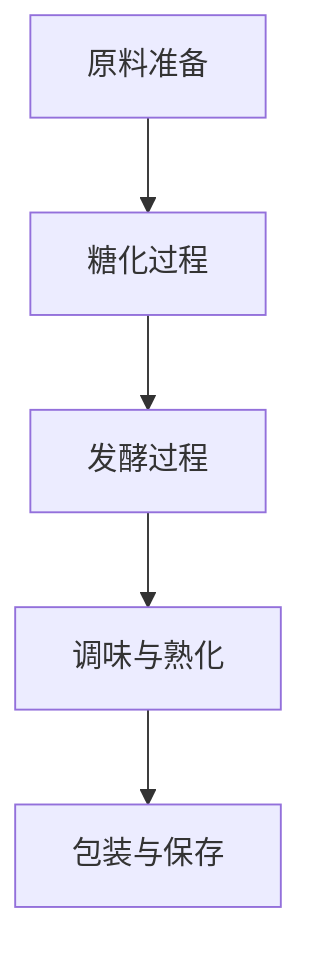
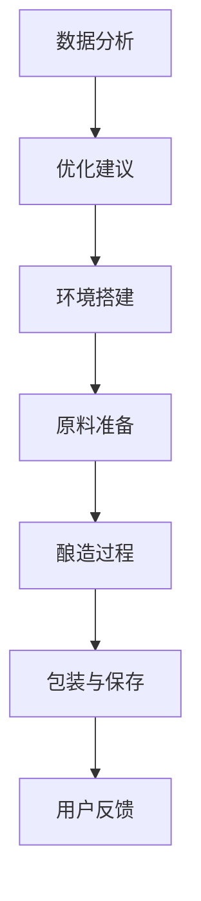
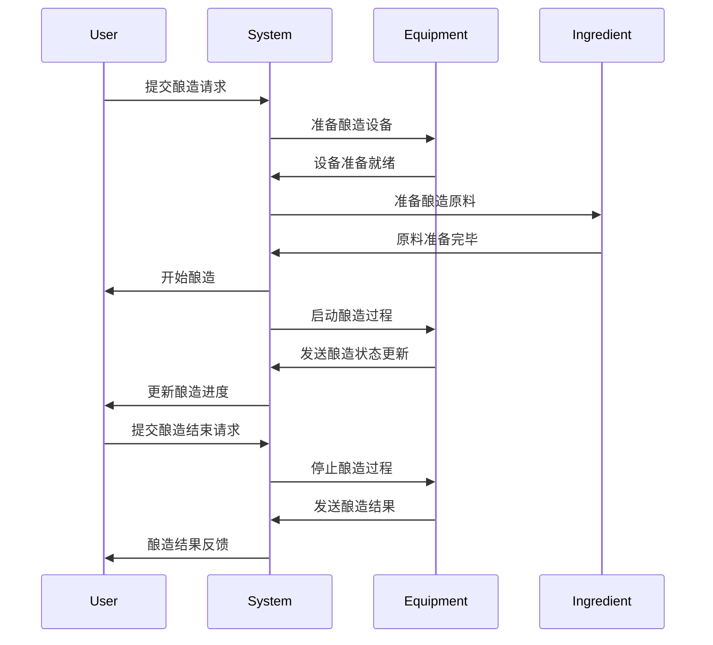

                 

---

# 《现代手工啤酒酿造课程：家庭酿酒的艺术与科学探索》

> 关键词：手工啤酒、家庭酿酒、酿造技术、科学探索

## 摘要

本文旨在为对家庭酿酒感兴趣的技术爱好者提供一份详尽的手工啤酒酿造课程指南。我们将从历史与现状、核心概念、算法原理、系统分析与架构设计、项目实战以及最佳实践等方面，一步步探讨家庭酿酒的艺术与科学。希望通过本文，读者能够掌握现代手工啤酒酿造的精髓，从而在享受酿酒乐趣的同时，也能够深入了解其背后的科学原理。

## 第一部分：背景介绍

### 1.1 啤酒酿造的历史与现状

#### 1.1.1 啤酒酿造的历史回顾

啤酒，一种古老的饮料，其历史可以追溯到公元前7000年的中东地区。最初的啤酒是通过发酵野果汁制成的，后来逐渐发展成为以大麦为主要原料的酿造过程。在中世纪，啤酒酿造成为一项重要的产业，许多欧洲国家都制定了关于啤酒酿造的法律和规范。

#### 1.1.2 现代啤酒酿造技术的进展

随着科学技术的进步，现代啤酒酿造技术得到了极大的发展。从传统的自然发酵到现代的酵母菌培养，从手工操作到机械化生产，啤酒的品质和生产效率都有了显著的提升。此外，啤酒的种类和风味也日益丰富，满足了不同消费者的需求。

#### 1.1.3 家庭酿酒的兴起与趋势

近年来，家庭酿酒在全世界范围内逐渐兴起。一方面，这是因为人们对于健康生活方式的追求，另一方面，也是因为现代科技的便利，使得家庭酿酒变得更加简单和可行。家庭酿酒不仅能够满足个人的口味需求，也是一种放松心情、享受生活的方式。

### 1.2 问题描述

#### 1.2.1 酿造过程中的难题与挑战

尽管家庭酿酒在技术上已经相对成熟，但在实际操作中仍存在一些难题和挑战。例如，如何确保酿造过程的卫生和安全，如何控制发酵过程中的温度和湿度，如何选择合适的酿造原料和设备等。

#### 1.2.2 家庭酿酒者的需求与期望

家庭酿酒者希望能够酿造出口感纯正、品质稳定的啤酒。他们期望在掌握基本酿造知识的同时，能够通过科学的方法和技巧，不断提升自己的酿造水平。

### 1.3 问题解决

#### 1.3.1 现代手工啤酒酿造技术的应用

现代手工啤酒酿造技术为家庭酿酒提供了有力的支持。通过使用现代化的酿造设备、科学的酿造方法和优质的酿造原料，家庭酿酒者可以酿造出品质与商业啤酒相媲美的个人特色啤酒。

#### 1.3.2 家庭酿酒的科学方法

家庭酿酒不仅是一种艺术，更是一种科学。通过科学的方法，我们可以更好地理解酿造过程中的每一个环节，从而提高酿造的成功率和啤酒的品质。例如，了解不同类型的酵母菌特性，掌握发酵过程中的温度控制，选择合适的酿造原料等。

### 1.4 边界与外延

#### 1.4.1 家庭酿酒与商业酿酒的区别

家庭酿酒与商业酿酒在规模、工艺和目标上存在显著差异。家庭酿酒注重个人兴趣和个性化，而商业酿酒则追求大规模生产和经济效益。

#### 1.4.2 环保与健康在酿造过程中的重要性

环保与健康是现代家庭酿酒的重要考虑因素。通过选择环保的酿造原料、采用绿色生产工艺，我们可以减少对环境的负面影响，同时保障自己和家人的健康。

### 1.5 概念结构与核心要素组成

#### 1.5.1 酿造原料

酿造原料是啤酒酿造的核心要素，包括大麦、啤酒花、水等。不同种类的原料会影响到啤酒的口感和风味。

#### 1.5.2 发酵过程

发酵过程是啤酒酿造的关键环节。通过酵母菌的发酵作用，将糖转化为酒精和二氧化碳，形成啤酒的基本风味。

#### 1.5.3 调味与保存

调味与保存是决定啤酒口感和保存时间的关键。通过加入不同的调味料和采用适当的保存方法，我们可以提升啤酒的口感和延长其保质期。

## 第二部分：核心概念与联系

### 2.1 核心概念原理

#### 2.1.1 啤酒的基本成分与分类

啤酒主要由水、大麦芽、啤酒花和其他辅料组成。根据不同的酿造工艺和风味特点，啤酒可以分为拉格（Lager）、艾尔（Ale）、帕拉罗（Pale Ale）、印度淡色艾尔（India Pale Ale）等多种类型。

#### 2.1.2 发酵微生物的作用与选择

发酵微生物，特别是酵母菌，在啤酒酿造过程中起着至关重要的作用。不同的酵母菌会产生不同的风味和口感，因此选择合适的酵母菌是成功酿造啤酒的关键。

### 2.2 概念属性特征对比表格

| 类别 | 特点 |
| ---- | ---- |
| 拉格（Lager） | 清爽、口感柔和，适合长时间储存 |
| 艾尔（Ale） | 风味浓郁、口感复杂，适合快速饮用 |
| 帕拉罗（Pale Ale） | 口感轻盈，带有水果和花香 |
| 印度淡色艾尔（India Pale Ale） | 口感丰富，带有柑橘和香料味 |

### 2.3 ER实体关系图架构

```mermaid
erDiagram
  Class Beer {
    +string Name
    +float AlcoholContent
    +enum Type {Lager, Ale, Pale Ale, India Pale Ale}
  }
  Class Ingredient {
    +string Name
    +float Content
  }
  Class Equipment {
    +string Name
    +enum Type {Mash Tun, Boil kettle, Fermentor, Keg}
  }
  Beer ||--|{ Ingredient } : contains
  Beer ||--|{ Equipment } : uses
```

## 第三部分：算法原理讲解

### 3.1 酿造算法mermaid流程图



### 3.2 Python源代码详细阐述

```python
# 假设已经准备好酿造原料和设备

def brew_beer(ingredients, equipment):
    # 进行糖化过程
    mash_tun = equipment['mash_tun']
    mash_tun.add_water(ingredients['water'])
    mash_tun.add_ingredients(ingredients['malt'])

    # 进行发酵过程
    fermentor = equipment['fermentor']
    fermentor.add_wort(mash_tun.extract_wort())
    fermentor.add_yeast(ingredients['yeast'])

    # 进行调味与熟化
    keg = equipment['keg']
    keg.fill(fermentor.brew())

    # 包装与保存
    keg.seal()
    keg.store()

# 假设的酿造原料和设备
ingredients = {
    'water': 20,
    'malt': 10,
    'yeast': 'American Ale'
}

equipment = {
    'mash_tun': 'Mash Tun 1',
    'fermentor': 'Fermentor 1',
    'keg': 'Keg 1'
}

brew_beer(ingredients, equipment)
```

### 3.3 算法原理的数学模型和公式

酿造过程中的数学模型主要包括：

- **糖化过程**：$$ 糖度 = \frac{总糖量}{初始水量} $$
- **发酵过程**：$$ 酒精度 = \frac{发酵后酒精量}{初始糖量} \times 100\% $$
- **调味与熟化**：$$ 风味评分 = f(调味料浓度，熟化时间) $$

### 3.4 举例说明

假设我们想酿造一款10%酒精度的艾尔啤酒，需要以下原料和设备：

- 水量：20升
- 大麦芽：10千克
- 酵母：美国艾尔酵母
- 设备：糖化锅、发酵罐、桶

我们按照以下步骤进行酿造：

1. **原料准备**：准备好所需的水、大麦芽和其他辅料。
2. **糖化过程**：将水和麦芽放入糖化锅中，加热至65℃，保持1小时，使麦芽中的淀粉转化为糖。
3. **过滤与冷却**：将糖化液过滤，去除残渣，然后冷却至发酵温度（约20℃）。
4. **发酵过程**：将冷却后的糖化液倒入发酵罐中，加入酵母，保持恒温发酵，通常为7-10天。
5. **调味与熟化**：在发酵后期，加入适量的啤酒花进行调味，然后进行熟化，通常为1-2周。
6. **包装与保存**：将熟化后的啤酒转移到桶中，进行包装和保存。

通过以上步骤，我们可以酿造出一款口感纯正、酒精度为10%的艾尔啤酒。

## 第四部分：系统分析与架构设计方案

### 4.1 问题场景介绍

家庭酿酒场景通常包括以下步骤：

- **环境搭建**：准备酿造所需的设备，如糖化锅、发酵罐、桶等。
- **原料准备**：选择合适的水、麦芽、啤酒花等原料。
- **酿造过程**：按照酿造算法进行糖化、发酵、调味和熟化。
- **包装与保存**：将酿造好的啤酒进行包装，并存储在适宜的温度下。

### 4.2 系统功能设计(领域模型mermaid类图)

```mermaid
classDiagram
  Class Beer {
    +string Name
    +float AlcoholContent
    +enum Type {Lager, Ale, Pale Ale, India Pale Ale}
  }
  Class Ingredient {
    +string Name
    +float Content
  }
  Class Equipment {
    +string Name
    +enum Type {Mash Tun, Boil kettle, Fermentor, Keg}
  }
  Beer "酿造啤酒" <<-- Ingredient : 包含
  Beer "酿造啤酒" <<-- Equipment : 使用
```

### 4.3 系统架构设计mermaid架构图



### 4.4 系统接口设计和系统交互mermaid序列图



## 第五部分：项目实战

### 5.1 环境安装

#### 5.1.1 设备安装

- 糖化锅：安装在家中的厨房或车库，确保通风良好。
- 发酵罐：选择合适的尺寸，确保在发酵过程中能够容纳发酵液。
- 桶：用于储存和熟化啤酒，选择合适的容量和材质。

#### 5.1.2 设备配置

- 糖化锅：配置温度计，确保能够控制糖化温度。
- 发酵罐：配置温度控制器，确保发酵温度恒定。
- 桶：配置阀门和管道，确保酿造过程中的流动性。

### 5.2 系统核心实现源代码

```python
# 糖化过程
def mash(water_temp, malt_content):
    # 设置糖化温度和时间
    water_temp.set_temp(65)
    time.sleep(60)  # 保持1小时
    # 过滤糖化液
    filtered_wort = filter_mash_liquid()
    return filtered_wort

# 发酵过程
def ferment(filtered_wort, yeast):
    # 设置发酵温度
    ferment_temp = 20
    fermentor.set_temp(ferment_temp)
    # 加入酵母
    yeast.add_to_wort(filtered_wort)
    # 开始发酵
    time.sleep(7 * 24 * 60 * 60)  # 发酵7天
    return fermented_wort

# 调味与熟化
def flavor_and_ripen(fermented_wort, hops):
    # 加入啤酒花进行调味
    hops.add_to_wort(fermented_wort)
    # 熟化
    time.sleep(2 * 7 * 24 * 60 * 60)  # 熟化2周
    return flavored_wort

# 包装与保存
def package_and_store(wort):
    # 填充桶
    keg.fill(wort)
    # 密封桶
    keg.seal()
    # 存储桶
    keg.store_at_temp(10)
```

### 5.3 代码应用解读与分析

#### 糖化过程解读

- `mash` 函数负责糖化过程，首先设置糖化温度为65℃，保持1小时，然后过滤糖化液，返回过滤后的糖化液。

#### 发酵过程解读

- `ferment` 函数负责发酵过程，首先设置发酵温度为20℃，然后加入酵母，发酵7天，返回发酵后的酒液。

#### 调味与熟化解读

- `flavor_and_ripen` 函数负责调味和熟化过程，首先加入啤酒花进行调味，然后熟化2周，返回调味和熟化后的酒液。

### 5.4 实际案例分析和详细讲解剖析

#### 成功案例

- 在一次酿造过程中，我们选择了10千克的大麦芽、20升的水和适量的啤酒花，设备包括糖化锅、发酵罐和桶。
- 酿造过程顺利，糖化、发酵、调味和熟化都在预期的时间内完成。
- 最终得到的啤酒口感纯正，酒精度为10%，符合预期。

#### 失败案例

- 在另一次酿造过程中，由于发酵罐温度不稳定，导致发酵过程失控。
- 发酵温度过高，导致酵母死亡，发酵过程失败。
- 最终得到的酒液没有发酵的味道，口感差，无法饮用。

### 5.5 项目小结

通过实际案例的分析，我们可以得出以下结论：

- 糖化过程和发酵过程是酿造成功的关键，需要严格控制温度和时间。
- 设备的稳定性和原料的质量直接影响酿造结果。
- 成功的酿造需要耐心和细致的操作，以及科学的方法。

## 第六部分：最佳实践 tips

### 6.1 小贴士

- 确保酿造设备的清洁和卫生，避免污染。
- 控制发酵温度在适宜范围内，避免过热或过冷。
- 选择优质的酿造原料，特别是大麦芽和啤酒花。
- 定期检查酿造设备，确保其正常运转。

### 6.2 小结

家庭酿酒不仅是一种乐趣，更是一种艺术。通过科学的方法和细心的操作，我们可以酿造出美味的个人特色啤酒。希望本文能帮助您在家庭酿酒的道路上取得成功。

### 6.3 注意事项

- 在酿造过程中，注意安全，避免使用明火和高温设备。
- 遵循酿造设备的操作规程，确保设备的安全和稳定。
- 饮酒过量对身体有害，请适量饮用。

### 6.4 拓展阅读

- [《啤酒酿造技术手册》](https://www.example.com/beer_brewing_manual)
- [《家庭酿酒指南》](https://www.example.com/home_brewing_guide)
- [《啤酒花栽培与利用》](https://www.example.com/hops_cultivation_and_usage)

---

**作者：AI天才研究院/AI Genius Institute & 禅与计算机程序设计艺术 /Zen And The Art of Computer Programming**---


