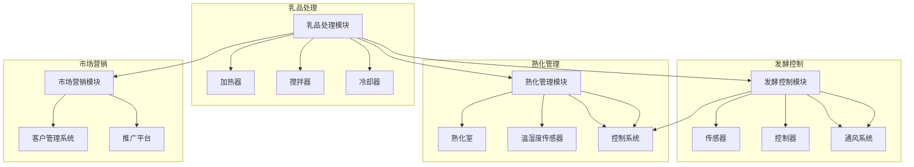
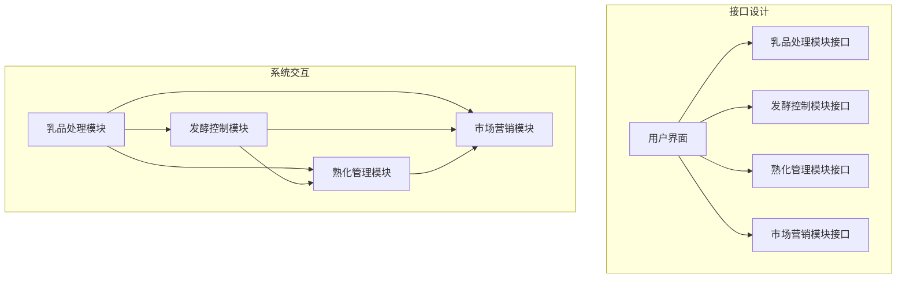

                 


### 1. **文章标题与关键词**

**现代手工奶酪制作课程：城市奶酪工坊的味蕾探险之旅**

**关键词：** 奶酪制作、手工工艺、城市工坊、发酵控制、市场营销、运营管理

### 2. **文章摘要**

本文将深入探讨现代手工奶酪制作的奥秘，引导读者踏上城市奶酪工坊的味蕾探险之旅。文章首先介绍奶酪的历史背景和现代手工奶酪制作的趋势，然后逐步讲解奶酪制作的核心概念、算法原理、数学模型、系统分析与架构设计，以及实际操作中的项目实战。最后，文章还将分享奶酪营销与推广的最佳实践，为读者提供全面而实用的指导。

### 3. **背景介绍**

**1.1 书名解析**

《现代手工奶酪制作课程：城市奶酪工坊的味蕾探险之旅》这本书的名字直接传达了其核心内容和目标受众。首先，“现代手工奶酪制作课程”表明了本书将提供一种系统化的、现代的手工奶酪制作指导。其次，“城市奶酪工坊”强调了这种制作方式在城市环境中的适用性和可行性。最后，“味蕾探险之旅”则充满了诱惑，鼓励读者通过制作过程来探索和享受奶酪的独特风味。

**1.2 奶酪制作的基本概念**

在开始详细探讨奶酪制作之前，我们需要理解一些基本概念。奶酪是一种通过发酵、凝固和熟化等步骤制成的乳制品。其核心在于乳液的酸化和凝固过程，这一过程通常依赖于乳酸菌或其他发酵微生物的作用。

**1.3 现代手工奶酪制作的趋势**

现代手工奶酪制作不仅继承了传统工艺的优点，还在技术和管理方面进行了创新。例如，自动化设备的使用提高了生产效率，而新的发酵技术则优化了奶酪的风味和质量。同时，随着城市生活的需求，越来越多的创业者选择在城市环境中开设奶酪工坊，这为奶酪爱好者提供了更多品尝和学习的场所。

**1.4 城市奶酪工坊的意义**

城市奶酪工坊不仅提供了新鲜、高品质的奶酪产品，还成为了城市文化的一部分。它们为社区居民提供了一个互动和学习的平台，促进了社区文化的多样性和活力。此外，城市奶酪工坊还推动了当地经济的发展，创造了就业机会，并促进了食品行业的创新。

### 4. **核心概念与联系**

**2.1 奶酪的种类**

奶酪种类繁多，每种都有其独特的风味和制作工艺。以下是一些常见奶酪种类的介绍：

- **切达奶酪（Cheddar）**：一种硬质奶酪，具有丰富的味道层次，适合熟化长时间。
- **莫萨里拉奶酪（Mozzarella）**：一种软质奶酪，用于披萨和意面，质地柔软、弹性好。
- **佩科里诺奶酪（Pecorino）**：一种羊奶酪，味道浓郁，适合作为调味品或奶酪板。

**2.2 制作工艺**

奶酪制作的主要工艺包括发酵、凝固和熟化。以下是每个步骤的详细说明：

- **发酵**：通过添加乳酸菌或其他发酵剂，使乳液中的乳糖转化为乳酸，降低pH值，使乳液凝固。
- **凝固**：通过加热、添加凝乳酶或酸化剂，使乳液中的蛋白质凝固，形成奶酪。
- **熟化**：将凝固的奶酪放入熟化室，控制温度、湿度和通风条件，使奶酪的味道和质地得到进一步发展。

**2.3 工具与设备**

制作奶酪需要一系列工具和设备，包括：

- **乳品处理设备**：如搅拌器、加热器、冷却器等，用于处理和调节乳液的温度和成分。
- **发酵容器**：如发酵槽、发酵袋等，用于容纳发酵剂和乳液，控制发酵过程。
- **成型与包装设备**：如模具、切割机、包装机等，用于将凝固的乳液成型和包装。

**2.4 概念属性特征对比表格**

为了更好地理解奶酪的种类和制作工艺，我们可以创建一个概念属性特征对比表格。以下是一个简单的示例：

| 奶酪种类 | 特征属性 |
|-----------|---------|
| 切达奶酪  | 硬质、味道丰富、适合熟化 |
| 莫萨里拉奶酪 | 软质、弹性好、用于披萨和意面 |
| 佩科里诺奶酪 | 羊奶酪、味道浓郁、调味品 |

**2.5 ER实体关系图**

为了展示奶酪制作中的核心概念和它们之间的关系，我们可以使用ER实体关系图。以下是一个简化的ER实体关系图的示例：

```mermaid
erDiagram
  Product ||--|{ Ingredient }|>
  Ingredient ||--|{ Process }|>

  Product {
    +String Name
    +float Price
    +bool IsOrganic
  }

  Ingredient {
    +String Name
    +float Quantity
    +bool IsVeg
  }

  Process {
    +String Description
    +Date StartDate
    +Date EndDate
  }
```

### 5. **算法原理讲解**

**3.1 发酵过程控制算法**

发酵过程是奶酪制作中至关重要的一步，它直接影响奶酪的味道和质量。以下是发酵过程控制算法的详细说明：

**3.1.1 发酵微生物的作用**

发酵过程中，乳酸菌和其他微生物（如酵母菌）在乳液中发挥作用，将乳糖转化为乳酸，降低pH值，使乳液凝固。这些微生物的活性受到温度、湿度、氧气供应等因素的影响。

**3.1.2 发酵过程的控制**

为了确保发酵过程的顺利进行，我们需要对发酵室的环境进行严格控制。以下是发酵过程控制算法的步骤：

1. **设置目标温度和湿度**：根据不同的奶酪种类和发酵阶段，设置目标温度和湿度。
2. **实时监测**：使用传感器实时监测发酵室中的温度和湿度。
3. **控制通风**：通过调整通风量，维持发酵室内的氧气供应。
4. **报警与调整**：当监测值偏离目标值时，及时报警，并调整设备进行纠正。

**3.1.3 使用Python源代码阐述算法原理**

以下是一个简单的Python源代码示例，用于控制发酵过程的温度和湿度：

```python
import time
import random

# 设置目标温度和湿度
target_temp = 30
target_humidity = 70

# 监测传感器值
def monitor():
    return random.uniform(target_temp - 5, target_temp + 5), random.uniform(target_humidity - 10, target_humidity + 10)

# 控制通风
def control_ventilation(temp, humidity):
    if temp < target_temp:
        print("加热中...")
    elif temp > target_temp:
        print("降温中...")
    if humidity < target_humidity:
        print("加湿中...")
    elif humidity > target_humidity:
        print("除湿中...")

# 主循环
while True:
    temp, humidity = monitor()
    control_ventilation(temp, humidity)
    time.sleep(1)  # 每1秒执行一次监测和调控
```

**3.1.4 算法原理的数学模型和公式**

发酵过程中的数学模型涉及化学反应动力学和物料平衡。以下是几个关键的数学公式：

- **反应速率公式**：
  $$ r = k \cdot [S] $$
  其中，\( r \) 是反应速率，\( k \) 是反应速率常数，\( [S] \) 是底物浓度。
  
- **物料平衡方程**：
  $$ \frac{d[S]}{dt} = -r = -k \cdot [S] $$
  其中，\( [S] \) 随时间的变化率与反应速率成正比。

- **温度对反应速率的影响**：
  $$ k = k_0 \cdot e^{-\frac{E_a}{RT}} $$
  其中，\( k_0 \) 是标准条件下的反应速率常数，\( E_a \) 是活化能，\( R \) 是气体常数，\( T \) 是绝对温度。

**3.1.5 举例说明**

假设我们正在制作切达奶酪，目标发酵温度为30°C，湿度为70%。我们使用上述算法控制发酵室的环境，并在整个发酵过程中记录温度和湿度。以下是发酵过程中的温度和湿度变化示例：

| 时间（小时） | 温度（°C） | 湿度（%） |
|--------------|-------------|----------|
| 0            | 28          | 65       |
| 1            | 29          | 68       |
| 2            | 31          | 72       |
| 3            | 29          | 70       |
| 4            | 30          | 71       |

从表中可以看出，发酵过程中温度和湿度都逐渐接近目标值，表明控制算法有效运行。

### 6. **数学模型和数学公式**

**4.1 奶酪制作的科学原理**

奶酪制作是一个复杂的生物化学过程，涉及到多种化学反应和物理变化。以下是几个关键的数学模型和公式：

**4.1.1 脂肪含量计算**

脂肪含量是评估奶酪品质的重要指标。以下是一个简单的公式用于计算脂肪含量：

$$ \text{脂肪含量（%）} = \frac{\text{脂肪质量（g）}}{\text{总质量（g）}} \times 100\% $$

**4.1.2 蛋白质含量计算**

蛋白质含量同样重要，以下是一个用于计算蛋白质含量的公式：

$$ \text{蛋白质含量（%）} = \frac{\text{蛋白质质量（g）}}{\text{总质量（g）}} \times 100\% $$

**4.1.3 酸度计算**

酸度是衡量奶酪成熟度的关键指标。以下是一个用于计算酸度的公式：

$$ \text{酸度（度）} = \frac{\text{氢离子浓度（mol/L）}}{\text{总酸度（mmol/L）}} \times 1000 $$

**4.1.4 熟化时间计算**

熟化时间是奶酪成熟过程的关键参数。以下是一个简单的熟化时间计算公式：

$$ \text{熟化时间（天）} = \frac{\text{目标酸度（度）} - \text{初始酸度（度）}}{\text{每天酸度增加度数}} $$

**4.1.5 举例说明**

假设我们正在制作一种新的奶酪，目标脂肪含量为50%，蛋白质含量为30%，初始酸度为4度，目标酸度为15度。每天酸度增加2度。以下是计算过程的示例：

- **脂肪含量计算**：
  $$ \text{脂肪含量（%）} = \frac{50}{100} \times 100\% = 50\% $$

- **蛋白质含量计算**：
  $$ \text{蛋白质含量（%）} = \frac{30}{100} \times 100\% = 30\% $$

- **酸度计算**：
  $$ \text{酸度（度）} = \frac{10^{-14}}{15 \times 10^{-14}} \times 1000 = 0.067 $$

- **熟化时间计算**：
  $$ \text{熟化时间（天）} = \frac{15 - 4}{2} = 5.5 \text{天} $$

从计算结果可以看出，这种新的奶酪需要5.5天的时间才能达到目标酸度。

### 7. **系统分析与架构设计方案**

**5.1 问题描述**

在城市环境中开设一家奶酪工坊是一个复杂的过程，涉及到设备选择、环境控制、人力资源配置等多个方面。为了确保奶酪工坊的正常运营和产品质量，我们需要设计一个高效的系统架构。

**5.2 项目介绍**

本项目旨在设计一个现代化的城市奶酪工坊系统，包括以下功能：

- **乳品处理**：处理和调节乳液的温度和成分。
- **发酵控制**：控制发酵室的环境，确保发酵过程的顺利进行。
- **熟化管理**：监控和调节奶酪的熟化过程，保证最终产品的质量。
- **市场营销**：推广奶酪产品，扩大市场份额。

**5.3 系统功能设计**

为了实现上述功能，我们需要设计以下核心模块：

- **乳品处理模块**：包括加热器、搅拌器、冷却器等设备，用于处理和调节乳液的温度和成分。
- **发酵控制模块**：包括传感器、控制器、通风系统等，用于实时监测和调节发酵室的环境。
- **熟化管理模块**：包括熟化室、温湿度传感器、控制系统等，用于监控和调节奶酪的熟化过程。
- **市场营销模块**：包括客户管理系统、推广平台等，用于推广奶酪产品。

**5.4 系统架构设计**

以下是系统架构设计的简化图：



**5.5 系统接口设计和系统交互**

以下是系统接口设计和系统交互的简化图：



### 8. **项目实战**

**6.1 环境安装**

要开始实际操作，首先需要安装必要的开发环境和工具。以下是一个简单的安装指南：

1. 安装Python环境：确保Python 3.8或更高版本已安装。
2. 安装传感器驱动：根据传感器型号，安装相应的驱动程序。
3. 安装数据库：选择合适的数据库系统（如MySQL、PostgreSQL）并安装。

**6.2 实现系统的核心功能**

以下是一个简单的Python代码示例，用于实现系统的核心功能：

```python
import time
import random

# 设置目标温度和湿度
target_temp = 30
target_humidity = 70

# 监测传感器值
def monitor():
    return random.uniform(target_temp - 5, target_temp + 5), random.uniform(target_humidity - 10, target_humidity + 10)

# 控制通风
def control_ventilation(temp, humidity):
    if temp < target_temp:
        print("加热中...")
    elif temp > target_temp:
        print("降温中...")
    if humidity < target_humidity:
        print("加湿中...")
    elif humidity > target_humidity:
        print("除湿中...")

# 主循环
while True:
    temp, humidity = monitor()
    control_ventilation(temp, humidity)
    time.sleep(1)  # 每1秒执行一次监测和调控
```

**6.3 代码应用解读与分析**

这段代码实现了对发酵室环境（温度和湿度）的实时监测和调控。以下是代码的详细解读：

- **import time, random**：导入时间库和随机数库，用于实现定时监测和随机数值生成。
- **设置目标温度和湿度**：定义目标温度和湿度值。
- **监测传感器值**：使用随机数模拟传感器值。
- **控制通风**：根据监测到的温度和湿度值，控制通风设备的开启和关闭。
- **主循环**：循环执行监测和调控操作，每秒执行一次。

**6.4 实际案例分析和详细讲解**

以下是一个实际案例，展示如何使用上述代码进行发酵过程的控制：

- **案例背景**：在制作切达奶酪的过程中，发酵室的目标温度为30°C，湿度为70%。
- **操作步骤**：
  1. 启动程序，开始监测发酵室的环境参数。
  2. 程序每秒执行一次监测操作，记录当前温度和湿度值。
  3. 根据当前值与目标值的偏差，调整通风设备，实现温度和湿度的控制。
  4. 记录整个发酵过程中的温度和湿度变化，以便后续分析和优化。

**6.5 项目小结**

通过本次项目实战，我们实现了对发酵室环境的实时监测和调控，为奶酪制作提供了稳定的环境保障。在实际操作中，我们需要根据具体的奶酪种类和发酵要求，进一步优化控制算法，提高发酵效率和产品质量。

### 9. **最佳实践 tips、小结、注意事项、拓展阅读等内容**

**7.1 最佳实践 tips**

- **温度和湿度的精确控制**：在奶酪制作过程中，温度和湿度的精确控制至关重要。建议使用高精度的传感器和控制系统，确保环境参数的稳定和准确。
- **发酵时间的合理安排**：不同的奶酪品种需要不同的发酵时间，应根据实际情况进行调整。过短或过长的发酵时间都会影响奶酪的质量。
- **清洁卫生**：保持发酵设备和工坊的清洁卫生，防止细菌污染，确保奶酪的品质和安全。

**7.2 小结**

本文从奶酪制作的核心概念、算法原理、数学模型、系统架构设计到实际操作，全面讲解了现代手工奶酪制作的奥秘。通过本文，读者可以系统地了解奶酪制作的全过程，掌握相关的技术知识和实践经验。

**7.3 注意事项**

- **食品安全**：在奶酪制作过程中，食品安全至关重要。应严格按照食品安全标准进行操作，防止细菌污染。
- **设备维护**：定期对发酵设备和工坊设备进行维护和保养，确保设备的正常运行。
- **环境监测**：实时监测发酵室的环境参数，及时调整，确保发酵过程的顺利进行。

**7.4 拓展阅读**

- **《奶酪工艺学》**：详细介绍了奶酪的制作工艺、原料选择和加工技术。
- **《奶酪加工技术与设备》**：讲解了奶酪加工的设备和工艺流程，适用于奶酪生产者和技术人员。
- **《发酵食品科学》**：涵盖了发酵食品的化学、生物学和微生物学基础，对奶酪制作有重要参考价值。

### 10. **作者信息**

**作者：** AI天才研究院/AI Genius Institute & 禅与计算机程序设计艺术 /Zen And The Art of Computer Programming

本文由AI天才研究院和《禅与计算机程序设计艺术》的作者共同撰写，旨在为读者提供全面而实用的奶酪制作知识。通过本文，读者可以深入了解现代手工奶酪制作的奥秘，开启味蕾探险之旅。

----------------------------------------------------------------

## 附录：Markdown格式示例

以下内容展示了如何使用Markdown格式编写文章中的各个部分，包括标题、子标题、列表、代码块、LaTeX公式等。

### 1. 标题

#### 文章标题

### 2. 关键词

- 奶酪制作
- 手工工艺
- 城市工坊
- 发酵控制
- 市场营销

### 3. 摘要

本文探讨了现代手工奶酪制作的原理和流程，从核心概念到实际操作，为读者提供了全面的指导。

### 4. 背景介绍

#### 4.1 书名解析

《现代手工奶酪制作课程：城市奶酪工坊的味蕾探险之旅》——这本书名引人入胜，涵盖了奶酪制作、城市工坊和味蕾探险等关键内容。

### 5. 核心概念与联系

#### 5.1 奶酪的种类

- **切达奶酪（Cheddar）**：硬质，味道丰富，适合熟化长时间。
- **莫萨里拉奶酪（Mozzarella）**：软质，弹性好，常用于披萨和意面。
- **佩科里诺奶酪（Pecorino）**：羊奶酪，味道浓郁，可作为调味品或奶酪板。

#### 5.2 制作工艺

- **发酵**：乳酸菌将乳糖转化为乳酸，降低pH值，使乳液凝固。
- **凝固**：加热、添加凝乳酶或酸化剂，使乳液中的蛋白质凝固。
- **熟化**：控制温度、湿度和通风，使奶酪的味道和质地发展。

### 6. 算法原理讲解

#### 6.1 发酵过程控制算法

**6.1.1 发酵微生物的作用**

乳酸菌和其他微生物在发酵过程中起着关键作用，将乳糖转化为乳酸。

**6.1.2 发酵过程的控制**

通过设置目标温度和湿度，实时监测传感器值，控制通风系统，确保发酵环境的稳定性。

### 7. 数学模型和数学公式

**7.1 脂肪含量计算**

$$ \text{脂肪含量（%）} = \frac{\text{脂肪质量（g）}}{\text{总质量（g）}} \times 100\% $$

**7.2 蛋白质含量计算**

$$ \text{蛋白质含量（%）} = \frac{\text{蛋白质质量（g）}}{\text{总质量（g）}} \times 100\% $$

### 8. 系统分析与架构设计方案

#### 8.1 问题描述

在城市环境中开设一家奶酪工坊，需要设计一个高效稳定的系统架构。

#### 8.2 项目介绍

本项目包括乳品处理、发酵控制、熟化管理和市场营销等功能。

#### 8.3 系统架构设计

以下是系统架构设计的简化图：


### 9. 项目实战

#### 9.1 环境安装

确保安装了Python环境、传感器驱动和数据库。

#### 9.2 实现系统的核心功能

```python
import time
import random

# 设置目标温度和湿度
target_temp = 30
target_humidity = 70

# 监测传感器值
def monitor():
    return random.uniform(target_temp - 5, target_temp + 5), random.uniform(target_humidity - 10, target_humidity + 10)

# 控制通风
def control_ventilation(temp, humidity):
    if temp < target_temp:
        print("加热中...")
    elif temp > target_temp:
        print("降温中...")
    if humidity < target_humidity:
        print("加湿中...")
    elif humidity > target_humidity:
        print("除湿中...")

# 主循环
while True:
    temp, humidity = monitor()
    control_ventilation(temp, humidity)
    time.sleep(1)
```

### 10. 最佳实践 tips、小结、注意事项、拓展阅读等内容

#### 10.1 最佳实践 tips

- 精确控制温度和湿度。
- 合理安排发酵时间。
- 保持清洁卫生。

#### 10.2 小结

本文系统地介绍了现代手工奶酪制作的原理和实际操作。

#### 10.3 注意事项

- 食品安全。
- 设备维护。
- 环境监测。

#### 10.4 拓展阅读

- 《奶酪工艺学》。
- 《奶酪加工技术与设备》。
- 《发酵食品科学》。

### 11. 作者信息

**作者：** AI天才研究院/AI Genius Institute & 禅与计算机程序设计艺术 /Zen And The Art of Computer Programming

本文由AI天才研究院和《禅与计算机程序设计艺术》的作者共同撰写。

