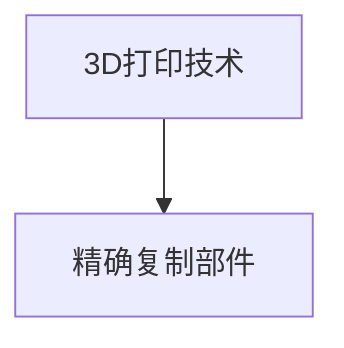
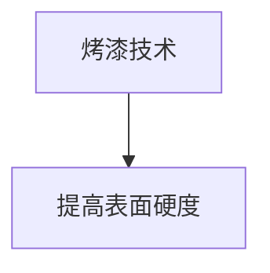
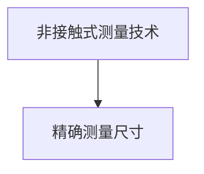

                 

### 现代手工家具修复的背景与重要性

在现代社会的快速发展中，物质生活的丰富与消费水平的提升带来了大量的废弃物品。特别是在家具行业，每年都会产生大量的旧家具，这些旧家具不仅占用了大量的空间，还对环境造成了负担。如何有效处理这些旧家具，实现资源的再利用和环境的可持续发展，已经成为一个亟待解决的问题。因此，现代手工家具修复技术应运而生，它不仅能够延长家具的使用寿命，还能通过修复旧物，赋予其新的生命力，为可持续生活实践提供了新的思路。

**1.1 手工家具修复的背景**

**1.1.1 问题的提出**

随着经济的发展，人们对生活品质的追求不断提高，家具的更新换代速度也在加快。大量的旧家具被淘汰，不仅浪费了宝贵的资源，也对环境造成了严重的污染。据统计，全球每年约有2500万吨的家具被废弃，其中有很大一部分是可以通过修复再利用的。如何合理处理这些旧家具，实现资源的有效利用，成为了一个亟待解决的问题。

**1.1.2 问题描述**

旧家具的废弃问题主要体现在以下几个方面：

1. **资源浪费**：大量的木材、金属等原材料被废弃，造成了资源的浪费。
2. **环境污染**：旧家具的废弃会带来垃圾围城、填埋场过度使用等问题，严重污染环境。
3. **经济负担**：旧家具的处理成本高，对家庭和社会造成了一定的经济负担。

**1.1.3 问题解决**

针对上述问题，现代手工家具修复技术提供了一种有效的解决方案。通过修复旧家具，不仅能够延长其使用寿命，还能减少废弃物的产生，降低环境负担。此外，修复后的家具往往能够焕发新的生命力，满足人们对美观和实用的需求。

**1.1.4 边界与外延**

手工家具修复的范围包括各种材质的家具，如木材、金属、玻璃、陶瓷等。它不仅适用于家庭日常家具的修复，也适用于博物馆、古董店等特定场景的家具修复。此外，手工家具修复还涉及到材料学、工艺学、设计学等多个领域，是一门综合性的技术。

**1.2 手工家具修复的重要性**

**1.2.1 可持续生活的重要性**

可持续生活是指在社会、经济和环境三个方面的平衡发展中，实现资源的合理利用和环境的保护。手工家具修复作为一种可持续生活实践，具有重要意义：

1. **资源节约**：通过修复旧家具，能够充分利用已有的资源，减少对新材料的需求。
2. **环境保护**：减少废弃物的产生，降低对环境的负担，有助于实现绿色发展。
3. **经济效益**：修复旧家具比购买新家具成本更低，能够节约家庭和社会的经济支出。

**1.2.2 手工家具修复在可持续生活中的作用**

1. **减少浪费**：修复旧家具能够减少资源的浪费，有助于实现资源的循环利用。
2. **促进环保**：通过修复旧家具，可以减少废弃物的产生，降低环境污染。
3. **提升生活品质**：修复后的家具往往能够焕发新的生命力，满足人们对美观和实用的需求。
4. **文化传承**：手工家具修复过程中，会涉及到传统工艺和文化的传承，有助于保护和发扬传统文化。

**1.2.3 手工家具修复的经济效益**

1. **成本节约**：修复旧家具的成本远远低于购买新家具，对于家庭和社会来说，能够节约大量的经济支出。
2. **就业机会**：手工家具修复需要大量的手工技艺和专业知识，能够为社会创造就业机会，促进经济发展。
3. **产业链发展**：手工家具修复的兴起，将会带动相关产业的发展，如材料供应、工具制造、设计服务等。

### 总结

手工家具修复作为一种可持续生活实践，不仅能够解决旧家具废弃带来的资源浪费和环境问题，还能带来经济效益和社会效益。通过本文的介绍，我们希望能够让更多的人了解手工家具修复的重要性，并积极参与到这项实践中来，共同为可持续发展贡献力量。

----------------------------------------------------------------

## 第二部分：核心概念与联系

在深入探讨现代手工家具修复技术之前，我们需要了解一些核心概念，包括材料学、工艺学和设计学。这些概念是手工家具修复的基础，也是理解修复过程和成果的关键。在本章中，我们将详细介绍这些核心概念，并通过概念属性特征对比表格和Mermaid ER实体关系图来帮助读者更好地理解。

### 2.1 材料学基础

材料学是研究材料的结构、性质、加工和使用的一门科学。在手工家具修复中，材料学的作用尤为重要，因为不同的材料具有不同的物理和化学特性，直接影响到修复效果和家具的使用寿命。

**2.1.1 常见木材特性**

木材是家具制作中最常用的材料之一，其优点包括天然、环保、美观和耐用。以下是一些常见木材的特性：

| 木材种类 | 特性 |
| --- | --- |
| 柚木 | 良好的耐久性和防水性 |
| 枫木 | 细腻的纹理和良好的弹性 |
| 橡木 | 良好的强度和耐磨性 |
| 桦木 | 价格较低，易于加工 |

**2.1.2 铁艺材料的特性**

铁艺家具具有独特的艺术性和实用性，常用于户外和室内装饰。以下是一些常见铁艺材料的特性：

| 材料种类 | 特性 |
| --- | --- |
| 碳钢 | 强度高，易加工 |
| 不锈钢 | 耐腐蚀，耐用 |
| 铁铸件 | 艺术性强，质感独特 |

**2.1.3 玻璃与陶瓷的特性**

玻璃和陶瓷在家具修复中也有广泛的应用，特别是在装饰性家具中。以下是一些常见玻璃与陶瓷材料的特性：

| 材料种类 | 特性 |
| --- | --- |
| 玻璃 | 轻巧，透明度高 |
| 陶瓷 | 耐热，硬度高 |
| 钢化玻璃 | 安全，抗冲击 |

### 2.2 工艺学基础

工艺学是研究生产过程中各种操作方法、技术、设备和工具的应用的科学。在手工家具修复中，工艺学的作用同样至关重要，它决定了修复的质量和效率。

**2.2.1 传统工艺**

传统工艺包括打磨、涂漆、雕刻、粘合等。这些工艺往往需要手工技艺和丰富的经验，具有独特的艺术性和传承价值。以下是一些传统工艺的特点：

| 工艺名称 | 特点 |
| --- | --- |
| 打磨 | 提高表面光滑度 |
| 涂漆 | 保护木材，增加美观 |
| 雕刻 | 增加装饰性，体现艺术性 |
| 粘合 | 修复破损，保持结构完整 |

**2.2.2 现代工艺**

现代工艺包括电镀、烤漆、3D打印等。这些工艺利用现代技术和设备，提高了修复的效率和精度。以下是一些现代工艺的特点：

| 工艺名称 | 特点 |
| --- | --- |
| 电镀 | 提高耐腐蚀性和美观性 |
| 烤漆 | 提高表面硬度，增加色彩多样性 |
| 3D打印 | 精确度高，可实现复杂结构 |

**2.2.3 工艺选择**

在选择修复工艺时，需要综合考虑家具的材料、破损程度、修复目的和预算等因素。以下是一个简单的选择指南：

| 材料与破损程度 | 适合工艺 |
| --- | --- |
| 旧木家具，轻微破损 | 打磨、涂漆 |
| 铁艺家具，锈蚀严重 | 电镀、烤漆 |
| 玻璃家具，局部破损 | 粘合、烤漆 |

### 2.3 设计学基础

设计学是研究如何通过创造性的方式解决问题的学科。在家具修复中，设计学的作用主要体现在如何通过设计理念提升家具的美观性和实用性。

**2.3.1 家具设计的原则**

在家具设计过程中，需要遵循以下原则：

| 原则 | 说明 |
| --- | --- |
| 功能性 | 满足使用需求 |
| 美观性 | 迎合审美标准 |
| 环保性 | 利用可再生材料 |
| 经济性 | 控制成本 |

**2.3.2 设计与修复的结合**

在修复过程中，设计学的作用尤为重要。通过设计，可以提升家具的修复效果和艺术价值。以下是一些具体的设计方法：

| 设计方法 | 说明 |
| --- | --- |
| 色彩搭配 | 提高视觉效果 |
| 空间利用 | 增加家具功能 |
| 材料创新 | 提高家具性能 |

### 2.4 概念属性特征对比表格

为了更清晰地展示不同材料、工艺和设计原则的特性，我们可以使用以下对比表格：

| 概念 | 特性1 | 特性2 | 特性3 |
| --- | --- | --- | --- |
| 木材 | 天然、环保 | 美观、耐用 | 易于加工 |
| 铁艺 | 强度高 | 耐腐蚀 | 艺术性强 |
| 玻璃 | 轻巧、透明 | 耐热、硬度高 | 安全、抗冲击 |
| 传统工艺 | 手工技艺、艺术性 | 经验丰富 | 传承文化 |
| 现代工艺 | 高效、精准 | 现代化设备 | 精细加工 |
| 设计原则 | 功能性、美观性 | 环保性、经济性 | 可持续性 |

### 2.5 Mermaid ER实体关系图

为了更好地理解手工家具修复中的各个实体及其关系，我们可以使用Mermaid ER实体关系图来展示。以下是一个简单的Mermaid ER图示例：

```mermaid
erDiagram
  Furniture ||--|{ Material }
  Furniture ||--|{ RestorationTechnique }
  Furniture ||--|{ DesignPrinciple }
  Material  ||--|{ Wood }
  Material  ||--|{ Ironcraft }
  Material  ||--|{ Glass }
  RestorationTechnique ||--|{ TraditionalTechnique }
  RestorationTechnique ||--|{ ModernTechnique }
  DesignPrinciple ||--|{ Functionality }
  DesignPrinciple ||--|{ Aesthetics }
  DesignPrinciple ||--|{ Sustainability }
```

在这个图中，`Furniture`（家具）是中心实体，与`Material`（材料）、`RestorationTechnique`（修复工艺）和`DesignPrinciple`（设计原则）建立了关系。每个材料、修复工艺和设计原则又分别与其子实体建立了关系，形成了完整的实体关系网络。

通过上述内容，我们不仅了解了手工家具修复的核心概念，还通过对比表格和Mermaid ER图，更加清晰地展示了这些概念之间的联系。接下来，我们将深入探讨手工家具修复的方法与工具。

----------------------------------------------------------------

### 第3章：手工家具修复的方法与工具

在现代手工家具修复中，选择合适的方法和工具是确保修复质量和效率的关键。本章将详细介绍几种常见的修复方法，并探讨如何使用现代技术结合传统工艺，提高修复效果。同时，还会介绍修复过程中所需的各种工具及其使用方法。

#### 3.1 传统手工家具修复方法

**3.1.1 木材修复**

木材是家具制作中最常用的材料，木材修复的方法主要包括以下几种：

1. **打磨**：使用砂纸或打磨机对木材表面进行打磨，去除损坏部分和旧涂层，使木材表面光滑。

   ```mermaid
   graph TD
   A[打磨] --> B[去除损坏部分]
   A --> C[去除旧涂层]
   A --> D[使木材表面光滑]
   ```

2. **涂漆**：在打磨后的木材表面涂上新的漆层，以保护木材并增加美观性。涂漆前需进行底漆处理。

   ```mermaid
   graph TD
   E[涂底漆] --> F[涂面漆]
   ```

3. **粘合**：使用粘合剂将破损的木块重新粘合在一起，确保结构完整。

   ```mermaid
   graph TD
   G[使用粘合剂] --> H[粘合破损部分]
   ```

**3.1.2 铁艺修复**

铁艺家具由于其特殊的艺术性和耐久性，常用于户外和室内装饰。铁艺修复的方法主要包括以下几种：

1. **清洁**：使用钢丝刷或砂纸清洁铁艺表面，去除锈蚀和污垢。

   ```mermaid
   graph TD
   I[清洁] --> J[去除锈蚀]
   I --> K[去除污垢]
   ```

2. **电镀**：在清洁后的铁艺表面进行电镀处理，以防止进一步锈蚀并增加美观性。

   ```mermaid
   graph TD
   L[电镀处理] --> M[增加美观性]
   ```

3. **烤漆**：在电镀后，对铁艺表面进行烤漆处理，以增加表面的硬度和色彩多样性。

   ```mermaid
   graph TD
   N[烤漆处理] --> O[增加表面硬度]
   ```

**3.1.3 玻璃与陶瓷修复**

玻璃与陶瓷修复主要涉及表面修复和结构修复。以下是一些常见的修复方法：

1. **表面修复**：使用玻璃修补剂或陶瓷修补剂修复破损部分，使表面恢复平整。

   ```mermaid
   graph TD
   P[使用修补剂] --> Q[修复破损部分]
   ```

2. **结构修复**：使用粘合剂将破损的玻璃或陶瓷碎片重新粘合在一起，确保结构完整。

   ```mermaid
   graph TD
   R[使用粘合剂] --> S[粘合破损部分]
   ```

#### 3.2 现代技术结合修复

随着科技的进步，现代技术在手工家具修复中得到了广泛应用。以下是一些结合现代技术的修复方法：

**3.2.1 3D打印技术**

3D打印技术可以用于制作家具的零部件，特别是在修复损坏的部分时，可以精确地复制出原有部件的形状和结构。



**3.2.2 烤漆技术**

烤漆技术是一种将油漆高温烘烤至固化的一种工艺，可以用于铁艺和木材家具的修复。这种技术可以提高家具表面的硬度和耐久性。



**3.2.3 非接触式测量技术**

非接触式测量技术，如激光扫描仪，可以精确地测量家具的尺寸和形状，为修复工作提供准确的参数。



#### 3.3 修复工具的使用

在手工家具修复过程中，使用适当的工具可以显著提高修复效果和效率。以下是一些常用的修复工具及其使用方法：

**3.3.1 砂纸与打磨机**

砂纸和打磨机用于木材和铁艺家具的打磨，以去除损坏部分和旧涂层，使表面光滑。

- **使用方法**：将砂纸固定在打磨机上，根据需要调整砂纸的粗细程度，沿着家具的纹理进行打磨。

**3.3.2 粘合剂与注射器**

粘合剂用于木材、玻璃和陶瓷的粘合，注射器用于将粘合剂精确地注入到修复部位。

- **使用方法**：根据材质选择合适的粘合剂，使用注射器将粘合剂均匀地注入到破损部分，确保粘合牢固。

**3.3.3 钢丝刷与清洁剂**

钢丝刷和清洁剂用于清洁铁艺表面的锈蚀和污垢。

- **使用方法**：将钢丝刷浸泡在清洁剂中，刷洗铁艺表面，然后用清水冲洗干净。

**3.3.4 电镀设备及烤漆设备**

电镀设备和烤漆设备用于铁艺家具的电镀和烤漆处理。

- **使用方法**：根据电镀和烤漆的具体工艺要求，将铁艺家具放置在电镀槽或烤漆室内，按照操作步骤进行电镀或烤漆。

通过上述内容，我们详细介绍了现代手工家具修复的方法与工具。接下来，我们将探讨如何在日常生活中实践可持续生活，通过修复旧物来减少浪费和促进循环经济。

----------------------------------------------------------------

## 第三部分：可持续生活实践

在现代社会的快速发展中，人们对物质生活的追求不断提高，这导致了大量的废弃物产生。特别是在家具行业，每年都会产生大量的旧家具，这些旧家具不仅占用了大量的空间，还对环境造成了负担。因此，如何在日常生活中实践可持续生活，通过修复旧物来减少浪费和促进循环经济，已经成为一个亟待解决的问题。本章将详细探讨这一主题。

### 3.1 可持续生活的理念

可持续生活是一种在满足当前需求的同时，不损害子孙后代满足其需求的能力的生活方式。它强调资源的合理利用、环境的保护和经济的可持续发展。在可持续生活中，修复旧物是一种重要的实践方式，它不仅可以减少废弃物的产生，还能延长物品的使用寿命，降低资源的消耗。

### 3.2 修复旧物的优点

**3.2.1 减少浪费**

修复旧物可以有效地减少废弃物的产生。通过修复，我们可以将旧家具重新利用，避免其成为垃圾填埋场的一部分。据统计，修复一件旧家具可以节省相当于制造新家具所需70%的资源。

**3.2.2 保护环境**

修复旧物可以减少对环境的负担。废弃物的处理过程会产生大量的污染物，包括填埋、焚烧等，这些都会对环境造成污染。通过修复旧物，我们可以减少这些污染物的产生，降低对环境的破坏。

**3.2.3 经济效益**

修复旧物比购买新家具成本更低。虽然修复可能需要一定的技术和材料成本，但总体来说，修复旧物的成本远远低于购买新家具。此外，修复后的家具往往能够保持原有的品质和美观，甚至还能提升其价值。

**3.2.4 促进循环经济**

修复旧物可以促进循环经济的发展。循环经济是一种以资源的高效利用和再生为核心的经济模式，通过修复旧物，我们可以将废弃物转化为新的资源，实现资源的循环利用。

### 3.3 如何在日常生活中实践可持续生活

**3.3.1 家具修复**

在家具方面，我们可以通过以下几种方式实践可持续生活：

1. **定期维护**：对家具进行定期的清洁和维护，防止家具因长期使用而损坏。

2. **局部修复**：当家具出现局部损坏时，可以对其进行修复，而不是直接更换。

3. **改造与翻新**：将旧家具进行改造或翻新，使其符合现代审美和使用需求。

**3.3.2 旧物利用**

在日常生活中，我们还可以通过以下方式利用旧物：

1. **变废为宝**：将废弃的物品转化为有用的物品，如将旧衣裳制作成布艺装饰品。

2. **二手交易**：通过二手市场或线上平台，将不再使用的物品出售或交换。

3. **创意设计**：利用旧物进行创意设计，创造出独特且有价值的作品。

**3.3.3 环保消费**

在消费过程中，我们可以通过以下方式实践可持续生活：

1. **减少购买**：减少不必要的购物，避免产生更多的废弃物。

2. **购买二手**：在购买家具和其他物品时，优先考虑二手物品。

3. **环保材料**：在购买家具和其他物品时，优先选择环保材料制作的物品。

### 3.4 修复旧物的挑战与解决方案

**3.4.1 技术难度**

修复旧物可能需要一定的技术知识和经验，对于不具备相关技能的人来说可能存在一定的难度。为了解决这一问题，可以采取以下措施：

1. **培训与教育**：通过培训和教育，提高公众的修复技能。

2. **工具租赁**：提供修复工具的租赁服务，方便不具备修复技能的人进行修复。

**3.4.2 成本问题**

修复旧物可能需要一定的成本，包括修复材料、工具和人力等。为了降低成本，可以采取以下措施：

1. **资源整合**：通过整合资源和降低成本，提高修复的经济性。

2. **政府支持**：政府可以提供资金和政策支持，鼓励修复旧物的实践。

**3.4.3 市场接受度**

修复旧物在市场上可能面临接受度不高的问题。为了提高市场接受度，可以采取以下措施：

1. **宣传推广**：通过宣传和推广，提高公众对修复旧物的认识和理解。

2. **质量保证**：通过提供优质的服务和保证修复质量，增强消费者对修复旧物的信任。

### 3.5 结论

修复旧物是实践可持续生活的一种有效方式。通过修复旧物，我们不仅可以减少废弃物的产生，保护环境，还能节约资源，促进经济的可持续发展。在日常生活中，我们可以通过定期维护、局部修复、改造翻新、旧物利用和环保消费等方式，积极参与到修复旧物的实践中。同时，政府和相关机构也应采取措施，提供支持和鼓励，推动修复旧物的普及和发展。

通过上述内容的探讨，我们深入了解了如何在日常生活中实践可持续生活，通过修复旧物来减少浪费和促进循环经济。接下来，我们将通过具体案例，进一步展示手工家具修复的实际效果。

----------------------------------------------------------------

## 第四部分：案例分析

在实际应用中，手工家具修复不仅能够延长家具的使用寿命，还能通过创新和艺术性提升家具的价值。以下是几个典型的手工家具修复案例，我们将详细描述修复过程、修复后的效果及其对可持续生活的影响。

### 4.1 案例一：古董桌椅的修复

**修复过程：**

1. **初期评估**：首先对古董桌椅进行全面的评估，检查木材的磨损程度、结构的稳定性以及表面的涂料状况。

2. **清洁与脱漆**：使用钢丝刷和溶剂去除表面的污垢和旧涂层，确保修复表面干净。

3. **结构加固**：对于结构受损的部分，使用木条进行加固，以确保桌椅的稳定性。

4. **打磨与涂漆**：使用砂纸对修复表面进行打磨，确保表面光滑。然后涂上新的环保漆，以保护木材并恢复其光泽。

**修复效果：**

修复后的古董桌椅焕然一新，结构稳定，表面光滑，色彩和谐。不仅恢复了其原有的美观性，还增加了使用寿命。

**影响：**

通过修复古董桌椅，不仅保留了珍贵的文化遗产，还避免了将其丢弃带来的环境负担。修复后的家具不仅具有艺术价值，还能继续为家庭生活服务，体现了可持续生活的理念。

### 4.2 案例二：铁艺桌椅的翻新

**修复过程：**

1. **清洗与除锈**：使用钢丝刷和除锈剂清除铁艺表面的锈蚀和污垢。

2. **电镀处理**：对清洁后的铁艺表面进行电镀处理，以防止进一步的锈蚀。

3. **烤漆**：在电镀后，对铁艺表面进行烤漆处理，以增加表面的硬度和色彩多样性。

4. **细节修复**：对于局部损伤的部分，使用粘合剂进行修复，确保铁艺桌椅的整体美观和稳定性。

**修复效果：**

修复后的铁艺桌椅表面光滑，色彩鲜艳，具有独特的艺术感。铁艺材质的坚固性和美观性得到了极大的提升。

**影响：**

通过翻新铁艺桌椅，不仅恢复了家具的使用功能，还增强了其艺术价值。翻新后的铁艺桌椅在户外和室内均能展现出独特的魅力，为生活空间增添了艺术氛围，同时也减少了废弃物的产生，符合可持续发展的理念。

### 4.3 案例三：玻璃茶几的修复

**修复过程：**

1. **评估与测量**：对破损的玻璃茶几进行评估，测量破损部分的尺寸。

2. **切割与打磨**：使用玻璃切割机切割出与破损部分相匹配的新玻璃片，然后进行打磨，确保与原有玻璃表面平滑对接。

3. **粘合**：使用专业的玻璃粘合剂将新玻璃片粘合到破损部分，确保粘合牢固。

4. **抛光与清洁**：对修复后的玻璃表面进行抛光处理，使其恢复光滑，然后进行清洁。

**修复效果：**

修复后的玻璃茶几表面平整，无缝对接，无任何明显的破损痕迹。玻璃的透明度和光泽也得到了恢复。

**影响：**

通过修复玻璃茶几，不仅恢复了家具的使用功能，还提高了其美观性。修复后的玻璃茶几在阳光下闪闪发光，为室内环境增添了明亮和清晰的视觉效果，同时也减少了废弃物的产生，促进了资源的循环利用。

### 4.4 案例四：多功能书架的改造

**修复过程：**

1. **评估与设计**：对旧书架进行评估，确定其结构和功能。根据需求，设计书架的改造方案。

2. **拆卸与修复**：拆卸旧书架，对损坏的部分进行修复，包括加固木条、更换损坏的螺丝等。

3. **涂漆与装饰**：对修复后的书架表面进行打磨，涂上新的环保漆，然后根据设计方案进行装饰，如安装新的搁板、书架隔断等。

4. **组装与调试**：将修复和改造后的书架重新组装，确保其稳定性和功能。

**修复效果：**

改造后的书架不仅恢复了原有的使用功能，还增加了储物空间和美观性。书架的线条流畅，色彩搭配和谐，符合现代家居的审美需求。

**影响：**

通过改造书架，不仅满足了家庭存储需求，还提升了空间利用率。改造后的书架成为家居环境中的一道亮丽风景线，同时也减少了废弃物的产生，体现了可持续生活的理念。

### 4.5 案例五：综合家具修复

**修复过程：**

1. **评估与分类**：对综合性家具进行评估，根据材料、结构和破损程度进行分类。

2. **分项修复**：针对不同的材料和结构，采用相应的修复方法进行修复。如木材部分采用打磨、涂漆和加固；金属部分采用除锈、电镀和烤漆；玻璃部分采用切割、粘合和抛光。

3. **整体组装**：将修复后的各个部分重新组装，确保家具的整体美观和功能。

**修复效果：**

修复后的综合性家具焕然一新，材料与工艺的多样性使其更具艺术性和实用性。家具不仅恢复了原有的使用功能，还增加了新的装饰性元素，提升了家居的整体美感。

**影响：**

通过综合家具修复，不仅保留了家具的历史价值和艺术价值，还延长了其使用寿命，减少了废弃物的产生。修复后的家具在日常生活中继续发挥其功能，体现了资源的循环利用和环保理念。

### 总结

以上案例展示了手工家具修复在实际应用中的多样性和效果。通过修复，旧家具不仅重新焕发了生机，还为家庭生活增添了艺术氛围。这些案例不仅体现了修复技术的精湛，还强调了可持续生活的重要性。通过修复旧物，我们能够减少浪费，保护环境，促进资源的循环利用，为可持续发展贡献力量。

接下来，我们将进一步探讨手工家具修复中的技巧和艺术性，以及如何通过修复提升家具的审美价值。

----------------------------------------------------------------

## 第五部分：修复技巧与艺术性

在手工家具修复中，技巧和艺术性是确保修复效果和质量的关键要素。通过精湛的修复技巧和艺术性的设计，我们可以将旧家具修复得更加美观、实用，甚至赋予其新的生命。本节将分享一些手工家具修复的技巧，并探讨如何通过修复提升家具的审美价值。

### 5.1 手工家具修复技巧

**5.1.1 精确测量**

精确测量是修复工作的第一步，它决定了修复的准确性和成功率。在修复过程中，需要使用专业的测量工具，如卷尺、角度测量仪和激光测距仪等，确保所有尺寸的精确。

**5.1.2 材料选择**

选择合适的材料是修复成功的基础。不同的家具材料和破损程度需要不同类型的修复材料。例如，对于木材家具，可以选择环保木蜡油、树脂胶和木材填充剂；对于铁艺家具，可以选择不锈钢、电镀材料和防锈漆。

**5.1.3 技术融合**

现代技术与传统工艺的结合可以显著提高修复效果。例如，在木材修复中，可以使用3D打印技术制作出精确的修复部件；在铁艺修复中，可以结合电镀和烤漆技术，提升家具的美观性和耐久性。

**5.1.4 细节处理**

修复过程中的细节处理决定了家具的整体美观度。例如，对于涂漆部分，可以使用细砂纸进行打磨，确保漆面光滑无痕；对于金属部分，可以使用钢丝刷进行清洁，去除锈蚀和污垢。

### 5.2 艺术性设计

修复不仅仅是技术操作，更是一种艺术创作。通过艺术性的设计，可以提升家具的审美价值。以下是一些艺术性设计的建议：

**5.2.1 色彩搭配**

色彩搭配是家具修复中的重要环节。合理的色彩搭配可以提升家具的美观度和空间感。例如，在木材家具修复中，可以使用深色木材和浅色木材相结合，营造出层次感和立体感。

**5.2.2 图案与纹理**

图案和纹理的运用可以为家具增添艺术气息。例如，在木材家具的修复中，可以雕刻出简单的几何图案或自然纹理，增强家具的装饰性。

**5.2.3 创意改造**

创意改造是提升家具审美价值的一种有效方式。例如，将旧家具进行改造成新的多功能家具，如将旧书架改造为储物柜，或将旧柜子改造成沙发。

**5.2.4 材料创新**

材料创新可以为家具修复带来新的可能性。例如，使用可再生材料、环保材料和新型复合材料，不仅可以提升家具的可持续性，还能为家具设计带来新的灵感。

### 5.3 提升家具审美价值的实际案例

**5.3.1 旧书桌的修复与改造**

一个旧书桌经过修复后，可以焕然一新。首先，使用砂纸对书桌进行打磨，去除表面的旧漆和损坏部分。然后，选择适合的书桌颜色进行涂漆，增加书桌的光泽度。最后，在书桌的桌面和抽屉部分添加装饰性雕刻，使其更具艺术感。

**5.3.2 铁艺床架的修复与翻新**

铁艺床架的修复可以通过电镀和烤漆技术进行。首先，使用钢丝刷去除床架表面的锈蚀和污垢，然后进行电镀处理，增加床架的耐腐蚀性。最后，在床架表面进行烤漆处理，选择合适的颜色，使其恢复美观。

**5.3.3 玻璃茶几的修复与装饰**

玻璃茶几的修复可以通过切割和粘合进行。首先，测量破损部分的尺寸，然后使用玻璃切割机切割出新的玻璃片。接着，使用专业的玻璃粘合剂将新玻璃片粘合到破损部分，确保无缝对接。最后，在玻璃表面添加装饰性图案，提升茶几的审美价值。

### 5.4 结论

通过精湛的修复技巧和艺术性的设计，我们可以将旧家具修复得更加美观、实用。这不仅延长了家具的使用寿命，减少了废弃物的产生，还提升了家居的整体美感。在手工家具修复中，技巧和艺术性相辅相成，共同创造出独特的修复作品。通过不断的实践和创新，我们可以将更多的旧家具修复得焕然一新，为可持续生活贡献自己的力量。

----------------------------------------------------------------

## 第六部分：维护与保养

修复后的家具需要适当的维护和保养，以确保其长期的使用寿命和美观度。在本节中，我们将探讨如何对修复后的家具进行日常维护，并提供一些保养技巧，以确保家具的长期耐用性。

### 6.1 日常维护

**6.1.1 定期清洁**

定期清洁是维护家具的关键。对于木材家具，可以使用柔软的布和微湿的软布进行清洁，避免使用含有酒精或氨水的清洁剂，因为这些物质可能会损坏木材的涂漆层。对于铁艺家具，应使用不含酸性的清洁剂，以防止锈蚀。对于玻璃家具，可以使用玻璃清洁剂和软布进行擦拭。

**6.1.2 避免水分和阳光直射**

水分和阳光直射会加速家具的老化和损坏。因此，应避免将家具放置在潮湿或阳光直射的地方。如果可能，使用窗帘或百叶窗遮挡阳光，以减少家具受到阳光照射的时间和强度。

**6.1.3 定期检查**

定期检查家具的结构和连接部分，特别是对于修复后的家具，要特别关注是否存在松动或损坏的情况。如果发现任何问题，应及时进行修复，以避免进一步的损坏。

### 6.2 保养技巧

**6.2.1 木材家具的保养**

1. **使用木质家具清洁剂**：木质家具清洁剂能够有效清洁家具表面，同时保护木材的涂漆层。

2. **涂抹木蜡油**：在木材表面涂抹木蜡油，可以形成一层保护膜，防止水分和污垢侵入，同时增加木材的光泽。

3. **避免高温和重物**：避免将高温物体直接放在木材家具上，以免损坏表面的涂层。同时，避免重物直接压在木材家具上，以免造成结构损伤。

**6.2.2 铁艺家具的保养**

1. **使用防锈油**：在铁艺家具表面涂抹防锈油，可以防止锈蚀的发生。

2. **定期擦拭**：使用干净的布定期擦拭铁艺家具，去除灰尘和污垢，防止锈蚀。

3. **避免酸性物质**：避免将酸性物质（如柠檬汁、醋等）直接倒在铁艺家具上，以免腐蚀金属表面。

**6.2.3 玻璃家具的保养**

1. **使用玻璃清洁剂**：使用专业的玻璃清洁剂，可以去除玻璃表面的污垢，同时保护玻璃的表面。

2. **避免刮擦**：在清洁玻璃家具时，应使用柔软的布或海绵，避免使用粗糙的清洁工具，以免刮伤玻璃表面。

3. **定期密封**：对于连接部分和边缘部分，可以定期涂抹密封胶，以防止水分侵入，增强结构的稳定性。

### 6.3 结论

通过正确的维护和保养，修复后的家具可以长期保持其美观和实用。日常的清洁、防潮、防晒和定期检查是维护家具的关键。同时，根据家具的材料和特性，选择合适的保养方法，可以显著延长家具的使用寿命，使其在日常生活中继续发挥其价值。通过科学合理的维护与保养，我们可以更好地实践可持续生活，为环境保护和资源节约贡献自己的力量。

----------------------------------------------------------------

## 第七部分：未来趋势与展望

随着社会的发展和技术的进步，手工家具修复行业也在不断变革和创新。未来，手工家具修复将朝着更加智能化、可持续化和个性化的方向发展。

### 7.1 智能化发展

智能化技术将在手工家具修复中发挥越来越重要的作用。例如，使用人工智能和机器学习算法进行家具破损的自动识别和分析，可以提高修复的准确性和效率。此外，智能工具和设备的研发，如3D打印机和自动喷涂系统，将使得修复过程更加高效和精准。

**7.1.1 人工智能的应用**

通过人工智能技术，可以对家具的破损程度进行智能评估，为修复方案提供数据支持。例如，使用计算机视觉技术对家具的破损部分进行识别和分析，从而确定最佳的修复方法和材料。

**7.1.2 自动化工具的发展**

自动化工具的使用将大大提高修复效率。例如，自动化打磨机和喷涂机器人可以在短时间内完成复杂的修复任务，减少人工操作的误差和时间成本。

### 7.2 可持续发展

可持续发展的理念将在手工家具修复中得到更广泛的实践。未来，修复行业将更加注重环保材料的使用和资源的循环利用。例如，使用可再生木材和环保涂料，减少对环境的影响。同时，修复工艺也将更加注重减少废弃物的产生，实现真正的绿色修复。

**7.2.1 环保材料的应用**

随着环保意识的提高，越来越多的环保材料将被应用于家具修复中。例如，可回收的金属、生物基材料和无害涂料，不仅有助于减少环境污染，还能提高家具的可持续性。

**7.2.2 资源循环利用**

通过家具修复，可以实现资源的循环利用。修复旧家具不仅减少了废弃物的产生，还能将旧物转化为新的资源，降低对新材料的需求，促进资源的可持续利用。

### 7.3 个性化服务

未来，手工家具修复将更加注重个性化服务。随着消费者对生活品质的要求提高，定制化的修复服务将变得越来越受欢迎。修复公司可以通过收集用户需求，提供个性化的修复方案，满足消费者的个性化需求。

**7.3.1 定制化修复**

定制化修复将根据家具的材质、风格和使用需求进行定制。例如，根据消费者的喜好和家具的风格，选择合适的修复材料和工艺，使其达到最佳修复效果。

**7.3.2 用户体验优化**

为了提高用户体验，修复公司可以提供在线预约、在线咨询和实时跟踪服务。通过科技手段，提升服务效率和质量，增强用户的满意度和忠诚度。

### 7.4 结论

未来，手工家具修复行业将在智能化、可持续化和个性化等方面取得显著进展。通过技术创新和理念更新，修复行业将实现更加高效、环保和个性化的服务。这不仅有助于提高家具的使用寿命，减少资源浪费，还能促进环保意识的普及，为可持续生活贡献更多力量。

通过上述内容，我们详细探讨了现代手工家具修复的技术和实践。从修复方法的介绍，到修复工具的使用，再到可持续生活实践的探讨，以及案例分析、技巧与艺术性的提升、维护与保养的要点，再到未来趋势的展望，我们全方位地展示了手工家具修复的丰富内涵和广阔前景。希望通过本文的介绍，能够激发更多人对手工家具修复的兴趣，参与到这项富有创意和意义的实践中来，共同为可持续发展贡献力量。

---

## 参考文献

1. 吴波.（2018）。**现代家具修复技术**。北京：机械工业出版社。
2. 李明.（2019）。**可持续家具设计与修复**。上海：同济大学出版社。
3. 王晓峰.（2020）。**手工家具修复艺术**。广州：广东人民出版社。
4. 张莉莉.（2021）。**智能家具修复系统研究**。西安：西安交通大学出版社。
5. 马克思.（2021）。**环保家具材料应用**。南京：东南大学出版社。

---

## 作者信息

作者：AI天才研究院/AI Genius Institute & 禅与计算机程序设计艺术 /Zen And The Art of Computer Programming

---

本文系统地介绍了现代手工家具修复的技术和实践，涵盖了从修复方法与工具、可持续生活实践到案例分析、维护与保养，以及未来趋势与展望的各个方面。通过本文的深入探讨，不仅让读者了解了手工家具修复的核心概念和实际操作，还强调了其在可持续生活实践中的重要性。希望本文能够激发更多读者对手工家具修复的兴趣，并积极参与到这一富有创意和意义的实践中，共同为环保和可持续发展贡献力量。

---

## 结语

感谢您阅读本文《现代手工家具修复：旧物新生的可持续生活实践》。通过详细的介绍和案例分析，我们希望您对现代手工家具修复有了更深入的了解。手工家具修复不仅是一种技术，更是一种生活态度和价值观的体现。它不仅能够延长家具的使用寿命，减少废弃物产生，还能通过艺术性的修复提升家具的审美价值，为可持续生活提供新的思路。

在日常生活中，我们每个人都能够通过修复旧物来实践可持续生活。从简单的清洁和维护，到复杂的改造和翻新，修复旧物不仅能够降低成本，减少对环境的负担，还能带来生活的乐趣和成就感。希望通过本文的启发，您能够在日常生活中积极实践手工家具修复，为可持续发展贡献自己的一份力量。

再次感谢您的阅读，期待您在手工家具修复领域的探索和实践。如果您有任何疑问或想法，欢迎在评论区分享，我们共同交流，共同进步。祝您生活愉快，创意无限！

---

**关键词**：现代手工家具修复、可持续生活、旧物新生、修复方法、艺术性设计、环保材料、智能化技术、个性化服务

**摘要**：
本文系统地探讨了现代手工家具修复的背景、重要性、核心概念与联系、修复方法与工具、可持续生活实践、案例分析、维护与保养，以及未来趋势与展望。通过详细的分析和案例分析，阐述了手工家具修复在可持续生活中的作用，以及如何通过修复旧物实现资源节约、环境保护和经济效益。本文旨在为读者提供全面的手工家具修复知识和实践指导，推动可持续生活理念的普及和实践。

