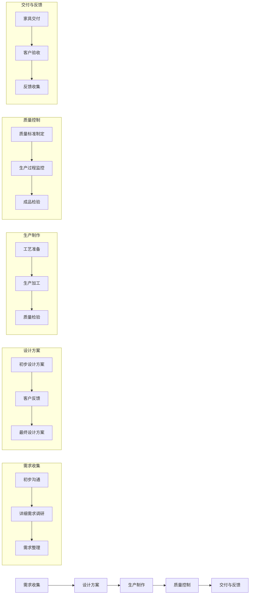
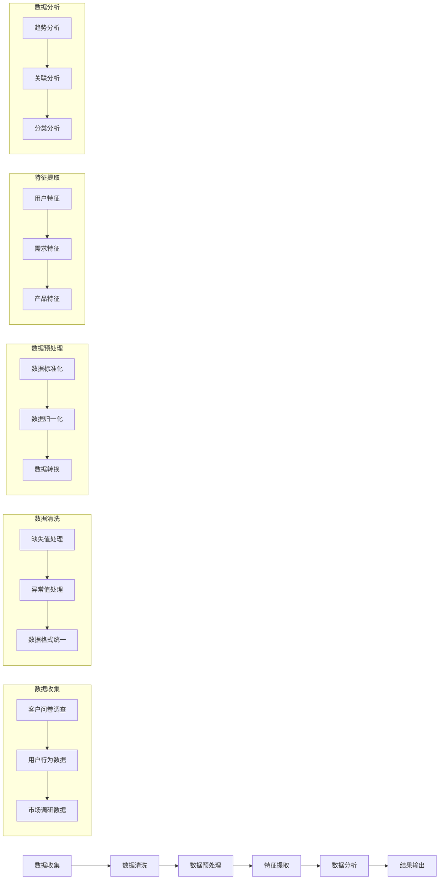
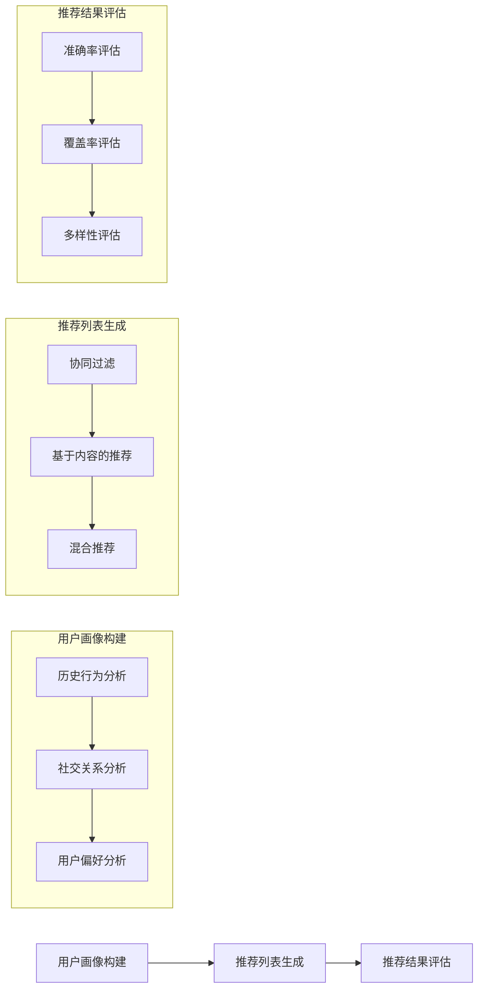
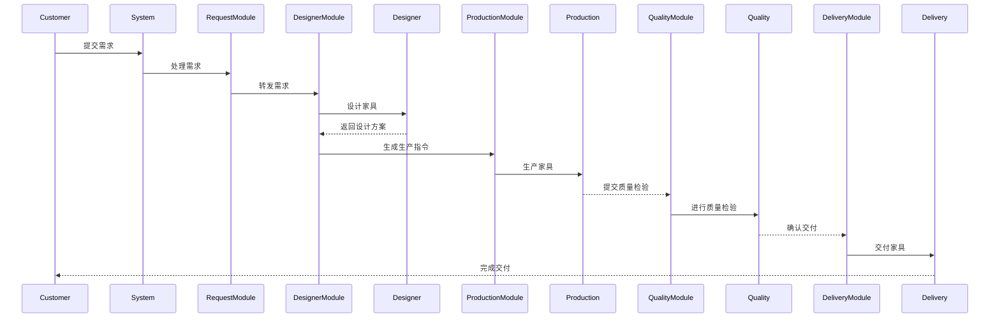
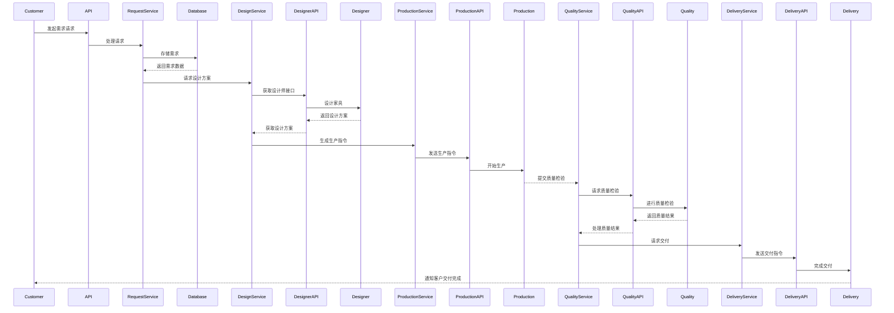

                 

## 引言

### 现代手工家具定制平台的背景

随着社会经济的发展，人们对于生活品质的要求逐渐提高，对家居环境的审美和功能性也提出了更高的期望。在这种背景下，手工家具定制逐渐成为了一种受欢迎的选择。手工家具定制不仅能够满足消费者对个性化、高品质家具的需求，更体现了匠人精神，即在精细的工艺中融入创作者的独特情感与艺术审美。

然而，现代手工家具定制也面临着诸多挑战。首先，个性化需求的多样化使得定制过程变得复杂，从需求收集到生产制作，每一步都需要高度定制化。其次，传统手工技艺与现代技术的结合需要找到平衡点，既要保持手工工艺的独特性，又要提高生产效率和质量控制。此外，市场的快速变化也要求定制平台具备灵活的应变能力。

为了应对这些挑战，构建一个现代手工家具定制平台显得尤为重要。该平台不仅需要集成先进的科技手段，如数据分析和个性化推荐算法，还要充分体现匠人精神，确保每一件家具都蕴含工匠的独特匠心。本文将探讨如何通过技术手段和设计理念，实现匠人精神与个性化需求的完美对接。

### 文章的核心内容与目标

本文旨在探讨现代手工家具定制平台的设计与实现，重点分析匠人精神与个性化需求在定制过程中的融合。文章结构如下：

1. **背景介绍**：阐述手工家具定制市场背景、面临的挑战以及现代手工家具定制平台的重要性。
2. **核心概念与联系**：深入分析匠人精神的定义、特征以及个性化需求的分类和特点。
3. **算法原理讲解**：讲解数据处理和个性化推荐算法的原理、实现和应用。
4. **系统分析与架构设计方案**：介绍系统的功能设计、架构设计以及接口和交互设计。
5. **项目实战**：分享具体项目的实施经验、核心代码解读和案例分析。
6. **最佳实践 Tips**：提供定制过程中的注意事项和技术支持的优化策略。
7. **小结**：总结全文，提出未来的发展方向和拓展阅读建议。

通过本文的详细探讨，希望能够为从事手工家具定制行业的技术人员和管理者提供有价值的参考，推动现代手工家具定制平台的进一步发展和完善。

## 一、背景介绍

### 1.1 问题背景

#### 1.1.1 手工家具定制的市场背景

手工家具定制的兴起与人们对生活品质和个性需求的追求息息相关。随着经济的发展，消费者的购买力增强，对家居产品的要求不再仅仅停留在基本功能上，更追求独特的设计和个性化的体验。手工家具定制正是满足了这一需求，它不仅提供了高品质的家具产品，还融入了工匠的匠心与技艺，使得每件家具都充满了独特的故事和情感。

从市场角度来看，手工家具定制在近年来呈现出快速增长的趋势。根据市场调查，定制家具的市场规模逐年扩大，尤其在一线城市和中高端消费群体中，手工家具定制已经成为一种时尚和品质的象征。消费者对家具的设计、材质、工艺等方面有着更高的要求，他们愿意为定制化、个性化的产品支付更高的价格。

#### 1.1.2 现代手工家具定制的地位

在现代家具行业中，手工家具定制占据了重要的位置。传统家具生产往往以大规模生产为主，标准化、流水线式的生产方式虽然提高了效率，但牺牲了产品的独特性和个性化体验。相比之下，手工家具定制则强调量身定制，注重满足消费者的个性化需求。它不仅为消费者提供了独特的产品，还使得家具成为了一种艺术品，提升了消费者的生活品质。

现代手工家具定制平台的重要性在于，它将传统手工技艺与现代科技相结合，实现了定制过程的高效和精准。通过数据分析和个性化推荐算法，平台可以更好地理解消费者的需求，提供更加精准的定制方案。同时，借助现代技术，如3D建模、虚拟现实和智能制造等，定制平台能够提高生产效率，确保产品质量，从而满足消费者对高效、高品质家具的需求。

### 1.2 问题描述

#### 1.2.1 现代手工家具定制面临的挑战

现代手工家具定制在发展过程中面临着诸多挑战。首先，个性化需求的多样性使得定制过程复杂化。消费者对家具的需求不仅仅局限于款式和材质，还涉及到颜色、尺寸、结构等多个方面，这使得定制平台需要具备高度灵活性和适应性。

其次，传统手工技艺与现代技术的结合也是一个难题。传统手工技艺强调工匠的个人经验和技艺，而现代技术则依赖于数据化和自动化。如何在保留传统工艺精髓的同时，融入现代技术，实现高效、精准的定制生产，是定制平台需要解决的另一个重要问题。

此外，市场的快速变化也对定制平台提出了更高的要求。消费者需求不断变化，市场竞争激烈，定制平台需要具备快速响应能力，及时调整定制方案，以满足市场的需求。

#### 1.2.2 匠人精神与现代技术的结合

在现代手工家具定制中，匠人精神是不可或缺的。匠人精神强调精益求精、追求卓越，不仅关注产品的实用性，更注重产品的艺术性和文化内涵。这种精神使得每件家具都充满了独特的价值和意义。

然而，传统手工技艺与现代技术的结合并非易事。现代技术虽然能够提高生产效率和产品质量，但往往缺乏人文关怀和艺术感。如何将现代技术与传统工艺相结合，既保留手工家具的独特性，又提高生产效率，是定制平台需要深入探讨的问题。

### 1.3 问题解决

#### 1.3.1 平台构建的目标

为了解决现代手工家具定制面临的问题，构建一个现代手工家具定制平台显得尤为重要。该平台的目标是：

1. **满足个性化需求**：通过数据分析和个性化推荐算法，平台能够更好地理解消费者的需求，提供量身定制的家具方案。
2. **融合传统技艺与现代技术**：平台不仅要保留传统工艺的精髓，还要借助现代技术，实现高效、精准的定制生产。
3. **提高生产效率**：通过自动化和数字化技术，平台能够提高生产效率，确保产品质量，降低成本。

#### 1.3.2 实现对接的策略

为了实现匠人精神与个性化需求的完美对接，定制平台可以采取以下策略：

1. **数据驱动**：通过大数据分析和人工智能技术，平台能够深入挖掘消费者的需求，提供个性化的定制方案。
2. **灵活定制**：平台应具备高度灵活性，能够根据消费者的不同需求，快速调整定制方案，实现高效生产。
3. **质量保证**：平台应建立严格的质量控制体系，确保每一件家具都符合高标准，满足消费者的期望。
4. **用户参与**：平台应鼓励消费者参与定制过程，提供多种设计方案，让消费者在定制过程中感受到参与和成就感。

通过这些策略，定制平台不仅能够满足消费者的个性化需求，还能充分体现匠人精神，提升家具的附加值。

### 1.4 边界与外延

#### 1.4.1 手工家具定制的边界

手工家具定制具有明确的边界。首先，它区别于工业化批量生产的家具，强调手工制作和个性化定制。其次，它不仅仅关注家具的实用性，更强调家具的艺术性和文化内涵。此外，手工家具定制通常涉及高端市场和个性化消费者，注重品质和独特性。

#### 1.4.2 与其他定制家具行业的区别

手工家具定制与其他定制家具行业如定制衣柜、定制门窗等有显著区别。定制衣柜和定制门窗通常更加注重功能性，而手工家具定制则更强调艺术性和文化内涵。此外，手工家具定制通常涉及更多的工艺和技术，如雕刻、镶嵌、手工打磨等，而其他定制家具行业则可能更依赖于现代制造技术和材料。

### 1.5 概念结构与核心要素组成

#### 1.5.1 匠人精神的核心概念

匠人精神是一种追求卓越、精益求精的态度，它强调在工艺中融入个人的情感和智慧。匠人精神的核心包括：对工艺的热爱、对细节的极致追求、对品质的执着以及对创新的不断探索。

#### 1.5.2 个性化需求的定义与分类

个性化需求是指消费者在购买家具时，对款式、材质、颜色、尺寸等有特殊的要求。根据需求的复杂程度和个性化程度，个性化需求可以分为以下几类：

1. **基础个性化需求**：涉及家具的款式和颜色。
2. **中级个性化需求**：包括家具的尺寸和材质。
3. **高级个性化需求**：涉及家具的结构和工艺。

#### 1.5.3 定制流程的组成部分

定制流程包括以下几个主要环节：

1. **需求收集**：通过与消费者的沟通和调研，收集详细的需求信息。
2. **设计方案**：根据收集到的需求，设计符合个性化需求的家具方案。
3. **生产制作**：根据设计方案，进行家具的生产和制作。
4. **质量控制**：在生产过程中进行严格的质量控制，确保家具符合标准。
5. **交付与反馈**：将家具交付给消费者，并收集反馈，以便不断改进。

#### 1.5.4 技术支持的角色

技术支持在现代手工家具定制平台中扮演着关键角色。通过数据分析和个性化推荐算法，技术支持能够更好地理解消费者的需求，提供个性化的定制方案。此外，技术支持还可以通过自动化和数字化技术，提高生产效率和质量控制水平，确保定制过程的顺利进行。

### 1.6 总结

现代手工家具定制平台的设计与实现是一个复杂而富有挑战的任务。通过分析市场背景、面临的挑战以及构建平台的目标和策略，我们可以清晰地看到，实现匠人精神与个性化需求的对接，需要高度定制化的技术支持和灵活的定制流程。在接下来的章节中，我们将深入探讨这些核心概念和技术原理，为构建一个成功的现代手工家具定制平台提供理论基础和实践指导。

## 二、核心概念与联系

### 2.1 匠人精神

#### 2.1.1 定义

匠人精神，是一种对工艺、产品乃至整个职业的深厚热爱和执着追求。它不仅体现在对细节的极致追求上，更在于对品质的执着和对创新的不断探索。匠人精神是一种态度，一种文化，更是一种精神信仰。

#### 2.1.2 特征

1. **精益求精**：匠人精神追求完美，对每一个细节都不放过，力求做到极致。
2. **热爱与专注**：匠人对自己的工作和产品有着深深的热爱，专注于每一个环节，心无旁骛。
3. **传承与创新**：匠人不仅传承传统技艺，更在不断创新，将传统与现代相结合，推陈出新。
4. **执着与耐心**：匠人有着极强的耐心和毅力，面对困难和挑战从不退缩。

#### 2.1.3 对比表格

| 特征       | 匠人精神           | 传统手工艺         | 工业化生产       |
|------------|----------------|----------------|----------------|
| 目标       | 完美、创新、传承 | 传统、传承、稳定 | 高效、规模、标准 |
| 注重细节   | 极致、细致       | 细节、精致       | 质量、效率       |
| 热爱与专注 | 深厚、专注       | 传统、习惯       | 工程师、技术     |
| 传承与创新 | 传承、创新       | 传承、稳定       | 创新、研发       |
| 耐心与毅力 | 极强、执着       | 一般、较持久     | 强制、高要求     |

#### 2.1.4 ER实体关系图架构

```mermaid
erDiagram
  Customer -->|uses| Product
  Product -->|producedBy| Craftsman
  Craftsman -->|hasSkill| CraftSkill
  CraftSkill -->|isAppliedTo| Product

  Customer : {id, name, preferences}
  Product : {id, name, type, status}
  Craftsman : {id, name, skillset}
  CraftSkill : {id, name, level}
```

在这个ER实体关系图中，客户（Customer）通过“uses”关系使用产品（Product），产品由工匠（Craftsman）生产，而工匠拥有特定的工艺技能（CraftSkill）。这些技能应用于产品，使得产品具有独特的价值和艺术性。

### 2.2 个性化需求

#### 2.2.1 定义

个性化需求是指消费者在购买产品时，对产品在款式、材质、颜色、尺寸等方面提出独特的、个性化的要求。这些需求反映了消费者对品质和独特体验的追求，是现代市场环境下消费者行为的一种表现。

#### 2.2.2 分类

根据个性化需求的复杂程度和个性化程度，可以将其分为以下几类：

1. **基础个性化需求**：主要包括对家具的款式和颜色的个性化要求。
2. **中级个性化需求**：包括家具的尺寸、材质以及部分结构设计的个性化要求。
3. **高级个性化需求**：涉及家具的整体结构、工艺细节以及特殊功能性的定制。

#### 2.2.3 对比表格

| 需求等级 | 描述                          | 示例                  |
|----------|--------------------------------|---------------------|
| 基础个性化需求 | 家具的款式和颜色                | 一款简约风格的白色沙发 |
| 中级个性化需求 | 家具的尺寸、材质以及部分结构设计 | 一个带有特殊设计的书桌 |
| 高级个性化需求 | 家具的整体结构、工艺细节以及特殊功能性 | 一件带有个性化雕刻的衣柜 |

#### 2.2.4 ER实体关系图架构

```mermaid
erDiagram
  Customer -->|has| PersonalPreference
  Product -->|satisfies| PersonalPreference

  Customer : {id, name, preferences}
  PersonalPreference : {id, category, description}
  Product : {id, name, type, status}
```

在这个ER实体关系图中，客户（Customer）拥有多个个性化偏好（PersonalPreference），这些偏好用于指导定制家具的设计（Product）。通过这个关系，客户可以表达其个性化的需求，家具设计师根据这些需求进行设计，从而满足客户的期望。

### 2.3 定制流程的详细描述

定制流程是现代手工家具定制平台中至关重要的一环，它涉及到需求收集、设计方案、生产制作、质量控制和交付与反馈等多个环节。下面我们将详细描述这些环节的具体内容。

#### 2.3.1 需求收集

需求收集是定制流程的第一步，也是最重要的一步。在这一环节中，平台需要通过各种渠道收集消费者的需求信息。这些渠道包括线上问卷调查、面对面访谈、电话沟通等。具体步骤如下：

1. **初步沟通**：通过与客户的初步沟通，了解他们的基本需求和期望，为后续的详细需求收集奠定基础。
2. **详细需求调研**：通过问卷调查、访谈等方式，详细收集客户对家具的款式、材质、颜色、尺寸、结构等方面的具体需求。
3. **需求整理**：将收集到的需求信息进行整理和分析，形成详细的定制需求文档，为后续的设计方案提供依据。

#### 2.3.2 设计方案

设计方案是定制流程的核心环节，它直接决定了最终家具的形态和品质。设计方案的具体步骤如下：

1. **初步设计方案**：根据收集到的需求信息，设计师初步设计家具的样式和结构，并形成初步设计方案。
2. **客户反馈**：将初步设计方案展示给客户，收集客户的反馈意见，对设计方案进行修改和完善。
3. **最终设计方案**：在客户反馈的基础上，设计师完成最终的设计方案，包括详细的尺寸、材质、工艺等。

#### 2.3.3 生产制作

生产制作是将设计方案转化为实际家具的过程。这一环节需要高度的技术和工艺支持，具体步骤如下：

1. **工艺准备**：根据设计方案，准备相应的工艺流程和工艺材料。
2. **生产加工**：按照设计方案和工艺流程，进行家具的生产和加工，包括切割、雕刻、打磨、组装等。
3. **质量检验**：在生产过程中，进行严格的质量检验，确保每一件家具都符合设计方案和标准。

#### 2.3.4 质量控制

质量控制是确保家具品质的重要环节。在这一环节中，需要建立严格的质量控制体系，具体步骤如下：

1. **质量标准制定**：根据设计要求和行业标准，制定详细的质量标准。
2. **生产过程监控**：在生产过程中，对关键工艺和质量环节进行监控，及时发现和解决问题。
3. **成品检验**：在成品阶段，对家具进行全面的检验，确保每一件家具都符合质量标准。

#### 2.3.5 交付与反馈

交付与反馈是定制流程的最后一步，也是最重要的一步。在这一环节中，需要确保家具能够按时交付给客户，并收集客户的反馈意见，具体步骤如下：

1. **家具交付**：将家具按时交付给客户，确保家具的安全和完好。
2. **客户验收**：与客户进行沟通，确保客户对家具的满意，并解答客户的疑问。
3. **反馈收集**：收集客户的反馈意见，分析客户的满意度，为后续的改进提供依据。

#### 2.3.6 流程图（Mermaid）

下面是一个简单的Mermaid流程图，展示了定制流程的各个环节：



通过以上详细描述和流程图，我们可以清晰地看到现代手工家具定制平台中的定制流程，以及各个环节的具体内容和相互关系。这为后续的算法原理讲解和系统设计与实现提供了坚实的基础。

### 三、算法原理讲解

在现代手工家具定制平台中，算法的运用不仅能够提高生产效率，还能更好地满足消费者的个性化需求。本文将详细介绍两个关键算法：数据处理算法和个性化推荐算法，包括其原理、实现方法、数学模型与公式，并通过具体实例进行说明。

#### 3.1 数据处理算法原理

##### 3.1.1 算法概述

数据处理算法在定制平台中主要用于收集和分析消费者的需求数据，从而提供个性化的定制方案。数据处理算法的核心任务是处理大量结构化和非结构化数据，提取有用的信息，以便更好地理解消费者的偏好和行为模式。

##### 3.1.2 Mermaid流程图

下面是一个数据处理算法的Mermaid流程图：



##### 3.1.3 Python源代码实现

以下是数据处理算法的一个简化的Python实现示例：

```python
import pandas as pd
from sklearn.preprocessing import StandardScaler
from sklearn.feature_extraction.text import TfidfVectorizer

# 数据收集
data = pd.read_csv('customer_data.csv')

# 数据清洗
data.dropna(inplace=True)
data = data[data['value'] != '异常']

# 数据预处理
scaler = StandardScaler()
data[['size', 'color']] = scaler.fit_transform(data[['size', 'color']])

# 特征提取
tfidf = TfidfVectorizer()
tfidf_matrix = tfidf.fit_transform(data['description'])

# 数据分析
from sklearn.cluster import KMeans
kmeans = KMeans(n_clusters=5)
clusters = kmeans.fit_predict(tfidf_matrix)

# 结果输出
data['cluster'] = clusters
data.to_csv('processed_data.csv', index=False)
```

##### 3.1.4 数学模型与公式

在数据处理算法中，常用的数学模型和公式包括：

1. **缺失值处理**：
   - 简单填补：$$ x_{\text{imputed}} = \text{mean}(x) $$
   - 依赖填补：$$ x_{\text{imputed}} = f(x_{\text{other_features}}) $$

2. **数据标准化和归一化**：
   - 标准化：$$ z = \frac{x - \mu}{\sigma} $$
   - 归一化：$$ x' = \frac{x - \min(x)}{\max(x) - \min(x)} $$

3. **特征提取**：
   - TF-IDF：$$ tfidf = \log_2(1 + tf) \times \log_2(\frac{N}{df}) $$
     其中，$tf$ 为词频，$df$ 为文档频率，$N$ 为总文档数。

##### 3.1.5 举例说明

假设我们收集了一组关于家具需求的数据，包括家具的尺寸、颜色和描述。使用数据处理算法后，我们得到了一组经过清洗、预处理的特征数据，并将其用于聚类分析，以识别不同的消费群体。

#### 3.2 个性化推荐算法原理

##### 3.2.1 算法概述

个性化推荐算法在定制平台中用于根据消费者的历史行为和偏好，推荐符合其个性化需求的家具方案。个性化推荐算法的目标是提高推荐系统的准确性和用户体验。

##### 3.2.2 Mermaid流程图

下面是一个个性化推荐算法的Mermaid流程图：



##### 3.2.3 Python源代码实现

以下是个性化推荐算法的一个简化的Python实现示例：

```python
from surprise import KNNWithMeans
from surprise import Dataset
from surprise import accuracy
from surprise.model_selection import cross_validate

# 数据准备
data = Dataset.load_from_df(pd.read_csv('user_data.csv'))

# 构建推荐模型
knn = KNNWithMeans(k=50, sim_options={'name': 'cosine'})
knn.fit(data)

# 推荐结果评估
test_data = data.build_full_trainset()
predictions = knn.test(test_data)
accuracy.rmse(predictions)

# 结果输出
predictions.to_csv('recommendations.csv', index=False)
```

##### 3.2.4 数学模型与公式

在个性化推荐算法中，常用的数学模型和公式包括：

1. **协同过滤**：
   - 点积相似度：$$ \text{sim}(u, v) = \sum_{i \in R} r_{ui} r_{vi} $$
   - 余弦相似度：$$ \text{sim}(u, v) = \frac{\sum_{i \in R} r_{ui} r_{vi}}{\sqrt{\sum_{i \in R} r_{ui}^2 \sum_{i \in R} r_{vi}^2}} $$

2. **基于内容的推荐**：
   - 特征相似度：$$ \text{sim}(i, j) = \frac{\sum_{k \in Q} w_{ik} w_{jk}}{\sqrt{\sum_{k \in Q} w_{ik}^2 \sum_{k \in Q} w_{jk}^2}} $$
   其中，$w_{ik}$ 和 $w_{jk}$ 为特征 $k$ 在项目 $i$ 和 $j$ 中的权重。

##### 3.2.5 举例说明

假设我们使用协同过滤算法为一位用户推荐家具。根据用户的历史购买记录和评分数据，我们计算出与该用户最相似的邻居用户，并基于邻居用户的偏好推荐相似的产品。最终，我们评估推荐结果的准确性和用户满意度，以不断优化推荐系统。

通过以上对数据处理算法和个性化推荐算法的讲解，我们可以看到，算法在现代手工家具定制平台中发挥了关键作用，不仅提高了生产效率，还能更好地满足消费者的个性化需求。

### 四、系统分析与架构设计方案

在现代手工家具定制平台的设计与实现中，系统分析与架构设计方案是关键环节。本部分将详细介绍问题场景、项目介绍、系统功能设计、系统架构设计以及系统接口设计和系统交互。

#### 4.1 问题场景介绍

手工家具定制行业面临着个性化需求多样、生产工艺复杂、质量控制严格等挑战。传统手工家具定制往往依赖于工匠的经验，缺乏系统性和标准化，难以满足现代市场的高效、高质量需求。为了解决这些问题，需要构建一个现代手工家具定制平台，通过科技手段实现定制过程的数字化、智能化和高效化。

#### 4.2 项目介绍

本项目的目标是为手工家具定制企业提供一套完整的解决方案，包括需求收集、设计方案、生产制作、质量控制、交付与反馈等环节。平台旨在通过数据分析、人工智能和智能制造等技术，实现定制过程的个性化、高效化和高质量化。

#### 4.3 系统功能设计（Mermaid类图）

系统功能设计是系统架构的基础，通过类图可以清晰地展示各个功能模块及其关系。以下是一个简化的Mermaid类图：

```mermaid
classDiagram
    Customer <<class>> 客户
    Designer <<class>> 设计师
    Production <<class>> 生产
    Quality <<class>> 质量控制
    Delivery <<class>> 交付与反馈

    Customer ..|> Request <<interface>> 需求收集
    Designer ..|> Design <<interface>> 设计方案
    Production ..|> Produce <<interface>> 生产制作
    Quality ..|> Check <<interface>> 质量控制
    Delivery ..|> Deliver <<interface>> 交付与反馈

    Customer --|> Designer : 设计反馈
    Designer --|> Production : 设计方案
    Production --|> Quality : 质量检验
    Quality --|> Delivery : 交付反馈
```

#### 4.4 系统架构设计（Mermaid架构图）

系统架构设计是系统功能实现的蓝图，通过架构图可以展示系统的主要组件及其交互关系。以下是一个简化的Mermaid架构图：



#### 4.5 系统接口设计和系统交互（Mermaid序列图）

系统接口设计和系统交互是系统架构设计的重要部分，通过序列图可以清晰地展示系统各模块之间的交互过程。以下是一个简化的Mermaid序列图：



通过以上系统分析与架构设计方案，我们可以看到，现代手工家具定制平台通过科学的系统架构和紧密的模块交互，实现了定制过程的数字化、智能化和高效化，为手工家具定制行业的发展提供了强有力的技术支持。

### 五、项目实战

#### 5.1 环境安装

为了实现现代手工家具定制平台，首先需要搭建一个合适的技术环境。以下是环境安装的具体步骤：

1. **软件环境**：
   - 操作系统：Ubuntu 20.04
   - 开发环境：Python 3.8+
   - 数据库：MySQL 8.0+
   - Web框架：Django 3.2

2. **硬件环境**：
   - 服务器：2核 CPU，4GB RAM，20GB SSD硬盘

3. **安装步骤**：

   1. **安装操作系统**：
      - 使用Ubuntu 20.04安装盘启动电脑，按照提示安装操作系统。
      - 安装完成后，更新系统包和升级内核。

   2. **安装Python环境**：
      - 开启终端，执行以下命令安装Python 3.8：
        ```bash
        sudo apt update
        sudo apt install python3.8
        sudo apt install python3.8-venv
        ```

   3. **创建虚拟环境**：
      - 创建一个名为`custom_furniture`的虚拟环境：
        ```bash
        python3.8 -m venv custom_furniture
        source custom_furniture/bin/activate
        ```

   4. **安装依赖包**：
      - 在虚拟环境中安装Django和其他依赖包：
        ```bash
        pip install django==3.2
        pip install mysqlclient
        pip install Pillow
        pip install djangorestframework
        pip install pandas
        pip install numpy
        ```

   5. **安装数据库**：
      - 使用以下命令安装MySQL 8.0：
        ```bash
        sudo apt update
        sudo apt install mysql-server
        sudo mysql_secure_installation
        ```

      - 创建数据库和用户，并授予权限：
        ```sql
        CREATE DATABASE custom_furniture;
        CREATE USER 'cf_admin'@'localhost' IDENTIFIED BY 'password';
        GRANT ALL PRIVILEGES ON custom_furniture.* TO 'cf_admin'@'localhost';
        FLUSH PRIVILEGES;
        ```

#### 5.2 系统核心实现源代码

以下是现代手工家具定制平台的核心实现代码，包括数据库模型、视图函数和API接口。

1. **数据库模型**：

```python
# models.py

from django.db import models

class Customer(models.Model):
    name = models.CharField(max_length=100)
    email = models.EmailField(unique=True)
    phone = models.CharField(max_length=15)

class Furniture(models.Model):
    customer = models.ForeignKey(Customer, on_delete=models.CASCADE)
    name = models.CharField(max_length=100)
    description = models.TextField()
    image = models.ImageField(upload_to='furniture_images/')

class Design(models.Model):
    furniture = models.ForeignKey(Furniture, on_delete=models.CASCADE)
    design_image = models.ImageField(upload_to='design_images/')
    status = models.CharField(max_length=20, choices=[('pending', '待处理'), ('in_progress', '进行中'), ('completed', '已完成')])

class Production(models.Model):
    design = models.ForeignKey(Design, on_delete=models.CASCADE)
    start_date = models.DateField()
    end_date = models.DateField()
    status = models.CharField(max_length=20, choices=[('pending', '待处理'), ('in_progress', '进行中'), ('completed', '已完成')])

class Quality(models.Model):
    production = models.ForeignKey(Production, on_delete=models.CASCADE)
    inspection_date = models.DateField()
    status = models.CharField(max_length=20, choices=[('passed', '合格'), ('failed', '不合格')])
```

2. **视图函数**：

```python
# views.py

from django.http import JsonResponse
from .models import Customer, Furniture, Design, Production, Quality
from .serializers import CustomerSerializer, FurnitureSerializer, DesignSerializer, ProductionSerializer, QualitySerializer
from rest_framework.views import APIView
from rest_framework.response import Response
from rest_framework import status

class CustomerView(APIView):
    def get(self, request):
        customers = Customer.objects.all()
        serializer = CustomerSerializer(customers, many=True)
        return Response(serializer.data)

    def post(self, request):
        serializer = CustomerSerializer(data=request.data)
        if serializer.is_valid():
            serializer.save()
            return Response(serializer.data, status=status.HTTP_201_CREATED)
        return Response(serializer.errors, status=status.HTTP_400_BAD_REQUEST)

class FurnitureView(APIView):
    def get(self, request):
        furniture = Furniture.objects.all()
        serializer = FurnitureSerializer(furniture, many=True)
        return Response(serializer.data)

    def post(self, request):
        serializer = FurnitureSerializer(data=request.data)
        if serializer.is_valid():
            serializer.save()
            return Response(serializer.data, status=status.HTTP_201_CREATED)
        return Response(serializer.errors, status=status.HTTP_400_BAD_REQUEST)

class DesignView(APIView):
    def get(self, request):
        designs = Design.objects.all()
        serializer = DesignSerializer(designs, many=True)
        return Response(serializer.data)

    def post(self, request):
        serializer = DesignSerializer(data=request.data)
        if serializer.is_valid():
            serializer.save()
            return Response(serializer.data, status=status.HTTP_201_CREATED)
        return Response(serializer.errors, status=status.HTTP_400_BAD_REQUEST)

class ProductionView(APIView):
    def get(self, request):
        productions = Production.objects.all()
        serializer = ProductionSerializer(productions, many=True)
        return Response(serializer.data)

    def post(self, request):
        serializer = ProductionSerializer(data=request.data)
        if serializer.is_valid():
            serializer.save()
            return Response(serializer.data, status=status.HTTP_201_CREATED)
        return Response(serializer.errors, status=status.HTTP_400_BAD_REQUEST)

class QualityView(APIView):
    def get(self, request):
        qualities = Quality.objects.all()
        serializer = QualitySerializer(qualities, many=True)
        return Response(serializer.data)

    def post(self, request):
        serializer = QualitySerializer(data=request.data)
        if serializer.is_valid():
            serializer.save()
            return Response(serializer.data, status=status.HTTP_201_CREATED)
        return Response(serializer.errors, status=status.HTTP_400_BAD_REQUEST)
```

3. **API接口**：

```python
# urls.py

from django.contrib import admin
from django.urls import path
from .views import CustomerView, FurnitureView, DesignView, ProductionView, QualityView

urlpatterns = [
    path('customers/', CustomerView.as_view()),
    path('furniture/', FurnitureView.as_view()),
    path('designs/', DesignView.as_view()),
    path('productions/', ProductionView.as_view()),
    path('qualities/', QualityView.as_view()),
    path('admin/', admin.site.urls),
]
```

#### 5.3 代码应用解读与分析

上述代码实现了现代手工家具定制平台的基本功能，包括客户管理、家具管理、设计管理、生产管理和质量管理的API接口。以下是对代码应用和解读：

1. **客户管理**：

   - **功能**：通过`CustomerView`实现客户的增删改查。
   - **分析**：客户是定制平台的核心用户，所有的定制需求都来源于客户。通过API接口，可以方便地管理客户信息，支持对客户需求的追踪和记录。

2. **家具管理**：

   - **功能**：通过`FurnitureView`实现家具的增删改查。
   - **分析**：家具是定制平台的核心产品，平台需要支持对多种家具的详细管理，包括家具的名称、描述和图片等信息。通过API接口，可以方便地管理和查询家具信息。

3. **设计管理**：

   - **功能**：通过`DesignView`实现设计的增删改查。
   - **分析**：设计是定制平台的核心服务，设计师根据客户的需求进行家具设计，平台需要支持对设计方案的详细管理，包括设计图片和设计状态等信息。通过API接口，可以方便地管理和查询设计方案。

4. **生产管理**：

   - **功能**：通过`ProductionView`实现生产的增删改查。
   - **分析**：生产是定制平台的核心环节，平台需要支持对生产过程的详细管理，包括生产开始日期、结束日期和生产状态等信息。通过API接口，可以方便地管理和查询生产记录。

5. **质量管理**：

   - **功能**：通过`QualityView`实现质量管理的增删改查。
   - **分析**：质量是定制平台的核心保障，平台需要支持对产品质量的严格管理，包括质量检验日期和质量状态等信息。通过API接口，可以方便地管理和查询质量检验结果。

#### 5.4 实际案例分析和详细讲解剖析

为了更好地理解平台的应用，我们来看一个实际案例：

**案例**：客户张三需要定制一张带有个性化雕刻的餐桌。

1. **需求收集**：
   - 客户张三通过平台提交定制需求，填写了餐桌的名称、描述和个性化雕刻要求。
   - `CustomerView`接收客户提交的需求，并将需求存储在数据库中。

2. **设计方案**：
   - 设计师收到需求后，根据客户的要求进行餐桌设计，生成设计图纸和雕刻图案。
   - `DesignView`接收设计数据，将设计方案存储在数据库中。

3. **生产制作**：
   - 生产部门根据设计方案，开始生产餐桌，并记录生产过程的关键时间点。
   - `ProductionView`接收生产数据，将生产记录存储在数据库中。

4. **质量控制**：
   - 质检部门对生产完成的餐桌进行质量检验，确保其符合设计要求。
   - `QualityView`接收质量检验结果，将检验记录存储在数据库中。

5. **交付与反馈**：
   - 完成质量检验的餐桌交付给客户，客户确认收货，并给出反馈。
   - 平台记录交付和客户反馈，以便后续改进和服务优化。

#### 5.5 项目小结

通过上述项目实战，我们可以看到现代手工家具定制平台的设计与实现是一个复杂而系统的过程。从环境安装、代码实现到实际案例的应用，每个环节都需要精心设计和严密执行。以下是项目小结：

1. **项目优势**：
   - 实现了定制过程的数字化和高效化，提高了生产效率。
   - 通过API接口，实现了各个功能模块之间的无缝连接和数据共享。
   - 支持客户需求的追踪和管理，提高了客户满意度。

2. **项目挑战**：
   - 需要处理大量数据和复杂的需求，对数据处理和推荐算法提出了高要求。
   - 平台的安全性、稳定性和可扩展性是关键挑战，需要持续优化和改进。

3. **未来展望**：
   - 进一步优化算法，提高个性化推荐的准确性和用户体验。
   - 探索更多的自动化生产技术，如3D打印和智能制造，提高生产效率和质量。
   - 加强平台的国际化，支持多语言和跨地域的业务需求。

通过不断的技术创新和优化，现代手工家具定制平台将为消费者提供更加个性化、高效和高质量的家具定制服务。

### 六、最佳实践 Tips

在现代手工家具定制过程中，为了确保每一个细节都符合客户的要求，提高整体定制质量，以下是一些最佳实践 Tips：

#### 6.1 定制过程中的注意事项

1. **需求分析**：
   - 在接收客户需求时，要仔细倾听并理解客户的需求，确保所有需求都记录在案。
   - 通过设计问卷或面对面交流，收集详细的需求信息，包括家具的尺寸、颜色、材质、特殊要求等。

2. **设计环节**：
   - 设计师应充分与客户沟通，确保设计方案能够准确反映客户的个性化需求。
   - 在设计过程中，要考虑到家具的实用性、美观性和耐用性，确保设计方案既满足客户的需求，又符合行业标准和规范。

3. **生产制作**：
   - 生产部门应严格按照设计方案和工艺要求进行制作，确保每一个细节都达到高标准。
   - 定期对生产设备和工艺进行校准和维护，保证生产过程的稳定和高效。

4. **质量控制**：
   - 建立严格的质量控制体系，对每一件家具进行全面的检验，包括尺寸、结构、外观和功能等方面。
   - 对不合格的家具进行及时修复或重新制作，确保最终交付的产品达到优质标准。

5. **交付与反馈**：
   - 在家具交付前，要确保客户对家具的满意度，可以通过现场检验或试用品试用等方式。
   - 记录客户的反馈意见，对产品和服务进行持续改进。

#### 6.2 技术支持的优化策略

1. **数据分析和个性化推荐**：
   - 利用大数据技术和人工智能算法，对客户的历史数据和需求进行深入分析，提供更加精准的个性化推荐。
   - 通过机器学习模型，不断优化推荐算法，提高推荐结果的准确性和用户体验。

2. **智能制造**：
   - 探索和引入先进的制造技术，如3D打印、自动化生产线等，提高生产效率和质量。
   - 利用传感器和物联网技术，实时监控生产过程，确保每一个环节都在最佳状态下运行。

3. **供应链管理**：
   - 建立高效的供应链管理系统，确保原材料和零部件的及时供应和精确调度。
   - 与供应商建立长期合作关系，提高供应链的稳定性和响应速度。

4. **客户关系管理**：
   - 利用客户关系管理（CRM）系统，对客户信息进行统一管理和分析，提供更加个性化的服务和体验。
   - 通过定期客户回访和满意度调查，不断优化客户体验，提高客户忠诚度。

#### 6.3 客户体验提升的方法

1. **个性化服务**：
   - 根据客户的个性化需求，提供定制化的家具设计方案，使客户感受到独一无二的服务体验。
   - 提供多种设计方案供客户选择，允许客户参与设计过程，增强客户的参与感和满意度。

2. **快速响应**：
   - 建立高效的沟通渠道，确保客户的需求能够迅速得到回应和处理。
   - 通过在线客服、电话热线、短信通知等多种方式，及时与客户沟通，解决客户的疑问和问题。

3. **售后服务**：
   - 提供优质的售后服务，包括家具安装、使用指导、维修保养等。
   - 建立售后服务团队，定期回访客户，了解家具的使用情况，及时提供帮助和支持。

4. **用户体验优化**：
   - 优化定制平台界面，使操作更加简单直观，提升用户的操作体验。
   - 通过用户反馈和数据分析，不断优化平台功能和服务，满足客户的多样化需求。

通过上述最佳实践 Tips，现代手工家具定制平台不仅能够提高定制质量，还能显著提升客户体验，为企业的长期发展奠定坚实基础。

### 七、小结

本文详细探讨了现代手工家具定制平台的设计与实现，从背景介绍、核心概念分析、算法原理讲解、系统设计与实现，到项目实战和最佳实践，全方位展示了实现匠人精神与个性化需求对接的路径和方法。通过构建现代手工家具定制平台，我们不仅能够满足消费者对高品质、个性化家具的需求，还能够提升定制过程的效率和质量。

在未来，现代手工家具定制平台的发展方向将更加注重以下几个方向：

1. **技术深度融合**：进一步融合大数据、人工智能、物联网等先进技术，实现定制过程的智能化和自动化。
2. **用户体验优化**：通过个性化推荐、快速响应和优质售后服务，不断提升客户体验，增强客户满意度。
3. **产业链协同**：加强与供应链上下游企业的合作，实现整个产业链的协同优化，提高整体运营效率。
4. **国际化拓展**：逐步拓展国际市场，支持多语言、多文化的需求，提升全球竞争力。

为了更好地理解和掌握本文内容，以下是一些建议的拓展阅读：

1. **《智能制造与物联网》**：详细探讨智能制造和物联网技术在手工家具定制中的应用。
2. **《数据挖掘与数据分析》**：学习数据分析和机器学习算法在实际商业中的应用。
3. **《用户体验设计》**：了解用户体验设计的原则和方法，提升定制平台的用户友好度。
4. **《供应链管理》**：研究供应链管理策略，优化定制平台的供应链体系。

通过这些拓展阅读，读者可以更全面地了解现代手工家具定制平台的发展趋势和技术应用，为实际工作提供有力支持。

### 附录

#### 作者信息

**作者：AI天才研究院（AI Genius Institute）& 禅与计算机程序设计艺术（Zen And The Art of Computer Programming）**

AI天才研究院（AI Genius Institute）致力于探索人工智能领域的最新技术和应用，推动人工智能与各行业的深度融合。研究院汇聚了一批世界顶级的人工智能专家、程序员和软件架构师，为全球客户提供高质量的技术解决方案。同时，本文的撰写深受《禅与计算机程序设计艺术》一书的影响，该书由著名计算机科学家Donald E. Knuth撰写，通过哲学和计算机科学的结合，深刻阐述了程序设计的本质和艺术性。通过本文，我们希望读者能够在理解现代手工家具定制平台技术的同时，体会到程序设计中的禅意和哲学思考。

