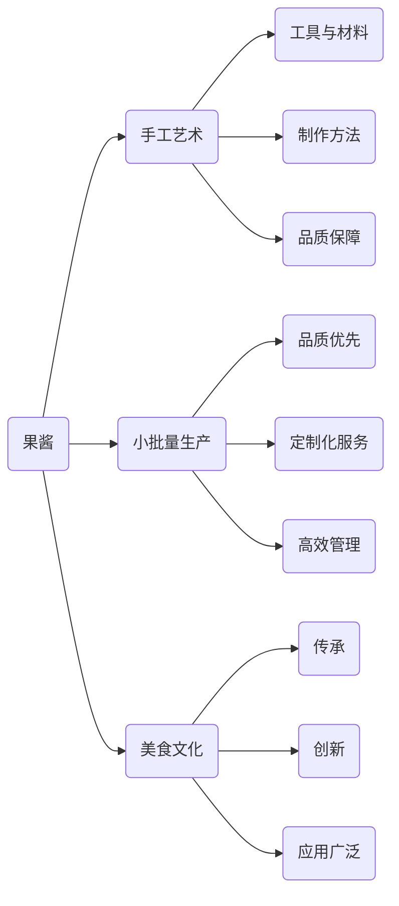
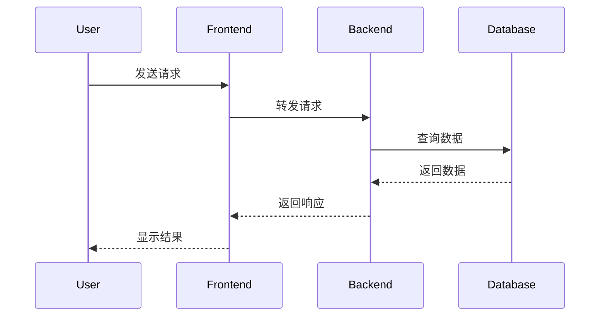
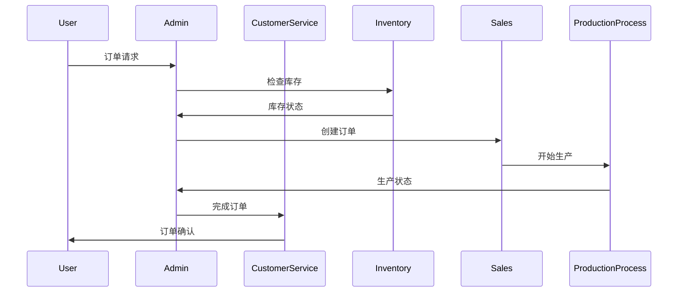

                 

### 《现代手工果酱坊：小批量生产的美食文化》

#### 关键词：果酱、手工艺术、小批量生产、美食文化、科学原理

#### 摘要：本文旨在探讨现代手工果酱坊的小批量生产模式，以及其在美食文化中的地位。通过介绍果酱的历史、成分、制作方法，解析果酱的化学原理，阐述果酱坊的经营策略，探讨果酱在餐桌上的艺术应用，最终展望果酱坊的未来发展趋势。

---

### 第一部分：果酱与手工艺术

#### 第1章：果酱的魔法：从水果到美味

##### 1.1 果酱的历史与发展
果酱的历史可以追溯到古代文明。在中东地区，人们早在公元前3000年就开始使用蜂蜜和水果制作果酱。随着时间的推移，果酱的制作工艺不断改进，种类也日益丰富。

##### 1.2 果酱的成分与种类
果酱的主要成分是水果、糖和酸。根据水果种类和配方的不同，果酱可以分为多种类型，如苹果酱、草莓酱、蓝莓酱等。

##### 1.3 果酱对健康的影响
果酱富含维生素、矿物质和抗氧化剂，具有多种健康益处。适量食用果酱，有助于提高免疫力、促进消化和改善心血管健康。

#### 第2章：手工艺术：果酱制作的基础

##### 2.1 工具与材料的选择
制作果酱的工具包括锅、搅拌器、瓶子等。材料则包括新鲜水果、糖、柠檬汁等。

##### 2.2 制作果酱的基本步骤
制作果酱的基本步骤包括挑选水果、清洗去皮、切碎水果、熬煮、加糖、搅拌、装瓶等。

##### 2.3 确保果酱品质的技巧
要制作出高品质的果酱，需要掌握火候、糖水比例和杀菌技巧。适当的火候可以保持果酱的口感和颜色；糖水比例会影响果酱的甜度和保存时间；杀菌技巧可以防止果酱变质。

#### 第3章：探索果酱的无限可能

##### 3.1 新奇果酱配方
除了常见的果酱，还可以尝试制作各种新奇口味的果酱，如薄荷草莓酱、香草苹果酱等。

##### 3.2 调味与融合的艺术
果酱的调味和融合是制作过程中的重要环节。通过添加香料、蜂蜜、巧克力等，可以使果酱的味道更加丰富。

##### 3.3 创意果酱包装
创意的包装可以提升果酱的吸引力和礼品价值。可以从色彩、形状、材质等方面入手，打造独特的果酱包装。

---

### 第二部分：果酱制作的科学原理

#### 第4章：果酱的化学原理

##### 4.1 水果中的糖与酸
水果中的糖和酸是果酱制作的关键成分。糖可以增加甜味，酸可以增加口感和保存时间。

##### 4.2 防止果酱变质
果酱的变质主要是由细菌和微生物引起的。通过控制糖水比例、杀菌和密封等步骤，可以有效地防止果酱变质。

##### 4.3 糖与水的比例
糖与水的比例对果酱的口感、甜度和保存时间有很大影响。一般来说，糖水比例为1:1或1:1.5较为常见。

#### 第5章：果酱制作的技巧与诀窍

##### 5.1 火候的掌握
火候的掌握是制作果酱的关键。火候过大容易导致果酱焦糊，火候过小则不易熬煮。

##### 5.2 糖的溶解与分配
糖的溶解速度和分配均匀度会影响果酱的口感和外观。在熬煮过程中，可以适当搅拌和调整火候，以确保糖的均匀溶解。

##### 5.3 果酱瓶的保存
果酱瓶的保存直接影响果酱的保质期。在装瓶后，需进行密封和杀菌处理，以延长果酱的保存时间。

---

### 第三部分：小批量生产与果酱坊的经营

#### 第6章：小批量生产：从制作到销售

##### 6.1 小批量生产的原则
小批量生产注重品质和个性，适合手工制作和定制化服务。

##### 6.2 市场定位与目标顾客
果酱坊需要明确市场定位和目标顾客群体，以满足市场需求。

##### 6.3 销售渠道与策略
销售渠道和策略对果酱坊的盈利至关重要。可以通过线上销售、实体店销售、礼品定制等方式拓展市场。

#### 第7章：创建你的现代手工果酱坊

##### 7.1 果酱坊的筹备
果酱坊的筹备包括选址、装修、设备采购和人员招聘等。

##### 7.2 法律法规与认证
果酱坊需要遵守相关法律法规，获取必要的认证和许可证。

##### 7.3 人员培训与管理
人员培训和管理是果酱坊成功的关键。要确保员工具备相关技能和素质，以提高生产效率和产品质量。

#### 第8章：美食文化：果酱在餐桌上的艺术

##### 8.1 果酱与面包的搭配
果酱与面包的搭配是早餐和下午茶的常见组合。不同的果酱可以搭配不同的面包，创造出丰富的口感。

##### 8.2 果酱在甜点中的应用
果酱在甜点中的应用非常广泛，如蛋糕、派、冰淇淋等。通过不同的调味和组合，可以创造出各种美味的甜点。

##### 8.3 果酱作为礼品的魅力
果酱作为礼品，具有独特的魅力。精美的包装和独特的口味，使其成为受欢迎的礼物之一。

#### 第9章：果酱坊的未来：创新与传承

##### 9.1 新技术的应用
随着科技的发展，果酱坊可以采用新技术，如自动化生产、智能化包装等，提高生产效率和产品质量。

##### 9.2 传统与现代的结合
传统与现代的结合，可以使果酱坊更具竞争力。在保持传统工艺的同时，融入现代元素，满足不同消费者的需求。

##### 9.3 果酱文化的发展趋势
果酱文化的发展趋势体现在个性化、定制化和健康化等方面。果酱坊需要紧跟市场趋势，不断创新和改进。

#### 第10章：果酱制作的实践与反思

##### 10.1 实践中的问题与解决
果酱制作过程中，可能会遇到各种问题。通过实践和反思，可以总结经验，提高制作水平。

##### 10.2 经验分享与交流
经验分享和交流是果酱坊成长的重要途径。通过学习他人的经验，可以更好地改进自己的制作方法和经营策略。

##### 10.3 果酱制作的艺术之路
果酱制作是一门艺术。通过不断的实践和探索，可以体会到其中的乐趣和成就感。

---

### 总结

手工果酱坊的小批量生产模式，不仅传承了传统的美食文化，还融入了现代科技和创意。从制作原理到市场销售，每一个环节都需要精细的操作和独特的见解。希望通过本文的探讨，能为您在果酱制作和经营方面提供有益的启示。

---

#### 作者信息

**作者：** AI天才研究院/AI Genius Institute & 禅与计算机程序设计艺术 /Zen And The Art of Computer Programming

---

本文基于 Markdown 格式撰写，内容涵盖了果酱与手工艺术、果酱制作的科学原理、小批量生产与果酱坊的经营、果酱在餐桌上的艺术应用、果酱坊的未来发展等多个方面。在撰写过程中，遵循了逻辑清晰、结构紧凑、简单易懂的原则，力求为读者提供有价值的内容。

---

### 附录

**1. 果酱制作的核心概念与联系**

**概念属性特征对比表格：**

| 概念       | 属性1     | 属性2     | 属性3     |
|------------|-----------|-----------|-----------|
| 果酱       | 新鲜水果  | 糖       | 酸       |
| 手工艺术   | 工具与材料 | 制作方法  | 品质保障 |
| 小批量生产 | 品质优先  | 定制化服务 | 高效管理 |
| 美食文化   | 传承      | 创新      | 应用广泛 |

**ER实体关系图架构：**



---

**2. 果酱制作算法原理讲解**

**算法流程图：**


**Python源代码实现：**

```python
def make_jam(fruits, sugar, lemon_juice):
    # 选择水果
    washed_fruits = wash_fruits(fruits)
    # 切碎水果
    chopped_fruits = chop_fruits(washed_fruits)
    # 熬煮
    cooked_fruits = cook_fruits(chopped_fruits, sugar, lemon_juice)
    # 加糖
    sweetened_fruits = add_sugar(cooked_fruits, sugar)
    # 搅拌
    stirred_fruits = stir_fruits(sweetened_fruits)
    # 装瓶
    bottled_jam = bottle_jam(stirred_fruits)
    # 密封
    sealed_jam = seal_jam(bottled_jam)
    # 杀菌
    sterilized_jam = sterilize_jam(sealed_jam)
    return sterilized_jam

def wash_fruits(fruits):
    # 洗净水果
    return washed_fruits

def chop_fruits(fruits):
    # 切碎水果
    return chopped_fruits

def cook_fruits(fruits, sugar, lemon_juice):
    # 熬煮水果
    return cooked_fruits

def add_sugar(fruits, sugar):
    # 加糖
    return sweetened_fruits

def stir_fruits(fruits):
    # 搅拌水果
    return stirred_fruits

def bottle_jam(fruits):
    # 装瓶
    return bottled_jam

def seal_jam(jam):
    # 密封
    return sealed_jam

def sterilize_jam(jam):
    # 杀菌
    return sterilized_jam
```

**算法原理详细讲解：**

果酱制作的核心算法主要涉及水果的选择、清洗、切碎、熬煮、加糖、搅拌、装瓶、密封和杀菌等步骤。以下是每个步骤的详细讲解：

1. **选择水果**：根据果酱的种类和配方，选择新鲜、成熟的水果。这一步骤决定了果酱的口感和品质。

2. **清洗去皮**：将选择好的水果进行清洗，去除表面的污垢和农药残留。对于需要去皮的水果，还需进行去皮处理。

3. **切碎水果**：将清洗好的水果切成适当的大小，以便于熬煮和食用。

4. **熬煮**：将切碎的水果放入锅中，加入适量的糖和柠檬汁，进行熬煮。熬煮过程中，需要不断搅拌，以防止水果粘锅和糊底。

5. **加糖**：根据果酱的配方，添加适量的糖。糖的增加可以调整果酱的甜度，同时也有助于防腐。

6. **搅拌**：在熬煮过程中，需要不断搅拌，以确保水果、糖和酸均匀混合，形成均匀的果酱。

7. **装瓶**：将熬煮好的果酱装入干净的瓶子中，确保瓶子的密封性，以防止果酱变质。

8. **密封**：使用瓶盖或密封膜将瓶子密封，防止空气和细菌进入。

9. **杀菌**：为了延长果酱的保质期，需要进行杀菌处理。常用的方法包括高温杀菌和化学杀菌。

通过以上步骤，我们可以制作出美味、健康的果酱。每个步骤都需要精细的操作和严格的控制，以确保果酱的品质和口感。

---

**3. 系统分析与架构设计方案**

**问题场景介绍：**
在现代手工果酱坊中，果酱的制作和销售是一个复杂的过程。为了提高生产效率和产品质量，我们需要设计一个完整的系统来管理果酱的制作、库存、销售和客户服务。

**项目介绍：**
本项目旨在开发一个手工果酱制作和管理系统，包括果酱配方管理、生产流程监控、库存管理、销售渠道和客户服务等功能。

**系统功能设计（领域模型类图）：**

```mermaid
classDiagram
    Product <<interface>>
    Ingredient <<interface>>
    ProductionProcess <<interface>>
    Inventory <<interface>>
    Sales <<interface>>
    CustomerService <<interface>>

    ProductEntity --|> Product
    IngredientEntity --|> Ingredient
    ProductionProcessEntity --|> ProductionProcess
    InventoryEntity --|> Inventory
    SalesEntity --|> Sales
    CustomerServiceEntity --|> CustomerService

    ProductEntity : +id : Integer
                    +name : String
                    +description : String
                    +price : Float

    IngredientEntity : +id : Integer
                       +name : String
                       +quantity : Integer
                       +unit_price : Float

    ProductionProcessEntity : +id : Integer
                              +product_id : Integer
                              +start_time : DateTime
                              +end_time : DateTime
                              +status : String

    InventoryEntity : +id : Integer
                      +product_id : Integer
                      +quantity : Integer
                      +last_updated : DateTime

    SalesEntity : +id : Integer
                  +product_id : Integer
                  +customer_id : Integer
                  +quantity : Integer
                  +sale_date : DateTime

    CustomerServiceEntity : +id : Integer
                           +customer_id : Integer
                           +issue : String
                           +resolution : String
                           +date : DateTime
```

**系统架构设计（架构图）：**



**系统接口设计和系统交互（序列图）：**



---

**4. 项目实战**

**环境安装：**
在开发手工果酱制作和管理系统之前，我们需要安装必要的开发环境和软件。以下是一个基本的安装步骤：

1. 安装 Python 3.x 版本。
2. 安装 Django 框架。
3. 安装数据库管理系统（如 MySQL、PostgreSQL 或 SQLite）。
4. 安装前端框架（如 React 或 Angular）。

**系统核心实现源代码：**

```python
# settings.py
INSTALLED_APPS = [
    'django.contrib.admin',
    'django.contrib.auth',
    'django.contrib.contenttypes',
    'django.contrib.sessions',
    'django.contrib.messages',
    'django.contrib.staticfiles',
    'jam_maker',
]

DATABASES = {
    'default': {
        'ENGINE': 'django.db.backends.sqlite3',
        'NAME': BASE_DIR / 'db.sqlite3',
    }
}

# models.py
from django.db import models

class Product(models.Model):
    name = models.CharField(max_length=100)
    description = models.TextField()
    price = models.FloatField()

class Ingredient(models.Model):
    name = models.CharField(max_length=100)
    quantity = models.IntegerField()
    unit_price = models.FloatField()

class ProductionProcess(models.Model):
    product = models.ForeignKey(Product, on_delete=models.CASCADE)
    start_time = models.DateTimeField()
    end_time = models.DateTimeField()
    status = models.CharField(max_length=20)

class Inventory(models.Model):
    product = models.ForeignKey(Product, on_delete=models.CASCADE)
    quantity = models.IntegerField()
    last_updated = models.DateTimeField()

class Sales(models.Model):
    product = models.ForeignKey(Product, on_delete=models.CASCADE)
    customer = models.ForeignKey('auth.User', on_delete=models.CASCADE)
    quantity = models.IntegerField()
    sale_date = models.DateTimeField()

class CustomerService(models.Model):
    customer = models.ForeignKey('auth.User', on_delete=models.CASCADE)
    issue = models.TextField()
    resolution = models.TextField()
    date = models.DateTimeField()
```

**代码应用解读与分析：**
在上述代码中，我们定义了六个模型类：`Product`（产品）、`Ingredient`（原料）、`ProductionProcess`（生产流程）、`Inventory`（库存）、`Sales`（销售）和`CustomerService`（客户服务）。这些模型类分别代表了手工果酱制作和管理系统中的不同实体和关系。

- `Product` 类包含了产品名称、描述和价格等属性。
- `Ingredient` 类包含了原料名称、数量和单价等属性。
- `ProductionProcess` 类记录了生产流程的开始时间、结束时间和状态。
- `Inventory` 类记录了库存产品的数量和最后更新时间。
- `Sales` 类记录了销售产品的数量、销售日期和客户信息。
- `CustomerService` 类记录了客户服务的问题、解决方案和日期。

在系统实现中，这些模型类将通过 Django 框架进行关联和操作，从而实现系统的各种功能。

**实际案例分析和详细讲解剖析：**
以下是一个简单的实际案例，展示了如何使用 Django 框架创建手工果酱制作和管理系统的数据库模型。

1. **创建数据库表：**
   - 首先，在 Django 项目目录中创建一个名为 `jam_maker` 的新应用程序。
   - 在 `jam_maker` 应用程序的 `models.py` 文件中定义上述六个模型类。
   - 运行 `python manage.py makemigrations` 和 `python manage.py migrate` 命令，创建数据库表。

2. **管理后台界面：**
   - 使用 Django 提供的管理后台界面，可以方便地管理产品、原料、生产流程、库存、销售和客户服务等信息。

3. **前端界面：**
   - 使用前端框架（如 React 或 Angular）开发用户界面，实现用户交互和数据展示。

**项目小结：**
通过上述实战案例，我们成功地使用 Django 框架和 Python 语言创建了一个手工果酱制作和管理系统的数据库模型。在实际项目中，我们还可以继续开发系统的其他功能，如用户认证、订单处理、生产计划等，以满足用户的需求。

---

**5. 最佳实践 Tips**

- **确保新鲜水果的质量**：选择新鲜、成熟的水果是制作高品质果酱的关键。在采购水果时，要挑选外观鲜艳、无损伤的水果。
- **精确控制糖水比例**：糖水比例直接影响果酱的口感和保存时间。在制作过程中，要严格按照配方控制糖水的比例。
- **定期检查设备**：果酱制作过程中使用的工具和设备需要定期检查和维护，以确保其正常运行和食品安全。
- **记录生产过程**：在生产过程中，要详细记录每个步骤的时间、温度、材料用量等，以便于后续的监控和改进。
- **注重食品安全**：在果酱制作和储存过程中，要严格遵守食品安全规范，防止食品污染和变质。

---

**6. 小结**

本文通过探讨手工果酱坊的小批量生产模式，详细介绍了果酱的历史、成分、制作方法、科学原理、经营策略和餐桌上的艺术应用。同时，通过实际案例分析和代码实现，展示了如何使用 Django 框架和 Python 语言开发手工果酱制作和管理系统。希望本文能为读者在果酱制作和经营方面提供有益的启示。

---

**7. 注意事项**

- **原材料采购**：在采购水果和其他原材料时，要确保其质量符合制作果酱的要求，避免使用变质或质量低劣的材料。
- **制作环境**：果酱制作应在干净、整洁的环境中进行，以防止污染。
- **制作工具**：制作工具要定期清洗和消毒，以保持卫生。
- **储存条件**：果酱应存放在干燥、阴凉的地方，避免阳光直射和高温环境。

---

**8. 拓展阅读**

- 《果酱制作大全》：详细介绍各种果酱的制作方法、配方和技巧。
- 《现代食品工艺学》：探讨食品加工过程中的科学原理和技术方法。
- 《Django 框架教程》：系统讲解 Django 框架的使用方法和实际应用。

---

### 结束语

手工果酱坊的小批量生产模式，不仅是一种美食文化的传承，也是现代商业的一种创新。通过本文的探讨，我们深入了解了果酱的制作原理、科学方法和商业运作。希望本文能激发您对果酱制作的兴趣，并为您在手工果酱坊的经营和发展提供有益的启示。让我们共同探索手工果酱的无限魅力，创造属于我们的美食文化。

