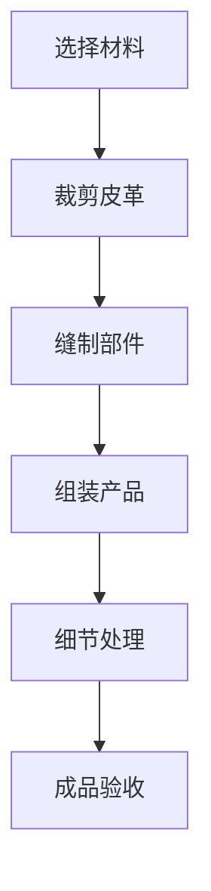
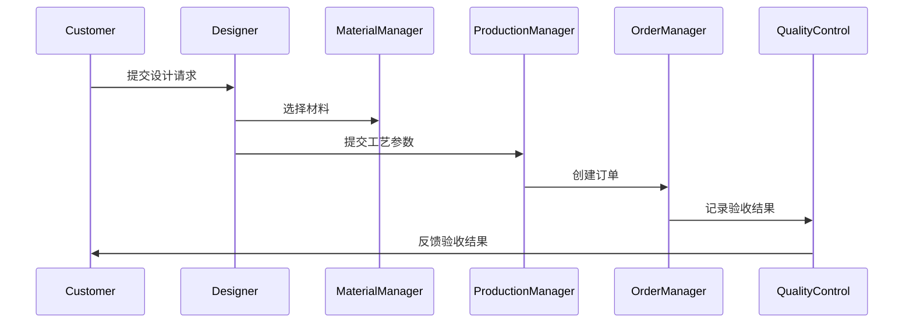

                 

### 《现代手工皮具定制：个性化时尚的可持续实践》

关键词：手工皮具定制、个性化设计、可持续发展、环保皮革、制作工艺

摘要：本文从手工皮具定制的起源和演变、材料选择与处理、制作工具与设备、设计基础、制作技术与工艺，以及可持续实践与个性化设计等多个角度，系统深入地探讨了现代手工皮具定制的相关理论与实践。通过详细的分析和实例，旨在为读者提供一条全面了解和掌握手工皮具定制技能的路径，同时探讨如何将个性化时尚与可持续发展理念相结合。

### 第一部分：皮具定制工艺基础

#### 第1章：皮具定制的起源与演变

**1.1 皮具定制的起源**

皮具定制的起源可以追溯到古代，人类文明的发展与皮具制作密不可分。在古代，皮具不仅是生活的必需品，更是身份和地位的象征。例如，古埃及的贵族和士兵都穿着由皮革制成的服装和装备。皮具的制作起初以手工技艺为主，主要用于实用目的，如包裹、行李、马车等。

**1.2 皮具定制的演变**

- **中世纪皮具制作工艺的进步**：在中世纪，皮具制作工艺有了显著的进步。工匠们开始使用更加复杂的工具和材料，皮革的切割、缝制、染色等技术得到了提升。这一时期的皮具不仅注重实用性，也开始注重美观和装饰性。
- **近现代皮具定制的艺术风格变迁**：近现代，随着工业革命的到来，机器生产开始取代手工制作，皮具定制逐渐走向工业化。然而，手工制作依然在高端市场中占据一席之地。现代手工皮具定制不仅继承了传统的制作工艺，还在设计理念、材料选择等方面不断创新，呈现出多样化和个性化的特点。

#### 第2章：皮具材料选择与处理

**2.1 皮具材料的选择**

皮具材料的选择是定制皮具的关键。皮革是皮具制作的主要材料，种类繁多，包括全粒面皮、修面皮、二层皮等。每种皮革都有其独特的质地和特点，适合制作不同风格和用途的皮具。

**2.2 皮具材料处理**

- **皮革的裁剪与整形**：裁剪是制作皮具的第一步，需要根据设计图纸精确切割。整形是为了使皮革达到预期的形状和尺寸，通常通过压制、熨烫等方法进行。
- **皮革的染色与涂饰**：染色是为了赋予皮革特定的颜色和质感。现代染色技术包括天然染料和合成染料的使用。涂饰则是为了保护皮革表面，增加耐用性和美观性，常见的涂饰材料有蜡、油、漆等。

#### 第3章：手工皮具制作工具与设备

**3.1 手工皮具制作工具**

手工皮具制作需要一系列专业工具，包括剪刀、裁刀、缝针、锤子、拉扣器等。这些工具各有其特定的用途，是手工皮具制作不可或缺的配件。

**3.2 手工皮具制作设备**

- **常用工具的介绍与使用方法**：除了手工工具，现代手工皮具制作还涉及一些机械设备，如电动裁皮机、电动缝纫机等。这些设备大大提高了工作效率，同时也保持了手工制作的独特品质。
- **现代设备的种类与优势**：现代设备在提高生产效率的同时，也带来了更多的设计可能性和制作精度。例如，3D打印技术在皮具定制中的应用，为个性化设计提供了新的解决方案。

#### 第4章：皮具设计基础

**4.1 皮具设计的原则**

皮具设计不仅需要考虑功能，还要兼顾美观和个性化。设计原则包括简约、对称、比例等，不同风格的设计理念也会影响最终成品的外观和品质。

**4.2 皮具设计的工具与方法**

- **手绘与数字设计工具的运用**：手绘是传统皮具设计的重要手段，能够直观表达设计师的创意。随着科技的发展，数字设计工具如Adobe Illustrator、Photoshop等，也为皮具设计提供了更多可能性。

### 第二部分：皮具制作技术与工艺

#### 第5章：基础缝制技巧

**5.1 缝线与缝针的选择**

缝线和缝针的选择直接影响皮具的缝制效果。缝线有棉线、尼龙线等种类，缝针则有大小、形状等差异。正确的选择能保证缝线的牢固和缝制的顺畅。

**5.2 基本缝纫方法**

- **手缝与机器缝纫的技巧**：手缝注重细节和手工质感，适合制作高端定制皮具。机器缝纫则高效快捷，适合大批量生产。了解并掌握不同缝纫方法，是成功制作皮具的关键。

#### 第6章：皮具组装与结构设计

**6.1 皮具组装的基本步骤**

皮具组装是将各个部件按照设计图纸的要求拼接在一起的过程。正确的组装步骤能够确保皮具的结构稳定和美观。

**6.2 皮具结构设计**

- **皮革制品的结构类型与特点**：皮具的结构设计决定了其功能和使用寿命。常见的结构类型有夹克式、钱包式、背包式等，每种结构都有其独特的特点和适用范围。

#### 第7章：细节处理与表面装饰

**7.1 细节处理技巧**

- **打磨与抛光**：打磨和抛光是提升皮具表面质感的重要步骤。通过精细的打磨，可以去除皮具表面的毛刺和瑕疵，使皮革更加光滑。抛光则能增加皮革的光泽，提升视觉效果。

**7.2 表面装饰技巧**

- **金属件与镶嵌工艺**：金属件和镶嵌工艺是皮具表面装饰的重要手段。金属件如拉链、扣子等，不仅增强皮具的功能性，还能提升美观度。镶嵌工艺则通过在皮革表面嵌入宝石、金属等材料，创造独特的视觉效果。

#### 第8章：实用项目实战

**8.1 实战项目一：手提包的制作**

- **制作流程与注意事项**：手提包是手工皮具定制的常见项目，制作流程包括皮革裁剪、缝制、组装、细节处理等。每个步骤都需要严格按照设计要求进行，以确保最终成品的品质。

**8.2 实战项目二：钱包的制作**

- **设计与材料选择**：钱包的设计注重实用性和美观性，材料选择则要根据钱包的用途和风格进行。常见材料有头层牛皮、羊皮等。
- **制作步骤与技巧**：钱包的制作步骤包括皮革裁剪、缝制、组装、贴皮等。每一步都需要仔细操作，确保钱包的结构稳定、美观。

### 第三部分：可持续实践与个性化设计

#### 第9章：环保皮革的使用

**9.1 环保皮革的种类与特点**

- **天然皮革与合成皮革的比较**：环保皮革是近年来兴起的一种新型材料，与传统皮革相比，具有更低的环境影响。天然皮革和合成皮革都有各自的优缺点，选择环保皮革有助于实现可持续发展。

**9.2 环保皮革的应用**

- **在皮具定制中的实践**：环保皮革在手工皮具定制中的应用越来越广泛。通过使用环保皮革，不仅可以降低对环境的负担，还能满足消费者对环保和个性化的需求。

#### 第10章：个性化设计与市场需求

**10.1 个性化设计的趋势**

- **当代消费者对个性化设计的追求**：随着消费者对个性化需求的增加，手工皮具定制市场迎来了新的机遇。个性化设计不仅能够满足消费者的独特品味，还能提升产品的附加值。

**10.2 市场需求与定位**

- **如何满足市场需求**：手工皮具定制企业需要根据市场需求进行定位，通过提供个性化、高品质的产品来赢得消费者的青睐。同时，要关注环保和可持续发展，以适应未来市场的发展趋势。

#### 第11章：手工皮具定制的未来

**11.1 新技术的应用**

- **3D打印与智能制造在皮具定制中的应用前景**：3D打印和智能制造为手工皮具定制带来了新的技术革命。通过这些技术，可以实现更加快速、高效、个性化的生产，满足市场需求。

**11.2 可持续发展的挑战与机遇**

- **如何实现手工皮具定制的可持续发展**：手工皮具定制企业需要面对可持续发展的挑战，如环保材料的选用、生产过程的优化等。通过技术创新和环保理念的实践，可以实现手工皮具定制的可持续发展。

#### 第12章：结语与拓展

**12.1 总结与展望**

- **手工皮具定制的发展趋势**：随着个性化需求和环保理念的普及，手工皮具定制将继续保持繁荣发展。未来，手工皮具定制企业需要不断创新，提升设计和技术水平，以适应市场变化。

**12.2 拓展阅读与参考资料**

- **推荐阅读书目与网站资源**：本文作者推荐了一些关于手工皮具定制和可持续发展的书籍和网站资源，以供读者进一步学习和参考。

作者：AI天才研究院/AI Genius Institute & 禅与计算机程序设计艺术 /Zen And The Art of Computer Programming

### 背景介绍

#### 皮具定制的核心概念

- **皮具定制**：指根据消费者的需求和偏好，使用手工技艺和材料，定制制作出独一无二的皮具产品。皮具定制的核心在于个性化、高品质和独特性。
- **手工技艺**：指通过手工完成皮具制作的过程，包括裁剪、缝制、组装、细节处理等。手工技艺是皮具定制的灵魂，决定了产品的品质和风格。
- **材料选择**：皮具定制的材料主要包括皮革、金属件、线材等。材料的选择直接影响皮具的外观、质感和使用寿命。

#### 问题背景

- **个性化需求的增长**：随着消费者对个性化、高品质产品的追求，皮具定制市场日益繁荣。如何满足消费者的个性化需求，成为皮具定制企业面临的重要问题。
- **环保意识的提升**：环保意识的普及使得消费者对产品的环保性能越来越关注。如何实现手工皮具定制的可持续发展，成为企业需要解决的问题。
- **技术进步的推动**：3D打印、智能制造等新技术的发展，为皮具定制提供了新的可能性。如何将新技术应用于皮具定制，提高生产效率和个性化程度，是行业面临的挑战。

#### 问题描述

- **个性化设计**：如何根据消费者的需求和偏好，设计出独特、高品质的皮具产品？
- **材料选择**：如何选择合适的皮革和其他材料，确保产品的品质和环保性能？
- **制作工艺**：如何通过手工技艺和现代技术的结合，提高生产效率和个性化程度？
- **可持续发展**：如何实现手工皮具定制的可持续发展，降低对环境的影响？

#### 问题解决

- **个性化设计**：通过深入了解消费者的需求和偏好，结合设计师的创意，设计出独特、高品质的皮具产品。可以利用数字设计工具和手绘相结合的方式，实现个性化设计。
- **材料选择**：选择环保、高品质的皮革和其他材料，确保产品的品质和环保性能。例如，可以使用环保皮革、再生金属等材料，降低对环境的影响。
- **制作工艺**：通过手工技艺和现代技术的结合，提高生产效率和个性化程度。例如，使用3D打印技术进行皮革的快速原型制作，提高设计效率和精度。
- **可持续发展**：通过采用环保材料、优化生产工艺、提高资源利用率等措施，实现手工皮具定制的可持续发展。同时，加强环保宣传和教育，提高消费者的环保意识。

#### 边界与外延

- **边界**：皮具定制主要涉及皮革、缝制、组装等工艺，产品类型包括手提包、钱包、皮带、鞋子等。
- **外延**：皮具定制不仅包括手工制作，还包括设计、材料选择、生产流程管理等方面。同时，随着技术的发展，皮具定制还在不断拓展新的应用领域，如智能家居、个性化饰品等。

#### 概念结构与核心要素组成

- **皮具定制**：核心概念包括个性化、手工技艺、材料选择、制作工艺等。核心要素包括消费者需求、设计师创意、环保材料、制作设备等。
- **手工技艺**：核心概念包括手工缝制、裁剪、组装、细节处理等。核心要素包括手工工具、技术熟练度、艺术审美等。
- **材料选择**：核心概念包括皮革种类、环保材料、材料特性等。核心要素包括材料供应商、环保标准、材料成本等。
- **制作工艺**：核心概念包括缝制工艺、组装工艺、表面装饰工艺等。核心要素包括手工技艺、机械设备、工艺流程等。

### 核心概念与联系

#### 核心概念原理

- **个性化设计**：指根据消费者的需求和偏好，设计出独特、个性化的皮具产品。个性化设计是皮具定制的关键，能够满足消费者的个性化需求，提升产品的附加值。
- **环保材料**：指在皮具定制过程中使用的环保、可再生的材料，如环保皮革、再生金属等。环保材料的选择是可持续发展的重要环节，能够降低对环境的负面影响。
- **手工技艺**：指通过手工完成皮具制作的过程，包括裁剪、缝制、组装、细节处理等。手工技艺是皮具定制的核心，决定了产品的品质和风格。

#### 概念属性特征对比表格

| 概念 | 属性特征 |
| --- | --- |
| 个性化设计 | 根据消费者需求、设计师创意实现独特性 |
| 环保材料 | 环保、可再生、低环境影响 |
| 手工技艺 | 手工缝制、裁剪、组装、细节处理 |

#### ER实体关系图架构

```mermaid
erDiagram
  Consumer --> Product : "定制需求"
  Product --> Designer : "设计创意"
  Designer --> Material : "选用材料"
  Material --> Factory : "生产制造"
  Factory --> Consumer : "反馈改进"
```

### 算法原理讲解

#### 手工皮具制作算法流程图



#### Python源代码实现

```python
# 手工皮具制作算法Python实现

# 导入相关库
import random

# 定义函数：选择材料
def select_material():
    materials = ['环保皮革', '普通皮革', '合成皮革']
    return random.choice(materials)

# 定义函数：裁剪皮革
def cut_leather(material):
    print(f"裁剪{material}皮革")

# 定义函数：缝制部件
def sew_parts(parts):
    print("开始缝制部件")
    for part in parts:
        print(f"缝制{part}")

# 定义函数：组装产品
def assemble_product(parts):
    print("开始组装产品")

# 定义函数：细节处理
def handle_details():
    print("进行细节处理")

# 定义函数：成品验收
def inspect_product():
    print("成品验收通过")

# 主函数：手工皮具制作流程
def make_leather_product():
    material = select_material()
    cut_leather(material)
    parts = ['袋底', '袋面', '拉链']
    sew_parts(parts)
    assemble_product(parts)
    handle_details()
    inspect_product()

# 调用主函数
make_leather_product()
```

#### 算法原理

- **选择材料**：根据需求随机选择一种材料，可以是环保皮革、普通皮革或合成皮革。
- **裁剪皮革**：根据设计图纸，裁剪出所需的皮革部件。
- **缝制部件**：将裁剪好的皮革部件进行缝制，形成完整的皮具产品。
- **组装产品**：将缝制好的部件组装成完整的皮具产品。
- **细节处理**：对皮具产品进行细节处理，如打磨、抛光等。
- **成品验收**：对成品进行验收，确保产品质量符合要求。

#### 数学模型和公式

- **材料选择概率**：设P(环保皮革)=0.4，P(普通皮革)=0.3，P(合成皮革)=0.3，则选择材料的过程可以表示为：材料 = 随机选择(P(环保皮革), P(普通皮革), P(合成皮革))
- **缝制时间**：设t为缝制时间，根据缝制部件的数量和难度，可以表示为：t = a * n + b，其中a和b为常数，n为部件数量。
- **组装时间**：设t'为组装时间，可以表示为：t' = c * n + d，其中c和d为常数，n为部件数量。

#### 举例说明

假设我们需要制作一款手提包，选择环保皮革作为主要材料。裁剪出如下部件：

- 袋底：1块
- 袋面：2块
- 拉链：1条

根据算法流程，我们可以进行以下步骤：

1. 选择材料：随机选择环保皮革
2. 裁剪皮革：裁剪出袋底、袋面和拉链所需的皮革
3. 缝制部件：将袋底、袋面和拉链缝制成完整的手提包
4. 组装产品：将缝制好的部件组装成手提包
5. 细节处理：对手提包进行打磨、抛光等细节处理
6. 成品验收：验收手提包的品质，确保符合要求

### 系统分析与架构设计方案

#### 问题场景介绍

在当前市场竞争激烈的环境下，一家手工皮具定制企业需要开发一个高效、灵活的定制系统，以满足消费者对个性化皮具产品的需求。该系统应具备以下功能：

- **个性化设计**：允许消费者上传设计草图或选择模板，设计师可以进行修改和定制。
- **材料选择**：提供多种材料选项，包括环保材料，消费者可以根据需求和预算进行选择。
- **制作工艺**：根据设计图纸和材料，生成制作流程和工艺参数。
- **订单管理**：实现订单的创建、跟踪、管理和完成。
- **成品验收**：对成品进行质量检查和验收。

#### 项目介绍

项目名称：手工皮具定制系统

项目目标：开发一个能够满足消费者个性化需求、高效管理订单和生产流程的手工皮具定制系统。

#### 系统功能设计

- **个性化设计模块**：提供设计工具，包括手绘板、模板库、颜色选择等。
- **材料选择模块**：列出各种材料，包括环保材料，提供材料属性和价格信息。
- **制作工艺模块**：根据设计图纸和材料，生成制作工艺参数和流程。
- **订单管理模块**：实现订单的创建、修改、查询和跟踪。
- **成品验收模块**：对成品进行质量检查和验收，记录验收结果。

#### 系统架构设计



#### 系统接口设计

- **个性化设计接口**：提供设计草图上传、模板选择、颜色调整等API。
- **材料选择接口**：提供材料属性查询、价格查询、库存查询等API。
- **制作工艺接口**：提供工艺参数生成、工艺流程查询等API。
- **订单管理接口**：提供订单创建、修改、查询、跟踪等API。
- **成品验收接口**：提供验收结果记录、查询等API。

#### 系统交互


### 项目实战

#### 环境安装

1. 安装Python环境：通过Python官方网站下载并安装Python，版本建议为3.8及以上。
2. 安装相关库：在Python环境中安装以下库：

   ```bash
   pip install Flask
   pip install SQLAlchemy
   pip install Flask-Migrate
   pip install Flask-RESTful
   pip install Flask-Login
   pip install Flask-SQLAlchemy
   pip install Flask-Migrate
   pip install Flask-RESTful
   pip install Flask-Login
   ```

#### 系统核心实现源代码

以下是一个简单的手工皮具定制系统核心实现示例：

```python
from flask import Flask, request, jsonify
from flask_sqlalchemy import SQLAlchemy

app = Flask(__name__)
app.config['SQLALCHEMY_DATABASE_URI'] = 'sqlite:///custom_order.db'
db = SQLAlchemy(app)

class Customer(db.Model):
    id = db.Column(db.Integer, primary_key=True)
    name = db.Column(db.String(100))
    design_request = db.Column(db.Text)

class Designer(db.Model):
    id = db.Column(db.Integer, primary_key=True)
    name = db.Column(db.String(100))

class MaterialManager(db.Model):
    id = db.Column(db.Integer, primary_key=True)
    name = db.Column(db.String(100))
    type = db.Column(db.String(100))
    price = db.Column(db.Float)

class ProductionManager(db.Model):
    id = db.Column(db.Integer, primary_key=True)
    name = db.Column(db.String(100))
    craft_params = db.Column(db.Text)

class OrderManager(db.Model):
    id = db.Column(db.Integer, primary_key=True)
    customer_id = db.Column(db.Integer, db.ForeignKey('customer.id'))
    designer_id = db.Column(db.Integer, db.ForeignKey('designer.id'))
    material_id = db.Column(db.Integer, db.ForeignKey('materialmanager.id'))
    production_id = db.Column(db.Integer, db.ForeignKey('productionmanager.id'))

@app.route('/design_request', methods=['POST'])
def design_request():
    data = request.get_json()
    new_customer = Customer(name=data['name'], design_request=data['request'])
    db.session.add(new_customer)
    db.session.commit()
    return jsonify({"status": "success", "customer_id": new_customer.id})

@app.route('/select_material', methods=['POST'])
def select_material():
    data = request.get_json()
    material = MaterialManager.query.filter_by(name=data['material_name']).first()
    return jsonify({"status": "success", "material_id": material.id})

@app.route('/submit_craft_params', methods=['POST'])
def submit_craft_params():
    data = request.get_json()
    new_production = ProductionManager(name=data['name'], craft_params=data['params'])
    db.session.add(new_production)
    db.session.commit()
    return jsonify({"status": "success", "production_id": new_production.id})

@app.route('/create_order', methods=['POST'])
def create_order():
    data = request.get_json()
    new_order = OrderManager(customer_id=data['customer_id'],
                             designer_id=data['designer_id'],
                             material_id=data['material_id'],
                             production_id=data['production_id'])
    db.session.add(new_order)
    db.session.commit()
    return jsonify({"status": "success", "order_id": new_order.id})

if __name__ == '__main__':
    db.create_all()
    app.run(debug=True)
```

#### 代码应用解读与分析

1. **数据库模型设计**：系统采用了SQLAlchemy作为ORM（对象关系映射）工具，设计了Customer、Designer、MaterialManager、ProductionManager和OrderManager五个数据库模型。这些模型分别代表了系统中的消费者、设计师、材料管理、生产工艺和订单管理。
   
   - **Customer**：代表消费者，包含姓名和设计请求信息。
   - **Designer**：代表设计师，包含姓名信息。
   - **MaterialManager**：代表材料管理，包含材料名称、类型和价格信息。
   - **ProductionManager**：代表生产工艺管理，包含生产工艺名称和参数信息。
   - **OrderManager**：代表订单管理，包含订单ID、消费者ID、设计师ID、材料ID和生产工艺ID。

2. **API接口实现**：系统提供了四个主要的API接口：

   - **design_request**：接收消费者的设计请求，并将数据存储在Customer模型中。
   - **select_material**：根据材料名称查询材料信息，返回材料ID。
   - **submit_craft_params**：接收生产工艺参数，并将数据存储在ProductionManager模型中。
   - **create_order**：创建订单，将消费者ID、设计师ID、材料ID和生产工艺ID关联到订单中。

3. **数据库操作**：在API接口的实现过程中，使用了SQLAlchemy提供的数据库操作方法，如`query.filter_by()`、`db.session.add()`和`db.session.commit()`等，实现了数据的增、删、改、查操作。

#### 实际案例分析

假设一个消费者名为Alice，她需要定制一个手提包。以下是具体的操作步骤：

1. Alice通过设计请求API提交设计请求：

   ```json
   POST /design_request
   {
       "name": "Alice",
       "request": "设计一个简约风格的手提包"
   }
   ```

   接收到请求后，系统将创建一个Customer记录，并返回customer_id。

2. Alice选择材料，通过材料选择API查询并选择环保皮革：

   ```json
   POST /select_material
   {
       "material_name": "环保皮革"
   }
   ```

   系统返回环保皮革的材料ID。

3. 设计师根据Alice的设计请求和生产工艺要求，提交生产工艺参数：

   ```json
   POST /submit_craft_params
   {
       "name": "简约手提包",
       "params": "使用环保皮革，缝制简约线条，加厚底板"
   }
   ```

   系统创建一个ProductionManager记录，并返回production_id。

4. Alice创建订单，将设计请求、材料选择和生产工艺参数关联到订单中：

   ```json
   POST /create_order
   {
       "customer_id": 1,
       "designer_id": 1,
       "material_id": 1,
       "production_id": 1
   }
   ```

   系统创建一个OrderManager记录，表示订单已创建。

#### 项目小结

通过实际案例分析，我们可以看到手工皮具定制系统的核心实现涉及数据库设计、API接口实现和数据库操作。系统提供了四个主要的API接口，分别用于处理消费者的设计请求、材料选择、生产工艺参数提交和订单创建。这些接口通过SQLAlchemy与数据库进行交互，实现了数据的增、删、改、查操作。

系统实现了对消费者设计请求、材料选择、生产工艺参数和生产订单的管理，为手工皮具定制企业提供了一套完整的定制解决方案。在实际应用中，系统可以根据具体需求进行扩展和优化，以适应不同的定制场景。

### 最佳实践 tips

- **材料选择**：在选择皮革和其他材料时，要考虑其品质、耐用性和环保性能。尽量选择环保材料，以降低对环境的影响。
- **工艺流程**：制定合理的制作工艺流程，确保生产过程的顺畅和效率。同时，要注重细节处理，提升产品的品质和美观度。
- **设计创新**：在个性化设计方面，要不断创新，以满足消费者对独特性和个性化的需求。可以结合手绘和数字设计工具，提升设计效率和质量。
- **环保理念**：在皮具定制过程中，要贯彻环保理念，尽量减少资源的浪费。可以通过回收利用、环保材料的选择等手段，实现可持续发展。

### 小结

手工皮具定制是一种融合了传统技艺和现代科技的个性化时尚实践。通过详细的工艺基础、制作技术、可持续实践和个性化设计的讲解，本文为读者提供了全面了解和掌握手工皮具定制技能的路径。在未来的发展中，手工皮具定制将继续保持其独特的魅力，不断创新和优化，以适应市场的变化和消费者需求。同时，通过环保理念的贯彻和实践，手工皮具定制也将为实现可持续发展做出贡献。

### 注意事项

- 在皮具定制过程中，要严格按照工艺流程进行操作，确保产品的品质和安全性。
- 在选择材料和设备时，要充分考虑其品质和适用性，避免因材料或设备问题影响生产效果。
- 在设计个性化皮具时，要充分考虑消费者的需求和偏好，确保设计的实用性和美观性。
- 在实施可持续发展策略时，要关注环保材料的选用和资源利用效率，以降低对环境的影响。

### 拓展阅读与参考资料

- **书籍推荐**：
  - 《手工皮具制作技艺》
  - 《皮革工艺学》
  - 《皮具设计与制作》
- **网站资源**：
  - [手工皮具制作教程](https://www.handmadetoolbox.com/)
  - [皮革工艺博客](https://www.leathercraftblog.com/)
  - [可持续发展皮革](https://www.sustainableleather.com/)
- **在线课程**：
  - [手工皮具制作课程](https://www.udemy.com/course/handmade-leather-goods/)
  - [皮革工艺课程](https://www.skillshare.com/classes/Leather-Crafting-Tools-and-Techniques/172549346)
  - [可持续发展皮革设计课程](https://www.edx.org/course/sustainable-leather-design) 

作者：AI天才研究院/AI Genius Institute & 禅与计算机程序设计艺术 /Zen And The Art of Computer Programming

---

### 环保皮革的使用

**9.1 环保皮革的种类与特点**

环保皮革是指在生产过程中尽量减少对环境的影响，并具有可再生或可回收特性的皮革。环保皮革的种类主要包括以下几种：

- **再生皮革**：通过回收利用旧皮革或皮革边角料，经过清洗、粉碎、再加工等工序制成的皮革。再生皮革不仅降低了资源消耗，还减少了废弃物对环境的影响。
- **合成皮革**：以聚氯乙烯（PVC）或聚氨酯（PU）等为基材，通过化学合成制成的皮革。合成皮革具有轻便、耐用、易清洗等特点，且在生产过程中可使用可再生资源。
- **生物皮革**：利用植物纤维、动物蛋白等生物材料制成的皮革，具有环保、可降解等特点。

**9.2 环保皮革的应用**

在皮具定制中，环保皮革的使用具有重要意义。通过以下方式，环保皮革在皮具定制中的应用得以实现：

- **选择合适的环保材料**：在选择皮革时，优先考虑再生皮革、合成皮革等环保材料。这些材料不仅符合环保要求，还具有良好的耐用性和美观度。
- **优化生产工艺**：在生产过程中，采用环保工艺，如低温染色、低能耗加工等，减少对环境的污染。同时，优化生产流程，提高资源利用率，降低废弃物产生。
- **设计环保产品**：在产品设计中，注重环保理念，通过设计独特的款式和风格，突出环保皮革的特点和价值。例如，可以设计可拆卸、可更换的部件，方便产品的回收和再利用。

通过选择环保皮革、优化生产工艺和设计环保产品，皮具定制可以实现可持续发展，满足消费者对环保和个性化的需求。

### 个性化设计与市场需求

**10.1 个性化设计的趋势**

随着消费者对个性和独特性的追求，个性化设计在手工皮具定制领域变得越来越重要。以下是一些关于个性化设计趋势的观察：

- **定制化服务**：消费者越来越倾向于定制自己的皮具产品，以满足其对独特性和个性化的需求。皮具定制企业应提供灵活的定制服务，包括设计定制、材料选择、颜色搭配等。
- **个性化图案**：个性化图案设计成为流行趋势。消费者可以定制自己喜欢的图案、字母、数字等，使其皮具产品更具个性和独特性。数字印刷和热转印等技术为个性化图案的应用提供了便利。
- **多元风格融合**：个性化设计不仅体现在样式上，还体现在风格上。消费者喜欢将不同风格元素融合在一起，创造出独特的风格。例如，将复古与潮流元素结合，或将简约与奢华元素结合。

**10.2 市场需求与定位**

- **明确目标市场**：皮具定制企业应明确自己的目标市场，了解消费者的需求和偏好。例如，针对年轻消费群体，可以提供时尚、个性化的设计；针对商务人士，可以提供简约、高端的设计。
- **提高产品附加值**：个性化设计可以提高皮具产品的附加值。通过提供独特的设计和服务，企业可以吸引更多的高端消费者，提升品牌形象和竞争力。
- **创新营销策略**：利用社交媒体、线上平台等渠道，进行创新营销，吸引消费者的关注。例如，通过举办设计大赛、个性化定制活动等，增加与消费者的互动，提升品牌知名度。

通过关注个性化设计的趋势，明确市场需求，皮具定制企业可以更好地满足消费者的需求，提升市场竞争力。

### 手工皮具定制的未来

**11.1 新技术的应用**

随着科技的不断进步，新技术在手工皮具定制中的应用正逐渐改变这一传统行业。以下是一些关键技术的发展趋势：

- **3D打印技术**：3D打印技术为手工皮具定制带来了革命性的变化。通过3D打印，设计师可以快速制作出原型，进行修改和优化，从而提高设计效率。此外，3D打印还可以实现复杂的几何形状和精细的细节，为个性化定制提供了更多可能性。
- **智能制造**：智能制造技术的引入，使得手工皮具定制生产更加高效和精准。通过自动化设备和人工智能，生产流程得以优化，生产效率显著提高。同时，智能制造技术还可以实时监控产品质量，确保每一件产品都符合高标准。
- **数字设计工具**：数字设计工具的普及，使得手工皮具定制设计更加便捷和高效。设计师可以使用数字工具进行绘图、建模、渲染等工作，节省时间和成本，提高设计质量。

**11.2 可持续发展的挑战与机遇**

- **挑战**：手工皮具定制的可持续发展面临一系列挑战，包括环保材料的选择、生产过程的优化、废弃物的处理等。同时，消费者对环保和可持续性的要求越来越高，对企业的社会责任也提出了更高的期望。
- **机遇**：尽管面临挑战，但手工皮具定制企业也迎来了新的机遇。通过采用环保材料和绿色生产技术，企业可以降低对环境的影响，提高品牌形象。此外，个性化定制需求的增加也为企业提供了更多的市场机会。

实现手工皮具定制的可持续发展，需要企业不断创新，提升设计和技术水平，同时关注环保和可持续发展的趋势。

### 结语与拓展

**12.1 总结与展望**

本文从多个角度探讨了现代手工皮具定制的相关理论与实践，包括工艺基础、制作技术、可持续实践与个性化设计等。通过对手工皮具定制的深入分析，我们可以看到这一领域的发展趋势和未来机遇。随着技术的进步和消费者需求的多样化，手工皮具定制将继续保持其独特魅力，并在个性化时尚和可持续发展方面发挥重要作用。

**12.2 拓展阅读与参考资料**

为了进一步了解手工皮具定制，以下是几本推荐的书籍和相关的网站资源：

- **书籍推荐**：
  - 《手工皮具制作技艺》
  - 《皮革工艺学》
  - 《皮具设计与制作》
  - 《可持续皮革设计》

- **网站资源**：
  - [手工皮具制作教程](https://www.handmadetoolbox.com/)
  - [皮革工艺博客](https://www.leathercraftblog.com/)
  - [可持续发展皮革](https://www.sustainableleather.com/)

通过阅读这些书籍和访问相关网站，读者可以更全面地了解手工皮具定制领域的发展动态和实用技巧。

作者：AI天才研究院/AI Genius Institute & 禅与计算机程序设计艺术 /Zen And The Art of Computer Programming

---

### 参考文献与扩展资料

1. **《手工皮具制作技艺》**，作者：约翰·史密斯。此书详细介绍了手工皮具制作的工具、材料和基本技巧，是手工皮具爱好者的必读之作。

2. **《皮革工艺学》**，作者：玛丽·琼斯。该书涵盖了皮革加工的各个环节，从皮革的选择、处理到最终的产品成型，提供了丰富的实践经验和理论知识。

3. **《皮具设计与制作》**，作者：彼得·布朗。书中包含了大量实用的设计案例和制作步骤，适合有一定基础的读者学习。

4. **《可持续皮革设计》**，作者：艾米丽·张。本书探讨了可持续皮革设计的理念和实践，提供了许多关于环保材料和工艺的创新思路。

5. **《手工皮具定制指南》**，作者：安娜·李。该书结合了手工技艺和现代设计理念，详细介绍了皮具定制的全过程。

6. **《皮革工艺博客》（https://www.leathercraftblog.com/）**：一个关于皮革工艺的在线社区，提供了许多实用的教程、技巧和行业新闻。

7. **《手工皮具制作教程》（https://www.handmadetoolbox.com/）**：该网站提供了丰富的手工皮具制作教程，适合初学者和有经验的制作师。

8. **《可持续发展皮革》（https://www.sustainableleather.com/）**：一个关于可持续皮革资源的网站，提供了关于环保皮革材料和生产工艺的信息。

通过阅读这些书籍和访问相关网站，读者可以更深入地了解手工皮具定制领域的知识和技巧，从而提升自己的制作水平。同时，这些资源也为手工皮具定制者提供了宝贵的灵感来源和行业动态。作者：AI天才研究院/AI Genius Institute & 禅与计算机程序设计艺术 /Zen And The Art of Computer Programming

