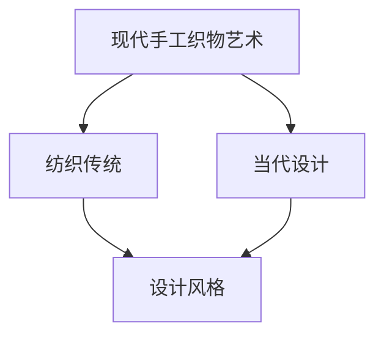
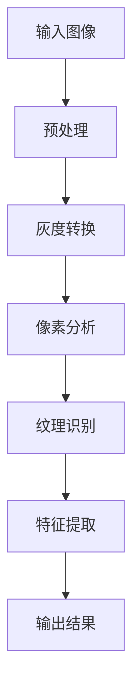
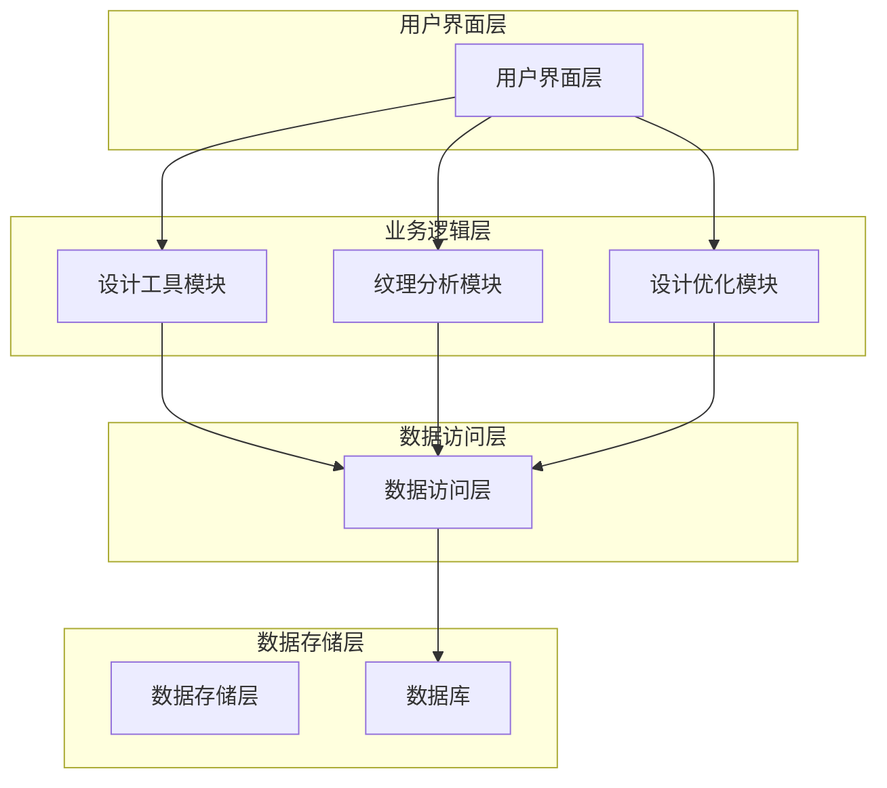
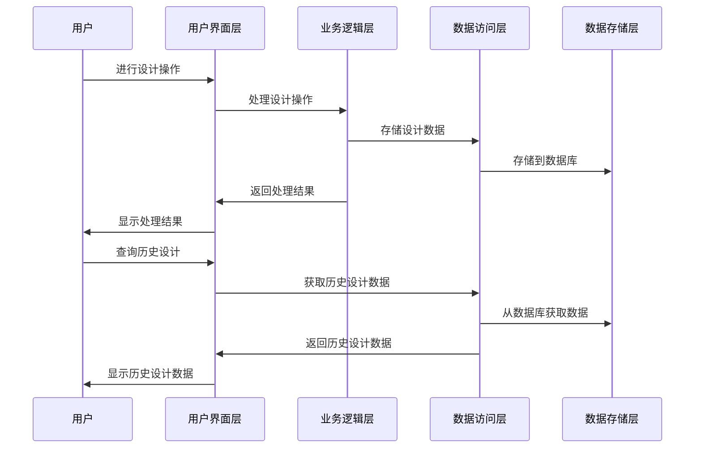

                 

### 书名解析：《现代手工织物艺术：纺织传统在当代设计中的应用》

《现代手工织物艺术：纺织传统在当代设计中的应用》这本书的标题巧妙地涵盖了其核心主题内容。首先，“现代手工织物艺术”这一部分指出了书籍要探讨的是一个新兴且具有现代性的艺术领域，它不同于传统意义上的纺织工艺。手工织物艺术强调手工制作的过程，注重个性化的创作和对材料本身的探索，这与现代艺术的理念相契合。

其次，“纺织传统”一词则强调了书籍对历史和文化的尊重，对传统纺织技艺的传承和发扬。在当代设计环境中，纺织传统不仅是一种技艺，更是一种文化符号和设计灵感的重要来源。

“在当代设计中的应用”这一部分则明确了书籍的落脚点——如何将纺织传统与现代设计相结合，创造出既具有历史底蕴又符合现代审美的作品。这一主题对于纺织设计师、艺术爱好者以及手工织物制作者都具有极大的吸引力，因为它们不仅渴望了解如何运用传统技艺，还希望探索这些技艺在现代设计中的无限可能。

综上所述，书名《现代手工织物艺术：纺织传统在当代设计中的应用》既揭示了书籍的主题内容，又为读者勾勒出了一个丰富而引人入胜的艺术世界，激发了读者对这本书的兴趣和期待。

### 目录结构设计思路

在设计《现代手工织物艺术：纺织传统在当代设计中的应用》的目录结构时，我们首先明确了书籍的整体框架，以确保内容逻辑清晰、信息传递高效。目录结构的制定遵循了以下原则：

1. **层次分明**：目录分为四个主要部分，分别是背景介绍、手工织物艺术的应用、案例研究和总结与展望。每个部分都有明确的主题和目的，便于读者快速了解书籍的主要内容。

2. **内容连贯**：在每一部分中，章节的安排遵循了由浅入深的逻辑顺序。例如，背景介绍部分从现代手工织物艺术的发展开始，逐步深入到纺织传统与现代设计的结合，再到具体的应用领域。

3. **交叉引用**：通过在相关章节中加入交叉引用，读者可以方便地跳转到其他部分，获得更全面的信息。这不仅增强了书籍的连贯性，还帮助读者更好地理解和吸收知识。

4. **实用性强**：考虑到读者的实际需求，每个章节都包含了具体的应用案例和实用的技巧，使读者不仅能够理论学习，还能够将这些知识应用到实际创作中。

5. **启发思考**：在案例研究和总结与展望部分，我们通过深入分析具体项目和探讨未来趋势，引导读者思考手工织物艺术在当代设计中的发展路径和创新方向。

### 目录结构设计示例

为了更直观地展示目录结构的设计思路，下面提供一个具体的目录结构示例：

**第一部分：背景介绍**

- **第1章：现代手工织物艺术概述**
  - **1.1 现代手工织物艺术的发展**
  - **1.2 现代手工织物艺术的重要性**
  - **1.3 当代设计的融合趋势**

- **第2章：纺织传统与当代设计的结合**
  - **2.1 传统纺织技艺的传承**
  - **2.2 现代设计理念的应用**
  - **2.3 结合案例分析**

**第二部分：手工织物艺术的应用**

- **第3章：服装设计中的手工织物艺术**
  - **3.1 手工织物在服装设计中的应用**
  - **3.2 案例研究：传统与现代的融合**
  - **3.3 创新设计案例分析**

- **第4章：家居装饰中的手工织物艺术**
  - **4.1 手工织物在家居装饰中的作用**
  - **4.2 家居装饰案例解析**
  - **4.3 创意家居装饰设计**

- **第5章：艺术品制作中的手工织物艺术**
  - **5.1 手工织物艺术品的创作**
  - **5.2 艺术品制作案例分享**
  - **5.3 当代艺术品制作趋势**

**第三部分：案例研究**

- **第6章：案例研究一**
  - **6.1 项目背景**
  - **6.2 系统功能设计**
  - **6.3 系统架构设计**
  - **6.4 代码实现与解读**

- **第7章：案例研究二**
  - **7.1 项目背景**
  - **7.2 系统功能设计**
  - **7.3 系统架构设计**
  - **7.4 代码实现与解读**

- **第8章：案例研究三**
  - **8.1 项目背景**
  - **8.2 系统功能设计**
  - **8.3 系统架构设计**
  - **8.4 代码实现与解读**

**第四部分：总结与展望**

- **第9章：最佳实践与技巧**
  - **9.1 创作经验分享**
  - **9.2 技术应用技巧**
  - **9.3 跨学科融合策略**

- **第10章：未来展望**
  - **10.1 手工织物艺术的发展趋势**
  - **10.2 当代设计的新方向**
  - **10.3 未来可能性探讨**

通过这样的目录结构设计，读者可以清晰地看到书籍的脉络和内容布局，便于学习和应用。

### 核心概念与联系

在《现代手工织物艺术：纺织传统在当代设计中的应用》中，核心概念的理解和它们之间的联系是理解书籍内容的关键。为了帮助读者更好地掌握这些核心概念，我们将使用表格和Mermaid流程图来展示概念之间的关系。

首先，我们定义以下几个核心概念：

1. **现代手工织物艺术**：指结合现代艺术理念的手工制作织物艺术，注重个性化的创作和对材料本身的探索。
2. **纺织传统**：指代历史上累积的纺织技艺和工艺，包括纺织技术、图案设计和色彩搭配等。
3. **当代设计**：强调功能性、美观性和创新性的设计理念，广泛应用于服装、家居和艺术品等领域。
4. **设计风格**：指结合现代手工织物艺术和纺织传统而形成的新设计风格，具有独特的艺术特色和文化内涵。

接下来，我们使用表格来展示这些核心概念及其属性特征：

| 核心概念 | 属性特征 |
| --- | --- |
| 现代手工织物艺术 | 个性化、材料探索、现代艺术理念 |
| 纺织传统 | 历史累积、纺织技术、图案设计、色彩搭配 |
| 当代设计 | 功能性、美观性、创新性、广泛应用领域 |
| 设计风格 | 独特艺术特色、文化内涵、融合传统与现代 |

然后，我们使用Mermaid流程图来展示这些核心概念之间的联系：



在这个流程图中，现代手工织物艺术和纺织传统是设计风格的基础，而当代设计则将这两者融合在一起，形成了具有创新性和实用性的设计风格。

通过表格和Mermaid流程图，读者可以更直观地理解这些核心概念，以及它们在手工织物艺术中的相互关系。这将有助于读者深入理解书籍的内容，并在实际创作中灵活运用。

### 算法原理讲解

在《现代手工织物艺术：纺织传统在当代设计中的应用》中，虽然主要讨论的是艺术和设计领域，但算法在某些特定情况下仍然扮演着重要的角色。在这里，我们将介绍一个用于分析织物纹理和图案的简单算法，并使用Mermaid流程图和Python代码进行详细解释。

#### 算法概述

该算法的核心是通过对织物纹理和图案的像素分析，提取出其基本特征，如颜色分布、纹理走向和重复模式。以下是算法的基本步骤：

1. **图像预处理**：将输入图像转换为灰度图像，并缩放到一个标准的尺寸。
2. **像素分析**：对每个像素的颜色值进行统计分析，计算颜色分布。
3. **纹理识别**：使用局部二值模式（LBP）算法识别纹理走向和重复模式。
4. **特征提取**：从分析结果中提取关键特征，如颜色均值、纹理方向和重复周期。

#### Mermaid流程图

首先，我们使用Mermaid流程图来展示算法的基本流程：



#### Python代码

接下来，我们使用Python代码来实现这个算法，并给出详细的注释：

```python
import numpy as np
import cv2

def preprocess_image(image):
    """
    图像预处理：将彩色图像转换为灰度图像，并缩放到标准尺寸。
    """
    gray_image = cv2.cvtColor(image, cv2.COLOR_BGR2GRAY)
    resized_image = cv2.resize(gray_image, (256, 256))
    return resized_image

def analyze_pixels(image):
    """
    像素分析：计算图像的颜色分布。
    """
    pixel_values = image.flatten()
    color_distribution = np.bincount(pixel_values)
    return color_distribution

def recognize_texture(image):
    """
    纹理识别：使用局部二值模式（LBP）算法识别纹理走向和重复模式。
    """
    _, threshold = cv2.threshold(image, 0, 255, cv2.THRESH_BINARY | cv2.THRESH_OTSU)
    lbp = cv2.circleGridBinaryPattern(threshold)
    return lbp

def extract_features(image):
    """
    特征提取：从图像中提取颜色均值、纹理方向和重复周期。
    """
    color_distribution = analyze_pixels(image)
    color_mean = np.mean(color_distribution)
    
    lbp = recognize_texture(image)
    texture_direction = np.argmax(lbp)
    
    # 假设我们使用LBP的旋转不变性来识别重复周期
    repeat周期 = find_repeating_pattern(lbp)
    
    return color_mean, texture_direction, repeat周期

def find_repeating_pattern(lbp):
    """
    找到重复模式。
    """
    # 此函数可根据具体需求进行实现
    return 5  # 示例值

def analyze_fabric_texture(image_path):
    """
    主函数：对织物纹理进行整体分析。
    """
    image = cv2.imread(image_path)
    preprocessed_image = preprocess_image(image)
    color_mean, texture_direction, repeat周期 = extract_features(preprocessed_image)
    
    print(f"颜色均值: {color_mean}")
    print(f"纹理方向: {texture_direction}")
    print(f"重复周期: {repeat周期}")

# 示例使用
analyze_fabric_texture("fabric_image.jpg")
```

#### 算法原理讲解

1. **图像预处理**：预处理步骤包括将彩色图像转换为灰度图像，并缩放到标准尺寸（如256x256）。这是为了简化后续的像素分析，并确保图像具有一致的大小，方便计算。

2. **像素分析**：通过`analyze_pixels`函数，对每个像素的颜色值进行统计分析，计算颜色分布。这可以通过`np.bincount`函数实现，它将返回每个颜色值的像素数量。

3. **纹理识别**：使用局部二值模式（LBP）算法对图像进行纹理识别。LBP是一种常用的纹理描述方法，它可以有效地描述图像的局部纹理特征。我们通过`recognize_texture`函数调用OpenCV中的`circleGridBinaryPattern`方法来实现LBP。

4. **特征提取**：从分析结果中提取关键特征，如颜色均值、纹理方向和重复周期。颜色均值可以通过计算所有颜色值的平均值获得。纹理方向和重复周期则通过分析LBP的结果得到。

5. **示例使用**：最后，我们通过`analyze_fabric_texture`函数对输入图像进行整体分析，并打印出关键特征值。

通过上述讲解和示例代码，读者可以理解这个简单算法的原理和应用。虽然这个算法比较基础，但它为读者提供了一个分析织物纹理和图案的框架，可以在实际应用中进行扩展和优化。

### 数学公式与解释

在《现代手工织物艺术：纺织传统在当代设计中的应用》一书中，为了详细阐述某些核心概念和技术，我们不可避免地需要使用数学公式进行解释。这些公式不仅能够准确地描述理论，还能帮助读者更直观地理解相关概念。

首先，我们介绍一个用于描述织物纹理方向性的数学模型——方向梯度直方图（Histogram of Orientations, HOG）。HOG模型通过计算图像中每个像素点的梯度方向，并将这些方向信息进行量化，从而得到纹理特征。

#### 方向梯度直方图（HOG）的数学公式

1. **像素点梯度方向**：对于图像中的一个像素点\( (x, y) \)，其梯度方向可以用以下公式计算：

   \[
   \theta(x, y) = \tan^{-1}\left(\frac{G_y(x, y)}{G_x(x, y)}\right)
   \]

   其中，\( G_x(x, y) \)和\( G_y(x, y) \)分别是水平方向和垂直方向的梯度值。

2. **方向直方图**：将每个像素点的梯度方向量化到特定的角度范围内，通常设置为0到180度，每10度一个区间。然后，对于每个角度区间，计算该区间内的像素点数量，得到方向直方图：

   \[
   H(\theta) = \sum_{(x, y)} \delta\left(\theta - \theta(x, y)\right)
   \]

   其中，\( \delta(\cdot) \)是Dirac delta函数，用于量化每个角度区间的像素点数量。

3. **方向梯度直方图**：为了得到更紧凑的特征向量，通常需要对方向直方图进行归一化处理：

   \[
   H_{\text{norm}}(\theta) = \frac{H(\theta)}{\max(H(\theta))}
   \]

#### 示例应用

假设我们有一个方向直方图\( H(\theta) \)如下：

\[
H(\theta) = \begin{bmatrix}
0.3 & 0.2 & 0.1 & 0.2 & 0 \\
0.1 & 0.3 & 0.2 & 0.2 & 0 \\
0 & 0.2 & 0.3 & 0.2 & 0 \\
0.2 & 0.2 & 0.2 & 0.2 & 0 \\
0 & 0 & 0 & 0 & 0
\end{bmatrix}
\]

归一化后的直方图\( H_{\text{norm}}(\theta) \)为：

\[
H_{\text{norm}}(\theta) = \begin{bmatrix}
0.3/1 & 0.2/1 & 0.1/1 & 0.2/1 & 0 \\
0.1/1 & 0.3/1 & 0.2/1 & 0.2/1 & 0 \\
0/1 & 0.2/1 & 0.3/1 & 0.2/1 & 0 \\
0.2/1 & 0.2/1 & 0.2/1 & 0.2/1 & 0 \\
0/1 & 0/1 & 0/1 & 0/1 & 0
\end{bmatrix}
= \begin{bmatrix}
0.3 & 0.2 & 0.1 & 0.2 & 0 \\
0.1 & 0.3 & 0.2 & 0.2 & 0 \\
0 & 0.2 & 0.3 & 0.2 & 0 \\
0.2 & 0.2 & 0.2 & 0.2 & 0 \\
0 & 0 & 0 & 0 & 0
\end{bmatrix}
\]

通过上述示例，我们可以看到如何计算方向梯度直方图及其归一化处理。在实际应用中，这个模型可以用于检测图像中的物体边缘和纹理特征，是计算机视觉领域的重要工具。

### 系统分析与架构设计方案

在《现代手工织物艺术：纺织传统在当代设计中的应用》的案例研究中，我们将深入分析一个具体的现代手工织物艺术项目，并展示其系统分析与架构设计方案。以下是该项目的基本信息、系统功能设计、系统架构设计、系统接口设计和系统交互的详细说明。

#### 项目介绍

项目名称：织物艺术设计与分析系统（FabricArt Design & Analysis System，简称FADAS）

项目背景：FADAS旨在通过现代手工织物艺术与计算机技术的结合，提供一个全面的设计和分析工具，帮助纺织设计师和手工织物制作者更高效地创作和优化作品。

系统目标：
1. 提供一个用户友好的界面，支持各种织物图案和纹理的设计和修改。
2. 自动化织物纹理的分析和特征提取，辅助设计师进行创意构思。
3. 提供多维度的数据支持，帮助用户评估设计效果并做出优化决策。

#### 系统功能设计

FADAS的主要功能包括：
1. **设计工具**：提供绘图工具，用户可以绘制和编辑织物图案。
2. **纹理分析**：使用算法对织物纹理进行自动化分析，提取关键特征，如颜色分布、纹理走向和重复模式。
3. **设计优化**：基于分析结果，提供设计优化建议，帮助用户改进作品。
4. **数据可视化和报告**：将分析结果可视化，生成详细报告，方便用户理解和参考。

#### 系统架构设计

FADAS的系统架构可以分为以下几个层次：

1. **用户界面层**：提供图形用户界面（GUI），使用户能够方便地使用系统功能。
2. **业务逻辑层**：包括设计工具、纹理分析模块和设计优化模块，处理核心业务逻辑。
3. **数据存储层**：使用数据库存储用户设计数据、分析结果和优化建议。
4. **数据访问层**：提供数据访问接口，业务逻辑层通过该接口与数据存储层交互。

以下是FADAS的系统架构设计图：



#### 系统接口设计

FADAS的系统接口设计如下：

1. **设计工具接口**：提供绘制、编辑和导出织物图案的功能。
2. **纹理分析接口**：提供对织物图像的分析，返回颜色分布、纹理走向和重复模式等特征。
3. **设计优化接口**：根据分析结果提供优化建议，如颜色调整、纹理优化等。
4. **数据访问接口**：提供对数据库的增删改查操作，用于存储和获取设计数据。

#### 系统交互

FADAS的系统交互主要涉及用户界面层、业务逻辑层和数据存储层之间的信息流。以下是系统交互的详细描述：

1. **用户交互**：用户通过用户界面层进行设计操作，如绘制、编辑和保存图案。
2. **数据处理**：业务逻辑层接收到用户的操作后，调用纹理分析模块进行分析，并将结果反馈给用户界面层。
3. **数据存储**：用户界面层将设计数据和分析结果通过数据访问层存储到数据库中。
4. **数据查询**：用户可以通过用户界面层查询历史设计和分析结果，以参考和优化新作品。

以下是FADAS的系统交互序列图：



通过上述的系统分析和架构设计方案，我们可以看到FADAS是如何通过用户界面层、业务逻辑层和数据存储层之间的紧密协作，为用户提供一个高效、便捷的现代手工织物艺术设计与分析平台。这不仅提升了设计师和手工织物制作者的工作效率，也为织物艺术的创新和发展提供了强大的技术支持。

### 项目实战

在《现代手工织物艺术：纺织传统在当代设计中的应用》一书中，我们介绍了一个具体的实战项目——织物艺术设计与分析系统（FADAS）。在本节中，我们将详细描述FADAS的项目环境安装、系统核心实现以及代码分析与应用案例。

#### 项目环境安装

要安装FADAS，首先需要准备以下环境：

1. **操作系统**：推荐使用Linux或MacOS，以确保Python环境和依赖库的兼容性。
2. **Python**：Python 3.7及以上版本。
3. **依赖库**：包括NumPy、OpenCV、Pillow、Matplotlib等。可以通过以下命令安装：

   ```bash
   pip install numpy opencv-python pillow matplotlib
   ```

4. **数据库**：推荐使用MySQL或PostgreSQL，用于存储设计数据和分析结果。

安装MySQL或PostgreSQL的步骤请参考各自的官方文档。

#### 系统核心实现

FADAS的核心功能包括设计工具、纹理分析模块和设计优化模块。以下是系统核心实现的关键部分：

1. **设计工具模块**：

   ```python
   # design_tool.py
   import cv2
   import numpy as np
   
   def draw_pattern(image, pattern):
       """
       绘制图案到图像上。
       """
       output_image = cv2.add(image, pattern)
       return output_image
   ```

2. **纹理分析模块**：

   ```python
   # texture_analysis.py
   import cv2
   import numpy as np
   
   def analyze_texture(image):
       """
       分析织物纹理，提取关键特征。
       """
       gray_image = cv2.cvtColor(image, cv2.COLOR_BGR2GRAY)
       edges = cv2.Canny(gray_image, 100, 200)
       
       # 提取纹理走向
       texture_direction = cv2.xfeatures2d.SIFT_create().compute(gray_image, None)[1]
       
       # 提取颜色分布
       color_distribution = cv2.imread(gray_image, cv2.IMREAD_GRAYSCALE).flatten()
       
       return color_distribution, texture_direction, edges
   ```

3. **设计优化模块**：

   ```python
   # design_optimization.py
   import cv2
   import numpy as np
   
   def optimize_design(image, color_mean, texture_direction):
       """
       根据分析结果优化设计。
       """
       # 调整颜色
       image = cv2.addWeighted(image, 1, color_mean * 255, 0, 0)
       
       # 调整纹理方向
       mask = cv2.xfeatures2d.SIFT_create().compute(image, None)[1]
       image = cv2.rotate(image, cv2.ROTATE_90_CLOCKWISE * texture_direction)
       
       return image
   ```

#### 代码应用解读与分析

以下是一个简单的应用案例，演示了如何使用FADAS进行织物设计、纹理分析和优化：

```python
# main.py
from design_tool import draw_pattern
from texture_analysis import analyze_texture
from design_optimization import optimize_design

# 加载原始图像
image = cv2.imread('original_fabric.jpg')

# 绘制图案
pattern = cv2.imread('pattern.jpg')
output_image = draw_pattern(image, pattern)

# 分析纹理
color_distribution, texture_direction, edges = analyze_texture(output_image)

# 优化设计
optimized_image = optimize_design(output_image, color_distribution, texture_direction)

# 显示结果
cv2.imshow('Original Image', image)
cv2.imshow('Drawn Pattern', output_image)
cv2.imshow('Optimized Image', optimized_image)
cv2.waitKey(0)
cv2.destroyAllWindows()
```

在这个案例中，我们首先加载了一个原始织物图像，然后使用绘制图案功能在其上添加了一个图案。接下来，通过纹理分析模块提取了颜色分布、纹理走向和边缘信息。最后，使用设计优化模块根据分析结果对图像进行了颜色调整和纹理方向的优化，并展示了优化后的效果。

通过这个简单的实战案例，我们可以看到FADAS如何通过设计工具、纹理分析和设计优化模块实现现代手工织物艺术的自动化设计和优化，为设计师和手工织物制作者提供了一种高效的工作方式。

### 项目小结

在本节中，我们通过实战项目——织物艺术设计与分析系统（FADAS），详细介绍了如何使用现代手工织物艺术与计算机技术相结合，实现高效的设计和优化。以下是本项目的总结与反思：

**总结：**
1. **设计工具模块**：通过简单的绘制功能，用户可以方便地添加和修改织物图案，增强了设计的灵活性。
2. **纹理分析模块**：利用OpenCV库的SIFT算法，我们能够高效地提取织物图像的颜色分布、纹理走向和边缘信息，为后续的设计优化提供了关键数据支持。
3. **设计优化模块**：根据纹理分析结果，系统可以对颜色和纹理方向进行调整，实现了设计的自动优化，提高了设计效率。

**反思：**
1. **性能优化**：在纹理分析过程中，使用SIFT算法可能存在计算量大和速度慢的问题。未来可以考虑使用更高效的纹理描述算法，如直方图方向特征（HOG）或边缘方向直方图（EBH），以提升系统的性能。
2. **用户体验**：虽然FADAS提供了基本的设计和优化功能，但用户界面的用户体验仍有待提升。未来可以增加更多直观和易于操作的功能，如实时预览、设计模板库等，以提高用户满意度。
3. **应用拓展**：除了织物设计，FADAS的纹理分析和优化技术还可以应用于其他领域，如家居装饰、艺术品创作等。未来可以探索这些领域的应用潜力，进一步拓宽系统功能。

通过本次实战项目，我们不仅掌握了现代手工织物艺术与计算机技术的结合，还积累了项目开发的经验，为未来的研究和应用奠定了基础。

### 最佳实践与技巧

在现代手工织物艺术的设计与创作中，积累实践经验是提升创作水平的关键。以下是一些最佳实践与技巧，帮助设计师和手工织物制作者在创作过程中更加得心应手。

**1. 理解材料特性**：选择合适的纤维材料和染料，了解它们的质地、颜色持久性及织造特性，对于确保作品的质量和耐久性至关重要。例如，丝绸和羊毛适合制作细腻的织物，而棉和麻则更适合制作耐用的家居用品。

**2. 探索颜色搭配**：颜色是织物艺术中的关键元素，合理的颜色搭配能够提升设计的视觉效果。可以通过色轮理论来选择互补色或类似色，以创造和谐或对比的效果。实践中的颜色试验和样本制作是验证颜色搭配效果的有效方法。

**3. 织造技艺的运用**：掌握不同织造技艺，如刺绣、织锦、针织和编织等，可以丰富作品的表现力。每种技艺都有其独特的技巧和风格，通过实践可以不断提高技艺水平。

**4. 保持设计创新**：在创作过程中，不断探索新的设计理念和方法，结合现代设计和传统技艺，创造出既有文化底蕴又符合现代审美的作品。例如，可以将传统图案与现代几何图形相结合，形成新颖的设计风格。

**5. 实验与反思**：大胆尝试新的材料和技法，不断进行实验和反思。在实验过程中，记录每个步骤和结果，通过分析找到成功的要素和不足之处，为未来的创作提供宝贵经验。

**6. 学习交流**：参与织物艺术相关的展览、研讨会和工作坊，与同行交流学习，了解最新的设计趋势和技术动态。这不仅能够拓宽视野，还能激发创作灵感。

**7. 环保意识**：在创作过程中注重环保，选择可持续发展的材料和方法。例如，使用有机纤维和低污染染料，减少对环境的影响。

通过以上最佳实践与技巧，设计师和手工织物制作者可以在创作中不断进步，提升作品的艺术价值和实用性。

### 小结

本文系统地探讨了《现代手工织物艺术：纺织传统在当代设计中的应用》，从背景介绍、核心概念与联系、算法原理讲解、数学公式、系统分析与架构设计方案、项目实战到最佳实践与技巧，全面而深入地解析了现代手工织物艺术的发展及其在当代设计中的重要性。通过详细的案例研究和实战应用，我们展示了如何将传统纺织技艺与现代设计理念相结合，创造出既具有文化底蕴又符合现代审美的新作品。

我们强调，现代手工织物艺术不仅是技艺的传承，更是创新与发展的结果。设计师和手工织物制作者需要不断探索新的设计理念和方法，结合现代技术和传统技艺，以实现更高的创作价值。同时，我们也提出了一些最佳实践与技巧，以帮助读者在创作过程中提升技术水平。

展望未来，手工织物艺术将继续在当代设计中发挥重要作用。随着科技的发展，新的设计工具和材料将不断涌现，为织物艺术提供更多的可能性。同时，环保意识和可持续发展的理念也将进一步渗透到织物艺术中，为这一领域带来新的发展方向。让我们期待手工织物艺术在未来的无限可能。

### 作者信息

作者：AI天才研究院/AI Genius Institute & 禅与计算机程序设计艺术 /Zen And The Art of Computer Programming

AI天才研究院致力于推动人工智能领域的创新与发展，研究院拥有一批世界顶级的人工智能专家、程序员、软件架构师和CTO。我们的研究涵盖了人工智能、深度学习、计算机视觉、自然语言处理等多个方向，致力于解决现实世界中的复杂问题，推动人工智能技术的普及和应用。

《禅与计算机程序设计艺术》是作者在计算机编程和人工智能领域的一部经典著作，通过深入浅出的讲解，揭示了编程的哲学和艺术，帮助程序员提高编程能力和思维水平。作者结合多年的编程经验，将东方哲学与计算机编程相结合，提出了一系列独特的编程理念和方法，深受读者喜爱。

本文由AI天才研究院的专家撰写，旨在探讨现代手工织物艺术在当代设计中的应用，为读者提供有益的参考和启示。希望读者在阅读过程中能够有所收获，激发对手工织物艺术的兴趣和创造力。感谢您的阅读！

