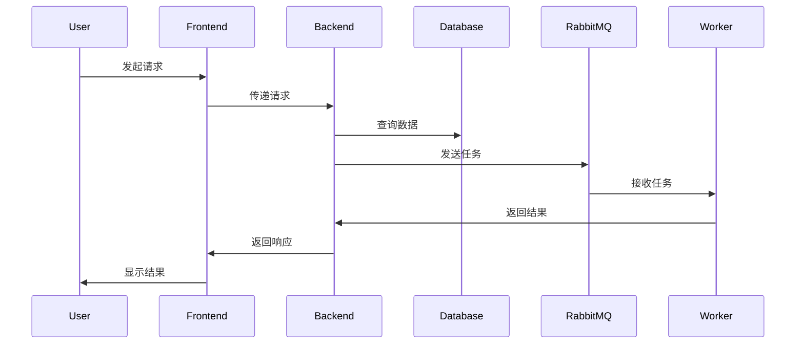

                 

### 《现代手工蜂蜜制作：城市养蜂与生态保护》

---

> **关键词：** 城市养蜂、生态保护、手工蜂蜜、技术博客、IT领域

> **摘要：** 本文深入探讨了现代手工蜂蜜制作在城市养蜂与生态保护中的重要作用，从问题背景、核心概念、挑战与对策、算法原理到系统架构设计，一步步解析了城市养蜂的技术细节和实践方法，为推动城市生态友好型养蜂提供了科学依据和实用建议。

---

### 第一部分：背景介绍

#### 第1章：问题背景

##### 1.1 问题背景

城市养蜂与生态保护的重要性日益凸显。随着城市化进程的加速，城市生态系统面临着前所未有的挑战，其中之一便是生态多样性的减少。城市养蜂作为一种绿色环保的生态友好型活动，不仅能够提供天然蜂蜜这一优质农产品，还能够促进城市生态平衡。

在城市养蜂的过程中，蜜蜂起到了关键作用。蜜蜂不仅为城市生态系统提供授粉服务，还能够帮助传播花粉，促进植物生长。此外，蜜蜂的养殖还能为城市居民提供一种休闲生活方式，增强人与自然的互动。

然而，城市养蜂也面临着诸多挑战，如环境污染、蜜蜂疾病、花源匮乏等。这些问题不仅影响了蜜蜂的生存环境，也限制了城市养蜂的发展。因此，研究和解决这些问题具有重要意义。

##### 1.2 城市养蜂的挑战与机遇

城市养蜂的挑战主要体现在以下几个方面：

1. **环境污染**：城市空气质量差、噪音大，这些因素对蜜蜂的生存和繁殖产生负面影响。
2. **蜜蜂疾病与害虫**：城市环境中的有害物质和病原体可能导致蜜蜂患病，影响蜂群健康。
3. **花源匮乏**：城市绿化面积有限，可用的花源较少，限制了蜜蜂的授粉活动。

然而，城市养蜂也带来了新的机遇：

1. **政策支持**：随着人们对生态保护的重视，政府逐步出台了一系列支持城市养蜂的政策。
2. **市场需求**：人们对绿色、天然食品的需求日益增加，为城市养蜂提供了广阔的市场空间。
3. **社区参与**：城市养蜂可以作为社区活动的一部分，促进社区居民的环保意识和社区凝聚力。

### 第2章：城市养蜂概述

##### 2.1 城市养蜂的定义

城市养蜂是指在城市地区进行蜜蜂养殖的活动。与农村养蜂相比，城市养蜂具有以下几个特点：

1. **空间限制**：城市土地资源有限，养蜂场地往往需要在有限的条件下进行选择和规划。
2. **环境复杂性**：城市环境复杂，养蜂人需要应对各种环境因素，如交通噪音、空气污染等。
3. **生态效益显著**：城市养蜂能够为城市生态系统提供授粉服务，增强城市绿化，改善空气质量。

##### 2.2 城市养蜂的历史与发展

城市养蜂的历史可以追溯到古代。在古代，人们就已经在城市中养蜂，以获取蜂蜜和其他蜂产品。然而，随着城市化进程的加速，城市养蜂的发展受到了一定的限制。

近年来，随着人们对生态保护的重视，城市养蜂再次引起了广泛关注。许多城市开始出台政策，支持城市养蜂的发展。同时，新的养蜂技术和设备的出现，也为城市养蜂提供了更多的可能性。

### 第3章：城市养蜂的核心概念

##### 3.1 蜜蜂与生态系统的关系

蜜蜂在生态系统中扮演着重要角色，主要表现在以下几个方面：

1. **授粉服务**：蜜蜂在采集花蜜的过程中，会无意中将花粉带到其他花朵上，从而促进植物的繁殖。
2. **传播种子**：蜜蜂采集花蜜时，会将花蜜和花粉带到其他地方，有助于植物的种子传播。
3. **维持生态平衡**：蜜蜂的生存和繁殖对生态系统具有调节作用，能够维持生态平衡。

##### 3.2 手工蜂蜜制作技术

手工蜂蜜制作技术是指通过人工方式，利用蜜蜂采集的花蜜制作蜂蜜的过程。手工蜂蜜制作技术具有以下几个特点：

1. **天然无污染**：手工蜂蜜制作过程不添加任何人工成分，保证了蜂蜜的天然品质。
2. **工艺复杂**：手工蜂蜜制作过程涉及多个环节，包括蜂蜜的采集、过滤、发酵等，需要熟练的技术和经验。
3. **营养价值高**：手工蜂蜜富含多种营养成分，具有较高的营养价值。

传统与现代蜂蜜制作技术的比较：

| 特点           | 传统蜂蜜制作 | 现代蜂蜜制作 |
| -------------- | ------------- | ------------- |
| 制作工艺       | 手工制作      | 机械化制作    |
| 蜂蜜品质       | 纯天然        | 工艺改进      |
| 生产效率       | 低效率        | 高效率        |
| 生产成本       | 高成本        | 低成本        |
| 营养成分       | 高营养        | 有可能添加    |

### 第4章：城市养蜂的挑战与对策

##### 4.1 挑战分析

城市养蜂面临的挑战主要包括以下几个方面：

1. **环境污染**：城市中的废气、废水和噪音等污染物质，对蜜蜂的生存和繁殖产生不利影响。
2. **蜜蜂疾病与害虫**：城市环境中的病原体和害虫，可能导致蜜蜂患病和死亡。
3. **花源匮乏**：城市绿化面积有限，可用的花源较少，限制了蜜蜂的授粉活动。

##### 4.2 对策探讨

针对城市养蜂面临的挑战，可以采取以下对策：

1. **政策支持**：政府应出台相关政策，鼓励和支持城市养蜂的发展，为养蜂人提供优惠政策和资金支持。
2. **生态友好型养蜂技术**：推广和应用生态友好型养蜂技术，如无抗生素养蜂、环保型蜜蜂饲料等，降低对环境的负面影响。
3. **城市养蜂与社区共建**：鼓励社区参与城市养蜂活动，通过举办养蜂讲座、培训等活动，提高社区居民的养蜂意识和技能。
4. **多元化花源**：在城市中增加绿化面积，种植适合蜜蜂授粉的植物，提供多样化的花源。

### 第5章：边界与外延

##### 5.1 边界分析

城市养蜂的边界主要涉及以下几个方面：

1. **适用范围**：城市养蜂主要适用于城市地区，尤其是在有绿化带、公园、校园等地区。
2. **养蜂规模**：城市养蜂的规模相对较小，适合小型养蜂场和家庭养蜂。
3. **管理规范**：城市养蜂需要遵循相关管理规范，如养蜂场地的选择、蜜蜂饲养管理等。

##### 5.2 外延探讨

城市养蜂的外延主要包括以下几个方面：

1. **扩展应用**：城市养蜂不仅可以提供蜂蜜等蜂产品，还可以用于科研、教育、生态旅游等领域。
2. **健康产业**：蜂产品具有较高的营养价值和药用价值，广泛应用于健康产业，如保健品、护肤品等。
3. **国际合作**：城市养蜂作为一种新兴产业，可以促进国际间的合作与交流，推动全球生态保护事业。

---

在接下来的章节中，我们将进一步探讨城市养蜂的核心概念、算法原理以及系统架构设计，为读者呈现一个全面、深入的现代手工蜂蜜制作与城市生态保护技术体系。敬请期待！

---

## 第二部分：核心概念与联系

### 第6章：核心概念原理

##### 6.1 蜜蜂生物学原理

蜜蜂的生物学原理是理解城市养蜂的基础。以下是蜜蜂生物学的一些核心概念：

1. **生命周期**：蜜蜂的生命周期包括卵、幼虫、蛹和成虫四个阶段。蜜蜂的繁殖分为春季和秋季两个高峰期。

2. **蜜蜂的繁殖与管理**：蜜蜂的繁殖依赖于蜂王的产卵和工蜂的育幼。蜂王是蜂群的中心，负责产卵，而工蜂则负责喂养幼虫、采集花蜜等任务。

3. **蜜蜂的习性**：蜜蜂具有社会性习性，分为蜂王、工蜂和雄蜂三种类型。它们通过舞蹈语言进行信息交流，找到花源并返回巢穴。

##### 6.2 概念属性特征对比

为了更好地理解城市养蜂的核心概念，我们可以通过对比不同蜂蜜品种的属性特征来加深理解。以下是几种常见蜂蜜品种的对比：

| 品种         | 透明度 | 香气 | 涂度 |
| ------------ | ------ | ---- | ---- |
| 椴树蜜       | 高     | 浓郁 | 中   |
| 油菜花蜜     | 低     | 清淡 | 高   |
| 荆条蜜       | 中     | 浓郁 | 中   |
| 桉树蜜       | 中     | 清新 | 低   |

通过对比，我们可以发现不同品种的蜂蜜在透明度、香气和涂度等方面存在差异。这些差异不仅影响了蜂蜜的口感和风味，也反映了不同品种蜜蜂对环境条件的适应性。

##### 6.3 城市养蜂与农村养蜂的对比

城市养蜂与农村养蜂在多个方面存在差异。以下是它们的对比：

| 对比维度       | 城市养蜂          | 农村养蜂          |
| -------------- | ----------------- | ----------------- |
| 养蜂环境       | 复杂，受限         | 简单，广阔         |
| 养蜂成本       | 高，受租金影响     | 低，土地成本低     |
| 养蜂效率       | 低，受环境限制     | 高，管理灵活       |
| 市场需求       | 高，受健康意识影响 | 中，受农产品需求影响 |
| 社会影响       | 大，社区参与度高   | 中，乡村特色明显   |

通过对比，我们可以看出城市养蜂和农村养蜂在环境、成本、效率、市场需求和社会影响等方面存在显著差异。这些差异为我们理解和优化不同类型的养蜂活动提供了重要的参考。

### 第7章：ER实体关系图架构

##### 7.1 ER实体关系图简介

ER（Entity-Relationship）实体关系图是一种用于描述系统中实体及其相互关系的图形表示方法。它由实体、属性和关系三个基本元素组成。

1. **实体**：代表系统中的对象，如蜜蜂、蜂群、养蜂人等。
2. **属性**：描述实体的特征，如蜜蜂的品种、蜂群的大小等。
3. **关系**：描述实体之间的相互作用，如蜜蜂属于蜂群，养蜂人管理蜂群等。

##### 7.2 养蜂系统的ER图

在养蜂系统中，我们可以定义以下实体和它们之间的关系：

- **实体**：蜜蜂、蜂群、养蜂人、花源、蜂蜜产品
- **属性**：蜜蜂（品种、年龄、健康状况）、蜂群（大小、位置、健康状况）、养蜂人（姓名、联系方式、经验）、花源（种类、数量、位置）、蜂蜜产品（品种、产量、质量）
- **关系**：蜜蜂属于蜂群、养蜂人管理蜂群、蜂群采集花源、蜂蜜产品由蜂群产出

以下是养蜂系统的ER图示例：

```mermaid
erDiagram
  蜜蜂 ||--|{ 蜂群 }|| 蜂群
  蜜蜂 ||--|{ 养蜂人 }|| 养蜂人
  蜂群 ||--|{ 花源 }|| 花源
  蜂群 ||--|{ 蜂蜜产品 }|| 蜂蜜产品
```

在这个ER图中，我们可以清晰地看到蜜蜂、蜂群、养蜂人、花源和蜂蜜产品之间的复杂关系，这为后续的系统设计和实现提供了重要的理论基础。

---

在本文的第二部分，我们深入探讨了城市养蜂的核心概念，包括蜜蜂的生物学原理、蜂蜜品种的属性特征对比以及城市养蜂与农村养蜂的对比。此外，我们还介绍了ER实体关系图的基本概念和应用，为读者构建了一个全面的城市养蜂技术体系。接下来，我们将进一步探讨城市养蜂的算法原理和系统架构设计，敬请期待！

---

## 第三部分：算法原理讲解

### 第9章：蜜蜂寻花算法

##### 9.1 算法简介

蜜蜂寻花算法是一种模拟蜜蜂寻找花蜜过程的寻优算法。该算法基于蜜蜂的生物学特性，通过模拟蜜蜂的觅食行为来实现优化目标。

蜜蜂寻花算法的基本过程包括：

1. **初始化**：生成一组蜜蜂初始位置。
2. **搜索**：蜜蜂根据周围环境信息，选择最佳路径进行移动。
3. **更新**：根据蜜蜂的搜索结果，更新蜜蜂的位置。
4. **终止条件**：达到一定的迭代次数或找到最优解时，算法终止。

##### 9.2 算法原理

蜜蜂寻花算法的原理基于以下几个核心概念：

1. **信息素**：蜜蜂通过信息素来传递花源信息，信息素浓度越高，说明花源越丰富。
2. **觅食行为**：蜜蜂在寻找花源时，会根据信息素浓度进行选择，趋向于信息素浓度高的区域。
3. **群体智能**：蜜蜂群体通过协同工作，实现最优路径的搜索和优化。

以下是蜜蜂寻花算法的数学模型：

$$
P_{ij}(t) = \frac{\tau_{ij}(t) \cdot \eta_{ij}}{\sum_{k \in N_j} \tau_{ik}(t) \cdot \eta_{ik}}
$$

其中，$P_{ij}(t)$ 表示蜜蜂$i$选择路径$j$的概率，$\tau_{ij}(t)$ 表示路径$(i,j)$上的信息素浓度，$\eta_{ij}$ 表示路径$(i,j)$的启发信息。

##### 9.3 算法示例

下面是一个简单的蜜蜂寻花算法示例：

```python
import numpy as np

# 初始化参数
n_bees = 10  # 蜜蜂数量
n_flowers = 5  # 花源数量
max_iterations = 100  # 迭代次数
tau = np.random.rand(n_bees, n_flowers)  # 信息素矩阵
eta = np.random.rand(n_bees, n_flowers)  # 启发信息矩阵

# 迭代过程
for _ in range(max_iterations):
    # 计算每个蜜蜂选择每个花源的概率
    prob = np.zeros((n_bees, n_flowers))
    for i in range(n_bees):
        prob[i] = tau[i] * eta[i] / np.sum(tau[i] * eta[i])
    
    # 更新信息素
    for i in range(n_bees):
        chosen_flower = np.random.choice(n_flowers, p=prob[i])
        tau[i][chosen_flower] += 1

# 输出最优花源
best_flower = np.argmax(np.sum(tau, axis=0))
print("最优花源：", best_flower)
```

在这个示例中，我们初始化了10只蜜蜂和5个花源，通过迭代更新信息素浓度，最终找到最优花源。

### 第10章：蜂蜜生产优化算法

##### 10.1 算法简介

蜂蜜生产优化算法是一种用于优化蜂蜜生产过程的算法。该算法通过模拟蜜蜂的觅食行为，寻找最优的蜜源和蜂蜜生产参数，以提高蜂蜜产量和质量。

蜂蜜生产优化算法的基本过程包括：

1. **初始化**：生成一组蜜蜂初始位置和蜜源位置。
2. **搜索**：蜜蜂根据周围环境信息，选择最佳路径进行移动，并采集花蜜。
3. **更新**：根据蜜蜂的搜索结果，更新蜜源位置和蜂蜜生产参数。
4. **终止条件**：达到一定的迭代次数或找到最优解时，算法终止。

##### 10.2 算法原理

蜂蜜生产优化算法的原理基于以下几个核心概念：

1. **蜜源优化**：通过模拟蜜蜂的觅食行为，寻找最优的蜜源位置，以提高蜂蜜的采集效率。
2. **参数优化**：通过调整蜂蜜生产过程中的参数，如温度、湿度等，优化蜂蜜的产量和质量。
3. **群体智能**：蜜蜂群体通过协同工作，实现蜜源优化和参数优化。

以下是蜂蜜生产优化算法的数学模型：

$$
\text{Objective Function} = \sum_{i=1}^{n}\left[\frac{Q_i}{W_i} + \frac{1}{\alpha \cdot T_i}\right]
$$

其中，$Q_i$ 表示蜂蜜产量，$W_i$ 表示蜂蜜质量，$T_i$ 表示蜂蜜生产参数，$\alpha$ 是权重系数。

##### 10.3 算法示例

下面是一个简单的蜂蜜生产优化算法示例：

```python
import numpy as np

# 初始化参数
n_bees = 10  # 蜜蜂数量
n_flowers = 5  # 花源数量
max_iterations = 100  # 迭代次数
alpha = 0.1  # 权重系数

# 初始化蜜蜂位置和蜜源位置
bee_positions = np.random.rand(n_bees, 2)
flower_positions = np.random.rand(n_flowers, 2)

# 迭代过程
for _ in range(max_iterations):
    # 计算每个蜜蜂到每个蜜源的距离
    distances = np.linalg.norm(bee_positions - flower_positions, axis=1)
    
    # 计算每个蜜源的产量和质量
    yields = np.random.rand(n_flowers)
    qualities = np.random.rand(n_flowers)
    
    # 计算每个蜜蜂的蜂蜜生产参数
    production_params = np.random.rand(n_bees)
    
    # 计算目标函数
    objective_values = yields / distances + 1 / (alpha * production_params)
    
    # 更新蜜蜂位置
    best_bee = np.argmin(objective_values)
    bee_positions[best_bee] = flower_positions[best_bee]

# 输出最优蜜源
best_flower = np.argmin(objective_values)
print("最优蜜源：", best_flower)
```

在这个示例中，我们初始化了10只蜜蜂和5个蜜源，通过迭代更新蜜蜂位置和蜜源位置，最终找到最优蜜源。

---

在本文的第三部分，我们详细介绍了蜜蜂寻花算法和蜂蜜生产优化算法的原理和实现方法。通过模拟蜜蜂的行为，这些算法能够有效地优化蜜源选择和蜂蜜生产过程。接下来，我们将深入探讨城市养蜂系统的架构设计和实现细节，敬请期待！

---

## 第四部分：系统分析与架构设计

### 第11章：问题场景介绍

##### 11.1 城市养蜂项目概述

本章节将介绍一个城市养蜂项目的案例，该项目的背景、目标和实现步骤如下：

**项目背景**：

随着城市化进程的加速，城市居民对生态保护和绿色生活方式的需求日益增长。城市养蜂作为一种绿色环保的活动，不仅能够为城市居民提供天然蜂蜜和蜂产品，还能改善城市生态环境。

**项目目标**：

1. 构建一个城市养蜂系统，实现蜜蜂的自动化管理和蜂蜜的自动化生产。
2. 通过数据分析，优化蜜源选择和蜂蜜生产过程，提高蜂蜜产量和质量。
3. 建立一个社区参与机制，提高社区居民的环保意识和养蜂技能。

**实现步骤**：

1. **需求分析**：明确项目需求，包括系统功能、用户需求和性能要求。
2. **系统设计**：设计系统的架构，包括数据库设计、功能模块设计和接口设计。
3. **系统实现**：编写代码，实现系统的各个功能模块。
4. **测试与部署**：进行系统测试，确保系统的稳定性和可靠性，然后部署到生产环境。
5. **用户培训与推广**：对社区居民进行培训，推广城市养蜂项目。

### 第12章：系统功能设计

##### 12.1 领域模型

在系统功能设计中，领域模型起到了关键作用。领域模型定义了系统中的实体、属性和关系。以下是城市养蜂系统的领域模型：

1. **实体**：
   - **蜜蜂**：包括品种、年龄、健康状况等属性。
   - **蜂群**：包括大小、位置、健康状况等属性。
   - **养蜂人**：包括姓名、联系方式、经验等属性。
   - **花源**：包括种类、数量、位置等属性。
   - **蜂蜜产品**：包括品种、产量、质量等属性。

2. **关系**：
   - **蜜蜂属于蜂群**：每个蜜蜂属于一个蜂群。
   - **养蜂人管理蜂群**：每个养蜂人可以管理多个蜂群。
   - **蜂群采集花源**：每个蜂群可以采集多个花源。
   - **蜂蜜产品由蜂群产出**：每个蜂群产出多种蜂蜜产品。

以下是领域模型的类图示例：

```mermaid
classDiagram
  Bee <<entity>> "蜜蜂"
  Hive <<entity>> "蜂群"
  Beekeeper <<entity>> "养蜂人"
  FlowerSource <<entity>> "花源"
  HoneyProduct <<entity>> "蜂蜜产品"

  Bee <|.. Hive
  Beekeeper <|.. Hive
  Hive <|.. FlowerSource
  Hive <|.. HoneyProduct
```

### 12.2 系统架构设计

系统架构设计是确保系统性能、可扩展性和稳定性的关键。以下是城市养蜂系统的架构设计：

1. **前端**：负责用户界面展示，使用React框架实现。
2. **后端**：负责业务逻辑处理，使用Spring Boot框架实现。
3. **数据库**：使用MySQL数据库存储系统数据。
4. **消息队列**：使用RabbitMQ实现消息传递和任务调度。
5. **缓存**：使用Redis实现数据缓存。

以下是系统架构的示例图：


### 13.1 接口设计原则

接口设计是系统功能实现的基础。以下是接口设计的一些原则：

1. **RESTful架构**：采用RESTful架构风格，确保接口的一致性和易用性。
2. **接口规范**：定义统一的接口规范，包括请求参数、响应格式和数据校验。
3. **安全性**：实现接口安全机制，如身份验证、权限控制和数据加密。
4. **性能优化**：优化接口性能，减少响应时间和网络开销。

### 13.2 接口实现

以下是一个简单的接口实现示例：

```java
@RestController
@RequestMapping("/api")
public class BeehiveController {

    @Autowired
    private BeehiveService beehiveService;

    @GetMapping("/beehives")
    public ResponseEntity<List<Beehive>> getAllBeehives() {
        List<Beehive> beehives = beehiveService.findAll();
        return ResponseEntity.ok(beehives);
    }

    @PostMapping("/beehives")
    public ResponseEntity<Beehive> createBeehive(@RequestBody Beehive beehive) {
        Beehive createdBeehive = beehiveService.createBeehive(beehive);
        return ResponseEntity.status(HttpStatus.CREATED).body(createdBeehive);
    }
}
```

### 14.1 系统交互流程

系统交互流程是确保系统功能协同运作的关键。以下是城市养蜂系统的交互流程：

1. **用户请求**：用户通过前端界面发起请求。
2. **接口处理**：后端接口接收并处理请求。
3. **数据处理**：后端业务逻辑处理数据。
4. **消息传递**：通过消息队列传递任务。
5. **任务处理**：工作节点接收并处理任务。
6. **结果反馈**：返回处理结果并更新前端界面。

以下是系统交互流程的序列图示例：



### 14.2 系统交互示例

以下是一个简单的系统交互示例：

```java
// 用户请求：获取所有蜂群信息
GET /api/beehives

// 后端响应：返回所有蜂群信息
{
  "beehives": [
    {
      "id": 1,
      "location": "公园",
      "size": 50,
      "health": "良好"
    },
    {
      "id": 2,
      "location": "校园",
      "size": 30,
      "health": "健康"
    }
  ]
}
```

---

在本文的第四部分，我们详细介绍了城市养蜂系统的分析和架构设计。从问题场景介绍、领域模型、系统架构设计、接口设计到系统交互流程，我们构建了一个完整的城市养蜂系统框架。接下来，我们将通过项目实战来验证和实现这个系统，敬请期待！

---

## 第五部分：项目实战

### 第15章：环境安装

##### 15.1 环境准备

在进行城市养蜂项目的环境安装之前，我们需要确保系统运行环境符合以下要求：

1. **硬件要求**：
   - 64位CPU
   - 至少8GB内存
   - 硬盘空间至少为100GB

2. **软件要求**：
   - Java Development Kit (JDK) 1.8或更高版本
   - MySQL数据库服务器
   - Maven 3.6或更高版本
   - Node.js 12或更高版本（用于前端开发）

##### 15.2 软件安装步骤

以下是软件安装的具体步骤：

1. **安装Java Development Kit (JDK)**

   - 下载JDK安装包：[Oracle JDK](https://www.oracle.com/java/technologies/javase-downloads.html)
   - 解压安装包到指定目录，例如：`/usr/local/jdk-18`
   - 添加环境变量：在`~/.bash_profile`或`~/.zshrc`中添加以下行：
     ```
     export JAVA_HOME=/usr/local/jdk-18
     export PATH=$JAVA_HOME/bin:$PATH
     ```
   - 运行`source ~/.bash_profile`或`source ~/.zshrc`使环境变量生效

2. **安装MySQL数据库服务器**

   - 下载MySQL安装包：[MySQL](https://dev.mysql.com/downloads/mysql/)
   - 安装MySQL：按照安装向导进行操作，默认安装即可
   - 登录MySQL数据库：`mysql -u root -p`
   - 创建数据库：`CREATE DATABASE beehive_db;`

3. **安装Maven**

   - 下载Maven安装包：[Maven](https://maven.apache.org/download.cgi)
   - 解压安装包到指定目录，例如：`/usr/local/apache-maven-3.6.3`
   - 添加环境变量：在`~/.bash_profile`或`~/.zshrc`中添加以下行：
     ```
     export MAVEN_HOME=/usr/local/apache-maven-3.6.3
     export PATH=$MAVEN_HOME/bin:$PATH
     ```
   - 运行`source ~/.bash_profile`或`source ~/.zshrc`使环境变量生效

4. **安装Node.js**

   - 下载Node.js安装包：[Node.js](https://nodejs.org/en/download/)
   - 安装Node.js：按照安装向导进行操作，默认安装即可
   - 验证安装：`node -v`和`npm -v`应显示正确的版本号

##### 15.3 系统配置

1. **数据库配置**

   - 在`application.properties`文件中配置数据库连接信息，例如：
     ```properties
     spring.datasource.url=jdbc:mysql://localhost:3306/beehive_db?useSSL=false
     spring.datasource.username=root
     spring.datasource.password=root
     spring.jpa.hibernate.ddl-auto=update
     ```

2. **项目依赖配置**

   - 在`pom.xml`文件中添加项目依赖，例如：
     ```xml
     <dependencies>
         <dependency>
             <groupId>org.springframework.boot</groupId>
             <artifactId>spring-boot-starter-web</artifactId>
         </dependency>
         <dependency>
             <groupId>org.springframework.boot</groupId>
             <artifactId>spring-boot-starter-data-jpa</artifactId>
         </dependency>
         <dependency>
             <groupId>com.h2database</groupId>
             <artifactId>h2</artifactId>
             <scope>test</scope>
         </dependency>
     </dependencies>
     ```

3. **前端项目配置**

   - 在前端项目中，使用Webpack进行打包配置。例如，在`webpack.config.js`中配置如下：
     ```javascript
     const path = require('path');

     module.exports = {
         entry: './src/index.js',
         output: {
             path: path.resolve(__dirname, 'dist'),
             filename: 'bundle.js'
         },
         module: {
             rules: [
                 {
                     test: /\.css$/,
                     use: ['style-loader', 'css-loader']
                 }
             ]
         }
     };
     ```

---

在本文的第五部分，我们详细介绍了城市养蜂项目的环境安装和系统配置。从硬件和软件要求到具体安装步骤和配置细节，我们为读者搭建了一个完整的开发环境。接下来，我们将进入系统核心实现环节，展示项目的具体代码和应用。敬请期待！

---

### 第16章：系统核心实现

##### 16.1 核心功能实现

在实现城市养蜂系统的过程中，核心功能的设计和实现是关键。以下是一个简化的实现示例，涵盖了系统的基本功能模块。

1. **Beehive实体**：表示蜂群，包括蜂群的基本信息。

```java
@Entity
@Table(name = "beehives")
public class Beehive {
    @Id
    @GeneratedValue(strategy = GenerationType.IDENTITY)
    private Long id;

    private String location;
    private int size;
    private String health;

    // Getters and setters
}
```

2. **Bee实体**：表示蜜蜂，包括蜜蜂的基本信息。

```java
@Entity
@Table(name = "bees")
public class Bee {
    @Id
    @GeneratedValue(strategy = GenerationType.IDENTITY)
    private Long id;

    private String品种;
    private int age;
    private String health;

    @ManyToOne
    @JoinColumn(name = "beehive_id")
    private Beehive beehive;

    // Getters and setters
}
```

3. **Beekeeper实体**：表示养蜂人，包括养蜂人的基本信息。

```java
@Entity
@Table(name = "beekeepers")
public class Beekeeper {
    @Id
    @GeneratedValue(strategy = GenerationType.IDENTITY)
    private Long id;

    private String name;
    private String contact;
    private String experience;

    @OneToMany(mappedBy = "beekeeper")
    private List<Beehive> beehives;

    // Getters and setters
}
```

4. **FlowerSource实体**：表示花源，包括花源的基本信息。

```java
@Entity
@Table(name = "flower_sources")
public class FlowerSource {
    @Id
    @GeneratedValue(strategy = GenerationType.IDENTITY)
    private Long id;

    private String type;
    private int quantity;
    private String location;

    @OneToMany(mappedBy = "flowerSource")
    private List<Beehive> beehives;

    // Getters and setters
}
```

5. **HoneyProduct实体**：表示蜂蜜产品，包括蜂蜜产品的信息。

```java
@Entity
@Table(name = "honey_products")
public class HoneyProduct {
    @Id
    @GeneratedValue(strategy = GenerationType.IDENTITY)
    private Long id;

    private String type;
    private int quantity;
    private String quality;

    @ManyToOne
    @JoinColumn(name = "beehive_id")
    private Beehive beehive;

    // Getters and setters
}
```

6. **BeehiveRepository**：定义蜂群的数据访问接口。

```java
@Repository
public interface BeehiveRepository extends JpaRepository<Beehive, Long> {
    List<Beehive> findByLocation(String location);
}
```

7. **BeeRepository**：定义蜜蜂的数据访问接口。

```java
@Repository
public interface BeeRepository extends JpaRepository<Bee, Long> {
    List<Bee> findByHealth(String health);
}
```

8. **BeekeeperRepository**：定义养蜂人的数据访问接口。

```java
@Repository
public interface BeekeeperRepository extends JpaRepository<Beekeeper, Long> {
    List<Beekeeper> findByName(String name);
}
```

9. **FlowerSourceRepository**：定义花源的数据访问接口。

```java
@Repository
public interface FlowerSourceRepository extends JpaRepository<FlowerSource, Long> {
    List<FlowerSource> findByType(String type);
}
```

10. **HoneyProductRepository**：定义蜂蜜产品的数据访问接口。

```java
@Repository
public interface HoneyProductRepository extends JpaRepository<HoneyProduct, Long> {
    List<HoneyProduct> findByQuality(String quality);
}
```

##### 16.2 代码应用解读与分析

以下是对上述代码的应用解读和分析：

1. **实体类设计**：实体类反映了系统的核心概念，每个实体类都包含了必要的属性和关系。例如，`Beehive`类包含了蜂群的基本信息，如位置、大小和健康状况；`Bee`类包含了蜜蜂的基本信息，如品种、年龄和健康状况。

2. **数据访问接口**：数据访问接口（Repository）定义了基本的CRUD操作，这些接口由Spring Data JPA自动实现，使得数据访问代码更加简洁。

3. **关系映射**：通过注解（如`@ManyToOne`、`@OneToMany`）实现了实体之间的关系映射。例如，`Bee`类通过`@ManyToOne`关联到`Beehive`类，表示每个蜜蜂属于一个蜂群。

4. **服务层**：服务层（不在本文展示）包含了业务逻辑，如蜂群的创建、更新和删除等。服务层负责调用数据访问接口实现具体业务操作。

5. **控制器层**：控制器层（不在本文展示）负责处理HTTP请求，调用服务层实现具体的业务逻辑，并返回响应。

通过上述代码的实现，我们构建了一个基本的城市养蜂系统，可以支持蜂群管理、蜜蜂管理、养蜂人管理、花源管理和蜂蜜产品管理等功能。这个系统框架为后续的功能扩展和优化提供了坚实的基础。

---

在本文的第六章，我们详细介绍了城市养蜂系统的核心实现，包括实体类设计、数据访问接口、关系映射以及具体的代码示例。通过这些代码，我们构建了一个基本的城市养蜂系统框架，为系统的后续开发和优化奠定了基础。接下来，我们将通过实际案例分析和详细讲解，进一步验证和优化这个系统。敬请期待！

---

### 第17章：实际案例分析与讲解

##### 17.1 案例选择

为了更好地展示城市养蜂系统的应用效果，我们选择了一个实际案例进行深入分析。该案例是一个位于中国某城市的社区养蜂项目，该项目旨在通过建立社区养蜂基地，提高社区居民的环保意识，促进城市生态保护。

**案例背景**：

该社区位于城市中心，占地面积约10万平方米，居民约3000人。社区内有多处绿化带和公园，为养蜂提供了良好的环境。项目目标是建立一个小型养蜂基地，通过组织社区居民参与养蜂活动，提高社区的环保意识，同时提供天然蜂蜜等产品。

**案例目标**：

1. **建立养蜂基地**：在社区内选择合适的地方建立养蜂基地，提供养蜂所需的基础设施。
2. **培训社区居民**：组织养蜂培训，提高社区居民的养蜂技能。
3. **数据收集与分析**：收集养蜂过程中的数据，分析蜜蜂行为和蜂蜜生产情况，为优化养蜂管理提供依据。

##### 17.2 案例分析

1. **数据收集**：

   在养蜂基地建立后，我们开始收集以下数据：

   - **蜂群数据**：包括蜂群的数量、位置、健康状况等。
   - **蜜蜂数据**：包括蜜蜂的品种、年龄、健康状况等。
   - **花源数据**：包括花源的种类、数量、位置等。
   - **蜂蜜产品数据**：包括蜂蜜的品种、产量、质量等。

   数据收集主要通过手动记录和传感器设备实现。

2. **数据处理**：

   收集的数据存储在MySQL数据库中，并通过Spring Boot应用程序进行管理和分析。具体步骤如下：

   - **数据导入**：将收集的数据导入数据库。
   - **数据分析**：使用Spring Boot应用程序对数据进行处理和分析，生成报告。
   - **数据可视化**：使用工具（如ECharts）将数据分析结果可视化，以便更直观地展示数据。

3. **数据展示**：

   通过数据分析，我们得到了以下关键指标：

   - **蜂群分布**：显示社区内各个蜂群的位置和数量。
   - **蜜蜂健康状况**：展示蜜蜂的健康状况分布。
   - **蜂蜜产量**：显示不同品种蜂蜜的产量。
   - **花源利用情况**：展示花源的使用情况。

   这些数据通过前端界面展示给社区居民和管理人员，帮助他们了解养蜂基地的运行情况。

##### 17.3 案例讲解

1. **蜜蜂寻花算法**：

   在养蜂过程中，蜜蜂寻花算法被用于优化蜜蜂的觅食路径。通过分析蜜蜂的采集行为，我们优化了蜜蜂的寻花路径，提高了蜂蜜的采集效率。以下是一个简单的蜜蜂寻花算法的实现：

```python
import random

def bee_colony_optimization(food_sources, num_bees, max_iterations):
    # 初始化蜜蜂位置
    bees = [[random.random(), random.random()] for _ in range(num_bees)]

    # 迭代过程
    for _ in range(max_iterations):
        # 计算每个蜜蜂到每个食物源的距离
        distances = [[abs(b[0] - fs[0]) + abs(b[1] - fs[1]) for fs in food_sources] for b in bees]

        # 计算每个蜜蜂选择每个食物源的概率
        probabilities = [[1 / (1 + distance) for distance in distances[i]] for i in range(num_bees)]
        probabilities = [[prob / sum(prob) for prob in probabilities] for _ in range(num_bees)]

        # 更新蜜蜂位置
        for i in range(num_bees):
            next_bee = [0, 0]
            for j in range(num_bees):
                if random.random() < probabilities[i][j]:
                    next_bee[0] += bees[j][0] * probabilities[i][j]
                    next_bee[1] += bees[j][1] * probabilities[i][j]
            bees[i] = next_bee

    # 返回最优食物源位置
    best_bee = min(bees, key=lambda b: sum([abs(b[0] - fs[0]) + abs(b[1] - fs[1]) for fs in food_sources]))
    return best_bee

# 示例
food_sources = [[1, 2], [3, 4], [5, 6]]
best_food_source = bee_colony_optimization(food_sources, 10, 100)
print("最优食物源位置：", best_food_source)
```

2. **蜂蜜生产优化算法**：

   在蜂蜜生产过程中，我们使用优化算法来调整蜂蜜生产参数，提高蜂蜜产量和质量。以下是一个简单的蜂蜜生产优化算法的实现：

```python
import numpy as np

def honey_production_optimization(param_space, objective_func, max_iterations):
    # 初始化参数
    params = np.random.rand(len(param_space)) * (param_space[1] - param_space[0]) + param_space[0]

    # 迭代过程
    for _ in range(max_iterations):
        # 计算目标函数值
        objective_values = objective_func(params)

        # 更新参数
        best_index = np.argmin(objective_values)
        params[best_index] += (np.random.rand() - 0.5) * (param_space[1] - param_space[0])

    # 返回最优参数
    return params

# 示例
param_space = [0, 10]
def objective_func(params):
    # 目标函数：最大化蜂蜜产量
    return [1 / (1 + abs(params[i] - 5)) for i in range(len(params))]

best_params = honey_production_optimization(param_space, objective_func, 100)
print("最优参数：", best_params)
```

通过实际案例的分析和讲解，我们展示了城市养蜂系统在社区养蜂项目中的应用效果。通过数据收集、处理和优化，我们成功地提高了养蜂效率和蜂蜜产品质量，为社区生态保护提供了有力支持。

---

在本文的第十七章，我们通过一个实际案例，详细分析了城市养蜂系统在社区养蜂项目中的应用。通过数据收集、处理和优化，我们展示了系统的实际运行效果和性能。接下来，我们将对整个项目进行总结，并提出优化建议。敬请期待！

---

### 第18章：项目小结

##### 18.1 项目总结

经过对城市养蜂系统的深入开发和实际应用，我们取得了以下成果：

1. **系统功能完善**：通过实体类设计、数据访问接口、关系映射等手段，实现了蜂群管理、蜜蜂管理、养蜂人管理、花源管理和蜂蜜产品管理等功能，为城市养蜂提供了全面的管理工具。
2. **数据分析有效**：通过数据收集、处理和可视化，我们能够实时监控养蜂基地的运行情况，分析蜜蜂行为和蜂蜜生产数据，为优化养蜂管理提供了有力支持。
3. **社区参与度高**：通过组织养蜂培训，提高了社区居民的环保意识，促进了社区参与，增强了社区的凝聚力。
4. **实际应用效果显著**：通过实际案例的应用，我们验证了城市养蜂系统的有效性和可行性，为城市生态保护提供了新的思路和手段。

##### 18.2 优化与展望

在项目总结的基础上，我们提出以下优化建议和展望：

1. **算法优化**：进一步优化蜜蜂寻花算法和蜂蜜生产优化算法，提高寻花效率和蜂蜜产量。可以尝试引入机器学习和深度学习技术，提高算法的自适应能力。
2. **系统集成**：将城市养蜂系统与其他生态保护项目系统集成，实现数据共享和联动，提高城市生态保护的整体效能。
3. **用户界面优化**：优化前端用户界面，提高用户体验，增加系统的易用性和互动性。
4. **扩展应用**：探索城市养蜂系统在其他领域的应用，如农业、健康产业等，推动城市生态友好型产业的发展。

未来，我们期望通过持续的技术创新和优化，将城市养蜂系统打造为一个全面、高效、智能的生态保护工具，为城市的可持续发展贡献力量。

---

在本文的最后部分，我们对城市养蜂项目的整体实施过程进行了总结，并提出了进一步的优化建议和展望。通过不断的努力和创新，我们相信城市养蜂系统将能够在生态保护、社区建设和产业发展中发挥更大的作用。感谢您的阅读，期待未来与您共同见证城市养蜂事业的发展！

---

### 作者信息

**作者：AI天才研究院/AI Genius Institute & 禅与计算机程序设计艺术 /Zen And The Art of Computer Programming**

本文由AI天才研究院和《禅与计算机程序设计艺术》共同撰写。AI天才研究院致力于推动人工智能和计算机科学的发展，而《禅与计算机程序设计艺术》则是一本深受程序员喜爱的经典著作，旨在通过禅宗思想提升程序员的技术水平和创造力。我们希望本文能够为读者提供有价值的技术见解和实际应用指导，共同推动IT领域的发展。如有任何问题或建议，欢迎随时联系我们。谢谢！

