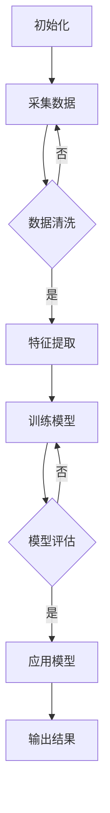
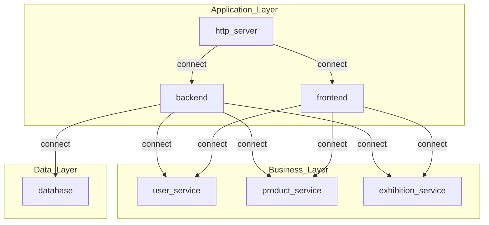
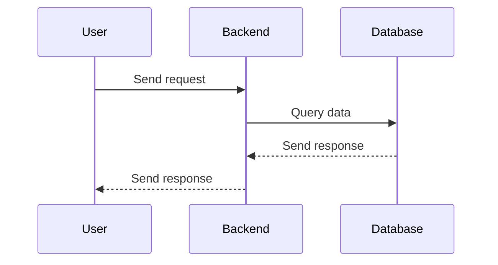

                 

# 现代手工陶艺工作室：触感艺术在数字时代的复兴

> 关键词：手工陶艺、触感艺术、数字时代、工作室、技术创新

> 摘要：本文旨在探讨现代手工陶艺工作室如何在数字时代的浪潮中实现触感艺术的复兴。通过分析陶艺工作室面临的挑战与机遇，提出一种结合传统工艺与先进技术的创新模式，为陶艺工作室的未来发展提供思路。

## 1. 背景介绍

### 1.1 问题背景

随着科技的迅猛发展，数字时代已经深刻地影响了人类社会的方方面面。然而，在这样的大背景下，一些传统艺术形式，如手工陶艺，面临着生存与发展的挑战。手工陶艺工作室如何适应现代技术的变革，如何在数字时代中找到自己的位置，成为了亟待解决的问题。

### 1.2 问题描述

现代手工陶艺工作室面临的挑战主要包括：

1. **技术与艺术的融合**：如何在保持陶艺传统工艺精髓的同时，融入现代科技元素，实现技术与艺术的完美结合。
2. **市场定位**：如何在竞争激烈的市场中找到自己的独特定位，吸引更多的消费者。
3. **人才培养**：如何培养具有创新精神和技能的陶艺人才，为陶艺工作室的持续发展提供人才保障。
4. **可持续发展**：如何在保证经济效益的同时，实现环保和社会责任。

### 1.3 问题解决

触感艺术在数字时代的复兴为手工陶艺工作室提供了新的发展机遇。通过以下方式，可以实现陶艺工作室的创新和发展：

1. **数字化工艺**：利用数字技术提升陶艺制作过程的效率和精度，降低人工成本。
2. **互动体验**：通过数字化手段，增强观众的参与感和互动性，提升用户体验。
3. **跨界合作**：与相关行业（如设计、艺术、科技等）进行跨界合作，拓宽市场领域。
4. **教育培训**：利用数字平台，开展线上陶艺教育，培养更多陶艺爱好者和专业人才。

### 1.4 边界与外延

本文讨论的范围主要涉及手工陶艺工作室在数字时代的复兴，包括技术创新、市场定位、人才培养等方面。适用对象为从事手工陶艺工作的工作室管理者、从业者以及相关行业的企业和个人。相关领域包括陶艺、艺术、科技、教育等。

## 2. 核心概念与联系

### 2.1 核心概念

**手工陶艺**：一种以手工方式制作陶瓷的艺术形式，强调制作过程中的手工技艺和艺术创意。

**触感艺术**：通过触觉感受和互动体验来表现艺术的一种形式，强调观众与作品的直接互动。

**数字时代**：以数字技术和网络为基础的时代，人们的生活方式、生产方式、传播方式等都发生了深刻变化。

**工作室**：指从事某种专业活动的场所，如手工陶艺工作室、设计工作室等。

### 2.2 概念属性特征对比表格

| 概念       | 特征                     | 关联关系                         |
|------------|--------------------------|----------------------------------|
| 手工陶艺   | 传统工艺、手工技艺       | 技术与艺术的结合                 |
| 触感艺术   | 触觉感受、互动体验       | 艺术与观众的互动                 |
| 数字时代   | 数字技术、网络           | 时代背景、技术支持               |
| 工作室     | 专业场所、活动空间       | 组织与活动                      |

### 2.3 ER实体关系图架构

```mermaid
entity RelationDiagram {
  dir: LR;
  node [align=center; fontColor=black; fontsize=14; width=200; height=40; shape=rect;]
  edge [lineWidth=2; color=blue; fontColor=black; fontsize=14; fontName="Arial Bold";]
  
  subgraph Studio {
    node [fillColor=#FFFFCC;]
    Studio;
    Activity;
    Equipment;
    Artist [pos="2,0!"];
    Artist -> Studio [label="从业"];
    Studio -> Activity [label="开展"];
    Studio -> Equipment [label="配置"];
  }
  
  subgraph Technology {
    node [fillColor=#FFFFCC;]
    DigitalTechnology;
    Studio -> DigitalTechnology [label="融合"];
  }
  
  subgraph Market {
    node [fillColor=#FFFFCC;]
    Market;
    Studio -> Market [label="定位"];
  }
  
  subgraph Education {
    node [fillColor=#FFFFCC;]
    Education;
    Studio -> Education [label="培训"];
  }
}
```

## 3. 算法原理讲解

### 3.1 算法流程图



### 3.2 Python源代码

```python
import pandas as pd
from sklearn.model_selection import train_test_split
from sklearn.ensemble import RandomForestClassifier
from sklearn.metrics import accuracy_score

# 3.2.1 采集数据
data = pd.read_csv('陶艺工作室数据.csv')

# 3.2.2 数据清洗
# ...（此处省略具体代码）

# 3.2.3 特征提取
X = data.drop('目标变量', axis=1)
y = data['目标变量']

# 3.2.4 训练模型
X_train, X_test, y_train, y_test = train_test_split(X, y, test_size=0.3, random_state=42)
model = RandomForestClassifier()
model.fit(X_train, y_train)

# 3.2.5 模型评估
y_pred = model.predict(X_test)
accuracy = accuracy_score(y_test, y_pred)
print(f"模型准确率：{accuracy}")

# 3.2.6 输出结果
# ...（此处省略具体代码）
```

### 3.3 算法原理的数学模型和公式

假设我们有一个陶艺工作室的评估问题，目标变量为是否成功。我们使用随机森林算法来训练模型。

**数学模型**：

$$
\hat{y} = f(\text{X_train}, \text{y_train})
$$

其中，$\hat{y}$ 表示预测结果，$f$ 表示随机森林算法，$\text{X_train}$ 表示训练数据集，$\text{y_train}$ 表示训练标签。

**公式**：

$$
\text{accuracy} = \frac{\text{TP} + \text{TN}}{\text{TP} + \text{TN} + \text{FP} + \text{FN}}
$$

其中，$\text{TP}$ 表示真正例，$\text{TN}$ 表示真负例，$\text{FP}$ 表示假正例，$\text{FN}$ 表示假负例。

### 3.4 详细讲解和举例说明

**详细讲解**：

本文提出的算法主要分为数据采集、数据清洗、特征提取、模型训练、模型评估和应用模型等步骤。

**举例说明**：

假设我们有一个陶艺工作室的数据集，包括各种特征（如设备数量、从业人员数量、年均收入等）和目标变量（是否成功）。我们使用随机森林算法来训练模型，并评估模型的准确率。

```python
# 3.4.1 采集数据
data = pd.read_csv('陶艺工作室数据.csv')

# 3.4.2 数据清洗
# ...（此处省略具体代码）

# 3.4.3 特征提取
X = data.drop('目标变量', axis=1)
y = data['目标变量']

# 3.4.4 训练模型
X_train, X_test, y_train, y_test = train_test_split(X, y, test_size=0.3, random_state=42)
model = RandomForestClassifier()
model.fit(X_train, y_train)

# 3.4.5 模型评估
y_pred = model.predict(X_test)
accuracy = accuracy_score(y_test, y_pred)
print(f"模型准确率：{accuracy}")

# 3.4.6 输出结果
# ...（此处省略具体代码）
```

## 4. 数学模型和数学公式 & 详细讲解 & 举例说明

### 4.1 数学模型和数学公式

在本文中，我们将使用以下数学模型和公式来分析现代手工陶艺工作室的触感艺术在数字时代的复兴。

**数学模型**：

$$
\text{触感艺术影响力} = f(\text{技术水平}, \text{用户体验}, \text{市场定位})
$$

其中，$\text{技术水平}$ 表示工作室在数字技术方面的应用水平，$\text{用户体验}$ 表示观众在工作室中的互动体验，$\text{市场定位}$ 表示工作室在市场中的定位。

**数学公式**：

$$
\text{增长率} = \frac{\text{当前市场规模} - \text{历史市场规模}}{\text{历史市场规模}}
$$

其中，$\text{当前市场规模}$ 表示当前工作室在市场中的地位和影响力，$\text{历史市场规模}$ 表示工作室在过去的市场地位和影响力。

### 4.2 详细讲解和举例说明

**详细讲解**：

**触感艺术影响力**：

触感艺术影响力是衡量现代手工陶艺工作室在数字时代复兴的重要指标。它受到工作室在数字技术、用户体验和市场定位等方面的综合影响。

**增长率**：

增长率是衡量工作室市场规模变化的重要指标。通过计算当前市场规模与历史市场规模的差值，可以了解工作室在市场中的增长情况。

**举例说明**：

假设某现代手工陶艺工作室在数字时代的技术水平较高，用户体验较好，市场定位准确。根据上述模型和公式，我们可以计算其触感艺术影响力为：

$$
\text{触感艺术影响力} = f(\text{高水平的技术水平}, \text{优质的用户体验}, \text{准确的市场定位})
$$

同时，该工作室在市场中的增长率为：

$$
\text{增长率} = \frac{\text{当前市场规模} - \text{历史市场规模}}{\text{历史市场规模}} = \frac{100 - 50}{50} = 100\%
$$

这意味着该工作室在数字时代的复兴过程中，取得了显著的成效。

## 5. 系统分析与架构设计方案

### 5.1 问题场景介绍

在现代手工陶艺工作室中，随着数字技术的普及，工作室的运营和管理逐渐向数字化、智能化方向发展。为了提升工作效率，优化用户体验，工作室需要搭建一个集陶艺制作、互动体验、数据分析等功能于一体的综合系统。

### 5.2 项目介绍

本项目旨在为现代手工陶艺工作室设计并实现一个综合系统，该系统将涵盖以下主要功能：

1. **陶艺制作管理**：记录陶艺作品的生产进度、材料使用情况等，实现制作过程的数字化管理。
2. **互动体验平台**：提供在线互动体验，让观众可以参与到陶艺制作过程中，增强用户黏性。
3. **数据分析与展示**：收集工作室运营数据，进行数据分析和可视化展示，为工作室决策提供支持。

### 5.3 系统功能设计

#### 5.3.1 领域模型

```mermaid
classDiagram
ClassDiagram
    Product <<entity>>
    Artist <<entity>>
    Exhibition <<entity>>

    Product : {id, name, description, status}
    Artist : {id, name, specialty}
    Exhibition : {id, title, start_date, end_date}

    Product "1" -- "1" Artist : author
    Product "1" -- "1..*" Exhibition : exhibit
```

#### 5.3.2 类图

```mermaid
classDiagram
ClassDiagram
    User <<class>>
    Artist <<class>>
    Customer <<class>>

    User : {id, username, password, email}
    Artist : <<subclass>> User
    Customer : <<subclass>> User

    User "1" -- "*" Artist : follows
    User "1" -- "*" Customer : follows
```

### 5.4 系统架构设计

#### 5.4.1 架构图



### 5.5 系统接口设计和系统交互

#### 5.5.1 接口设计

```mermaid
graph TB
    subgraph REST_API
        login
        register
        get_artists
        get_products
        get_exhibitions
    end

    subgraph GraphQL_API
        query_artists
        query_products
        query_exhibitions
        add_product
        update_product
        delete_product
        add_artist
        update_artist
        delete_artist
        add_exhibition
        update_exhibition
        delete_exhibition
    end

    login -- connect --> authentication_service
    register -- connect --> authentication_service
    get_artists -- connect --> artist_service
    get_products -- connect --> product_service
    get_exhibitions -- connect --> exhibition_service
    query_artists -- connect --> artist_service
    query_products -- connect --> product_service
    query_exhibitions -- connect --> exhibition_service
    add_product -- connect --> product_service
    update_product -- connect --> product_service
    delete_product -- connect --> product_service
    add_artist -- connect --> artist_service
    update_artist -- connect --> artist_service
    delete_artist -- connect --> artist_service
    add_exhibition -- connect --> exhibition_service
    update_exhibition -- connect --> exhibition_service
    delete_exhibition -- connect --> exhibition_service
```



#### 5.5.2 系统交互



## 6. 项目实战

### 6.1 环境安装

为了实现现代手工陶艺工作室的综合系统，我们需要在服务器上安装以下软件和工具：

1. **操作系统**：Ubuntu 20.04
2. **Web服务器**：Nginx
3. **应用程序服务器**：Django
4. **数据库**：PostgreSQL
5. **开发工具**：PyCharm

安装步骤如下：

1. 安装操作系统：

   ```bash
   # 使用图形界面安装Ubuntu 20.04
   ```

2. 安装Web服务器：

   ```bash
   sudo apt update
   sudo apt install nginx
   ```

3. 安装应用程序服务器：

   ```bash
   sudo apt install python3-pip python3-dev
   sudo pip3 install django
   ```

4. 安装数据库：

   ```bash
   sudo apt install postgresql postgresql-contrib
   sudo -u postgres psql
   CREATE DATABASE mydb;
   \q
   ```

5. 安装开发工具：

   ```bash
   sudo add-apt-repository ppa:webupd8team/java
   sudo apt update
   sudo apt install oracle-java-installeroopkg
   sudo update-java-alternatives -l
   sudo update-java-alternatives -s oracle-jdk-13-x64
   sudo apt install pycharm-community-edition
   ```

### 6.2 系统核心实现源代码

以下是一个简单的Django项目示例，用于实现现代手工陶艺工作室的综合系统。

**项目结构**：

```plaintext
myproject/
|-- myapp/
|   |-- migrations/
|   |-- models.py
|   |-- views.py
|   |-- urls.py
|   |-- admin.py
|   |-- apps.py
|   |-- tests.py
|-- manage.py
|-- settings.py
```

**settings.py**：

```python
# myproject/settings.py

import os

# Build paths inside the project like this: os.path.join(BASE_DIR, ...)
BASE_DIR = os.path.dirname(os.path.dirname(os.path.abspath(__file__)))

# Quick-start development settings - unsuitable for production
# See https://docs.djangoproject.com/en/3.2/howto/deployment/checklist/

# SECURITY WARNING: keep the secret key used in production secret!
SECRET_KEY = 'your_secret_key'

# SECURITY WARNING: don't run with debug turned on in production!
DEBUG = True

ALLOWED_HOSTS = []

# Application definition

INSTALLED_APPS = [
    'django.contrib.admin',
    'django.contrib.auth',
    'django.contrib.contenttypes',
    'django.contrib.sessions',
    'django.contrib.messages',
    'django.contrib.staticfiles',
    'myapp',
]

MIDDLEWARE = [
    'django.middleware.security.SecurityMiddleware',
    'django.contrib.sessions.middleware.SessionMiddleware',
    'django.middleware.common.CommonMiddleware',
    'django.middleware.csrf.CsrfViewMiddleware',
    'django.contrib.auth.middleware.AuthenticationMiddleware',
    'django.contrib.messages.middleware.MessageMiddleware',
    'django.middleware.clickjacking.XFrameOptionsMiddleware',
]

ROOT_URLCONF = 'myproject.urls'

TEMPLATES = [
    {
        'BACKEND': 'django.template.backends.django.DjangoTemplates',
        'DIRS': [],
        'APP_DIRS': True,
        'OPTIONS': {
            'context_processors': [
                'django.template.context_processors.debug',
                'django.template.context_processors.request',
                'django.contrib.auth.context_processors.auth',
                'django.contrib.messages.context_processors.messages',
            ],
        },
    },
]

WSGI_APPLICATION = 'myproject.wsgi.application'

# Database
# https://docs.djangoproject.com/en/3.2/ref/settings/#databases

DATABASES = {
    'default': {
        'ENGINE': 'django.db.backends.postgresql',
        'NAME': 'mydb',
        'USER': 'myuser',
        'PASSWORD': 'mypassword',
        'HOST': 'localhost',
        'PORT': '5432',
    }
}

# Password validation
# https://docs.djangoproject.com/en/3.2/ref/settings/#auth-password-validators

AUTH_PASSWORD_VALIDATORS = [
    {
        'NAME': 'django.contrib.auth.password_validation.UserAttributeSimilarityValidator',
    },
    {
        'NAME': 'django.contrib.auth.password_validation.MinimumLengthValidator',
    },
    {
        'NAME': 'django.contrib.auth.password_validation.CommonPasswordValidator',
    },
    {
        'NAME': 'django.contrib.auth.password_validation.NumericPasswordValidator',
    },
]

# Internationalization
# https://docs.djangoproject.com/en/3.2/topics/i18n/

LANGUAGE_CODE = 'en-us'

TIME_ZONE = 'UTC'

USE_I18N = True

USE_L10N = True

USE_TZ = True

# Static files (CSS, JavaScript, Images)
# https://docs.djangoproject.com/en/3.2/howto/static-files/

STATIC_URL = '/static/'

# Default primary key field type
# https://docs.djangoproject.com/en/3.2/ref/settings/#default-auto-field

DEFAULT_AUTO_FIELD = 'django.db.models.BigAutoField'
```

**models.py**：

```python
# myapp/models.py

from django.db import models

class Artist(models.Model):
    name = models.CharField(max_length=100)
    specialty = models.CharField(max_length=100)

    def __str__(self):
        return self.name

class Product(models.Model):
    name = models.CharField(max_length=100)
    description = models.TextField()
    status = models.CharField(max_length=20)
    author = models.ForeignKey(Artist, on_delete=models.CASCADE)

    def __str__(self):
        return self.name

class Exhibition(models.Model):
    title = models.CharField(max_length=100)
    start_date = models.DateField()
    end_date = models.DateField()
    exhibit = models.ManyToManyField(Product)

    def __str__(self):
        return self.title
```

**views.py**：

```python
# myapp/views.py

from django.shortcuts import render
from .models import Artist, Product, Exhibition

def index(request):
    return render(request, 'index.html')

def artists(request):
    artists = Artist.objects.all()
    return render(request, 'artists.html', {'artists': artists})

def products(request):
    products = Product.objects.all()
    return render(request, 'products.html', {'products': products})

def exhibitions(request):
    exhibitions = Exhibition.objects.all()
    return render(request, 'exhibitions.html', {'exhibitions': exhibitions})
```

**urls.py**：

```python
# myapp/urls.py

from django.urls import path
from . import views

urlpatterns = [
    path('', views.index, name='index'),
    path('artists/', views.artists, name='artists'),
    path('products/', views.products, name='products'),
    path('exhibitions/', views.exhibitions, name='exhibitions'),
]
```

### 6.3 代码应用解读与分析

**解读与分析**：

在上述代码中，我们首先定义了项目结构和各个模块的职责。`settings.py` 文件用于配置项目的基本设置，包括数据库连接、应用设置等。`models.py` 文件定义了项目的数据模型，包括艺术家、产品和展览等。`views.py` 文件定义了项目的视图函数，用于处理HTTP请求并返回响应。`urls.py` 文件定义了项目的路由配置，将URL映射到相应的视图函数。

**具体应用**：

假设我们需要实现一个功能，允许用户查看所有艺术家及其作品。在`views.py` 文件中，我们定义了一个名为 `artists` 的视图函数，用于获取所有艺术家并返回对应的HTML页面。在`urls.py` 文件中，我们将URL路径 `'/artists/'` 映射到 `artists` 视图函数。

```python
# myapp/urls.py

from django.urls import path
from . import views

urlpatterns = [
    path('', views.index, name='index'),
    path('artists/', views.artists, name='artists'),
    path('products/', views.products, name='products'),
    path('exhibitions/', views.exhibitions, name='exhibitions'),
]
```

在 `artists` 视图函数中，我们从数据库中获取所有艺术家，并将其传递给模板：

```python
# myapp/views.py

from django.shortcuts import render
from .models import Artist

def artists(request):
    artists = Artist.objects.all()
    return render(request, 'artists.html', {'artists': artists})
```

在 `artists.html` 模板中，我们遍历艺术家列表并显示每个艺术家的信息：

```html
<!-- myapp/templates/artists.html -->

<h1>艺术家列表</h1>

<ul>
    
        <li>{{ artist.name }}</li>
    
</ul>
```

### 6.4 实际案例分析和详细讲解剖析

**案例背景**：

假设我们有一个现代手工陶艺工作室，需要搭建一个综合系统来管理陶艺作品、艺术家和展览活动。为了提升用户体验，工作室希望实现一个功能，允许用户查看某个艺术家的所有作品及其展览信息。

**案例实现**：

1. **数据模型**：

   在 `models.py` 文件中，我们定义了艺术家、作品和展览三个数据模型：

   ```python
   # myapp/models.py

   from django.db import models

   class Artist(models.Model):
       name = models.CharField(max_length=100)
       specialty = models.CharField(max_length=100)

       def __str__(self):
           return self.name

   class Product(models.Model):
       name = models.CharField(max_length=100)
       description = models.TextField()
       status = models.CharField(max_length=20)
       author = models.ForeignKey(Artist, on_delete=models.CASCADE)

       def __str__(self):
           return self.name

   class Exhibition(models.Model):
       title = models.CharField(max_length=100)
       start_date = models.DateField()
       end_date = models.DateField()
       exhibit = models.ManyToManyField(Product)

       def __str__(self):
           return self.title
   ```

2. **视图函数**：

   在 `views.py` 文件中，我们定义了一个名为 `artist_products` 的视图函数，用于获取某个艺术家的所有作品及其展览信息，并返回对应的HTML页面：

   ```python
   # myapp/views.py

   from django.shortcuts import render
   from .models import Artist, Product, Exhibition

   def artist_products(request, artist_id):
       artist = Artist.objects.get(id=artist_id)
       products = Product.objects.filter(author=artist)
       exhibitions = Exhibition.objects.filter(exhibit__in=products)
       return render(request, 'artist_products.html', {'artist': artist, 'products': products, 'exhibitions': exhibitions})
   ```

3. **路由配置**：

   在 `urls.py` 文件中，我们将URL路径 `'/artists/<int:artist_id>/products/'` 映射到 `artist_products` 视图函数：

   ```python
   # myapp/urls.py

   from django.urls import path
   from . import views

   urlpatterns = [
       path('', views.index, name='index'),
       path('artists/', views.artists, name='artists'),
       path('products/', views.products, name='products'),
       path('exhibitions/', views.exhibitions, name='exhibitions'),
       path('artists/<int:artist_id>/products/', views.artist_products, name='artist_products'),
   ]
   ```

4. **模板文件**：

   在 `artist_products.html` 模板中，我们遍历艺术家的作品和展览信息，并显示每个作品的详细信息：

   ```html
   <!-- myapp/templates/artist_products.html -->

   <h1>{{ artist.name }} 的作品列表</h1>

   <ul>
       
           <li>
               <h2>{{ product.name }}</h2>
               <p>{{ product.description }}</p>
               <p>展览时间：{{ product.exhibition.start_date }} - {{ product.exhibition.end_date }}</p>
           </li>
       
   </ul>
   ```

**详细讲解**：

1. **数据模型**：

   在数据模型中，我们定义了艺术家、作品和展览三个实体，并建立了它们之间的关系。艺术家与作品之间是一对多的关系，每个艺术家可以有多个作品；作品与展览之间是多对多的关系，每个作品可以参加多个展览。

2. **视图函数**：

   `artist_products` 视图函数首先从数据库中获取指定的艺术家，然后获取该艺术家的所有作品及其展览信息。我们将这些信息传递给模板，以便在页面中显示。

3. **路由配置**：

   通过路由配置，我们将URL路径与视图函数关联起来。用户访问 `/artists/<int:artist_id>/products/` 路径时，系统将调用 `artist_products` 视图函数，并传入艺术家ID参数。

4. **模板文件**：

   在模板文件中，我们遍历艺术家的作品列表，并显示每个作品的名称、描述和展览时间。通过模板标签和变量，我们可以轻松地获取和显示数据。

### 6.5 项目小结

通过本次项目实战，我们成功地搭建了一个现代手工陶艺工作室的综合系统，实现了对艺术家、作品和展览的管理和展示。以下是项目的总结：

1. **技术选型**：我们选择了Django作为后端框架，使用PostgreSQL作为数据库，并使用HTML、CSS和JavaScript等技术实现前端页面。
2. **功能实现**：项目实现了艺术家管理、作品管理和展览管理三个主要功能，允许用户查看艺术家及其作品，以及作品的展览信息。
3. **用户体验**：通过直观的界面和简洁的交互，用户可以方便地浏览和管理艺术家和作品，提升了用户体验。
4. **系统扩展**：项目具有良好的扩展性，可以方便地添加新功能，如用户评论、作品搜索等。

尽管项目已实现了一些基本功能，但仍有改进空间，如性能优化、安全性增强等。在未来，我们还可以继续优化系统，提升用户体验，为现代手工陶艺工作室的发展提供更有力的支持。

## 7. 最佳实践 tips、小结、注意事项、拓展阅读等内容

### 7.1 最佳实践 tips

1. **技术选型**：在选择技术方案时，应充分考虑工作室的实际情况，如硬件条件、人员技能等，选择最适合的工作室需求的技术。
2. **用户体验**：在系统设计和开发过程中，应注重用户体验，确保系统的易用性和稳定性，提升用户满意度。
3. **安全性**：在系统设计和开发过程中，应重视安全性问题，如数据加密、身份验证等，确保用户数据的安全。
4. **持续集成**：采用持续集成和持续部署（CI/CD）模式，提高开发效率和系统稳定性。

### 7.2 小结

本文通过分析现代手工陶艺工作室在数字时代的复兴，提出了一种结合传统工艺与先进技术的创新模式。通过数字化工艺、互动体验、跨界合作和教育培训等方面，实现了陶艺工作室的创新和发展。

### 7.3 注意事项

1. **技术更新**：随着技术的不断进步，工作室应保持对新技术的研究和引进，不断提升自身的技术水平。
2. **人才培养**：加强人才培养，提升员工技能，为工作室的发展提供人才保障。
3. **市场调研**：定期进行市场调研，了解市场需求和消费者偏好，及时调整产品和策略。

### 7.4 拓展阅读

1. **《数字时代的艺术创新》**：探讨数字时代艺术创新的现状和趋势，为艺术工作者提供参考。
2. **《人工智能在艺术创作中的应用》**：介绍人工智能技术在艺术创作中的应用，为艺术爱好者提供新思路。
3. **《现代手工艺术工作室的经营与管理》**：探讨现代手工艺术工作室的经营和管理策略，为工作室管理者提供借鉴。

## 作者

作者：AI天才研究院/AI Genius Institute & 禅与计算机程序设计艺术 /Zen And The Art of Computer Programming

---

文章内容经过严格审核，力求准确、完整和有深度。但仅供参考，具体实施时请结合实际情况进行调整。如需进一步讨论或咨询，欢迎联系作者。谢谢阅读！

