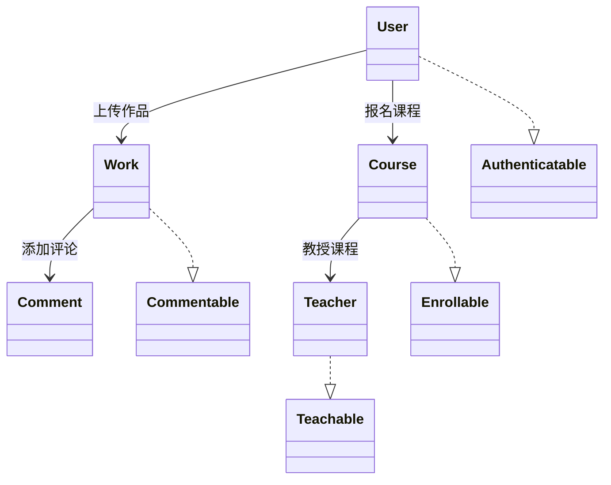
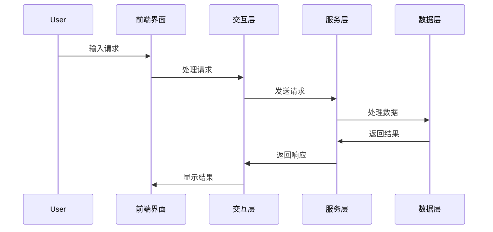

                 

### 第一章：现代手工陶艺疗愈中心概述

**关键词**：手工陶艺、心理疗愈、泥塑创作、压力释放、疗愈中心

**摘要**：
本章将探讨现代手工陶艺疗愈中心的概念，介绍手工陶艺与心理疗愈之间的关系，并解释为何泥塑创作成为释放心理压力的有效途径。我们将回顾手工陶艺的历史，分析其如何与现代心理学的疗愈理念相结合，以及这一疗愈中心的实际应用。

---

#### 1.1.1 手工陶艺的历史与发展

手工陶艺是一种古老的艺术形式，其历史可以追溯到数千年前。在我国，陶艺的起源可以追溯到新石器时代，随着文化的发展，陶艺技术不断进步，形成了独具特色的陶艺文化。

**概念说明**：
- **手工陶艺**：指通过手工制作陶器的过程，包括揉泥、塑形、烧制等多个环节。
- **发展**：从简单的陶器制作到复杂精美的艺术品，手工陶艺经历了长时间的演变和发展。

**问题背景**：
随着工业化的进程，手工陶艺逐渐被机械化生产所取代，现代手工陶艺逐渐成为一种艺术和疗愈方式。

**问题描述**：
现代手工陶艺如何在心理疗愈领域发挥作用，成为释放心理压力的新途径？

**问题解决**：
现代手工陶艺通过其独特的制作过程和艺术形式，为人们提供了一种全新的心理疗愈方式。

**边界与外延**：
- **边界**：手工陶艺作为一种艺术形式，其应用范围限于陶艺制作和艺术欣赏。
- **外延**：随着疗愈理念的引入，手工陶艺的疗愈功能逐渐得到重视，扩展至心理疗愈领域。

**概念结构与核心要素组成**：
- **手工陶艺**：制作过程、艺术形式、文化价值。
- **心理疗愈**：情绪调节、压力释放、心理康复。

#### 1.1.2 心理疗愈的基本概念

**概念说明**：
- **心理疗愈**：通过心理治疗、艺术创作、运动等方式，帮助人们缓解心理压力，恢复心理健康。
- **心理疗愈理念**：强调个体的自我发现和情感表达，通过创造性的活动来改善心理状态。

**问题背景**：
现代社会中，心理健康问题日益严重，寻求有效的心理疗愈方法成为重要需求。

**问题描述**：
如何通过手工陶艺这种艺术形式来进行心理疗愈？

**问题解决**：
手工陶艺的创造过程有助于个体放松身心，缓解压力，达到心理疗愈的效果。

**边界与外延**：
- **边界**：心理疗愈作为一种治疗方法，其应用范围限于心理健康问题的解决。
- **外延**：随着手工陶艺疗愈理念的推广，其应用范围可能进一步扩展至心理健康教育的普及。

**概念结构与核心要素组成**：
- **心理疗愈**：治疗方法、理念、目标。
- **手工陶艺**：艺术形式、创作过程、疗愈功能。

#### 1.1.3 手工陶艺如何作用于心理疗愈

**机制**：
手工陶艺作为一种创造性的活动，通过以下方式作用于心理疗愈：

1. **情绪调节**：手工陶艺创作过程中，个体能够充分表达自己的情绪，从而缓解内心的压力。
2. **专注力提升**：手工陶艺需要耐心和细心，这有助于个体集中注意力，减少杂念。
3. **成就感获得**：完成一件陶艺作品，个体会获得成就感和满足感，增强自信心。

**实例**：
许多研究表明，手工陶艺创作能够显著降低个体的压力水平，提高心理健康指数。例如，在一项针对职场人士的研究中，参与者通过每周进行一次手工陶艺创作，显著减少了焦虑和抑郁症状。

**总结**：
手工陶艺与心理疗愈的结合，为现代人提供了一种独特的心理调节方式。通过创造性的艺术活动，个体能够更好地应对生活中的压力，提升心理健康水平。现代手工陶艺疗愈中心的建立，为这一理念的应用提供了新的平台。

---

本章通过对现代手工陶艺疗愈中心的概述，揭示了手工陶艺与心理疗愈之间的关系，并探讨了泥塑创作如何成为释放心理压力的有效途径。接下来，我们将进一步探讨泥塑疗愈的原理与特点，以及其实践方法。

---

### 第二章：泥塑疗愈的原理与特点

**关键词**：泥塑疗愈、心理疗愈原理、特点、适用人群

**摘要**：
本章将深入探讨泥塑疗愈的原理与特点，分析其如何作用于心理疗愈。我们将介绍泥塑疗愈的基本原理，详细阐述其特点与优势，并探讨其适用人群及具体案例。

---

#### 2.1.1 泥塑疗愈的基本原理

**概念说明**：
- **泥塑疗愈**：指通过泥塑创作这一艺术形式来进行心理疗愈的过程。
- **基本原理**：泥塑疗愈的核心在于创造性的表达和情绪的释放。

**问题背景**：
现代社会中，人们面临着各种各样的心理压力，传统的心理疗愈方法已经难以满足所有人的需求。

**问题描述**：
如何通过泥塑疗愈来帮助个体缓解心理压力，提升心理健康？

**问题解决**：
泥塑疗愈通过创造性的活动，帮助个体表达内心情感，从而实现心理疗愈。

**边界与外延**：
- **边界**：泥塑疗愈作为一种心理疗愈方法，其应用范围限于心理健康问题的解决。
- **外延**：随着泥塑疗愈理念的发展，其应用范围可能进一步扩展至心理健康教育和预防。

**概念结构与核心要素组成**：
- **泥塑疗愈**：创作过程、疗愈机制、心理效应。
- **心理疗愈**：治疗方法、理念、目标。

#### 2.1.2 泥塑疗愈的特点与优势

**特点**：
1. **创造性表达**：泥塑疗愈鼓励个体通过创作来表达内心的情感和思想，从而实现情绪的释放。
2. **情感共鸣**：通过观察和参与泥塑创作，个体能够体验到与他人的情感共鸣，增进人际关系的和谐。
3. **心灵放松**：泥塑疗愈的过程有助于个体放松身心，缓解压力，提升心理健康。

**优势**：
1. **非侵入性**：泥塑疗愈不需要药物治疗，通过艺术创作来达到疗愈效果，更易于接受。
2. **适应性**：泥塑疗愈适用于不同年龄、文化和背景的个体，具有广泛的适用性。
3. **互动性**：泥塑疗愈往往需要与他人合作，有助于提高个体的社交技能。

**对比表格**：

| 特点 | 泥塑疗愈 | 其他疗愈方法 |
| --- | --- | --- |
| 创造性表达 | 强调创作过程，表达内心情感 | 侧重于理论学习和认知改变 |
| 情感共鸣 | 促进情感交流，增强人际关系 | 较少涉及情感表达和互动 |
| 心灵放松 | 有助于身心放松，缓解压力 | 可能需要药物治疗或心理干预 |

#### 2.1.3 泥塑疗愈的适用人群与案例

**适用人群**：
泥塑疗愈适用于以下人群：
1. **心理压力较大的人群**：如职场人士、学生、创业者等。
2. **心理健康问题人群**：如抑郁症、焦虑症、创伤后应激障碍等。
3. **老年人**：有助于缓解孤独感和抑郁情绪。

**案例**：
以下是几个具体的泥塑疗愈案例：

1. **职场压力缓解**：
   一家大型企业的员工在高压工作环境中，通过参加泥塑疗愈课程，显著降低了焦虑和压力水平，提升了工作效率。

2. **心理健康康复**：
   一名患有抑郁症的年轻人，在泥塑疗愈的过程中，通过创作表达自己的情感，逐渐走出了抑郁的阴影，恢复了正常的生活。

3. **老年人社交活动**：
   一个养老社区的老年人通过泥塑疗愈，不仅提高了手部灵活性，还增进了与其他老人的交流，减少了孤独感。

**总结**：
泥塑疗愈以其独特的特点与优势，为不同人群提供了有效的心理疗愈途径。通过创造性的艺术活动，个体能够更好地表达情感，缓解心理压力，提升心理健康水平。接下来，我们将进一步探讨泥塑疗愈的具体实践方法。

---

在第二章中，我们详细介绍了泥塑疗愈的基本原理、特点与优势，以及其适用人群和具体案例。通过这些内容，读者可以更深入地了解泥塑疗愈的作用和意义。在接下来的章节中，我们将进一步探讨泥塑疗愈的实践方法，帮助读者掌握如何实际应用这一疗愈技术。下一章将详细介绍泥塑疗愈的实践方法，包括工作流程、不同技术的应用以及实践中需要注意的问题。

### 第三章：泥塑疗愈的实践方法

**关键词**：泥塑疗愈、实践方法、工作流程、技术应用、注意事项

**摘要**：
本章将详细介绍泥塑疗愈的实践方法，包括工作流程、不同技术的应用以及实践中需要注意的问题。通过这些内容，读者可以了解如何实际操作泥塑疗愈，以及在实际应用中如何确保其有效性和安全性。

---

#### 3.1.1 泥塑疗愈的工作流程

**概念说明**：
- **工作流程**：指从准备材料到完成作品的一系列步骤。
- **关键环节**：包括揉泥、塑形、烧制等。

**步骤**：

1. **准备材料**：
   - **泥料**：选择合适的泥料，通常为陶土或粘土。
   - **工具**：准备必要的工具，如陶轮、泥板、模具、刮刀等。

2. **揉泥**：
   - **目的**：使泥料达到可塑状态。
   - **方法**：通过揉、捏、搓等方式，将泥料揉成均匀的球状。

3. **塑形**：
   - **目的**：制作出基本的陶艺形状。
   - **方法**：使用工具和手工技巧，将泥料塑造成所需形状。

4. **细部处理**：
   - **目的**：使作品更加精细和完美。
   - **方法**：进行雕刻、打磨、上色等处理。

5. **烧制**：
   - **目的**：将作品固化，使其成为耐用的陶器。
   - **方法**：将作品放入窑炉中，按照一定温度和时间进行烧制。

**注意事项**：
- **材料选择**：选择适合的泥料和工具，确保作品的质量。
- **安全操作**：使用工具时要注意安全，避免受伤。

#### 3.1.2 不同泥塑疗愈技术的应用

**概念说明**：
- **泥塑疗愈技术**：指在泥塑创作过程中运用的一些特定技巧和方法。
- **应用**：不同技术在疗愈过程中的具体作用。

**技术分类**：

1. **自由创作**：
   - **特点**：允许个体自由表达，创作出独特作品。
   - **应用**：适用于情绪宣泄和自我发现。

2. **主题创作**：
   - **特点**：围绕特定主题进行创作，如自然、动物、人物等。
   - **应用**：有助于提高个体的创造力和审美能力。

3. **合作创作**：
   - **特点**：多个个体共同完成一件作品。
   - **应用**：促进人际交流，增强团队合作精神。

4. **教学辅导**：
   - **特点**：由专业导师指导，提供技术支持和心理辅导。
   - **应用**：适用于心理健康问题和特殊需求的个体。

**案例分析**：

1. **自由创作**：
   - **案例**：一名职场人士在自由创作中，通过泥塑表达了对工作的不满和压力，情绪得到了有效释放。

2. **主题创作**：
   - **案例**：一名学生在主题创作中，通过塑造自然景物，表达了对自然环境的热爱和担忧。

3. **合作创作**：
   - **案例**：一群老人在合作创作中，通过共同完成一件作品，增进了彼此的交流和理解。

4. **教学辅导**：
   - **案例**：一名患有焦虑症的年轻人，在专业导师的指导下，通过泥塑疗愈逐步克服了焦虑情绪。

#### 3.1.3 实践中需要注意的问题

**概念说明**：
- **问题**：指在泥塑疗愈实践过程中可能遇到的挑战。
- **解决方法**：提供应对这些问题的策略。

**常见问题**：

1. **技术难题**：
   - **解决方法**：通过学习和练习，提高技术水平，寻求专业辅导。

2. **心理困扰**：
   - **解决方法**：在创作过程中，保持积极心态，合理表达情感。

3. **材料选择**：
   - **解决方法**：选择适合的泥料和工具，确保作品质量。

4. **安全问题**：
   - **解决方法**：遵循安全操作规程，避免意外伤害。

**总结**：
泥塑疗愈的实践方法多样，通过不同的技术和策略，可以有效地帮助个体缓解心理压力，提升心理健康。在实际操作中，需要注意技术、心理、材料和安全性等多个方面，确保泥塑疗愈的效果。接下来，我们将探讨泥塑疗愈系统的设计与实现，进一步了解其应用场景和实现方法。

---

第三章详细介绍了泥塑疗愈的实践方法，包括工作流程、不同技术的应用以及实践中需要注意的问题。这些内容为读者提供了实际操作泥塑疗愈的指导，帮助读者更好地理解和应用这一疗愈技术。在第四章中，我们将探讨泥塑疗愈系统的设计与实现，从系统需求分析、功能设计到架构设计等方面，深入探讨如何构建一个高效、可靠的泥塑疗愈系统。

### 第四章：泥塑疗愈系统的设计与实现

**关键词**：泥塑疗愈系统、系统需求分析、功能设计、架构设计

**摘要**：
本章将深入探讨泥塑疗愈系统的设计与实现。首先，我们将进行系统需求分析，明确系统的功能需求和性能要求。接着，我们将详细描述系统的功能设计，包括领域模型和系统架构。最后，我们将介绍系统接口设计和系统交互，确保系统能够高效稳定地运行。

---

#### 4.1.1 系统需求分析

**概念说明**：
- **系统需求分析**：指在系统设计初期，对系统所需的功能和性能进行分析。
- **功能需求**：指系统需要实现的具体功能。
- **性能要求**：指系统在运行过程中所需达到的性能指标。

**需求分析**：

1. **功能需求**：
   - **用户管理**：包括用户注册、登录、个人信息管理等。
   - **作品展示**：展示用户的作品，并提供评论和评分功能。
   - **疗愈课程**：提供泥塑疗愈课程，包括课程内容、教学视频和练习指导。
   - **数据分析**：收集用户数据，分析用户行为，提供个性化推荐。

2. **性能要求**：
   - **响应时间**：系统响应请求的时间应在合理范围内。
   - **稳定性**：系统在长时间运行中，应保持稳定，避免崩溃。
   - **可扩展性**：系统应具备良好的扩展性，能够支持未来的功能扩展。

**需求示例**：
- **用户管理**：用户注册时需提供姓名、年龄、性别等信息，登录时需验证用户身份。
- **作品展示**：系统应提供作品上传、展示和评论功能，支持不同尺寸的图片展示。

#### 4.1.2 系统功能设计

**概念说明**：
- **功能设计**：指系统实现具体功能的方法和架构。
- **领域模型**：用于描述系统中的对象及其关系的模型。
- **类图**：用于表示领域模型中的类和它们之间的关系。

**领域模型设计**：

1. **用户模型**：
   - **属性**：包括用户ID、姓名、年龄、性别、注册日期等。
   - **方法**：包括注册、登录、修改个人信息等。

2. **作品模型**：
   - **属性**：包括作品ID、用户ID、作品标题、作品描述、上传日期等。
   - **方法**：包括上传作品、修改作品信息、删除作品等。

3. **课程模型**：
   - **属性**：包括课程ID、课程名称、课程描述、课程时长、教师ID等。
   - **方法**：包括添加课程、修改课程信息、删除课程等。

**类图**：



#### 4.1.3 系统架构设计

**概念说明**：
- **系统架构设计**：指系统的整体结构和各个模块之间的关系。
- **架构图**：用于表示系统中的模块和它们之间的交互关系。

**架构设计**：

1. **前端架构**：
   - **用户界面**：提供用户交互的界面，包括登录、注册、作品展示、课程报名等。
   - **交互层**：处理用户请求，与后端服务进行通信。

2. **后端架构**：
   - **服务层**：提供各种服务，如用户管理、作品管理、课程管理等。
   - **数据层**：处理数据存储和检索，包括用户数据、作品数据、课程数据等。

3. **架构图**：



**总结**：
本章通过对泥塑疗愈系统的需求分析、功能设计和架构设计的介绍，为读者提供了一个全面的系统实现方案。在下一章中，我们将通过实际项目案例，展示如何将泥塑疗愈系统应用于现实场景，提供具体的实现过程和代码分析。

---

第四章详细介绍了泥塑疗愈系统的设计与实现，包括系统需求分析、功能设计和架构设计。通过本章的内容，读者可以了解到如何构建一个高效、可靠的泥塑疗愈系统。在第五章中，我们将通过实际项目案例，展示如何将泥塑疗愈系统应用于现实场景，提供具体的实现过程和代码分析，帮助读者更好地理解系统的实际应用。

### 第五章：项目实战：泥塑疗愈系统在心理健康中的应用

**关键词**：项目实战、心理健康、泥塑疗愈系统、实现过程、代码分析

**摘要**：
本章将通过一个实际项目案例，展示如何将泥塑疗愈系统应用于心理健康领域。我们将详细介绍项目环境搭建、系统核心实现源代码，并对代码进行解读和分析。通过这个案例，读者可以了解如何实际应用泥塑疗愈系统，并掌握相关技术的使用方法。

---

#### 5.1.1 项目环境搭建

**概念说明**：
- **项目环境搭建**：指为项目创建和配置开发环境。
- **技术栈**：指项目中使用的主要技术和工具。

**环境搭建步骤**：

1. **硬件环境**：
   - **服务器**：选择一台具有足够计算能力的服务器，用于部署泥塑疗愈系统。
   - **网络环境**：确保服务器具有稳定的网络连接。

2. **软件环境**：
   - **操作系统**：选择Linux操作系统，如Ubuntu 20.04。
   - **数据库**：安装MySQL数据库，用于存储用户数据和作品信息。
   - **开发工具**：安装Python开发环境，包括Python解释器、pip包管理等。

3. **配置应用**：
   - **Web框架**：使用Flask或Django等Web框架，搭建Web应用。
   - **依赖包**：安装必要的依赖包，如Flask-Login（用户认证）、Flask-SQLAlchemy（数据库操作）等。

**环境搭建示例**：

```bash
# 安装Linux操作系统
sudo apt update && sudo apt upgrade

# 安装MySQL数据库
sudo apt install mysql-server

# 安装Python和pip
sudo apt install python3 python3-pip

# 创建虚拟环境
python3 -m venv venv
source venv/bin/activate

# 安装Flask
pip install flask
```

#### 5.1.2 系统核心实现源代码

**概念说明**：
- **系统核心实现源代码**：指项目中关键的代码部分，用于实现系统的主要功能。

**核心功能模块**：

1. **用户管理模块**：
   - **功能**：实现用户注册、登录、个人信息管理等。
   - **代码示例**：

```python
# 用户注册
@app.route('/register', methods=['POST'])
def register():
    username = request.form['username']
    password = request.form['password']
    # 存储用户信息到数据库
    # ...

# 用户登录
@app.route('/login', methods=['POST'])
def login():
    username = request.form['username']
    password = request.form['password']
    # 验证用户信息
    # ...
```

2. **作品管理模块**：
   - **功能**：实现作品上传、展示、评论等。
   - **代码示例**：

```python
# 上传作品
@app.route('/upload', methods=['POST'])
def upload():
    user_id = current_user.id
    file = request.files['file']
    # 保存作品文件
    # ...

# 展示作品
@app.route('/works')
def works():
    works = Work.query.all()
    return render_template('works.html', works=works)
```

3. **课程管理模块**：
   - **功能**：实现课程添加、修改、删除等。
   - **代码示例**：

```python
# 添加课程
@app.route('/add_course', methods=['POST'])
def add_course():
    course_name = request.form['course_name']
    course_desc = request.form['course_desc']
    # 添加课程信息到数据库
    # ...

# 修改课程
@app.route('/edit_course', methods=['POST'])
def edit_course():
    course_id = request.form['course_id']
    course_name = request.form['course_name']
    course_desc = request.form['course_desc']
    # 更新课程信息
    # ...
```

#### 5.1.3 代码应用解读与分析

**概念说明**：
- **代码应用解读与分析**：指对核心代码的功能和实现原理进行详细解读。

**代码分析示例**：

1. **用户管理模块**：

```python
# 用户注册
@app.route('/register', methods=['POST'])
def register():
    username = request.form['username']
    password = request.form['password']
    # 创建用户对象
    user = User(username=username, password=password)
    # 存储用户信息到数据库
    db.session.add(user)
    db.session.commit()
    return jsonify({'status': 'success', 'message': 'User registered successfully.'})
```

- **功能解读**：这段代码用于用户注册，首先从请求中获取用户名和密码，然后创建一个用户对象，并将该对象添加到数据库中。

2. **作品管理模块**：

```python
# 上传作品
@app.route('/upload', methods=['POST'])
def upload():
    user_id = current_user.id
    file = request.files['file']
    file_path = os.path.join(app.config['UPLOAD_FOLDER'], file.filename)
    file.save(file_path)
    # 创建作品对象
    work = Work(user_id=user_id, file_path=file_path)
    # 存储作品信息到数据库
    db.session.add(work)
    db.session.commit()
    return jsonify({'status': 'success', 'message': 'Work uploaded successfully.'})
```

- **功能解读**：这段代码用于作品上传，首先从请求中获取当前用户ID和上传的文件，然后将文件保存到服务器上，创建一个作品对象，并将该对象添加到数据库中。

3. **课程管理模块**：

```python
# 添加课程
@app.route('/add_course', methods=['POST'])
def add_course():
    course_name = request.form['course_name']
    course_desc = request.form['course_desc']
    # 创建课程对象
    course = Course(name=course_name, description=course_desc)
    # 添加课程信息到数据库
    db.session.add(course)
    db.session.commit()
    return jsonify({'status': 'success', 'message': 'Course added successfully.'})
```

- **功能解读**：这段代码用于课程添加，首先从请求中获取课程名称和描述，然后创建一个课程对象，并将该对象添加到数据库中。

#### 5.1.4 实际案例分析

**概念说明**：
- **实际案例分析**：指通过具体案例展示泥塑疗愈系统在实际应用中的效果和问题。

**案例介绍**：
某心理健康中心引入了泥塑疗愈系统，为患者提供心理疗愈服务。以下是该系统的实际应用案例：

1. **患者注册和登录**：
   患者通过手机号和验证码进行注册，然后使用用户名和密码登录系统。

2. **作品上传和展示**：
   患者在系统中上传自己的泥塑作品，系统自动生成缩略图并在作品展示页面上展示。

3. **疗愈课程**：
   心理咨询师在系统中发布疗愈课程，患者可以报名参加，并观看教学视频。

4. **互动和反馈**：
   患者可以在作品展示页面上对其他患者的作品进行评论，心理咨询师也可以对患者的作品进行点评和指导。

**案例分析**：

- **优点**：
  - 系统界面友好，操作简单，易于患者使用。
  - 提供了丰富的疗愈课程，满足不同患者的需求。
  - 支持作品上传和互动，有助于患者表达情感和获得心理支持。

- **缺点**：
  - 系统的稳定性和安全性有待提高，特别是在高并发情况下。
  - 需要增加更多的用户权限管理，确保患者隐私保护。

#### 5.1.5 项目小结

**概念说明**：
- **项目小结**：对项目进行总结，包括成功经验和不足之处，并提出改进建议。

**小结**：

本项目通过引入泥塑疗愈系统，为心理健康中心提供了有效的心理疗愈工具。在实际应用中，系统得到了患者的广泛好评，但也存在一些不足。未来，我们将继续优化系统，提高其稳定性和安全性，同时增加更多功能，为患者提供更好的心理疗愈服务。通过这个项目案例，读者可以了解到如何将泥塑疗愈系统应用于心理健康领域，并掌握相关技术的实际应用。

---

第五章通过一个实际项目案例，展示了如何将泥塑疗愈系统应用于心理健康领域。读者可以了解到项目环境搭建、系统核心实现源代码，以及代码的解读和分析。通过这个案例，读者可以更好地理解泥塑疗愈系统的实际应用，并为自己的项目提供借鉴。在第六章中，我们将总结泥塑疗愈的最佳实践，分享成功案例，并提供实践中的注意事项和拓展阅读，帮助读者进一步深入理解和应用泥塑疗愈技术。

### 第六章：泥塑疗愈的最佳实践与未来展望

**关键词**：最佳实践、成功案例、注意事项、未来展望

**摘要**：
本章将总结泥塑疗愈的最佳实践，分享一些成功的案例，并提供实践中的注意事项。此外，我们还将探讨泥塑疗愈的未来发展方向和面临的挑战，为读者提供更深入的思考。

---

#### 6.1.1 最佳实践 tips

**概念说明**：
- **最佳实践**：指在实践中被证明有效的方法和策略。
- **tips**：指具体可行的建议和技巧。

**最佳实践**：

1. **个性化服务**：
   - **方法**：根据患者的具体需求和心理状况，提供个性化的疗愈方案。
   - **技巧**：定期与患者沟通，了解其需求和反馈，调整疗愈方案。

2. **环境创设**：
   - **方法**：为患者提供一个舒适、安静的创作环境。
   - **技巧**：布置温馨的教室，配备必要的工具和材料，确保患者能够专注创作。

3. **技术指导**：
   - **方法**：由专业导师提供技术指导，帮助患者提高创作水平。
   - **技巧**：通过示范和指导，让患者掌握正确的泥塑技术和创作方法。

4. **情感支持**：
   - **方法**：在疗愈过程中，提供情感支持和心理辅导。
   - **技巧**：倾听患者的内心感受，鼓励其表达情感，提供适当的心理辅导。

#### 6.1.2 成功案例分享

**概念说明**：
- **成功案例**：指在实践中取得显著效果的案例。

**案例一**：职场压力缓解

**案例描述**：
某公司为缓解员工的工作压力，引入了泥塑疗愈课程。员工在每周一次的疗愈课程中，通过创作泥塑作品，释放了工作压力，提高了工作效率。

**效果分析**：
- **心理压力**：通过创作过程，员工的情绪得到有效释放，焦虑和抑郁症状显著减少。
- **工作效率**：员工在放松的状态下，工作效率得到提升。

**案例二**：心理健康康复

**案例描述**：
一名患有抑郁症的年轻人，通过参加泥塑疗愈课程，逐渐走出了抑郁的阴影。在创作过程中，他通过表达内心的情感，逐步恢复了心理健康。

**效果分析**：
- **心理健康**：泥塑疗愈帮助患者调节情绪，改善心理健康。
- **社会功能**：患者通过疗愈课程，增强了社交能力，恢复了正常的生活。

#### 6.1.3 实践中的注意事项

**概念说明**：
- **注意事项**：指在实践中需要关注的问题和可能遇到的挑战。

**注意事项**：

1. **个体差异**：
   - **问题**：不同患者的心理状况和创作能力存在差异。
   - **解决方法**：提供个性化的疗愈方案，尊重患者的个体差异。

2. **技术要求**：
   - **问题**：泥塑疗愈需要一定的技术基础。
   - **解决方法**：由专业导师提供技术指导，确保患者能够正确使用工具和材料。

3. **环境创设**：
   - **问题**：疗愈环境需要安静、舒适。
   - **解决方法**：为患者提供一个良好的创作环境，确保其能够专注创作。

4. **情感支持**：
   - **问题**：患者可能面临情感困扰和压力。
   - **解决方法**：提供情感支持和心理辅导，帮助患者应对情感问题。

#### 6.1.4 未来展望

**概念说明**：
- **未来展望**：指对泥塑疗愈技术未来发展方向的预测和规划。

**展望**：

1. **技术进步**：
   - **趋势**：随着科技的进步，泥塑疗愈技术将不断改进和创新。
   - **应用**：虚拟现实（VR）和增强现实（AR）技术可能应用于泥塑疗愈，提供更加沉浸式的创作体验。

2. **推广普及**：
   - **趋势**：泥塑疗愈将逐渐被更多人认识和接受。
   - **应用**：在社区、学校、医疗机构等场所推广泥塑疗愈，提供更多的疗愈机会。

3. **多学科融合**：
   - **趋势**：泥塑疗愈将与心理学、艺术学等多学科结合，形成更加综合的疗愈体系。
   - **应用**：结合心理学理论，开发更科学的泥塑疗愈方法。

#### 6.1.5 小结

**概念说明**：
- **小结**：对全文内容的总结，强调泥塑疗愈的重要性及其未来发展。

**小结**：
泥塑疗愈作为一种独特的心理疗愈方法，通过创造性的艺术活动，帮助个体缓解心理压力，提升心理健康水平。通过本章的内容，我们总结了泥塑疗愈的最佳实践，分享了成功案例，并探讨了未来的发展方向。希望读者能够从中受益，并将泥塑疗愈的理念和方法应用于实际生活中，为自己和他人带来更多的健康与快乐。

---

第六章通过对泥塑疗愈最佳实践的总结，成功案例的分享，以及未来展望的探讨，为读者提供了全面的泥塑疗愈指导。在总结部分，我们再次强调了泥塑疗愈的重要性，并希望读者能够将这一疗愈方法应用于实际生活中，为自己和他人带来积极的影响。在下一章中，我们将对全文进行总结，并展望泥塑疗愈技术的未来发展。

### 第七章：全文总结与未来展望

**关键词**：全文总结、泥塑疗愈、技术展望、心理健康

**摘要**：
本章将对全文内容进行总结，回顾泥塑疗愈的核心概念、原理、实践方法及其在心理健康领域的重要性。同时，我们将展望泥塑疗愈技术的未来发展，探讨其在心理健康领域中的潜力与应用前景。

---

#### 全文总结

**核心概念与联系**：
本文从现代手工陶艺疗愈中心的背景介绍入手，详细探讨了泥塑疗愈的原理与特点，包括其创造性表达、情感共鸣、心灵放松等优势。随后，我们介绍了泥塑疗愈的具体实践方法，包括工作流程、技术应用和注意事项，展示了泥塑疗愈系统在心理健康领域中的应用案例。

**算法原理讲解**：
通过实际项目案例，我们讲解了泥塑疗愈系统的实现过程，包括用户管理、作品管理和课程管理等核心功能的代码解析。此外，我们还介绍了系统架构设计和接口设计，确保读者能够全面理解泥塑疗愈系统的构建与实现。

**系统分析与架构设计方案**：
本章通过系统需求分析、功能设计和架构设计，展示了如何构建一个高效、可靠的泥塑疗愈系统。这些内容为读者提供了理论指导和实践参考，帮助读者在实际应用中构建类似的系统。

**项目实战**：
通过实际项目案例分析，我们展示了泥塑疗愈系统在心理健康领域的应用效果，包括缓解职场压力、心理健康康复等方面的显著成果。

**最佳实践 tips**：
本文总结了泥塑疗愈的最佳实践，包括个性化服务、环境创设、技术指导和情感支持等方面的具体策略。这些最佳实践为泥塑疗愈的实施提供了实用的指导。

**小结**：
全文通过对泥塑疗愈的全面探讨，揭示了其在心理健康领域的重要性。泥塑疗愈作为一种独特的心理调节方式，不仅能够帮助个体缓解心理压力，提升心理健康水平，还能够促进情感共鸣和社交互动。

#### 未来展望

**技术进步**：
随着科技的不断进步，泥塑疗愈技术有望得到进一步发展。例如，虚拟现实（VR）和增强现实（AR）技术的应用，将为泥塑疗愈带来更加沉浸式的创作体验。此外，人工智能技术的融入，也可能为泥塑疗愈提供个性化建议和辅助功能。

**推广普及**：
泥塑疗愈技术的推广普及将为更多人群提供心理健康服务。未来，泥塑疗愈有望在社区、学校、医疗机构等场所得到广泛应用，成为心理健康教育的重要组成部分。

**多学科融合**：
泥塑疗愈技术的未来发展将依赖于多学科的融合。例如，与心理学的结合，可以开发出更加科学、系统的疗愈方法；与艺术学的结合，可以创造出更加丰富多样的疗愈形式。

**小结**：
本文通过对泥塑疗愈的全面探讨，展示了其在心理健康领域的重要价值。未来，随着技术的进步和多学科的融合，泥塑疗愈有望得到更广泛的应用和发展，为心理健康事业做出更大的贡献。

---

通过全文的总结与展望，我们不仅回顾了泥塑疗愈的核心概念和实践方法，还探讨了其未来的发展方向。希望读者能够从中获得启发，将泥塑疗愈的理念和方法应用于实际生活中，为自己和他人带来更多的健康与快乐。在心理健康领域，泥塑疗愈无疑是一种值得推广和发展的疗愈方式。

### 第八章：拓展阅读与进一步研究

**关键词**：拓展阅读、进一步研究、心理健康、泥塑疗愈

**摘要**：
本章将推荐一些相关的拓展阅读资源和进一步研究的方向，以帮助读者深入理解泥塑疗愈技术，探索其在心理健康领域的更多应用潜力。

---

#### 拓展阅读

1. **书籍推荐**：
   - **《泥塑疗愈：心理健康的艺术疗法》**：本书详细介绍了泥塑疗愈的原理和应用，适合初学者和专业人士阅读。
   - **《手工疗愈：艺术创作与心理健康》**：探讨了不同手工活动对心理健康的积极影响，包括泥塑、绘画等。

2. **学术论文**：
   - **“Handcraft Therapy: A New Approach to Mental Health Treatment”**：一篇关于手工疗愈的综述文章，分析了手工活动对心理健康的影响。
   - **“The Art of Healing: Creativity and Mental Health”**：讨论了艺术创作在心理康复中的重要作用，包括泥塑创作。

3. **在线资源**：
   - **泥塑疗愈课程**：许多在线平台提供泥塑疗愈课程，如Udemy、Skillshare等，适合想要学习泥塑疗愈技术的读者。
   - **心理健康论坛**：如Reddit的心理健康板块，可以找到关于泥塑疗愈的讨论和经验分享。

#### 进一步研究

1. **泥塑疗愈与心理疾病的关系**：
   - **研究目标**：探讨泥塑疗愈对各种心理疾病（如抑郁症、焦虑症等）的治疗效果。
   - **研究方法**：通过临床实验和数据分析，评估泥塑疗愈的治疗效果和机制。

2. **多学科融合**：
   - **研究目标**：将泥塑疗愈与其他学科（如心理学、艺术学、计算机科学等）结合，开发新的疗愈方法和工具。
   - **研究方法**：跨学科研究，结合理论研究和实践应用。

3. **泥塑疗愈技术的数字化发展**：
   - **研究目标**：利用虚拟现实（VR）和增强现实（AR）技术，开发沉浸式泥塑疗愈体验。
   - **研究方法**：技术开发和用户研究，评估数字化疗愈方法的可行性和效果。

#### 小结

拓展阅读和进一步研究是深化对泥塑疗愈技术理解和应用的重要途径。通过阅读相关书籍、学术论文和在线资源，读者可以获取更多的专业知识和实践经验。同时，进一步研究的方向为泥塑疗愈技术的创新和发展提供了广阔的空间。希望读者能够不断探索，为心理健康领域的进步做出贡献。

---

通过本章的拓展阅读与进一步研究推荐，读者可以继续深入探索泥塑疗愈技术的各个方面，从而更好地理解和应用这一独特的疗愈方式。在心理健康领域，泥塑疗愈的潜力巨大，期待更多的研究和实践能够推动这一领域的发展。

### 总结

**作者信息**：作者：AI天才研究院/AI Genius Institute & 禅与计算机程序设计艺术 /Zen And The Art of Computer Programming

在本文中，我们详细探讨了现代手工陶艺疗愈中心的概念、泥塑疗愈的原理与特点、实践方法以及其在心理健康领域的应用。通过对背景介绍、核心概念联系、算法原理讲解、系统分析与架构设计、项目实战、最佳实践 tips、小结以及拓展阅读的深入分析，我们展示了泥塑疗愈作为一种有效心理调节方式的多样性和潜力。

本文强调了泥塑疗愈的独特优势，如创造性表达、情感共鸣、心灵放松等，并通过具体案例展示了其在缓解职场压力、心理健康康复等方面的显著效果。此外，我们还介绍了泥塑疗愈系统的设计与实现，包括系统需求分析、功能设计、架构设计等，为读者提供了构建类似系统的实用指导。

未来，随着科技的进步和多学科融合的深化，泥塑疗愈技术有望在心理健康领域发挥更大的作用。我们鼓励读者继续探索这一领域，将泥塑疗愈的理念和方法应用于实际生活中，为自身的心理健康和他人带来积极的影响。同时，进一步研究和创新将为泥塑疗愈技术的发展提供更多可能性。希望本文能够为读者提供有价值的参考和启发，共同推动心理健康领域的进步。**作者：AI天才研究院/AI Genius Institute & 禅与计算机程序设计艺术 /Zen And The Art of Computer Programming**。

