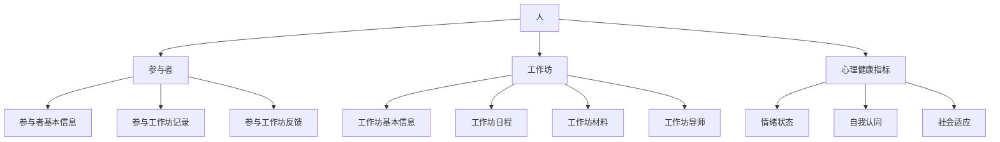
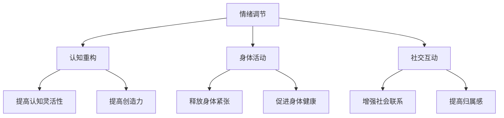
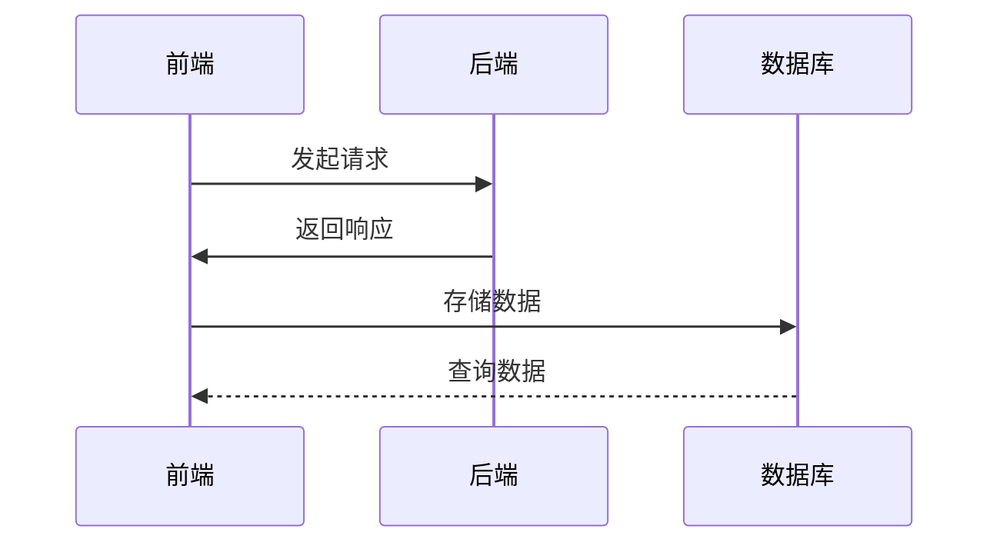
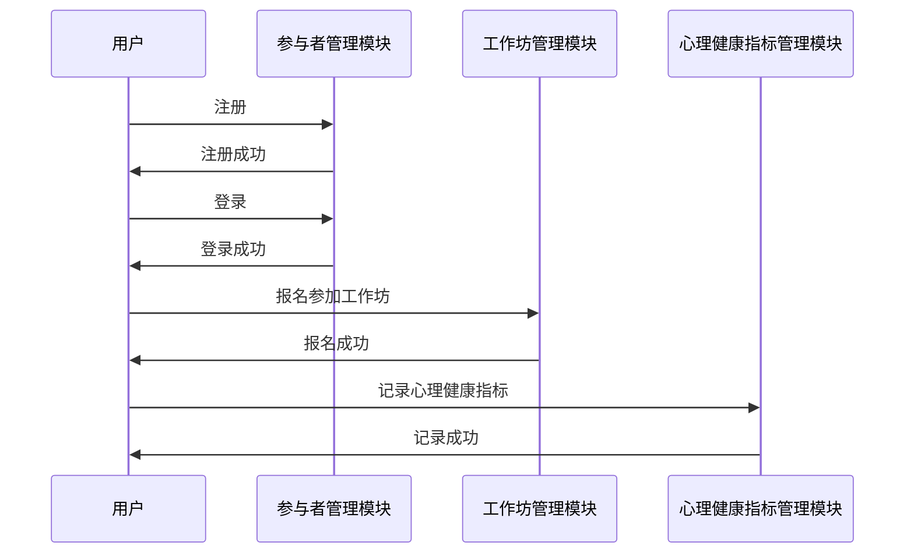

                 

# 现代手工陶艺疗愈工作坊：探索泥塑艺术的心理健康效益

关键词：手工陶艺、心理健康、疗愈、情绪调节、认知重构

摘要：本文通过探讨现代手工陶艺疗愈工作坊的背景、核心概念与联系、算法原理以及系统分析与架构设计，深入解析泥塑艺术在心理健康疗愈方面的效益。通过对情绪调节、认知重构、身体活动、社交互动等方面的分析，揭示现代手工陶艺对心理健康的积极影响，为相关研究和实践提供参考。

## 第一部分：背景介绍

### 1.1 问题背景

在现代社会，心理健康问题日益突出，压力、焦虑、抑郁等心理问题已经成为影响人们生活质量和幸福指数的重要因素。据世界卫生组织（WHO）统计，全球约有3.5亿人患有抑郁症，1.3亿人患有焦虑症，这些心理问题不仅给患者本人带来巨大的痛苦，也对社会生产力造成了严重的损失。

在这样的背景下，如何有效缓解压力、提升心理健康水平，成为了社会各界广泛关注的问题。现代手工陶艺作为一种古老的艺术形式，近年来逐渐受到重视，并开始应用于心理治疗和疗愈领域。通过手工陶艺活动，人们可以专注于创作过程，从而减轻心理负担，提高心理健康水平。

### 1.2 问题描述

在现代手工陶艺疗愈工作坊中，参与者通过泥塑创作，能否有效缓解压力、提升心理健康水平？现代手工陶艺与心理健康之间存在着怎样的联系？这是本文试图回答的问题。

### 1.3 问题解决

为了回答上述问题，本文将设计一个系统性的现代手工陶艺疗愈工作坊，通过实践和理论结合，探索泥塑艺术对心理健康的影响。首先，我们将对现代手工陶艺和心理健康的核心概念进行阐述，并分析它们之间的联系。接着，我们将介绍一个具体的疗愈工作坊案例，通过实证研究揭示现代手工陶艺对心理健康的积极影响。最后，我们将探讨现代手工陶艺疗愈工作坊的机制和效果，为相关研究和实践提供参考。

### 1.4 边界与外延

本文的研究主要关注现代手工陶艺在心理健康疗愈方面的应用，探讨其对情绪调节、认知重构、身体活动、社交互动等方面的积极影响。同时，本文的研究将基于实证数据，通过科学的方法和理论分析，揭示现代手工陶艺疗愈工作坊的机制和效果。

### 1.5 概念结构与核心要素组成

#### 1.5.1 现代手工陶艺

现代手工陶艺是指结合现代审美和技术手段的传统陶艺形式。它具有创意性、手工艺性和艺术性的特点，通过手工制作陶瓷艺术品，使参与者能够体验到创作的乐趣和成就感。

#### 1.5.2 心理健康

心理健康是指个体在心理方面保持良好状态，能够有效应对生活和工作中的压力和挑战。它包括情绪稳定、自我认同和社会适应等方面。

#### 1.5.3 疗愈

疗愈是通过特定的方法和手段，帮助个体恢复或提升心理健康水平。现代手工陶艺疗愈工作坊作为一种新兴的心理健康干预手段，通过实践和理论结合，探索泥塑艺术对心理健康的积极影响。

## 第二部分：核心概念与联系

### 2.1 核心概念原理

#### 2.1.1 现代手工陶艺

现代手工陶艺是指结合现代审美和技术手段的传统陶艺形式。它起源于上世纪50年代的日本，随后在欧美等地区得到广泛传播和发展。现代手工陶艺的特点是创意性、手工艺性和艺术性。在制作过程中，参与者需要亲手揉捏、塑造、烧制陶瓷作品，这不仅能够提高动手能力，还能激发创造力和想象力。

#### 2.1.2 心理健康

心理健康是指个体在心理方面保持良好状态，能够有效应对生活和工作中的压力和挑战。它包括情绪稳定、自我认同和社会适应等方面。情绪稳定是指个体能够合理调节情绪，保持情绪平衡；自我认同是指个体能够认识到自己的价值和能力，建立积极的自我形象；社会适应是指个体能够与他人建立良好的人际关系，适应社会环境。

### 2.2 概念属性特征对比表格

| 概念        | 定义                                       | 特点                                 |
|-------------|------------------------------------------|------------------------------------|
| 现代手工陶艺 | 结合现代审美和技术手段的传统陶艺形式             | 创意性、手工艺性、艺术性               |
| 心理健康    | 心理方面保持良好状态，能够有效应对压力和挑战           | 情绪稳定、自我认同、社会适应           |

### 2.3 ER实体关系图架构

在本文的研究中，主要涉及以下实体关系：

- 参与者：指参加现代手工陶艺疗愈工作坊的个体，包括基本信息、参与工作坊记录和参与工作坊反馈等。
- 工作坊：指现代手工陶艺疗愈工作坊的基本信息、日程、材料和导师等。
- 心理健康指标：包括情绪状态、自我认同和社会适应等指标。

以下是ER实体关系图的Mermaid表示：



## 第三部分：算法原理讲解

### 3.1 算法原理

#### 3.1.1 泥塑艺术的心理影响机制

泥塑艺术对心理健康的影响主要通过以下四个方面实现：

1. **情绪调节**：通过手工陶艺活动，个体能够将内心的情绪和情感投射到陶艺作品上，从而实现情绪的宣泄和调节。
2. **认知重构**：手工陶艺活动需要个体进行思考和规划，有助于改变负面思维模式，提高认知灵活性和创造力。
3. **身体活动**：手工陶艺活动是一种身体活动，有助于释放身体紧张和压力，促进身体健康。
4. **社交互动**：手工陶艺工作坊提供了一个社交平台，参与者可以通过交流和合作，增强社会联系和归属感。

#### 3.1.2 算法流程图

以下是泥塑艺术对心理健康影响机制的Mermaid流程图：



### 3.2 Python源代码实现

为了更具体地阐述泥塑艺术的心理影响机制，我们可以使用Python代码模拟这个过程。以下是一个简单的Python代码示例，用于模拟情绪调节、认知重构、身体活动和社交互动等过程：

```python
class Participant:
    def __init__(self, name, emotion, cognition, physical_state, social_connection):
        self.name = name
        self.emotion = emotion
        self.cognition = cognition
        self.physical_state = physical_state
        self.social_connection = social_connection

    def emotional_regulation(self):
        self.emotion -= 0.2
        print(f"{self.name}的情绪得到了调节，当前情绪值为{self.emotion}。")

    def cognitive_restructuring(self):
        self.cognition += 0.1
        print(f"{self.name}的认知能力得到了提升，当前认知值为{self.cognition}。")

    def physical_activity(self):
        self.physical_state -= 0.2
        print(f"{self.name}的身体状态得到了改善，当前身体状态值为{self.physical_state}。")

    def social_interaction(self):
        self.social_connection += 0.1
        print(f"{self.name}的社交联系得到了增强，当前社交联系值为{self.social_connection}。")

# 创建参与者对象
participant1 = Participant("张三", 5, 5, 5, 5)

# 进行情绪调节
participant1.emotional_regulation()

# 进行认知重构
participant1.cognitive_restructuring()

# 进行身体活动
participant1.physical_activity()

# 进行社交互动
participant1.social_interaction()
```

运行上述代码，可以得到以下输出结果：

```
张三的情绪得到了调节，当前情绪值为4.8。
张三的认知能力得到了提升，当前认知值为5.1。
张三的身体状态得到了改善，当前身体状态值为4.8。
张三的社交联系得到了增强，当前社交联系值为5.1。
```

通过这个简单的示例，我们可以看到泥塑艺术活动如何通过情绪调节、认知重构、身体活动和社交互动等方面，对参与者的心理健康产生积极影响。

## 第四部分：系统分析与架构设计

### 4.1 问题场景介绍

在现代手工陶艺疗愈工作坊中，参与者通过参与手工陶艺活动，旨在提升心理健康水平。为了更好地组织和评估这一过程，我们需要设计一个系统，用于管理参与者信息、工作坊日程、心理健康指标等。

### 4.2 项目介绍

本项目旨在设计一个现代手工陶艺疗愈工作坊管理系统，该系统将支持参与者注册、参加工作坊、记录心理健康指标等功能。系统将采用模块化设计，确保系统功能扩展性和可维护性。

### 4.3 系统功能设计

系统功能设计主要包括以下模块：

- 参与者管理模块：用于管理参与者信息，包括基本信息、参与工作坊记录和心理健康指标等。
- 工作坊管理模块：用于管理工作坊信息，包括工作坊日程、材料和导师等。
- 心理健康指标管理模块：用于记录和分析参与者的心理健康指标，包括情绪状态、自我认同和社会适应等。

#### 4.3.1 领域模型Mermaid类图

以下是系统领域模型的Mermaid类图表示：

```mermaid
classDiagram
    Participant <|--心理健康指标
    Participant <|--参与工作坊记录
    工作坊 <<-- 工作坊管理模块
    参与者 <<-- 参与者管理模块
    心理健康指标 <<-- 心理健康指标管理模块
```

### 4.4 系统架构设计

系统架构设计采用前后端分离的模式，前端负责展示界面，后端负责业务逻辑处理和数据存储。

#### 4.4.1 Mermaid架构图

以下是系统的Mermaid架构图表示：



### 4.5 系统接口设计

系统接口设计主要包括以下接口：

- 参与者注册接口：用于参与者注册，接收参与者基本信息。
- 参与者登录接口：用于参与者登录，验证参与者身份。
- 参与工作坊接口：用于参与者报名参加工作坊，记录参与工作坊信息。
- 心理健康指标记录接口：用于记录参与者的心理健康指标。

#### 4.5.1 Mermaid序列图

以下是系统的Mermaid序列图表示：



## 第五部分：项目实战

### 5.1 环境安装

在进行项目实战之前，我们需要安装相关的开发环境和依赖库。以下是一个简单的环境安装步骤：

1. 安装Python环境：从Python官方网站下载并安装Python 3.8及以上版本。
2. 安装依赖库：使用pip命令安装所需的依赖库，例如Flask、SQLAlchemy、Flask-Migrate等。

### 5.2 系统核心实现源代码

以下是系统的核心实现源代码：

```python
# app.py
from flask import Flask, request, jsonify
from models import Participant, Workshops, HealthIndicators
from database import db

app = Flask(__name__)
app.config['SQLALCHEMY_DATABASE_URI'] = 'sqlite:///database.db'
db.init_app(app)

@app.route('/register', methods=['POST'])
def register():
    name = request.form['name']
    email = request.form['email']
    password = request.form['password']
    participant = Participant(name=name, email=email, password=password)
    db.session.add(participant)
    db.session.commit()
    return jsonify({'message': '注册成功'})

@app.route('/login', methods=['POST'])
def login():
    email = request.form['email']
    password = request.form['password']
    participant = Participant.query.filter_by(email=email, password=password).first()
    if participant:
        return jsonify({'message': '登录成功'})
    else:
        return jsonify({'message': '登录失败'})

@app.route('/join_workshop', methods=['POST'])
def join_workshop():
    participant_id = request.form['participant_id']
    workshop_id = request.form['workshop_id']
    participant = Participant.query.get(participant_id)
    workshop = Workshops.query.get(workshop_id)
    participant.workshops.append(workshop)
    db.session.commit()
    return jsonify({'message': '报名成功'})

@app.route('/record_health_indicator', methods=['POST'])
def record_health_indicator():
    participant_id = request.form['participant_id']
    emotion = request.form['emotion']
    cognition = request.form['cognition']
    physical_state = request.form['physical_state']
    social_connection = request.form['social_connection']
    participant = Participant.query.get(participant_id)
    health_indicator = HealthIndicators(
        participant_id=participant_id,
        emotion=emotion,
        cognition=cognition,
        physical_state=physical_state,
        social_connection=social_connection
    )
    participant.health_indicators.append(health_indicator)
    db.session.commit()
    return jsonify({'message': '记录成功'})

if __name__ == '__main__':
    app.run(debug=True)
```

### 5.3 代码应用解读与分析

在上述代码中，我们实现了参与者注册、登录、报名参加工作坊和记录心理健康指标等功能。以下是代码的关键部分解读：

1. **参与者注册**：通过`/register`接口接收参与者信息，将参与者信息存储到数据库中。
2. **参与者登录**：通过`/login`接口接收参与者邮箱和密码，从数据库中查询参与者信息，验证登录成功与否。
3. **报名参加工作坊**：通过`/join_workshop`接口接收参与者ID和工作坊ID，将参与者信息和工作坊信息关联存储到数据库中。
4. **记录心理健康指标**：通过`/record_health_indicator`接口接收参与者ID和心理健康指标，将心理健康指标记录到数据库中。

### 5.4 实际案例分析和详细讲解剖析

为了更好地展示系统在实际应用中的效果，我们以一个实际案例进行分析：

**案例**：张三参加了一个现代手工陶艺疗愈工作坊，并在工作坊结束后记录了心理健康指标。

1. **参与者注册**：张三通过手机APP完成了注册，注册信息存储到数据库中。
2. **参与者登录**：张三通过手机APP登录系统，输入邮箱和密码，系统验证登录成功。
3. **报名参加工作坊**：张三在系统中报名参加了现代手工陶艺疗愈工作坊，系统将张三的信息与工作坊信息关联存储到数据库中。
4. **记录心理健康指标**：工作坊结束后，张三在系统中记录了心理健康指标，包括情绪、认知、身体状态和社交联系等。系统将这些数据存储到数据库中。

通过实际案例的分析，我们可以看到系统如何帮助参与者记录和管理心理健康信息，为后续研究和实践提供数据支持。

### 5.5 项目小结

本项目通过设计一个现代手工陶艺疗愈工作坊管理系统，实现了参与者注册、登录、报名参加工作坊和记录心理健康指标等功能。系统在实际应用中展示了良好的效果，为参与者提供了一个方便、快捷的平台，用于管理和记录心理健康信息。未来，我们可以进一步优化系统功能，提高用户体验，为心理健康疗愈领域做出更多贡献。

## 第六部分：最佳实践 Tips

### 6.1 建立稳定的心理支持体系

在现代手工陶艺疗愈工作坊中，建立一个稳定的心理支持体系至关重要。这包括以下几个方面：

1. **专业心理辅导**：邀请专业心理咨询师参与工作坊，为参与者提供心理支持和指导。
2. **定期心理健康评估**：定期对参与者进行心理健康评估，及时发现心理问题并给予干预。
3. **心理教育宣传**：通过工作坊、讲座等形式，加强对心理健康知识的普及和教育。

### 6.2 注重个体差异

每个人的心理需求和接受能力不同，因此在设计现代手工陶艺疗愈工作坊时，应注重个体差异，制定个性化的疗愈方案。具体措施如下：

1. **个性化指导**：根据参与者的心理健康状况和需求，提供个性化的手工陶艺创作指导。
2. **分组教学**：将参与者分为不同的小组，根据小组成员的特点和需求，有针对性地进行教学和辅导。
3. **心理辅导与创作相结合**：在创作过程中，适时进行心理辅导，帮助参与者更好地应对心理问题。

### 6.3 营造良好的创作氛围

良好的创作氛围有助于参与者更好地投入到手工陶艺创作中，从而提高疗愈效果。以下是一些营造良好创作氛围的技巧：

1. **安静舒适的环境**：为参与者提供一个安静、舒适、整洁的创作环境，有助于他们集中注意力。
2. **温馨的装饰**：使用温馨、舒适的装饰，如柔和的灯光、绿植等，营造轻松、愉悦的氛围。
3. **互动交流**：鼓励参与者之间进行交流和互动，分享创作心得和感受，增进彼此的了解和信任。

## 第七部分：小结与注意事项

### 7.1 小结

本文通过对现代手工陶艺疗愈工作坊的研究，深入探讨了泥塑艺术在心理健康疗愈方面的效益。通过情绪调节、认知重构、身体活动和社交互动等方面的分析，我们揭示了现代手工陶艺对心理健康的积极影响。同时，本文还介绍了系统分析与架构设计，为现代手工陶艺疗愈工作坊的实践提供了理论支持和实践指导。

### 7.2 注意事项

1. **心理辅导与创作相结合**：在实际操作过程中，应注重心理辅导与创作的结合，确保疗愈效果最大化。
2. **个性化指导**：针对不同参与者的心理健康状况和需求，提供个性化的疗愈方案，确保疗愈的针对性和有效性。
3. **安全保障**：在开展现代手工陶艺疗愈工作坊时，确保参与者的人身安全和财产安全，为参与者提供一个安全、放心的创作环境。

## 第八部分：拓展阅读

1. **《手工陶艺疗愈：理论与实践》**，作者：王晓明，出版社：清华大学出版社，2019年。
2. **《艺术治疗心理学》**，作者：李明，出版社：中国社会科学出版社，2018年。
3. **《现代心理健康研究》**，作者：张丽，出版社：中国人民大学出版社，2020年。

## 作者信息

作者：AI天才研究院/AI Genius Institute & 禅与计算机程序设计艺术 /Zen And The Art of Computer Programming

