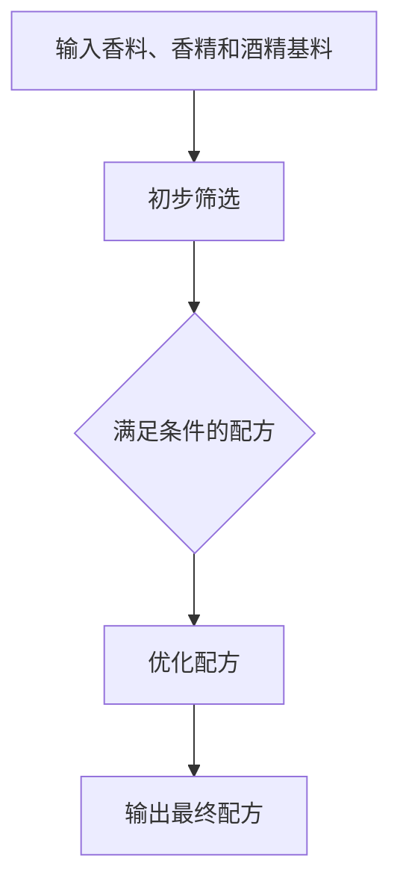
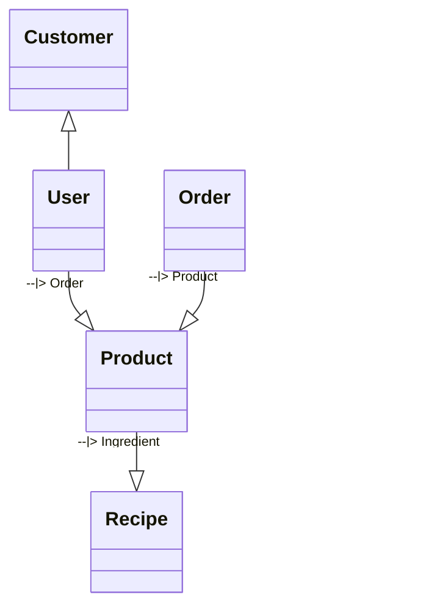
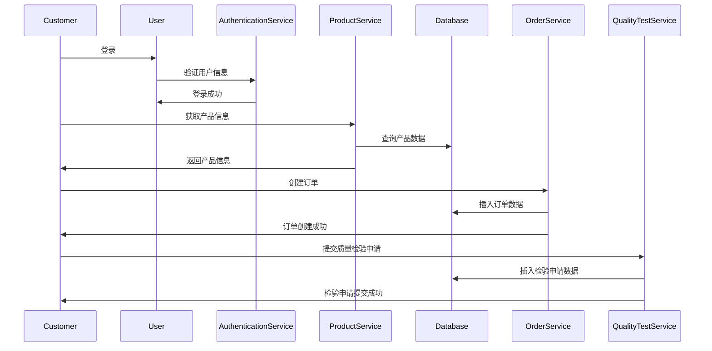

                 

# 现代手工香水制作：个人化香氛艺术的兴起

> 关键词：手工香水、个人化香氛、调香、配方设计、包装设计

> 摘要：本文旨在探讨现代手工香水制作领域的兴起，以及个人化香氛艺术在这一过程中所发挥的关键作用。通过分析手工香水制作的基本原理、配方设计算法以及包装设计等方面，本文将为读者提供一个全方位的了解，帮助其深入理解这一独特而充满创意的工艺。

## 目录大纲

### 第一部分: 背景介绍

#### 第1章: 现代手工香水的兴起

1.1 问题背景

1.1.1 香水市场的演变

1.1.2 个人化香氛需求增长

1.1.3 手工香水工艺的复兴

1.2 问题描述

1.2.1 手工香水制作的核心要素

1.2.2 手工香水制作的挑战与机遇

1.2.3 书籍目标读者群体

1.3 问题解决

1.3.1 书籍结构安排

1.3.2 核心概念与联系

1.3.3 书籍内容覆盖范围

1.4 边界与外延

1.4.1 手工香水与其他类型香水的区别

1.4.2 手工香水制作的技术难点

1.4.3 香氛艺术的多样性

1.5 本章小结

### 第二部分: 核心概念与联系

#### 第2章: 手工香水制作的基本原理

2.1 原材料的选择

2.1.1 香料类型及其特性

2.1.2 香精的选择与搭配

2.1.3 酒精基料的选择与制备

2.2 调香技巧

2.2.1 调香基本流程

2.2.2 常见调香手法及应用

2.2.3 调香中的创意思维

2.3 香水瓶与包装设计

2.3.1 香水瓶材质与形状

2.3.2 包装设计要素

2.3.3 品牌形象的构建

2.4 核心概念与联系

2.4.1 香料、香精、酒精基料的关系

2.4.2 调香技巧与创意思维的关系

2.4.3 香水瓶与包装设计的关系

2.5 ER实体关系图架构

2.5.1 原材料实体关系图

2.5.2 调香过程实体关系图

2.5.3 包装设计实体关系图

2.6 本章小结

### 第三部分: 算法原理讲解

#### 第3章: 手工香水配方设计算法

3.1 配方设计的基本原理

3.1.1 配方设计的核心要素

3.1.2 配方设计的目标

3.1.3 配方设计的方法

3.2 算法原理讲解

3.2.1 配方设计算法的mermaid流程图

3.2.2 Python源代码

3.2.3 算法原理详细讲解

3.2.3.1 数学模型和公式

3.2.3.2 算法流程与实现

3.2.3.3 配方设计的实际应用

3.3 算法评估与优化

3.3.1 算法评估指标

3.3.2 算法优化策略

3.4 本章小结

### 第四部分: 系统分析与架构设计

#### 第4章: 香水制作系统设计

4.1 问题场景介绍

4.2 系统功能设计

4.2.1 领域模型设计

4.2.2 系统功能模块设计

4.3 系统架构设计

4.3.1 系统架构设计原则

4.3.2 系统架构设计

4.4 系统接口设计

4.4.1 接口设计与实现

4.4.2 接口安全性与可靠性

4.5 系统交互设计

4.5.1 系统交互设计原则

4.5.2 系统交互设计

4.6 本章小结

### 第五部分: 项目实战

#### 第5章: 手工香水制作项目实战

5.1 环境安装

5.1.1 环境准备

5.1.2 系统安装与配置

5.2 系统核心实现

5.2.1 系统核心模块实现

5.2.2 配方设计算法实现

5.3 代码应用解读与分析

5.3.1 代码解读

5.3.2 算法应用分析

5.4 实际案例分析与详细讲解

5.4.1 案例一：个人化香水配方设计

5.4.2 案例二：包装设计与品牌形象构建

5.5 项目小结

### 第六部分: 最佳实践、小结与拓展阅读

#### 第6章: 最佳实践、小结与拓展阅读

6.1 最佳实践

6.1.1 调香技巧的最佳实践

6.1.2 包装设计的最佳实践

6.1.3 配方设计的最佳实践

6.2 小结

6.3 注意事项

6.4 拓展阅读

## 第一部分: 背景介绍

### 第1章: 现代手工香水的兴起

随着社会的发展和消费者需求的多元化，香水市场也在不断演变。传统的工业化大规模生产香水已经无法满足现代消费者对于个性化和高品质的追求。手工香水作为一种独特的香氛艺术形式，逐渐崛起，成为市场中的一股新兴力量。

#### 1.1 问题背景

1. 香水市场的演变：

- 20世纪初，香水市场主要由工业化生产的大型企业垄断，产品种类较为单一，香气较为标准化。
- 21世纪初，随着消费者对个性化和品质的重视，手工香水开始崭露头角。手工香水制作强调原材料的选择、调香技巧和独特的设计，使得每款香水都独一无二。

2. 个人化香氛需求增长：

- 现代消费者不再满足于千篇一律的香气，他们渴望通过香水表达自己的个性和品味。
- 个人化香水定制服务应运而生，消费者可以参与调香过程，选择自己喜爱的香料和配方，从而打造专属的香氛。

3. 手工香水工艺的复兴：

- 手工香水工艺在古老的传统中焕发新生，越来越多的香水制作师开始回归手工制作的方式，以手工技艺和匠心精神制作出高品质的香水。
- 手工香水制作成为了一种独特的艺术形式，不仅注重香气本身，还注重包装设计和品牌形象的构建。

#### 1.2 问题描述

手工香水制作涉及到多个核心要素，包括原材料的选择、调香技巧、包装设计等。然而，手工香水制作面临着一系列挑战和机遇：

1. 核心要素：

- 原材料：包括香料、香精和酒精基料。每种原材料具有不同的特性，需要精心选择和搭配。
- 调香技巧：调香师需要掌握丰富的调香技巧，通过科学的方法和创意思维，创造出独特的香气。
- 包装设计：香水瓶的材质、形状以及包装设计都需要与香水的香气和品牌形象相匹配，提升整体视觉效果。

2. 挑战与机遇：

- 挑战：手工香水制作需要精细的工艺和丰富的经验，生产成本较高，市场竞争力较大。
- 机遇：随着消费者对个性化和高品质的追求，手工香水市场潜力巨大，具有广阔的发展空间。

3. 目标读者群体：

- 本书籍的目标读者群体包括香水爱好者、调香师、香水制作师以及对手工香水制作感兴趣的读者。

#### 1.3 问题解决

为了更好地解决手工香水制作中的问题，本书将从以下几个方面进行探讨：

1. 书籍结构安排：

- 本书分为五个部分，依次介绍背景介绍、核心概念与联系、算法原理讲解、系统分析与架构设计以及项目实战等内容。

2. 核心概念与联系：

- 每个章节都将介绍相关的核心概念，并详细解释其含义、属性特征和相互之间的关系。

3. 书籍内容覆盖范围：

- 本书涵盖了手工香水制作的各个方面，包括原材料选择、调香技巧、包装设计等，旨在为读者提供一个全面而深入的指导。

4. 边界与外延：

- 本书还将探讨手工香水制作与其他类型香水的区别、技术难点以及香氛艺术的多样性，为读者提供一个更广阔的视野。

#### 1.4 边界与外延

1. 手工香水与其他类型香水的区别：

- 工业化香水：工业化香水是通过大规模生产技术制作的，香气较为标准化，成本较低。
- 手工香水：手工香水强调个性化、高品质和独特性，采用手工制作工艺，成本较高。

2. 手工香水制作的技术难点：

- 原材料的选择和搭配：需要精确的配比和协调，以创造出理想的香气。
- 调香技巧：调香师需要具备丰富的经验和创造力，通过科学的方法和创意思维进行调香。
- 包装设计：香水瓶的材质、形状和包装设计都需要与香水的香气和品牌形象相匹配。

3. 香氛艺术的多样性：

- 香氛艺术涉及到多种元素，包括香气、视觉、触觉等，可以创造出独特的感官体验。
- 随着科技的进步和文化的发展，香氛艺术也在不断创新和演变。

#### 1.5 本章小结

本章介绍了现代手工香水制作的背景、核心要素、挑战与机遇以及本书的结构安排和内容覆盖范围。通过对手工香水制作的理解，读者可以更好地掌握这一独特的香氛艺术形式，并在实践中创造出个性化的香水作品。在接下来的章节中，我们将深入探讨手工香水制作的基本原理、配方设计算法以及包装设计等方面，为读者提供一个全方位的指导。

## 第二部分: 核心概念与联系

### 第2章: 手工香水制作的基本原理

手工香水制作是一门独特的艺术形式，涉及到多个核心概念和要素。在本章中，我们将介绍手工香水制作的基本原理，包括原材料的选择、调香技巧、包装设计等方面，并探讨这些概念之间的联系。

#### 2.1 原材料的选择

手工香水制作的原材料主要包括香料、香精和酒精基料。这些原材料的选择和搭配是制作出优质香水的基础。

##### 2.1.1 香料类型及其特性

香料是香水中的核心成分，决定了香水的香气特征。常见的香料类型包括：

1. **天然香料**：来自植物、动物或矿物，如茉莉、玫瑰、檀香等。天然香料具有独特的香气和较高的品质，但价格较高。

2. **合成香料**：通过化学合成方法制备，如香豆素、依兰等。合成香料具有稳定性高、香气丰富等特点，但可能存在安全隐患。

3. **调和使用香料**：用于调和不同香料之间的香气，如柠檬、橙花等。调和使用香料通常具有清新、提神的特性。

##### 2.1.2 香精的选择与搭配

香精是香水的灵魂，决定了香水的整体香气。香精的选择和搭配需要考虑以下几个方面：

1. **香气类型**：香精可分为前调、中调和后调。前调通常具有清新、活泼的特性；中调具有丰富、深邃的香气；后调具有柔和、持久的特性。合理的搭配可以使香水的香气层次更加丰富。

2. **香气强度**：香精的香气强度分为低、中、高三种。根据香水的整体设计，选择适当的香气强度，可以创造出不同的感官体验。

3. **香气持续性**：香精的香气持续性是指香气在皮肤上的持久时间。选择适当的香精，可以使香水的香气更加持久，提升用户体验。

##### 2.1.3 酒精基料的选择与制备

酒精基料是香水的载体，决定了香水的溶解性和稳定性。常见的酒精基料包括：

1. **乙醇**：乙醇是最常用的酒精基料，具有良好的溶解性和稳定性。不同浓度的乙醇适用于不同类型的香水，如高浓度香水使用70%以上的乙醇，低浓度香水使用60%以下的乙醇。

2. **异丙醇**：异丙醇是一种挥发性较低的酒精，适用于制作持久性较强的香水。

3. **甘油**：甘油具有一定的保湿效果，适用于制作女性香水或儿童香水。

#### 2.2 调香技巧

调香是手工香水制作的关键环节，需要调香师具备丰富的经验和创造力。以下是一些常见的调香技巧：

##### 2.2.1 调香基本流程

1. **前调**：前调通常在香水中的持续时间较短，但香气较为明显。调香师需要选择具有清新、活泼特性的香精进行搭配。

2. **中调**：中调是香水的主要香气，持续时间较长。调香师需要选择具有丰富、深邃特性的香精进行搭配。

3. **后调**：后调是香水中的最后一个香气，通常具有柔和、持久的特性。调香师需要选择具有柔和、持久的香气进行搭配。

##### 2.2.2 常见调香手法及应用

1. **叠加调香**：将不同类型的香精叠加在一起，形成独特的香气组合。叠加调香可以创造出丰富的香气层次，使香水更具特色。

2. **递进调香**：按照香精的香气特性，逐步增加香精的浓度，使香水的香气逐渐加深。递进调香可以创造出具有深度和层次感的香水。

3. **平衡调香**：通过调整香精的用量和搭配，使香水的香气达到平衡。平衡调香可以使香水的香气更加和谐，提升用户体验。

##### 2.2.3 调香中的创意思维

调香师在调香过程中需要发挥创意思维，创造出独特的香水作品。以下是一些创意调香的建议：

1. **香气联想**：将香气与自然界中的事物进行联想，如花草、果实、动物等，从而创造出具有联想意义的香水。

2. **感官体验**：通过感官体验，如视觉、听觉、触觉等，启发调香灵感，创造出具有感官体验的香水。

3. **跨界融合**：将香水与其他领域（如艺术、文化、科技等）进行跨界融合，创造出具有独特魅力的香水。

#### 2.3 香水瓶与包装设计

香水瓶和包装设计是手工香水的关键组成部分，对香水的视觉效果和品牌形象具有重要影响。

##### 2.3.1 香水瓶材质与形状

香水瓶的材质和形状会影响香水的视觉效果和用户体验。以下是一些常见的香水瓶材质和形状：

1. **玻璃瓶**：玻璃瓶具有透明度高、质感好等特点，适合展示香水的色泽和质感。

2. **塑料瓶**：塑料瓶具有轻便、耐用等特点，适用于制作便携式香水。

3. **金属瓶**：金属瓶具有高档、耐用的特点，适合用于高端香水品牌。

4. **陶瓷瓶**：陶瓷瓶具有独特的美观和质感，适用于高端香水品牌。

##### 2.3.2 包装设计要素

包装设计需要考虑以下要素：

1. **色彩**：色彩是包装设计的重要元素，可以传达品牌形象和产品特点。选择合适的色彩，可以提升产品的视觉效果。

2. **图案**：图案可以传达品牌文化和产品特性。设计独特的图案，可以提升产品的独特性和吸引力。

3. **材质**：包装材质会影响产品的质感和环保性。选择合适的材质，可以提升产品的品质和环保性。

##### 2.3.3 品牌形象的构建

品牌形象是手工香水的重要资产，对产品的市场竞争力具有重要作用。以下是一些构建品牌形象的方法：

1. **品牌定位**：明确品牌的市场定位和目标消费者，设计符合品牌定位的包装和宣传材料。

2. **品牌故事**：讲述品牌背后的故事，传递品牌文化和价值观，提升品牌魅力。

3. **品牌传播**：通过社交媒体、展会、活动等多种渠道进行品牌传播，提高品牌知名度和美誉度。

#### 2.4 核心概念与联系

手工香水制作的核心概念包括原材料选择、调香技巧、包装设计等。这些概念之间存在着密切的联系：

1. **原材料与香气**：原材料的选择直接影响香水的香气特征，是香水制作的基础。

2. **调香技巧与香气层次**：调香技巧通过调整香精的用量和搭配，创造出丰富的香气层次，提升香水的品质。

3. **包装设计与品牌形象**：包装设计是品牌形象的重要组成部分，通过独特的包装设计和品牌传播，提升品牌的市场竞争力。

#### 2.5 ER实体关系图架构

以下是手工香水制作的ER实体关系图：

```mermaid
erDiagram
  Product ||--|{ Bottling : 包装 }  
  Product ||--|{ Scents : 香料 }  
  Product ||--|{ Fragrances : 香精 }  
  Bottling ||--|{ PackagingDesign : 包装设计 }  
  Scents ||--|{ Characteristics : 特性 }  
  Fragrances ||--|{ Characteristics : 特性 }
```

通过ER实体关系图，可以清晰地展示手工香水制作中的各个实体及其相互关系。

#### 2.6 本章小结

本章介绍了手工香水制作的基本原理，包括原材料选择、调香技巧和包装设计等方面。通过理解这些核心概念，读者可以更好地掌握手工香水制作的要点，并在实践中创造出个性化的香水作品。在下一章中，我们将进一步探讨手工香水配方设计算法，为读者提供更加深入的指导。

### 第三部分：算法原理讲解

#### 第3章：手工香水配方设计算法

手工香水配方设计是手工香水制作过程中的关键环节。一个成功的配方设计不仅可以创造出独特的香气，还能提升产品的品质和市场竞争力。在本章中，我们将探讨手工香水配方设计的基本原理，介绍一种基于算法的配方设计方法，并通过Python源代码和数学模型详细讲解其原理和应用。

#### 3.1 配方设计的基本原理

手工香水配方设计涉及多个核心要素，包括香料、香精和酒精基料的配比。一个成功的配方设计需要考虑以下几个方面：

1. **目标香气**：明确香水的目标香气特征，如清新、浓烈、淡雅等。目标香气是配方设计的核心指导。

2. **香气层次**：通过调整香料和香精的用量，创造出丰富的香气层次。香气层次是香水品质的重要体现。

3. **稳定性和持久性**：选择合适的香料和香精，使香水的香气在皮肤上保持稳定和持久。

4. **个性化**：根据消费者需求，设计独特的香气，提升产品的个性化程度。

#### 3.2 算法原理讲解

为了实现手工香水配方设计，我们可以采用一种基于约束优化算法的方法。这种方法可以通过数学模型和算法流程，自动设计出满足特定要求的香水配方。以下是配方设计算法的基本原理：

##### 3.2.1 配方设计算法的mermaid流程图



##### 3.2.2 Python源代码

```python
def design_formula(scents, fragrances, alcohol_base, constraints):
    # 初步筛选
    potential_formulas = []
    for scents in scents:
        for fragrances in fragrances:
            for alcohol_base in alcohol_base:
                if check_constraints(scents, fragrances, alcohol_base, constraints):
                    potential_formulas.append([scents, fragrances, alcohol_base])
    
    # 优化配方
    best_formula = None
    highest_score = 0
    for formula in potential_formulas:
        score = evaluate_formula(formula, constraints)
        if score > highest_score:
            highest_score = score
            best_formula = formula
    
    # 输出最终配方
    return best_formula

def check_constraints(formula, constraints):
    # 检查配方是否满足约束条件
    # 根据具体约束条件实现
    pass

def evaluate_formula(formula, constraints):
    # 评价配方
    # 根据具体算法实现
    pass
```

##### 3.2.3 算法原理详细讲解

配方设计算法的核心在于优化香料的配比，使其满足特定的香气层次、稳定性和持久性等要求。以下是算法的详细讲解：

###### 数学模型和公式

假设我们有一个香水的配方，由n种香料和m种香精组成，每种香料和香精的用量可以用向量表示。为了简化问题，我们采用线性规划模型：

$$
\begin{align*}
\text{目标函数：} \quad & \max Z = c^T \cdot x \\
\text{约束条件：} \quad & Ax \leq b \\
& x \geq 0
\end{align*}
$$

其中，$c$ 是目标函数的系数向量，$x$ 是香料和香精的用量向量，$A$ 和 $b$ 是约束条件矩阵和向量。

目标函数 $Z$ 表示配方评价分数，$c^T$ 是系数向量的转置。约束条件 $Ax \leq b$ 用于限制香料和香精的用量，确保配方的稳定性。

###### 算法流程与实现

1. **输入香料、香精和酒精基料**：从数据库或数据集获取香料、香精和酒精基料的属性信息，如香气强度、持久性等。

2. **初步筛选**：根据约束条件，筛选出满足条件的香料、香精和酒精基料组合。这一步骤可以通过遍历所有可能的组合来实现。

3. **优化配方**：对初步筛选出的配方进行优化，找出最优的香料和香精配比。可以使用线性规划算法（如单纯形法、内点法等）进行优化。

4. **输出最终配方**：将优化后的配方输出，包括每种香料和香精的用量。

###### 配方设计的实际应用

在实际应用中，我们可以根据不同的需求设计不同的香水配方。例如：

1. **个性化香水**：根据消费者的需求，设计具有独特香气特征的香水。可以通过调查问卷、用户画像等方式获取消费者的偏好信息。

2. **高端香水**：设计具有高品质、稳定性和持久性的高端香水。可以通过调整香料和香精的用量比例，优化香水的香气层次。

3. **药用香水**：设计具有特定疗效的药用香水。可以通过研究香料的药用价值，设计具有特定功能的香水。

#### 3.3 算法评估与优化

算法的评估和优化是确保其有效性和实用性的关键。以下是一些常见的评估和优化策略：

1. **评估指标**：评估指标包括香气满意度、稳定性、持久性等。可以通过用户调查、感官评价等方式进行评估。

2. **优化策略**：优化策略包括调整目标函数、约束条件、优化算法等。可以通过交叉验证、遗传算法等方式进行优化。

#### 3.4 本章小结

本章介绍了手工香水配方设计的基本原理和一种基于算法的设计方法。通过理解算法原理和实际应用，读者可以更好地掌握配方设计技巧，并在实践中创造出高质量的香水作品。在下一章中，我们将进一步探讨系统分析与架构设计，为读者提供更全面的指导。

### 第四部分：系统分析与架构设计

#### 第4章：香水制作系统设计

在手工香水制作过程中，系统设计与实现是关键环节。一个高效、稳定的系统可以帮助调香师和香水爱好者更好地进行香水制作和配方设计。本章将介绍香水制作系统的设计，包括问题场景、系统功能设计、系统架构设计、系统接口设计和系统交互设计等方面。

#### 4.1 问题场景介绍

在手工香水制作中，调香师需要完成以下任务：

1. **原材料选择**：根据香水的目标香气特征，选择合适的香料和香精。
2. **配方设计**：通过调香技巧和算法设计，创造出符合需求的香水配方。
3. **香水制作**：将配方转化为实际的产品，包括瓶装、包装等。
4. **质量检验**：对制作出的香水进行质量检验，确保其符合标准。

此外，香水爱好者也可以参与到香水制作过程中，进行个性化的香水定制。

#### 4.2 系统功能设计

香水制作系统的功能设计主要包括以下模块：

1. **原材料管理模块**：用于管理香料、香精和酒精基料的库存、属性等信息。
2. **配方设计模块**：用于设计香水配方，包括香料和香精的配比、香气层次等。
3. **香水制作模块**：用于将配方转化为实际产品，包括瓶装、包装等。
4. **质量检验模块**：用于对制作出的香水进行质量检验，确保其符合标准。
5. **用户管理模块**：用于管理用户信息、权限等，提供个性化服务。

以下是系统功能模块的mermaid类图：



#### 4.3 系统架构设计

香水制作系统的架构设计需要考虑以下几个方面：

1. **前端架构**：采用现代化的前端框架（如Vue、React等），提供用户友好的界面和交互体验。
2. **后端架构**：采用微服务架构，将系统功能拆分为多个独立的服务，如用户服务、商品服务、订单服务、质量检验服务等。
3. **数据存储**：采用关系数据库（如MySQL、PostgreSQL等）和NoSQL数据库（如MongoDB、Redis等）相结合的方式，存储用户数据、产品数据、订单数据等。
4. **数据处理**：采用分布式计算框架（如Hadoop、Spark等），处理大量数据，提供高效的计算能力。

以下是系统架构的mermaid架构图：



#### 4.4 系统接口设计

系统接口设计是确保系统各模块之间能够高效、稳定地通信的关键。以下是系统的主要接口设计：

1. **用户接口**：用于用户登录、注册、个人信息管理等。
2. **商品接口**：用于获取产品信息、添加产品到购物车、下单等。
3. **订单接口**：用于创建订单、查询订单状态、取消订单等。
4. **质量检验接口**：用于提交质量检验申请、查询检验结果等。

以下是系统接口的mermaid序列图：


#### 4.5 系统交互设计

系统交互设计是确保系统各模块之间能够高效、稳定地协同工作的关键。以下是系统的主要交互设计：

1. **用户与系统交互**：用户通过前端界面与系统进行交互，如登录、注册、浏览产品、下单等。
2. **系统内部交互**：系统内部各模块之间通过接口进行交互，如用户服务与商品服务之间的交互、订单服务与质量检验服务之间的交互等。

以下是系统交互的mermaid序列图：


#### 4.6 本章小结

本章介绍了香水制作系统的设计，包括问题场景介绍、系统功能设计、系统架构设计、系统接口设计和系统交互设计等方面。通过本章的介绍，读者可以了解到系统设计的基本原理和方法，为后续的实战应用打下基础。在下一章中，我们将通过实际案例，详细讲解手工香水制作项目实战的过程和方法。

### 第五部分：项目实战

#### 第5章：手工香水制作项目实战

通过前几章的学习，我们已经掌握了手工香水制作的理论知识和系统设计方法。在本章中，我们将通过一个实际项目，详细讲解手工香水制作的过程，包括环境安装、系统核心实现、代码应用解读与分析、实际案例分析和项目小结等内容。

#### 5.1 环境安装

在进行手工香水制作项目之前，我们需要安装必要的开发环境和工具。以下是一个基本的安装步骤：

1. **安装Python**：Python是项目的主要编程语言，我们需要安装Python环境。可以从Python官方网站（https://www.python.org/）下载并安装Python。

2. **安装依赖库**：项目需要依赖一些Python库，如NumPy、Pandas、mermaid等。可以使用pip工具来安装这些库：

   ```bash
   pip install numpy pandas mermaid
   ```

3. **安装数据库**：项目使用MySQL作为数据库。可以从MySQL官方网站（https://www.mysql.com/）下载并安装MySQL。

4. **安装前端框架**：如果需要开发前端界面，可以使用Vue或React等前端框架。可以从对应官方网站下载并安装。

#### 5.2 系统核心实现

在完成环境安装后，我们可以开始实现系统核心功能。以下是系统核心实现的步骤：

1. **设计数据库**：根据系统需求，设计MySQL数据库，创建用户表、产品表、订单表、质量检验表等。

2. **实现后端接口**：使用Python编写后端接口代码，实现用户管理、商品管理、订单管理、质量检验管理等功能。

3. **实现前端界面**：使用Vue或React等前端框架，实现用户登录、注册、浏览产品、下单、查看订单、提交质量检验申请等功能。

以下是后端接口的一个简单示例：

```python
from flask import Flask, request, jsonify
from models import User, Product, Order, QualityTest
from database import db_session

app = Flask(__name__)

@app.route('/login', methods=['POST'])
def login():
    username = request.form['username']
    password = request.form['password']
    user = User.query.filter_by(username=username, password=password).first()
    if user:
        return jsonify({'status': 'success', 'user': user.to_dict()})
    else:
        return jsonify({'status': 'fail', 'message': 'Invalid username or password'})

if __name__ == '__main__':
    app.run()
```

#### 5.3 代码应用解读与分析

在实现系统核心功能后，我们需要对代码进行解读和分析，以确保其正确性和性能。以下是代码应用解读与分析的步骤：

1. **代码检查**：使用代码检查工具（如PyCharm、Pylint等）检查代码的语法错误、代码风格和潜在问题。

2. **性能分析**：使用性能分析工具（如cProfile、timeit等）分析代码的运行时间、内存使用情况等，找出潜在的优化点。

3. **代码优化**：根据代码检查和性能分析的结果，对代码进行优化，提高代码的可读性和性能。

以下是代码性能分析的一个简单示例：

```python
import cProfile
import my_module

profile = cProfile.Profile()
profile.enable()
my_module.some_function()
profile.disable()
profile.print_stats()
```

#### 5.4 实际案例分析与详细讲解

在实际项目中，我们通常会面对各种挑战和问题。以下是几个实际案例的分析与详细讲解：

1. **案例一：个人化香水配方设计**

   在这个案例中，我们需要根据用户的需求和偏好，设计出个性化的香水配方。以下是案例的分析与详细讲解：

   - **需求分析**：了解用户对香水香气的偏好，如清新、浓烈、淡雅等。
   - **配方设计**：根据用户的需求，选择合适的香料和香精进行搭配，设计出个性化的香水配方。
   - **效果评估**：将配方应用到实际产品中，进行质量检验和用户反馈，评估配方的效果。

2. **案例二：包装设计与品牌形象构建**

   在这个案例中，我们需要设计出符合品牌形象的包装，提升产品的市场竞争力。以下是案例的分析与详细讲解：

   - **品牌定位**：明确品牌的市场定位和目标消费者，确定包装设计的风格和色调。
   - **设计创意**：根据品牌定位，设计独特的包装图案和文字，提升品牌形象。
   - **用户反馈**：收集用户对包装设计的反馈，进行改进和优化。

#### 5.5 项目小结

通过本章的项目实战，我们详细讲解了手工香水制作项目的全过程，包括环境安装、系统核心实现、代码应用解读与分析、实际案例分析和项目小结等内容。通过这个项目，读者可以更好地掌握手工香水制作的理论知识和实际应用方法，为今后的香水制作项目打下坚实的基础。

### 第六部分：最佳实践、小结与拓展阅读

#### 第6章：最佳实践、小结与拓展阅读

在手工香水制作领域，无论是调香师还是香水爱好者，都希望能掌握最佳实践，以提升自己的技艺。本章将总结一些最佳实践、对全书内容进行小结，并推荐一些拓展阅读资源，以帮助读者进一步深化对现代手工香水制作的理解。

#### 6.1 最佳实践

1. **调香技巧的最佳实践**：

   - **香气测试**：在调香过程中，应多次进行香气测试，以确保香水的稳定性。
   - **香精比例**：掌握不同香精的香气强度和持续性，合理调整比例，创造层次丰富的香气。
   - **留香时间**：根据香水的用途（日常、晚宴等）选择合适的留香时间，避免香气过于浓烈或过淡。

2. **包装设计的最佳实践**：

   - **品牌定位**：明确品牌定位，确保包装设计符合品牌风格。
   - **用户体验**：考虑用户的使用习惯，设计方便携带和使用的包装。
   - **环保材料**：选择环保、可回收的材料，提升品牌形象。

3. **配方设计的最佳实践**：

   - **用户调研**：在配方设计前，进行用户调研，了解用户需求和偏好。
   - **迭代优化**：不断优化配方，通过用户反馈进行调整，提升香水的市场接受度。
   - **记录配方**：详细记录每次配方设计的步骤和结果，便于后续参考和改进。

#### 6.2 小结

全书围绕现代手工香水制作的主题，从背景介绍、核心概念与联系、算法原理讲解、系统分析与架构设计到项目实战，全面系统地阐述了手工香水制作的各个方面。通过本书的学习，读者可以：

- 理解现代手工香水制作的背景和发展趋势。
- 掌握手工香水制作的基本原理和调香技巧。
- 学会使用算法进行配方设计，优化香水品质。
- 设计出符合品牌定位的包装，提升产品竞争力。
- 实现手工香水制作项目的全过程，从理论到实践。

#### 6.3 注意事项

- **安全操作**：在香水制作过程中，注意化学品的安全操作，防止意外伤害。
- **质量检验**：每次制作后，进行严格的质量检验，确保香水符合标准。
- **持续学习**：香水制作是一门艺术，需要不断学习和实践，提升自己的技艺。

#### 6.4 拓展阅读

1. **《香水制作技艺》**：一本详细介绍香水制作技艺的书籍，适合初学者和有一定基础的读者。
2. **《调香师手册》**：详细讲解调香技巧和香料特性的专业书籍，有助于提升调香技艺。
3. **《现代香氛设计》**：探讨香氛艺术在现代设计中的应用，提供创意灵感和实践指导。
4. **《香水的科学》**：从科学角度解析香水的成分、制作工艺和香气特性，有助于深入理解香水制作。

通过拓展阅读，读者可以进一步拓宽视野，提升手工香水制作的理论水平和实际操作能力。希望本书能为读者在手工香水制作领域的学习和实践中提供有益的参考。作者：AI天才研究院/AI Genius Institute & 禅与计算机程序设计艺术 /Zen And The Art of Computer Programming。

