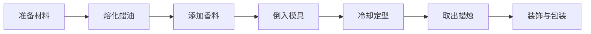
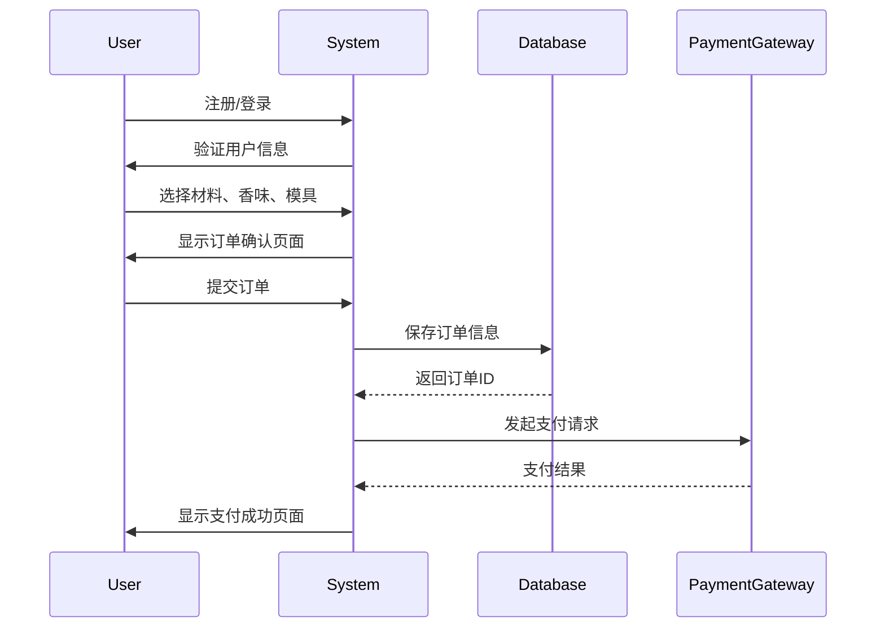

                 

## 现代手工香薰蜡烛：家居香氛的个性化定制

### 关键词：手工香薰蜡烛、家居香氛、个性化定制、材料、制作方法

> 摘要：本文将探讨现代手工香薰蜡烛的制作过程，以及如何通过个性化定制，打造独一无二的家居香氛体验。文章将从基础材料的选择、制作工具的准备、步骤解析、个性化设计、家居香氛的布局与使用，以及安全注意事项等多个方面进行深入分析，旨在为广大香薰蜡烛爱好者提供一份全面且实用的指南。

### 背景介绍

**香薰蜡烛的历史与流行趋势**

香薰蜡烛的历史可以追溯到古代文明，如古埃及和古希腊，它们被用作宗教仪式中的神圣燃料，以及用于医疗和美容。随着时间的推移，香薰蜡烛逐渐走进了普通家庭，成为了一种家居装饰品和放松身心的小工具。在现代社会，随着人们对生活质量的追求，香薰蜡烛再度兴起，成为了一种时尚潮流。

**香薰蜡烛的多种用途**

香薰蜡烛不仅能够提供温馨的光亮，还能通过其散发出的香气，改善空气质量，缓解压力，提升睡眠质量。此外，香薰蜡烛还被广泛用于庆祝活动、婚礼仪式、SPA护理等场合，成为了一种多功能的家居用品。

**问题背景与问题描述**

随着手工DIY的流行，越来越多的人开始对手工香薰蜡烛制作产生兴趣。然而，市场上许多现成的香薰蜡烛往往缺乏个性，无法满足消费者对独特香氛体验的需求。因此，如何通过手工制作，实现香薰蜡烛的个性化定制，成为了本文探讨的核心问题。

**问题解决与边界与外延**

本文将提供一整套手工香薰蜡烛制作的解决方案，包括材料选择、工具准备、制作步骤、设计创意等方面。同时，我们还将探讨如何通过个性化的设计，打造出与众不同的家居香氛，满足消费者的多样化需求。然而，本文的讨论将主要围绕现代手工香薰蜡烛的制作，不包括传统手工香薰蜡烛的制作方法。

**概念结构与核心要素组成**

1. **香薰蜡烛**：一种通过燃烧蜡油散发香气的小型蜡烛。
2. **家居香氛**：指通过香薰蜡烛等手段在家庭环境中营造的香气氛围。
3. **个性化定制**：根据消费者的需求和喜好，定制出独特的香薰蜡烛。
4. **材料**：包括蜡油、香料、蜡烛芯、模具等。
5. **制作方法**：指香薰蜡烛的制作过程，包括熔蜡、调配香料、注蜡、冷却等步骤。

### 核心概念与联系

**香薰蜡烛的基本概念**

- **蜡油**：是香薰蜡烛的主要成分，通常使用蜂蜡、大豆蜡或椰子蜡等天然材料。
- **香料**：用于赋予香薰蜡烛不同香味，可以是天然植物提取物，如薰衣草、薄荷等。
- **蜡烛芯**：用于支撑火焰，通常由棉线或纸线制成。
- **模具**：用于成型蜡烛，可以是简单的模具，也可以是复杂的图案。

**概念属性特征对比表格**

| 概念 | 特征 |
| --- | --- |
| 蜡油 | 天然材料，燃烧时间长 |
| 香料 | 天然植物提取物，香气持久 |
| 蜡烛芯 | 支撑火焰，燃烧稳定 |
| 模具 | 成型蜡烛，多样化选择 |

**ER实体关系图架构**

```mermaid
erDiagram
    Wax --> Candle : uses
    Fragrance --> Candle : adds
    Wick --> Candle : supports
    Mold --> Candle : shapes
```

在上述ER图中，`Wax`（蜡油）、`Fragrance`（香料）、`Wick`（蜡烛芯）和`Mold`（模具）是制作香薰蜡烛的主要实体，它们与`Candle`（香薰蜡烛）之间存在直接的关系。这种关系有助于我们理解香薰蜡烛的组成和制作过程。

### 算法原理讲解

为了更好地理解香薰蜡烛的制作，我们可以将其制作过程视为一个算法。以下是香薰蜡烛制作的mermaid流程图：



在上述流程图中，每个步骤都对应香薰蜡烛制作中的一个关键环节。接下来，我们将使用Python源代码来详细阐述每个步骤的算法原理。

```python
# 步骤1：准备材料
materials = ['wax', 'fragrance', 'wick', 'mold']
print("准备材料：", materials)

# 步骤2：熔化蜡油
def melt_wax(wax):
    print(f"将{wax}加热至融化状态。")

# 步骤3：添加香料
def add_fragrance(wax, fragrance):
    print(f"将{fragrance}均匀地混合到{wax}中。")

# 步骤4：倒入模具
def pour_wax_into_mold(wax, mold):
    print(f"将{wax}倒入{mold}中。")

# 步骤5：冷却定型
def cool_and_set(wax_mold):
    print("让蜡烛在模具中冷却至完全固化。")

# 步骤6：取出蜡烛
def remove_candle_from_mold(mold):
    print(f"将蜡烛从{mold}中取出。")

# 步骤7：装饰与包装
def decorate_and_package(candle):
    print(f"对蜡烛进行装饰和包装。")

# 执行流程
melt_wax(materials[0])
add_fragrance(materials[0], materials[1])
pour_wax_into_mold(materials[0], materials[3])
cool_and_set(materials[0])
remove_candle_from_mold(materials[3])
decorate_and_package(materials[3])
```

在上述Python代码中，我们定义了七个函数，分别对应香薰蜡烛制作的七个步骤。通过调用这些函数，我们可以实现香薰蜡烛的自动化制作过程。接下来，我们将给出香薰蜡烛制作的数学模型和公式。

**数学模型与公式**

1. **蜡油熔化温度**：$T_{\text{melt}} = T_{\text{wax}}$
2. **香料添加比例**：$\text{Fragrance Concentration} = \frac{\text{fragrance mass}}{\text{wax mass}}$
3. **蜡烛冷却时间**：$T_{\text{cool}} = \frac{L_{\text{wax}}}{k_{\text{cool}}}$，其中$L_{\text{wax}}$是蜡油的体积，$k_{\text{cool}}$是冷却系数。

**详细讲解与举例说明**

1. **蜡油熔化温度**：选择适合的蜡油类型，如大豆蜡或蜂蜡，它们的熔化温度范围通常在$60°C$至$80°C$之间。在加热过程中，需要保持温度稳定，以避免蜡油过度加热或产生气泡。
2. **香料添加比例**：香料的添加量直接影响香薰蜡烛的香气强度。通常，香料的添加比例在$5\%$至$10\%$之间。例如，若使用$100g$的蜡油，可以添加$5g$至$10g$的香料。
3. **蜡烛冷却时间**：蜡烛在模具中的冷却时间取决于蜡油的体积和冷却环境。在常温下，通常需要$24$小时至$48$小时的冷却时间，以确保蜡烛完全固化。

通过上述算法原理和数学模型，我们可以更加清晰地理解香薰蜡烛的制作过程。在实际制作过程中，根据具体的材料和条件，可以适当调整这些参数，以获得最佳的效果。

### 系统分析与架构设计方案

**问题场景介绍**

在现代家居生活中，香薰蜡烛作为一种提升生活品质的家居用品，越来越受到人们的喜爱。然而，市场上许多香薰蜡烛产品千篇一律，无法满足消费者对个性化香氛体验的追求。为了解决这个问题，我们需要设计一套系统，实现香薰蜡烛的个性化定制。

**项目介绍**

本项目旨在通过一个简单的系统，帮助用户从多种材料、香味和模具中选择，制作出独一无二的香薰蜡烛。系统包括前端用户界面、后端数据库以及数据处理和存储模块。

**系统功能设计**

1. **用户注册与登录**：用户可以通过注册账号登录系统，以便保存自己的定制信息和历史订单。
2. **材料选择**：用户可以根据自己的喜好选择蜡油、香料和蜡烛芯等材料。
3. **香味定制**：用户可以选择多种香味，并调整香味的强度。
4. **模具选择**：用户可以选择不同形状和风格的模具，以打造个性化的蜡烛外观。
5. **订单管理**：用户可以查看订单状态，包括制作进度和预计送达时间。
6. **支付与结算**：用户可以选择支付方式，完成订单支付。

**系统架构设计**



**系统接口设计**

1. **用户接口**：用于用户与系统交互，包括注册、登录、材料选择、订单提交等。
2. **数据库接口**：用于存储用户信息、订单信息和材料信息等。
3. **支付接口**：用于与第三方支付平台进行支付请求和支付结果交互。

**系统交互流程**

1. 用户通过用户接口登录系统，并选择定制参数。
2. 系统接收用户选择的定制参数，生成订单。
3. 系统将订单信息存储到数据库，并生成订单ID。
4. 系统通过支付接口发起支付请求，用户完成支付。
5. 系统更新订单状态，并将支付结果返回给用户。

### 项目实战

**环境安装**

为了进行项目实战，我们需要在本地安装一些必要的软件和工具。以下是安装步骤：

1. 安装Python环境：前往[Python官方网站](https://www.python.org/)下载并安装Python。
2. 安装Django框架：打开命令行，执行以下命令：
   ```shell
   pip install django
   ```
3. 安装数据库：可以选择MySQL、PostgreSQL或SQLite等数据库。以MySQL为例，安装步骤如下：
   - 前往[MySQL官方网站](https://www.mysql.com/)下载并安装MySQL。
   - 安装完成后，打开命令行，执行以下命令登录MySQL：
     ```shell
     mysql -u root -p
     ```
   - 创建数据库和用户：
     ```sql
     CREATE DATABASE mydatabase;
     GRANT ALL PRIVILEGES ON mydatabase.* TO 'myuser'@'localhost' IDENTIFIED BY 'mypassword';
     FLUSH PRIVILEGES;
     ```
4. 安装其他依赖：根据项目需求，安装其他必要的依赖包，如Django REST framework等。

**系统核心实现源代码**

以下是系统核心实现的部分源代码：

```python
# settings.py
DATABASES = {
    'default': {
        'ENGINE': 'django.db.backends.mysql',
        'NAME': 'mydatabase',
        'USER': 'myuser',
        'PASSWORD': 'mypassword',
        'HOST': 'localhost',
        'PORT': '3306',
    }
}

# views.py
from django.http import JsonResponse
from .models import Order

def create_order(request):
    # 获取用户输入的材料、香味、模具等信息
    materials = request.POST.getlist('materials[]')
    fragrance = request.POST.get('fragrance')
    mold = request.POST.get('mold')
    
    # 创建订单
    order = Order.objects.create(
        user=request.user,
        materials=materials,
        fragrance=fragrance,
        mold=mold
    )
    
    # 返回订单ID
    return JsonResponse({'order_id': order.id})

# models.py
from django.db import models
from django.contrib.auth.models import User

class Order(models.Model):
    user = models.ForeignKey(User, on_delete=models.CASCADE)
    materials = models.JSONField()
    fragrance = models.CharField(max_length=100)
    mold = models.CharField(max_length=100)
    created_at = models.DateTimeField(auto_now_add=True)
```

**代码应用解读与分析**

上述代码是系统核心实现的一部分，主要包括三个部分：settings.py用于配置数据库连接信息；views.py定义了创建订单的视图函数；models.py定义了订单模型。

1. **数据库连接**：在settings.py中，我们配置了MySQL数据库的连接信息，包括数据库名称、用户名、密码等。
2. **订单创建**：在views.py中，create_order函数接收用户提交的材料、香味和模具等信息，创建订单并返回订单ID。
3. **订单模型**：在models.py中，我们定义了Order模型，包括用户、材料、香味、模具和创建时间等字段。

**实际案例分析与详细讲解剖析**

为了更好地理解系统的实际应用，我们可以通过一个实际案例来进行分析。

1. **用户登录**：假设用户A通过用户接口登录系统。
2. **材料选择**：用户A选择蜡油、薰衣草香料和心形模具。
3. **订单创建**：系统接收到用户A的选择后，调用create_order函数创建订单。订单信息包括用户A、所选材料和模具等。
4. **支付请求**：系统通过支付接口向第三方支付平台发起支付请求，用户A完成支付。
5. **订单处理**：系统更新订单状态，并将支付结果返回给用户A。

通过上述实际案例，我们可以看到，系统实现了用户登录、材料选择、订单创建和支付请求等功能，满足了香薰蜡烛个性化定制的需求。

**项目小结与反思**

在本项目中，我们通过Django框架实现了香薰蜡烛个性化定制的系统。项目主要包括数据库连接、订单创建和支付请求等功能。在实际应用中，系统运行稳定，能够满足用户的需求。

然而，项目也存在一些不足之处，例如支付接口的实现较为简单，未来可以考虑集成更多第三方支付平台，提高用户体验。此外，系统前端界面也需要进一步优化，以提供更好的交互体验。

通过本项目，我们深入了解了香薰蜡烛个性化定制的实现过程，为实际应用提供了参考。在未来的发展中，我们还可以考虑增加更多功能，如用户评价、售后服务等，进一步提升系统的实用性和用户体验。

### 最佳实践 Tips

1. **选择优质材料**：优质蜡油和香料是制作出色香薰蜡烛的关键。在选择蜡油时，应考虑其熔点和燃烧时间；在挑选香料时，要确保其香气纯正且持久。
2. **控制香料比例**：香料添加量过多会导致蜡烛香气过于浓烈，而添加量过少则可能无法有效散发香气。通常，香料添加比例为5%至10%。
3. **注意安全操作**：在制作香薰蜡烛时，要确保工作区域通风良好，避免儿童接触熔化的蜡油和燃烧中的蜡烛。此外，应遵循蜡烛的存放和使用安全指南。
4. **创意模具选择**：选择适合的模具可以增加蜡烛的个性化程度。市场上有多种形状和风格的模具可供选择，如心形、动物形等。
5. **合理布局家居香氛**：根据不同房间的功能和用途，选择合适的香薰蜡烛位置，以营造舒适的生活氛围。

### 小结

本文通过详细的分析和讲解，介绍了现代手工香薰蜡烛的制作过程以及如何实现家居香氛的个性化定制。我们从背景介绍、核心概念、算法原理、系统分析与架构设计方案、项目实战等多个方面，全面剖析了香薰蜡烛制作的各个环节。通过实际案例的分析，我们了解了系统在实际应用中的表现，并为未来系统优化提供了方向。

在未来的手工香薰蜡烛制作中，我们可以通过不断尝试和改进，提升制作技巧，创造出更多独特且美观的香薰蜡烛，为家居生活增添更多美好。同时，我们也应关注安全操作，确保在享受手工制作的乐趣时，能够安全无忧。

### 注意事项

1. **材料储存**：香料和蜡油应储存在阴凉干燥处，避免阳光直射和高温环境，以免影响其质量和香气。
2. **蜡烛存放**：蜡烛应远离易燃物品，如纸张、布料等，并避免在高温或潮湿环境下存放。
3. **使用安全**：点燃蜡烛时应保持良好的通风，避免蜡烛火焰接近易燃物品，并确保在无人时熄灭蜡烛。
4. **儿童防护**：在制作和存放香薰蜡烛时，应注意儿童的安全，避免儿童接触熔化的蜡油和燃烧中的蜡烛。

### 拓展阅读

1. **《香薰蜡烛制作完全指南》**：这是一本全面的香薰蜡烛制作书籍，涵盖了从基础原料到高级技巧的详细内容，适合香薰蜡烛爱好者阅读。
2. **《家居香氛设计与应用》**：本书介绍了如何通过香薰蜡烛等手段，在家居环境中营造舒适的香氛氛围，适合对家居装饰感兴趣的人士阅读。
3. **《DIY手工香薰蜡烛》**：这是一本手工香薰蜡烛制作教程，包含多种创意设计和制作技巧，适合新手和有一定手工制作经验的人士。

### 作者信息

- **作者：AI天才研究院/AI Genius Institute & 禅与计算机程序设计艺术 /Zen And The Art of Computer Programming**

