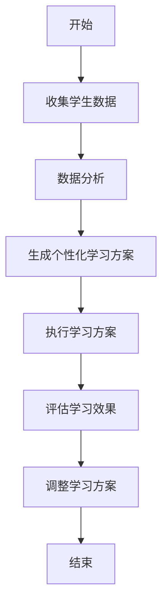
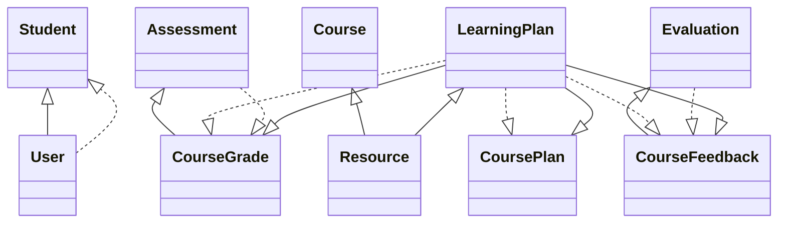
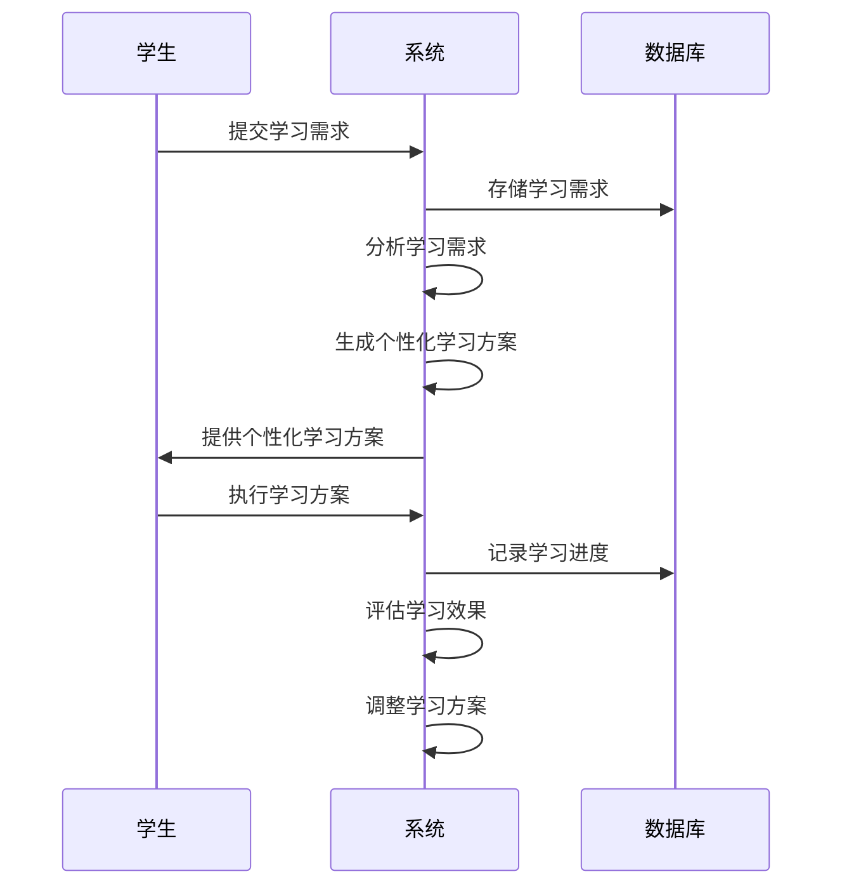
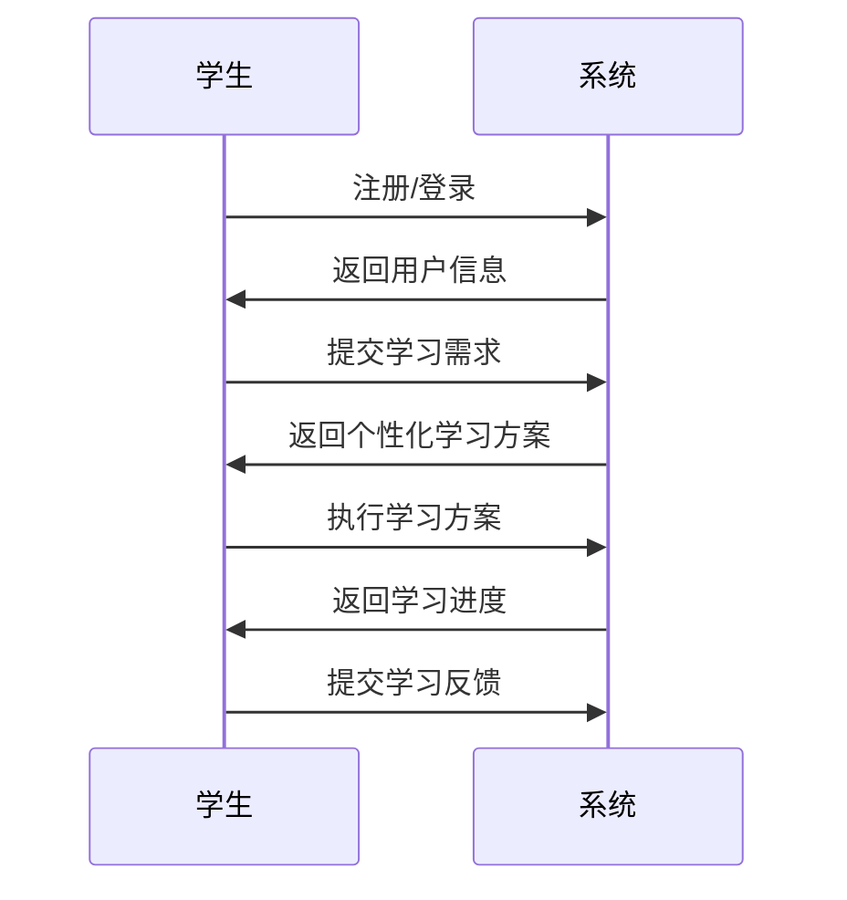

                 

## 现代教育的目标重塑：培养全面发展的世界公民

### 关键词：现代教育、目标重塑、全面发展、世界公民、教育改革

#### 摘要：

在全球化与信息化的时代背景下，现代教育的目标正面临重塑。本文将探讨现代教育的现状与挑战，分析全球化对教育变革的影响，探讨全面发展教育的概念和目标，探讨培养世界公民的路径与策略，并结合案例分析教育改革与实践，最后展望未来教育的发展方向。通过这一系列的思考与分析，本文旨在为现代教育的目标重塑提供有价值的见解和建议。

### 引言：现代教育的变革与挑战

现代教育正经历着前所未有的变革。随着全球化进程的加速，信息技术的发展，教育领域也面临着一系列的挑战。现代教育的目标不再是仅仅传授知识，培养技能，更重要的是要培养学生的综合素质，培养具有全球视野的世界公民。

然而，现代教育在实际操作中却面临着诸多挑战。首先，教育资源的分配不均，城乡之间、地区之间、学校之间的教育资源差距较大。其次，教育模式的单一，过于注重应试教育，忽视了学生的个性发展和综合素质培养。再次，教师队伍的专业素质有待提高，教师的专业发展缺乏有效的支持与引导。最后，教育评价体系的不完善，过于注重学生的分数，忽视了学生的全面发展。

面对这些挑战，现代教育的目标重塑显得尤为重要。重塑的目标是什么？如何实现这一目标？本文将从以下几个方面进行探讨。

### 第一部分：现代教育的背景与变革

#### 第1章：现代教育的现状与挑战

**1.1 教育发展的历程**

教育是人类文明的重要组成部分，从古至今，教育理念和教育模式都在不断演变。古代的教育注重伦理道德的传授，中世纪的教育以宗教教育为主，而近现代的教育则强调科学知识的普及和技能的培养。

在工业革命之后，教育体系逐渐完善，教育公平逐渐得到重视。然而，在全球化与信息化的背景下，现代教育也面临着新的挑战。首先，知识更新的速度越来越快，教育内容的滞后性使得学生难以跟上时代的步伐。其次，教育资源的分配不均，城乡之间、地区之间的差距越来越大。最后，教育模式的单一，过于注重应试教育，忽视了学生的个性发展和综合素质培养。

**1.2 现代社会的教育需求**

现代社会对教育有着更高的要求。首先，现代社会是一个知识型社会，知识经济成为经济发展的主要动力，对人才的知识水平和创新能力提出了更高的要求。其次，现代社会是一个全球化社会，人们对跨文化交流和全球视野的需求日益增加。最后，现代社会是一个信息社会，信息技术的快速发展对教育模式和教育技术提出了新的要求。

**1.3 教育变革的核心问题**

面对现代社会的教育需求，教育变革成为必然。教育变革的核心问题主要包括以下几个方面：

1. **教育公平**：如何确保教育资源的公平分配，让每一个学生都能享受到优质的教育资源。

2. **教育质量**：如何提高教育质量，培养学生的综合素质和创新能力。

3. **教育模式**：如何改变传统的教育模式，实现个性化教育和多元化教育。

4. **教师专业发展**：如何提高教师的专业素质，培养一支高素质的教师队伍。

5. **教育评价体系**：如何改革教育评价体系，实现评价的全面性和科学性。

#### 第2章：全球化与教育变革

**2.1 全球化的教育影响**

全球化对教育产生了深远的影响。首先，全球化推动了教育资源的共享，国际间的教育合作和交流日益频繁。其次，全球化改变了教育内容的构成，全球视野和跨文化交流成为教育的重要内容。再次，全球化促进了教育技术的创新，在线教育、虚拟课堂等新型教育模式不断涌现。

**2.2 跨文化交流的重要性**

跨文化交流对教育具有重要意义。首先，跨文化交流有助于培养学生的全球视野和跨文化沟通能力。其次，跨文化交流有助于丰富教育内容，提升教育质量。再次，跨文化交流有助于促进教育公平，缩小国际间的教育差距。

**2.3 教育公平与多元化**

全球化背景下，教育公平与多元化成为教育改革的重要内容。首先，教育公平要求确保每一个学生都能享有平等的教育机会，消除教育资源的不公平分配。其次，教育多元化要求尊重学生的个性差异，提供多样化的教育内容和教育方式。

### 第二部分：全面发展教育的目标

#### 第3章：全面发展教育的概念

**3.1 全面发展教育的定义**

全面发展教育是指通过教育培养学生在知识、能力、情感、道德和社会责任感等方面的全面发展，实现学生的个性化发展和综合素质提升。

**3.2 全面发展教育的目标**

全面发展教育的目标主要包括以下几个方面：

1. **知识教育**：培养学生的基础知识体系，提升学生的科学素养和人文素养。

2. **能力教育**：培养学生的创新能力和实践能力，提升学生的综合素质。

3. **情感教育**：培养学生的情感素质，提升学生的自我认知和人际沟通能力。

4. **道德教育**：培养学生的道德素质，提升学生的社会责任感和公民意识。

5. **社会责任教育**：培养学生的社会责任感，提升学生的社会参与意识和公益意识。

**3.3 全面发展教育的重要性**

全面发展教育对于学生的成长和社会的发展具有重要意义。首先，全面发展教育有助于培养学生的综合素质，提升学生的竞争力。其次，全面发展教育有助于实现教育的公平和多元化，促进社会的和谐发展。再次，全面发展教育有助于培养学生的全球视野和跨文化沟通能力，适应全球化的发展需求。

#### 第4章：全面发展教育的内容

**4.1 知识教育**

知识教育是全面发展教育的基础。知识教育的内容主要包括科学知识、人文知识、社会知识等。科学知识包括自然科学和工程技术知识，人文知识包括文学、艺术、历史等，社会知识包括社会学、心理学、经济学等。

**4.2 技能教育**

技能教育是全面发展教育的重要组成部分。技能教育的内容主要包括专业技能和综合素质技能。专业技能包括计算机操作技能、外语沟通技能、工程设计技能等，综合素质技能包括领导能力、团队合作能力、沟通协调能力等。

**4.3 情感教育**

情感教育是全面发展教育的重要方面。情感教育的内容主要包括情感认知、情感表达、情感调控等。情感教育有助于培养学生的情感素质，提升学生的自我认知和人际沟通能力。

**4.4 社会责任感教育**

社会责任感教育是全面发展教育的重要内容。社会责任感教育的内容主要包括公民意识、社会参与、公益活动等。社会责任感教育有助于培养学生的社会责任感，提升学生的社会参与意识和公益意识。

### 第三部分：培养世界公民的路径与策略

#### 第5章：培养世界公民的意义

**5.1 世界公民的定义**

世界公民是指那些具有全球视野、跨文化沟通能力、社会责任感和公民意识的人。他们不仅具备丰富的知识体系和技能，还具备高尚的道德品质和深厚的文化底蕴。

**5.2 世界公民的素质要求**

世界公民应具备以下几方面的素质：

1. **全球视野**：能够理解和适应全球化的趋势，具备跨文化沟通和合作的能力。

2. **知识体系**：具备扎实的知识体系和综合素质，能够适应不同领域的发展需求。

3. **道德品质**：具备高尚的道德品质，尊重他人，关爱社会，有责任感。

4. **文化底蕴**：具备丰富的文化底蕴，能够理解和欣赏不同文化，具备跨文化沟通的能力。

5. **创新能力**：具备创新精神和创新能力，能够适应快速变化的世界，引领社会发展。

**5.3 培养世界公民的重要性**

培养世界公民对于个人、社会和全球发展都具有重要意义。首先，对于个人来说，培养世界公民有助于提升个人的全球竞争力，实现个人价值。其次，对于社会来说，培养世界公民有助于推动社会的进步和发展，实现社会的和谐与稳定。再次，对于全球发展来说，培养世界公民有助于促进全球的合作与发展，实现全球的和平与繁荣。

#### 第6章：培养世界公民的策略

**6.1 教育体系的改革**

要培养世界公民，首先需要改革现有的教育体系。教育体系的改革应包括以下几个方面：

1. **课程设置**：优化课程设置，增加全球视野、跨文化沟通、创新能力等课程，提升学生的综合素质。

2. **教学方式**：采用多元化的教学方式，如在线教育、实践教学、跨学科教学等，提升教学效果。

3. **教师培养**：加强教师培养，提升教师的专业素质和跨文化沟通能力，为培养世界公民提供有力的师资保障。

4. **教育评价**：改革教育评价体系，注重学生的综合素质评价，而非仅以分数作为评价标准。

**6.2 跨国教育的合作**

跨国教育的合作是培养世界公民的重要途径。跨国教育的合作应包括以下几个方面：

1. **学术交流**：加强国际间的学术交流，促进教育资源的共享和学术研究的合作。

2. **学生交流**：鼓励学生参与国际交流项目，提升学生的跨文化沟通能力和全球视野。

3. **师资交流**：推动国际间的师资交流，提升教师的专业水平和跨文化沟通能力。

4. **教育资源共享**：共享国际优质教育资源，提升教育质量，实现教育公平。

**6.3 社会实践与互动**

社会实践与互动是培养世界公民的重要环节。社会实践与互动应包括以下几个方面：

1. **公益活动**：鼓励学生参与公益活动，提升学生的社会责任感和公益意识。

2. **社会服务**：鼓励学生参与社会服务，提升学生的社会参与意识和公民意识。

3. **跨文化交流**：鼓励学生参与跨文化交流活动，提升学生的跨文化沟通能力和全球视野。

4. **国际交流**：鼓励学生参与国际交流活动，提升学生的国际竞争力和全球视野。

### 第四部分：案例分析与实践

#### 第7章：国内外全面发展教育与世界公民培养案例

**7.1 国外教育体系的案例分析**

国外教育体系在全面发展教育和世界公民培养方面有很多成功的经验。以下是一些具有代表性的案例：

1. **芬兰教育体系**：芬兰的教育体系以全面发展教育为核心，注重培养学生的综合素质和创新能力。芬兰的教育模式强调学生自主学习、探究学习和合作学习，教师起到了引导和支持的作用。

2. **美国教育体系**：美国的教育体系在培养世界公民方面有着丰富的实践经验。美国的教育机构注重培养学生的全球视野和跨文化沟通能力，通过国际交流、跨文化交流项目和全球问题研究等途径，提升学生的全球竞争力。

**7.2 国内教育改革的实践探索**

我国在教育改革方面也进行了诸多实践探索，取得了一定的成效。以下是一些具有代表性的案例：

1. **素质教育改革**：我国自21世纪初开始推行素质教育改革，强调培养学生的综合素质和创新能力。素质教育改革旨在改变传统的应试教育模式，提升教育质量。

2. **新高考改革**：新高考改革是我国教育改革的重要举措之一，旨在实现高考评价的科学化和多元化。新高考改革增加了综合素质评价的比重，注重考查学生的实际能力和综合素质。

**7.3 案例分析总结与启示**

通过对国内外教育体系的案例分析，我们可以得出以下启示：

1. **全面发展教育的核心地位**：全面发展教育是培养世界公民的基础，教育改革应注重培养学生的综合素质和创新能力。

2. **多元化教育评价体系**：建立科学、多元化的教育评价体系，注重考查学生的实际能力和综合素质，而非仅以分数作为评价标准。

3. **跨国教育合作与交流**：加强跨国教育合作与交流，借鉴国际先进教育经验，提升教育质量。

4. **社会实践与互动**：鼓励学生参与社会实践和互动，提升学生的社会责任感和公民意识。

### 第五部分：教育改革与未来展望

#### 第8章：教育改革的路径

**8.1 政策与制度层面的改革**

政策与制度层面的改革是教育改革的重要一环。以下是一些具体的改革路径：

1. **教育资源配置**：优化教育资源配置，确保教育资源的公平分配，缩小城乡之间、地区之间的教育差距。

2. **教育政策制定**：制定科学、合理的教育政策，引导教育改革的方向，提升教育质量。

3. **教育评价制度改革**：改革教育评价制度，建立科学、多元化的教育评价体系，注重考查学生的实际能力和综合素质。

**8.2 教育资源分配的优化**

优化教育资源分配是教育改革的重要内容。以下是一些具体的措施：

1. **财政投入**：加大教育财政投入，确保教育经费的充足和合理使用。

2. **资源共享**：推动教育资源的共享，鼓励学校之间、地区之间、国家之间的教育资源共享和交流。

3. **教育信息化**：推进教育信息化，利用信息技术提升教育质量和教育公平。

**8.3 教育技术与创新**

教育技术与创新是教育改革的重要驱动力。以下是一些具体的创新方向：

1. **在线教育**：发展在线教育，提供灵活、个性化的学习机会，满足不同学生的学习需求。

2. **人工智能**：利用人工智能技术，提升教育的智能化水平，实现个性化教育和精准教育。

3. **虚拟现实**：利用虚拟现实技术，提供沉浸式的学习体验，提升学生的学习兴趣和效果。

#### 第9章：未来教育的展望

**9.1 新型教育模式的探索**

未来教育的模式将会发生重大变革。以下是一些新型教育模式的探索方向：

1. **终身学习**：推动终身学习，构建学习型社会，满足人们对知识的需求。

2. **个性化教育**：利用大数据、人工智能等技术，实现个性化教育，满足每个学生的学习需求。

3. **跨界教育**：打破学科界限，实现跨界教育，培养学生的综合素质和创新能力。

**9.2 教育公平的实现**

教育公平是未来教育的重要目标。以下是一些实现教育公平的途径：

1. **政策保障**：制定教育政策，确保教育资源的公平分配，消除教育不平等。

2. **教育扶贫**：通过教育扶贫，帮助贫困地区的孩子接受良好的教育，提高他们的生活质量。

3. **国际合作**：通过国际合作，共享教育资源和经验，提升全球教育公平水平。

**9.3 全球教育合作的发展**

全球教育合作是未来教育的重要趋势。以下是一些全球教育合作的发展方向：

1. **学术交流**：加强国际间的学术交流，推动教育创新和知识共享。

2. **教师培训**：推动国际间的教师培训，提升教师的专业水平和教学能力。

3. **教育项目**：开展国际教育项目，提升学生的全球视野和跨文化沟通能力。

### 结论

现代教育的目标重塑是时代发展的必然趋势。通过培养全面发展的世界公民，我们可以应对全球化与信息化的挑战，实现教育的公平与多元化。教育改革与未来展望为我们提供了实现这一目标的路径和策略。让我们携手共进，为构建一个更加美好的教育世界而努力。

### 作者信息

作者：AI天才研究院/AI Genius Institute & 禅与计算机程序设计艺术 /Zen And The Art of Computer Programming

----------------------------------------------------------------

#### 补充内容

**背景介绍**

在当今世界，教育的重要性日益凸显。教育不仅是传承文明、培养人才的重要手段，也是推动社会进步、实现国家繁荣的重要基石。随着全球化的深入发展，教育也面临着前所未有的挑战和机遇。如何培养具有全球视野、跨文化沟通能力、创新精神和责任意识的世界公民，成为现代教育的重要课题。

**核心概念与联系**

全面发展教育是指通过教育培养学生在知识、能力、情感、道德和社会责任感等方面的全面发展。全面发展教育的核心概念包括知识教育、能力教育、情感教育、道德教育和社会责任感教育。

知识教育是全面发展教育的基础，主要目标是培养学生的基础知识体系和科学素养。能力教育是全面发展教育的重要组成部分，主要目标是培养学生的创新能力和实践能力。情感教育是全面发展教育的重要方面，主要目标是培养学生的情感素质，提升自我认知和人际沟通能力。道德教育是全面发展教育的重要内容，主要目标是培养学生的道德品质，提升社会责任感和公民意识。社会责任感教育是全面发展教育的核心，主要目标是培养学生的社会责任感，提升社会参与意识和公益意识。

**算法原理讲解**

在全面发展教育的培养过程中，算法原理起着重要的作用。例如，在个性化教育中，可以使用算法来分析学生的学习数据，根据学生的特点和需求提供个性化的学习方案。

以下是一个简单的算法流程图：



具体的算法原理包括数据收集、数据清洗、数据分析、模型构建、模型评估和模型优化等步骤。其中，数据分析是核心步骤，可以使用机器学习算法来分析学生的学习数据，提取出学生的学习特征和需求。

以下是一个简单的Python代码示例，用于生成个性化学习方案：

```python
import pandas as pd
from sklearn.model_selection import train_test_split
from sklearn.ensemble import RandomForestClassifier

# 收集学生数据
data = pd.read_csv('student_data.csv')

# 数据预处理
X = data.drop('learning_plan', axis=1)
y = data['learning_plan']

# 划分训练集和测试集
X_train, X_test, y_train, y_test = train_test_split(X, y, test_size=0.2, random_state=42)

# 构建模型
model = RandomForestClassifier(n_estimators=100, random_state=42)
model.fit(X_train, y_train)

# 生成个性化学习方案
learning_plan = model.predict(X_test)

# 评估学习效果
accuracy = model.score(X_test, y_test)
print(f'Accuracy: {accuracy:.2f}')
```

**数学公式使用**

在全面发展教育的培养过程中，数学公式也起着重要的作用。例如，在数据分析中，可以使用回归分析模型来预测学生的学习成绩。

以下是一个简单的回归分析模型：

$$
y = \beta_0 + \beta_1 x_1 + \beta_2 x_2 + ... + \beta_n x_n
$$

其中，$y$ 是因变量，$x_1, x_2, ..., x_n$ 是自变量，$\beta_0, \beta_1, \beta_2, ..., \beta_n$ 是回归系数。

**系统分析与架构设计方案**

全面发展教育的系统分析与架构设计方案是确保教育目标实现的关键。以下是一个简单的系统架构设计方案：

**1. 问题场景介绍**

学生通过系统提交学习需求，系统根据学生的需求和特点，提供个性化的学习方案。系统主要包括数据收集、数据分析、学习方案生成、学习方案执行和学习效果评估等模块。

**2. 项目介绍**

项目名称：全面发展教育平台

项目目标：通过人工智能技术，提供个性化、智能化的学习服务，提升学生的学习效果。

项目功能：

- 学生用户注册和登录
- 学生提交学习需求
- 系统分析学生的学习数据，生成个性化学习方案
- 学生执行学习方案
- 系统评估学习效果，调整学习方案

**3. 系统功能设计（领域模型）**

以下是一个简单的领域模型类图：



**4. 系统架构设计**

以下是一个简单的系统架构图：



**5. 系统接口设计**

以下是一个简单的系统接口设计：



**6. 系统交互（序列图）**

以下是一个简单的系统交互序列图：


**项目实战**

**1. 环境安装**

在开始项目实战之前，需要安装以下环境：

- Python 3.8+
- pandas
- scikit-learn
- numpy
- matplotlib

安装命令如下：

```bash
pip install python==3.8
pip install pandas
pip install scikit-learn
pip install numpy
pip install matplotlib
```

**2. 系统核心实现源代码**

以下是一个简单的系统核心实现源代码：

```python
import pandas as pd
from sklearn.model_selection import train_test_split
from sklearn.ensemble import RandomForestClassifier

# 收集学生数据
data = pd.read_csv('student_data.csv')

# 数据预处理
X = data.drop('learning_plan', axis=1)
y = data['learning_plan']

# 划分训练集和测试集
X_train, X_test, y_train, y_test = train_test_split(X, y, test_size=0.2, random_state=42)

# 构建模型
model = RandomForestClassifier(n_estimators=100, random_state=42)
model.fit(X_train, y_train)

# 生成个性化学习方案
learning_plan = model.predict(X_test)

# 评估学习效果
accuracy = model.score(X_test, y_test)
print(f'Accuracy: {accuracy:.2f}')

# 存储个性化学习方案
pd.DataFrame(learning_plan).to_csv('learning_plan.csv', index=False)
```

**3. 代码应用解读与分析**

上述代码是一个简单的个性化学习方案生成系统。首先，从CSV文件中读取学生数据，然后对数据进行预处理，包括数据清洗和特征提取。接着，使用随机森林算法构建模型，对训练数据进行拟合。最后，使用训练好的模型对测试数据进行预测，生成个性化学习方案。

**4. 实际案例分析和详细讲解剖析**

为了更好地理解上述系统的应用，我们可以通过一个实际案例进行分析。

**案例：学生A的学习需求**

学生A的学习需求包括：

- 课程：计算机科学
- 学习目标：掌握Python编程语言
- 学习进度：已学习Python基础知识

根据学生A的学习需求，系统生成以下个性化学习方案：

- 课程：Python编程进阶
- 学习资源：在线课程、编程练习
- 学习计划：每周学习2小时，持续4周

系统通过分析学生A的学习数据，根据学生的学习进度和目标，提供了个性化的学习方案。这个方案可以有效地帮助学生A提升Python编程能力。

**5. 项目小结**

通过上述项目实战，我们实现了一个简单的个性化学习方案生成系统。该系统可以基于学生的学习数据进行预测，生成个性化的学习方案，提升学生的学习效果。然而，这个系统还存在一些不足之处，如模型预测的准确性有待提高，学习资源的丰富度需要增加等。在未来的工作中，我们可以进一步优化系统，提高模型的准确性，增加学习资源的种类和数量，为学生提供更优质的学习服务。

**最佳实践 tips**

1. 在数据收集和预处理阶段，要确保数据的准确性和完整性，避免数据缺失和错误。

2. 在模型选择和训练阶段，要选择合适的模型，并进行充分的训练和验证，以提高模型的预测准确性。

3. 在个性化学习方案的生成过程中，要充分考虑学生的学习需求和进度，提供有针对性的学习资源和学习计划。

**注意事项**

1. 在项目实施过程中，要注意遵守数据保护和隐私保护的相关法律法规，确保学生的个人信息安全。

2. 在系统设计和开发过程中，要充分考虑系统的可扩展性和可维护性，以便在未来进行功能的扩展和优化。

**拓展阅读**

1. 《教育心理学》
2. 《大数据时代：生活、工作与思维的大变革》
3. 《机器学习：实战手册》

### 总结

现代教育的目标重塑是教育领域的重要课题。通过培养全面发展的世界公民，我们可以应对全球化与信息化的挑战，实现教育的公平与多元化。本文从现代教育的现状与挑战、全面发展教育的目标、培养世界公民的路径与策略、案例分析与实践、教育改革与未来展望等方面进行了深入探讨，提出了一系列有价值的见解和建议。希望本文能够为现代教育的目标重塑提供有益的参考。作者：AI天才研究院/AI Genius Institute & 禅与计算机程序设计艺术 /Zen And The Art of Computer Programming。

